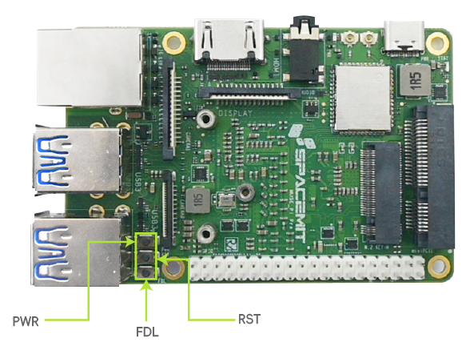

# 1.2.1 MUSE Pi Pro

## Button Overview

The Muse Pi Pro development board is equipped with multiple buttons.  
For firmware flashing, you will mainly use:
- **FDL (Firmware Download) button**
- **RST (Reset) button**

The figure below shows their locations on the board:

## Firmware Flashing via Type-C Cable

This section explains how to flash firmware from your PC to the Muse Pi Pro development board using a Type-C data cable.

### Step 1: Download the Firmware

Download the latest Bianbu ROS firmware from the following link:
[Bianbu ROS Firmware](https://archive.spacemit.com/ros2/bianbu-ros-images/v1.4/bianbu-24.04-ROS-lite-k1-dailybuild-20251022.zip)

### Step 2: Enter Flashing Mode

Follow these steps to switch the development board into flashing mode:

1. Connect your PC and the Muse Pi Pro via a **Type-C data cable**.
2. Press and hold the **FDL** button.
3. While holding FDL, briefly press the **RST** button once.
4. Release the **FDL** button.

The device is now in flashing mode.

### Step 3: Flash the Firmware

Once the board is in flashing mode:

1. Follow the instructions in the [Bianbu Flashing Tool Manual](https://developer.spacemit.com/documentation?token=QvyiwM3j4iacSakZGibcAPG5nXg) to flash the firmware.
2. After flashing is complete, press the **RST** button to reboot the device and start the system.