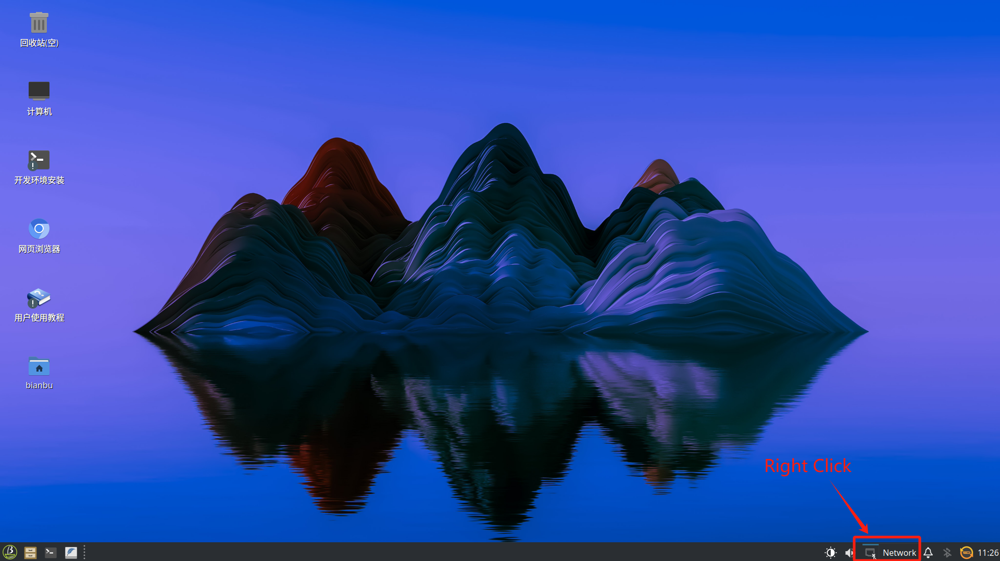
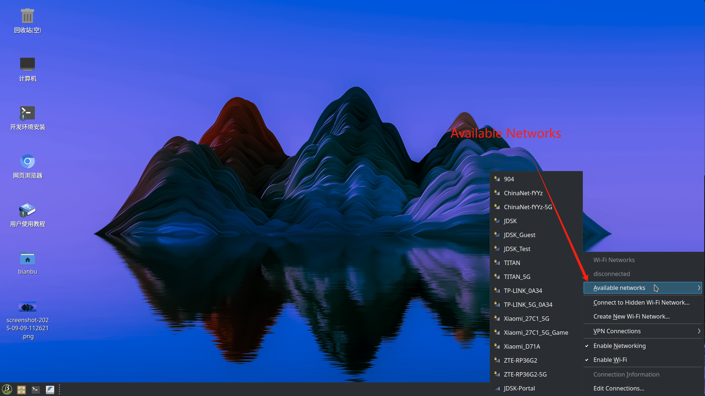
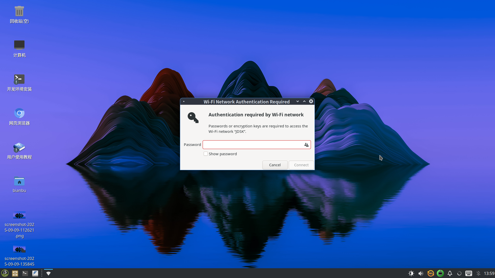

# 1.3 Basic Configuration

This section explains the essential setup tasks for first-time users of the Bianbu ROS system, including network configuration, remote access, and related services.

## Network Setup

Bianbu ROS supports both **wired Ethernet** and **Wi-Fi** connections.  
We recommend configuring the network first to enable remote management and system updates.

### Connecting via Ethernet

1. Plug the Ethernet cable into the board’s Ethernet port.  
2. The system uses DHCP by default to obtain an IP address automatically.  
3. Run the following command to verify the network status:

   ```bash
   ip addr
   ```

4. Look for an interface named `end*` (e.g., `end0`). The `inet` field under this interface shows your current IP address.

### Connecting via Wi-Fi

ROS2_LXQT supports Wi-Fi configuration via either the **command line** or the **graphical interface**.

#### Option 1: Command-Line

1. List available Wi-Fi networks:

   ```bash
   nmcli device wifi list
   ```

   This command shows available networks along with their SSID, signal strength, and security type.

2. Connect to a Wi-Fi network:

   ```bash
   nmcli device wifi connect <SSID> password <your_wifi_password>
   ```

   - `<SSID>` – replace it with your Wi-Fi network name
   - `<your_wifi_password>` – replace it with the corresponding password

   After a successful connection, the system saves the configuration and will reconnect automatically on reboot.

#### Option 2: Graphical Interface

1. Right-click the **network icon** in the system tray and select network settings:
   

2. Choose **Available Networks** and Click the name of the desired Wi-Fi network from the list:
   

3. Enter the password and click **Connect**:
   

## Enabling SSH Access

The SSH service is enabled by default. Verify its status with:

```bash
systemctl status ssh
```

If it is not running, start and enable it manually:

```bash
sudo systemctl start ssh
sudo systemctl enable ssh
```

Once active, you can log in remotely using any SSH client.
For details, see **Section [SSH Login](1.4_Remote_Access.md#ssh-login)**

## Enabling VNC Access

Bianbu ROS supports remote desktop access using **VNC**, which is useful for GUI operations, debugging, and visualization tasks.

### Start the VNC Service

Run the following command in a terminal to start VNC and allow connections from any host on the LAN:

```bash
wayvnc 0.0.0.0
```

This command listens on all network interfaces so that any device on the local network can connect to the desktop.

### Restrict Access to Specific Hosts

To limit desktop access to a particular client, specify its IP address. For example:  

```bash
wayvnc 192.168.9.109
```

Only the host with IP `192.168.9.109` will be allowed to connect.

For details on using remote desktop, see **Section [VNC Login](1.4_Remote_Access.md#vnc-login)**