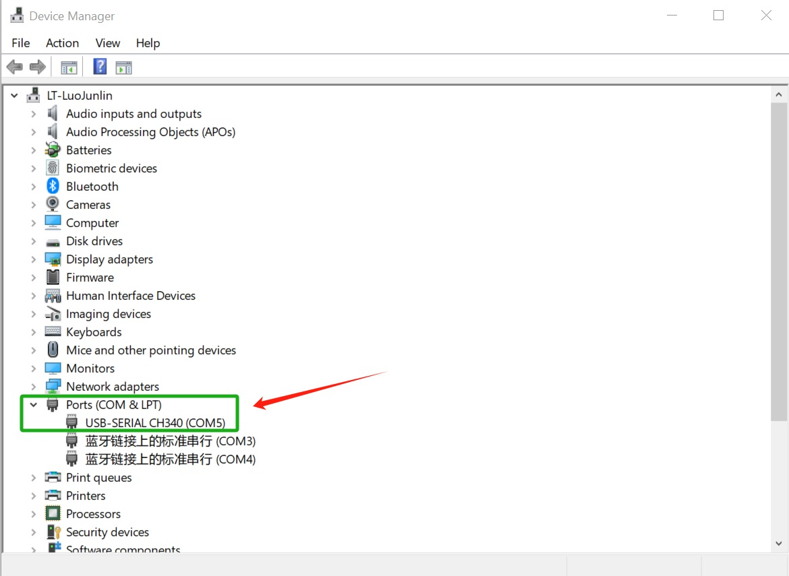

# 1.4 Remote Access

This guide explains how to remotely connect to your Bianbu ROS board from a PC using **Serial**, **SSH**, or **VNC**. It includes connection methods, step-by-step instructions, and tool setup.

## Serial Port Login

Serial port access is useful for debugging, monitoring firmware flashing, or working without a network connection.

### Hardware Connection

Connect your PC to the MUSE Pi Pro board using a USB-to-TTL adapter. Attach the **GND**, **TX**, and **RX** pins as shown:


### Login on Windows

Using **MobaXterm** as an example:

1. Connect the serial adapter and check **Device Manager** to find the COM port (e.g., COM5).
   

2. Open MobaXterm → **Sessions → New Session**, then select **Serial**.

3. In the configuration Session:  
   - **Serial port**: Select the detected COM port (e.g., COM5)  
   - **Speed**: Set to **115200**  
   - Click **OK** to open the terminal session.  

   

### Login on Ubuntu

1. Check the available serial devices:  

   ```bash
   ls -al /dev/ttyUSB*
   ```

2. If the device is `/dev/ttyUSB0`, connect using the tool `minicom`:

   ```bash
   sudo minicom -D /dev/ttyUSB0
   ```

   If `minicom` is not installed, run:

   ```bash
   sudo apt install minicom
   ```

   For first-time setup on `minicom`, configure the baud rate:

   ```bash
   sudo minicom -s
   ```

   Set **Serial port speed** to `115200` and save the configuration.

> 💡 **Tip:** If login fails or get a permission error, add your user to the `dialout` group:
>
> ```bash
> sudo usermod -aG dialout $USER
> ```

## SSH Login

SSH is a common way to access the development board remotely over a local network.

>**Note:** Ensure the board is connected to the network.
> For instructions, see Section **[Network Setup](1.3_Environment_Setup.md#network-setup)**.

### Connecting from (using MobaXterm)

Using **MobaXterm** as recommended:

1. Open MobaXterm → **Sessions → New Session**, then select **SSH**.
2. Configure SSH Settings:

   - **Remote host**: Enter the board’s IP address (e.g., `192.168.1.100`)
   - **Specify username**: Keep default `bianbu`
   - **Port**: Keep default `22`
3. Click **OK**, then enter the password to log in.

### Connecting from Ubuntu

Open a terminal and run:

```bash
ssh bianbu@<remote_ip>
```

Replace `<remote_ip>` with the board’s IP address.
On first login, confirm the fingerprint by typing `yes`.

## VNC Login

VNC provides remote graphical desktop access and requires the VNC service to be running on the development board.

> For enabling VNC, see: [1.3 Enable VNC Service](1.3_Environment_Setup.md#enable-vnc-service).

### Connecting from Windows

Using **RealVNC Viewer** as recommended:

1. Launch VNC Viewer.
2. Enter the address `<remote_ip>:5900` (e.g., `192.168.1.100:5900`) in the address bar.
3. Press Enter to connect.


### Connecting from Ubuntu

Using **Remmina** as recommended:

1. Install Remmina:

   ```bash
   sudo apt update
   sudo apt install remmina remmina-plugin-rdp remmina-plugin-vnc remmina-plugin-secret
   ```

2. Launch Remmina:

   ```bash
   remmina
   ```

3. Configure connection:

   - Select **VNC** as the protocol
   - Enter `<remote_ip>:5900` (e.g., `192.168.1.100:5900`) in the address bar.
   - Press Enter to connect


