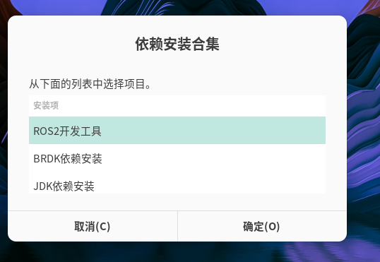

# 2.3 System Dependency Installation

```
Last Version: 10/09/2025
```

You can quickly install all required dependencies for **BRDK**, **JDK**, and **ROS2** with a single click using the desktop shortcut.

1. **Launch the installer**
   Double-click the **Development Environment Installation** icon on the desktop:


2. **Execute the installer**
   In the pop-up window, click **Execute**:


3. **Select dependencies and confirm**

   - Choose the components you want to install.
   - Click **Confirm**.
   - A password prompt will appear; enter the default password: **bianbu**.

