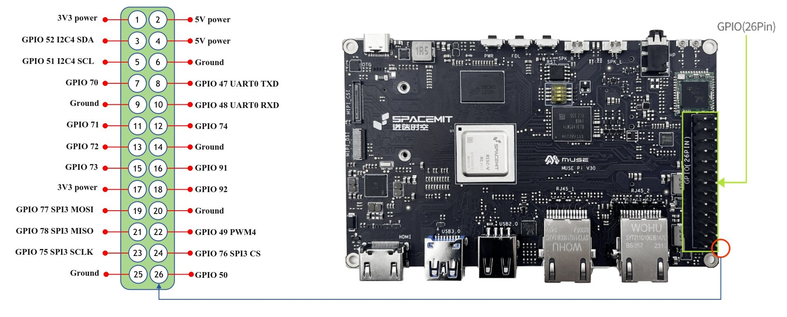
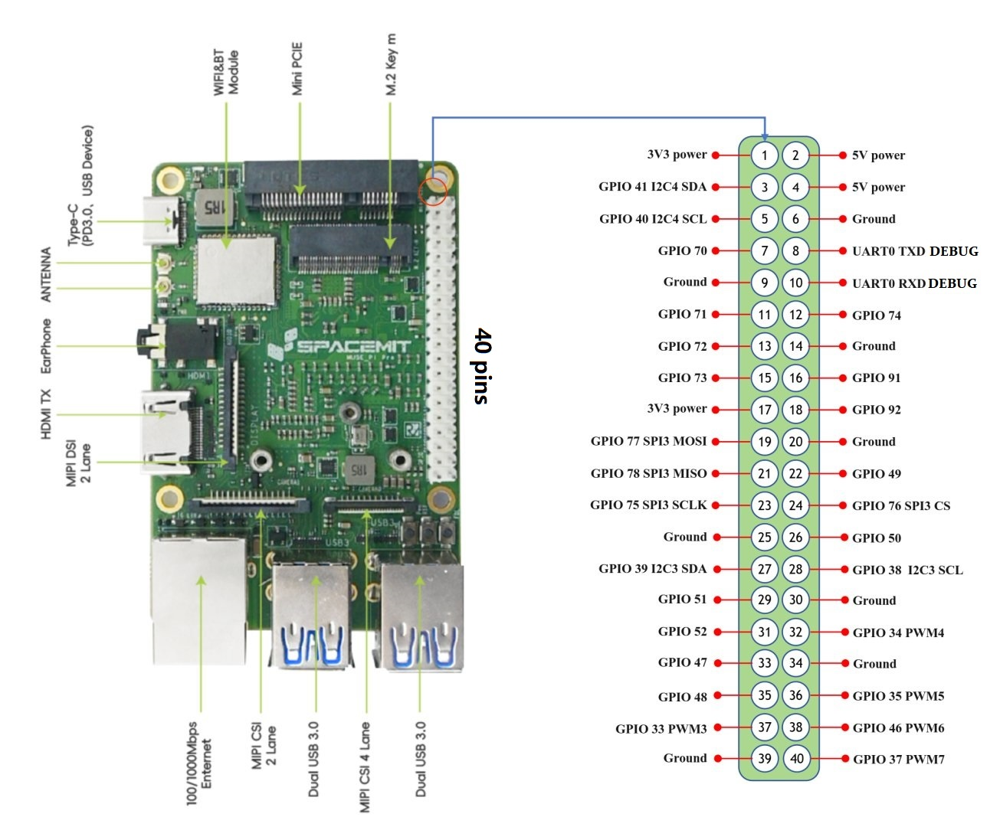
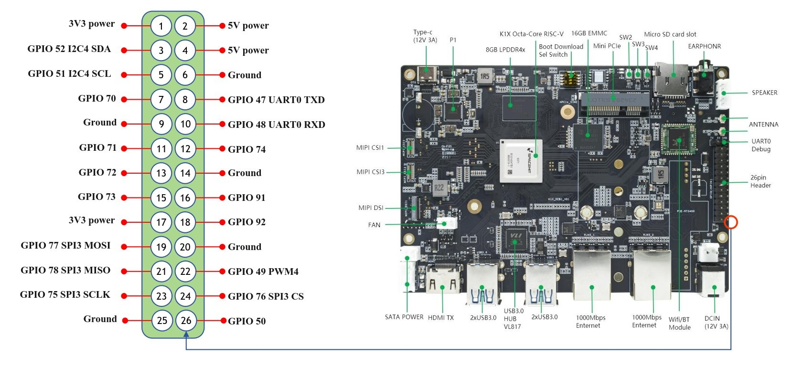
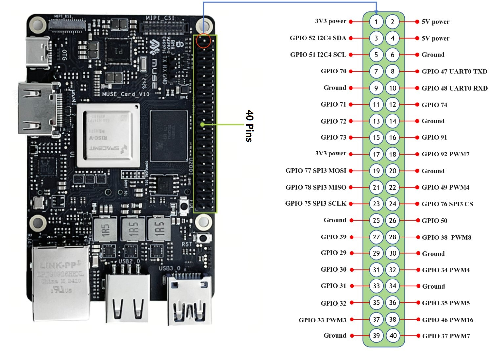
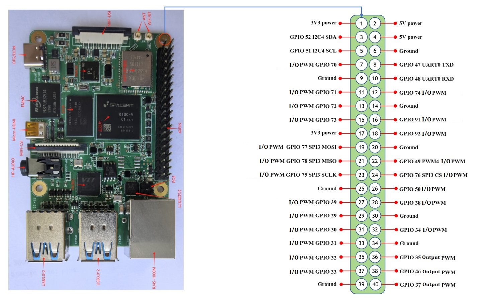

sidebar_position: 1

# 3.3.1 Pin Definition Description

AI Robot supports several types of main control boards. All boards provide standardized pin interfaces, making it easy to connect peripherals and expand functionality. This section summarizes the pin definitions for each supported board.

## MUSE Pi

## MUSE Pi Pro

## BPI-F3

## MUSE BOOK

## MUSE Card

## RV4B

**Pin Function Description:**

- **Input**:
  - Receives electrical signals.
  - Commonly used to read peripheral status, such as button presses, using libraries like `gpiozero`.

- **Output**:
  - Outputs high or low voltage levels (0V or 3.3V).
  - Typically used to control LEDs or relays.

- **PWM (Pulse Width Modulation)**:
  - Supports PWM waveform output.
  - Can control servos, motors, or create effects like breathing/fading lights.
