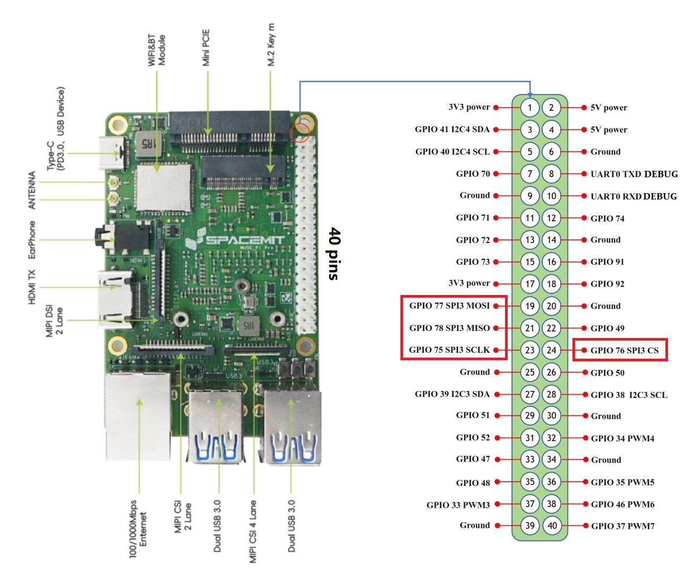

sidebar_position: 5

# 3.3.5 SPI Usage Instructions

This guide explains how to configure and use the SPI interface on the development board.

## Overview

SPI (Serial Peripheral Interface) is a serial communication interface commonly used between SoCs and peripherals.
It supports **single-lane (x1) mode only** on this platform.

SPI operates in two modes: **Master** and **Slave**, typically with one master device controlling one or more slave devices.

> **Note:** On K1, SPI currently supports **master mode only**.

**Pin Functions**

Pin                                 | Description
-------------------------------------|-------------------------------|
SCLK (Serial Clock)                  | Clock signal
MISO (Master In Slave Out)           | Data from slave to master
MOSI (Master Out Slave In)           | Data from master to slave
CS/SS (Chip Select / Slave Select)   | Slave device selection

## Pin Reference

Refer to the [Pin Definition Description](3.3.1_Pin_Definitions.md) for available SPI pins on your board.

For example, on **MUSE-Pi-Pro**, supported SPI pins are shown below:



## Checking Device Information

- **List SPI bus devices and driver info**

   ```bash
   ls /sys/bus/spi
   ```

   Example output:

   ```
    spi--
       |-- devices         //Devices on the SPI bus
       |-- drivers         //Device drivers registered on the SPI bus
       |-- drivers_autoprobe
       |-- drivers_probe
   ```

- **Inspect a specific SPI device:**

   ```bash
   ls -la /sys/bus/spi/devices/spi3.0
   ```

- **Check the device modalias (driver name):**

   ```bash
   cat /sys/bus/spi/devices/spi3.0/modalias
   ```

- **Check the device maximum frequency:**

   ```bash
   cat /sys/bus/spi/devices/spi3.0/of_node/spi-max-frequency
   ```

## Enabling SPI

SPI pins (GPIO75, 76, 77, 78) are multiplexed with other functions.
Before using SPI, you must disable any conflicting devices in the device tree (DTS).

Two approaches are available (choose one):

- **Method A:** Download and install a pre-built DTB file
- **Method B:** Manually edit and recompile the DTS

### Method A: Download Pre-compiled DTB File

- Download a preconfigured DTB file:

   ```bash
   wget https://archive.spacemit.com/ros2/prebuilt/brdk_libs/spi/k1-x_MUSE-Pi-Pro.dtb
   ```

- Save it to `/boot/spacemit/6.6.63/`, replacing the existing DTB.

### Method B: Manual DTS Modification and Compilation

1. **Extract the DTS from the current DTB**

   ```bash
   cd /boot/spacemit/6.6.63/       // DTS location

   sudo apt update
   sudo apt install device-tree-compiler      // Compiler installation

   sudo dtc -I dtb -O dts -o k1-x_MUSE-Pi-Pro.dts k1-x_MUSE-Pi-Pro.dtb            // Decompile DTB to DTS

   ls
   // Verify successful decompilation with k1-x_MUSE-Pi-Pro.dts
   ```

2. **Modify Device Tree**
   Edit `k1-x_MUSE-Pi-Pro.dts` and modify these two SPI nodes:

   - **Modify spi@d420c000 node:**
     - Disable original node and flash subnode: set `status = "disabled"`
     - Add spi@3 subnode

   - **Modify spi@d401c000 node：**
     - Add spi@3 subnode

   Specific modifications as below:

   ```C
   // Modify spi@d420c000 node
   spi@d420c000 {
                        compatible = "spacemit,k1x-qspi";
                        #address-cells = <0x01>;
                        #size-cells = <0x00>;
                        reg = <0x00 0xd420c000 0x00 0x1000 0x00 0xb8000000 0x00 0xc00000>;
                        reg-names = "qspi-base\0qspi-mmap";
                        k1x,qspi-sfa1ad = <0x4000000>;
                        k1x,qspi-sfa2ad = <0x100000>;
                        k1x,qspi-sfb1ad = <0x100000>;
                        k1x,qspi-sfb2ad = <0x100000>;
                        clocks = <0x03 0x8f 0x03 0x90>;
                        clock-names = "qspi_clk\0qspi_bus_clk";
                        resets = <0x1d 0x4e 0x1d 0x4f>;
                        reset-names = "qspi_reset\0qspi_bus_reset";
                        k1x,qspi-pmuap-reg = <0xd4282860>;
                        k1x,qspi-mpmu-acgr-reg = <0xd4051024>;
                        k1x,qspi-freq = <0x1945ba0>;
                        k1x,qspi-id = <0x04>;
                        power-domains = <0x20 0x00>;
                        cpuidle,pm-runtime,sleep;
                        interrupts = <0x75>;
                        interrupt-parent = <0x1e>;
                        k1x,qspi-tx-dma = <0x01>;
                        k1x,qspi-rx-dma = <0x01>;
                        dmas = <0x21 0x2d 0x01>;
                        dma-names = "tx-dma";
                        interconnects = <0x22>;
                        interconnect-names = "dma-mem";
                        status = "disabled"; // Disable this node
                        pinctrl-names = "default";
                        pinctrl-0 = <0x5b>;

                        flash@0 {
                                compatible = "jedec,spi-nor";
                                reg = <0x00>;
                                spi-max-frequency = <0x1945ba0>;
                                m25p,fast-read;
                                broken-flash-reset;
                                status = "disabled"; // Disable flash subnode
                        };
                        // Add spi@3 subnode
                        spi@3 {
                                compatible = "cisco,spi-petra";
                                reg = <0x0>;
                                spi-max-frequency = <6400000>;
                                status = "okay";
                        };
                };
   ```

   ```bash
   // Modify spi@d401c000 node  
   spi@d401c000 {
                        compatible = "spacemit,k1x-spi";
                        reg = <0x00 0xd401c000 0x00 0x34>;
                        k1x,ssp-id = <0x03>;
                        k1x,ssp-clock-rate = <0x186a000>;
                        dmas = <0x21 0x14 0x01 0x21 0x13 0x01>;
                        dma-names = "rx\0tx";
                        power-domains = <0x20 0x00>;
                        cpuidle,pm-runtime,sleep;
                        interrupt-parent = <0x1e>;
                        interrupts = <0x37>;
                        clocks = <0x03 0x58>;
                        resets = <0x1d 0x18>;
                        #address-cells = <0x01>;
                        #size-cells = <0x00>;
                        interconnects = <0x22>;
                        interconnect-names = "dma-mem";
                        status = "okay";
                        pinctrl-names = "default";
                        pinctrl-0 = <0x2e>;
                        k1x,ssp-disable-dma;
 
                        // Add spi@3 subnode
                        spi@3 {
                                compatible = "cisco,spi-petra";
                                reg = <0x0>;
                                spi-max-frequency = <6400000>;
                                status = "okay";
                        };

                };
   ```

3. **Compile New Device Tree**

   ```bash
   sudo dtc -I dts -O dtb -o k1-x_MUSE-Pi-Pro.dtb k1-x_MUSE-Pi-Pro.dts
   ```

4. **Update Kernel Image**

   ```bash
   wget https://archive.spacemit.com/ros2/prebuilt/brdk_libs/spi/vmlinuz-6.6.63

   // Copy to /boot/ directory, replacing old vmlinuz-6.6.63 image
   ```

5. **Reboot Development Board**

   ```bash
   sudo reboot
   ```

   After reboot, the device should appear as `/dev/spi3.0`.

## Usage Example

- **Wiring master and slave devices**

   ```bash
   Connect as below:
   Master Device         <===>        Slave Device
       SCK          -------------->         SCK
       MOSI         -------------->         MOSI (or SDI)
       MISO         <--------------         MISO (or SDO)
       CS0          -------------->         CS (or nSS)
   ```

- **List available SPI devices**

   ```bash
   ls /dev/spi*

   # Expected output: spi3
   ```

- **SPI Master Example Code**

```bash
//spi_master.c

#include <stdio.h>
#include <stdlib.h>
#include <fcntl.h>
#include <unistd.h>
#include <sys/ioctl.h>
#include <linux/spi/spidev.h>
#include <string.h>
#include <stdint.h>

#define SPI_DEV "/dev/spidev3.0"
#define BUF_SIZE 32

static uint32_t mode = SPI_MODE_0;
static uint8_t bits = 8;
static uint32_t speed = 1000000;

int spi_init()
{
    int fd = open(SPI_DEV, O_RDWR);
    if (fd < 0) {
        perror("Failed to open SPI device");
        return -1;
    }

    if (ioctl(fd, SPI_IOC_WR_MODE, &mode) < 0) {
        perror("Failed to set SPI mode");
        goto error;
    }

    if (ioctl(fd, SPI_IOC_WR_BITS_PER_WORD, &bits) < 0) {
        perror("Failed to set word length");
        goto error;
    }

    if (ioctl(fd, SPI_IOC_WR_MAX_SPEED_HZ, &speed) < 0) {
        perror("Failed to set SPI speed");
        goto error;
    }

    return fd;

error:
    close(fd);
    return -1;
}

int spi_transfer(int fd, uint8_t *tx_buf, uint8_t *rx_buf, int len)
{
    struct spi_ioc_transfer tr =
    {
        .tx_buf = (unsigned long)tx_buf,
        .rx_buf = (unsigned long)rx_buf,
        .len = len,
        .speed_hz = speed,
        .bits_per_word = bits,
        .delay_usecs = 0,
    };

    if (ioctl(fd, SPI_IOC_MESSAGE(1), &tr) < 1) {
        perror("SPI transfer failed");
        return -1;
    }

    return 0;
}

int main()
{
    int fd = spi_init();
    if (fd < 0) return 1;

    uint8_t tx_buf[BUF_SIZE] = {0};
    uint8_t rx_buf[BUF_SIZE] = {0};

    tx_buf[0] = 0x9f;
    spi_transfer(fd, tx_buf, rx_buf, strlen((char *)tx_buf) + 3);
    printf("Slave response: %x%x%x%x\n", rx_buf[0], rx_buf[1], rx_buf[2], rx_buf[3]);


    while (1)
    {
        printf("Master> ");
        fgets((char *)tx_buf, BUF_SIZE, stdin);


        if (strncmp((char *)tx_buf, "quit", 4) == 0) break;


        if (spi_transfer(fd, tx_buf, rx_buf, strlen((char *)tx_buf) + 3) == 0) {
            printf("Slave response: %x%x%x%x\n", rx_buf[0], rx_buf[1], rx_buf[2], rx_buf[3]);
        }

        memset(tx_buf, 0, BUF_SIZE);
        memset(rx_buf, 0, BUF_SIZE);
    }

    close(fd);
    return 0;
}
```

- **Cross-compile on the host:**

   ```bash
   riscv64-unknown-linux-gnu-gcc -O2 -mcpu=spacemit-x60 -march=rv64gc_zba_zbb_zbc_zbs spi_master.c -o spi_master
   ```

   For tool installation and usage, please refer to [Cross-Compilation Toolchain](https://www.spacemit.com/community/document/info?lang=en&nodepath=tools/user_guide/cross_compiler_user_guide.md)

- **Copy executable to board:**
  
   ```bash
   scp spi_master bianbu@10.0.91.35:/home/bianbu
   ```

   **Description:**

  - `scp` - SSH remote secure copy command
  - `spi_master` - Executable filename
  - `bianbu` - Development board username
  - `10.0.91.35` - Board IP address (check with `hostname -I`)
  - `/home/bianbu` -  Destination directory

   > **Note:** Ensure host and development board are on the same network.

- **Run on development board:**

   ```bash
   sudo ./spi_master
   ```

   Expected output:

   ```
   Slave response: 0000
   Master> 9f
   Slave response: 0000
   ```
