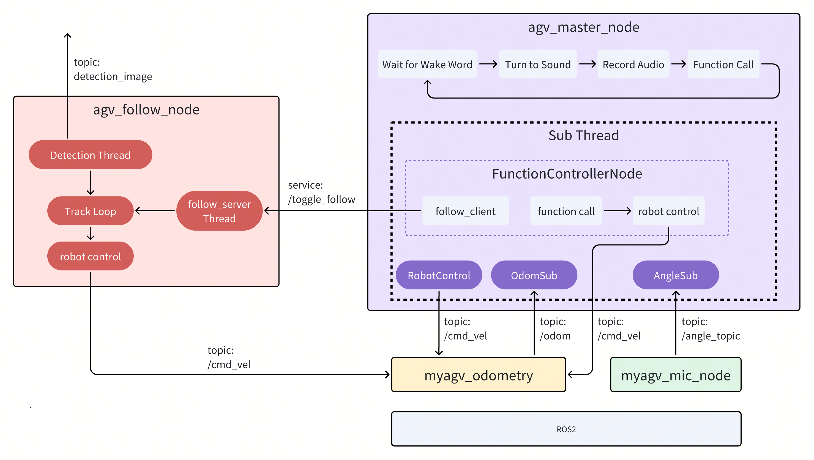

# Human-Following AGV

```
Last Version: 19/09/2025
```

Watch the [Demo Video](https://archive.spacemit.com/ros2/Video_examples/agv-follow.mp4)

## Overview

This demo showcases the **K1 platform** controlling an **AGV** to perform multimodal interaction and autonomous navigation.

The system is deeply integrated with the **ROS 2 framework**, enabling:

- **High-precision path planning**
- **Dynamic obstacle avoidance**
- **Reliable human-following** capabilities

Using a **Function Call architecture**, the AGV supports real-time voice commands, allowing users to interact naturally.

This solution combines **environment sensing**, **motion control**, and **voice interaction** into an intelligent human–machine collaboration system. It highlights the potential of K1-based AGVs for **smart home service** and **industrial applications**.

## Hardware

- 1 x K1 Development Board (with power supply)
- 1 x Wheeltec Educational ROS AGV
- 1 x Monocular Camera
- 1 x Ring Microphone
- 1 x USB Sound Card or Speaker

## System Framework and Control Flow



The figure above shows the overall framework and process control of the AGV human-following case in the ROS2 system. It is mainly composed of the following **four nodes**:

1. `agv_master_node`
Master control node, responsible for overall process management.
   - Listens to the `/angle_topic` topic to obtain wake-up status and wake-up angle information;
   - Publishes to the `/cmd_vel` topic to control the AGV to turn to the target angle;
   - Calls `spacemit_audio/record.py` to perform recording, and executes function calls based on the recording (managed by the FunctionControllerNode);
   - Decides whether to start following based on the voice command result (triggered via the `/toggle_follow` service);
   - Other control commands are published directly through `/cmd_vel`.

2. `agv_follow_node`
Visual-following node, responsible for tracking the target person.
   - The vision thread detects the person closest to the center in the image and publishes the `/detection_image` topic to the main thread;
   - The main thread calculates and publishes `/cmd_vel` to control AGV velocity based on detection data;
   - The service thread listens to the `/toggle_follow` service to control whether following is enabled.

3. `myagv_mic_node`
Microphone node, responsible for sound source localization and voice wake-up.
   - Performs sound source detection and publishes `/angle_topic` (including angle + wake-up status).

4. `myagv_odometry`
Chassis node, provides the robot car’s position (`/odom`) and receives control commands (`/cmd_vel`).
   - Moves the AGV according to `/cmd_vel`;
   - Publishes `/odom` for the master control node to determine orientation;
   - Can be replaced with a real or simulated chassis control module.

## Environment Setup

Follow these steps to set up the environment for the AGV human-following system.

### Step 1: Download the Main Program Code

Clone the main program repository:

```bash
git clone https://github.com/elephantrobotics/jobot-ai-elephant.git ~/
```

### Step 2: Install System Dependencies

Update the system and install required libraries:

```bash
sudo apt update
sudo apt install -y \
  libopenblas-dev \
  portaudio19-dev \
  python3-dev \
  ffmpeg \
  python3-spacemit-ort \
  libcjson-dev \
  libasound2-dev
```

### Step 3: Install ROS 2 Dependencies

1. Install dependency ROS 2 packages

   ```bash
   sudo apt install -y ros-dev-tools ros-humble-ros-base python3-venv ros-humble-xacro \
     ros-humble-joint-state-publisher ros-humble-'tf2*' \
     ros-humble-'nav*' ros-humble-slam-toolbox ros-humble-tf-transformations
   ```

2. Build the AGV’s ROS 2 package:

   ```bash
   mkdir -p ~/agv_ws/src
   cd ~/agv_ws/src
   git clone https://gitee.com/cookieee/agv-elephant-ros2-pkgs.git

   cd ~/agv_ws/
   source /opt/ros/humble/setup.zsh
   colcon build
   ```

### Step 4: Install Python Dependencies

1. Create a Python virtual environment:

   ```bash
   virtualenv ~/audio-env
   ```

2. Configure the pip source to use the SpacemiT mirror

   ```bash
   pip config set global.extra-index-url https://git.spacemit.com/api/v4/projects/33/packages/pypi/simple
   pip config set --extra-index-url https://mirrors.tuna.tsinghua.edu.cn/pypi/web/simple
   ```

3. Install Python dependencies:

   ```bash
   cd ~/jobot-ai-elephant/spacemit_audio
   source ~/audio-env/bin/activate
   pip install -r requirements.txt

   # Install OpenCV dependencies
   pip install lap transforms3d cython-bbox opencv-python==4.6.8.1
   ```

### Step 5: Configure Device Rules (udev)

1. Set up udev rules to map hardware devices to system device indices

   ```Bash
   echo 'KERNEL=="ttyACM*", ATTRS{idVendor}=="1a86", ATTRS{idProduct}=="55d4",MODE:="0777",SYMLINK+="wheeltec_mic"' >/etc/udev/rules.d/myagv_mic.rules

   echo 'KERNEL=="ttyACM*", ATTRS{idVendor}=="1a86", ATTRS{idProduct}=="55d3",MODE:="0777",SYMLINK+="agv_odom"' >/etc/udev/rules.d/myagv_odom.rules

   echo  'KERNEL=="ttyUSB*", ATTRS{idVendor}=="1a86", ATTRS{idProduct}=="7523",MODE:="0777",SYMLINK+="agv_lidar"' >/etc/udev/rules.d/myagv_lidar.rules
   ```

2. Apply the rules:

   ```
   sudo udevadm control --reload-rules
   sudo udevadm trigger
   ```

### Step 6: Compile the YDLidar SDK

Compile and install the YDLidar SDK for LiDAR support:

```Bash
git clone https://github.com/YDLIDAR/YDLidar-SDK.git ~
cd ~/YDLidar-SDK
mkdir build && cd build
cmake ..
cmake --build . -- -j8
sudo cmake --install .
```

### Step 7: Set Audio Permissions

Run the following command to add the current user to the `audio` group, granting access to and management of audio devices:

```bash
sudo usermod -aG audio $USER
```

## Launch the Program

Follow these steps to start the AGV human-following system.

### Step 1: Start ROS

1. Source the ROS environment

   ```Bash
   source /opt/ros/humble/setup.zsh
   source ~/agv_ws/install/setup.zsh
   ```

2. Launch the chassis control node

   ```Bash
   ros2 launch myagv_odometry myagv_only_move.launch.py
   ```

3. Start the voice wake-up service

   ```Bash
   ros2 run jobot_mic myagv_mic_node
   ```

### Step 2: Start Python Nodes

1. Source the ROS environment

   ```Bash
   source /opt/ros/humble/setup.zsh
   ```

2. Activate the Python virtual environment

   ```bash
   source ~/audio-env/bin/activate
   ```

3. Launch the following node

   ```Bash
   cd ~/jobot-ai-elephant
   python agv_follow_node.py
   ```

4. Launch the AI pipeline node:

   ```Bash
   cd ~/jobot-ai-elephant
   python agv_master_node.py
   ```

### Notes

- **Wake-Up Phrase**: Say **"Xiao Wei Xiao Wei"** to activate the system.
  - For each wake-up, the AGV stops its current movement, rotates toward the sound source, and starts recording (up to 5 seconds).

- **Voice Commands**:
  - "Follow me"
  - "Stop following"
  - "Spin in place"
  - "Move forward"
  - "Move backward"
  - "Move forward two steps"
  - "Move backward two steps"
  - "Turn left"
  - "Turn right"
