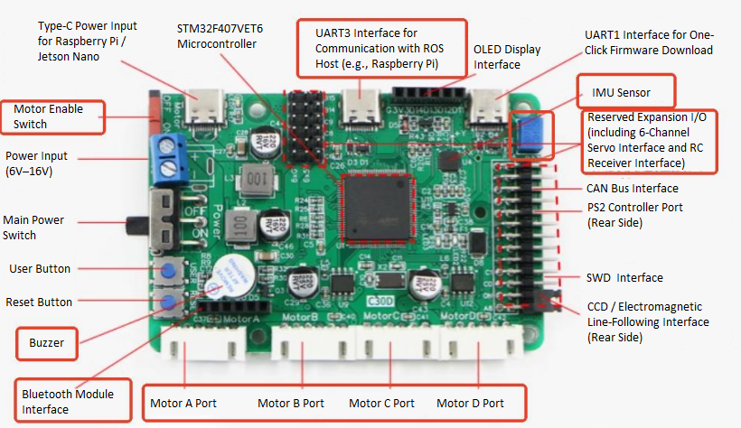

sidebar_position: 1

# Wheeltec ROS Differential Drive Robot Adaptation

## Overview

This demo showcases how to integrate the **K1 Board** with the **Wheeltec ROS Differential Drive Robot**.

A complete ROS robot system usually includes four core parts:

- **Motion Chassis (Execution)**
- **ROS Master (Decision-Making)**
- **Sensors (Perception)**
- **Battery (Power Source)**

The **Battery Module** is built into the **Chassis Module** and provides power to all other modules via electrical wiring. Data communication between the **Chassis Module**, **ROS Master Module**, and **Sensor Modules** is also handled through electrical connections.

This case shows how to use the **K1 Board** as the ROS Master controller for the Wheeltec differential drive robot and implement motion control.

## Hareware

- 1 × **Spacemit K1 Board**
- 1 × **Wheeltec ROS Differential Drive Robot**

## Environment Setup

### K1 Development Board

**Hardware Specifications**

The K1 development board integrates an **8-core RISC-V processor**, storage, general-purpose interfaces, and expansion ports on a single PCB. It supports **UEFI boot** and can run various operating systems and applications, making it a complete computer system.

This example shows how to replace the Raspberry Pi on the Wheeltec robot with the K1 board as the ROS master.

- **Power:** Can be supplied via the Type-C port on the motion chassis (STM32) controller (5V) or directly from the battery (12V).
- **Signals:** All sensor connections (motion chassis, LiDAR, camera) to the K1 board are made via USB interfaces.


All sensors on the Wheeltec ROS Drive robot connect to the K1 board, with specific integration methods detailed in the sections below.

### Motion Chassis (Wheeltec STM32 Controller)

**Hardware Specifications**
The Wheeltec Educational ROS Differential Drive Robot uses an **STM32 all-in-one control board** as its chassis.



- **Power Supply**: Sourced from the battery, distributed to other components via T-cables or splitter cables.
- **Signals**: Originate from the K1 board, connected via dedicated cables to control motor and wheel movement.

**Adaptation Procedure**

1. Connect the chassis power cable (TypeC-to-TypeC) to the K1 board.

2. Turn on the chassis power switch and wait for the K1-Bianbu-desktop system to boot.

3. Connect the chassis signal cable (TypeC-to-USB) to the K1 board.

4. Open a new terminal on the K1 board and run:

   ```shell
   sudo dmesg | tail -20
   ```

   Look for output like this to confirm the chassis USB port (e.g., `/dev/ttyACM0`):

   ```shell
   [ 1673.471036] usb 2-1.1: new full-speed USB device number 8 using xhci-hcd
   [ 1673.675568] cdc_acm 2-1.1:1.0: ttyACM0: USB ACM device
   ```

5. Based on your port number, check device details:

   ```shell
   udevadm info -a -n /dev/ttyACM0
   ```

   Look for output like this to have the `ATTRS{serial}` attribute

   ```shell
   ATTRS{product}=="USB Single Serial"
   ATTRS{serial}=="0002"
   ATTRS{serial}=="xhci-hcd.0.auto"
   ```

6. Remap the chassis Udev rule to fix the USB serial device name:

   ```shell
   echo 'SUBSYSTEM=="tty", ATTRS{serial}=="0002", MODE:="0777",SYMLINK+="wheeltec_controller"' | sudo tee /etc/udev/rules.d/wheeltec_controller.rules
   ```

7. Reload the udev rules to apply the change:

   ```shell
   sudo udevadm control --reload-rules
   sudo udevadm trigger
   ```

**Test Operation**

- One a terminal (Terminal 1), compile and test the Wheeltec-provided ROS 2 chassis package :
**Note:** Comment out the line `<depend>ackermann_msgs</depend>` in the `turn_on_wheeltec_robot/package.xml` file before building.

   ```shell
   sudo apt update
   sudo apt install ros-humble-turtlesim ros-humble-navigation2 ros-humble-joint-state-publisher ros-humble-robot-localization teleop_twist_keyboard
   colcon build --packages-select serial turn_on_wheeltec_robot wheeltec_robot_msg wheeltec_robot_urdf
   source install/setup.bash
   ros2 launch turn_on_wheeltec_robot turn_on_wheeltec_robot.launch.py
   ```

- On a new terminal (Terminal 2), start the keyboard control node:

   ```shell
   ros2 run teleop_twist_keyboard teleop_twist_keyboard
   ```

- You can now control the robot's movement using the keyboard keys as displayed in the terminal.

### LiDAR (Leishen M10P)

**Hardware Specifications**
The Wheeltec ROS Differential Drive Robot uses a Leishen Intelligent **M10P** LiDAR.

- **Power & Signals:** Connected to the K1 board via a USB interface.


**Adaptation Procedure**

1. Connect the LiDAR data cable (TypeC-to-USB) to the K1 board.

2. Open a new terminal and run:

   ```shell
   sudo dmesg | tail -20
   ```

   Look for output like this to confirm the LiDAR USB port (e.g., `/dev/ttyACM1`):

   ```shell
   [ 4562.938371] usb 2-1.3: new full-speed USB device number 9 using xhci-hcd
   [ 4563.146987] cdc_acm 2-1.3:1.0: ttyACM1: USB ACM device
   ```

3. Based on your port number, check device details:

   ```shell
   udevadm info -a -n /dev/ttyACM1
   ```

   Look for output like this to confirm the `ATTRS{serial}`:

   ```shell
   ATTRS{product}=="USB Single Serial"
   ATTRS{serial}=="5A6D016420"
   ATTRS{serial}=="xhci-hcd.0.auto"
   ```

4. Remap the LiDAR Udev rule to fix the USB serial device name:

   ```shell
   echo 'SUBSYSTEM=="tty", ATTRS{serial}=="5A6D016420", MODE:="0777",SYMLINK+="wheeltec_lidar"' | sudo tee /etc/udev/rules.d/wheeltec_lidar.rules
   ```

5. Reload the udev rules to apply the change:

   ```shell
   sudo udevadm control --reload-rules
   sudo udevadm trigger
   ```

**Test Operation**

- Compile and test the Wheeltec-provided LiDAR ROS 2 package:

   ```shell
   colcon build --packages-select wheeltec_lidar_ros2
   source install/setup.bash
   ros2 launch lslidar_driver lsm10p_uart_launch.py
   ```

- On a PC in the same network, use RViz2 to view LiDAR data:
   - Open a terminal (Terminal 1) and publish a static transform for the LiDAR:

     ```shell
     ros2 run tf2_ros static_transform_publisher 0 0 0 0 0 0 base_link laser
     ```

   - Open another terminal (Terminal 2) and launch RViz2:

     ```shell
     ros2 run rviz2 rviz2
     ```

   - In RViz2, set the **Fixed Frame** to `laser`, click **Add** > **By Topic** > `/scan`, and click **OK**. You should see LiDAR data like this:

     

### Camera (C70 RGB Camera)

**Hardware Specifications**
The Wheeltec robot uses a **C70** monocular RGB camera.
- **Power & Signals:** Connected to the K1 board via a USB interface.


**Adaptation Procedure**

1. Connect the camera to the K1 board’s USB port.

2. Open a new terminal and run:

   ```shell
   v4l2-ctl --list-devices
   ```

   Look for output like this to confirm the camera USB port (e.g., `/dev/video20`):

   ```shell
   Integrated Webcam: Integrated W (usb-xhci-hcd.0.auto-1.4):
	   /dev/video20
	   /dev/video21
	   /dev/media1
   ```

**Test Operation**

- Install the USB camera package on a terminal (Terminal 1):

   ```shell
   sudo apt install ros-humble-usb-cam
   source /opt/ros/humble/setup.bash
   ros2 run usb_cam usb_cam_node_exe --ros-args -p video_device:=/dev/video20
   ```

- Open a new terminal (Terminal 2) to view the image topic output:

   ```shell
   ros2 topic echo /image_raw
   ```

- Alternatively, **on a PC in the same network**, view the live feed:

   ```shell
   ros2 run rqt_image_view rqt_image_view
   ```

