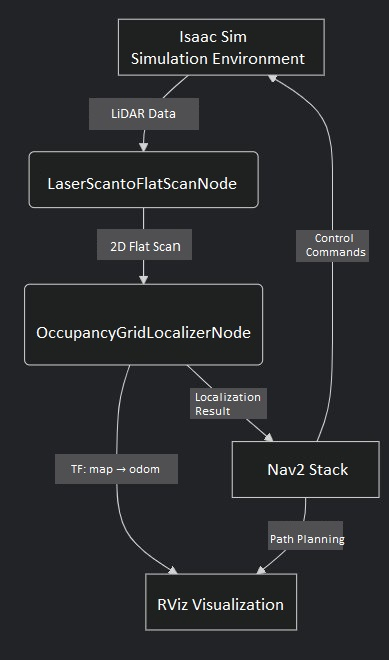

# 6.6.2 Isaac Sim Simulation Navigation

```
Last Version: 19/09/2025
```

This guide explains how to set up and use **Isaac Sim** on a GPU server with **Isaac ROS** in a Docker container for **navigation simulation**.

> **⚠️ Environment Note**:
>
> - Isaac Sim runs on a GPU server, while Isaac ROS operates in a Docker container (e.g., [isaac-ros-dev](https://nvidia-isaac-ros.github.io/concepts/docker_devenv/index.html#development-environment)) deployed on the same GPU server.
> - Official Tutorial: [Isaac ROS Official Example](https://nvidia-isaac-ros.github.io/concepts/visual_slam/cuvslam/tutorial_isaac_sim.html)

## Isaac ROS Occupancy Grid Localizer Introduction

This example uses the **[Isaac ROS Occupancy Grid Localizer](https://github.com/NVIDIA-ISAAC-ROS/isaac_ros_map_localization/tree/main)** for map localization and standard **Nav2** for navigation.

The Occupancy Grid Localizer is a module that uses a known grid map and laser sensor data to determine the robot’s 2D pose on the map.

Isaac ROS Occupancy Grid Localizer Design：


The localizer has two **Key Nodes**:

- **Occupancy Grid Localizer Node**: Matches LiDAR data to the grid map for positioning (provided by NVIDIA).
- **Laser Scan to FlatScan Node**: Converts 2D/3D LiDAR data into Isaac ROS’s standard format.

## Simulation Flow



## Preparation

### Step 1: Download Offline Resources

Log in to the AI server and download the resource package for the **Isaac ROS Occupancy Grid Localizer**:

```bash
NGC_ORG="nvidia"
NGC_TEAM="isaac"
PACKAGE_NAME="isaac_ros_occupancy_grid_localizer"
NGC_RESOURCE="isaac_ros_occupancy_grid_localizer_assets"
NGC_FILENAME="quickstart.tar.gz"
MAJOR_VERSION=3
MINOR_VERSION=2
VERSION_REQ_URL="https://catalog.ngc.nvidia.com/api/resources/versions?orgName=$NGC_ORG&teamName=$NGC_TEAM&name=$NGC_RESOURCE&isPublic=true&pageNumber=0&pageSize=100&sortOrder=CREATED_DATE_DESC"
AVAILABLE_VERSIONS=$(curl -s \
    -H "Accept: application/json" "$VERSION_REQ_URL")
LATEST_VERSION_ID=$(echo $AVAILABLE_VERSIONS | jq -r "
    .recipeVersions[]
    | .versionId as \$v
    | \$v | select(test(\"^\\\\d+\\\\.\\\\d+\\\\.\\\\d+$\"))
    | split(\".\") | {major: .[0]|tonumber, minor: .[1]|tonumber, patch: .[2]|tonumber}
    | select(.major == $MAJOR_VERSION and .minor <= $MINOR_VERSION)
    | \$v
    " | sort -V | tail -n 1
)
if [ -z "$LATEST_VERSION_ID" ]; then
    echo "No corresponding version found for Isaac ROS $MAJOR_VERSION.$MINOR_VERSION"
    echo "Found versions:"
    echo $AVAILABLE_VERSIONS | jq -r '.recipeVersions[].versionId'
else
    mkdir -p ${ISAAC_ROS_WS}/isaac_ros_assets && \
    FILE_REQ_URL="https://api.ngc.nvidia.com/v2/resources/$NGC_ORG/$NGC_TEAM/$NGC_RESOURCE/\
versions/$LATEST_VERSION_ID/files/$NGC_FILENAME" && \
    curl -LO --request GET "${FILE_REQ_URL}" && \
    tar -xf ${NGC_FILENAME} -C ${ISAAC_ROS_WS}/isaac_ros_assets && \
    rm ${NGC_FILENAME}
fi
```

### Step 2: Install/Compile Isaac ROS Occupancy Grid Localizer

Enter the `isaac-ros-dev` environment and install or compile the `isaac-ros-occupancy-grid-localizer` package.

- **Option 1: Install Precompiled Package**:

   ```Plain
   sudo apt-get update
   sudo apt-get install -y ros-humble-isaac-ros-occupancy-grid-localizer
   ```

- **Option 2: Compile from Source**:

   ```Plain
   cd ${ISAAC_ROS_WS}/src
   git clone -b release-3.2 https://github.com/NVIDIA-ISAAC-ROS/isaac_ros_map_localization.git isaac_ros_map_localization

   sudo apt-get update
   rosdep update && rosdep install --from-paths ${ISAAC_ROS_WS}/src/isaac_ros_map_localization/isaac_ros_occupancy_grid_localizer --ignore-src -y

   cd ${ISAAC_ROS_WS}
   colcon build --symlink-install --packages-up-to isaac_ros_occupancy_grid_localizer --base-paths ${ISAAC_ROS_WS}/src/isaac_ros_map_localization/isaac_ros_occupancy_grid_localizer

   source install/setup.bash
   ```

## Launching the Simulation

Run the simulation on the GPU server.

### Step 1: Start Isaac Sim

```Plain
cd issacsim
./isaac-sim.sh
```

### Step 2: Load Scene and AGV Model

Refer to: [https://nvidia-isaac-ros.github.io/getting_started/isaac_sim/index.html](https://nvidia-isaac-ros.github.io/getting_started/isaac_sim/index.html)


### Step 3: Adjust Topic Name

- In the right **Stage** panel, select `/World/Nova_Carter_ROS/ros_lidars/publish_front_2d_lidar_scan`.
- Change the 2D LiDAR topic name to `/scan` to match Nav2’s standard interface.

### Step 4: Enable LiDAR

- In the right **Stage** panel, select `/World/Nova_Carter_ROS/ros_lidars/front_2d_lidar_render_product`.
- Check the **enabled** box under **Inputs** to activate 2D LiDAR output, allowing ROS 2 nodes to receive simulated data.

### Step 5: Start Simulation

Click the **PLAY** button on the left side to start the scene, power on the robot and sensors, and begin data collection and topic publishing. The controller is now ready to receive commands (e.g., velocity from Nav2).

## Launching Navigation

Launch the Nav2 navigation stack with occupancy grid localization:

```bash
ros2 launch isaac_ros_occupancy_grid_localizer isaac_ros_occupancy_grid_localizer_nav2.launch.py
```

The above script launches the navigation script for `isaac_ros_occupancy_grid_localizer` and starts the following nodes:

| Node/Component                | Description                                                   |
| ----------------------------- | ------------------------------------------------------------- |
| `rviz_launch`                 | Launches RViz and loads the pre-configured visualization UI  |
| `nav2_bringup_launch`         | Launches the core Nav2 components,  (controllers, planners, costmaps, etc.) |
| `OccupancyGridLocalizerNode`  | NVIDIA's occupancy grid localizer, matches LiDAR data to the grid map for localization |
| `LaserScantoFlatScanNode`     | Converts 3D/2D LiDAR data into FlatScan format for the localizer |
| `static_transform_publisher`  | Publishes a static TF from `base_link` to `base_footprint`   |

After launching, run the localization service once to set the robot’s initial position:

```bash
ros2 service call /trigger_grid_search_localization std_srvs/srv/Empty {}
```

Once localized, in the RViz view, click **Nav2 Goal**, select a point on the map, and Nav2 will plan a route. The controller will drive the robot along the path:

