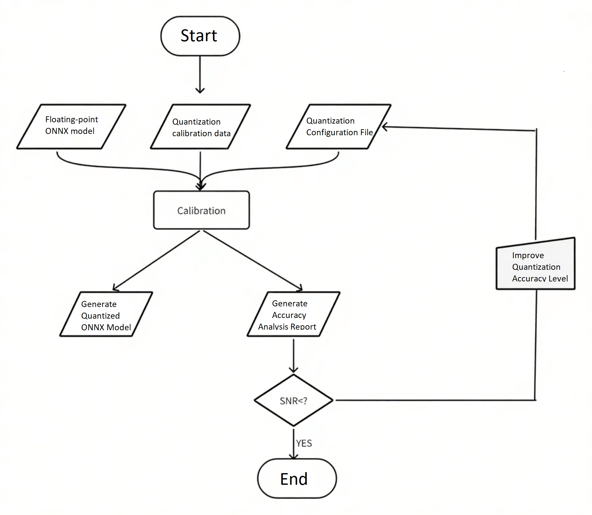

# 7.1 Model Quantization Development

```
Latest Version: 2025/09/22
```

## Tool Introduction

**xquant** is a model quantization tool developed based on [PPQ v0.6.6+](https://github.com/openppl-public/ppq). It integrates quantization strategies adapted for mainstream chips. The tool uses a **JSON** configuration file for a unified interface to convert **floating-point ONNX models** into **INT8 fixed-point format models**.

Before using xquant, convert your trained model to ONNX format. Most training frameworks support standard ONNX export — see the official tutorials: [https://github.com/onnx/tutorials#converting-to-onnx-format](https://github.com/onnx/tutorials#converting-to-onnx-format)

## Workflow

The quantization process follows these steps:



## Model Quantization Example

This guide uses the `yolov8n` model from [Ultralytics](https://github.com/ultralytics/ultralytics) to demonstrate xquant's workflow.

### Install the Quantization Toolkit

- Install the package:

   ```bash
   pip install xquant --index-url https://git.spacemit.com/api/v4/projects/33/packages/pypi/simple
   ```

- After installation, verify successful installation with:

   ```bash
   pip show xquant
   ```

   If information about xquant is displayed correctly, the installation is successful.

### Prepare Floating-Point Model

- Download the original YOLOv8n model (`.pt` format):
   [https://docs.ultralytics.com/zh/models/yolov8/#performance-metrics](https://docs.ultralytics.com/zh/models/yolov8/#performance-metrics)

- Use the export function provided by Ultralytics to convert the `.pt` model to `.onnx`:
Official export documentation: [https://docs.ultralytics.com/zh/modes/export/](https://docs.ultralytics.com/zh/modes/export/)

Recommended export parameters:

```bash
opset_version=13
input_shape=[1, 3, 640, 640]
```

### Configure the Quantization Project Files

1. Create a project directory:

```
project_root/
├── yolov8/
│   ├── model/           # Place the yolov8n.onnx model here
│   └── data/            # Place calibration data and configuration files here
```

2. Create configuration file `yolov8_xquant_config.json`:

```json
{
  "model_parameters": {
    "onnx_model": "yolov8/model/yolov8n.onnx",
    "working_dir": "yolov8",
    "skip_onnxsim": false
  },
  "calibration_parameters": {
    "input_parametres": [
      {
        "mean_value": [0, 0, 0],
        "std_value": [255, 255, 255],
        "color_format": "rgb",
        "data_list_path": "yolov8/data/calib_list.txt"
      }
    ]
  },
  "quantization_parameters": {
    "truncate_var_names": [
      "/model.22/Reshape_output_0",
      "/model.22/Reshape_1_output_0",
      "/model.22/Reshape_2_output_0"
    ]
  }
}
```

- `onnx_model`: Model path
- `mean_value`/`std_value`: Normalization parameters (must match training settings)
- `color_format`: Color channel order (RGB/BGR)
- `data_list_path`: File containing paths to calibration images

Example `calib_list.txt`:

```
Calib/000000428562.jpg
Calib/000000000632.jpg
Calib/000000157756.jpg
Calib/000000044279.jpg
Calib/000000131444.jpg
Calib/000000415238.jpg
Calib/000000202228.jpg
Calib/000000441491.jpg
Calib/000000068286.jpg
Calib/000000232088.jpg
```

⚠️ It is recommended that using a subset of training data for calibration that represents the same distribution.

### Configure Truncation Points

The YOLOv8n model contains post-processing (coordinate decoding) logic. It is advised to truncate the model before these post-processing nodes to prevent quantization errors. The `truncate_var_names` parameter in the configuration specifies these quantization truncation points:

```json
"truncate_var_names": [
  "/model.22/Reshape_output_0",
  "/model.22/Reshape_1_output_0",
  "/model.22/Reshape_2_output_0"
]
```

可使用 [Netron](https://netron.app/) 可视化工具加载 `yolov8n.onnx` 模型确认节点名称：

Use the [Netron](https://netron.app/) tool to visualize the `yolov8n.onnx` model and confirm the node names:


### Run Quantization

Execute the quantization command:

```bash
python3 -m xquant --config yolov8/data/yolov8_xquant_config.json
```

After quantization completes, the following files will be generated:

- Quantized model: `yolov8n.q.onnx`
- Analysis report: `yolov8n.q_report.md`

### Analyze Results

The quantization report provides detailed metrics:

|      | Op                                               | Var                                            |    SNR |    MSE | Cosine | Q.MinMax     | F.MinMax     | F.Hist                                                       |
| ---: | :----------------------------------------------- | :--------------------------------------------- | -----: | -----: | -----: | :----------- | :----------- | :----------------------------------------------------------- |
|    0 | /model.28/cv2.0/cv2.0.0/act/LeakyRelu[LeakyRelu] | /model.28/cv2.0/cv2.0.0/act/LeakyRelu_output_0 | 0.0172 | 0.0004 | 0.9914 | -0.268,1.510 | -0.265,2.374 | 21,494,14495,12234,2677,1740,1129,717,456,303,197,126,81,56,42,23,8,4,6,1,0,1,1,1,0,1,1,0,0,0,0,1 |
|    1 | /model.28/cv3.2/cv3.2.1/conv/Conv[Conv]          | model.28.cv3.2.1.conv.weight[Constant]         | 0.0001 |      0 | 0.9999 | -0.554,1.801 | -0.549,1.806 | 51,34,153,442,1428,2805,7429,13413,5746,1989,867             |

Accuracy evaluation metrics explanation:

- **SNR**: Signal-to-Noise Ratio. Recommended to be higher than `0.1`.
- **Cosine**: Cosine Similarity. Recommended to be close to `1.0`.
- If **SNR < 0.1** or **Cosine < 0.99**, it indicates significant quantization error for that node.

For detailed interpretation of results, refer to the [SpacemiT Documentation (Model Quantization)](https://developer.spacemit.com/documentation?token=DCJEwWDWYivDB4kTM0ucZLnCnpg).