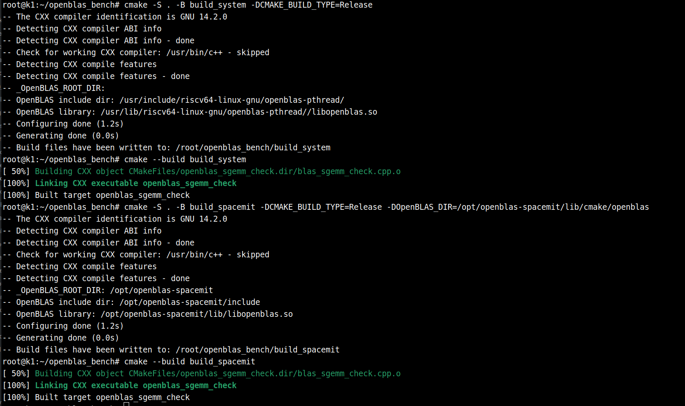
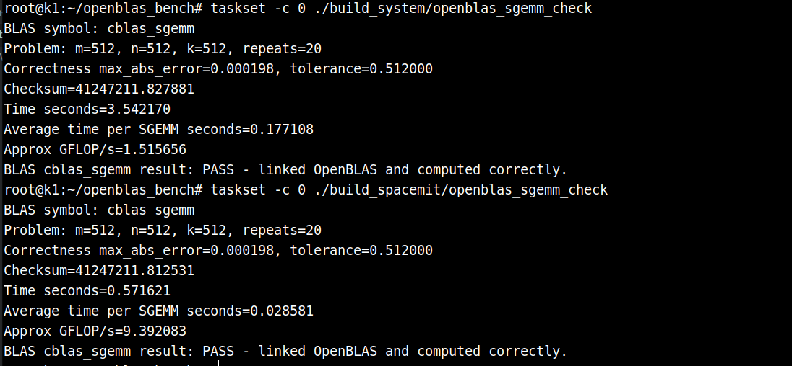
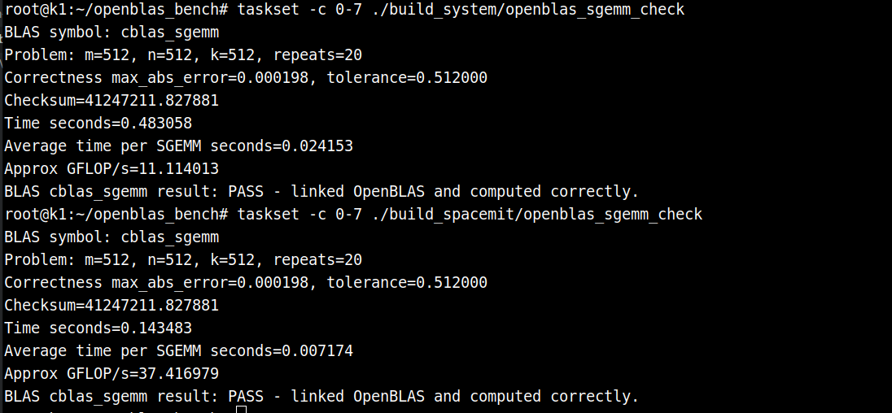

# OpenBLAS RVV

## Overview

[OpenBLAS](https://www.openblas.net/) is an open-source implementation of BLAS (Basic Linear Algebra Subprograms) and a subset of LAPACK, providing fundamental numerical computation capabilities including matrix multiplication, vector operations, linear equation solving, and matrix decomposition. OpenBLAS is widely used to accelerate linear algebra in NumPy, SciPy, Eigen, OpenCV, machine learning inference frameworks, and robotics algorithms.

OpenBLAS performance is closely tied to the target CPU architecture, cache parameters, threading model, and core operator implementation. For compute-intensive operations such as GEMM (General Matrix Multiplication), the availability of processor-specific vectorized microkernels often has a direct impact on achievable throughput. The SpacemiT X60 processor on the K1 platform supports the RISC-V Vector Extension (RVV 1.0), enabling the RVV-optimized library to further unlock hardware performance for large-scale matrix multiplication, matrix decomposition, and similar workloads.

## RVV Acceleration

Two OpenBLAS builds are available on the K1 system for comparison:

| Item | System OpenBLAS (`libopenblas-pthread-dev`) | SpacemiT OpenBLAS (`openblas-spacemit`) |
| :-: | :-: | :-: |
| Version | OpenBLAS 0.3.26 | OpenBLAS 0.3.32 |
| Installation | `sudo apt install libopenblas-pthread-dev` | `sudo apt install openblas-spacemit` |
| Header path | `/usr/include/riscv64-linux-gnu/openblas-pthread` | `/opt/openblas-spacemit/include` |
| Library path | `/usr/lib/riscv64-linux-gnu/openblas-pthread` | `/opt/openblas-spacemit/lib` |
| Target core | `generic` | `x60` |
| Optimization | Generic riscv64 OpenBLAS pthread implementation | RVV-optimized implementation for SpacemiT X60 |
| Typical use | Compatible with system-default BLAS/LAPACK dependencies | High-performance matrix computation and algorithm acceleration on K1 |

The rest of this document benchmarks `libopenblas-pthread-dev` against `openblas-spacemit` using the same BLAS interfaces (e.g., `cblas_sgemm` / `cblas_dgemm`). Tests switch only the header and library paths, and use `OPENBLAS_NUM_THREADS` and `taskset` to control thread count and CPU affinity, in order to observe the RVV optimization library's acceleration effect on the K1 platform.

## Usage Example

### Hardware and Software Environment

- SpacemiT RISCV64 X60 CPU (1.6 GHz)
- Bianbu 2.3.3 Minimal OS
- Memory: 16 GB

### Install Required Dependencies

```
sudo apt update
sudo apt install libopenblas-pthread-dev openblas-spacemit
```

### Test Code

**Directory Structure:**

```
openblas_bench/
├── CMakeLists.txt
└── blas_sgemm_check.cpp
```

**CMakeLists.txt:**

```cmake
cmake_minimum_required(VERSION 3.16)
project(openblas_simple_check LANGUAGES CXX)

set(CMAKE_CXX_STANDARD 17)
set(CMAKE_CXX_STANDARD_REQUIRED ON)

add_executable(openblas_sgemm_check blas_sgemm_check.cpp)

find_package(OpenBLAS REQUIRED)

if(_OpenBLAS_ROOT_DIR STREQUAL "/usr/lib")
    set(OpenBLAS_LIB /usr/lib/riscv64-linux-gnu/openblas-pthread/libopenblas.so)
else()
    set(OpenBLAS_LIB ${OpenBLAS_LIBRARIES})
endif()

message(STATUS "_OpenBLAS_ROOT_DIR: ${_OpenBLAS_ROOT_DIR}")
message(STATUS "OpenBLAS include dir: ${OpenBLAS_INCLUDE_DIRS}")
message(STATUS "OpenBLAS library: ${OpenBLAS_LIB}")


target_include_directories(openblas_sgemm_check PRIVATE ${OpenBLAS_INCLUDE_DIRS})
target_link_libraries(openblas_sgemm_check PRIVATE ${OpenBLAS_LIB})
```

**`blas_sgemm_check.cpp`:**

```
// Test the installed BLAS ABI library by calling cblas_sgemm.
// This validates that the target BLAS library can be linked and used.

#include <algorithm>
#include <chrono>
#include <cmath>
#include <cstdlib>
#include <iomanip>
#include <iostream>
#include <string>
#include <vector>

#include <cblas.h>

namespace {

float value_for(int row, int col, int rows) {
  return static_cast<float>(((row + 1) * 17 + (col + 1) * 31 + rows) % 101) / 101.0f;
}

void fill_col_major(std::vector<float>& matrix, int rows, int cols) {
  for (int col = 0; col < cols; ++col) {
    for (int row = 0; row < rows; ++row) {
      matrix[row + col * rows] = value_for(row, col, rows);
    }
  }
}

std::vector<float> reference_gemm(const std::vector<float>& a, const std::vector<float>& b,
                                  int m, int n, int k, float alpha, float beta) {
  std::vector<float> c(static_cast<size_t>(m) * n, 1.0f);
  for (int col = 0; col < n; ++col) {
    for (int row = 0; row < m; ++row) {
      float acc = 0.0f;
      for (int inner = 0; inner < k; ++inner) {
        acc += a[row + inner * m] * b[inner + col * k];
      }
      c[row + col * m] = alpha * acc + beta * c[row + col * m];
    }
  }
  return c;
}

double max_abs_error(const std::vector<float>& x, const std::vector<float>& y) {
  double err = 0.0;
  for (size_t i = 0; i < x.size(); ++i) {
    err = std::max(err, std::abs(static_cast<double>(x[i]) - static_cast<double>(y[i])));
  }
  return err;
}

double checksum(const std::vector<float>& x) {
  double sum = 0.0;
  for (float v : x) sum += v;
  return sum;
}

}  // namespace

int main(int argc, char** argv) {
  int m = 512;
  int n = 512;
  int k = 512;
  int repeats = 20;

  if (argc > 1) m = std::atoi(argv[1]);
  if (argc > 2) n = std::atoi(argv[2]);
  if (argc > 3) k = std::atoi(argv[3]);
  if (argc > 4) repeats = std::atoi(argv[4]);

  if (m <= 0 || n <= 0 || k <= 0 || repeats <= 0) {
    std::cerr << "usage: " << argv[0] << " [m n k repeats]\n";
    return 2;
  }

  std::vector<float> a(static_cast<size_t>(m) * k);
  std::vector<float> b(static_cast<size_t>(k) * n);
  std::vector<float> c(static_cast<size_t>(m) * n, 1.0f);

  fill_col_major(a, m, k);
  fill_col_major(b, k, n);

  float alpha = 1.25f;
  float beta = 0.5f;
  int lda = m;
  int ldb = k;
  int ldc = m;

  const auto expected = reference_gemm(a, b, m, n, k, alpha, beta);

  cblas_sgemm(CblasColMajor, CblasNoTrans, CblasNoTrans, m, n, k, alpha, a.data(), lda, b.data(), ldb,
              beta, c.data(), ldc);

  const double err = max_abs_error(c, expected);
  const double tolerance = 1e-3 * static_cast<double>(k);

  std::cout << std::fixed << std::setprecision(6);
  std::cout << "BLAS symbol: cblas_sgemm\n";
  std::cout << "Problem: m=" << m << ", n=" << n << ", k=" << k << ", repeats=" << repeats << '\n';
  std::cout << "Correctness max_abs_error=" << err << ", tolerance=" << tolerance << '\n';
  std::cout << "Checksum=" << checksum(c) << '\n';

  if (err > tolerance) {
    std::cerr << "BLAS cblas_sgemm result: FAIL - result mismatch\n";
    return 1;
  }

  std::fill(c.begin(), c.end(), 1.0f);
  const auto start = std::chrono::steady_clock::now();
  for (int r = 0; r < repeats; ++r) {
    cblas_sgemm(CblasColMajor, CblasNoTrans, CblasNoTrans, m, n, k, alpha, a.data(), lda, b.data(), ldb,
                beta, c.data(), ldc);
  }
  const auto end = std::chrono::steady_clock::now();
  const double seconds = std::chrono::duration<double>(end - start).count();
  const double avg_seconds = seconds / repeats;
  const double gflops = (2.0 * m * n * k * repeats) / seconds / 1.0e9;

  std::cout << "Time seconds=" << seconds << '\n';
  std::cout << "Average time per SGEMM seconds=" << avg_seconds << '\n';
  std::cout << "Approx GFLOP/s=" << gflops << '\n';
  std::cout << "BLAS cblas_sgemm result: PASS - linked OpenBLAS and computed correctly.\n";
  return 0;
}
```

### Build

```
# Using libopenblas-pthread-dev
cmake -S . -B build_system -DCMAKE_BUILD_TYPE=Release
cmake --build build_system

# Using openblas-spacemit
cmake -S . -B build_spacemit -DCMAKE_BUILD_TYPE=Release -DOpenBLAS_DIR=/opt/openblas-spacemit/lib/cmake/openblas
cmake --build build_spacemit
```

Terminal output:



### Benchmark Comparison

**Single-core test**

```
taskset -c 0 ./build_system/openblas_sgemm_check # system library
```

```
taskset -c 0 ./build_spacemit/openblas_sgemm_check # openblas-spacemit
```

Output:



As shown, RVV acceleration delivers a significant single-core performance improvement for the `sgemm` operator (177.10 ms → 28.58 ms).

**Eight-core test**

```
taskset -c 0-7 ./build_system/openblas_sgemm_check
```

```
taskset -c 0-7 ./build_spacemit/openblas_sgemm_check
```

Output:



Eight-core performance: 24.15 ms → 7.17 ms

## Extended Benchmark Data

- Core count is restricted with `taskset -c`
- Each individual test runs 50 iterations for the timed average, preceded by 10 warm-up iterations. The full benchmark repeats each individual test 10 times; the reported values are the mean and standard deviation across those 10 runs.
- `mean` = mean of 10 runs; `sd` = standard deviation

### Summary of Results

This benchmark compares `libopenblas-pthread-dev` against `openblas-spacemit` under a consistent timing and repetition strategy, covering both single-core and eight-core scenarios, with a focus on quantifying the gains from RVV optimization.

Key findings:

- **BLAS Level-3 (matrix–matrix operations) shows the largest gains.** Single-core `sgemm` average latency drops from 177.59 ms to 27.32 ms — a 6.50× speedup (GFLOPS 1.51 → 9.83, +550%). Other single-precision operators such as `ssymm` and `strmm` reach 4.9–6.0× speedup; double-precision `dgemm` and `dsymm` consistently improve by 2.1–2.3×. In the eight-core scenario, `sgemm` time is reduced from 24.29 ms to 7.54 ms (3.22× speedup, GFLOPS 11.05 → 35.60); `ssymm` and `strmm` retain 2.5–3.0× gains; `dgemm` and `dtrmm` still gain 1.4–1.5×.
- **BLAS Level-1 (vector operations) shows notable but uneven improvement.** Single-core `sasum` achieves 9.88× speedup, `sdot` 4.45×, and `sscal` 4.57×, while `dcopy` and `daxpy` gain only 1.08–1.12×. In the eight-core case, `sasum` still achieves 9.63×, but `saxpy` and `daxpy` are approximately flat (≈1.0×).
- **BLAS Level-2 (matrix–vector operations) results are mixed.** Single-precision symmetric-matrix operators such as `ssymv` and `stpmv` achieve 3.5–4.0× speedup on a single core, and `ssymv`/`stpmv` retain 2.1–3.2× gains on eight cores. However, banded/sparse-access operators `stbmv` and `dtbmv` regress to 0.47–0.49× (slower), and eight-core `sgemv` and `dgemv` drop to 0.62× and 0.27× respectively.

In summary, `openblas-spacemit` substantially unlocks RVV capability for compute-intensive BLAS Level-3 operations and most Level-1 vector operators, making it an excellent fit for inference, SLAM, and scientific computing workloads that rely on large-scale matrix multiplication and vector arithmetic. For Level-2 workloads bottlenecked by memory access patterns, whether to enable the RVV-optimized library should be evaluated based on the specific application profile.

### Single-Core Results

| module | function |     api     |         expression          |  dtype  | input_size | output_size | libopenblas-pthread-dev avg_ms mean±sd | openblas-spacemit avg_ms mean±sd | libopenblas-pthread-dev avg_gflops mean±sd | openblas-spacemit avg_gflops mean±sd | speedup mean±sd | improvement mean±sd |
| :----: | :------: | :---------: | :-------------------------: | :-----: | :--------: | :---------: | :------------------------------------: | :------------------------------: | :----------------------------------------: | :----------------------------------: | :-------------: | :-----------------: |
| blas1  |  sasum   | cblas_sasum |         sum(abs(x))         | float32 |  262144x1  |     1x1     |            1.3422 ± 0.0219             |         0.1359 ± 0.0044          |              0.1953 ± 0.0031               |           1.9304 ± 0.0591            |  9.88x ± 0.33x  |  888.35% ± 33.48%   |
| blas1  |  dasum   | cblas_dasum |         sum(abs(x))         | float64 |  262144x1  |     1x1     |            1.3319 ± 0.0049             |         0.2688 ± 0.0052          |              0.1968 ± 0.0007               |           0.9756 ± 0.0191            |  4.96x ± 0.10x  |  395.73% ± 10.12%   |
| blas1  |  saxpy   | cblas_saxpy |       z = alpha*x + z       | float32 |  262144x1  |  262144x1   |            1.1806 ± 0.0269             |         0.6024 ± 0.0151          |              0.4443 ± 0.0096               |           0.8709 ± 0.0215            |  1.96x ± 0.06x  |   96.10% ± 6.23%    |
| blas1  |  daxpy   | cblas_daxpy |       z = alpha*x + z       | float64 |  262144x1  |  262144x1   |            1.4697 ± 0.0202             |         1.3136 ± 0.0212          |              0.3568 ± 0.0049               |           0.3992 ± 0.0064            |  1.12x ± 0.01x  |   11.90% ± 1.33%    |
| blas1  |  scopy   | cblas_scopy |            z = x            | float32 |  262144x1  |  262144x1   |            0.5549 ± 0.0144             |         0.3619 ± 0.0041          |              0.4728 ± 0.0116               |           0.7245 ± 0.0082            |  1.53x ± 0.04x  |   53.32% ± 3.70%    |
| blas1  |  dcopy   | cblas_dcopy |            z = x            | float64 |  262144x1  |  262144x1   |            0.7935 ± 0.0087             |         0.7349 ± 0.0062          |              0.3304 ± 0.0036               |           0.3568 ± 0.0030            |  1.08x ± 0.01x  |    7.99% ± 1.43%    |
| blas1  |   sdot   | cblas_sdot  |          dot(x, y)          | float32 |  262144x1  |     1x1     |            2.0041 ± 0.0059             |         0.4503 ± 0.0144          |              0.2616 ± 0.0008               |           1.1654 ± 0.0371            |  4.45x ± 0.14x  |  345.45% ± 13.74%   |
| blas1  |   ddot   | cblas_ddot  |          dot(x, y)          | float64 |  262144x1  |     1x1     |            1.0601 ± 0.0094             |         0.8510 ± 0.0165          |              0.4946 ± 0.0044               |           0.6162 ± 0.0117            |  1.25x ± 0.03x  |   24.62% ± 2.83%    |
| blas1  |  snrm2   | cblas_snrm2 |       sqrt(dot(x, x))       | float32 |  262144x1  |     1x1     |            4.3211 ± 0.0151             |         1.0461 ± 0.0024          |              0.1213 ± 0.0004               |           0.5012 ± 0.0012            |  4.13x ± 0.02x  |   313.08% ± 1.99%   |
| blas1  |  dnrm2   | cblas_dnrm2 |       sqrt(dot(x, x))       | float64 |  262144x1  |     1x1     |            5.6520 ± 0.0190             |         2.1564 ± 0.0307          |              0.0927 ± 0.0003               |           0.2432 ± 0.0034            |  2.62x ± 0.04x  |   162.16% ± 3.93%   |
| blas1  |  sscal   | cblas_sscal |         z = alpha*z         | float32 |  262144x1  |  262144x1   |            1.6644 ± 0.0051             |         0.3645 ± 0.0137          |              0.1575 ± 0.0005               |           0.7201 ± 0.0268            |  4.57x ± 0.16x  |  357.21% ± 16.27%   |
| blas1  |  dscal   | cblas_dscal |         z = alpha*z         | float64 |  262144x1  |  262144x1   |            1.8302 ± 0.0045             |         0.7312 ± 0.0585          |              0.1432 ± 0.0004               |           0.3603 ± 0.0245            |  2.52x ± 0.17x  |  151.54% ± 17.21%   |
| blas2  |  sgemv   | cblas_sgemv |   z = alpha*A*x + beta*z    | float32 |  512x512   |    512x1    |            1.2012 ± 0.0066             |         0.4524 ± 0.0590          |              0.4365 ± 0.0024               |           1.1807 ± 0.1864            |  2.71x ± 0.43x  |  170.59% ± 43.30%   |
| blas2  |  dgemv   | cblas_dgemv |   z = alpha*A*x + beta*z    | float64 |  512x512   |    512x1    |            1.4481 ± 0.0283             |         2.8527 ± 1.0527          |              0.3622 ± 0.0068               |           0.2142 ± 0.0920            |  0.59x ± 0.25x  |  -40.94% ± 25.12%   |
| blas2  |  ssymv   | cblas_ssymv | z = alpha*Sym(A)*x + beta*z | float32 |  512x512   |    512x1    |            1.2130 ± 0.0067             |         0.3424 ± 0.0161          |              0.4322 ± 0.0024               |           1.5342 ± 0.0649            |  3.55x ± 0.15x  |  254.92% ± 14.93%   |
| blas2  |  dsymv   | cblas_dsymv | z = alpha*Sym(A)*x + beta*z | float64 |  512x512   |    512x1    |            1.8327 ± 0.0233             |         0.8594 ± 0.0082          |              0.2861 ± 0.0035               |           0.6101 ± 0.0058            |  2.13x ± 0.04x  |   113.29% ± 3.99%   |
| blas2  |  stbmv   | cblas_stbmv |      z = TriBand(A)*z       | float32 |  512x512   |    512x1    |            0.0135 ± 0.0005             |         0.0284 ± 0.0010          |              0.1903 ± 0.0063               |           0.0903 ± 0.0034            |  0.47x ± 0.02x  |   -52.52% ± 2.28%   |
| blas2  |  dtbmv   | cblas_dtbmv |      z = TriBand(A)*z       | float64 |  512x512   |    512x1    |            0.0140 ± 0.0003             |         0.0286 ± 0.0010          |              0.1837 ± 0.0041               |           0.0896 ± 0.0034            |  0.49x ± 0.02x  |   -51.16% ± 1.77%   |
| blas2  |  stpmv   | cblas_stpmv |     z = PackedTri(A)*z      | float32 |  512x512   |    512x1    |            0.6037 ± 0.0025             |         0.1523 ± 0.0018          |              0.4343 ± 0.0018               |           1.7214 ± 0.0206            |  3.96x ± 0.05x  |   296.38% ± 4.72%   |
| blas2  |  dtpmv   | cblas_dtpmv |     z = PackedTri(A)*z      | float64 |  512x512   |    512x1    |            0.7149 ± 0.0045             |         0.2966 ± 0.0042          |              0.3667 ± 0.0023               |           0.8840 ± 0.0126            |  2.41x ± 0.04x  |   141.07% ± 3.71%   |
| blas2  |  strmv   | cblas_strmv |        z = Tri(A)*z         | float32 |  512x512   |    512x1    |            0.8121 ± 0.0175             |         0.3391 ± 0.0085          |              0.3229 ± 0.0066               |           0.7735 ± 0.0196            |  2.40x ± 0.10x  |  139.69% ± 10.11%   |
| blas2  |  dtrmv   | cblas_dtrmv |        z = Tri(A)*z         | float64 |  512x512   |    512x1    |            1.4707 ± 0.0284             |         1.3445 ± 0.3223          |              0.1783 ± 0.0033               |           0.2043 ± 0.0435            |  1.14x ± 0.24x  |   14.43% ± 23.68%   |
| blas3  |  sgemm   | cblas_sgemm |   C = alpha*A*B + beta*C    | float32 |  512x512   |   512x512   |           177.5923 ± 0.4284            |         27.3192 ± 0.2437         |              1.5115 ± 0.0037               |           9.8266 ± 0.0861            |  6.50x ± 0.06x  |   550.11% ± 5.68%   |
| blas3  |  dgemm   | cblas_dgemm |   C = alpha*A*B + beta*C    | float64 |  512x512   |   512x512   |           237.0376 ± 10.7909           |        105.0428 ± 1.2351         |              1.1346 ± 0.0537               |           2.5558 ± 0.0300            |  2.26x ± 0.10x  |  125.67% ± 10.23%   |
| blas3  |  ssymm   | cblas_ssymm | C = alpha*Sym(A)*B + beta*C | float32 |  512x512   |   512x512   |           177.1279 ± 0.2516            |         29.8079 ± 0.2398         |              1.5155 ± 0.0021               |           9.0060 ± 0.0713            |  5.94x ± 0.05x  |   494.27% ± 5.13%   |
| blas3  |  dsymm   | cblas_dsymm | C = alpha*Sym(A)*B + beta*C | float64 |  512x512   |   512x512   |           239.7504 ± 9.1187            |        113.0794 ± 1.6460         |              1.1212 ± 0.0440               |           2.3743 ± 0.0343            |  2.12x ± 0.08x  |   112.04% ± 8.14%   |
| blas3  |  strmm   | cblas_strmm |     C = alpha*Tri(A)*C      | float32 |  512x512   |   512x512   |            93.6569 ± 0.0875            |         19.2117 ± 0.1472         |              1.4331 ± 0.0013               |           6.9866 ± 0.0529            |  4.88x ± 0.04x  |   387.52% ± 3.78%   |
| blas3  |  dtrmm   | cblas_dtrmm |     C = alpha*Tri(A)*C      | float64 |  512x512   |   512x512   |           129.1804 ± 5.9498            |         57.5006 ± 1.9069         |              1.0411 ± 0.0498               |           2.3365 ± 0.0764            |  2.25x ± 0.12x  |  124.85% ± 12.23%   |

### Eight-Core Results

| module | function |     api     |         expression          |  dtype  | input_size | output_size | libopenblas-pthread-dev avg_ms mean±sd | openblas-spacemit avg_ms mean±sd | libopenblas-pthread-dev avg_gflops mean±sd | openblas-spacemit avg_gflops mean±sd | speedup mean±sd | improvement mean±sd |
| :----: | :------: | :---------: | :-------------------------: | :-----: | :--------: | :---------: | :------------------------------------: | :------------------------------: | :----------------------------------------: | :----------------------------------: | :-------------: | :-----------------: |
| blas1  |  sasum   | cblas_sasum |         sum(abs(x))         | float32 |  262144x1  |     1x1     |            1.3252 ± 0.0064             |         0.1377 ± 0.0042          |              0.1978 ± 0.0009               |           1.9054 ± 0.0549            |  9.63x ± 0.29x  |  863.30% ± 29.41%   |
| blas1  |  dasum   | cblas_dasum |         sum(abs(x))         | float64 |  262144x1  |     1x1     |            1.3275 ± 0.0062             |         0.2695 ± 0.0048          |              0.1975 ± 0.0009               |           0.9728 ± 0.0174            |  4.93x ± 0.10x  |  392.67% ± 10.39%   |
| blas1  |  saxpy   | cblas_saxpy |       z = alpha*x + z       | float32 |  262144x1  |  262144x1   |            0.5626 ± 0.0076             |         0.5372 ± 0.0126          |              0.9320 ± 0.0127               |           0.9765 ± 0.0232            |  1.05x ± 0.03x  |    4.79% ± 3.22%    |
| blas1  |  daxpy   | cblas_daxpy |       z = alpha*x + z       | float64 |  262144x1  |  262144x1   |            1.1850 ± 0.0287             |         1.1607 ± 0.0388          |              0.4427 ± 0.0104               |           0.4521 ± 0.0146            |  1.02x ± 0.03x  |    2.15% ± 2.99%    |
| blas1  |  scopy   | cblas_scopy |            z = x            | float32 |  262144x1  |  262144x1   |            0.5554 ± 0.0141             |         0.3587 ± 0.0008          |              0.4722 ± 0.0117               |           0.7308 ± 0.0017            |  1.55x ± 0.04x  |   54.85% ± 3.88%    |
| blas1  |  dcopy   | cblas_dcopy |            z = x            | float64 |  262144x1  |  262144x1   |            0.7942 ± 0.0066             |         0.7278 ± 0.0028          |              0.3301 ± 0.0028               |           0.3602 ± 0.0014            |  1.09x ± 0.01x  |    9.12% ± 0.82%    |
| blas1  |   sdot   | cblas_sdot  |          dot(x, y)          | float32 |  262144x1  |     1x1     |            1.9864 ± 0.0082             |         0.4272 ± 0.0036          |              0.2639 ± 0.0011               |           1.2273 ± 0.0105            |  4.65x ± 0.05x  |   365.03% ± 4.87%   |
| blas1  |   ddot   | cblas_ddot  |          dot(x, y)          | float64 |  262144x1  |     1x1     |            1.0636 ± 0.0086             |         0.8396 ± 0.0070          |              0.4930 ± 0.0040               |           0.6245 ± 0.0052            |  1.27x ± 0.01x  |   26.68% ± 1.42%    |
| blas1  |  snrm2   | cblas_snrm2 |       sqrt(dot(x, x))       | float32 |  262144x1  |     1x1     |            4.2999 ± 0.0063             |         1.0526 ± 0.0173          |              0.1219 ± 0.0002               |           0.4982 ± 0.0079            |  4.09x ± 0.07x  |   308.59% ± 6.51%   |
| blas1  |  dnrm2   | cblas_dnrm2 |       sqrt(dot(x, x))       | float64 |  262144x1  |     1x1     |            5.6334 ± 0.0202             |         2.1620 ± 0.0067          |              0.0931 ± 0.0003               |           0.2425 ± 0.0008            |  2.61x ± 0.01x  |   160.56% ± 1.02%   |
| blas1  |  sscal   | cblas_sscal |         z = alpha*z         | float32 |  262144x1  |  262144x1   |            1.6565 ± 0.0039             |         0.3537 ± 0.0029          |              0.1582 ± 0.0004               |           0.7411 ± 0.0060            |  4.68x ± 0.04x  |   368.33% ± 3.90%   |
| blas1  |  dscal   | cblas_dscal |         z = alpha*z         | float64 |  262144x1  |  262144x1   |            1.8307 ± 0.0217             |         0.7110 ± 0.0053          |              0.1432 ± 0.0017               |           0.3687 ± 0.0027            |  2.58x ± 0.04x  |   157.51% ± 3.66%   |
| blas2  |  sgemv   | cblas_sgemv |   z = alpha*A*x + beta*z    | float32 |  512x512   |    512x1    |            0.4351 ± 0.0464             |         0.7147 ± 0.1132          |              1.2158 ± 0.1130               |           0.7496 ± 0.1142            |  0.62x ± 0.07x  |   -38.40% ± 6.74%   |
| blas2  |  dgemv   | cblas_dgemv |   z = alpha*A*x + beta*z    | float64 |  512x512   |    512x1    |            0.9406 ± 0.0971             |         3.6771 ± 0.8100          |              0.5626 ± 0.0561               |           0.1534 ± 0.0571            |  0.27x ± 0.09x  |   -72.86% ± 8.72%   |
| blas2  |  ssymv   | cblas_ssymv | z = alpha*Sym(A)*x + beta*z | float32 |  512x512   |    512x1    |            0.2323 ± 0.0087             |         0.0983 ± 0.0066          |              2.2600 ± 0.0838               |           5.3539 ± 0.3636            |  2.37x ± 0.22x  |  137.43% ± 21.87%   |
| blas2  |  dsymv   | cblas_dsymv | z = alpha*Sym(A)*x + beta*z | float64 |  512x512   |    512x1    |            0.5401 ± 0.0105             |         0.3554 ± 0.0082          |              0.9711 ± 0.0186               |           1.4759 ± 0.0330            |  1.52x ± 0.05x  |   52.05% ± 4.93%    |
| blas2  |  stbmv   | cblas_stbmv |      z = TriBand(A)*z       | float32 |  512x512   |    512x1    |            0.0268 ± 0.0010             |         0.0125 ± 0.0005          |              0.0955 ± 0.0033               |           0.2059 ± 0.0073            |  2.16x ± 0.08x  |   115.71% ± 7.63%   |
| blas2  |  dtbmv   | cblas_dtbmv |      z = TriBand(A)*z       | float64 |  512x512   |    512x1    |            0.0318 ± 0.0004             |         0.0180 ± 0.0004          |              0.0805 ± 0.0012               |           0.1419 ± 0.0030            |  1.76x ± 0.05x  |   76.35% ± 4.78%    |
| blas2  |  stpmv   | cblas_stpmv |     z = PackedTri(A)*z      | float32 |  512x512   |    512x1    |            0.1127 ± 0.0007             |         0.0352 ± 0.0013          |              2.3270 ± 0.0147               |           7.4562 ± 0.2658            |  3.20x ± 0.12x  |  220.41% ± 11.81%   |
| blas2  |  dtpmv   | cblas_dtpmv |     z = PackedTri(A)*z      | float64 |  512x512   |    512x1    |            0.1398 ± 0.0051             |         0.0724 ± 0.0062          |              1.8770 ± 0.0660               |           3.6415 ± 0.3024            |  1.94x ± 0.15x  |   94.09% ± 15.40%   |
| blas2  |  strmv   | cblas_strmv |        z = Tri(A)*z         | float32 |  512x512   |    512x1    |            0.1299 ± 0.0050             |         0.0636 ± 0.0088          |              2.0216 ± 0.0769               |           4.1957 ± 0.6068            |  2.08x ± 0.35x  |  108.45% ± 35.35%   |
| blas2  |  dtrmv   | cblas_dtrmv |        z = Tri(A)*z         | float64 |  512x512   |    512x1    |            0.3967 ± 0.0078             |         0.2929 ± 0.0283          |              0.6611 ± 0.0133               |           0.9022 ± 0.0817            |  1.37x ± 0.14x  |   36.68% ± 14.44%   |
| blas3  |  sgemm   | cblas_sgemm |   C = alpha*A*B + beta*C    | float32 |  512x512   |   512x512   |            24.2858 ± 0.1607            |         7.5422 ± 0.1137          |              11.0536 ± 0.0730              |           35.5985 ± 0.5395           |  3.22x ± 0.04x  |   222.05% ± 3.78%   |
| blas3  |  dgemm   | cblas_dgemm |   C = alpha*A*B + beta*C    | float64 |  512x512   |   512x512   |            35.0291 ± 0.1831            |         23.2701 ± 0.2118         |              7.6634 ± 0.0400               |           11.5365 ± 0.1057           |  1.51x ± 0.01x  |   50.54% ± 1.36%    |
| blas3  |  ssymm   | cblas_ssymm | C = alpha*Sym(A)*B + beta*C | float32 |  512x512   |   512x512   |            24.4514 ± 0.4719            |         8.3678 ± 0.1720          |              10.9819 ± 0.2032              |           32.0917 ± 0.6603           |  2.92x ± 0.09x  |   192.33% ± 8.59%   |
| blas3  |  dsymm   | cblas_dsymm | C = alpha*Sym(A)*B + beta*C | float64 |  512x512   |   512x512   |            35.7192 ± 0.2255            |         26.0457 ± 0.2003         |              7.5154 ± 0.0476               |           10.3069 ± 0.0794           |  1.37x ± 0.01x  |   37.15% ± 1.30%    |
| blas3  |  strmm   | cblas_strmm |     C = alpha*Tri(A)*C      | float32 |  512x512   |   512x512   |            16.0313 ± 0.1408            |         6.3241 ± 0.0948          |              8.3728 ± 0.0729               |           21.2276 ± 0.3184           |  2.54x ± 0.04x  |   153.54% ± 3.92%   |
| blas3  |  dtrmm   | cblas_dtrmm |     C = alpha*Tri(A)*C      | float64 |  512x512   |   512x512   |            26.9393 ± 0.6710            |         19.3062 ± 0.0815         |              4.9850 ± 0.1215               |           6.9522 ± 0.0293            |  1.40x ± 0.04x  |   39.54% ± 3.75%    |
