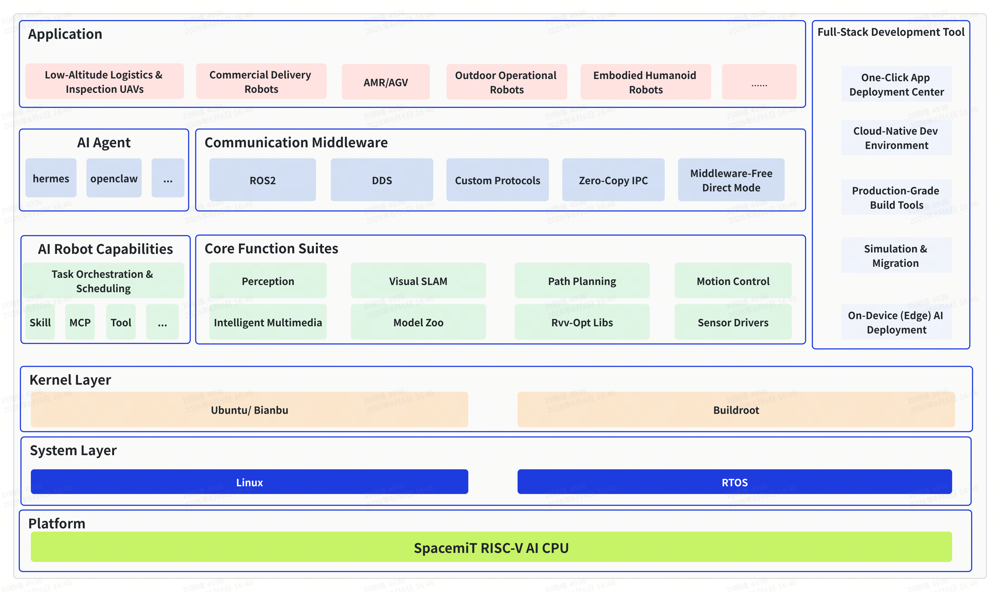

# Overview

**Integrates RISC-V edge computing, AI, and ROS2 engineering into a reusable robotics foundation.**

SpacemiT Robot SDK is designed for **RISC-V robotics platforms** and provides an integrated software stack spanning **systems and peripherals**, **multimedia and acceleration**, **AI inference and interaction capabilities**, and **ROS2 robotics packages**. It accelerates the development of deployable robot solutions from individual capabilities.

There is no need to set up a complex software environment or understand the details of the build toolchain or ROS2 build system. Robot SDK provides a unified command-line interface that supports one-click **full builds** and **component-specific builds**. Common but time-consuming build steps are standardized into reusable workflows, allowing development effort to focus on features and source-code changes.

## 1. What You Get

<div style="display:grid; grid-template-columns: repeat(2, minmax(0, 1fr)); column-gap: 0px; row-gap: 12px; align-items: start;">
  <div style="min-width: 0;">
    
    <div style="text-align:center; margin-top: 0.5em;">Wheeled robot navigation</div>
  </div>
  <div style="min-width: 0;">
    
    <div style="text-align:center; margin-top: 0.5em;">Robot arm manipulation</div>
  </div>
</div>

<div style="display:grid; grid-template-columns: repeat(2, minmax(0, 1fr)); column-gap: 0px; row-gap: 12px; align-items: start; margin-top: 12px;">
  <div style="min-width: 0;">
    
    <div style="text-align:center; margin-top: 0.5em;">Humanoid robot dancing</div>
  </div>
  <div style="min-width: 0;">
    
    <div style="text-align:center; margin-top: 0.5em;">Reachy Mini gesture tracking</div>
  </div>
</div>

- **Reproducible end-to-end reference solutions**: Cover typical robot forms, including humanoid robots, wheeled robots, desktop robots, robot arms, and quadruped robots, helping teams rapidly identify suitable engineering combinations and implementation paths.
- **Reusable edge AI capabilities**: Capabilities such as vision, speech, LLMs, VLMs, and Agents are provided as components and examples for independent validation before integration into a complete robot.
- **Composable ROS2 functional pipelines**: Perception, control, SLAM, navigation, planning, and other capabilities are organized as packages that can be selected and extended for specific scenarios.
- **Reproducible product configurations**: Hardware and product configurations are selected through manifest repository configurations, turning a working solution into one that is ready to run by default and can be maintained and upgraded.
- **Customizable system and platform foundation**: Peripheral drivers, system services, shared memory, multimedia acceleration, and other capabilities support real-time and performance requirements at the edge.

## 2. Get Started in 30 Seconds

- **Get started quickly**: [02-Quick Start (Overview)](02-快速入门/index.md)  
- **Reproduce an end-to-end solution**: [03-Reference Solutions (Overview)](03-参考方案/index.md)  
- **Find documentation by capability or module**: Browse the following topic areas  
  - [04-AI and Algorithms](04-AI与算法/index.md) (speech, vision, LLMs, VLMs, and Agents)  
  - [05-Robotics Development](05-机器人开发/index.md) (perception, control, SLAM, navigation, and planning)  
  - [06-Systems and Platform](06-系统与平台/index.md) (system services, peripheral drivers, and multimedia)

## 3. Architecture and Layers

Code repositories:

- [GitHub repository](https://github.com/spacemit-robotics)
- [Gitee mirror](https://gitee.com/spacemit-robotics)



Reading guide (from top to bottom):

- **Application layer**: End-to-end applications and complete-robot reference implementations (see [03-Reference Solutions](03-参考方案/index.md)).
- **Full-Stack Development Tool (right panel, spanning all layers)**: One-Click App Deployment Center, Cloud-Native Dev Environment, Production-Grade Build Tools, Simulation & Migration, and On-Device (Edge) AI Deployment — covering the full development, validation, and delivery workflow.
- **Communication Middleware layer**: Supports ROS2, DDS, Custom Protocols, Zero-Copy IPC, and Middleware-Free Direct Mode to accommodate different system architectures and communication requirements (see [05-Robotics Development](05-机器人开发/index.md)).
- **Core Function Suites layer**: AI Robot Capabilities cover task orchestration and scheduling, skills, MCP, and tool integration (see [04-AI and Algorithms](04-AI与算法/index.md)). Core Function Suites provide perception, visual SLAM, path planning, motion control, intelligent multimedia, model zoo, RVV-optimized libraries, and sensor drivers (see [06-Systems and Platform](06-系统与平台/index.md)).
- **Kernel layer**: OS distributions and runtime environments, including Ubuntu/Bianbu and Buildroot.
- **System layer**: System kernels, including Linux and RTOS.
- **Platform**: SpacemiT RISC-V AI CPU.

```text
spacemit_robot/
├── application/                 # Application-layer solutions (case aggregation)
│   ├── native/                  # Non-ROS2 application solutions
│   │   ├── reachy_mini/
│   │   ├── lerobot_app/
│   │   ├── omni_agent/
│   │   └── humanoid_*/
│   └── ros2/                    # ROS2 application reference solutions
│       └── linksee/
├── middleware/
│   └── ros2/                    # ROS2 middleware layer
│       ├── perception/ planning/ slam/
│       ├── control/ peripherals/ interfaces/
│       └── multimedia/ mpp/ gui/ tools/
├── components/                  # General-purpose capability components
│   ├── peripherals/ multimedia/ model_zoo/
│   ├── control/ ai-gateway/ agent_tools/
│   └── simulation/ system/ rvv_libs/ thirdparty/
├── target/                      # Hardware/product configuration aggregation
└── build/                       # One-click build scripts
```

The complete SDK directory structure is shown above. Its key characteristics are as follows:

- **Capabilities and frameworks are separated to avoid ROS2 lock-in**: The `components` layer consolidates general-purpose capabilities such as devices, models, multimedia, and control. The `middleware` layer is responsible only for adapting and orchestrating communication components such as ROS2. A native implementation can be validated first, then integrated with ROS2, FastDDS, custom communication components, or a direct communication mode as required, rather than being coupled to a middleware framework from the outset.
- **Applications and capabilities are decoupled for clear reuse**: Applications such as `reachy_mini` and `humanoid_*`, together with `application/ros2` solutions such as `linksee`, share the same underlying components. Changing the robot form generally involves replacing the application composition rather than rewriting the underlying capabilities.
- **Composable downloads minimize scenario-specific code retrieval**: The `-g` grouping mechanism of `repo init` downloads only the repositories required for scenarios such as humanoid robots, wheeled robots, desktop robots, perception, or planning and control. This reduces initialization time and local storage use while improving iteration efficiency.
- **Efficient composition enables rapid solution development**: A new solution is typically assembled by selecting components, a middleware layer, an application shell, and a `target` configuration. Compared with building a stack from scratch, this makes it easier to produce a demonstrable, iterative, and maintainable solution in a short development cycle.

## 4. Versions and Changes

- **Version releases and compatibility information**: [07-Version Notes](07-版本说明/index.md)

## 5. Community and Feedback

Visit the [SpacemiT Robot GitHub](https://github.com/spacemit-robotics) organization to follow project updates. Select **Follow** on the organization page and **Star** on repositories of interest for easy access later. To report a problem, share feedback, or propose an idea, open an **Issue** in the relevant repository. The team will follow up and provide feedback.
