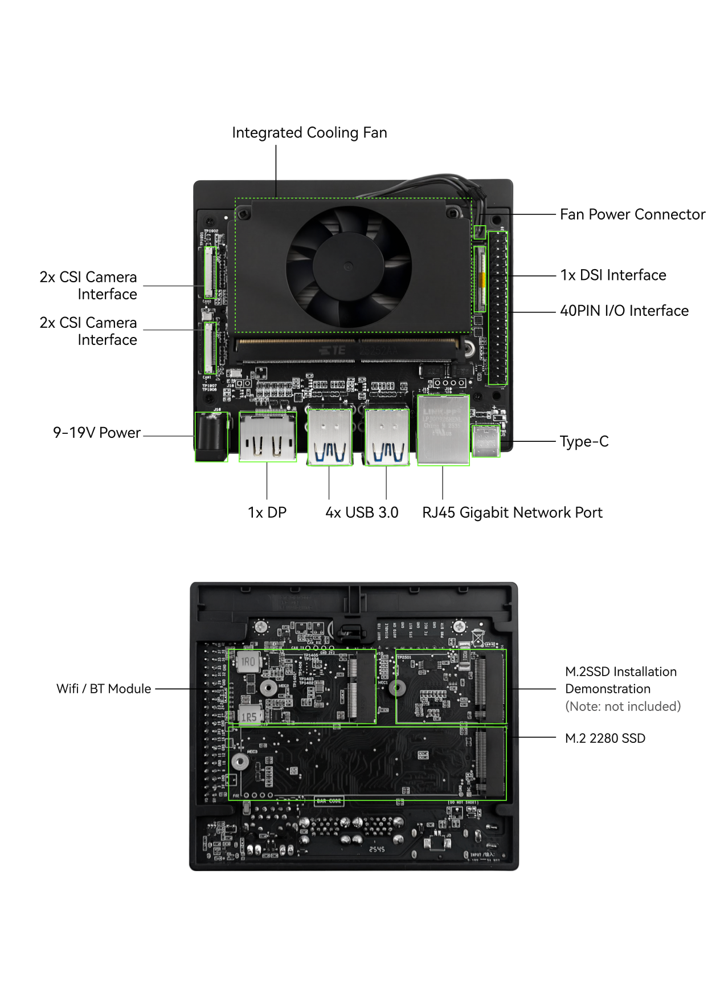
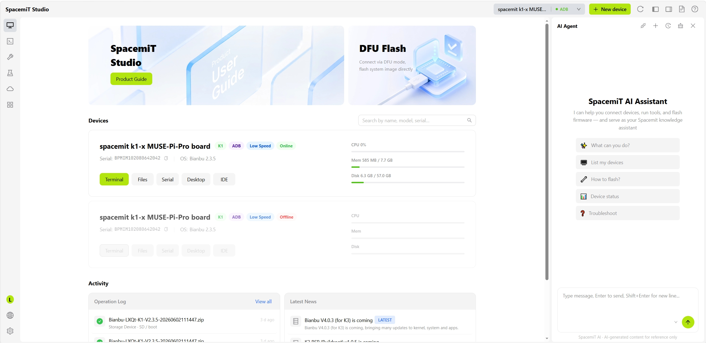
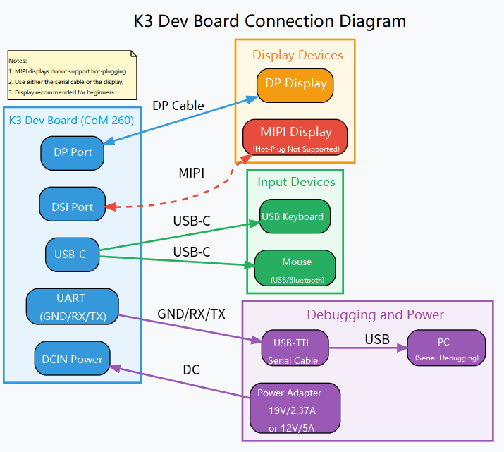
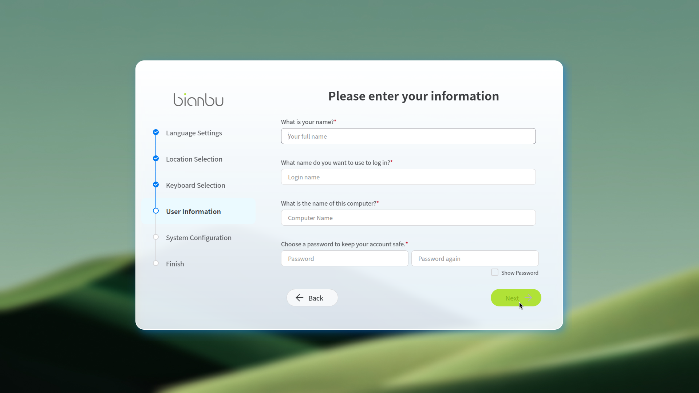
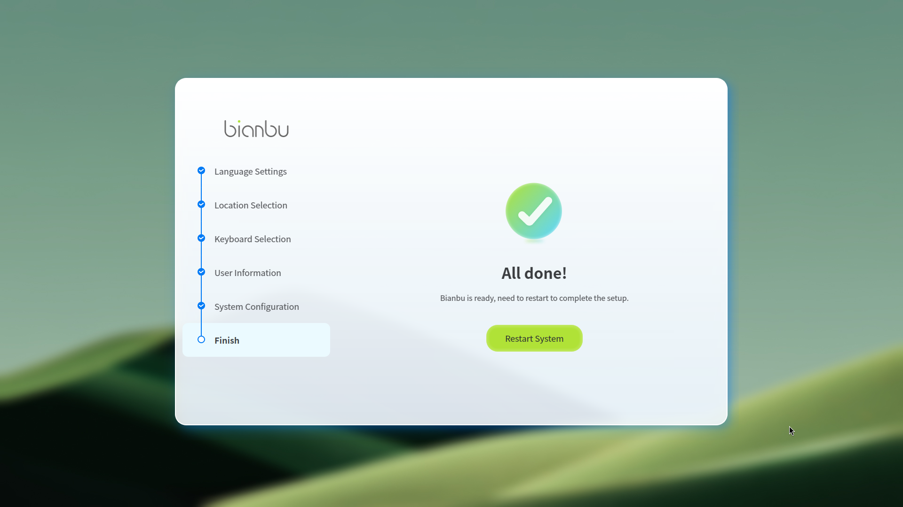
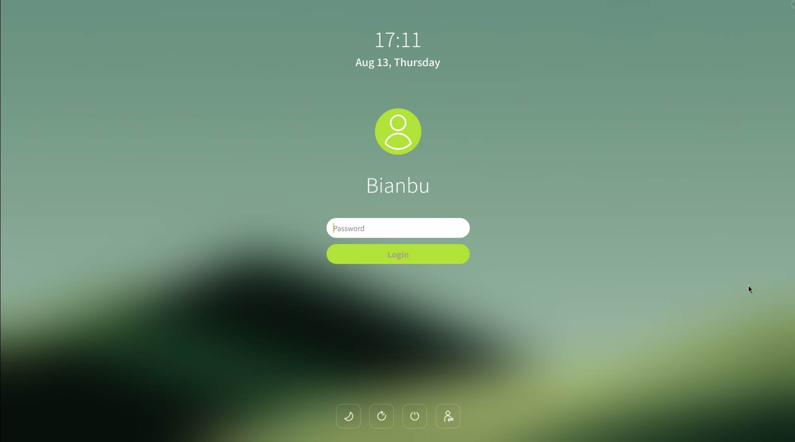
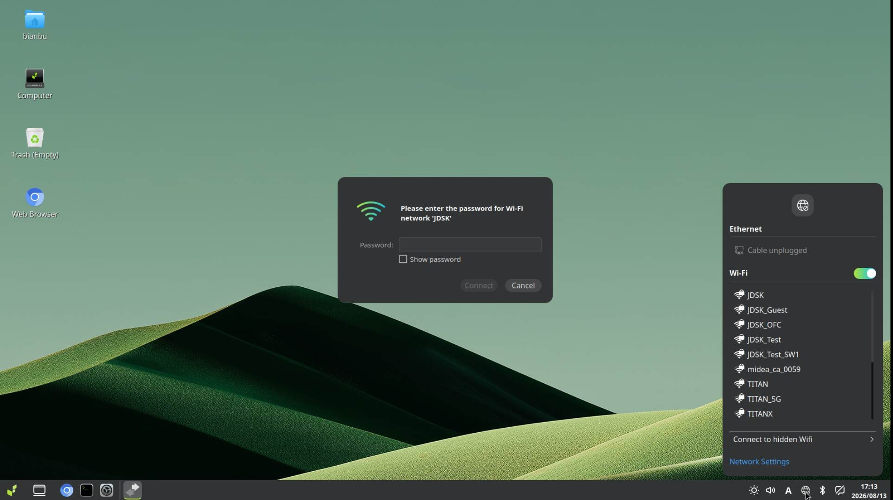

# Power-On and Boot

This chapter describes the power-on and boot procedure for first-time use of the K3 development board. It covers the power connections, display connection, and optional debug serial port configuration, and explains how to view the boot log through a PC serial terminal to verify that the board and cables are functioning correctly.

## 1. Required Items

| Type | Description |
| --- | --- |
| Development board | SpacemiT K3 series (this document uses COM260 as an example, as shown in the figure) |
| Power supply | DCIN, 19V/2.37A or 12V/5A power adapter |
| Display (optional) | Display with a DP or MIPI DSI interface |
| Keyboard & mouse (optional) | Any USB-C keyboard and mouse (Bluetooth is also supported for the mouse) |
| Serial debug (optional) | USB-to-TTL serial cable |
| USB | Type-C |



## 2. SpacemiT Studio

**Strongly recommended.** When Studio is used, the rest of this document and [2.2 Flashing](2.2-镜像烧录.md) may be skipped.

🔗 [SpacemiT Studio](https://studio.spacemit.com/) is an **all-in-one web workbench** for the SpacemiT AI CPU development ecosystem. It integrates image management, system flashing, device management, terminal debugging, cloud compilation, AI development, and application deployment, supporting the complete workflow from system installation to application release.

Studio provides a unified entry point for RISC-V development, enabling device preparation, software development, and application deployment from a single interface.

Studio can be used to flash images and develop software on the board without an external display or keyboard. Only a USB Type-C data cable is required.



## 3. Wiring Sequence

If no serial debug tool is available, connect a display via the DP interface to complete the initial configuration. The following procedure demonstrates the display-based approach. If no display is available, refer to Section 5 for serial port operation.



1. Connect the DP/MIPI display. Note: **MIPI displays do not support hot-plugging. Connect the display before powering on the board and disconnect it only after powering off the board.**
2. Connect the power supply.
3. Connect the mouse and keyboard.

Except for the MIPI display requirement, the steps above can be performed in any order.

## 4. Operation Procedure

### 4.1 Initial Boot

COM260 ships with the SpacemiT Bianbu operating system preinstalled. When powering on the board for the first time, follow the on-screen configuration wizard to complete the initial setup.


Record the username and password created during the setup process.

After all configuration steps are complete, the system is ready to use.


### 4.2 Login

Log in after powering on the board.


### 4.3 Network Connection

#### Ethernet

The board supports a wired Ethernet connection through the RJ45 port.

#### Wi-Fi

Configure Wi-Fi through the network settings in the display interface:



The network can also be configured from a terminal:

```bash
nmcli device wifi connect "wifi_name" password "wifi_password"
```

## 5. Serial Port Connection

The serial cable wiring diagram is shown below.


Connect the wires according to the silkscreen labels GND/RX/TX and the corresponding pin definitions on the USB-TTL module.

Reference wire assignment (applicable only when the USB-TTL cable follows this convention): connect the black wire to GND, the white wire to the board-side RX silkscreen pad, and the green wire to the TX silkscreen pad. The red wire is the power line and must be left floating (unconnected).

After connecting the serial port, power on the board to access the terminal. The default username is `bianbu` or `root`; the password for both accounts is `bianbu`.

```bash
nmcli device wifi connect "wifi_name" password "wifi_password"
```

## 6. Remote Login

After the board is connected to the network, it can be accessed remotely.

### 6.1 SSH

- **Windows**

    MobaXterm is recommended. Proceed as follows:

    1. Open MobaXterm, click **Sessions** → **New Session**, and select SSH.

    2. Configure the connection parameters:
       - **Remote host**: IP address of the board (for example, 192.168.1.100)
       - **Specify username**: the default username is `bianbu`
       - **Port**: retain the default value of 22

    3. Click **OK** to initiate the connection, then enter the password to log in.

- **Ubuntu**

    Enter the following command in the terminal:

    ```bash
    ssh bianbu@<remote_ip>
    ```

    Replace `<remote_ip>` with the actual IP address of the board. During the first connection, a prompt appears to confirm the host fingerprint. Enter `yes` to proceed.

### 6.2 Remote Desktop

Refer to 🔗 [Remote Connection / VNC Login](https://www.spacemit.com/community/document/info?lang=en&nodepath=software/SDK/ros/k1/01_Quick_start/1.4_Remote_Access.md)

## 7. Troubleshooting

| Symptom | Recommended Action |
| --- | --- |
| No serial output | Verify the power supply; confirm that RX/TX are crossed and GND is connected; ensure that the correct COM port or device node is selected on the PC; and confirm that the baud rate is 115200. |
| Garbled output | The baud rate may not match the on-board UART configuration. Verify the debug-port baud rate in the hardware manual and check for a loose or poorly seated USB cable. |
| Wiring by wire color only | **Not reliable.** Always follow the **silkscreen GND/RX/TX** labels and the USB-TTL module pin definitions. |
| Is image flashing required first? | If factory firmware is present and the wiring is correct, the boot log should appear. To reflash the board or use a different system image, see [2.2-Image Flashing](2.2-镜像烧录.md). |
