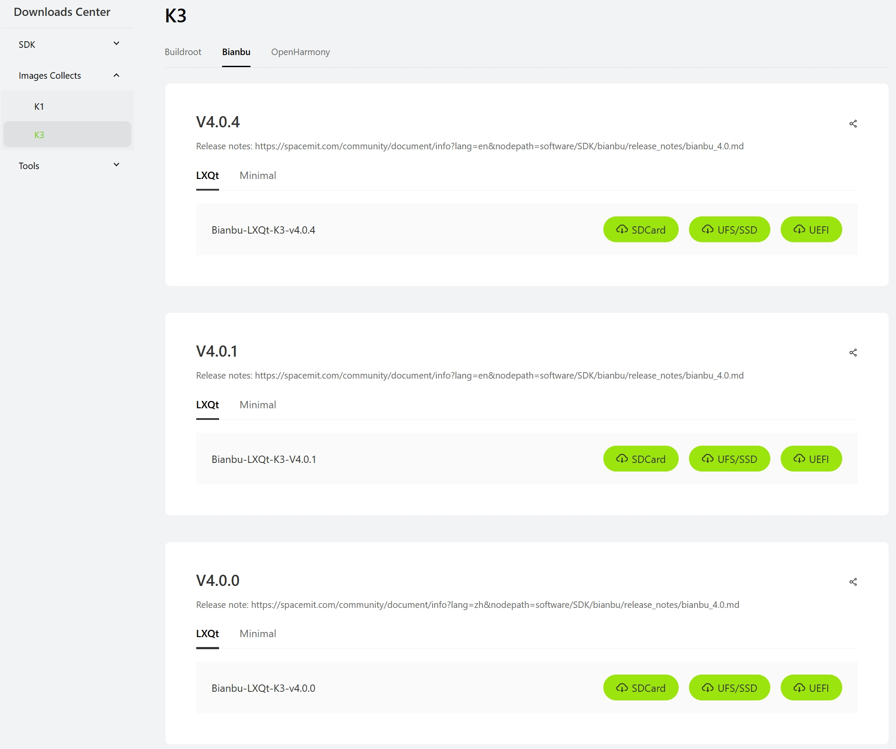
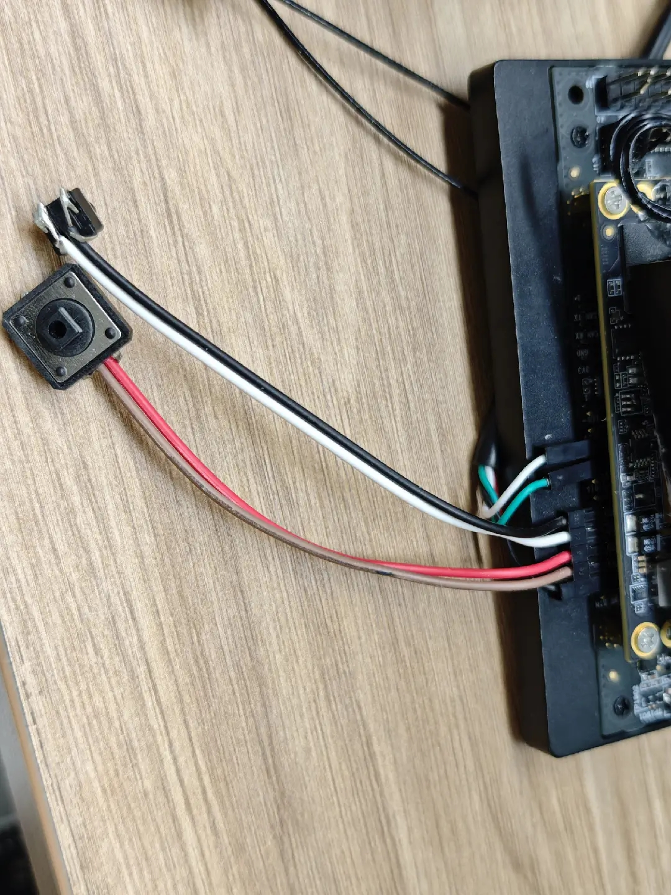
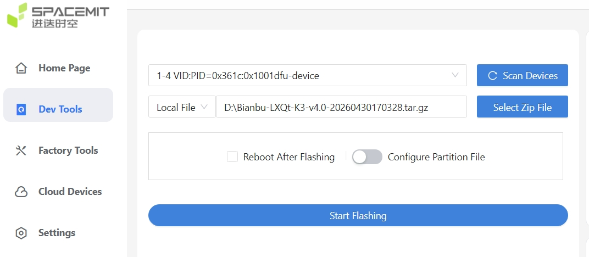
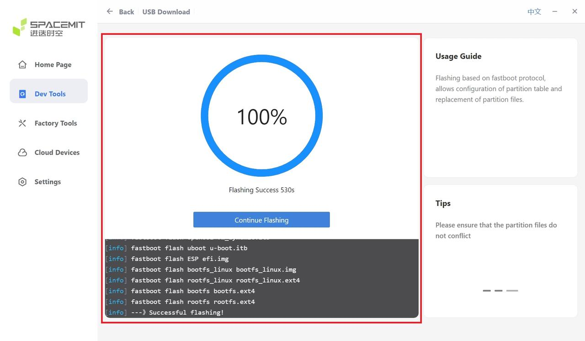

# Flashing

## 1. Required Items

| Type | Description |
| --- | --- |
| Hardware | K3 development board, Type-C data cable, buttons |
| Flashing tool | TiTan (see [2.1 Power-On and Boot](2.1-上电开机.md) or [Flashing Tool User Manual](https://www.spacemit.com/community/document/info?lang=en&nodepath=tools/user_guide/flasher_user_guide.md) for more details) |
| Image | [Bianbu-LXQt-K3-v4.0](https://spacemit.com/community/resources-download/Images%20Collects/K3/Bianbu) or a later version|

**Development boards ship with a preinstalled image. Re-flash only if necessary.** Recommended image: [Bianbu-LXQt-K3-v4.0](https://spacemit.com/community/resources-download/Images%20Collects/K3/Bianbu) or a later version

This procedure applies to UFS boot mode. Download the corresponding image.


## 2. Procedure

Button locations


### 2.1 Entering Flash Mode

- Prepare a Type-C data cable. Connect one end to the host PC and the other end to the Type-C port on the K3 development board.
- Connect buttons to FC_REC - GND and SYS_RST - GND as shown in the figure:

- Press and hold the FC_REC button.
- Press the RST button once briefly.
- Release the FC_REC button.

To summarize: press and hold the FC_REC button, briefly press the RST button, then release FC_REC to enter flash mode.

Verify that flash mode has been entered successfully:

The device is detected by the flashing tool:


If a serial terminal is connected, the following log output is displayed:

```text
setup= 0x80500 0x0,                                                                
setup= 0x1000680 0x120000,                                                         
setup= 0x2000680 0x90000,                                                          
setup= 0x2000680 0x200000,                                                         
setup= 0x3000680 0xff0000,                                                         
setup= 0x3020680 0xff0409,                                  |                      
setup= 0x3010680 0xff0409,                                                         
setup= 0x10900 0x0,                                                                
usb_rx_bytes : start len[4096]                                                     
setup= 0x3020680 0xff0409,                                                         
setup= 0x3040680 0xff0409,                                                         
setup= 0x3000680 0x40000,                                                          
setup= 0x3010680 0xff0409,                                                         
setup= 0x3000680 0x40000,                                                          
setup= 0x3020680 0xff0409,                                                      
```

This log output confirms that flash mode was entered successfully.

### 2.2 Flashing the Image

After entering flash mode, refer to the [Flashing Tool User Manual](https://www.spacemit.com/community/document/info?lang=en&nodepath=tools/user_guide/flasher_user_guide.md). Select the recommended system image, then click **Start Flashing**.

## 3. Verification and Self-Check

After flashing is complete, verify the result as follows:

- **Flashing tool**
   

- **Display**

    K3-CoM260 comes with the Bianbu operating system preinstalled. On the first boot after flashing, a configuration wizard starts. Use a mouse and keyboard to create a username and password.

- **Notes**

    If an external display and keyboard are unavailable for initial registration, user initialization cannot be completed through the serial terminal.

    When the following login prompt is displayed:

    ```text
    Bianbu 4.0rc1 k3 ttyS0                                                             
    k3 login: 
                                                 
    密码：     
    ```

    The superuser account can be used temporarily for development:

    Username: root

    Password: bianbu

    For formal development, create a regular user account and avoid logging in as root.

## 4. Common Issues

The flashing tool reports a flashing failure:

1. Verify that the data cable is securely connected. Do not disconnect the USB connection during flashing.
2. Verify that the firmware version matches the development board model.
