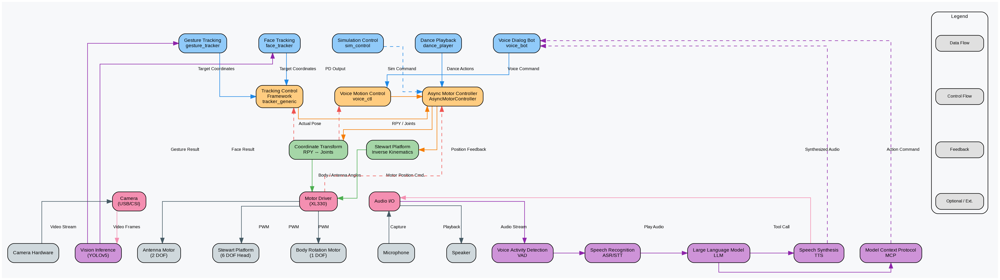
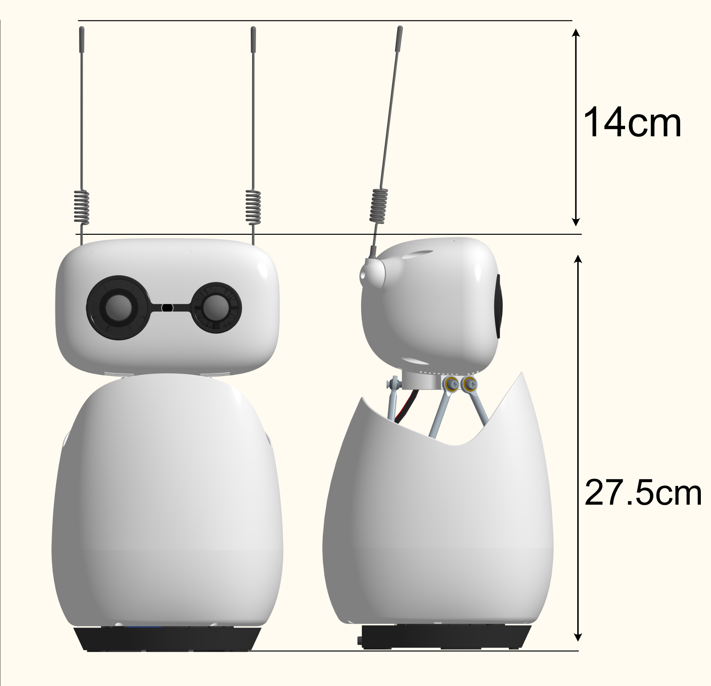
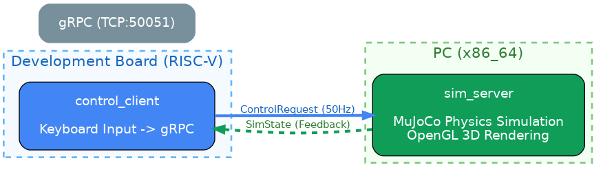

# Reachy Mini Desktop Robot

Reachy Mini is an open-source desktop robot jointly developed by Hugging Face and Pollen Robotics. This solution is adapted for the SpacemiT K3-CoM260 computing platform.

## 1. Solution Overview

Reachy Mini is a compact interactive robot motion-control application that supports the following functions:

- **Visual tracking**: Detects faces and gestures in real time through a camera and drives the Stewart platform motors using a PD control algorithm.
- **Voice-controlled interaction**: Integrates a complete VAD, ASR, LLM, and TTS voice-interaction pipeline for voice-controlled robot actions. **Supports both local models and domestic or international cloud models.**
- **Dance performance**: Provides preprogrammed dance sequences with synchronized audio playback.
- **Simulation control**: Remotely controls a MuJoCo simulation running on a PC through gRPC, supporting real-time keyboard control and predefined actions.



**Core components**:

- Head: 6-DOF motion (x, y, z, roll, pitch, yaw)
- Body: Rotation about the vertical axis
- Antennas: Two motors with 360-degree rotation

## 2. Hardware List

| Item | Description |
| --- | --- |
| Recommended hardware | Reachy Mini robot (Lite version) |
| Key peripherals | Sony IMX708 camera, PDM MEMS digital microphone, speaker, XL330 servo |
| Computing platform | k3-com260 |



## 3. Environment Setup

### 3.1 Hardware Connections

1. Connect the power supply.
2. Connect the development board to the robot through USB.


Reconnect the USB cable to identify the serial port:

```bash
# The default motor serial port is /dev/ttyACM0.
ls /dev/tty*
```

### 3.2 Obtaining the Source Code

```bash
repo init -u https://github.com/spacemit-robotics/manifest.git -b main -m default.xml \
--repo-url=https://gitee.com/spacemit-robotics/git-repo \
-g core,peripherals,agent_tools,model_zoo,multimedia,reachy_mini
repo sync -j4
repo start robot-dev --all
```

### 3.3 External Dependencies

**Core dependencies**:

- `components/peripherals/motor` - Motor driver library
- `components/model_zoo/vision` - Vision inference library
- OpenCV (`/opt/opencv-spacemit`) - Image capture and display

**Audio dependencies** (required by `test_dance` and `reachy_voice_bot`):

- `libportaudio` - Audio capture and playback
- `libsndfile` - Audio file read and write operations
- `libsamplerate` - Sample-rate conversion
- `libfftw3` - FFT operations

**AI component dependencies** (required only by `reachy_voice_bot`):

- `components/model_zoo/asr` - Speech recognition
- `components/model_zoo/tts` - Speech synthesis
- `components/model_zoo/vad` - Voice activity detection
- `components/model_zoo/llm` - Large language model inference
- `components/multimedia/audio` - Audio processing library # **Build this module first**
- `mcp`

**All dependencies are downloaded during the build.**

### 3.4 Build

```bash
cd spacemit_robot    # Change to the SDK download directory, which is the project root.

lunch  # Select a build target.
```

The available targets are as follows:

```text
You're building on Linux

Lunch menu... pick a combo:

     1  k1-muse-pipro-minimal
     2  k3-com260-mars
     3  k3-com260-minimal
     4  k3-com260-reach-mini
     5  k3-com260-humanoid-asimov
     6  k3-com260-humanoid-g1
     7  k3-com260-humanoid-go1
     8  k3-com260-humanoid-h1_2
     9  k3-com260-humanoid-qinglong
     10 k3-com260-humanoid-r1
     11 k3-com260-humanoid-tiangong
     12 k3-com260-humanoid-tinker
     13 kx-generic-omni_agent

```

Select `k3-com260-reach-mini`.

```bash
m  # Build.
```

**Dependencies are detected and downloaded during the build. Enter `y` to install system dependencies automatically.**

**First-build notes**:
- Executables are installed in `output/staging/bin`.
- Dependency libraries and header files are installed in `output/staging/lib` and `output/staging/include`.

## 4. Integrated Scenario: Full Voice-Controlled Interaction (Recommended)

`reachy_voice_bot` is the core Reachy Mini application. It combines voice interaction, motion control, visual tracking, and dance performance into a single voice interface, eliminating the need to switch between programs.

### 4.1 Prerequisites

Complete [Section 3.4](#34-building).

### 4.2 Starting the Application

#### 1. Start

The application can be started without command-line arguments (recommended). All parameters can be preset in `config/config_paras.yaml`; unspecified device parameters are detected automatically.

**Recommended: Start in daemon mode**

Ensure that `llm.url` is correctly set in the configuration file, then start the application:

```bash
reachy_voice_bot start    # Start in the background.
```

After successful initialization, the robot announces that the conversation has started and accepts voice commands.

##### Voice-Control and Mode-Switching Keywords

After startup, voice commands can control the robot. The system first matches the following keywords; unmatched commands fall back to open-ended LLM conversation:

| Purpose | Keywords/Examples | Description |
| :--- | :--- | :--- |
| Start face tracking | "跟着我", "跟随我", "看着我", "人脸跟踪" | Starts face detection and enters face-tracking mode. |
| Start gesture tracking | "跟着手掌", "手势跟随", "手势跟踪", "跟着手" | Starts gesture detection and enters gesture-tracking mode. |
| Stop tracking | "别跟了", "停止跟随", "不要跟了", "停止手势" | Stops the current tracking mode and releases NPU resources. |
| Head movement | "左转", "右转", "抬头", "低头", "左歪头", "右歪头" | Controls single-axis head movement (Yaw/Pitch/Roll). |
| Body movement | "身体左转", "身体右转" | Controls rotation about the body's vertical axis. |
| Reset | "回正", "回中", "复位" | Returns the full robot to the centered position. |
| Dance performance | "甩头舞", "杰克逊", "小鸡啄米", "嗯哼歪头" | Performs a preprogrammed dance with synchronized audio. |
| Exit/shut down | "睡觉吧", "关机" | Exits the application. |

#### 2. Query Status

```bash
reachy_voice_bot status   # View the running status and current mode.
```

Expected result: The current mode is displayed.

Available modes:

| Status | Description |
| :--- | :--- |
| `初始化中` | The application is starting and initializing the LLM, VAD, TTS, audio devices, and other components. |
| `对话模式` | All engines and audio components are initialized and ready for voice input. |
| `人脸跟随` | Face-tracking mode is active. TCM is occupied, which limits TTS. |
| `手势跟踪` | Gesture-tracking mode is active. TCM is occupied. |
| `未知` / no file | The application is not running or the status is unavailable. |

#### 3. Stop the Application

```bash
reachy_voice_bot stop     # Stop the application.
```

Expected result: The robot motors are released and the application exits.

#### Configuration and Advanced Options

The application supports two configuration methods. The required settings are the **serial-device node** (`motor.port`) and **LLM URL** (`llm.url`). Other device parameters are detected automatically when not configured.

**LLM model selection**

The configuration file provides four local model options. Specify a model in the configuration file or through the command line. If no model is specified, the default model, `qwen2.5:0.5b`, is used.

The local models listed below can be downloaded automatically at startup. To use another local model, download it to `~/.cache/models/llm/` and specify it.

| Configuration Name | Model File | Description |
| :--- | :--- | :--- |
| `qwen2.5:0.5b` | `qwen2.5-0.5b-instruct-q4_0.gguf` | Default model with the lowest memory usage |
| `qwen2.5:1.5b` | `qwen2.5-1.5b-instruct-q4_0.gguf` | Balances performance and resource usage |
| `qwen2.5:3b` | `qwen2.5-3b-instruct-q4_0.gguf` | Provides stronger conversational capabilities |
| `glm-edge:1.5b` | `glm-edge-1.5b-chat-q4_0.gguf` | Lightweight model from the GLM family |

**Method 1: Configuration file (recommended)**

Edit `config/config_paras.yaml`, located in `reachy_mini/config`, or specify a file through `--config <path>`:

```yaml
llm:
  url: "http://localhost:8080"    # Required: LLM API URL
  model: "qwen2.5:0.5b"
motor:
  port: "/dev/ttyACM0"           # Required: Motor serial-device node
tts:
  engine: "matcha:zh-en"
# Leave the remaining parameters, such as audio and camera, at their defaults for automatic detection.
```

**Method 2: Command-line arguments**

```bash
reachy_voice_bot --llm-url http://localhost:8080 --motor-port /dev/ttyACM0
```

**To use a cloud LLM**, change `llm.url` to the cloud endpoint or override it through the command line:

```bash
export OPENAI_API_KEY="sk-your-api-key"
reachy_voice_bot --llm-url https://api.deepseek.com/v1 --model deepseek-chat
```

> Set `--llm-url` to `/v1`; the application automatically appends `/chat/completions`.

**Parameter precedence**: `command-line arguments > configuration file > automatic detection`

### 4.2.1 Run Modes and Command-Line Arguments

**Run modes**:

| Mode | Command | Description |
| ------ | ------ | ------ |
| Background daemon (recommended) | `reachy_voice_bot start [arguments...]` | Writes logs to `/tmp/reachy_voice_bot.log` |
| Foreground | `reachy_voice_bot [arguments...]` | Suitable for debugging; logs are displayed in the terminal |
| Stop | `reachy_voice_bot stop` | Sends SIGTERM and removes the status file |
| Query status | `reachy_voice_bot status` | Displays the PID and current mode |

**Command-line arguments** (all can be replaced by configuration-file settings):

| Argument | Description | Default |
| :--- | :--- | :--- |
| `--llm-url <url>` | LLM API URL | Configuration-file setting `llm.url` |
| `--model <name>` | LLM model name | `qwen2.5:0.5b` |
| `--tts <engine>` | TTS backend | `matcha:zh-en` |
| `--config <path>` | Configuration-file path | Built-in default path |
| `--motor-port <port>` | Motor serial port path | `/dev/ttyACM0` |
| `--camera-id <id>` | Face-tracking camera ID | Automatic detection |
| `-i, --input-device <id>` | Microphone device index | Automatic detection |
| `-o, --output-device <id>` | Speaker device index | Automatic detection |
| `--capture-rate <hz>` | Audio capture sample rate | Automatic detection |
| `--capture-channels <n>` | Audio capture channel count | Automatic detection |
| `--playback-rate <hz>` | Playback sample rate | Automatic detection |
| `--playback-channels <n>` | Playback channel count | Automatic detection |
| `--mcp-config <path>` | MCP configuration file for tool calling | — |
| `--save-audio [file]` | Saves recorded audio for debugging | — |
| `--list-devices` | Lists available audio devices | — |

### 4.3 Interaction Logic

1. **Keyword priority**: Speech-recognition results are first matched against the predefined keyword table. When a match is found, the corresponding action runs directly, bypassing the LLM for faster response.
2. **LLM fallback**: Natural-language input that does not match a keyword is processed by the LLM, which supports open-ended conversation and MCP tool calling.
3. **TCM mutual-exclusion protection**: While face or gesture tracking is running, TCM is occupied. To prevent resource conflicts, the system blocks all commands except "停止跟随".
4. **Voice shutdown**: Say "睡觉吧" or "关机". After responding with "好的，再见，下次再聊", the robot terminates the process automatically.

### 4.4 Typical Workflow

```text
User: "看着我"
Robot: "好的，即将启动跟随"  -> Starts face tracking

User: "左转"
Robot: (No response; blocked by TCM protection)  -> Other actions are unavailable during tracking

User: "别跟了"
Robot: "好的，停止跟随"  -> Stops tracking and releases TCM

User: "甩头舞"
Robot: "好的，甩头舞"  -> Plays dance music and performs the programmed actions

User: "跟着手掌"
Robot: "好的，即将启动跟随"  -> Starts gesture tracking

User: "停止手势"
Robot: "好的，停止跟随"  -> Stops gesture tracking

User: "今天天气怎么样？"
Robot: (LLM response)  -> No keyword match; handled through LLM conversation

User: "睡觉吧"
Robot: "好的，再见，下次再聊"  -> The application exits
```

### 4.5 Runtime Features

- Complete voice-interaction pipeline: recording -> VAD detection -> ASR recognition -> LLM conversation -> TTS synthesis -> playback
- Automatically detects Reachy Mini USB devices, including sound cards and cameras, and configures audio parameters and volume automatically
- Supports voice commands for robot actions, including nodding, shaking the head, and dancing
- Supports voice commands to start and stop face tracking and gesture tracking
- Provides real-time audio processing and response

<div align="center">
  <video src="https://cdn-resource.spacemit.com/file/product/K3/assets/reachy-mini_voice_ctl.mp4"
         controls
         playsinline
         style="max-width: 100%; border-radius: 8px;">
    The browser does not support HTML5 video playback.
  </video>
</div>

## 5. Standalone Scenario: Face and Gesture Tracking

Face and gesture tracking can also run as standalone applications without the voice system.

### 5.1 Identify the Camera ID

```bash
v4l2-ctl --list-devices
# Example output:
# Reachy Mini Camera: Reachy Mini (usb-xhci-hcd.1.auto-1.4.4):
#   /dev/video13
```

### 5.2 Start

```bash
# Face tracking
face_tracker yolov5-face.yaml --control --camera-id 13 --port /dev/ttyACM0

# Gesture tracking (palm tracking is currently supported)
gesture_tracker yolov5_gesture.yaml --control --camera-id 13 --port /dev/ttyACM0
```

**Common options**: `--camera-id <id>`, `--port <path>`, `--no-gui` (when no display is available), `--control` (enables motors), and `--model-path <path>`

<div style="width: 100%; display: flex; justify-content: center;">
  
</div>

### Additional Commands

```bash
# Volume adjustment. The application automatically sets PCM,0=100% and PCM,1=80% at startup. Use these commands for manual adjustment.
aplay -l                          # Obtain the card ID.
amixer -c 0 sset 'PCM',0 100%    # Volume
amixer -c 0 sset 'PCM',1 80%     # Gain
```

## 6. Common Issues

| Issue | Resolution |
| --- | --- |
| Model file not found | Verify that all dependent components have been built. Running `mm` automatically installs the model library. |
| Camera cannot be opened | Verify that a `/dev/video*` device exists, then try `--camera-id 1` or another camera ID. |
| Motor does not respond | Verify the serial connection and check the permissions for `/dev/ttyACM0`: `sudo chmod 666 /dev/ttyACM0`. Run `test_api /dev/ttyACM0` to verify the motor driver. |
| Tracking without a display | Add `--no-gui` to disable the GUI window. |
| Speech recognition does not work | Check the microphone device ID. Use `--list-devices` to list the available devices. |
| Robot does not respond to commands | Run `test_api /dev/ttyACM0` to verify the motor driver, then run `test_dance /dev/ttyACM0` to verify the dance actions. |

## 7. Simulation Control

Use bidirectional gRPC streaming to remotely control the MuJoCo simulation server (`sim_server`) running on a PC. The system has two components:

- **Client (`control_client`)**: Runs on the development board, reads keyboard commands, calculates inverse kinematics (IK), and sends gRPC commands.
- **Server (`sim_server` and related components)**: Runs on a PC with x86_64 Linux and uses the MuJoCo engine to provide 3D visualization, suspension protection, and physics simulation.

### 7.1 Architecture


Simulation modeling and rendering are implemented and managed through the `components/simulation/mujoco` interface.

### 7.2 PC-Side Server Environment and Dependencies

**Note: The simulation server must run on a PC with x86_64 Linux.**

**MuJoCo SDK (required)**

Download and extract MuJoCo 3.7.0:

```bash
cd ~/workspaces
wget https://github.com/google-deepmind/mujoco/releases/download/3.7.0/mujoco-3.7.0-linux-x86_64.tar.gz
mkdir -p mujoco-3.7.0-linux-x86_64
tar xzf mujoco-3.7.0-linux-x86_64.tar.gz -C mujoco-3.7.0-linux-x86_64
```

*By default, the build searches for MuJoCo in `$HOME/workspaces/mujoco-3.7.0-linux-x86_64/mujoco-3.7.0`. If MuJoCo is installed elsewhere, specify its location with `-DMUJOCO_ROOT=<path>` during the build below.*

### 7.3 Building

**Development board (client)**

If the complete Robot SDK has been built with `mm` or `m`, `control_client` is built automatically and located in `output/staging/bin/`.

**PC (server)**

Download the source code:

```bash
mkdir spacemit_robot  # SDK root directory
cd spacemit_robot
repo init -u https://github.com/spacemit-robotics/manifest.git -b main -m default.xml   --repo-url=https://gitee.com/spacemit-robotics/git-repo  -g core,reachy_mini,simulation
repo sync -j4

source build/envsetup.sh 
```

Download the model assets:

```bash
cd application/native/reachy_mini/simulation/server

wget -c -r -np -nH -e robots=off --cut-dirs=3 -P assets/ https://archive.spacemit.com/ros2/simulation_reachy_mini/assets/

```

Build the server:

```bash
cd application/native/reachy_mini/simulation/server
mm -DMUJOCO_ROOT=/path/to/mujoco-3.7.0  # Path to the downloaded MuJoCo installation
```

Build artifacts are located in `output/staging/bin/`.

### 7.4 Network Configuration

Wi-Fi latency can vary significantly, so a direct Ethernet connection between the PC and development board is recommended.

If the communication latency between the PC and development board is less than 5 ms, Wi-Fi can also provide a good control experience. In this case, use the PC's Wi-Fi IP address at startup.

```bash
# Configure a static IP address on the PC
sudo ip addr add 192.168.88.1/24 dev eth0
sudo ip link set eth0 up

# Configure a static IP address on the development board
sudo ip addr add 192.168.88.100/24 dev eth0
sudo ip link set eth0 up

# Verify connectivity
ping 192.168.88.1
```

### 7.5 Start and Run

**1. Start the PC-side simulation server**

`sim_server` accepts an optional listening address as its first argument. It supports two formats. If no argument is provided, it listens on `0.0.0.0:50051`, which accepts connections on all network interfaces. The default port is `50051` and must match the client port.

```bash
# Format 1: Specify only the IP address. The default port, 50051.
sim_server 192.168.88.1          # Equivalent to 192.168.88.1:50051

# Format 2: Explicitly specify host:port. Use this format for a custom port.
sim_server 192.168.88.1:50051

# Without arguments: Listen on 0.0.0.0:50051 by default.
sim_server
```

Server view:


**2. Start the development-board client**

```bash
# Connect to 192.168.88.100:50051 by default.
control_client 

# Specify the actual server IP address, such as the direct Ethernet IP address.
control_client 192.168.88.1:50051
```

### 7.6 Controls

After connecting successfully, use the following controls:

**PC server render-window controls (system and view)**

| Input | Function |
| :--- | :--- |
| `Space` | Pause or resume the simulation |
| `F` | Toggle suspension protection to prevent the robot from falling |
| `↑` / `↓` | Adjust the suspension-protection target height (±5 cm) |
| `R` | Reset the suspension height to the default value |
| Left- or right-button drag | Rotate or pan the view; use Shift for horizontal-plane operation |
| Middle button or scroll wheel | Zoom the view |

**Development-board client terminal controls (robot remote control)**

| Key | Function | Description |
| :--- | :--- | :--- |
| `W/S` | Pitch up/down | [-35°, +35°], in 5° increments |
| `A/D` | Yaw left/right | [-170°, +170°], in 5° increments |
| `Q/E` | Roll left/right | [-25°, +25°], in 5° increments |
| `Z/X` | Decrease/increase left antenna | 0.1 rad increments |
| `C/V` | Decrease/increase right antenna | 0.1 rad increments |
| `1` | Nod | Repeats three times |
| `2` | Shake head | Repeats three times |
| `3` | Antenna dance | Repeats three times |
| `H` | Return to home position | Resets all axes to zero |
| `ESC` | Exit the application | — |

### 7.7 gRPC Interface Design

The bidirectional streaming protocol is defined in `reachy_sim.proto`:

```protobuf
service ReachySimService {
  rpc ControlStream (stream ControlRequest) returns (stream SimState);
}
```

- **ControlRequest**: The client sends head angles, with IK calculated on the client, and antenna angles.
- **SimState**: The simulation server acts as the master clock and sends the physical-world time (`sim_time`) and system state to the client to maintain timing synchronization.

## 8. Technical Reference

### 8.1 Build Targets

| Executable | Description | Dependencies |
| :--- | :--- | :--- |
| `face_tracker` | Face tracking | motor, vision, OpenCV |
| `gesture_tracker` | Gesture tracking | motor, vision, OpenCV |
| `reachy_voice_bot` | Voice-interaction control | motor, vision, OpenCV, AI component libraries |
| `control_client` | Simulation-control client | gRPC, protobuf |
| `test_api` | Motion API test for troubleshooting | motor |
| `test_dance` | Dance-action test for troubleshooting | motor, portaudio, sndfile, samplerate |

### 8.2 Directory Structure

```
reachy_mini
├── assets
├── CMakeLists.txt
├── config
│   ├── config_paras.yaml
│   ├── download_face_gesture_models.sh
│   ├── yolov5-face.yaml
│   └── yolov5_gesture.yaml
├── LICENSE
├── NOTICE
├── package.xml
├── README.md
├── simulation
│   ├── client
│   ├── reachy_sim.proto
│   └── server
├── src
│   ├── face_tracker.c
│   ├── gesture_tracker.c
│   ├── kinematics
│   ├── media
│   ├── motor_ctl
│   ├── talent_show
│   ├── tracker_generic
│   ├── vision
│   ├── voice
│   └── voice_bot.cpp
├── tests
│   ├── test_functional.sh
│   └── test_manual.sh
└── test.yaml


```

## 9. License

Apache-2.0
