# Linksee Wheeled Robot

## 1. Overview

- **Supported Features**:
   The `linksee` full-robot solution for the `k3-com260` board integrates **chassis motion control, odometry publishing, IMU support, 2D LiDAR support, person following, autonomous navigation, and multiple SLAM mapping capabilities**.
  Specifically:
  - The chassis layer enables `base`, which supports differential-drive velocity control, forwarding `/cmd_vel` commands to the chassis driver, and publishing [/odom](vscode-file://vscode-app/usr/share/code/resources/app/out/vs/code/electron-browser/workbench/workbench.html) odometry and TF;
  - The sensor layer enables the `IMU` and `Lidar` peripheral components, supporting the `CMP10A` IMU and `YDLIDAR` / `RPLIDAR` drivers;
  - The perception layer enables `person_follow`, which supports vision-based person following;
  - The planning and navigation layer enables `nav2`, which supports navigation using a 2D LiDAR or RGB-D camera;
  - The mapping and localization layer enables `cartographer_run`, `rtabmap_run`, and `slam_toolbox_run`, supporting multiple mapping and localization modes, including 2D LiDAR SLAM, RGB-D SLAM, and 3D point-cloud SLAM;
  - The AI application layer supports the `linkseeHost/linkseeClient` end-to-end control pipeline, covering teleoperation, data collection, ACT model training, deployment inference, and natural-language task triggering through `mlink gateway + MCP + Hermes`;
  - The application layer enables [linksee](vscode-file://vscode-app/usr/share/code/resources/app/out/vs/code/electron-browser/workbench/workbench.html), which provides ROS 2 application integration for the `linksee` product.

**Architecture:**

The following diagram shows the `linksee` software architecture:

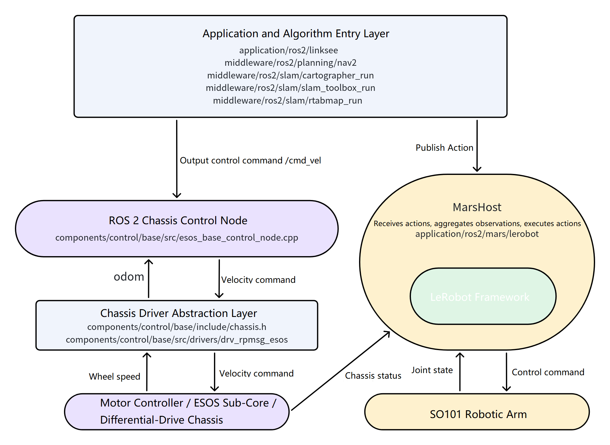

`application/ros2/linksee` provides full-robot application integration. `middleware/ros2/planning/nav2` provides navigation. `middleware/ros2/slam/cartographer_run`, `middleware/ros2/slam/slam_toolbox_run`, and `middleware/ros2/slam/rtabmap_run` provide different mapping and localization modes. All these modules connect to the chassis control pipeline through `/cmd_vel`.

## 2. Hardware

### 2.1 Appearance

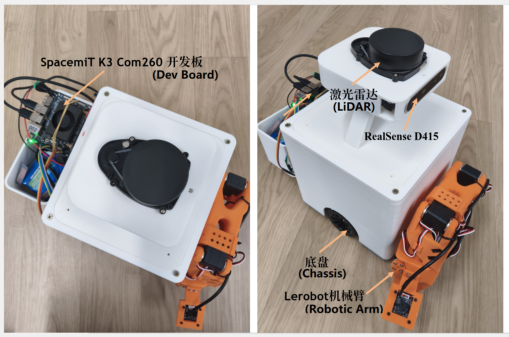

### 2.2 Bill of Materials

**3D-Printed Parts:**

Print the Linksee robot enclosure and chassis parts in advance. The 3D model files are available in the [spacemit-robotics/linksee-mechanical](https://github.com/spacemit-robotics/linksee-mechanical) repository, with the following structure:

```text
linksee-mechanical
├── LICENSE
└── step
  ├── chassis.step
  ├── cover.step
  ├── head.step
  ├── main_housing.step
  └── rear_enclosure.step
```

The 3D model files serve the following purposes:

| File | Part | Purpose |
| :-- | :-- | :-- |
| `step/chassis.step` | Chassis | The robot's bottom load-bearing structure. It mounts chassis-related components, including motors, wheels, casters/fixed wheels, the battery, and the driver board. |
| `step/main_housing.step` | Main housing | The robot's main enclosure. It secures the K3 controller, wiring harnesses, and internal electronics, and provides mounting support for upper structures. |
| `step/head.step` | Head | The robot's front/upper exterior part. It forms the Linksee head shape and provides mounting locations for sensors or forward-facing structures. |
| `step/cover.step` | Cover | A cover for the top of the main body or a service opening. It protects internal components and allows assembly and later maintenance. |
| `step/rear_enclosure.step` | Rear enclosure | The robot's rear enclosure. It protects rear wiring and internal components and completes the robot exterior. |

After printing, assemble the robot with the main components listed below, M4 self-tapping screws (15–20 mm), Dupont wires, and other accessories. Use the screws to connect the chassis, cover, and housing.

**Robot Arm Parts:**

The Linksee mobile-manipulation robot uses an [ARM101 follower arm](https://github.com/TheRobotStudio/SO-ARM100). For purchase reference, see the `SO-ARM100` link in the main bill of materials. Note that the `linksee-mechanical` repository contains only the 3D-printable parts for the Linksee vehicle; it does not include robot-arm models. To build the arm yourself, follow the [`SO-ARM100` repository](https://github.com/TheRobotStudio/SO-ARM100) documentation to prepare the ARM101 follower-arm parts, servos, and other materials.

**Note:** Connect the bottom-most arm servo directly to the housing. Remove any other components attached to that servo.

**Main Bill of Materials:**

| Item | Purchase Reference | Model | Qty. |
| :-- | :-- | :-- | :-- |
| K3 controller | | COM260 | 1 |
| ARM101 follower arm | <https://e.tb.cn/h.R4sNHFaEmy3Qgn1?tk=IlvQ5D62QjP> | Complete follower arm: 6 x 12 V servos, printed follower-arm parts, controller board, data cable, power supply, and G-clamp | 1 |
| 520 DC motor | <https://e.tb.cn/h.irv3MOgf5Ypwztr?tk=Poqm5iPOSL6> | MC520, 1:56 gear reduction, including wiring, brackets, couplings, and 65 mm black wheels | 2 |
| TB6612 driver | <https://ic-item.jd.com/10162327051022.html#crumb-wrap> | Dual-channel TB6612 with soldered pin headers | 1 |
| Caster | <https://e.tb.cn/h.isKSEn9zICLmVWB?tk=Yp9U5ilZAxt> | Reinforced CY-15A stainless-steel housing | 1 |
| Fixed wheel | <https://item.jd.com/10161843167223.html> | Black nickel-plated bracket with a 0.5-inch rubber fixed wheel | 1 |
| Battery | <https://item.jd.com/10079480141957.html> | 12 V, 7500 mAh | 1 |
| DC adapters | <https://item.jd.com/100112736411.html> | 5.5 x 2.5 mm male DC adapters (10-pack) and female DC adapters (10-pack) | 1 |
| Motor cable | <https://ic-item.jd.com/10214775527601.html> | XH2.54 6-pin (5 cables) + 1007#22 AWG, 300 mm, dual-ended, same-direction wiring | 1 |
| LiDAR | <https://ic-item.jd.com/100180910133.html> | YDLIDAR X3 Pro | 1 |

**Note:** Use same-direction ribbon cables to connect the motors to the driver board. If you use different motors or a different driver board, verify the pin definitions.

**Depth Camera Selection:**

For RGB-D navigation, RGB-D SLAM, or 3D point-cloud SLAM, use an Intel RealSense D4xx-series depth camera. The RealSense D415 and RealSense D435i have been validated and are recommended for initial integration and debugging.

**Other Material Specifications:**

| Item | Specification |
| :-- | :-- |
| Mounting bolts | M3 x 10 and M3 x 8 socket-head bolts and nuts |
| Self-tapping screws | M3.5 x 10 Phillips pan-head self-tapping screws with washers |
| Dupont wires | 2.54 mm |

### 2.3 Detailed Views

**Side and Interior**


**Chassis Details**

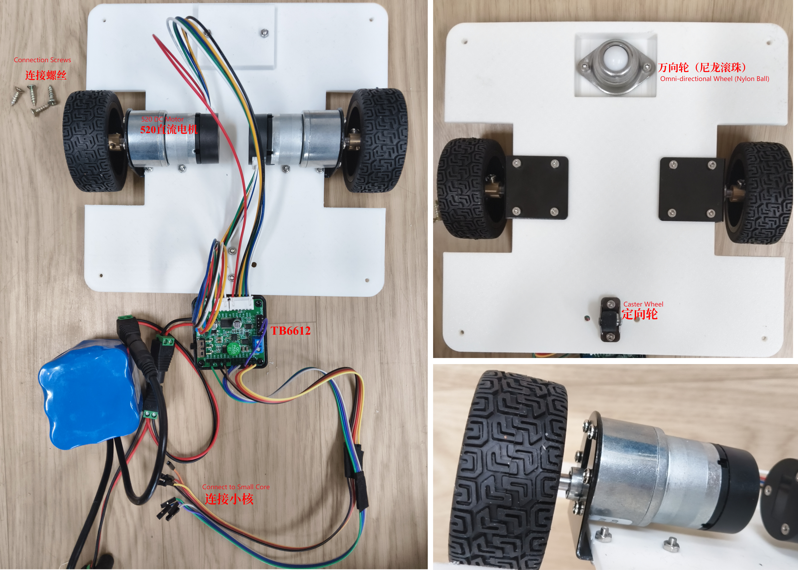

**Chassis Wiring**

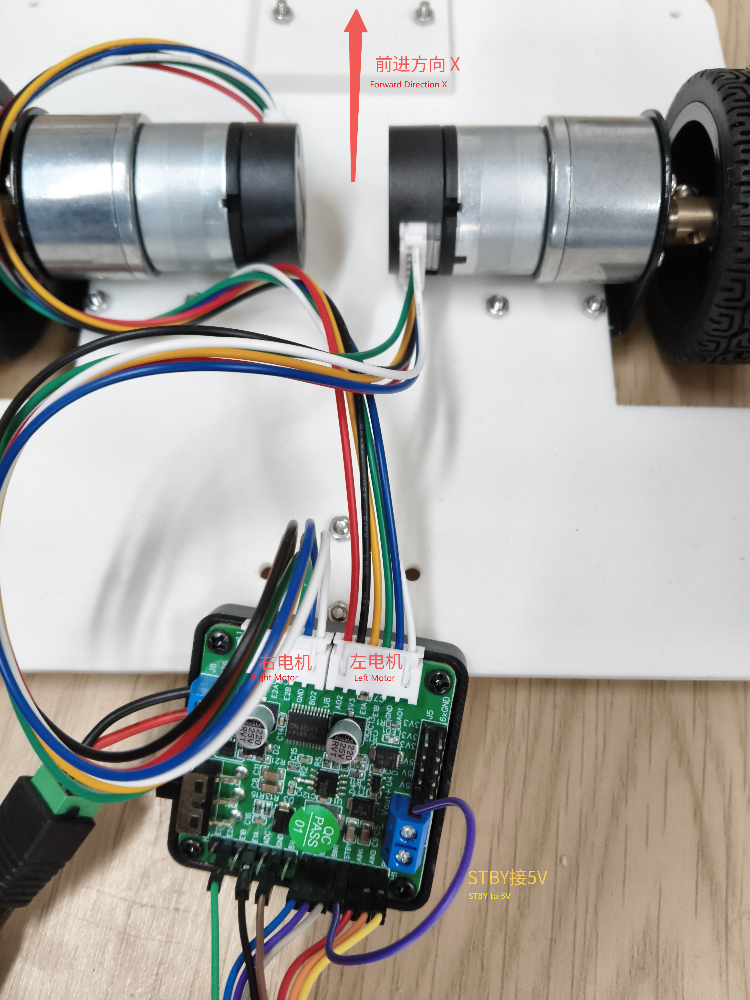

## 3. Environment Setup

### 3.1 Hardware Connections

Pin Mapping

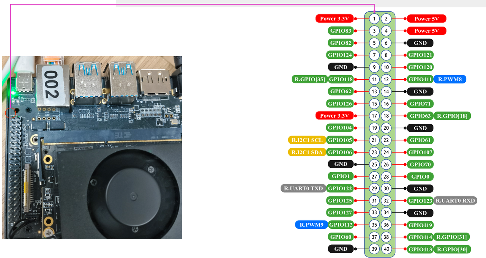

Debug UART Connection


Hardware Configuration and Wiring

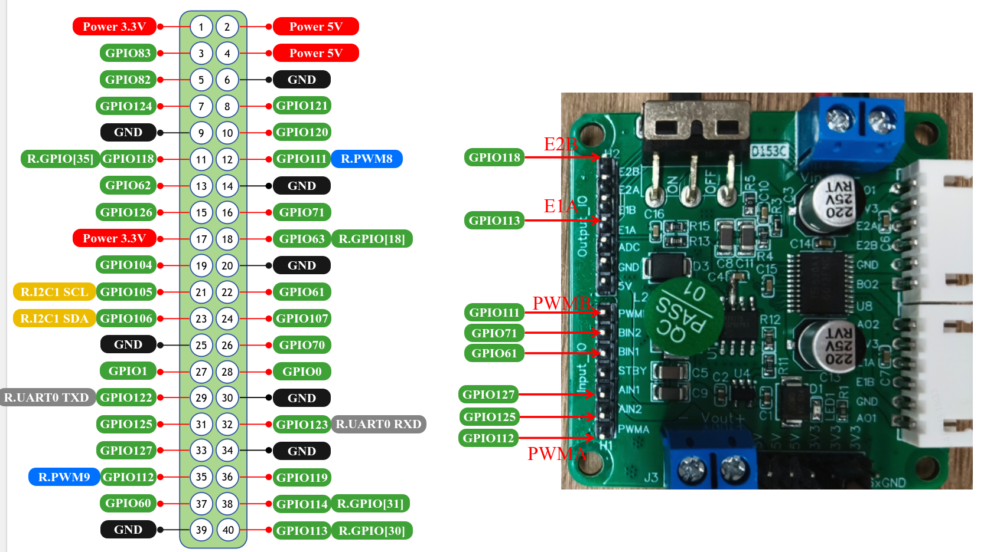

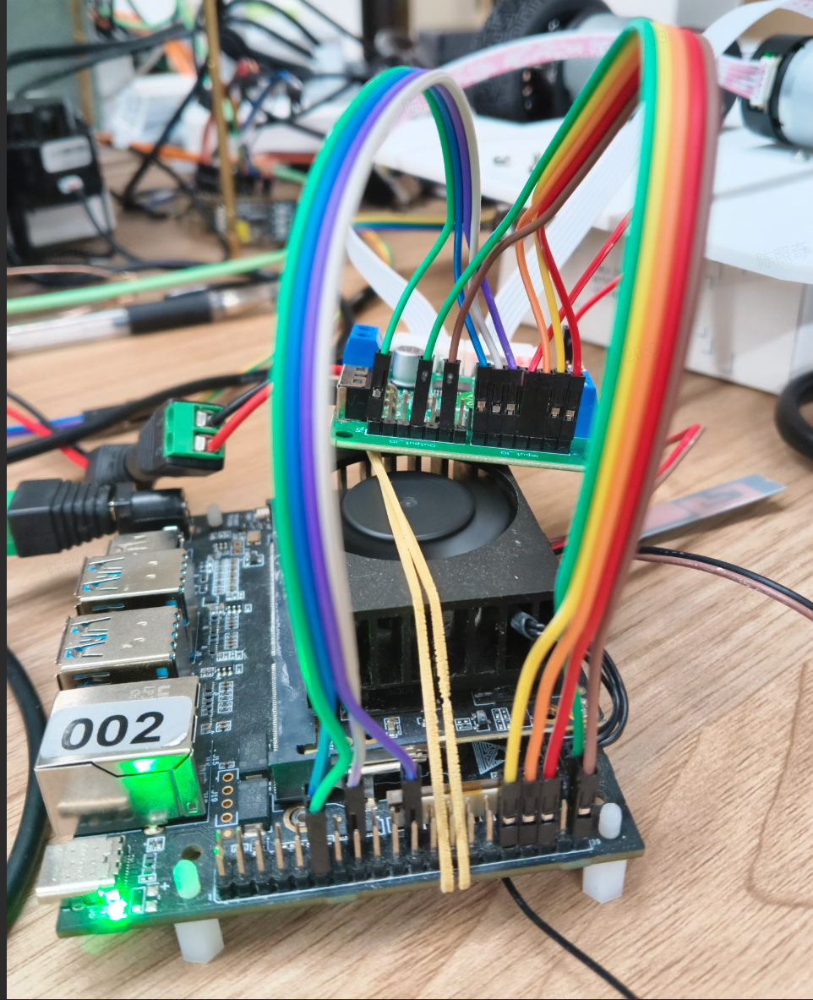

Motor 1 (Left)

| Function | Pin | Description |
| :-- | :-- | :-- |
| Direction control 0 | GPIO 125 -> AIN2 | H-bridge control |
| Direction control 1 | GPIO 127 -> AIN1 | H-bridge control |
| PWM | rpwm9 (GPIO 112) -> PWMA | 10 kHz PWM |
| Encoder channel A | GPIO 113 (R.GPIO[30]) -> E1A | Interrupt input |

Motor 2 (Right)

| Function | Pin | Description |
| :-- | :-- | :-- |
| Direction control 0 | GPIO 71 -> BIN2 | H-bridge control |
| Direction control 1 | GPIO 61 -> BIN1 | H-bridge control |
| PWM | rpwm8 (GPIO 111) -> PWMB | 10 kHz PWM |
| Encoder channel B | GPIO 118 (R.GPIO[35]) -> E2B | Interrupt input |

**Note:** The forward and reverse definitions can vary by motor. Adjust the direction-control order until the motor rotates in the expected direction.

### 3.2 Software Environment: Auxiliary Core

Use `bianbu26 lxqt` version 4.0 or later. Use the firmware recommended in [Flash the Image](../02-快速入门/2.2-镜像烧录.md). Earlier versions do not support communication between the main core and auxiliary core.

**Replace the Auxiliary-Core ITB File**

```
sudo apt update && sudo apt install -y --allow-downgrades wget
su root && cd ~
wget https://archive.spacemit.com/ros2/prebuilt/esos_kernel/update_esos.sh
bash update_esos.sh
```

Non-root users must configure permissions:

```
sudo tee /etc/udev/rules.d/99-rpmsg.rules <<EOF
KERNEL=="rpmsg*", MODE="0666"
KERNEL=="rpmsg_ctrl*", MODE="0666"
EOF
```

```
sudo udevadm control --reload-rules
sudo udevadm trigger
```

After the replacement succeeds, power-cycle the development board. The auxiliary-core serial console displays the following output:

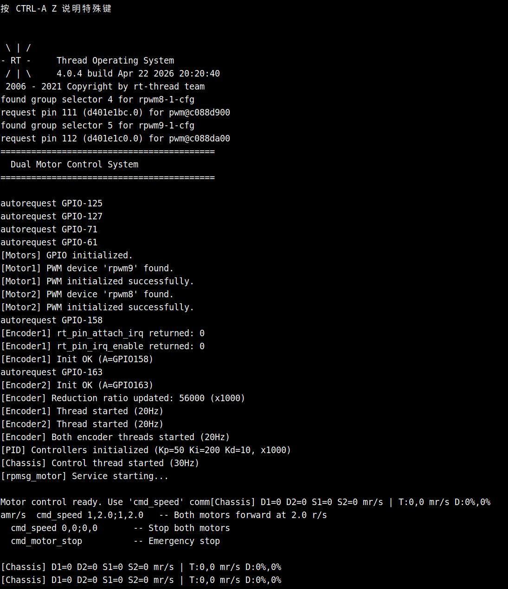

It continuously prints encoder readings and wheel speed in millirevolutions per second.

### 3.3 Linksee Software Environment Setup

Read [Build and Compile](../02-快速入门/2.3-构建编译.md) first to understand the SDK layout and build process.

**Install System Dependencies**

```
sudo apt update

sudo apt install ros-dev-tools ros-humble-ros-base \
python3-numpy 'ros-humble-cartographer*' 'ros-humble-nav*' libpcap-dev libuvc-dev \
ros-humble-filters ros-humble-turtlesim ros-humble-camera-info-manager  ros-humble-pcl-ros \
ros-humble-image-common ros-humble-image-geometry ros-humble-robot-localization \
ros-humble-joint-state-publisher liblgpio-dev libgpiod-dev 'ros-humble-rtabmap*' \
ros-humble-tf-transformations
```

```
pip config set global.index-url https://mirrors.aliyun.com/pypi/simple/
pip config set global.extra-index-url https://git.spacemit.com/api/v4/projects/33/packages/pypi/simple

pip install spacemit-audio spacemit-asr spacemit-vad --break-system-packages
```

**Download the Repository**

```
sudo apt update
sudo apt install repo

mkdir spacemit_robot
cd spacemit_robot

repo init -u https://github.com/spacemit-robotics/manifest.git -b main -m default.xml \
  --repo-url=https://gitee.com/spacemit-robotics/git-repo
repo sync -j4
repo start robot-dev --all
```

At the repository root, the directory contents are as follows:

```
root@k3:~/spacemit_robot# ls
application  build  components  middleware  scripts  target  tools
```

**Build**

```
source build/envsetup.sh
```

```
lunch # Select k3-com260-linksee.
```

Full build:

```
m
```

Full clean:

```
m clean
```

### 3.4 PC Host Environment Setup

- Ubuntu 22.04 is recommended.
- Install ROS 2 Humble by following <https://docs.ros.org/en/humble/Installation/Ubuntu-Install-Debs.html>.

```
mkdir -p ~/visual_ws/src && cd ~/visual_ws/src
git clone https://github.com/spacemit-robotics/ros2_visualization.git
cd ..
source /opt/ros/humble/setup.bash
colcon build
```

This package is primarily used for RViz2 visualization.

## 4. SLAM Mapping

### 4.1 Procedure

Run `source ~/spacemit_robot/output/staging/setup.bash` in every terminal.

1. **Start the Chassis**

   ```
   ros2 launch linksee base_control_esos.launch.py
   ```

   Terminal output:

   

2. **Start the LiDAR**

   ```
   ros2 launch linksee start_ydlidar.launch.py
   ```

   Terminal output:

   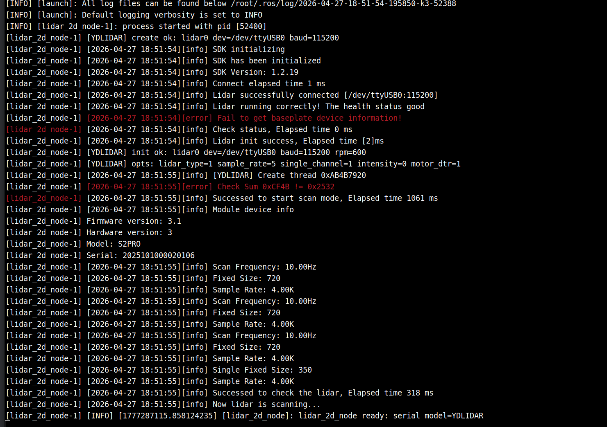

3. **Start Mapping**

   Open a new terminal.

   ```
   source ~/spacemit_robot/output/staging/setup.bash
   ```

   ```
   ros2 launch cartographer_run cartographer_2d.launch.py
   ```

   Terminal output:

   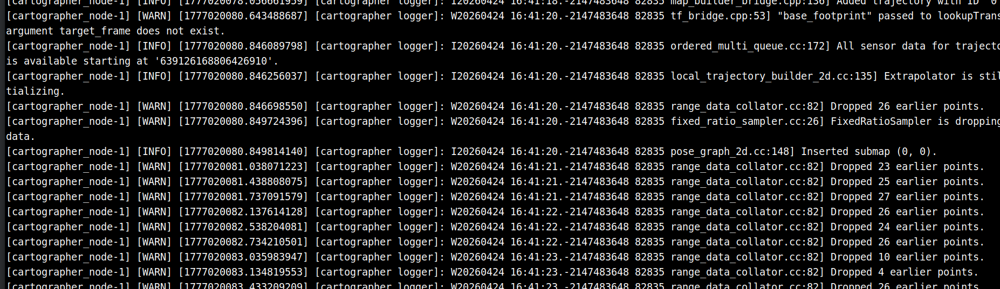

4. **Start Keyboard Teleoperation**

   ```
   ros2 run teleop_twist_keyboard teleop_twist_keyboard
   ```

5. **Visualize on the PC**

   ```
   source ~/visual_ws/install/setup.bash
   ros2 launch visualization display_slam.launch.py
   ```

6. **Save the Map**

   Open a new terminal.

   ```
   source /opt/ros/humble/setup.bash
   ```

   ```
   ros2 run nav2_map_server map_saver_cli -f my_map
   ```

   The saved map is used later by the navigation and autonomous patrol tasks.

### 4.2 Results

SLAM result:


## 5. Visual SLAM Mapping

### 5.1 Procedure

Run `source ~/spacemit_robot/output/staging/setup.bash` in every terminal.

Install the dependencies:

```
sudo apt install 'ros-humble-rtabmap*' ros-humble-aruco-markers-msgs
```

1. **Start the Chassis**

   ```
   ros2 launch linksee base_control_esos.launch.py
   ```

2. **Start the LiDAR**

   ```
   ros2 launch linksee start_ydlidar.launch.py
   ```

3. **Start Odometry**

   ```
   ros2 launch linksee start_odom.launch.py
   ```

4. **Start the Depth Camera**

   ```
   ros2 launch realsense2_camera rs_launch.py camera_namespace:=/
   ```

   Terminal output:

   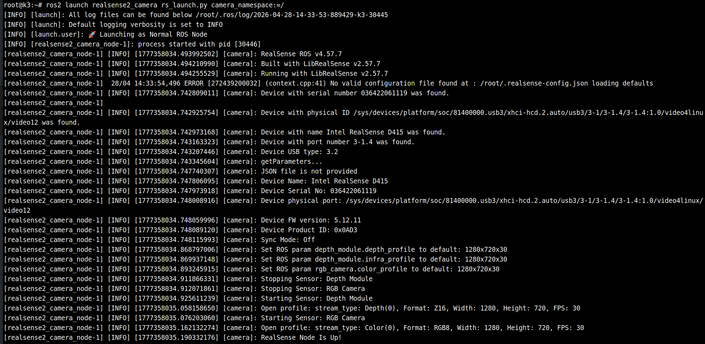

5. **Start RGB-D Mapping**

   ```bash
   ros2 launch rtabmap_run rgbd_slam.launch.py
   ```

   **Expected result:** Nodes such as `rtabmap`, `point_cloud_xyz`, and `obstacles_detection` start successfully and begin publishing `/map`, `/camera/cloud`, `/camera/obstacles`, and `/camera/ground`.

   Terminal output:

   

6. **Visualize on the PC**

   ```bash
   source ~/visual_ws/install/setup.bash
   ros2 launch visualization display_rgbd.launch.py
   ```

   **Expected result:** RViz displays RGB-D visualization results, point clouds, and map updates.

   

7. **Start Keyboard Teleoperation**

   ```
   ros2 run teleop_twist_keyboard teleop_twist_keyboard
   ```

   Use the keyboard to move the robot and expand the mapped area.

### 5.2 Results


## 6. Nav2 Navigation

- Before navigation, copy the map created with the LiDAR to `spacemit_robot/middleware/ros2/planning/nav2/map`. Then run `lunch` and perform a full `m` build again. Use the default `my_map` filename.
- Make sure the robot is at the starting point used for mapping.

### 6.1 Procedure

1. **Start the Chassis**

   ```
   source ~/spacemit_robot/output/staging/setup.bash
   ```

   ```
   ros2 launch linksee base_control_esos.launch.py
   ```

2. **Start the LiDAR**

   ```
   ros2 launch linksee start_ydlidar.launch.py
   ```

3. **Start Odometry**

   ```
   ros2 launch linksee start_odom.launch.py
   ```

4. **Start Navigation**

   ```
   ros2 launch nav2 nav2.launch.py
   ```

   Terminal output:

   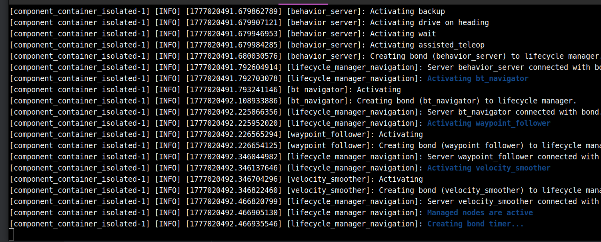

5. **Visualize on the PC**

   ```
   source ~/visual_ws/install/setup.bash
   ros2 launch visualization display_navigation.launch.py
   ```

### 6.2 Results

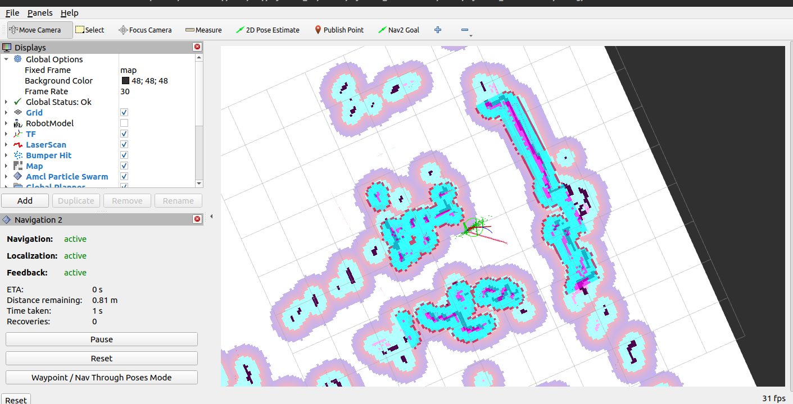


## 7. Autonomous Patrol

- Before autonomous patrol, copy the map created with the LiDAR to `spacemit_robot/middleware/ros2/planning/nav2/map`. Then run `lunch` and perform a full `m` build again. Use the default `my_map` filename.
- Make sure the robot is at the starting point used for mapping.
- The patrol demonstration requires an area of at least 2 m x 2 m.

### 7.1 Procedure

1. **Start the Chassis**

   ```
   source ~/spacemit_robot/output/staging/setup.bash
   ```

   ```
   ros2 launch linksee base_control_esos.launch.py
   ```

2. **Start the LiDAR**

   ```
   ros2 launch linksee start_ydlidar.launch.py
   ```

3. **Start Odometry**

   ```
   ros2 launch linksee start_odom.launch.py
   ```

4. **Start Navigation**

   ```
   ros2 launch nav2 nav2.launch.py
   ```

   Terminal output:

   

5. **Start the Patrol Node**

   ```
   ros2 run nav2 autonomous_patrol
   ```

   Terminal output:

   

6. **Enable Patrol**

   ```
   ros2 topic pub --once /square_waypoints_enable std_msgs/msg/Bool "{data: true}"
   ```

7. **Visualize on the PC**

   ```
   source ~/visual_ws/install/setup.bash
   ros2 launch visualization display_navigation.launch.py
   ```

### 7.2 Results


## 8. Voice Control for the Robot

**Hardware Connection:**


### 8.1 Procedure

Run `source ~/spacemit_robot/output/staging/setup.bash` in every terminal.

1. **Start the Chassis**

   ```
   ros2 launch linksee base_control_esos.launch.py
   ```

2. **Start the LiDAR**

   ```
   ros2 launch linksee start_ydlidar.launch.py
   ```

3. **Start Odometry**

   ```
   ros2 launch linksee start_odom.launch.py
   ```

4. **Start Chassis Voice Control**

   ```
   ros2 launch linksee voice_cmd.launch.py
   ```

   Terminal output:

   

5. **Start the Dispatcher Node**

   ```
   ros2 run linksee voice_dispatcher_node.py
   ```

   The dispatcher node subscribes to the `/asr_text` topic published by the speech-to-text node and parses the text into specific commands.

   Terminal output:

   

6. **Start the Speech-to-Text Node**

   ```
   ros2 run linksee asr_node.py -r 48000
   ```

   `-r` specifies the microphone sample rate. Adjust it for your hardware. For other parameters, see `~/spacemit_robot/application/ros2/linksee/scripts/asr_node.py`.

   **Expected Behavior**

   When the voice input is "turn left", "turn right", "move forward", or "move backward", the robot performs the corresponding action.

   Terminal output:

   

### 8.2 Results


## 9. Linksee End-to-End Inference

Building on the Linksee chassis, sensor, and navigation capabilities described in the previous sections, this section adds an end-to-end mobile-manipulation control solution. It covers data collection, model training, inference deployment, and the complete workflow for exposing inference as tools that trigger mobile-manipulation tasks through natural language.

### 9.1 Overview

This solution supports the following capabilities:

- **Communication and control**: Use a Host/Client architecture for Linksee robot control, observation collection, and remote communication.
- **Teleoperation**: Use an SO101 leader arm to control the Linksee arm and the keyboard to control the Linksee chassis for mobile-manipulation teleoperation.
- **Data collection**: Collect end-to-end datasets containing robot-arm, chassis, and multi-camera observations.
- **Model training**: Train an ACT model from the collected data, with support for resuming interrupted training.
- **Inference evaluation**: Deploy the trained model to the inference device and evaluate end-to-end inference on the Linksee robot.
- **Natural-language control**: Package the Linksee end-to-end inference workflow as a native application, register its capabilities as MCP tools through the `mlink device → mlink gateway → MCP` pipeline, and integrate them with the Hermes Agent framework so natural-language commands can control Linksee mobile-manipulation tasks.

The Linksee end-to-end control workflow uses a distributed Host/Client architecture:

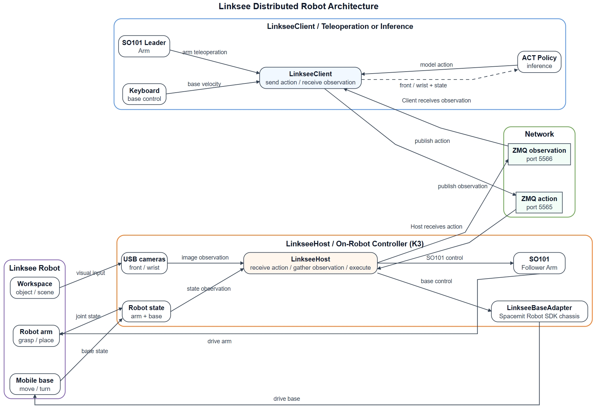

- `LinkseeHost` connects to the Linksee robot, instantiates Linksee, and directly controls the arm and chassis.
  - The arm is controlled through the SO101 solution from LeRobot.
  - The chassis uses `LinkseeBaseAdapter` to connect to the SpacemiT Robot SDK `third_party/chassis` shared library.
- `LinkseeClient` sends teleoperation or inference data to `LinkseeHost`.
  - It sends actions through ZMQ.
  - It receives observations through ZMQ.

**`LinkseeHost` and `LinkseeClient` can run on the same device or on separate devices.**

### 9.2 Hardware Requirements

| Item | Details |
| :-- | :-- |
| Hardware/robot | Linksee mobile-manipulation robot |
| Training platform | Server with an RTX-series or newer GPU |
| Teleoperation and data-collection platform (optional) | PC |
| Inference platform | SpacemiT K3 development board with Bianbu v3.0+ firmware |
| Robot arm | SO101 leader arm, required for teleoperation and data collection |
| Visual input | Two USB cameras, named `front` and `wrist` in this example |
| Key peripherals and interfaces | The follower-arm serial port is typically `/dev/ttyACM0`; the chassis serial port is typically `/dev/ttyACM1`; cameras use `/dev/video*` |

Before running the workflow, verify the following:

- The Linksee arm, chassis, and USB cameras are connected to the K3 development board.
- The SO101 leader arm is connected to the PC during teleoperation and data collection.

The Linksee arm, chassis, and cameras connect to the K3 development board through USB:


The SO101 leader arm connects to the PC through USB:

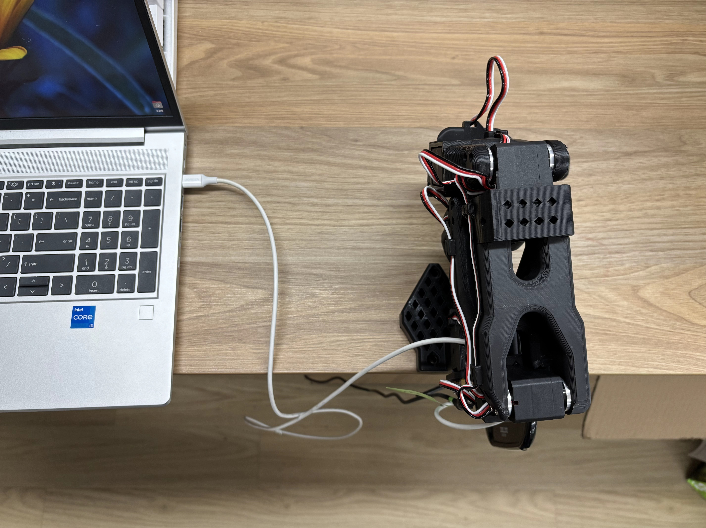

### 9.3 Scenario 1: Linksee End-to-End Control

This scenario covers the complete Linksee mobile-manipulation workflow, from real-robot teleoperation and data collection through ACT model training and inference.

#### 9.3.1 Environment Setup

> [!NOTE]
>
> This scenario uses three code environments:
>
> 1. Teleoperation and data collection: Install the dependencies on both the PC and the K3 development board.
> 2. Training: Install the dependencies on the GPU server.
> 3. Inference evaluation: Install the dependencies only on the K3 development board.

1. Clone the repository

   ```bash
   git clone git@github.com:spacemit-robotics/lerobot.git
   ```

2. Install system dependencies

   ```
   sudo apt update

   sudo apt install ffmpeg

   sudo apt install -y \
     libavformat-dev \
     libavcodec-dev \
     libavdevice-dev \
     libavutil-dev \
     libavfilter-dev \
     libswscale-dev \
     libswresample-dev

   sudo apt install -y \
     build-essential \
     cmake \
     pkg-config \
     python3-dev
   ```

   - `python3-venv`: Used to create a Python virtual environment.
   - `ffmpeg`: Used for video-frame processing and dataset video encoding.

3. Install LeRobot dependencies

   Create a virtual environment and install the dependencies:

   ```bash
   cd ~/lerobot

   # Set the Python version to 3.12. Install the pyenv environment first by following Section 3.3 of "3.3.1 Real-Robot Training and Inference".
   pyenv local 3.12.13
   python3 -V

   # Create and activate the virtual environment.
   python3 -m venv ~/.lerobot-venv
   source ~/.lerobot-venv/bin/activate

   # Install the torch and wandb dependencies.
   pip install torch==2.7.1
   pip install torchvision==0.22.0
   pip install wandb==0.24.0
   pip install pyarrow==23.0.0

   # Install dependencies for LeRobot and LeKiwi/Linksee.
   pip install -e .
   pip install "lerobot[lekiwi]"
   ```

4. Build the Linksee chassis shared library

   On the LinkseeHost system, enter the repository and build the chassis shared library:

   ```bash
   cd ~/lerobot
   ./scripts/build_mars_chassis.sh
   ```

   The default output is:

   ```text
   third_party/chassis/build/libchassis.so
   ```

   If you do not use the default vendored library path, specify the absolute `.so` path with `--robot.base_control_library_path` when starting the Host.

5. Add the user to the `video` group for camera access

   ```bash
   sudo usermod -aG video $USER
   ```

   `USER` is the current system user. Sign in again for this change to take effect.

6. Identify the robot arm, chassis, and camera device indexes

   ```bash
   # List the robot arm and chassis device nodes.
   lerobot-find-port

   # List the camera device nodes.
   lerobot-find-cameras opencv
   ```

7. Grant read and write access to the robot arm and chassis devices

   ```
   sudo chmod 666 /dev/ttyACM*
   ```

8. Add the user to the `video` group for camera access

   ```bash
   sudo usermod -aG video $USER
   ```

   `USER` is the current system user. Sign in again for this change to take effect.

#### 9.3.2 Start LinkseeHost

On the LinkseeHost system, enter the repository:

```bash
cd ~/lerobot
source ~/.lerobot-venv/bin/activate
```

Start the Host:

```bash
python -m lerobot.robots.linksee.linksee_host \
  --robot.id=my_linksee \
  --robot.port=/dev/ttyACM0 \
  --robot.base_driver=drv_uart_esp32 \
  --robot.base_dev_path=/dev/ttyACM1 \
  --robot.base_baud=115200 \
  --robot.base_type=diff_2wd \
  --robot.base_left_wheel_gain=1.0 \
  --host.port_zmq_cmd=5565 \
  --host.port_zmq_observations=5566 \
  --host.connection_time_s=3600 \
  --robot.cameras='{
    "front": {"type":"opencv","index_or_path":"/dev/video15","width":640,"height":480,"fps":30,"fourcc":"MJPG"},
    "wrist": {"type":"opencv","index_or_path":"/dev/video13","width":640,"height":480,"fps":30,"fourcc":"MJPG"}
  }'
```

> [!TIP]
>
> 1. Replace `/dev/ttyACM0` and `/dev/ttyACM1` with the actual ports on your system.
> 2. Replace the `front` and `wrist` camera index IDs with the actual camera indexes on your system.
> 3. The first startup initiates the robot-arm calibration procedure. See the [SO101 arm calibration procedure](https://huggingface.co/docs/lerobot/en/so101#calibrate).
> 4. Calibration files are stored in `~/.cache/huggingface/lerobot/calibration`.

Common Host startup parameters:

| Parameter | Description |
| :-- | :-- |
| `--robot.port` | Follower-arm serial port on the robot |
| `--robot.base_dev_path` | Chassis serial port on the robot |
| `--robot.base_control_library_path` | Optional. Absolute `.so` path when not using the default vendored library path |
| `--robot.base_driver` | Chassis driver type. The default for a physical chassis is `drv_uart_esp32` |
| `--robot.base_baud` | UART baud rate |
| `--robot.base_type` | Chassis model. This example uses `diff_2wd` |
| `--robot.base_left_wheel_gain` | Left-wheel gain for chassis speed calibration |
| `--host.port_zmq_cmd` | Port on which the Host receives Client actions |
| `--host.port_zmq_observations` | Port on which the Host publishes observations |
| `--host.connection_time_s` | Maximum Host runtime; the Host exits automatically when it expires |
| `--robot.cameras` | Camera configuration. This example includes `front` and `wrist` cameras |

> [!TIP]
>
> Set `fourcc="MJPG"` explicitly for UVC cameras so they output Motion-JPEG directly. This typically reduces USB bandwidth usage and makes `640x480@30fps` more stable. Otherwise, some cameras use `YUYV` by default, which can cause unstable observation frame rates on the Host, dropped recording frames, or choppy inference display.

On the K3 development board, the Linksee chassis supports auxiliary-core communication through the RPMSG driver. When using the RPMSG driver, replace the UART-related parameters with the following:

```bash
--robot.base_driver=drv_rpmsg_esos \
--robot.base_rpmsg_ctrl_dev=/dev/rpmsg_ctrl0 \
--robot.base_rpmsg_data_dev=/dev/rpmsg0 \
--robot.base_rpmsg_service_name=rpmsg:motor_ctrl \
--robot.base_rpmsg_local_addr=1003 \
--robot.base_rpmsg_remote_addr=1002
```

#### 9.3.3 Start Teleoperation on the Client

The teleoperation script is located at:

```text
examples/linksee/teleoperate.py
```

At a minimum, update the following code:

```python
# Set the Host IP address and the Linksee robot arm hf_id.
# When linksee_host_remote_ip is 127.0.0.1, both LinkseeHost and LinkseeClient run on the K3 development board.
robot_config = LinkseeClientConfig(remote_ip="linksee_host_remote_ip", id="my_linksee")

# Set the leader-arm serial port and leader-arm hf_id.
teleop_arm_config = SO101LeaderConfig(port="/dev/ttyACM0", id="my_linksee_leader")
```

Ensure that the `Host` is connected, then start teleoperation:

```bash
cd ~/lerobot
source ~/.lerobot-venv/bin/activate
python examples/linksee/teleoperate.py
```

During teleoperation:

- The SO101 leader arm controls the follower arm on the robot.
- The keyboard controls the Linksee chassis.

Chassis keyboard controls:

| Key | Function |
| :-- | :-- |
| `w` | forward |
| `s` | backward |
| `a` | left |
| `d` | right |
| `z` | rotate_left |
| `x` | rotate_right |
| `r` | speed_up |
| `f` | speed_down |
| `q` | Exit the teleoperation loop after sending one zero-velocity chassis command |

> [!NOTE]
>
> A two-wheel differential-drive chassis does not support lateral movement.

#### 9.3.4 Start Dataset Collection on the Client

> [!TIP]
>
> Data collection, recording, and training may require signing in to a Hugging Face account to upload datasets and models.
>
> ```bash
> hf auth login
> HF_USER=$(hf auth whoami | head -n 1 | awk '{print $3}')
> echo $HF_USER
> ```
>
> If you do not sign in to Hugging Face, set the `$HF_USER` variable manually:
>
> ```bash
> HF_USER=annyi   # Replace with your Hugging Face account name.
> echo $HF_USER
> ```

The Client data-collection script is located at:

```text
examples/linksee/record.py
```

Update the following code:

```python
REMOTE_IP = "linksee_host_remote_ip"
ROBOT_ID = "my_linksee"
LEADER_PORT = "/dev/ttyACM0"
LEADER_ID = "my_linksee_leader"
KEYBOARD_ID = "my_keyboard"

NUM_EPISODES = 30
FPS = 30
EPISODE_TIME_SEC = 600
RESET_TIME_SEC = 30
TASK_DESCRIPTION = "pick and place the cube on the orange box"
# Dataset name, used for training and inference.
HF_REPO_ID = "${HF_USER}/linksee-pick-place-move-v2"
PUSH_TO_HUB = False
# Whether to resume collection.
RESUME = False
```

Ensure that the `Host` is connected, then start data collection:

```bash
cd ~/lerobot
source ~/.lerobot-venv/bin/activate
python examples/linksee/record.py
```

After recording completes, the script performs the following actions:

- Runs `dataset.finalize()`.
- Runs `dataset.push_to_hub()` when `PUSH_TO_HUB=True` and this run saved at least one episode.

Resume behavior:

- `RESUME = True`: Continue recording into an existing dataset.
- `RESUME = False`: Create a new dataset.

You can also use the provided [dataset](https://archive.spacemit.com/spacemit-ai/model_zoo/vla/act/datasets/linksee-pick-place-move-v2.tar.gz) for training when the scenario is the same. After downloading it, extract it to `~/.cache/huggingface/lerobot/${HF_USER}/`.

#### 9.3.5 Train the ACT Model

After data collection, place the dataset in `lerobot/datasets` on the GPU server and start training. Use the standard LeRobot training entry point:

```bash
lerobot-train \
  --policy.type=act \
  --policy.repo_id=${HF_USER}/linksee_act_pick_place_move_v2 \
  --dataset.repo_id=${HF_USER}/linksee-pick-place-move-v2 \
  --dataset.root=datasets/linksee-pick-place-move-v2 \
  --output_dir=outputs/train/linksee_act_pick_place_move_v2 \
  --job_name=linksee_act_pick_place_move_v2 \
  --batch_size=4 \
  --steps=100000 \
  --policy.device=cuda \
  --policy.use_amp=True
```

Parameter descriptions:

| Parameter | Description |
| :-- | :-- |
| `--policy.type=act` | Train with the ACT policy |
| `--policy.repo_id` | Model identifier after training completes |
| `--dataset.repo_id` | Training dataset identifier |
| `--dataset.root` | Local dataset path; takes precedence over `dataset.repo_id` |
| `--output_dir` | Checkpoint output directory |
| `--job_name` | Training job name |
| `--batch_size` | Training batch size |
| `--steps` | Number of training steps |
| `--policy.device` | Training device, typically `cuda` |
| `--policy.use_amp` | Whether to enable mixed-precision training |

To resume training:

```bash
lerobot-train \
  --config_path=outputs/train/linksee_act_pick_place_move_v2/checkpoints/last/pretrained_model/train_config.json \
  --resume=true
```

After training completes, deploy the model checkpoint to the inference device. Example model path:

```text
outputs/train/linksee_act_pick_place_move_v2/checkpoints/100000/pretrained_model
```

You can also download the provided trained [model weights](https://archive.spacemit.com/spacemit-ai/model_zoo/vla/act/linksee_act_pick_place_move_v2.tar.gz).

#### 9.3.6 Start Inference on the Client

The inference script is located at:

```text
examples/linksee/evaluate.py
```

Update the following code:

```python
REMOTE_IP = "linksee_host_remote_ip"
ROBOT_ID = "my_linksee"
# Training dataset name.
TRAIN_DATASET_REPO_ID = "${HF_USER}/linksee-pick-place-move-v2"
NUM_EPISODES = 1
FPS = 30
EPISODE_TIME_SEC = 180
RESET_TIME_SEC = 20
TASK_DESCRIPTION = "pick and place the cube on the orange box"
# Model path, ending at `pretrained_model`.
HF_MODEL_ID = "outputs/train/linksee_act_pick_place_move_v2/checkpoints/100000/pretrained_model"
# Evaluation dataset name, distinct from the training dataset.
HF_DATASET_ID = "${HF_USER}/linksee-pick-place-move-v2-eval"
PUSH_TO_HUB = False
```

Also download the model and training dataset. The training dataset is used to create the evaluation dataset:

- Place the model at the location specified by the script.
- Place the training dataset in `~/.cache/huggingface/lerobot/${HF_USER}/`.

Ensure that the `Host` is connected, then run inference:

```bash
cd ~/lerobot
source ~/.lerobot-venv/bin/activate
python examples/linksee/evaluate.py
```

#### 9.3.7 Results

After inference succeeds, `LinkseeClient` uses actions output by the model to control `LinkseeHost`, which then drives the Linksee robot to perform the mobile-manipulation task:

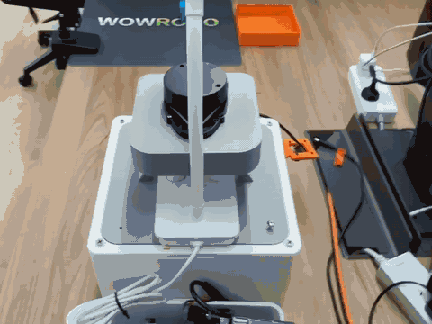

### 9.4 Scenario 2: Natural-Language Control of Linksee Mobile Manipulation

This scenario packages the Linksee Host/Client control workflow as a native C++ application. It exposes callable MCP tools through the `mlink device → mlink gateway → MCP → Hermes` pipeline and binds them to the Hermes Agent framework. Users can then trigger `linksee.start_host`, `linksee.start_inference`, `linksee.stop_host`, and `linksee.stop_inference` with natural language to start and stop Linksee end-to-end inference tasks.

#### 9.4.1 Prepare the Model and Runtime Environment

##### Download the Code

First, download the SpacemiT Robot SDK:

```bash
mkdir spacemit_robot
cd spacemit_robot
repo init -u https://github.com/spacemit-robotics/manifest.git -b main -m default.xml \
  --repo-url=https://gitee.com/spacemit-robotics/git-repo
repo sync -j4
repo start robot-dev --all
```

The Linksee natural-language control example is located at:

```text
spacemit_robot/application/ros2/linksee/linksee_app
```

The application includes the following components:

- `linksee_native`: Local command-line entry point for directly starting or stopping the Linksee Host and inference workflows.
- `linksee_device`: An mlink device process that dynamically registers Linksee tools with the gateway.
- `scripts/run_host.py`: Linksee Host startup entry point that wraps `lerobot.robots.linksee.linksee_host`.
- `scripts/evaluate.py`: Linksee ACT inference entry point that loads the local model and records evaluation data.
- `scripts/start_host.sh` and `scripts/start_inference.sh`: Start the Host and inference processes in the background.
- `scripts/stop_host.sh` and `scripts/stop_inference.sh`: Stop the Host and inference processes.

Before the first run, verify that the robot arm, chassis, and cameras are connected correctly. See [Section 9.2](#92-hardware-requirements) for the hardware connection diagram.

##### Prepare the Model

Before running, copy the trained model to the `models` directory. You can download the provided trained [model weights](https://archive.spacemit.com/spacemit-ai/model_zoo/vla/act/linksee_act_pick_place_move_v2.tar.gz).

```text
spacemit_robot/application/ros2/linksee/linksee_app/models/linksee_act_pick_place_move_v2/checkpoints/100000/pretrained_model
```

The default inference evaluation dataset directory is:

```text
application/ros2/linksee/linksee_app/datasets/linksee_pick_place_move_v2_eval
```

Before each inference run, `scripts/evaluate.py` checks that the model directory exists and clears the previous evaluation dataset directory to prevent historical data from being mixed into new results. If the actual model path or model version differs, update the `MODEL_DIR` configuration in `scripts/evaluate.py`.

##### Prepare the Dataset

Inference creates an evaluation dataset instance from the training dataset. First, place the training dataset in `~/.cache/huggingface/lerobot/${HF_USER}/`.

You can reuse the provided [training dataset](https://archive.spacemit.com/spacemit-ai/model_zoo/vla/act/datasets/linksee-pick-place-move-v2.tar.gz) when the scenario is the same.

##### Verify Camera and Robot Arm Device Indexes

Check the camera and robot-arm device indexes and ensure they match the configuration in `scripts/start_host.sh`.

##### Install System Dependencies

```bash
sudo apt update
sudo apt install -y python3-cryptography libssl-dev cargo rustc pkg-config build-essential python3-dev
```

##### Install the Virtual Environment

The Linksee mobile-manipulation workflow requires a Python environment. Before the first run, prepare a virtual environment for this application:

```bash
# Enter the Spacemit Robot SDK and set environment variables.
cd spacemit_robot
source build/envsetup.sh

# Set the Python version to 3.12.
pyenv local 3.12.13
python3 -V

m_env_build application/ros2/linksee/linksee_app
```

Alternatively, install it from the application directory:

```bash
cd application/ros2/linksee/linksee_app
bash scripts/setup_env.sh
```

The script creates the virtual environment under the repository root:

```text
output/envs/linksee_app
```

##### Build the Chassis Library

```bash
cd components/thirdparty/lerobot
./scripts/build_mars_chassis.sh
```

#### 9.4.2 Build mlink Device Dependencies

At build time, `linksee_device` depends on headers and shared libraries provided by `mlink`. Before building the Linksee native application, build `mlink device`:

```bash
cd spacemit_robot
source build/envsetup.sh
cd components/agent_tools/mlink_device
mm
```

After the build completes, the following outputs are typically available:

```text
output/staging/include/mlink.h
output/staging/lib/libmlink_device.so
output/staging/bin/mlink_device_test
```

Where:

- `output/staging/include/mlink.h`: Header used when compiling `linksee_device`.
- `output/staging/lib/libmlink_device.so`: Shared library used when linking and running `linksee_device`.
- `output/staging/bin/mlink_device_test`: Test program included with the `mlink device` component.

#### 9.4.3 Build the Linksee Native Application

Build from the application directory:

```bash
cd spacemit_robot
source build/envsetup.sh
cd application/ros2/linksee/linksee_app
mm
```

After the build completes, the outputs are installed at:

```text
output/staging/bin/linksee_native
output/staging/bin/linksee_device
```

- `output/staging/bin/linksee_native`: Local command-line entry point.
- `output/staging/bin/linksee_device`: mlink device process that dynamically registers tools with the gateway and forwards calls to `linksee_native`.

For local debugging only, you can also use standalone CMake:

```bash
cd application/ros2/linksee/linksee_app
cmake -B build -S .
cmake --build build
```

The local outputs are then located at:

```text
build/linksee_native
build/linksee_device
```

#### 9.4.4 Verify Linksee Tools Directly

You can first verify `linksee_native` directly from the command line:

```bash
linksee_native tool-start-host
linksee_native tool-start-inference
linksee_native tool-stop-inference
linksee_native tool-stop-host
```

Command descriptions:

| Command | Description |
| :-- | :-- |
| `linksee_native tool-start-host` | Start the Linksee Host process, connect the arm, chassis, and cameras, and publish observations |
| `linksee_native tool-start-inference` | Start the Linksee ACT inference process, load the local model, and send actions to the Host |
| `linksee_native tool-stop-inference` | Stop the Linksee inference process |
| `linksee_native tool-stop-host` | Stop the Linksee Host process |

By default, `start_host.sh` starts the Host in the background and writes its log and PID to:

```text
/tmp/linksee_host.log
/tmp/linksee_host.pid
```

By default, `start_inference.sh` starts the inference workflow in the background and writes its log and PID to:

```text
/tmp/linksee_inference.log
/tmp/linksee_inference.pid
```

The default Host startup script uses the following device configuration:

```text
follower arm: /dev/ttyACM0
base device:  /dev/ttyACM1
front camera: /dev/video15
wrist camera: /dev/video13
```

If your devices differ, update the port and camera configuration in `application/ros2/linksee/linksee_app/scripts/start_host.sh`.

#### 9.4.5 Start mlink Device and Verify Tool Registration

1. Start the gateway:

   ```bash
   cd spacemit_robot
   source build/envsetup.sh
   m_env_build components/agent_tools/mlink_gateway

   source output/envs/mlink-gateway/bin/activate
   mlink gateway restart
   ```

2. Start `linksee_device`:

   ```bash
   linksee_device unix linksee
   ```

3. Check the gateway tool list:

   ```bash
   mlink gateway tools
   ```

   If registration succeeds, the following tools are listed:

   ```text
   linksee.start_host
   linksee.start_inference
   linksee.stop_host
   linksee.stop_inference
   ```

#### 9.4.6 Call the Tools from Hermes Using Natural Language

1. Install Hermes:

   ```bash
   sudo apt-get update
   sudo apt-get install --reinstall hermes-agent
   ```

2. Configure the model:

   ```bash
   hermes model
   ```

   Follow the command-line wizard to configure the key and model.

3. Bind the MCP server

   Add the local gateway HTTP MCP endpoint to the Hermes configuration by appending the following content to `~/.hermes/config.yaml`:

   ```yaml
   mcp_servers:
       mlink-gateway:
           transport: http
           url: http://127.0.0.1:18765/mcp
           enabled: true
   ```

4. Start the interactive CLI:

   ```bash
   hermes
   ```

   After `mlink gateway` is running and `linksee_device` is connected, Hermes can discover the Linksee tools through MCP. You can issue natural-language commands in the Hermes CLI, for example:

   - "Start the Linksee Host."
   - "Start Linksee inference."
   - "Stop Linksee inference."
   - "Stop the Linksee Host."

   Hermes routes these requests to the corresponding MCP tools. The tools then cause `linksee_device` to invoke `linksee_native`, which executes the corresponding shell script.

#### 9.4.7 Results

Open a Hermes terminal on the K3 and use natural language to query the available tools:

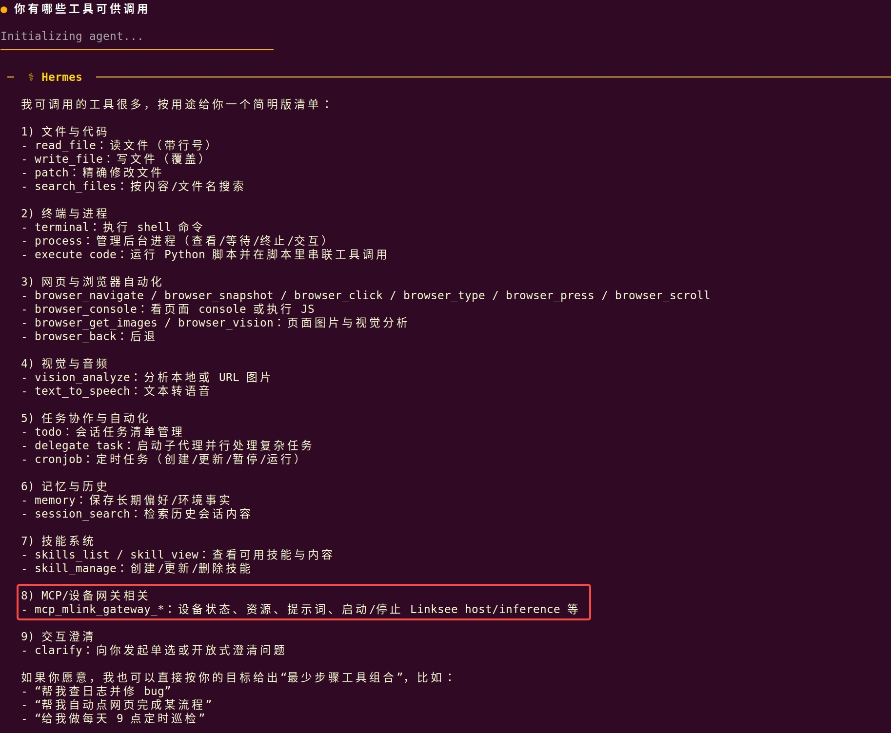

Enter "Start the Linksee Host" to start `LinkseeHost` in the background. Enter "Start the inference task" to start `LinkseeClient` inference in the background and control Linksee mobile manipulation. The resulting behavior is shown in [Section 9.3.7](#937-results).

## 10. Perceptive Grasping

`perceptive_grasp` is a closed-loop tabletop perceptive-grasping application for the Linksee wheeled robot. The system detects and segments targets from RGB-D images, generates top-grasp or side-grasp paths through depth back-projection, eye-to-hand calibration, and 3D geometric planning, and then drives the chassis, robot arm, and gripper to align, grasp, place, and recover safely.

The same pipeline supports three deployment modes:

| Runtime mode | Configuration files | RGB-D input | Execution backend | Deployment |
| --- | --- | --- | --- | --- |
| Linksee physical robot | `config/grasp_pipeline.yaml` | RealSense D435i or `spacemit_las2` | Linksee SO101, gripper, and chassis | K3 |
| Local MuJoCo on PC | `config/grasp_pipeline_mujoco_ur5e.yaml` and `config/grasp_pipeline_remote_mujoco_ur5e.yaml` | Virtual MuJoCo RGB-D camera | MuJoCo UR5e | Both the simulation service and pipeline run on the PC |
| Remote MuJoCo on PC/K3 | Same as above | Virtual MuJoCo RGB-D camera provided by the PC | MuJoCo UR5e on the PC | Service on the PC; pipeline on the K3 |

The system consists of the following modules:

- Perception input: RealSense D435i, `spacemit_las2`, or a MuJoCo backend, which outputs pixel-aligned color images, depth images, and camera intrinsics.
- Object detection: K3 uses `vision_service`, while the PC uses OpenCV DNN. Both run YOLOv8-Seg and output object classes, bounding boxes, and segmentation masks. Simulation configurations can also refine or supplement masks using instance colors.
- 3D estimation: `grasp_geometry`, which generates the target point cloud and estimates the tabletop plane, 3D dimensions, and horizontal principal axis.
- Task control: `grasp_pipeline`, which handles target association, strategy locking, re-perception after observation or chassis actions, execution orchestration, and failure recovery.
- Grasp planning: `grasp_planner` and `grasp_geometry`, which generate and validate top-grasp or side-grasp candidates.
- Robot-arm execution: `spacemit_manipulator`, `grasp`, or a MuJoCo executor, which performs approach, grasping, lifting, placing, homing, and failure recovery.
- Chassis alignment: `libchassis`, which adjusts the robot's position relative to the target.
- Voice interaction: `spacemit_audio`, VAD, ASR, and TTS, which receive commands and announce status.

This solution is intended for single-object grasping on a tabletop or in a close-range scene. Chassis assistance does not provide navigation, obstacle avoidance, or global path planning.

### 10.1 Overview

The perceptive-grasping pipeline is shown below:

1. **Perception input**: The stereo camera outputs color images, aligned depth, and camera intrinsics.
2. **Object detection**: YOLOv8-Seg outputs object classes, bounding boxes, and segmentation masks. The pipeline associates the same target across consecutive frames and waits for the target to become stable.
3. **3D estimation**: The geometric planner generates the target point cloud, fits the tabletop plane, estimates the target length, width, height, and horizontal principal axis, and performs an initial top-grasp or side-grasp classification.
4. **Closed-loop planning**: The pipeline locks the grasp strategy, moves to the corresponding observation pose, and detects the target again after the observation or chassis movement. Candidates must pass workspace, IK, joint-limit, tabletop-clearance, and complete-path checks.
5. **Robot-arm execution**: The Linksee arm performs approach, grasp, lift, placement, homing, and failure recovery in sequence.

Closed-loop planning also includes the following paths:

- **Chassis-assisted alignment**: When the target is outside the comfortable grasping zone, the chassis moves a short distance and stops. The pipeline then returns to target detection and reacquires color and depth data.
- **Voice interaction**: ASR sends grasping commands to the pipeline, and TTS reports the pipeline status.

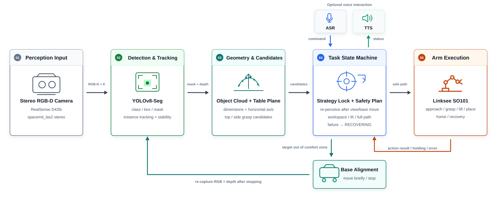

### 10.2 Hardware Preparation

The following hardware is required:

- A Linksee wheeled robot with the K3 compute platform, robot arm, differential-drive chassis, and body structure.
- A stereo camera: either a RealSense D435i depth camera or a spacemit_las2 stereo camera.
- A microphone and speaker when voice interaction is enabled.

The physical connections are shown below:

<div style="display: grid; grid-template-columns: repeat(2, minmax(0, 1fr)); gap: 12px; align-items: start; max-width: 760px; margin: 0 auto;">
  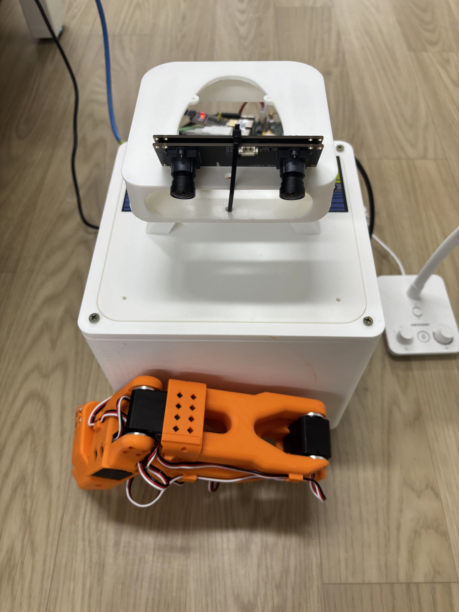
  
</div>

- The left image shows the stereo camera installed toward the robot-arm workspace.
- The right image shows the connections between the K3, stereo camera, robot arm, chassis, and audio equipment.
- Mount the camera on top of the body. The robot-arm workspace must be within both the color-image view and the valid depth range.

### 10.3 Application Deployment

#### 10.3.1 Get the Code

The following commands assume that the SDK is located at `~/spacemit_robot`:

```bash
mkdir -p ~/spacemit_robot
cd ~/spacemit_robot
repo init -u https://github.com/spacemit-robotics/manifest.git \
  -b main \
  -m default.xml \
  --repo-url=https://gitee.com/spacemit-robotics/git-repo
repo sync -j4
repo start robot-dev --all
```

Load the SDK environment at the start of every new terminal session:

```bash
cd ~/spacemit_robot
source build/envsetup.sh
```

#### 10.3.2 Install Software Dependencies

##### Install Common Dependencies

1. Install source-control, build, Python, and kinematics dependencies:

   ```bash
   sudo apt update
   sudo apt install -y \
     git \
     repo \
     wget \
     unzip \
     patchelf \
     cmake \
     build-essential \
     meson \
     ninja-build \
     python3-pip \
     python3-venv \
     v4l-utils \
     libyaml-cpp-dev \
     libeigen3-dev \
     libboost-all-dev \
     liburdfdom-dev
   ```

2. Pinocchio provides forward and inverse kinematics for the robot arm. Build the Pinocchio library in advance:

   ```bash
   cd ~
   git clone --recursive \
     -b v3.9.0 \
     https://github.com/stack-of-tasks/pinocchio.git

   cmake -S ~/pinocchio -B ~/pinocchio/build \
     -DCMAKE_BUILD_TYPE=Release \
     -DCMAKE_INSTALL_PREFIX=/usr/local \
     -DBUILD_PYTHON_INTERFACE=OFF \
     -DBUILD_TESTING=OFF \
     -DBUILD_WITH_COLLISION_SUPPORT=OFF
   cmake --build ~/pinocchio/build -j"$(nproc)"
   sudo cmake --install ~/pinocchio/build
   sudo ldconfig
   ```

3. Create a Python virtual environment:

   ```bash
   cd ~/spacemit_robot/application/ros2/linksee/perceptive_grasp
   python3 -m venv ~/.venv-grasp
   source ~/.venv-grasp/bin/activate
   python3 -m pip install --upgrade pip
   python3 -m pip install -r requirements.txt
   ```

##### Build SDK Components

`mm` installs public headers and shared libraries in `~/spacemit_robot/output/staging`. Build the components in the following order:

1. Activate the SDK environment variables.

   ```bash
   cd ~/spacemit_robot
   source build/envsetup.sh
   ```

2. The chassis-control component provides the UART driver for short forward/reverse movements and in-place turns.

   ```bash
   cd components/control/base
   mm

   ls ~/spacemit_robot/output/staging/include/chassis.h
   ls ~/spacemit_robot/output/staging/lib/libchassis.so
   ```

3. The vision-inference component provides the `vision_service` interface and runs YOLOv8-Seg inference on the X100 AI cores through SpacemiT EP.

   ```bash
   cd ~/spacemit_robot/components/model_zoo/vision
   mm

   ls ~/spacemit_robot/output/staging/include/vision_service.h
   ls ~/spacemit_robot/output/staging/lib/libvision.so
   ```

4. The gripper-control component provides interfaces for opening and closing the gripper, controlling force, and reading the grasp state.

   ```bash
   cd ~/spacemit_robot/components/control/grasp
   mm

   ls ~/spacemit_robot/output/staging/include/grasp.h
   ls ~/spacemit_robot/output/staging/lib/libgrasp.so
   ```

5. The robot-arm control component provides the Linksee arm driver, joint motion, linear motion, and kinematics interfaces.

   ```bash
   cd ~/spacemit_robot/components/control/manipulator
   mm

   ls ~/spacemit_robot/output/staging/include/manipulator.h
   ls ~/spacemit_robot/output/staging/lib/libmanipulator.so
   ```

##### Prepare the Detection Model

Download the YOLOv8-Seg model and install the COCO labels:

```bash
cd ~/spacemit_robot/components/model_zoo/vision/examples/yolov8_seg
bash scripts/download_models.sh

mkdir -p ~/.cache/models/vision/labels
cp ~/spacemit_robot/components/model_zoo/vision/assets/labels/coco.txt \
  ~/.cache/models/vision/labels/coco.txt

ls ~/.cache/models/vision/yolov8_seg/yolov8n-seg.q.onnx
ls ~/.cache/models/vision/labels/coco.txt
```

##### Prepare the Stereo-Camera Backends

The application initializes only the backend selected by `camera.type`. CMake automatically detects all backends installed on the system. The backend selected at runtime must appear in the build summary.

- When using a RealSense D435i, install the runtime library and tools:

  ```bash
  sudo apt install -y ros-humble-librealsense2
  source /opt/ros/humble/setup.sh
  rs-enumerate-devices --version
  ```

- When using `spacemit_las2`, download the runtime and depth model from the hosting site. The default directory is `~/las2_runtime`; no additional environment variables are required:

  ```bash
  cd ~
  wget -O las2_runtime_handoff.zip \
    https://archive.spacemit.com/spacemit-ai/model_zoo/vla/libs/las2/las2_runtime_handoff.zip
  unzip -oq las2_runtime_handoff.zip

  mkdir -p ~/las2_runtime/models
  wget -O ~/las2_runtime/models/LAS2_M_256x320.fp16.iofp32.corr_func_nhwc.gelu.onnx \
    https://archive.spacemit.com/spacemit-ai/model_zoo/vla/libs/las2/LAS2_M_256x320.fp16.iofp32.corr_func_nhwc.gelu.onnx

  ls ~/las2_runtime/include/las2_usb_stereo.h
  ls ~/las2_runtime/lib/liblas2_usb_stereo.so
  ls ~/las2_runtime/models/LAS2_M_256x320.fp16.iofp32.corr_func_nhwc.gelu.onnx
  ls ~/las2_runtime/config/matlab_stereo_opencv.json
  ```

   `spacemit_las2` uses the stereo calibration file to calculate depth and 3D coordinates.

##### Prepare Voice Models (Optional)

Skip this subsection if you use command-line grasping only. The local voice bridge requires VAD, ASR, TTS, and Chinese text-normalization resources:

```bash
mkdir -p ~/.cache/models/asr
cd ~/.cache/models/asr
wget -O sensevoice.tar.gz \
  https://archive.spacemit.com/spacemit-ai/model_zoo/asr/sensevoice.tar.gz
tar -xzf sensevoice.tar.gz

# Install the K3-optimized runtime and prepare the model when using Qwen3-ASR.
sudo apt install -y llama.cpp-tools-spacemit
mkdir -p ~/.cache/models/asr/qwen3asr
cd ~/.cache/models/asr/qwen3asr
wget -O qwen3-asr-0.6B-dynq-q40.tar.gz \
   https://archive.spacemit.com/spacemit-ai/model_zoo/asr/qwen3-asr-0.6B-dynq-q40.tar.gz
tar -xzf qwen3-asr-0.6B-dynq-q40.tar.gz
rm -f qwen3-asr-0.6B-dynq-q40.tar.gz

mkdir -p ~/.cache/models/vad/silero
wget -O ~/.cache/models/vad/silero/silero_vad.onnx \
  https://archive.spacemit.com/spacemit-ai/model_zoo/vad/silero/silero_vad.onnx

mkdir -p ~/.cache/models/tts/matcha-tts
cd ~/.cache/models/tts/matcha-tts
wget -O matcha-icefall-zh-baker.tar.gz \
  https://archive.spacemit.com/spacemit-ai/model_zoo/tts/matcha-tts/matcha-icefall-zh-baker.tar.gz
tar -xzf matcha-icefall-zh-baker.tar.gz

mkdir -p ~/.cache/models/tts/vocoder
wget -O ~/.cache/models/tts/vocoder/vocos-22khz-univ.q.onnx \
  https://archive.spacemit.com/spacemit-ai/model_zoo/tts/vocoder/vocos-22khz-univ.q.onnx

mkdir -p ~/.cache/models/tts/text_norm/v1/zh
cd ~/.cache/models/tts/text_norm/v1/zh
wget https://archive.spacemit.com/spacemit-ai/model_zoo/tts/text_norm/v1/zh/date.fst
wget https://archive.spacemit.com/spacemit-ai/model_zoo/tts/text_norm/v1/zh/new_heteronym.fst
wget https://archive.spacemit.com/spacemit-ai/model_zoo/tts/text_norm/v1/zh/number.fst
wget https://archive.spacemit.com/spacemit-ai/model_zoo/tts/text_norm/v1/zh/phone.fst
```

The Qwen3-ASR media backend requires `llama.cpp-tools-spacemit 0.1.7` or later. After `qwen3_asr` is selected, the application automatically starts the local `llama-server`; no separate persistent service is required.

#### 10.3.3 Configure the Stereo-Camera Backend

The three release configurations are intended for the Linksee physical robot, the PC MuJoCo service, and the remote MuJoCo pipeline, respectively. Before the first runtime check, select the configuration that matches the deployment mode:

| Configuration file | Purpose | Values to update on site |
| --- | --- | --- |
| `config/grasp_pipeline.yaml` | Linksee physical-robot grasping | RGB-D backend, device paths, hand-eye calibration, robot-arm and chassis serial ports, audio devices |
| `config/grasp_pipeline_mujoco_ur5e.yaml` | PC MuJoCo service | Listen address, port, and scene-resource path |
| `config/grasp_pipeline_remote_mujoco_ur5e.yaml` | PC or K3 connection to the simulation service | `remote_mujoco.host`, port, and optional audio devices |

The physical-robot configuration is `config/grasp_pipeline.yaml`. At a minimum, complete the following settings:

- Select the stereo-camera backend through `camera.type`.
- Set the device, model, and calibration-file paths required by the selected backend.
- Keep the remaining parameters at their release defaults.

##### RealSense D435i Depth Camera

For a RealSense D435i, use the following configuration:

```yaml
camera:
  type: "realsense"
  realsense:
    width: 640
    height: 480
    fps: 30
    motion_flush_frames: 30
    align_depth: true
    depth_filter:
      spatial: true
      temporal: false
      hole_filling: false
```

##### spacemit_las2 Stereo Camera

When using `spacemit_las2`, first connect the stereo camera and find its stable video-device path:

```bash
ls -l /dev/v4l/by-id/*-video-index0
```

After completing the following preparation, configure `spacemit_las2`:

- Set `video_device` to the `/dev/v4l/by-id/...-video-index0` path that points to the stereo camera.
- Verify that the model and stereo calibration file are under `~/las2_runtime`.

```yaml
camera:
  type: "spacemit_las2"
  spacemit_las2:
    video_device: "/dev/v4l/by-id/<video-index0>"
    model_path: "~/las2_runtime/models/LAS2_M_256x320.fp16.iofp32.corr_func_nhwc.gelu.onnx"
    calib_path: "~/las2_runtime/config/matlab_stereo_opencv.json"
    core_count: 1
    core_affinity: "8"
    depth:
      min_m: 0.05
      max_m: 2.0
```

`spacemit_las2` parameters:

- `model_path`: Path to the `spacemit_las2` depth model.
- `calib_path`: Path to the calibration file for the current stereo camera.
- `core_count`: Number of depth-inference sessions. The default is one session to reduce contention on the X100 AI cores and leave the remaining cores available for YOLOv8-Seg.
- `core_affinity`: X100 AI logical core assigned to each session. Valid values are `8–15`, and the number of entries must match `core_count`.

##### Object Detection

Object detection uses YOLOv8-Seg and SpacemiT EP. The release configuration is:

```yaml
detection:
  config_path: yolov8_seg.yaml
  target_labels: []
  min_confidence: 0.10
  min_area: 1000
  stable_frames: 3
```

- When `target_labels` is empty, all COCO classes are detected.
- `min_confidence` and `min_area` filter low-confidence and undersized targets, respectively.
- `stable_frames` specifies how many consecutive frames must have stable bounding-box position and area before planning starts. While the target is moving, the pipeline remains in the detection stage.

#### 10.3.4 Build the Application

Build from the project root:

```bash
cd ~/spacemit_robot/application/ros2/linksee/perceptive_grasp
source ~/spacemit_robot/build/envsetup.sh
cmake -S . -B build
cmake --build build -j"$(nproc)"
ctest --test-dir build --output-on-failure

source ~/.venv-grasp/bin/activate
python3 -m unittest discover -s tests -p 'test_*.py'
```

The `perceptive_grasp` executable in the build directory is a structured-log launcher, while `perceptive_grasp_core` is the C++ program that executes the pipeline. Use the launcher for normal operation.

Important build options:

- `ENABLE_LAS2_CAMERA`: Controls whether to build the `spacemit_las2` backend. Enabled by default. Set it to `OFF` when using only the RealSense backend and the LAS2 runtime is not prepared.
- `ENABLE_WEBRTC_AEC`: Controls whether to build the WebRTC software echo-cancellation module. Enabled by default. Set it to `OFF` when using `hardware_aec`, `half_duplex`, or no voice interaction.
- `ENABLE_ROS2_VOICE`: Controls whether to build the ROS 2 `std_msgs/String` voice-topic bridge. Disabled by default. The local voice bridge used in this section does not depend on this option.
- `ENABLE_MUJOCO_EXECUTOR`: Controls whether to build the PC MuJoCo simulation service and local simulation backend. Disabled by default.
- `ENABLE_REMOTE_MUJOCO`: Controls whether to build the `remote_mujoco` camera and robot-arm clients. Disabled by default. Enable it when the PC and K3 run the simulation separately.
- `X86_STANDALONE`: Enables host-side planning and debug builds on x86, using the OpenCV DNN detector and a mock executor. This mode does not control a real robot arm or chassis.
- `LAS2_RUNTIME_DIR`: Specifies a non-default `spacemit_las2` runtime directory. No setting is required when the runtime is under `~/las2_runtime`.

The default build enables WebRTC AEC. During the first configuration, it downloads a fixed version of `webrtc-audio-processing` and caches it in `~/.cache/thirdparty`. The configuration log should contain:

```text
-- [Voice] WebRTC AEC enabled
```

For example, build only the RealSense backend and disable software echo cancellation:

```bash
cmake -S . -B build \
  -DENABLE_LAS2_CAMERA=OFF \
  -DENABLE_WEBRTC_AEC=OFF
cmake --build build -j"$(nproc)"
```

The build summary should show the real-hardware executor, the `vision_service` detector, and at least one available camera backend, for example:

```text
=== perceptive_grasp Build Summary ===
  Detector:  VisionService
  Executor:  Real hardware
  Camera:    realsense, spacemit_las2
```

`Camera` lists only the backends available in the current build. The runtime backend is selected by `camera.type`.

#### 10.3.5 Hardware Configuration and Pre-Run Check

Before connecting devices, power off the robot arm and chassis. The runtime user must have access to serial, video, and audio devices:

```bash
sudo usermod -aG dialout,video,audio "$USER"
exec su - "$USER"
```

When using `spacemit_las2`, also allow the `video` group to access the DMA heap:

```bash
echo 'SUBSYSTEM=="dma_heap", KERNEL=="system", GROUP="video", MODE="0660"' | \
  sudo tee /etc/udev/rules.d/99-las2-dma-heap.rules
sudo udevadm control --reload-rules
sudo chgrp video /dev/dma_heap/system
sudo chmod 0660 /dev/dma_heap/system
```

Run the runtime-environment check for the first time after connecting the hardware:

```bash
cd ~/spacemit_robot/application/ros2/linksee/perceptive_grasp
source ~/spacemit_robot/build/envsetup.sh
source ~/.venv-grasp/bin/activate
python3 scripts/check_runtime_env.py \
   --config config/grasp_pipeline.yaml \
   --build-dir build \
   --no-fix
```

The runtime-environment check:

- Checks the camera device, runtime library, model, and calibration file selected by `camera.type`.
- Identifies the robot-arm, chassis, and audio devices.
- Reports stable serial-port paths for the robot arm and chassis.

The first check can report `[FAIL]` before the device paths are updated:

```text
[SUGGEST] manipulator.uart_device: "/dev/serial/by-id/..."
[SUGGEST] mobile_base.dev_path: "/dev/serial/by-id/..."
```

##### Configure the Robot Arm and Chassis

Update the stable serial-port paths for the robot arm and chassis based on the check results. The following excerpt is from the release configuration and is provided to verify fields that must be changed on site and safety-related defaults; do not use it to replace the complete configuration file.

```yaml
manipulator:
   uart_device: "/dev/serial/by-id/<机械臂串口>"
   urdf_path: "../urdf/so101.urdf"
   home_joints: [1.546, -1.765, 1.400, 1.093, 0.186]
   observe_joints: [1.544, -0.067, 0.101, 1.382, 0.188]
   side_ready_joints: [1.550, 0.021, 1.400, -1.700, -0.036]
   joint_limits:
      - {joint: 0, min: -1.540, max: 1.630}
      - {joint: 1, min: -1.770, max: 1.680}
      - {joint: 2, min: -1.840, max: 1.430}
      - {joint: 3, min: -1.790, max: 1.670}
      - {joint: 4, min: -2.700, max: 2.800}

place:
   place_joints: [-1.500, -0.122, 0.101, 1.383, 0.330]
   release_open: 0.5

mobile_base:
   enabled: true
   dev_path: "/dev/serial/by-id/<底盘串口>"
   target_x: 0.275
   x_tolerance: 0.035
   y_tolerance: 0.15
   max_step_m: 0.12
   linear_speed: 0.20
   angular_speed: 1.2
   min_cmd_duration_ms: 350
   max_align_attempts: 6
   max_total_travel_m: 0.24
```

- `target_x ± x_tolerance` defines the target's forward comfortable zone.
- `y_tolerance` defines the allowed lateral deviation from the robot-arm base centerline.
- `max_align_attempts` and `max_total_travel_m` limit the number of chassis-alignment attempts and cumulative straight-line travel distance for one task.
- `observe_joints` and `side_ready_joints` define the observation poses for top and side grasps, respectively.
- `home_joints` and `place_joints` define the task home and placement poses, respectively. After replacing the robot arm, reconfirm these predefined poses after calibrating the joints.
- After the chassis moves the target into the comfortable zone, the pipeline still checks the robot-arm workspace and inverse-kinematics reachability.

##### Configure the Grasp Strategy

`grasp.strategy` supports `auto`, `top`, and `side`. The release configuration uses `auto` to select a top or side grasp based on the target's 3D height, horizontal dimensions, and candidate reachability. It does not use the target class.

```yaml
grasp:
   strategy: "auto"
   top:
      approach_height: 0.10
      grasp_depth: 0.015
      gripper_offset: 0.0
      grasp_point_x_ratio: 1.0
      position_source: "mask_depth"
      safe_mask_interior: false
      support_plane_occlusion_recovery: false
      support_plane_height_anchor: false
      minimum_grasp_height: 0.0
      verification_lift_m: 0.0
      gripper_open: 0.6
   side:
      min_height_m: 0.060
      min_height_width_ratio: 1.0
      approach_distance_m: 0.020
      entry_clearance_m: 0.030
      pregrasp_min_x_m: 0.270
      single_sided_gripper: true
      gripper_offset_m: 0.010
      grasp_forward_offset_m: 0.020
      grasp_height_ratio: 0.60
      initial_lift_m: 0.050
      lift_retreat_m: 0.025
   gripper_effort: 0.8
   gripper_hold_load_threshold: 100.0
   gripper_empty_position_margin: 0.03
   gripper_timeout_ms: 3000
   geometry:
      sample_stride: 2
      max_object_points: 4000
      min_object_points: 80
      plane_distance_threshold_m: 0.008
      table_clearance_m: 0.005
      footprint_padding_m: 0.005
      gripper_max_width_m: 0.10
      planning_timeout_ms: 750
      perception_budget_ms: 500
   workspace:
      x_min: 0.0
      x_max: 0.5
      y_min: -0.3
      y_max: 0.3
      z_min: 0.0
      z_max: 0.20
```

- `top` parameters affect only top grasps, and `side` parameters affect only side grasps. The two groups do not override each other.
- `side.min_height_m` and `side.min_height_width_ratio` together define the 3D-shape threshold for initially selecting a side grasp in `auto` mode.
- `side.entry_clearance_m` controls the safety distance between the gripper's lower edge and the target's highest point as the arm enters the side-grasp area from the observation pose.
- `side.approach_distance_m` defines the horizontal feed distance from the pre-grasp pose to the grasp pose. `side.grasp_forward_offset_m` applies a forward/backward compensation to the complete side-grasp pose without changing the feed distance.
- `geometry` controls the target point cloud, tabletop plane, gripper width, and candidate-planning constraints.
- `geometry.perception_budget_ms` is the performance-warning budget. If the budget is exceeded, the system records `OVERRUN`; it does not terminate a safe candidate solely for exceeding the time limit.
- `workspace` is the safety boundary checked before robot-arm motion. Chassis alignment does not bypass workspace or IK checks.
- Gripper load and closing position are used together to determine whether the target was grasped.

##### Configure Voice Devices (Optional)

When local voice interaction is enabled, update the capture and playback device indexes based on the check results:

```yaml
voice:
   echo_cancellation:
      mode: "webrtc_aec"
      delay_ms: 50
      noise_suppression: true
      high_pass_filter: true

   asr:
      backend: "sensevoice"
      device: 1
      device_name: ""
      rate: 16000
      channels: 1
      channel_index: -1
      mixer_volume: 40
      vad_trigger_threshold: 0.4
      vad_stop_threshold: 0.3
      vad_min_speech_duration_ms: 100
      vad_endpoint_hold_ms: 600
      vad_max_speech_duration_ms: 4000

   tts:
      enabled: true
      engine: "matcha:zh"
      playback_device: 1
      playback_device_name: ""
      playback_rate: 48000
      channels: 1
      speed: 1.0
      volume: 80
      mixer_volume: 80
      speak_all_states: false
```

Voice-device parameters:

- `echo_cancellation.mode`: Use `webrtc_aec` with a standard microphone and speaker combination, `hardware_aec` when the audio hardware outputs an echo-cancelled recording stream, or `half_duplex` when echo cancellation is unavailable.
- `echo_cancellation.delay_ms`: Estimated delay from speaker playback to the echo entering the microphone. Used only with `webrtc_aec`.
- `asr.backend`: ASR backend, either `sensevoice` or `qwen3_asr`.
- `asr.device_name`: Capture-device name. When nonempty, it takes priority when resolving the current device index; otherwise `asr.device` is used.
- `asr.device`: Capture-device index.
- `tts.enabled`: Whether to enable voice status announcements.
- `tts.playback_device_name`: Playback-device name. When nonempty, it takes priority when resolving the current device index; otherwise `tts.playback_device` is used.
- `tts.playback_device`: Playback-device index.
- `rate`, `playback_rate`, and `channels`: Recording and playback formats. They must match the selected device's supported formats.
- `mixer_volume`: ALSA recording gain or `PCM` volume set at startup. Set it to `-1` to leave the mixer unchanged.

If the device does not support the default format, the voice bridge detects an available format and prints the final selection.

`hardware_aec` and `webrtc_aec` keep VAD and ASR running continuously during TTS playback. `half_duplex` pauses speech recognition during TTS playback.

##### Recheck the Runtime Environment

After updating the configuration and fixing the remaining `[FAIL]` items, run the check again:

```bash
python3 scripts/check_runtime_env.py \
   --config config/grasp_pipeline.yaml \
   --build-dir build \
   --no-fix
```

When the environment is ready, the last line is:

```text
[SUMMARY] ready
```

#### 10.3.6 Perform Hand-Eye Calibration

Perceptive grasping uses eye-to-hand calibration to calculate the transform from the stereo-camera coordinate frame to the robot-arm base frame. Install the hardware as shown, with the following requirements:

- Mount the stereo camera rigidly to the robot body.
- Rigidly attach the ChArUco calibration board to the gripper end effector.

<p align="center">
  
</p>

##### Generate the Calibration Board

Generate a 4 x 5 ChArUco calibration board:

```bash
cd ~/spacemit_robot/application/ros2/linksee/perceptive_grasp
source ~/spacemit_robot/build/envsetup.sh
source ~/.venv-grasp/bin/activate
python3 scripts/generate_charuco_board.py \
  --squares-x 4 \
  --squares-y 5 \
  --square-length 0.020 \
  --marker-length 0.014 \
  --output config/charuco_4x5_20mm_14mm.png
```

##### Collect Data

Meet the following requirements when collecting data:

- Use the measured dimensions of the printed calibration board.
- Collect at least 15 valid poses.
- Cover left, center, right, high, and low positions, as well as different wrist angles.

```bash
python3 scripts/calibrate_hand_eye.py \
  --config config/grasp_pipeline.yaml \
  --charuco-squares-x 4 \
  --charuco-squares-y 5 \
  --charuco-square-length 0.020 \
  --charuco-marker-length 0.014 \
  --num-poses 15 \
  --dataset-dir "config/hand_eye_datasets/handeye_$(date +%Y%m%d_%H%M%S)"
```

##### Write the Calibration Result

Replace `<dataset>` with the dataset directory generated by the collection command, then solve and write the result to the configuration:

```bash
python3 scripts/calibrate_hand_eye.py \
  --solve-only \
  --dataset-dir config/hand_eye_datasets/<dataset> \
  --apply-config config/grasp_pipeline.yaml
```

The script updates `calibration.<camera.type>.T_base_camera` and backs up the original configuration. It does not overwrite hand-eye calibration results for other camera backends.

##### Verify the Calibration Result

Use the localization tool to verify the target position in the robot-arm base frame:

```bash
./build/debug_localize \
  --config config/grasp_pipeline.yaml \
  --target banana \
  --frames 5 \
  --output /tmp/debug_localize
```

Check calibration quality using the localization result:

- `base_point_m` should match the measured target position relative to the robot-arm base.
- If a consistent offset exists, check the calibration-board dimensions, pose coverage during collection, and camera mounting.
- Do not use grasp offsets to mask calibration errors.

#### 10.3.7 Run Grasping

**The following commands initialize real hardware. Commands other than `--plan-only` drive the robot arm and chassis. Before running, clear the robot workspace, verify that the emergency-stop and power-disconnect devices are available, and keep people away from the motion range.**

First, validate the configuration structure. This command does not initialize hardware:

```bash
./build/perceptive_grasp_core \
   --config config/grasp_pipeline.yaml \
   --validate-config
```

When the output contains `[Config] valid`, the configuration fields and values have passed validation.

First, use `--plan-only` to verify target perception, the grasp strategy, and the robot-arm path. This mode initializes the hardware and reads the robot-arm state, but does not send robot-arm or chassis motion commands:

```bash
cd ~/spacemit_robot/application/ros2/linksee/perceptive_grasp
source ~/spacemit_robot/build/envsetup.sh
./build/perceptive_grasp \
  --config config/grasp_pipeline.yaml \
  --target cup \
  --plan-only
```

After confirming that planning succeeds, perform actual grasping:

```bash
cd ~/spacemit_robot/application/ros2/linksee/perceptive_grasp
source ~/spacemit_robot/build/envsetup.sh
./build/perceptive_grasp \
  --config config/grasp_pipeline.yaml \
  --target banana
```

The application runs through the following workflow:

1. `detecting` associates the same target across consecutive frames and waits until the bounding-box position and area meet the stability criteria.
2. `planning` generates the target point cloud, fits the tabletop plane, and calculates top-grasp or side-grasp candidates. When the target position requires adjustment, the pipeline enters `base_aligning` and returns to `detecting` after the chassis stops.
3. After the target position meets the requirements, the pipeline locks the grasp strategy. Top grasping moves to `observe_joints`; side grasping moves to `side_ready_joints`.
4. After the observation motion completes, the pipeline refreshes camera data and performs detection and planning again. Images, depth, and 3D coordinates acquired before movement are not reused.
5. After candidates for the locked strategy pass workspace, gripper-width, joint-limit, IK, tabletop-clearance, and complete-path checks, the pipeline enters `approaching`.
6. A top grasp approaches downward from above the target. A side grasp first enters a safe pre-grasp pose from above the target, opens the gripper, descends, and then feeds horizontally.
7. `grasping` closes the gripper, `lifting` lifts or retreats, `placing` places and releases the target, and `homing` completes the current cycle.
8. After closing and lifting, the gripper uses position and load together to determine whether it is holding the target. If any stage fails, the pipeline enters `recovering`.

The chassis can intervene before strategy locking or during replanning after the observation motion. After every chassis action, the system reacquires images and depth. Once the strategy is locked, a single-frame depth fluctuation does not switch between top and side grasping.

For continuous grasping, add `--loop`:

```bash
./build/perceptive_grasp \
  --config config/grasp_pipeline.yaml \
  --target banana \
  --loop
```

`--loop` does not limit the number of cycles. After each cycle, the robot arm returns to the observation pose for that cycle's strategy and immediately begins the next detection cycle. Loop mode does not distinguish a target seen in a previous cycle, so any target in view that meets the target-class and stability requirements can be grasped again.

After pressing `Ctrl+C` once, the application waits for the current action to finish and safely homes the robot. Press `Ctrl+C` a second time only to force-terminate it if it cannot exit safely.

The application supports two logging modes:

- Default mode reports the start time, duration, and result for each stage, and prints a `PIPELINE SUMMARY` at the end.
- Add `--debug` when debugging third-party libraries, the camera, robot arm, or chassis driver.

```bash
./build/perceptive_grasp \
  --debug \
  --config config/grasp_pipeline.yaml \
  --target banana
```

#### 10.3.8 Start Voice Control

The voice bridge starts the grasping application and manages recording, VAD, ASR, TTS, and status announcements:

```bash
cd ~/spacemit_robot/application/ros2/linksee/perceptive_grasp
source ~/spacemit_robot/build/envsetup.sh
source ~/.venv-grasp/bin/activate
./build/perceptive_grasp \
   --voice-control \
   --config config/grasp_pipeline.yaml
```

The physical-robot configuration uses SenseVoice by default. To temporarily switch to Qwen3-ASR, add `--asr-backend qwen3_asr`; this option applies only to the current run and does not modify the configuration file:

```bash
./build/perceptive_grasp \
   --voice-control \
   --asr-backend qwen3_asr \
   --config config/grasp_pipeline.yaml
```

You can issue voice commands after the terminal shows the following logs:

```text
[VoiceBridge] Listening: ...
```

Supported commands include:

- "Grab a banana": Starts a single banana-grasping task.
- "Stop": Cancels the current task. If the gripper is not holding an object, the robot returns to the observation pose and continues waiting. If the gripper may be holding an object, the robot returns to the home pose and exits.
- "Finish" or "go home": Returns the robot arm to the home pose and exits the application.

### 10.4 Physical-Robot Acceptance and Logs

Complete at least one full-workflow acceptance run for each of the top-grasp and side-grasp targets. Each task should meet the following conditions:

- The RGB-D color image, depth image, and camera intrinsics initialize successfully.
- Planning starts after the target becomes stable. After observation or chassis movement completes, the system reacquires RGB-D data.
- The candidate passes workspace, gripper-width, joint-limit, IK, tabletop-clearance, and complete-path checks.
- The pipeline completes `APPROACHING`, `GRASPING`, `LIFTING`, `PLACING`, and `HOMING` in sequence.
- The robot lifts the target after the gripper closes and confirms that it is holding the target, then places it in the specified area.
- The final summary reports `result=SUCCESS`, with no transition to `RECOVERING` and no unhandled errors.

Use the default logs to verify stage durations and results:

- `[Init]`: Initialization results for the camera, detector, robot arm, and chassis.
- `[Stage N]`: State-machine stage, stage duration, and result.
- `[Action]`: Duration of robot-arm, gripper, or chassis actions.
- `[Timing] stage=PERCEPTION_PLANNING`: Per-cycle perception and planning duration, budget, and result.
- `PIPELINE SUMMARY`: Initialization, task, end-to-end duration, and final failure reason.

### 10.5 Results

The `spacemit_las2` physical-robot grasping result is shown below:


### 10.6 MuJoCo Simulation

`perceptive_grasp` supports running the simulation environment and grasping pipeline separately:

- The PC runs MuJoCo physics simulation, RGB-D rendering, and the third-person view window.
- The grasping pipeline can run on the same PC or on the K3.
- The PC and K3 use the `remote_mujoco` protocol to transfer color images, depth images, camera intrinsics, and robot-arm commands.
- When the pipeline runs on the K3, the board's microphone and speaker can be used for voice interaction.

The simulation environment has the following characteristics:

- The robot uses the UR5e and Robotiq 2F-85 models from MuJoCo Menagerie.
- The physical environment simulates gravity, friction, contact, and object motion.
- Before execution, the system checks robot-arm/table collisions, the complete path, and two-finger contact.
- The physical-robot and simulation modes share the same launcher, pipeline state machine, object detector, 3D geometric estimation, grasp planner, and voice bridge.
- The simulation configurations replace only the camera and robot-arm backends and disable chassis alignment. They do not change the default physical-robot execution path.

#### 10.6.1 Build the PC Simulation Service

The PC requires x86_64 Linux and a desktop session with OpenGL support. Install the windowing and rendering dependencies:

```bash
sudo apt update
sudo apt install -y libglfw3-dev libgl1-mesa-dev
```

Build the simulation service:

```bash
cd ~/spacemit_robot/application/ros2/linksee/perceptive_grasp
python3 scripts/prepare_mujoco_assets.py
cmake -S . -B build_mujoco \
   -DUSE_OPENCV_DNN=ON \
   -DUSE_MOCK_EXECUTOR=ON \
   -DENABLE_WEBRTC_AEC=OFF \
   -DENABLE_LAS2_CAMERA=OFF \
   -DENABLE_MUJOCO_EXECUTOR=ON \
   -DENABLE_REMOTE_MUJOCO=ON
cmake --build build_mujoco -j"$(nproc)"
ctest --test-dir build_mujoco --output-on-failure
```

CMake first searches for MuJoCo in `MUJOCO_DIR`, `/usr/local`, and `/opt/mujoco`. If it is not found, the build system downloads a fixed version and caches it in `~/.cache/thirdparty/mujoco`.

After the build completes, check the simulation service, scene resources, and pipeline program:

```bash
python3 scripts/check_runtime_env.py \
   --config config/grasp_pipeline_mujoco_ur5e.yaml \
   --build-dir build_mujoco \
   --skip-voice \
   --no-fix
```

The last line should be `[SUMMARY] ready`.

#### 10.6.2 Start the PC Simulation Service

```bash
./build_mujoco/perceptive_grasp \
   --serve-simulation \
   --config config/grasp_pipeline_mujoco_ur5e.yaml \
   --listen 0.0.0.0 \
   --port 9090 \
   --viewer
```

After startup, the service displays a third-person view window. The upper-right corner shows the virtual RGB-D camera view, whose downward-oblique pose covers the workspace.

The scene is initialized as follows:

- The widened green pickup zone is in front of the robot arm, and the red placement zone is to the right of the robot arm. They do not overlap.
- `apple`, `banana`, `cube`, and `cup` are dynamically arranged in a row based on their rotated occupied widths to prevent mutual occlusion.
- Each service startup or explicit scene reset randomly changes the arrangement order, positions, and horizontal placement angles. Changing the grasp target does not reset the scene.

The service prints the current object positions and `yaw` through `[MujocoSimulation] Pickup layout:`.

#### 10.6.3 Run the Pipeline Locally on the PC

After starting the simulation service, open a new terminal and run the same top-level launcher:

```bash
./build_mujoco/perceptive_grasp \
   --config config/grasp_pipeline_remote_mujoco_ur5e.yaml \
   --target apple \
   --remote-host 127.0.0.1
```

The local PC workflow connects to the simulation service on the same PC through the loopback address. Use it to check the scene, physical contact, collisions, and grasp-and-place actions. Object detection uses the OpenCV DNN backend in the PC build.

#### 10.6.4 Build and Run the K3 Client

Build the remote simulation backend on the K3:

```bash
cd ~/spacemit_robot
source build/envsetup.sh
cd application/ros2/linksee/perceptive_grasp
cmake -S . -B build_remote_mujoco \
   -DENABLE_REMOTE_MUJOCO=ON \
   -DENABLE_LAS2_CAMERA=OFF \
   -DENABLE_WEBRTC_AEC=ON
cmake --build build_remote_mujoco -j"$(nproc)"
```

Before running, check the current build, optional voice devices, and the PC simulation service:

```bash
source ~/.venv-grasp/bin/activate
python3 scripts/check_runtime_env.py \
   --config config/grasp_pipeline_remote_mujoco_ur5e.yaml \
   --build-dir build_remote_mujoco \
   --no-fix
```

Run grasping, replacing `<pc_ip>` with the PC's actual address:

```bash
./build_remote_mujoco/perceptive_grasp \
   --config config/grasp_pipeline_remote_mujoco_ur5e.yaml \
   --target apple \
   --remote-host <pc_ip>
```

`--target` supports `apple`, `banana`, `cube`, and `cup`. `--remote-host` and `--remote-port` override the remote camera and robot-arm addresses together.

Set `--target` to `apple`, `banana`, or `cube` to validate top grasping. Set it to `cup` to validate side grasping. The top-level `remote_mujoco` configuration block sets both the camera and robot-arm service addresses, while `--remote-host` and `--remote-port` override the shared endpoint for the current run.

#### 10.6.5 Use Voice Control for Simulation on the K3

First set `voice.asr.device_name`, `voice.asr.device`, `voice.tts.playback_device_name`, and `voice.tts.playback_device` in `config/grasp_pipeline_remote_mujoco_ur5e.yaml` based on device enumeration results, then run:

```bash
./build_remote_mujoco/perceptive_grasp \
   --voice-control \
   --config config/grasp_pipeline_remote_mujoco_ur5e.yaml \
   --remote-host <pc_ip>
```

The voice bridge runs VAD, ASR, AEC, and TTS locally on the K3. The pipeline reads the simulated camera and controls the UR5e through the same `remote_mujoco` endpoint. Voice commands are the same as for the physical robot, including grasp, cancel, and home commands.

Running MuJoCo locally on the K3 is outside the scope of this solution. MuJoCo physics simulation, OpenGL rendering, and the third-person view window remain on the x86_64 PC.

#### 10.6.6 Validate the Simulation Results

First validate both MuJoCo configurations on the PC:

```bash
./build_mujoco/perceptive_grasp_core \
   --config config/grasp_pipeline_mujoco_ur5e.yaml \
   --validate-config
./build_mujoco/perceptive_grasp_core \
   --config config/grasp_pipeline_remote_mujoco_ur5e.yaml \
   --validate-config
```

Both commands should output `[Config] valid`.

A complete task should meet the following conditions:

1. `apple`, `banana`, and `cube` select `top`; `cup` selects `side`.
2. The green pickup zone, red placement zone, and all four objects appear in the camera view without occluding one another.
3. The target moves with the gripper only after two-finger contact occurs.
4. The robot arm lifts the target and carries it above the red placement zone.
5. After the gripper opens, gravity drops the target onto the table, and the service reports `inside_zone_xy=true`.
6. The pipeline completes `APPROACHING`, `GRASPING`, `LIFTING`, `PLACING`, and `HOMING`, and the final summary reports `result=SUCCESS`.
7. During continuous grasping, placed targets remain inside the red zone, and selecting a later target does not reset the scene.

If the robot arm collides with the table, the complete path collides, the gripper closes without an object, communication times out, or the target lands outside the red zone, the task enters failure recovery. The program does not directly modify object coordinates to fabricate a successful grasp.

## 11. Troubleshooting

| Symptom | Resolution |
| :--- | :--- |
| `linksee` is not listed in `lunch` | Run `source build/envsetup.sh` to reload the build environment. Verify that the repository is fully synchronized and that the current directory is the `spacemit_robot` root. If necessary, run `repo sync -j4` again. |
| `m` fails because ROS 2 dependencies are missing | Reinstall the dependencies listed in the system-dependency section, including `ros-humble-nav*`, `ros-humble-cartographer*`, `ros-humble-pcl-ros`, and `ros-humble-robot-localization`. Open a new terminal and load the environment after installation. |
| The chassis node starts, but the robot does not move | Check whether `/cmd_vel` input is available. Run `teleop_twist_keyboard` for a minimal test, and verify the chassis controller, motor driver, and battery power. |
| The robot moves in the wrong direction | Check the left and right motor wiring and direction definitions. Also verify the wheel mapping, direction-control pins, and chassis parameters. |
| `/odom` has no data or is clearly incorrect | Check the encoder feedback path. Verify that the wheel diameter, wheelbase, gear ratio, and other parameters match the physical chassis. Recalibrate `wheel_base` and `reduction_ratio` if the odometry drifts significantly. |
| The LiDAR fails to start or no point cloud is visible during navigation | Verify that the LiDAR is connected through the correct USB/serial interface and recognized by the system. Rerun `ros2 launch linksee start_ydlidar.launch.py` and inspect the logs. Check the LiDAR power supply and model configuration. |
| Navigation does not work, or the map/localization is incorrect after starting `nav2` | First verify that the chassis `/odom`, LiDAR `/scan`, IMU, and other basic topics are publishing correctly. Validate mapping, localization, and navigation step by step instead of debugging `nav2` before the lower-level pipeline works. |
| The PC visualization does not show the robot, or the topic list is empty | Verify that the board and PC use compatible ROS 2 versions and can communicate over the network. Source the correct workspace on both systems, and check that `ROS_DOMAIN_ID` matches if necessary. |
| The chassis solution still does not work after replacing the auxiliary-core kernel or `itb` file | Verify that `update_esos.sh` and the kernel-replacement steps completed successfully, then reboot the system. Check the relevant device nodes and driver logs after startup. Reflash and test again if necessary. |
| Host cannot start the chassis | Verify that `./scripts/build_mars_chassis.sh` was run and that `third_party/chassis/build/libchassis.so` exists. |
| The follower-arm serial port cannot be found | Check the Linksee arm connection and verify that `--robot.port` points to the actual serial port, such as `/dev/ttyACM0`. |
| The chassis serial port cannot be found | Check the chassis controller connection and verify that `--robot.base_dev_path` points to the actual serial port, such as `/dev/ttyACM1`. |
| Insufficient serial-port permissions | Run `sudo chmod 666 /dev/ttyACM0` or `sudo chmod 666 /dev/ttyACM1` for the corresponding port. |
| Client cannot connect to Host | Verify that `remote_ip` / `REMOTE_IP` is the Host device IP and that firewall rules do not block ports `5565` and `5566`. |
| Camera frame rate is unstable or frames are dropped | Set `fourcc":"MJPG"` explicitly in `--robot.cameras` and verify that sufficient USB bandwidth is available. |
| A two-wheel differential-drive chassis cannot move laterally | This is expected behavior. A two-wheel differential-drive chassis does not support lateral movement. |
| Resumed data collection overwrites the old dataset | Set `RESUME = True` to append to an existing dataset. To create a new dataset, use a new `HF_REPO_ID` or remove the local data. |
| Training cannot be resumed | Verify that `--config_path` points to the existing checkpoint's `train_config.json` and set `--resume=true`. |
| The inference model path is invalid | Verify that `HF_MODEL_ID` points to an existing `pretrained_model` directory. |
| Gateway does not show tools after `linksee_device` starts | Verify that `mlink gateway` is running, the device name is `linksee`, and the startup command is `linksee_device unix linksee`. |
| Hermes cannot find the Linksee tools | Check that the MCP address in `~/.hermes/config.yaml` is `http://127.0.0.1:18765/mcp` and verify that `linksee_device` is connected to the gateway. |
| Natural-language inference startup fails because the model directory does not exist | Verify that the model is stored at `application/ros2/linksee/linksee_app/models/linksee_act_pick_place_move_v2/checkpoints/100000/pretrained_model`. |
| The robot arm is not released after stopping the Host | `stop_host.sh` first sends `SIGINT` to trigger Python cleanup. If the process does not exit before the timeout, the script falls back to forceful termination. Check `/tmp/linksee_host.log` for details. |
