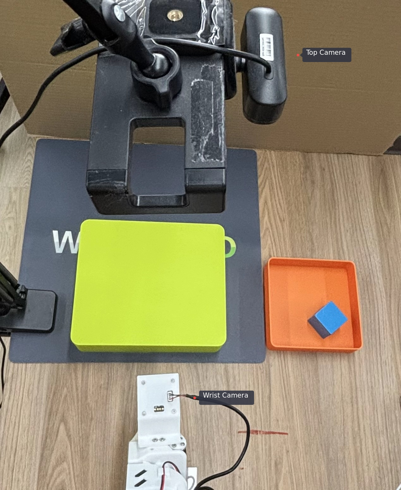
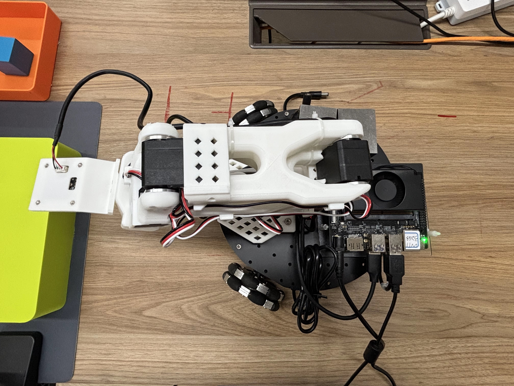
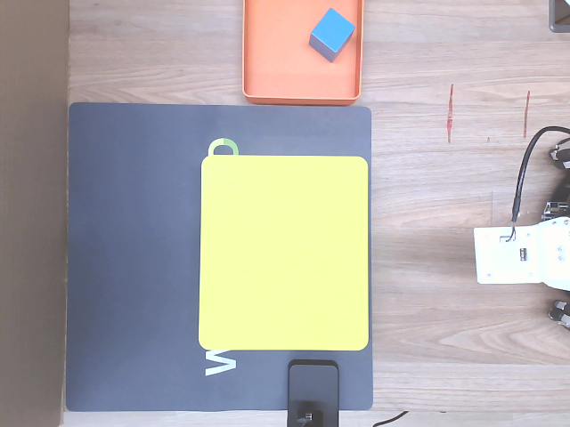
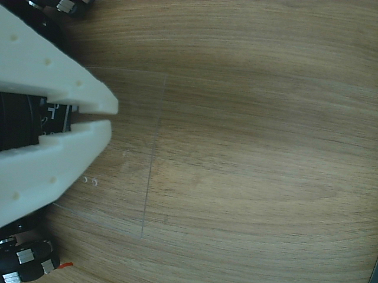
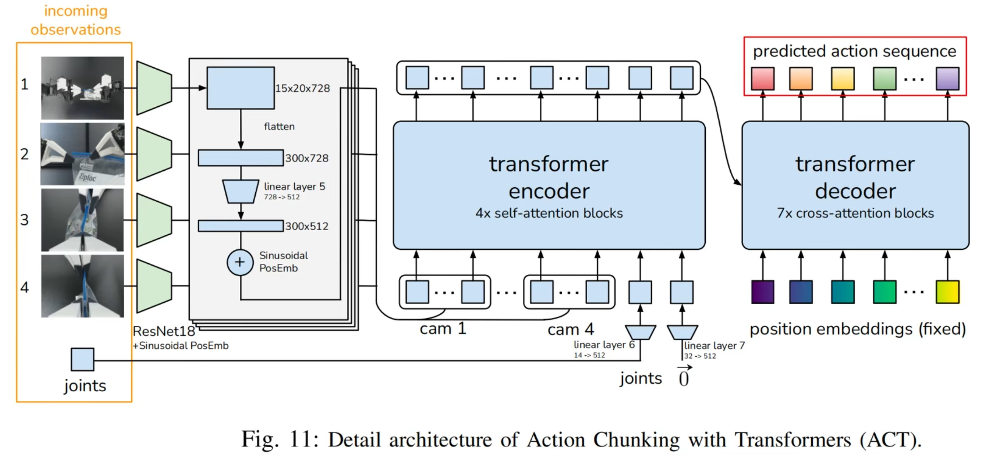
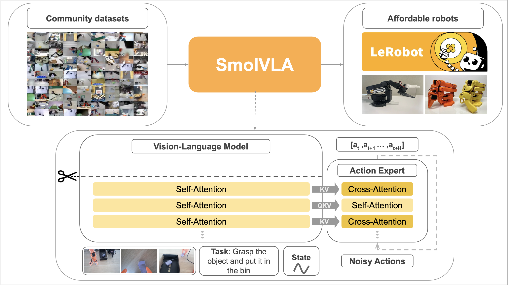
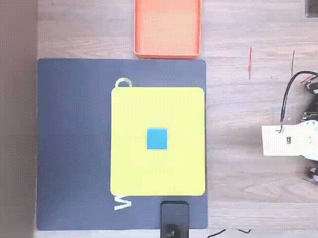
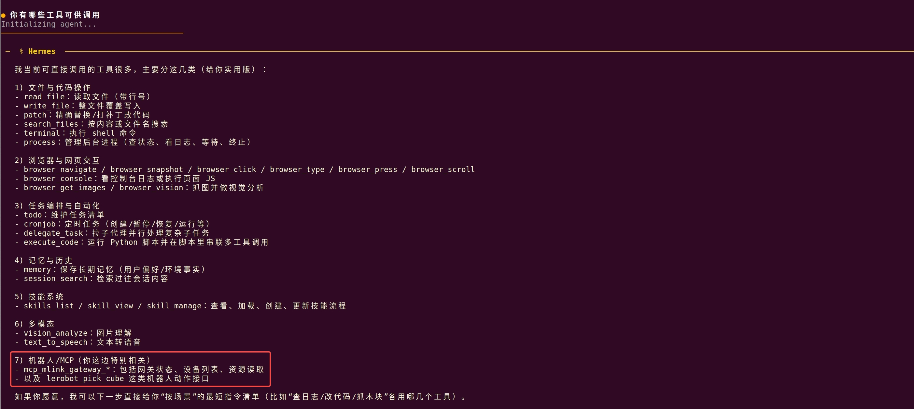

---
sidebar_position: 1
slug: /k3/reference-solutions/lerobot
---

# Real-World Training and Inference

This document describes the complete workflow for real-world data collection, training, inference, and natural-language control of the open-source LeRobot SO101 robotic arm on SpacemiT K3. It covers the full ACT/SmolVLA pipeline from data collection and training to deployment and inference. It also explains how to package the grasping capability as a platform tool and use Hermes to trigger a grasping task with a natural-language command.

## 1. Overview

This solution targets real-world grasping with the open-source LeRobot SO101 robotic arm and supports the following functions:

- **Calibration and data collection**: Calibrate, teleoperate, and collect data from the SO101 robotic arm.
- **ACT model training and deployment**: Train the ACT model on a GPU server and deploy it for local inference on the SpacemiT K3 development board.
- **SmolVLA fine-tuning and distributed inference**: Fine-tune SmolVLA on a server and use distributed inference to control the robotic arm connected to the development board.
- **MCP tool packaging**: Package the LeRobot grasping workflow as a native C++ application and register it as an MCP tool through the `mlink device → mlink gateway → MCP` path.
- **Hermes natural-language control**: Bind MCP to Hermes and use Hermes to call the `lerobot.pick_cube` tool with a natural-language command, causing the SO101 robotic arm to perform a grasping task.

## 2. Hardware Requirements

| Item | Description |
| --- | --- |
| Training platform | A server with an RTX-series GPU or better |
| Data collection platform (optional) | A PC is recommended. Required for visualized data collection. |
| Local environment | SpacemiT K3 development board with bianbu v3.0+ firmware |
| Robotic arm | Two SO101 arms (leader and follower). The natural-language control scenario requires only the SO101 follower arm. |
| Visual input | Two USB cameras. This document uses a top global-view camera and a wrist camera. |
| Key interfaces | The robotic arm typically uses `/dev/ttyACM*`; cameras typically use `/dev/video*`. |

Before you run the workflow, make sure that the robotic arm and cameras are powered on and connected correctly to the K3 development board:

- Robotic arm: Verify the power, communication cables, and control interface. Use `lerobot-find-port` to check the ports.
- Cameras: Verify that the USB cameras are connected. Use `lerobot-find-cameras opencv` to list the available camera indices.

The grasping scene and hardware connections are shown below:





## 3. Set Up the Environment

> [!NOTE]
>
> This solution requires three environments:
>
> - Training environment: Runs on a GPU server for ACT training or SmolVLA fine-tuning.
> - Data collection environment: Can run on K3 or a PC. A PC is recommended for smoother video encoding and decoding during data collection.
> - Local development-board environment: Runs on SpacemiT K3 for local ACT inference, `mlink device`, and Hermes calls.
>
> When you use a workflow, download the code and install the virtual environment and dependencies on the corresponding platform.

### 3.1 Download the Source Code

```bash
# Clone the SpacemiT version, adapted from LeRobot v0.5.0 and integrated with Linksee and other robotics capabilities.
git clone git@github.com:spacemit-robotics/lerobot.git
```

### 3.2 Install System Dependencies

```bash
sudo apt update
sudo apt install ffmpeg
sudo apt install -y \
  libavformat-dev \
  libavcodec-dev \
  libavdevice-dev \
  libavutil-dev \
  libavfilter-dev \
  libswscale-dev \
  libswresample-dev

sudo apt install -y \
  build-essential \
  cmake \
  pkg-config \
  python3-dev
```

- `ffmpeg`: Processes video frames and encodes dataset videos.

### 3.3 Install and Use uv

On K3 with Bianbu v3+ firmware, the system Python is 3.14. The SpacemiT PyTorch wheel for the current LeRobot release targets Python 3.12, so this solution uses `uv` to install Python 3.12 and set up a virtual environment. For platform-specific details, see the [SpacemiT Python User Guide](https://www.spacemit.com/community/document/info?lang=en&nodepath=software/SDK/bianbu/development/python.md). For the full `uv` command reference, see the [uv documentation](https://docs.astral.sh/uv/).

1. Install `uv`:

    ```bash
    curl -LsSf https://astral.sh/uv/install.sh | sh
    ```

    After installation, open a new terminal, or load `uv` in the current terminal:

    ```bash
    source "$HOME/.local/bin/env"
    ```

2. Create a LeRobot virtual environment with Python 3.12 and preinstall pip with `--seed`:

    ```bash
    cd ~/lerobot
    uv venv ~/.lerobot-venv --python 3.12 --seed
    source ~/.lerobot-venv/bin/activate
    python -V
    python -m pip --version
    ```

### 3.4 Configure Python Package Indexes

After activating the virtual environment, configure the Aliyun primary index and the SpacemiT additional index for `pip` in this environment:

```bash
source ~/.lerobot-venv/bin/activate
python -m pip config --site set global.index-url https://mirrors.aliyun.com/pypi/simple
python -m pip config --site set global.extra-index-url https://git.spacemit.com/api/v4/projects/33/packages/pypi/simple
python -m pip config --site list
```

`--site` writes the index configuration to the current virtual environment and does not affect the system Python installation. Always use `python -m pip` in subsequent steps to ensure that packages are installed in the active Python 3.12 environment.

### 3.5 Install Python Dependencies

```bash
cd ~/lerobot

# Activate the virtual environment created in Section 3.3.
source ~/.lerobot-venv/bin/activate

# Install PyTorch and runtime dependencies.
python -m pip install \
  torch==2.7.1 \
  torchvision==0.22.0 \
  wandb==0.24.0 \
  pyarrow==23.0.0

# Install LeRobot and Feetech dependencies in editable mode.
python -m pip install -e ".[feetech]"

python -m pip check
```

To train or run inference with SmolVLA, also install:

```bash
python -m pip install -e '.[smolvla,async]'
```

## 4. Scenario 1: From ACT/SmolVLA Training to Inference

This scenario covers the complete workflow for the SO101 robotic arm, from real-world calibration, teleoperation, and data collection to model training and deployment.

### 4.1 Reproduction Steps

#### 4.1.1 Calibrate the Robotic Arm

1. A preassembled robotic arm is usually already calibrated at the servo level, so you can calibrate it directly. Before calibration, connect the power and USB cables for the leader and follower arms, then list the device ports:

    ```bash
    lerobot-find-port
    ```

2. USB devices usually appear as `/dev/ttyACM0` and `/dev/ttyACM1` on K3. Grant access as needed:

    ```bash
    sudo chmod 666 /dev/ttyACM0
    sudo chmod 666 /dev/ttyACM1
    ```

3. Calibrate the follower and leader arms separately:

    ```bash
    # Follower arm
    lerobot-calibrate \
        --robot.type=so101_follower \
        --robot.port=/dev/ttyACM0 \
        --robot.id=my_awesome_follower_arm

    # Leader arm
    lerobot-calibrate \
        --teleop.type=so101_leader \
        --teleop.port=/dev/ttyACM1 \
        --teleop.id=my_awesome_leader_arm
    ```

> [!TIP]
>
> 1. Replace `/dev/ttyACM0` and `/dev/ttyACM1` with the port names on your system.
> 2. The first startup launches the robotic-arm calibration workflow. See the [SO101 calibration procedure](https://huggingface.co/docs/lerobot/en/so101#calibrate).
> 3. Calibration files are stored in `~/.cache/huggingface/lerobot/calibration`.
> 4. The leader arm is primarily used for teleoperation and data collection. We recommend connecting it to a PC for calibration, teleoperation, and data collection.

#### 4.1.2 Verify Teleoperation

1. Teleoperate without cameras:

    ```bash
    lerobot-teleoperate \
        --robot.type=so101_follower \
        --robot.port=/dev/ttyACM0 \
        --robot.id=my_awesome_follower_arm \
        --teleop.type=so101_leader \
        --teleop.port=/dev/ttyACM1 \
        --teleop.id=my_awesome_leader_arm
    ```

2. Add the user to the `video` group to access the cameras:

    ```bash
    sudo usermod -aG video $USER
    ```

    `USER` is the current system username. Log in again after making this change for it to take effect.

3. Identify the camera indices:

    Position the cameras so that they capture the key details of the task while excluding unrelated objects from the frame. This helps maintain dataset quality and accuracy. This document uses two USB cameras. One is mounted above the work surface to provide a global `top` view. The other is mounted on the robotic arm wrist to provide a more detailed `wrist` view. The two views are shown below:

    

    

    After securing the camera positions, connect both USB cameras to the development board and run the following command to view their IDs:

    ```bash
    lerobot-find-cameras opencv
    ```

    The terminal prints information about the detected cameras. You can then view the images captured by each camera in `outputs/captured_images` and identify the port ID for each camera position. Because reading multiple `YUYV` streams simultaneously is unstable on K3, the second camera may fail to open. If this happens, disconnect the first camera and run `lerobot-find-cameras opencv` again. Pay particular attention to whether the `top` view matches the example.

4. Use visualized teleoperation to verify the quality of the `top` and `wrist` visual inputs:

    ```bash
    lerobot-teleoperate \
        --robot.type=so101_follower \
        --robot.port=/dev/ttyACM0 \
        --robot.id=my_awesome_follower_arm \
        --robot.cameras="{
            top:  {type: opencv, index_or_path: 13, width: 640, height: 480, fps: 30, fourcc: MJPG},
            wrist: {type: opencv, index_or_path: 15, width: 640, height: 480, fps: 30, fourcc: MJPG}
        }" \
        --teleop.type=so101_leader \
        --teleop.port=/dev/ttyACM1 \
        --teleop.id=my_awesome_leader_arm \
        --display_data=true
    ```

    Replace the camera and robotic-arm device numbers with the current indices on your system.

#### 4.1.3 Collect the Dataset

> [!TIP]
>
> You can also collect the dataset on the development board. If you enable `--display_data=true`, data collection on an x86 PC is recommended for smoother display performance.

1. **Optional**: Log in to Hugging Face to upload datasets and models. To log in, first create a Hugging Face account at [https://huggingface.co/](https://huggingface.co/):

    ```bash
    hf auth login
    HF_USER=$(hf auth whoami | head -n 1 | awk '{print $3}')
    echo $HF_USER

    # If you do not log in to Hugging Face, set the `$HF_USER` variable manually.
    HF_USER=annyi
    echo $HF_USER
    ```

2. Start collecting the dataset for grasping a green cube:

    ```bash
    lerobot-record \
        --robot.type=so101_follower \
        --robot.port=/dev/ttyACM0 \
        --robot.id=my_awesome_follower_arm \
        --robot.cameras="{
            top:  {type: opencv, index_or_path: 13, width: 640, height: 480, fps: 30, fourcc: MJPG},
            wrist: {type: opencv, index_or_path: 15, width: 640, height: 480, fps: 30, fourcc: MJPG}
        }" \
        --teleop.type=so101_leader \
        --teleop.port=/dev/ttyACM1 \
        --teleop.id=my_awesome_leader_arm \
        --dataset.num_episodes=60 \
        --dataset.episode_time_s=30 \
        --dataset.reset_time_s=30 \
        --dataset.repo_id=${HF_USER}/record-green-cube \
        --dataset.single_task="Place the green cube into the box" \
        --dataset.root=./datasets/record-green-cube \
        --dataset.push_to_hub=True \
        --dataset.vcodec=h264 \
        --play_sounds=false \
        --display_data=true
    ```

Key parameters:

- `dataset.num_episodes`: Number of episodes to collect.
- `dataset.episode_time_s`: Recording time for each episode.
- `dataset.reset_time_s`: Reset time between episodes.
- `dataset.repo_id`: Dataset repository ID.
- `dataset.single_task`: Natural-language description of the task. VLA models can use this as input.
- `dataset.root`: Local dataset path.
- `dataset.push_to_hub`: Whether to upload the dataset to Hugging Face Hub.
- `dataset.vcodec=h264`: H.264 encoding is recommended on K3.
- `display_data`: Whether to display the graphical interface.

Use the following keyboard controls during recording. They work in X11 mode:

- Press `→` to stop the current episode or reset early, then proceed to the next episode.
- Press `←` to cancel the current episode and record it again.
- Press `ESC` to stop the session immediately, encode the videos, and upload the dataset.

You can also use the [dataset](https://archive.spacemit.com/spacemit-ai/model_zoo/vla/act/datasets/record-green-cube.tar.gz) collected for this document. It can be reused for training when the scene is the same. After downloading the dataset, extract it to `~/.cache/huggingface/lerobot/${HF_USER}/`.

#### 4.1.4 Train the ACT Model

ACT (Action Chunking Transformer) is an imitation-learning algorithm. It combines the representation capability of Transformers with action chunking and is suitable for precise manipulation and long-horizon robot control tasks.



If you collected the dataset locally on the development board, move it to the GPU server first:

- If the server can access Hugging Face, load the dataset with `dataset.repo_id`.
- For a local dataset, move it to the server's `lerobot/datasets` directory.

1. **Optional**: Log in to wandb to monitor training curves. To log in, first create a wandb account at [https://wandb.ai/site/](https://wandb.ai/site/):

    ```bash
    wandb login
    ```

2. Start ACT training on the server:

    ```bash
    lerobot-train \
      --policy.type=act \
      --policy.repo_id=${HF_USER}/record-green-cube \
      --dataset.repo_id=${HF_USER}/record-green-cube \
      --dataset.root=datasets/record-green-cube \
      --output_dir=outputs/train/so101_act_pick_green_cube_amp \
      --job_name=so101_act_pick_green_cube \
      --batch_size=4 \
      --steps=100000 \
      --policy.device=cuda \
      --policy.use_amp=True
    ```

Parameters:

- `policy.type`: Policy type.
- `dataset.repo_id`: Downloads the dataset from Hugging Face.
- `dataset.root`: Uses a local dataset. This takes precedence over `dataset.repo_id`.
- `output_dir`: Path for model checkpoints and training data.
- `job_name`: Training job name.
- `policy.device`: Training device: `cpu`, `cuda`, or `mps`.
- `policy.use_amp`: Whether to enable automatic mixed precision.
- `policy.repo_id`: Policy model ID.

> [!NOTE]
>
> Reference configuration: RTX 4090, 60 operation sequences, and a batch size of 8. Training typically takes three hours for the loss to converge.

#### 4.1.5 Deploy the ACT Model and Run Local Inference

1. After training completes, copy the model checkpoint to the `lerobot` workspace on the development board.

    Example model directory structure:

    ```text
    lerobot/outputs/train/so101_act_pick_green_cube_amp/checkpoints/100000/pretrained_model
    ├── config.json
    ├── model.safetensors
    ├── policy_postprocessor.json
    ├── policy_postprocessor_step_0_unnormalizer_processor.safetensors
    ├── policy_preprocessor.json
    ├── policy_preprocessor_step_3_normalizer_processor.safetensors
    └── train_config.json
    ```

    Where:

    - `config.json`: Model configuration.
    - `model.safetensors`: Model weights.
    - `train_config.json`: Recorded training parameters.

    You can also download the [pretrained model weights](https://archive.spacemit.com/spacemit-ai/model_zoo/vla/act/so101_act_pick_green_cube_amp.tar.gz) used for this document. After downloading, place them in `lerobot/outputs/train/`.

2. Run ACT inference on the development board:

    ```bash
    lerobot-record \
      --robot.type=so101_follower \
      --robot.port=/dev/ttyACM0 \
      --robot.cameras="{
            top:  {type: opencv, index_or_path: 13, width: 640, height: 480, fps: 30, fourcc: MJPG},
            wrist: {type: opencv, index_or_path: 15, width: 640, height: 480, fps: 30, fourcc: MJPG}
        }" \
      --robot.id=my_awesome_follower_arm \
      --display_data=false \
      --dataset.repo_id=${HF_USER}/eval_act \
      --dataset.single_task="Place the green cube into the box" \
      --dataset.vcodec=h264 \
      --policy.path=outputs/train/so101_act_pick_green_cube_amp/checkpoints/100000/pretrained_model \
      --policy.device=cpu \
      --dataset.episode_time_s=180 \
      --dataset.reset_time_s=30 \
      --play_sounds=false
    ```

> [!NOTE]
>
> 1. Replace `--policy.path` with the actual model path on your system.
> 2. For multiple test runs, delete the evaluation dataset from the previous run before each run to avoid conflicts: `rm -rf ~/.cache/huggingface/lerobot/${HF_USER}/eval_act`.

#### 4.1.6 Fine-Tune SmolVLA and Run Distributed Inference

SmolVLA is a lightweight vision-language-action model with approximately 450M parameters. It can interpret visual input and natural-language instructions and generate robot action sequences.



1. Example fine-tuning command for the server:

    ```bash
    lerobot-train \
      --dataset.root=datasets/record-green-cube \
      --dataset.repo_id=${HF_USER}/record-green-cube \
      --output_dir=./outputs/train/so101_smolvla_pick_green_cube_2cam \
      --job_name=so101_smolvla_pick_green_cube_2cam \
      --policy.repo_id=annyi/so101_smolvla_pick_green_cube_2cam \
      --policy.path=lerobot/smolvla_base \
      --policy.device=cuda \
      --steps=100000 \
      --batch_size=4 \
      --policy.empty_cameras=0 \
      --policy.input_features=null
    ```

    Given the development board's local compute capability, directly running SmolVLA is not recommended. Distributed inference is used instead: the development board acts as the client, responsible for collecting observations and executing actions, while the PC or server acts as the server and handles model inference. The two sides communicate over gRPC.

2. Start the server:

    ```bash
    python -m lerobot.async_inference.policy_server \
         --host=0.0.0.0 \
         --port=8080 \
         --fps=30 \
         --inference_latency=0.033 \
         --obs_queue_timeout=1
    ```

3. Start the development-board client:

    ```bash
    python -m lerobot.async_inference.robot_client \
        --robot.type=so101_follower \
        --robot.port=/dev/ttyACM0 \
        --robot.cameras="{
            top:  {type: opencv, index_or_path: 2, width: 640, height: 480, fps: 30, fourcc: MJPG},
            wrist: {type: opencv, index_or_path: 4, width: 640, height: 480, fps: 30, fourcc: MJPG}
        }" \
        --robot.id=my_awesome_follower_arm \
        --task="Place the green cube into the box" \
        --server_address=${server_ip}:8080 \
        --policy_type=smolvla \
        --pretrained_name_or_path=outputs/train/so101_smolvla_pick_green_cube_2cam/checkpoints/last/pretrained_model \
        --policy_device=cuda \
        --actions_per_chunk=50 \
        --chunk_size_threshold=0.5 \
        --aggregate_fn_name=weighted_average \
        --debug_visualize_queue_size=True
    ```

For more parameters, see the LeRobot async inference documentation: <https://huggingface.co/docs/lerobot/en/async>.

### 4.2 Results

After ACT training completes, K3 can run local inference on the CPU and control the follower arm to place the cube in the box.




## 5. Scenario 2: Control SO101 Grasping with Natural Language

This scenario packages the underlying LeRobot grasping workflow as a native C++ application, registers it as an MCP tool through the `mlink device → mlink gateway → MCP` path, and binds MCP to the Hermes Agent framework. You can then use natural language to control the open-source LeRobot robotic arm and perform a grasping task.

### 5.1 Reproduction Steps

#### 5.1.1 Prepare the Runtime Environment

##### Download the Source Code

First, download the SpacemiT Robot SDK source code:

```bash
mkdir spacemit_robot
cd spacemit_robot
repo init -u https://github.com/spacemit-robotics/manifest.git -b main -m default.xml \
  --repo-url=https://gitee.com/spacemit-robotics/git-repo
repo sync -j4
repo start robot-dev --all
```

The natural-language control example is located at:

```text
spacemit_robot/application/native/lerobot_app
```

##### Prepare the Model

`pick_cube` depends on the underlying LeRobot workflow and its model files. Prepare a model before the first run:

- Use the ACT policy model trained in the preceding sections.
- Alternatively, download the [pretrained model weights](https://archive.spacemit.com/spacemit-ai/model_zoo/vla/act/so101_act_pick_green_cube_amp.tar.gz) used for this document.
- Place the model in the expected local directory, such as `models/`, or in the directory specified by the run script.
- Make sure the model path matches the configuration in `scripts/pick_cube_record.sh`.

##### Update the Camera and Robotic-Arm Device Indices

Check the camera and robotic-arm device indices. Make sure they match the values configured in `scripts/pick_cube_record.sh`.

##### Calibrate the Robotic Arm

Calibrate the follower arm as described in Section 4.1.1. You can skip this step if the arm is already calibrated and its Robot ID matches the one used earlier.

##### Install System Dependencies

```bash
sudo apt update
sudo apt install -y python3-cryptography libssl-dev cargo rustc pkg-config build-essential python3-dev
```

##### Set Up the Virtual Environment

The underlying lerobot workflow uses Python. Prepare the virtual environment for this application before the first run:

```bash
# Enter the SpacemiT Robot SDK directory and set the environment variables.
cd spacemit_robot
source build/envsetup.sh

# Activate the Python 3.12 virtual environment created in Section 3.3.
source ~/.lerobot-venv/bin/activate
python -V

m_env_build application/native/lerobot_app
```

Alternatively, install from the application directory:

```bash
cd application/native/lerobot_app
bash scripts/setup_env.sh
```

The script prepares the virtual environment in the repository root:

```text
output/envs/lerobot_app
```

#### 5.1.2 Build the mlink device Dependencies

`lerobot_device` requires the headers and shared libraries provided by `mlink` at build time. Build `mlink device` before compiling the LeRobot programs:

```bash
cd spacemit_robot
source build/envsetup.sh
cd components/agent_tools/mlink_device
mm
```

After the build completes, you should typically see the following artifacts:

```text
output/staging/include/mlink.h
output/staging/lib/libmlink_device.so
output/staging/bin/mlink_device_test
```

Where:

- `output/staging/include/mlink.h`: Header included when compiling `lerobot_device`.
- `output/staging/lib/libmlink_device.so`: Shared library linked by `lerobot_device` and loaded at runtime.
- `output/staging/bin/mlink_device_test`: Test program included with the `mlink device` component.

#### 5.1.3 Build the Native LeRobot Application

Build the application from its directory:

```bash
cd spacemit_robot
source build/envsetup.sh
cd application/native/lerobot_app
mm
```

After the build completes, the artifacts are installed to:

```text
output/staging/bin/lerobot_native
output/staging/bin/lerobot_device
```

- `output/staging/bin/lerobot_native`: Local command-line entry point for directly triggering tasks such as `pick_cube`.
- `output/staging/bin/lerobot_device`: `mlink` device process that dynamically registers tools with the gateway and forwards calls to `lerobot_native`.

For local debugging only, you can also use standalone CMake:

```bash
cd application/native/lerobot_app
cmake -B build -S .
cmake --build build
```

The local artifacts are then located at:

```text
build/lerobot_native
build/lerobot_device
```

#### 5.1.4 Run the Tool Directly

```bash
lerobot_native tool-pick-cube
```

This command starts the grasping task directly.

#### 5.1.5 Verify Tool Registration

1. Start the gateway:

    ```bash
    cd spacemit_robot
    source build/envsetup.sh
    m_env_build components/agent_tools/mlink_gateway

    source output/envs/mlink-gateway/bin/activate
    mlink gateway restart
    ```

2. Start `mlink device`:

    ```bash
    lerobot_device unix lerobot
    ```

3. Check the gateway tool list:

    ```bash
    mlink gateway tools
    ```

    If registration succeeds, you should see the following tool name:

    ```text
    lerobot.pick_cube
    ```

#### 5.1.6 Call the Tool from Hermes with Natural Language

1. Install Hermes:

    ```bash
    sudo apt-get update
    sudo apt-get install --reinstall hermes-agent
    ```

2. Configure the model:

    ```bash
    hermes model
    ```

    Follow the command-line wizard to configure the key and model.

3. Bind the MCP server:

    Add the local gateway HTTP MCP endpoint to the Hermes configuration by appending the following to `~/.hermes/config.yaml`:

    ```yaml
    mcp_servers:
        mlink-gateway:
            transport: http
            url: http://127.0.0.1:18765/mcp
            enabled: true
    ```

4. Start the interactive CLI:

    ```bash
    hermes
    ```

After the gateway is running and `lerobot_device` is connected, enter a natural-language command such as "Pick up the wooden block" in the Hermes CLI. Hermes routes the request to the `lerobot.pick_cube` tool, which triggers the corresponding grasping action.

### 5.2 Results

Open the Hermes terminal on K3 and interact with it using natural language. List the available tools to see the "Pick up the wooden block" tool. Enter "Pick up the wooden block" to make the robotic arm perform the corresponding task, as shown in Section 4.2.



## 6. Scenario 3: Deploy ACT FP16 Accelerated Inference

This scenario adds a K3-specific SpineTorch FP16 acceleration mode while preserving the existing ACT FP32 inference path. The FP16 mode uses the separate virtual environment `~/.lerobot-venv-torh2.8` and the dedicated entry point in `examples/spine-torch-deploy`. All extensions apply only within the FP16 Python process and do not modify the original code under `src/lerobot`.

### 6.1 Set Up the Virtual Environment

1. Use `uv` and Python 3.12 to create the dedicated FP16 virtual environment and preinstall pip:

    ```bash
    uv venv ~/.lerobot-venv-torh2.8 --python 3.12 --seed
    source ~/.lerobot-venv-torh2.8/bin/activate
    python -V
    python -m pip --version
    ```

    This command creates an independent Python 3.12 environment. It does not inherit Torch or site-packages from the default LeRobot environment.

2. Torch 2.8 requires `libopenblas.so.0` and `libomp.so.5`. Install the corresponding system libraries:

    ```bash
    sudo apt update
    sudo apt install -y libopenblas0-pthread libomp5
    ```

3. Use pip from the virtual environment to install the FP16 runtime:

    ```bash
    cd ~/lerobot
    source ~/.lerobot-venv-torh2.8/bin/activate

    python -m pip config --site set global.index-url https://mirrors.aliyun.com/pypi/simple
    python -m pip config --site set global.extra-index-url https://git.spacemit.com/api/v4/projects/33/packages/pypi/simple

    python -m pip install --no-deps \
      "torch @ https://git.spacemit.com/api/v4/projects/33/packages/pypi/files/51484d46602b0e9537a5eb83c251ecd2227cea571127c2560cb8411bca154a42/torch-2.8.0%2Bspacemit.2-cp312-cp312-linux_riscv64.whl#sha256=51484d46602b0e9537a5eb83c251ecd2227cea571127c2560cb8411bca154a42" \
      "spine-torch-extension @ https://git.spacemit.com/api/v4/projects/33/packages/pypi/files/81ac3ccb44810bc6d8a89ff136daeda3b1527fa0c103d3c986059594f9e76a97/spine_torch_extension-2.8.0%2Bspacemit.0-cp312-cp312-linux_riscv64.whl#sha256=81ac3ccb44810bc6d8a89ff136daeda3b1527fa0c103d3c986059594f9e76a97"

    python -m pip install \
      numpy==2.2.6 \
      pyarrow==23.0.0 \
      torchvision==0.23.0 \
      torchcodec==0.5 \
      setuptools==80.9.0 \
      fsspec==2026.2.0

    python -m pip install \
      -e ".[feetech]" \
      wandb==0.24.0

    python -m pip check
    ```

4. Verify the FP16 environment. No patch is required. The dedicated launch script loads the ACT FP16 incremental source code in the current process:

    ```bash
    cd ~/lerobot
    source ~/.lerobot-venv-torh2.8/bin/activate

    ./examples/spine-torch-deploy/run_lerobot_fp16_a100x8.sh python - <<'PY'
    import importlib.metadata as metadata
    import torch
    import spinednn_torch_plugin as plugin

    print("torch:", torch.__version__, torch.__file__)
    print("mkldnn available:", torch.backends.mkldnn.is_available())
    print("plugin:", metadata.version("spine-torch-extension"), plugin.__file__)
    plugin.only_enable(["addmm", "bmm", "softmax", "layer_norm", "relu", "add"])
    print("plugin enabled:", plugin.is_enabled())
    PY
    ```

    The FP16 environment should report Torch 2.8.0, plugin version `2.8.0+spacemit.0`, `mkldnn available: True`, and `plugin enabled: True`.

### 6.2 Convert the Model to FP16

Go to the LeRobot source directory and convert the FP32 model trained in Section 4.1.4 to FP16:

```bash
cd ~/lerobot
source ~/.lerobot-venv-torh2.8/bin/activate

python examples/spine-torch-deploy/convert_act_model_to_fp16.py \
  --input-path outputs/train/so101_act_pick_green_cube_amp/checkpoints/100000/pretrained_model \
  --output-path outputs/train/so101_act_pick_green_cube_amp/checkpoints/100000/pretrained_model_fp16
```

The conversion script performs the following operations:

- Converts the ACT weights to `torch.float16`.
- Preserves the existing `config.json` structure. The dedicated runtime entry point sets FP16 precision within the process.
- Preserves the preprocessing, postprocessing, normalization statistics, and training configuration files in the original model directory.
- Does not modify the original FP32 model directory.

Check the model files after conversion:

```bash
ls -lh outputs/train/so101_act_pick_green_cube_amp/checkpoints/100000/pretrained_model_fp16

python - <<'PY'
from pathlib import Path

import torch
from safetensors import safe_open

model = Path("outputs/train/so101_act_pick_green_cube_amp/checkpoints/100000/pretrained_model_fp16/model.safetensors")
with safe_open(model, framework="pt", device="cpu") as handle:
    dtypes = {handle.get_tensor(key).dtype for key in handle.keys()}

print("weight dtypes:", dtypes)
assert dtypes == {torch.float16}
PY
```

### 6.3 Configure the Runtime Environment

`examples/spine-torch-deploy/run_lerobot_fp16_a100x8.sh` configures the K3 AI Core and SpineDNN runtime parameters, including:

```bash
# Use 8 OpenMP worker threads for model inference.
export OMP_NUM_THREADS=8

# Bind threads in SpineDNN operators to the 8 AI Cores on K3.
export SPINEDNN_INTRA_THREAD_AFFINITY="8;9;10;11;12;13;14;15"

# Do not enable the general-purpose CPU core path, so this configuration uses only AI Cores.
unset USE_COMMON_CORE

# Set the SpineDNN convolution tiling optimization strength.
# The value is an integer from 1 to 1000, with a default of 50. A higher value improves conv matmul performance on A100 and increases the load on each AI Core.
export SPINEDNN_CONV_TILING_STRENGTH=900

# Enable a reusable SpineDNN execution context for the ACT visual backbone.
export SPINEDNN_TORCH_PLUGIN_VISUAL_CONTEXT=1

# Apply visual-context optimization to the full visual backbone.
export SPINEDNN_TORCH_PLUGIN_VISUAL_SCOPE=full

# Use the NHWC data layout inside the visual optimization path.
export SPINEDNN_TORCH_PLUGIN_VISUAL_LAYOUT=nhwc
```

Add execute permission before the first use:

```bash
cd ~/lerobot
chmod +x examples/spine-torch-deploy/run_lerobot_fp16_a100x8.sh
```

This script takes the command to run and its arguments, configures AI Core affinity and the SpineDNN runtime parameters, and then starts Python. Since OpenBLAS and OpenMP are installed as system libraries, no additional dynamic library path needs to be configured.

### 6.4 Run FP16 Inference

1. Confirm the device indices for the robotic arm and both cameras:

    ```bash
    lerobot-find-port
    lerobot-find-cameras opencv
    ```

2. Delete the previous local evaluation dataset with the same name to prevent LeRobot from rejecting the duplicate:

    ```bash
    # If you are logged in to Hugging Face, set your Hugging Face username.
    export HF_USER=annyi

    # If you are not logged in and only save locally, you can use a fixed local namespace.
    # export HF_USER=local

    # Confirm that the variable is not empty before deleting the corresponding previous evaluation dataset.
    test -n "${HF_USER:-}" || { echo "HF_USER is not set"; exit 1; }
    rm -rf "$HOME/.cache/huggingface/lerobot/${HF_USER}/eval_act_fp16"
    ```

    `HF_USER` is the namespace in the LeRobot dataset ID. It is usually set to a Hugging Face username or organization name. The `--dataset.repo_id=${HF_USER}/eval_act_fp16` argument in subsequent commands also uses this variable to determine the local cache directory. You must provide this namespace even when `--dataset.push_to_hub=false` and the data is not uploaded. In that case, you can use a fixed local name such as `local`.

3. Start ACT FP16 inference:

    ```bash
    cd ~/lerobot
    source ~/.lerobot-venv-torh2.8/bin/activate

    ./examples/spine-torch-deploy/run_lerobot_fp16_a100x8.sh \
      lerobot-record \
      --robot.type=so101_follower \
      --robot.port=/dev/ttyACM0 \
      --robot.cameras="{
            top:  {type: opencv, index_or_path: 13, width: 640, height: 480, fps: 30, fourcc: MJPG},
            wrist: {type: opencv, index_or_path: 15, width: 640, height: 480, fps: 30, fourcc: MJPG}
        }" \
      --robot.id=my_awesome_follower_arm \
      --display_data=false \
      --dataset.repo_id=${HF_USER}/eval_act_fp16 \
      --dataset.single_task="Place the green cube into the box" \
      --dataset.num_episodes=1 \
      --dataset.vcodec=h264 \
      --dataset.push_to_hub=false \
      --policy.path=outputs/train/so101_act_pick_green_cube_amp/checkpoints/100000/pretrained_model_fp16 \
      --policy.device=cpu \
      --dataset.episode_time_s=180 \
      --dataset.reset_time_s=30 \
      --play_sounds=false
    ```

    Where:

    - `--policy.path`: Points to the converted FP16 model directory.
    - `examples/spine-torch-deploy/run_lerobot_fp16_a100x8.sh`: Configures the AI Core/SpineDNN environment and switches `lerobot-record` to the FP16 entry point for the current process only.

    The plugin is enabled when the startup log contains `Enabled SpineDNN torch plugin for ACT FP16 inference.`.

### 6.5 Benchmark and Measure Each Stage

Before deployment, test the complete model inference with virtual inputs to avoid directly driving the robotic arm:

```bash
cd ~/lerobot
source ~/.lerobot-venv-torh2.8/bin/activate

./examples/spine-torch-deploy/run_lerobot_fp16_a100x8.sh \
  python examples/spine-torch-deploy/benchmark_act_dummy_inference.py \
  --model-path outputs/train/so101_act_pick_green_cube_amp/checkpoints/100000/pretrained_model_fp16 \
  --device cpu \
  --use-half \
  --keep-mkldnn \
  --use-spinednn \
  --warmup 3 \
  --iters 5
```

To print the elapsed time for the full inference and cached-action paths during a real-device run, add the following before the `lerobot-record` launch command:

```bash
export LEROBOT_PREDICT_TIMING=1
```

The timing entries in the log have the following meanings:

- `path=full`: One complete real-device inference, including observation conversion, input preprocessing, ACT `select_action`, and output postprocessing. It does not include camera frame capture, dataset writes, or robotic-arm communication.
- `path=cached`: Reads an action chunk already generated by ACT without repeating input preprocessing or model inference.

The test results are summarized below:

| Test | Timing scope | Measured result |
| --- | --- | --- |
| Benchmark | One model forward pass, that is, `select_action` | 361.9 ms |
| Real-device pipeline | Observation conversion, input preprocessing, `select_action`, and output postprocessing | 463.6 ms |
| Dequeue action | Dequeue an action from the action chunk and perform output postprocessing | 0.5 ms |

### 6.6 Switch Back to Default FP32 Inference

To use the original FP32 path, run the `lerobot-record` command from Section 4.1.5:

- Run `deactivate`, then activate `source ~/.lerobot-venv/bin/activate`.
- Do not launch through `examples/spine-torch-deploy/run_lerobot_fp16_a100x8.sh`.
- Set `--policy.path` to the original `pretrained_model`.
- Use the standard `lerobot-record` entry point directly.

No rollback is required. The FP16 extensions exist only in the dedicated Python process. After that process exits, standard LeRobot continues to use the default PyTorch installation in `~/.lerobot-venv` and the original ACT FP32 path.

## 7. Troubleshooting

| Symptom | Resolution |
| --- | --- |
| Robotic-arm serial port not found | Run `lerobot-find-port` to confirm the port, check the power and USB connection, and replace `/dev/ttyACM*` with the actual port as needed. |
| Insufficient serial-port permissions | Run `sudo chmod 666 /dev/ttyACM0`. If multiple devices are connected, grant access to each corresponding port. |
| Camera not found or camera index is incorrect | Run `lerobot-find-cameras opencv` and replace `index_or_path` based on the output. |
| Visualized data collection is slow | Run data collection on an x86 PC with `--display_data=true`. On K3, set `--display_data=false`. |
| Rerun rendering fails | The Bianbu LXQt graphics backend is GLES. Run `export WGPU_BACKEND=gles` and try again. |
| Inference model path is incorrect | Check whether the model path in `--policy.path` or `scripts/pick_cube_record.sh` matches the actual files. |
| `lerobot.pick_cube` does not appear in the tool list | Make sure `mlink gateway` is running and `lerobot_device` is running, then run `mlink gateway tools` again. |
| Hermes cannot call the tool | Check that the MCP endpoint in `~/.hermes/config.yaml` is `http://127.0.0.1:18765/mcp` and verify that the gateway is running. |

