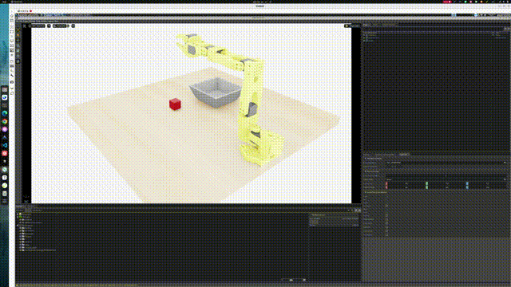

# Simulation Training and Inference

This document describes the complete workflow for using the LeIsaac project with Isaac Sim to collect simulation data for a LeRobot robot, convert the dataset, train a model, and perform distributed inference and evaluation.

## 1. Overview

This solution targets SO101 robotic-arm simulation training and inference and supports the following functions:

- **Data communication**: Uses the LeIsaac distributed architecture to exchange data and execute tasks between the simulator and inference engine.
- **Data collection**: Uses the SO101 Leader arm for remote teleoperation and collects simulation data in Isaac Sim.
- **Data conversion**: Converts the collected HDF5 data to the LeRobot dataset format.
- **Model training**: Trains a model with the LeRobot ACT policy.
- **Inference and evaluation**: Deploys the trained checkpoint to the inference side and performs distributed inference and evaluation in the simulation environment.

LeIsaac uses a distributed simulator-plus-inference-engine architecture:

| Component | Responsibilities | Deployment |
| --- | --- | --- |
| Simulator/server | Manages the Isaac Sim/Lab environment, collects data, runs evaluations, and optionally performs Lab training | NVIDIA GPU + CUDA 12.8 |
| Inference engine/local | Connects to the SO101 Leader, samples joint states, and provides the inference service (gRPC) | PC or SpacemiT K3 development board |

The simulator and inference engine communicate bidirectionally over gRPC. The client streams observations to the server, and the server sends actions in one direction.

## 2. Hardware Requirements

| Item | Requirements |
| --- | --- |
| Simulator/server | NVIDIA GPU + CUDA 12.8 |
| Data-collection platform (optional) | PC |
| Inference engine/local | SpacemiT K3 development board with bianbu v3.0+ firmware |
| Robotic arm | SO101 Leader arm for teleoperation and data collection |
| Visual input | No external camera is required; the simulation environment provides the visual input |
| Key interfaces | The SO101 Leader serial port is typically `/dev/ttyACM0`. The simulator and inference engine must be connected to the same network. |

For teleoperation and data collection, connect the PC to the SO101 Leader arm as shown below:


## 3. Set Up the Environment

The workflow requires separate server-side simulation and local inference/teleoperation environments.

### 3.1 Simulator/Server Environment

1. Clone the repository and initialize the Conda environment:

    ```bash
    git clone git@github.com:spacemit-robotics/leisaac.git --recursive
    cd leisaac

    conda create -n leisaac python=3.11
    conda activate leisaac
    ```

2. Install the dependencies:

    ```bash
    # PyTorch and CUDA
    pip install --upgrade pip
    pip install -U torch==2.7.0 torchvision==0.22.0 --index-url https://download.pytorch.org/whl/cu128

    # Isaac Sim
    pip install "isaacsim[all,extscache]==5.1.0" --extra-index-url https://pypi.nvidia.com

    # System dependencies
    sudo apt install cmake build-essential

    # Isaac Lab
    cd dependencies/IsaacLab
    ./isaaclab.sh --install
    cd ../..

    # LeIsaac
    pip install -e source/leisaac

    # LeRobot, required for dataset conversion
    pip install lerobot==0.4.2
    pip install numpy==1.26.0
    ```

3. Download the simulation assets:

    Download the asset package from [GitHub Releases v0.1.0](https://github.com/LightwheelAI/leisaac/releases/download/v0.1.0/assets.tar.gz) and extract it to the `assets` directory.

    The expected directory structure is:

    ```text
    assets/
    ├── robots/
    │   └── so101_follower.usd
    └── scenes/
        ├── kitchen_with_orange/
        ├── table_with_cube/
        └── custom_scene/
    ```

4. Add the grasping-task assets and environment:

    Follow the LeIsaac documentation for [add custom task](https://lightwheelai.github.io/leisaac/docs/tutorials/custom_task) to add the grasping-task assets and simulation scene.

5. Verify the environment:

    ```bash
    python scripts/environments/list_envs.py
    ```

    If the command outputs the list of available tasks, the server-side simulation environment is configured correctly.

### 3.2 Inference Engine/Local Environment

Install the data-collection and distributed-inference dependencies locally.

1. Clone the repository and initialize the virtual environment:

    ```bash
    git clone git@github.com:spacemit-robotics/leisaac.git --recursive
    cd leisaac

    curl -LsSf https://astral.sh/uv/install.sh | sh
    source "$HOME/.local/bin/env"

    uv venv ~/.local-venv --python 3.12 --seed
    source ~/.local-venv/bin/activate
    python -V
    python -m pip --version

    python -m pip config --site set global.index-url https://mirrors.aliyun.com/pypi/simple
    python -m pip config --site set global.extra-index-url https://git.spacemit.com/api/v4/projects/33/packages/pypi/simple
    ```

    The system Python version on K3 is 3.14 by default. The SpacemiT PyTorch wheel used in this section is built for Python 3.12, so the virtual environment must use Python 3.12. The `--seed` option preinstalls pip in the virtual environment. Use `python -m pip` for subsequent dependency installation to avoid using the system Python by mistake.

2. Install the data-collection dependencies:

    ```bash
    python -m pip install \
      pyserial \
      deepdiff \
      tqdm \
      feetech-servo-sdk
    ```

3. Install the distributed-inference dependencies:

    ```bash
    python -m pip install \
      torch==2.7.1 \
      torchvision==0.22.0 \
      wandb==0.24.0 \
      pyarrow==23.0.0 \
      lerobot==0.5.0 \
      grpcio \
      grpcio-tools \
      protobuf

    python -m pip check
    ```

    If you are using a local development version of LeRobot:

    ```bash
    cd /path/to/lerobot

    python -m pip install \
      torch==2.7.1 \
      torchvision==0.22.0 \
      wandb==0.24.0 \
      pyarrow==23.0.0 \
      -e ".[async]"

    python -m pip check
    ```

4. Configure serial-port permissions:

    The SO101 Leader arm typically uses `/dev/ttyACM0`. If you receive a permission error, run:

    ```bash
    sudo chmod 666 /dev/ttyACM0
    ```

## 4. Scenario 1: End-to-End Simulation Inference and Evaluation

This scenario covers the workflow from remote teleoperation and Isaac Sim recording through HDF5 dataset conversion, ACT model training, and inference.

### 4.1 Reproduction Steps

#### 4.1.1 Start the Leader Data Sender

Start the SO101 Leader data sender on the development board or PC:

```bash
python scripts/tools/leader_sender.py \
    --port /dev/ttyACM0 \
    --listen-port 5050
```

The first run automatically starts SO101 Leader arm calibration. To recalibrate, add `--recalibrate`:

```bash
python scripts/tools/leader_sender.py \
    --port /dev/ttyACM0 \
    --listen-port 5050 \
    --recalibrate
```

Parameter descriptions:

| Parameter | Example | Description |
| --- | --- | --- |
| `--port` | `/dev/ttyACM0` | Serial device path for the SO101 Leader arm |
| `--listen-port` | `5050` | Listening port for incoming server connections |

> [!TIP]
>
> 1. For the calibration procedure, see [SO101 arm calibration](https://huggingface.co/docs/lerobot/en/so101#calibrate).
> 2. Calibration files are stored in `~/.cache/huggingface/lerobot/calibration`.

#### 4.1.2 Start the Simulation Environment and Record Data

On the simulator/server, load the simulation environment and start remote teleoperation data collection:

```bash
python scripts/environments/teleoperation/teleop_network.py \
    --task LeIsaac-SO101-CustomTask-v0 \
    --leader-host 10.0.91.83 \
    --leader-port 5050 \
    --device cuda \
    --enable_cameras \
    --record \
    --dataset_file ./datasets/custom_task.hdf5
```

Parameter descriptions:

| Parameter | Example | Description |
| --- | --- | --- |
| `--task` | `LeIsaac-SO101-CustomTask-v0` | Task identifier that determines the environment configuration, observation space, and action space |
| `--leader-host` | `10.0.91.83` | IP address of the development board or PC |
| `--leader-port` | `5050` | Must match the listening port in `leader_sender.py` |
| `--dataset_file` | `./datasets/custom_task.hdf5` | Dataset output path in HDF5 format |
| `--enable_cameras` | — | Enable camera data collection |
| `--record` | — | Enable data recording |

Controller operations during data collection:

| Key | Function |
| --- | --- |
| `B` | Start or resume robotic-arm control |
| `R` | Mark the trajectory as failed and reset the environment |
| `N` | Mark the trajectory as successful and reset the environment |
| `Ctrl + C` | Stop collection and save the data |

#### 4.1.3 Convert to a LeRobot Dataset

Run this step on the server to convert the recorded HDF5 file to the LeRobot dataset format.

Install the dependencies:

```bash
conda activate leisaac

# Skip these commands if the packages were already installed above.
pip install lerobot==0.4.2
pip install numpy==1.26.0
```

Run the conversion:

```bash
python scripts/convert/isaaclab2lerobotv3.py \
    --task_name=LeIsaac-SO101-CustomTask-v0 \
    --repo_id=EverNorif/so101_test_custom_task \
    --hdf5_root=./datasets \
    --hdf5_files=custom_task.hdf5
```

Parameter descriptions:

| Parameter | Example | Description |
| --- | --- | --- |
| `--task_name` | `LeIsaac-SO101-CustomTask-v0` | Task name used during collection to load the environment configuration |
| `--repo_id` | `EverNorif/so101_test_custom_task` | Dataset identifier on the Hugging Face Hub |
| `--hdf5_root` | `./datasets` | Directory containing the HDF5 file |
| `--hdf5_files` | `custom_task.hdf5` | File to convert; multiple files can be separated by commas |

The conversion generates a LeRobot-format dataset, stored by default in `~/.cache/huggingface/lerobot`. You can optionally push it to the Hugging Face Hub.

#### 4.1.4 Train the ACT Model

LeIsaac focuses on data collection and inference evaluation. Model training is handled by external frameworks, including:

- [LeRobot](https://github.com/huggingface/lerobot) (recommended)
- [GR00T](https://github.com/NVIDIA/Isaac-GR00T)

Example LeRobot ACT training command:

```bash
cd /path/to/lerobot
conda activate leisaac

lerobot-train \
  --policy.type=act \
  --policy.repo_id=EverNorif/act_test_custom_task \
  --dataset.repo_id=EverNorif/so101_test_custom_task \
  --output_dir=outputs/train/act_test_custom_task_amp \
  --job_name=act_test_custom_task \
  --batch_size=4 \
  --steps=100000 \
  --policy.device=cuda \
  --policy.use_amp=true
```

Key parameters:

| Parameter | Example | Description |
| --- | --- | --- |
| `--dataset.repo_id` | `EverNorif/so101_test_custom_task` | Identifier of the converted dataset |
| `--policy.repo_id` | `EverNorif/act_test_custom_task` | Identifier of the trained model |
| `--output_dir` | `outputs/train/act_test_custom_task_amp` | Local directory for saving checkpoints |
| `--steps` | `100000` | Number of training steps |
| `--policy.device` | `cuda` | Training device |
| `--policy.use_amp` | `true` | Whether to enable mixed-precision training |

Example checkpoint directory structure after training:

```text
outputs/train/act_test_custom_task/checkpoints/last/pretrained_model/
├── config.json                                                       # Model configuration, including hyperparameters such as chunk_size, number of layers, and hidden dimensions
├── model.safetensors                                                 # Model weights
├── policy_preprocessor.json                                          # Observation preprocessing configuration
├── policy_preprocessor_step_3_normalizer_processor.safetensors       # Mean and standard deviation of the observation data
├── policy_postprocessor.json                                         # Action postprocessing configuration
├── policy_postprocessor_step_0_unnormalizer_processor.safetensors    # Action denormalization parameters
└── train_config.json                                                  # Training configuration record
```

After training, transfer the checkpoint directory to the `leisaac/models` directory on the inference side. You can also download the author's [pretrained model weights](https://archive.spacemit.com/spacemit-ai/model_zoo/vla/act/act_test_custom_task_amp.tar.gz) and run distributed inference directly when using the same simulation environment.

#### 4.1.5 Distributed Simulation Inference

##### Prerequisites

Before starting inference, confirm the following:

- The server can start the simulation environment, and the output of `list_envs.py` includes the `LeIsaac-SO101-CustomTask-v0` grasping-task environment.

- The LeRobot inference environment, including the `async` extension, is fully installed locally.

- The trained `checkpoint` directory is accessible locally.

- The server and local system can communicate over the network.


##### Start the Inference Service

Start the inference service on the inference engine/local system:

```bash
python -m lerobot.async_inference.policy_server \
    --host=0.0.0.0 \
    --port=5555
```

Parameter descriptions:

| Parameter | Example | Description |
| -------- | --------- | ------------------------------------------- |
| `--host` | `0.0.0.0` | Listen on all network interfaces to allow remote connections |
| `--port` | `5555` | Listening port; must match the server-side `--policy_port` |

##### Start the Simulation Evaluation

Start the simulation evaluation on the simulator/server:

```bash
python scripts/evaluation/policy_inference.py \
    --task=LeIsaac-SO101-CustomTask-v0 \
    --eval_rounds=1 \
    --policy_type=lerobot-act \
    --policy_host=10.0.91.83 \
    --policy_port=5555 \
    --policy_timeout_ms=5000 \
    --policy_action_horizon=100 \
    --device=cpu \
    --enable_cameras \
    --policy_checkpoint_path models/outputs/train/act_test_custom_task_amp/checkpoints/100000/pretrained_model
```

Parameter descriptions:

| Parameter | Example | Description |
| -------------------------- | ------------------------------------------------------------ | ---------------------------------------------------- |
| `--task` | `LeIsaac-SO101-CustomTask-v0` | Evaluation task identifier |
| `--policy_host` | `10.0.91.83` | IP address of the inference service; use `127.0.0.1` when both processes run on the same system |
| `--policy_port` | `5555` | Inference service listening port |
| `--policy_type` | `lerobot-act` | Policy type; supports `lerobot-act`, `lerobot-smolvla`, and others |
| `--policy_checkpoint_path` | `models/outputs/train/act_test_custom_task_amp/checkpoints/100000/pretrained_model` | Checkpoint path |
| `--policy_timeout_ms` | `5000` | Timeout for waiting for the inference service to return actions; increase it as needed on lower-performance devices |
| `--policy_action_horizon` | `100` | Must match the model's `chunk_size` in `config.json` |
| `--device` | `cpu` | Compute device used by the simulation evaluation script |
| `--enable_cameras` | — | Enable simulated camera observations |

### 4.2 Results

After distributed simulation inference starts, the simulator sends observations to the inference service. The inference service returns an action sequence based on the ACT checkpoint, which drives the SO101 arm to complete the target task in the Isaac Sim environment. The result is shown below.



## 5. Troubleshooting

| Symptom | Resolution |
| --- | --- |
| `list_envs.py` does not list the task | Check that Isaac Sim, Isaac Lab, and LeIsaac are fully installed, and confirm that the asset package was extracted to the `assets` directory. |
| SO101 Leader serial port not found | Check the arm connection and confirm that the port is `/dev/ttyACM0`. Replace the `--port` value as needed. |
| Insufficient serial-port permissions | Run `sudo chmod 666 /dev/ttyACM0` and try again. |
| Simulator cannot connect to the Leader service | Confirm that `leader_sender.py` is running, `--leader-host` is the correct IP address of the development board or PC, and the firewall is not blocking port `5050`. |
| HDF5 conversion fails | Check that `--task_name` matches the collection task and that `--hdf5_root` and `--hdf5_files` point to the actual files. |
| Training command reports an argument error | Confirm that the LeRobot version matches the command-line arguments. The mixed-precision option must be `--policy.use_amp=true`. |
| Inference service returns no actions or times out on every frame | Increase `--policy_timeout_ms` as needed and confirm that the checkpoint path on the inference side is accessible. |
| Evaluation action dimensions or timing are incorrect | Confirm that `--policy_action_horizon` matches `chunk_size` in the model's `config.json`. |
| Server and local system cannot communicate | Confirm network connectivity between both sides, ensure that `--policy_host` points to the device running the inference service, and verify that the port matches `policy_server`. |
