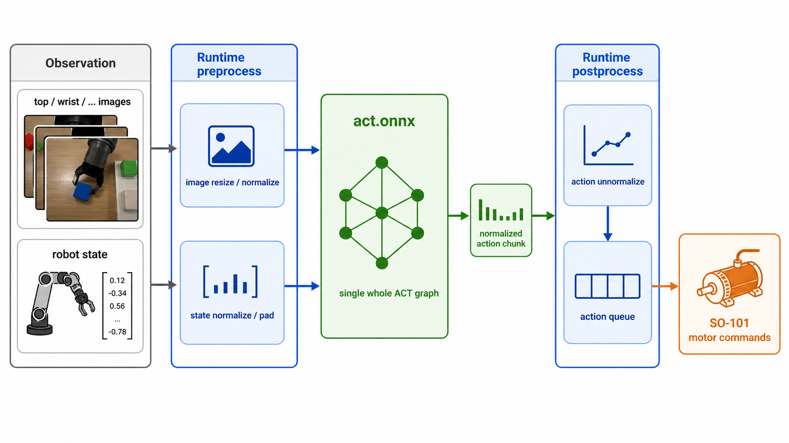
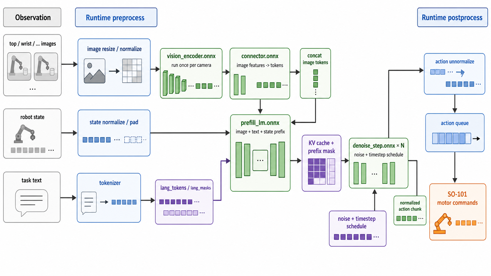
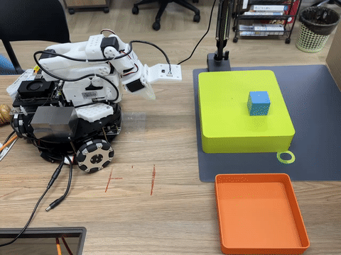

# ONNX Deployment Guide

This document describes how to deploy ACT and SmolVLA policy models with ONNX on the SpacemiT K3 development board. It covers model export, quantization, Python inference, C++ inference, offline validation, and execution on a real SO-101 arm.

## 1. Overview

The ACT policy takes images from multiple cameras and the robotic-arm joint state as input, and outputs an action sequence (action chunk). The ACT ONNX deployment uses a single complete graph. The full data path is shown below:



The SmolVLA policy takes images from multiple cameras, the robotic-arm joint state, and task text as input, and outputs an action chunk. The SmolVLA ONNX deployment chains four subgraphs. The full data path is shown below:



The ONNX graphs are responsible only for neural-network forward inference. The Python/C++ runtime performs the following steps outside the graphs:

- Image and joint-state normalization
- SmolVLA task-text tokenization and KV-cache management
- Action denormalization
- Conversion between SO-101 servo calibration values and the LeRobot action space
- Action-queue playback

## 2. Hardware Requirements

| Hardware | Description |
|---|---|
| x86 host | Recommended for exporting the PyTorch checkpoint to ONNX and quantizing the model |
| SpacemiT K3 development board | Inference platform |
| SO-101 Follower arm | Controls Feetech bus servos through a USB serial connection |
| Top camera | Example device path: `/dev/video15` |
| Wrist camera | Example device path: `/dev/video13` |

## 3. Scenario 1: ACT Deployment

### 3.1 Set Up the Environment

#### 3.1.1 Get the Source Code

The example path on the K3 board is `~/spacemit_robot`:

```bash
cd ~
mkdir -p spacemit_robot
cd spacemit_robot

repo init -u https://github.com/spacemit-robotics/manifest.git \
  -b main -m default.xml \
  --repo-url=https://gitee.com/spacemit-robotics/git-repo
repo sync -j4
repo start robot-dev --all
```

Go to the ACT/SmolVLA ONNX example directory:

```bash
cd ~/spacemit_robot/components/thirdparty/lerobot/examples/onnx_inference
```

#### 3.1.2 K3 C++ Environment

Install the SpacemiT ORT SDK:

```bash
sudo apt-get update
sudo apt-get install -y spacemit-onnxruntime python3-spacemit-ort
```

After installation, you should find the following files:

```text
/usr/include/spacemit_ort_env.h
/usr/lib/libonnxruntime.so
/usr/lib/libspacemit_ep.so
```

If the system packages are not installed, you can download and extract the SpaceMIT ORT SDK separately, then specify its external path when running CMake:

```bash
cmake .. -DSPACEMIT_ORT_DIR=/path/to/spacemit-ort-sdk
```

The path must contain:

```text
/path/to/spacemit-ort-sdk/include/spacemit_ort_env.h
/path/to/spacemit-ort-sdk/lib/libonnxruntime.so
/path/to/spacemit-ort-sdk/lib/libspacemit_ep.so
```

If you run `act_benchmark` or `act_evaluate` directly with the external SDK, you must also run:

```bash
export LD_LIBRARY_PATH=/path/to/spacemit-ort-sdk/lib:$LD_LIBRARY_PATH
```

#### 3.1.3 K3 Python Environment

The Python real-hardware entry point requires LeRobot, the Feetech driver, safetensors, and SpaceMIT EP. Reuse the Python 3.12 virtual environment `~/.lerobot-venv`. If `uv` is not installed, follow [Real-World Training and Inference](3.3.1-真机训练推理.md#33-uv-安装和使用) first.

Do not install `xslim` in the K3 runtime environment. `xslim` depends on `opencv-python`, which conflicts with the `cv2` directory used by LeRobot's `opencv-python-headless`. Run model quantization on an x86 host.

```bash
source "$HOME/.local/bin/env"
uv venv ~/.lerobot-venv --python 3.12 --seed --allow-existing
source ~/.lerobot-venv/bin/activate
python --version
python -m pip --version

cd ~/spacemit_robot/components/thirdparty/lerobot/examples/onnx_inference
python -m pip install -r requirements-act.txt

python -m pip list | grep '^opencv'
python -m pip check
```

`--seed` preinstalls pip in a new environment, and `--allow-existing` preserves packages already installed in the environment. `python --version` should output Python 3.12. `python -m pip` always uses pip from the active virtual environment, which avoids accidentally using the system Python with `pip3` and triggering `externally-managed-environment`. The OpenCV package list should contain only `opencv-python-headless`.

#### 3.1.4 x86 Export and Quantization Environment

Export the model on an x86 host with a complete PyTorch/LeRobot environment:

```bash
conda create -n lerobot-venv python=3.12 -y
conda activate lerobot-venv

cd ~/spacemit_robot/components/thirdparty/lerobot/examples/onnx_inference
python -m pip install -r requirements-act-pc.txt
```

`requirements-act-pc.txt` includes the dependencies required for ACT export, ONNX comparison, and INT8 dynamic quantization.

### 3.2 Prerequisites

#### 3.2.1 Prepare the PyTorch Model

Follow [Real-World Training and Inference](3.3.1-真机训练推理.md) to collect data and train the ACT model, then place the trained ACT checkpoint at:

```text
~/spacemit_robot/components/thirdparty/lerobot/examples/onnx_inference/models/pytorch/act/checkpoints/100000/pretrained_model/
├── config.json
├── model.safetensors
├── policy_preprocessor.json
├── policy_preprocessor_step_3_normalizer_processor.safetensors
├── policy_postprocessor.json
└── policy_postprocessor_step_0_unnormalizer_processor.safetensors
```

#### 3.2.2 Export to ONNX

Run the following command on the x86 host:

```bash
python tools/act_pytorch_to_onnx.py \
  --checkpoint models/pytorch/act/checkpoints/100000/pretrained_model \
  --output-dir models/onnx/act-fp32
```

Exported file:

```text
models/onnx/act-fp32/act.onnx
```

Model inputs and outputs:

| Name | Shape | Description |
|---|---|---|
| `images` | `(B, n_cam, 3, H, W)` | Normalized images, float32 |
| `state` | `(B, state_dim)` | Normalized joint state, float32 |
| `actions` | `(B, chunk_size, action_dim)` | Normalized action sequence, float32 |

Download the [model exported and quantized based on Real-World Training and Inference](https://archive.spacemit.com/spacemit-ai/model_zoo/vla/act/onnx/models.tar.gz) to reproduce the benchmarks in this document.

#### 3.2.3 Validate Accuracy

##### 3.2.3.1 Run ONNX Only

You can run this on either K3 or x86. On K3, enable SpaceMIT EP:

```bash
python tools/compare_act_onnx.py \
  --model-dir models/onnx/act-fp32 \
  --checkpoint models/pytorch/act/checkpoints/100000/pretrained_model \
  --use-spacemit-ep \
  --ep-threads 8 \
  --ep-affinity "8;9;10;11;12;13;14;15"
```

##### 3.2.3.2 Compare with PyTorch

Run this on a machine with PyTorch/LeRobot installed:

```bash
python tools/compare_act_onnx.py \
  --model-dir models/onnx/act-fp32 \
  --checkpoint models/pytorch/act/checkpoints/100000/pretrained_model \
  --cpu \
  --with-torch
```

You can also save the reference output on x86 and copy it to K3 for comparison:

```bash
# Generate the output on x86
python tools/compare_act_onnx.py \
  --model-dir models/onnx/act-fp32 \
  --checkpoint models/pytorch/act/checkpoints/100000/pretrained_model \
  --cpu \
  --with-torch \
  --save-ref /tmp/act_ref.npy

# Run the comparison on K3
python tools/compare_act_onnx.py \
  --model-dir models/onnx/act-fp32 \
  --checkpoint models/pytorch/act/checkpoints/100000/pretrained_model \
  --use-spacemit-ep \
  --ep-threads 8 \
  --ep-affinity "8;9;10;11;12;13;14;15" \
  --ref-npy /tmp/act_ref.npy
```

#### 3.2.4 INT8 Quantization

Use xslim on the x86 host to generate an INT8 model with dynamic quantization:

```bash
mkdir -p models/onnx/act-int8

python -m xslim \
  -i models/onnx/act-fp32/act.onnx \
  -o models/onnx/act-int8/act.q.onnx
```

When no configuration file is specified and `--fp16` is not passed, `xslim 2.x` performs INT8 dynamic quantization by default.

Quantized file:

```text
models/onnx/act-int8/act.q.onnx
```

### 3.3 Deploy for Inference

#### 3.3.1 C++ Deployment

##### 3.3.1.1 Export Statistics Required by the C++ Runtime

`act_evaluate` requires normalization parameters and SO-101 calibration parameters:

```bash
python tools/export_norm_stats.py \
  --checkpoint models/pytorch/act/checkpoints/100000/pretrained_model \
  --output models/onnx/act-fp32/act_norm_stats.txt
```

##### 3.3.1.2 Generate Offline Test Inputs

```bash
python tools/make_act_test_inputs.py \
  --model-dir models/onnx/act-fp32 \
  --stats models/onnx/act-fp32/act_norm_stats.txt \
  --out-dir cpp/inputs
```

Generated files:

```text
cpp/inputs/images.npy
cpp/inputs/state_deg.npy
cpp/inputs/ref_action0.txt
```

##### 3.3.1.3 Build the Offline Test

```bash
cd ~/spacemit_robot/components/thirdparty/lerobot/examples/onnx_inference/cpp
rm -rf build && mkdir build && cd build
cmake ..
make -j$(nproc)
```

If you use an external SDK:

```bash
cmake .. -DSPACEMIT_ORT_DIR=/path/to/spacemit-ort-sdk
make -j$(nproc)
```

##### 3.3.1.4 Run the Offline Test

```bash
cd ~/spacemit_robot/components/thirdparty/lerobot/examples/onnx_inference/cpp/build

./act_benchmark ../../models/onnx/act-int8/act.q.onnx \
  --images-npy ../inputs/images.npy \
  --state-npy ../inputs/state_deg.npy \
  -s -t 8 -a "8;9;10;11;12;13;14;15" \
  -n 20 -w 3
```

##### 3.3.1.5 Run on the Real Hardware

Real-hardware execution requires `ACT_ROBOT_HW` to be enabled and `components/peripherals/motor` to be accessible:

```bash
cd ~/spacemit_robot/components/thirdparty/lerobot/examples/onnx_inference/cpp
rm -rf build && mkdir build && cd build
cmake .. -DACT_ROBOT_HW=ON
make act_evaluate -j$(nproc)
```

Run the application:

```bash
cd ~/spacemit_robot/components/thirdparty/lerobot/examples/onnx_inference/cpp/build

./act_evaluate ../../models/onnx/act-int8/act.q.onnx \
  --stats ../../models/onnx/act-fp32/act_norm_stats.txt \
  --port /dev/ttyACM0 --camera top=15 --camera wrist=13 \
  --fps 30 --episode-time 180 \
  -s -t 8 -a "8;9;10;11;12;13;14;15"
```

Parameter descriptions:

| Parameter | Description | Default |
|---|---|---|
| `--stats` | Path to `act_norm_stats.txt` | Required |
| `--port` | SO-101 serial port | `/dev/ttyACM0` |
| `--camera NAME=IDX` | Mapping from camera name to `/dev/videoIDX` | None |
| `--fps` | Control-loop frequency | 30 |
| `--episode-time` | Duration of one run, in seconds | 180 |
| `-s, --spacemit` | Enable SpaceMIT EP | Disabled |
| `-t, --threads` | Number of EP/ORT threads | 4 |
| `-a, --affinity` | EP thread affinity | Empty |
| `--dry-run` | Compute actions without sending them to the motors | Disabled |
| `--verbose` | Print the state and actions for each step | Disabled |

#### 3.3.2 Python Deployment

##### 3.3.2.1 Run the Offline Test

```bash
source ~/.lerobot-venv/bin/activate
cd ~/spacemit_robot/components/thirdparty/lerobot/examples/onnx_inference

python python/act_benchmark.py \
  --model-dir models/onnx/act-int8 \
  --checkpoint models/pytorch/act/checkpoints/100000/pretrained_model \
  --use-spacemit-ep \
  --ep-threads 8 \
  --ep-affinity "8;9;10;11;12;13;14;15" \
  --warmup 5 \
  --iters 20
```

##### 3.3.2.2 Run on the Real Hardware

```bash
source ~/.lerobot-venv/bin/activate
cd ~/spacemit_robot/components/thirdparty/lerobot/examples/onnx_inference

python python/act_evaluate.py \
  --model-dir models/onnx/act-int8 \
  --checkpoint models/pytorch/act/checkpoints/100000/pretrained_model \
  --port /dev/ttyACM0 \
  --camera top=15 \
  --camera wrist=13 \
  --use-spacemit-ep \
  --ep-threads 8 \
  --ep-affinity "8;9;10;11;12;13;14;15" \
  --episode-time 180
```

### 3.4 Results

The image below shows ACT running on real hardware with Python. Compared with the PyTorch version, the significantly lower chunk-inference latency produces much smoother transitions between action chunks.



## 4. Scenario 2: SmolVLA Deployment

SmolVLA ONNX deployment covers FP32 export, FP16 quantization, FP16 graph surgery, numerical comparison, and real-hardware execution. For K3 real-hardware deployment, use the C++ FP16 graph-surgery model. The Python path is for FP32 offline validation and debugging.

### 4.1 Set Up the Environment

K3 Python inference and numerical comparison both use the Python 3.12 virtual environment `~/.lerobot-venv`. The commands below invoke `uv` to add pip to that environment without disturbing packages already installed there:

Do not install `xslim` in the K3 runtime environment. Perform SmolVLA FP16 conversion and graph surgery on an x86 host.

```bash
source "$HOME/.local/bin/env"
uv venv ~/.lerobot-venv --python 3.12 --seed --allow-existing
source ~/.lerobot-venv/bin/activate
python --version
python -m pip --version

cd ~/spacemit_robot/components/thirdparty/lerobot/examples/onnx_inference
python -m pip install -r requirements-smolvla.txt

python -m pip list | grep '^opencv'
python -m pip check
```

`python --version` should output Python 3.12. Do not use the system `pip3`. The OpenCV package list should contain only `opencv-python-headless`.

x86 export, quantization, and numerical-comparison environment:

```bash
conda create -n lerobot-venv python=3.12 -y
conda activate lerobot-venv

cd ~/spacemit_robot/components/thirdparty/lerobot/examples/onnx_inference
python -m pip install -r requirements-smolvla-pc.txt
```

The C++ real-hardware entry point requires the following build dependencies on K3:

```bash
sudo apt-get update
sudo apt-get install -y build-essential cmake pkg-config libopencv-dev
```

### 4.2 Prerequisites

Go to the ONNX example directory:

```bash
cd ~/spacemit_robot/components/thirdparty/lerobot/examples/onnx_inference
```

You can download the released SmolVLA two-camera model to reproduce the results:

```bash
mkdir -p models/pytorch models/onnx /tmp/smolvla_models

curl -L \
  https://archive.spacemit.com/spacemit-ai/model_zoo/vla/smolvla/models/pytorch/so101_smolvla_pick_green_cube_2cam.tar.gz \
  -o /tmp/smolvla_models/so101_smolvla_pick_green_cube_2cam.tar.gz
curl -L \
  https://archive.spacemit.com/spacemit-ai/model_zoo/vla/smolvla/models/onnx/so101_smolvla_pick_green_cube_2cam_100k_fp32.tar.gz \
  -o /tmp/smolvla_models/so101_smolvla_pick_green_cube_2cam_100k_fp32.tar.gz
curl -L \
  https://archive.spacemit.com/spacemit-ai/model_zoo/vla/smolvla/models/onnx/so101_smolvla_pick_green_cube_2cam_100k_fp16_surgeried.tar.gz \
  -o /tmp/smolvla_models/so101_smolvla_pick_green_cube_2cam_100k_fp16_surgeried.tar.gz

tar -xzf /tmp/smolvla_models/so101_smolvla_pick_green_cube_2cam.tar.gz -C models/pytorch
tar -xzf /tmp/smolvla_models/so101_smolvla_pick_green_cube_2cam_100k_fp32.tar.gz -C models/onnx
tar -xzf /tmp/smolvla_models/so101_smolvla_pick_green_cube_2cam_100k_fp16_surgeried.tar.gz -C models/onnx

ln -sfn so101_smolvla_pick_green_cube_2cam_100k_fp32 models/onnx/smolvla-fp32
ln -sfn so101_smolvla_pick_green_cube_2cam_100k_fp16_surgeried models/onnx/smolvla-fp16-surgeried
mkdir -p models/pytorch/smolvla/checkpoints/100000
ln -sfn ../../../so101_smolvla_pick_green_cube_2cam/checkpoints/100000/pretrained_model \
  models/pytorch/smolvla/checkpoints/100000/pretrained_model
```

Running the FP16 graph-surgery model on K3 requires the patched SpacemiT ORT SDK:

```bash
mkdir -p /tmp/smolvla_models

curl -L \
  https://archive.spacemit.com/spacemit-ai/model_zoo/vla/smolvla/spacemit-ort-sdk/spacemit-ort.riscv64.2.0.4_yyx.tar.gz \
  -o /tmp/smolvla_models/spacemit-ort.riscv64.2.0.4_yyx.tar.gz

tar -xzf /tmp/smolvla_models/spacemit-ort.riscv64.2.0.4_yyx.tar.gz -C ~
```

> [!NOTE]
>
> The SmolVLA FP16 graph-surgery model must run with the patched SpacemiT ORT SDK. Running FP16 with the system SpaceMIT EP, standard ONNX Runtime, or the CPU may cause numerical drift or overflow. Use the FP32 model for Python debugging.

### 4.3 Export ONNX FP32

If you are using a self-trained SmolVLA checkpoint, place it at:

```text
~/spacemit_robot/components/thirdparty/lerobot/examples/onnx_inference/models/pytorch/smolvla/checkpoints/100000/pretrained_model/
├── config.json
├── model.safetensors
├── policy_preprocessor.json
├── policy_postprocessor.json
└── train_config.json
```

Run the export on the x86 host:

```bash
python tools/export_smolvla_4model_to_onnx.py \
  --checkpoint models/pytorch/smolvla/checkpoints/100000/pretrained_model \
  --output-dir models/onnx/smolvla-fp32 \
  --num-cameras 2 \
  --validate-load
```

Exported files:

```text
models/onnx/smolvla-fp32/
├── vision_encoder.onnx
├── connector.onnx
├── prefill_lm.onnx
└── denoise_step.onnx
```

`--num-cameras` specifies the number of camera slots in the ONNX model. It must match the number of cameras used during training or the empty-camera configuration. For example, set it to `2` for a two-camera model and `3` for a three-camera model.

### 4.4 FP16 Quantization and Graph Surgery

First convert the FP32 ONNX graphs to FP16:

```bash
python tools/convert_smolvla_fp32_to_fp16.py \
  --input-dir models/onnx/smolvla-fp32 \
  --output-dir models/onnx/smolvla-fp16
```

Converting the entire SmolVLA graph to FP16 in one pass can cause numerical drift in subgraphs related to visual attention, normalization, and index updates. The RMSNorm subgraphs inside `prefill_lm` and `denoise_step` are particularly sensitive: they participate in critical language-model and diffusion-denoising computations, and errors there accumulate across multiple denoising steps, ultimately producing erratic actions, grasp failures, or FP16 overflow. Graph surgery addresses this by keeping FP16 acceleration for the main operators while patching the sensitive subgraphs to more numerically stable forms.

Perform FP16 graph surgery:

```bash
python tools/surgery_smolvla_fp16.py \
  --input-dir models/onnx/smolvla-fp16 \
  --output-dir models/onnx/smolvla-fp16-surgeried
```

The current graph-surgery operations include:

- `vision_encoder`: Fuses the self-attention core into `VisionSelfAttnNHWC` and replaces the GELU approximation subgraph in the MLP with ONNX `Gelu(approximate="tanh")`.
- `prefill_lm` / `denoise_step`: Promotes the key calculations in the RMSNorm subgraphs to FP32 and decomposes the scatter-write operators into equivalent subgraphs.
- Keeps the main forward computations, such as `connector`, in FP16 to preserve the inference speed benefits on K3.

The graph-surgery output directory still contains four ONNX subgraphs:

```text
models/onnx/smolvla-fp16-surgeried/
├── vision_encoder.onnx
├── connector.onnx
├── prefill_lm.onnx
└── denoise_step.onnx
```

### 4.5 Validate Accuracy

On the x86 host, compare the FP32 output with the output from the FP16 graph-surgery model using the CPU:

```bash
python tools/compare_smolvla_onnx.py \
  --fp32-dir models/onnx/smolvla-fp32 \
  --fp16-dir models/onnx/smolvla-fp16-surgeried \
  --cpu \
  --num-cameras 2 \
  --denoise-steps 10
```

FP16 validation on K3 requires loading both the patched `libonnxruntime.so` and `libspacemit_ep.so`. Therefore, use the C++ EP204 numerical check in Section 4.8.2 as the K3 acceptance test. Do not load the patched SDK in the Python process with `--spacemit-ort-dir`.

### 4.6 Export C++ Runtime Metadata

C++ real-hardware execution requires the task text, normalization parameters, camera order, action-chunk parameters, and SO-101 calibration. Before the first deployment and after replacing the arm, calibrate the follower:

```bash
lerobot-calibrate \
  --robot.type=so101_follower \
  --robot.port=/dev/ttyACM0 \
  --robot.id=my_awesome_follower_arm
```

Confirm that the calibration file exists:

```bash
ls ~/.cache/huggingface/lerobot/calibration/robots/so_follower/my_awesome_follower_arm.json
```

Export `smolvla_runtime.txt`:

```bash
python tools/export_smolvla_runtime.py \
  --checkpoint models/pytorch/smolvla/checkpoints/100000/pretrained_model \
  --output models/onnx/smolvla_runtime.txt \
  --task "Place the green cube into the box" \
  --num-cameras 2 \
  --calibration ~/.cache/huggingface/lerobot/calibration/robots/so_follower/my_awesome_follower_arm.json
```

- `--task` must match the task used for training and deployment.
- During online inference, each `--camera` name must match the suffix of the corresponding image key in the checkpoint. For example, `observation.images.top` maps to `top`, and `observation.images.wrist` maps to `wrist`.

### 4.7 Python Inference

The Python SmolVLA path uses the FP32 model for offline validation or dry-run debugging. When running the FP32 model on K3, pass `--cpu-denoise`: `denoise_step` uses the CPU EP, while the other three subgraphs use SpaceMIT EP. Deploy the FP16 graph-surgery model through the C++ path because FP16 numerical correctness depends on the patched SpacemiT ORT SDK and the corresponding EP configuration.

Before running, confirm that the following files exist:

```bash
cd ~/spacemit_robot/components/thirdparty/lerobot/examples/onnx_inference

ls models/onnx/smolvla-fp32/vision_encoder.onnx
ls models/onnx/smolvla-fp32/connector.onnx
ls models/onnx/smolvla-fp32/prefill_lm.onnx
ls models/onnx/smolvla-fp32/denoise_step.onnx
ls models/pytorch/smolvla/checkpoints/100000/pretrained_model/config.json
```

#### 4.7.1 Offline Benchmark

The offline benchmark does not connect to the arm or cameras. It runs the complete four-model pipeline with synthetic observations. Use this mode to verify model loading and EP availability, and to measure full-inference latency.

```bash
source ~/.lerobot-venv/bin/activate
cd ~/spacemit_robot/components/thirdparty/lerobot/examples/onnx_inference

python python/smolvla_evaluate.py \
  --no-robot --iters 1 \
  --model-dir models/onnx/smolvla-fp32 \
  --checkpoint models/pytorch/smolvla/checkpoints/100000/pretrained_model \
  --use-spacemit-ep \
  --cpu-denoise \
  --ep-threads 8 --ep-affinity "8;9;10;11;12;13;14;15" \
  --warmup 1 \
  --denoise-steps 10 \
  --n-action-steps 50 \
  --infer-every-tick \
  --print-actions
```

Key parameters:

| Parameter | Description | Default |
|---|---|---|
| `--no-robot` | Use synthetic observations without connecting to the arm or cameras | Disabled |
| `--model-dir` | SmolVLA FP32 ONNX directory | `models/onnx/smolvla-fp32` |
| `--checkpoint` | SmolVLA `pretrained_model` directory | `models/pytorch/smolvla/checkpoints/100000/pretrained_model` |
| `--use-spacemit-ep` | Use SpaceMIT EP | Enabled by default |
| `--cpu` | Force the CPU EP for diagnostics | Disabled |
| `--cpu-denoise` | Use the CPU EP for FP32 `denoise_step` while the other subgraphs continue to use SpaceMIT EP | Disabled |
| `--warmup` | Number of synthetic-input warmup runs before timing | 0 |
| `--infer-every-tick` | Run full inference on every iteration to measure full-inference latency | Disabled |
| `--denoise-steps` | Number of times to call `denoise_step` for each inference | 10 |
| `--n-action-steps` | Number of action steps placed in the action queue after each inference | Read from the checkpoint |

Without `--infer-every-tick`, the script reuses any remaining actions in the action queue. As a result, later iterations may not run the complete model again, so this mode cannot be used to measure full-inference latency.

#### 4.7.2 dry-run Debugging

dry-run connects to the real arm and cameras and reads real observations, but does not send actions to the motors. Before the first hardware run, use `--max-iters 1` to check the cameras, serial port, model output, and action value range.

```bash
python python/smolvla_evaluate.py \
  --dry-run --max-iters 1 \
  --port /dev/ttyACM0 \
  --camera top=/dev/video15 --camera wrist=/dev/video13 \
  --camera-fps 30 --camera-fourcc MJPG \
  --use-spacemit-ep \
  --cpu-denoise \
  --ep-threads 8 --ep-affinity "8;9;10;11;12;13;14;15" \
  --model-dir models/onnx/smolvla-fp32 \
  --checkpoint models/pytorch/smolvla/checkpoints/100000/pretrained_model \
  --denoise-steps 10 \
  --n-action-steps 50 \
  --print-actions
```

Common dry-run checks:

- Confirm that the camera paths are correct, for example, `top=/dev/video15` and `wrist=/dev/video13`.
- Confirm that the `--camera` names match the image-key suffixes in the training data and `smolvla_runtime.txt`.
- Confirm that the first action contains finite values and is not clearly outside the arm's action range.
- Confirm that `--denoise-steps` and `--n-action-steps` match the subsequent C++ real-hardware deployment configuration.

### 4.8 C++ Real-Hardware Deployment

The C++ path is the recommended deployment method for SmolVLA on K3. By default, it runs `models/onnx/smolvla-fp16-surgeried` and uses `run_smolvla_robot_pipeline.sh` to apply the patched SpacemiT ORT SDK, EP thread settings, and CPU affinity configuration.

#### 4.8.1 Build

Before building, confirm that the patched SDK has been extracted and that the model and runtime metadata are ready:

```bash
ls ~/spacemit-ort.riscv64.2.0.4_yyx/lib/libonnxruntime.so
ls ~/spacemit-ort.riscv64.2.0.4_yyx/lib/libspacemit_ep.so
ls ~/spacemit_robot/components/thirdparty/lerobot/examples/onnx_inference/models/onnx/smolvla-fp16-surgeried/
ls ~/spacemit_robot/components/thirdparty/lerobot/examples/onnx_inference/models/onnx/smolvla_runtime.txt
```

Build the SmolVLA C++ real-hardware entry point:

```bash
cd ~/spacemit_robot/components/thirdparty/lerobot/examples/onnx_inference/cpp
./build_smolvla_robot_cpp.sh EP204
```

Build output:

```text
cpp/build_smolvla_robot/smolvla_robot_pipeline
```

#### 4.8.2 K3 FP16 Numerical Check

First run a hardware-free check with synthetic inputs. This command does not open the arm or cameras and does not send motor commands:

```bash
cd ~/spacemit_robot/components/thirdparty/lerobot/examples/onnx_inference/cpp

DRY_RUN=1 WARMUP=1 ./run_smolvla_robot_pipeline.sh \
  --warmup-only \
  --debug-numerics
```

Check the log to confirm that all four ONNX subgraphs create SpaceMIT EP sessions successfully and that the `bad` count is `0` for all 10 `denoise_step` iterations.

#### 4.8.3 dry-run Safety Check

Run a dry-run before real-hardware execution. This mode opens the cameras and arm and reads real states and images, but does not send actions to the motors:

```bash
./run_smolvla_robot_pipeline.sh \
  --port /dev/ttyACM0 \
  --camera top=15 \
  --camera wrist=13 \
  --dry-run \
  --max-iters 1 \
  --n-action-steps 25 \
  --print-actions
```

After the dry-run succeeds, proceed to benchmarking or real-hardware execution.

#### 4.8.4 Full-Inference Benchmark

When running the full-inference benchmark, enable `--infer-every-tick` to prevent the action queue from reusing actions. This mode collects a new observation and runs the complete four-model pipeline during every control cycle to measure actual inference time.

```bash
cd ~/spacemit_robot/components/thirdparty/lerobot/examples/onnx_inference/cpp

./run_smolvla_robot_pipeline.sh \
  --port /dev/ttyACM0 \
  --camera top=15 \
  --camera wrist=13 \
  --dry-run \
  --warmup 1 \
  --max-iters 3 \
  --infer-every-tick \
  --n-action-steps 50
```

- `--warmup 1` runs one inference with synthetic inputs before the actual measurements to reduce the effect of first-run model initialization.
- `--max-iters 3` runs only three control cycles, which is suitable for benchmarking.
- `--dry-run` prevents motor commands from being sent, but still collects real observations and runs full inference.

#### 4.8.5 Run on the Real Hardware

```bash
./run_smolvla_robot_pipeline.sh \
  --port /dev/ttyACM0 \
  --camera top=15 \
  --camera wrist=13 \
  --n-action-steps 25 \
  --print-actions
```

Parameter descriptions:

| Parameter | Description | Default |
|---|---|---|
| `--model-dir` | SmolVLA ONNX directory | `models/onnx/smolvla-fp16-surgeried` |
| `--runtime` | Path to `smolvla_runtime.txt` | `models/onnx/smolvla_runtime.txt` |
| `--port` | SO-101 serial port | `/dev/ttyACM0` |
| `--camera NAME=IDX` | Mapping from camera name to `/dev/videoIDX` | None |
| `--n-action-steps` | Number of action steps placed in the action queue after each inference | Read from the runtime metadata |
| `--denoise-steps` | Number of denoising iterations; higher values increase latency | 10 |
| `--infer-every-tick` | Run full inference during every control cycle for benchmarking | Disabled |
| `--dry-run` | Compute actions without sending them to the motors | Disabled |
| `--print-actions` | Print the actions | Enabled by default in the script |

`--n-action-steps` controls the action-queue refresh rate. Start with `25`; increase it if replanning happens too often, or decrease it if the system needs to react more quickly to changes in the environment.

#### 4.8.6 Multi-Camera Models

The two-camera example uses `top` and `wrist`. If three cameras were used during training, use the corresponding camera count when exporting ONNX and `smolvla_runtime.txt`, and pass the corresponding camera mappings at runtime.

Three-camera model example:

```bash
./run_smolvla_robot_pipeline.sh \
  --model-dir models/onnx/smolvla-3cam-fp16-surgeried \
  --runtime models/onnx/smolvla_runtime_3cam.txt \
  --port /dev/ttyACM0 \
  --camera camera1=3 \
  --camera camera2=1 \
  --camera camera3=5 \
  --dry-run \
  --max-iters 1 \
  --print-actions
```

### 4.9 Results

The image below shows SmolVLA running on real hardware with C++ and `--n-action-steps` set to 35.


## 5. K3 Measured Reference Results

Latency varies with the firmware, ORT SDK, model, and thermal conditions. The following data provides an estimate of the performance range and is not an acceptance result for the current version.

### 5.1 Python Performance Results

| Model | Configuration | Average latency |
|---|---|---|
| `act-fp32` | EP, 8 threads | 1290.0 ms |
| `act-int8` | EP, 8 threads | 210.9 ms |
| `smolvla-fp32` | EP, 8 threads + CPU denoise | 8762.5 ms |

### 5.2 C++ Performance Results

| Model | Configuration | Average latency |
|---|---|---|
| `act-fp32` | EP, 8 threads | 1288.3 ms |
| `act-int8` | EP, 8 threads | 247.2 ms |
| `smolvla-fp32` | EP, 8 threads | 9023.9 ms |
| `smolvla-fp16` | EP204, 8 threads | 1113.2 ms |

The SmolVLA results use the two-camera model and `--denoise-steps 10`. They measure the average time for complete inference and exclude model loading.

Use the following recommended commands to rerun the K3 performance gates provided in the repository:

```bash
source ~/.lerobot-venv/bin/activate
cd ~/spacemit_robot/components/thirdparty/lerobot/examples/onnx_inference

bash test/test_act_k3_performance.sh
bash test/test_smolvla_k3_performance.sh
```

The ACT script performs three warmup runs and 20 INT8 measurements by default, with an average-latency threshold of 500 ms. The SmolVLA script uses synthetic inputs, EP204, one warmup run, and three FP16 measurements, with an average-latency threshold of 1600 ms. Both scripts output `PERF_OK` when they pass.

In a rerun on K3 on August 10, 2026, the average ACT INT8 latency was 247.226 ms and the average SmolVLA FP16 latency was 1113.167 ms. Both passed the performance gates.

## 6. Frequently Asked Questions

### 6.1 Which deployment path should I use for ACT and SmolVLA?

For ACT, use the Python or C++ INT8 model when possible for lower end-to-end latency. For SmolVLA, use the C++ FP16 graph-surgery model. The Python path is primarily for FP32 offline validation and dry-run debugging.

### 6.2 Why must SmolVLA FP16 use the patched SpacemiT ORT SDK?

SmolVLA FP16 is more sensitive to numerical behavior in some operators. Numerical correctness has been validated with the patched SDK and the FP16 graph-surgery model. Running FP16 with the system SpaceMIT EP, standard ONNX Runtime, or the CPU may cause numerical drift or overflow.

### 6.3 What should I use for the `--camera` name?

The `--camera` name must match the suffix of the image key in the training data and model metadata. For example, if training uses `observation.images.top` and `observation.images.wrist`, deployment should use `--camera top=15 --camera wrist=13`.

### 6.4 What does `--n-action-steps` affect?

This parameter controls the number of action steps placed in the action queue after each inference. Larger values reuse each inference result for longer, producing more continuous actions but slower responses. Smaller values replan more often and respond faster, but may increase jitter. For SmolVLA real-hardware runs, start debugging with `25`.

### 6.5 How do I verify that the arm calibration file is usable?

Before running on real hardware with C++, export runtime metadata that includes the SO-101 calibration. Run `lerobot-calibrate`, confirm that `~/.cache/huggingface/lerobot/calibration/robots/so_follower/<robot_id>.json` exists, and pass this file to `export_smolvla_runtime.py` with `--calibration`.

### 6.6 Why does importing `cv2` on K3 report that `gapi_wip_gst_GStreamerPipeline` is missing?

This error means that both `opencv-python` and `opencv-python-headless` are installed in the K3 virtual environment. The two distributions write different versions of Python files and binary extensions to the same `cv2` directory.

The following commands uninstall `xslim` and both OpenCV distributions from the K3 virtual environment, then reinstall the headless version used by LeRobot. Do not run these commands in the x86 export and quantization environment.

```bash
source "$HOME/.local/bin/env"
uv venv ~/.lerobot-venv --python 3.12 --seed --allow-existing
source ~/.lerobot-venv/bin/activate
python -m pip uninstall -y xslim opencv-python opencv-python-headless
python -m pip install \
  --index-url https://mirrors.aliyun.com/pypi/simple \
  opencv-python-headless==4.12.0.88

python -c 'import cv2; print(cv2.__version__, hasattr(cv2, "VideoCapture"))'
python -m pip list | grep '^opencv'
python -m pip check
```

The output should show OpenCV version `4.12.0`, `VideoCapture` as `True`, and only `opencv-python-headless` in the package list.
