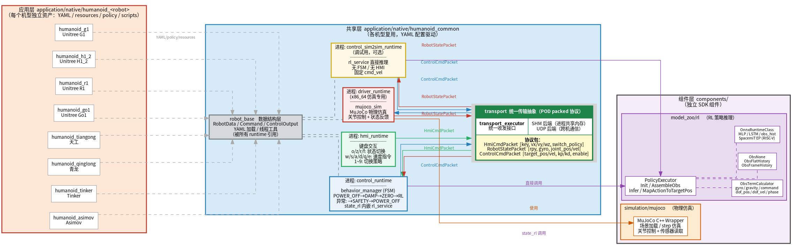
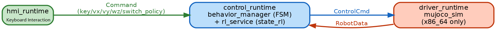
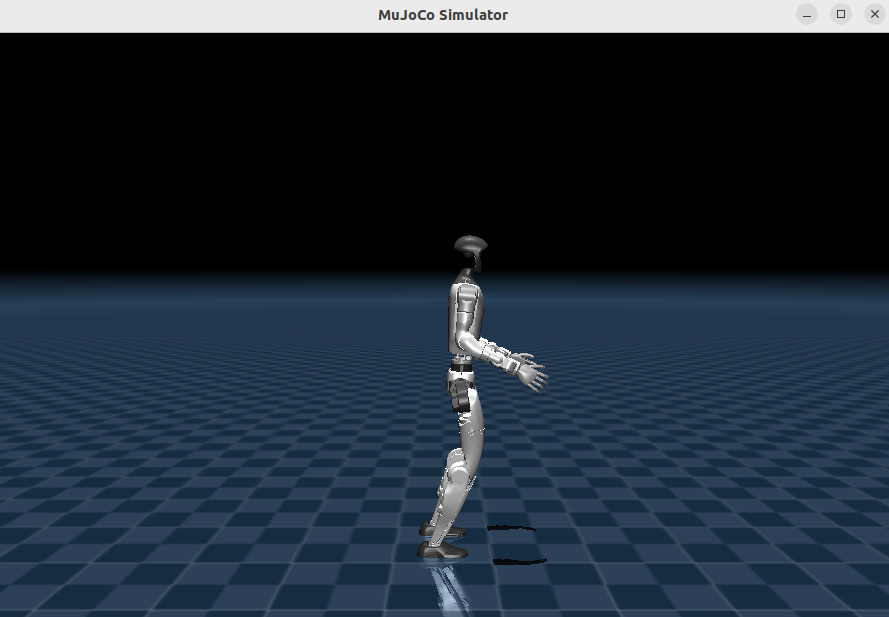
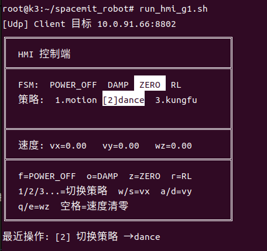
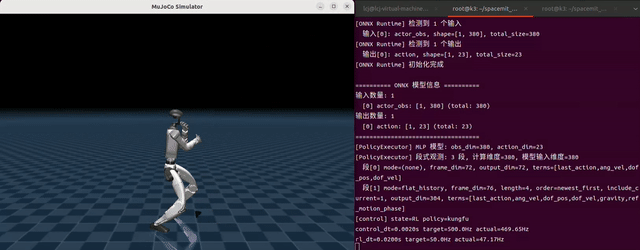

# Humanoid Robot

## 1. Overview

This is a humanoid-robot motion-control solution based on the SpacemiT K3 board, with MuJoCo simulation support. The SDK currently provides application examples for eight robot models:

| Model | Description | Degrees of Freedom |
| --- | --- | --- |
| g1 | Unitree G1 humanoid robot | 29 (left leg 6 + right leg 6 + waist 3 + left arm 7 + right arm 7) |
| h1_2 | Unitree H1_2 full-size humanoid robot | 27 (left leg 6 + right leg 6 + waist 1 + left arm 7 + right arm 7) |
| r1 | Unitree R1 compact humanoid robot | 24 (left leg 6 + right leg 6 + waist 2 + left arm 5 + right arm 5) |
| go1 | Unitree Go1 quadruped robot | 12 (FR 3 + FL 3 + RR 3 + RL 3) |
| asimov | Asimov bipedal robot | 12 (left leg 6 + right leg 6) |
| tinker | Tinker Shanghai bipedal humanoid robot | 10 (left leg 5 + right leg 5) |
| qinglong | Qinglong Shanghai full-size humanoid robot | 31 (left leg 6 + right leg 6 + waist 3 + head 2 + left arm 7 + right arm 7) |
| tiangong | Tiangong 2 Beijing full-size humanoid robot | 20 (left leg 6 + right leg 6 + left arm 4 + right arm 4) |

**Overall SDK architecture**:



The SDK is organized into three layers:

- **Application layer** `application/native/humanoid_<robot>`: One repository per robot model. Contains only asset files (YAML configs, MuJoCo resources, ONNX policies, launch scripts); no executable code.
- **Shared layer** `application/native/humanoid_common`: Four runtime processes (`driver_runtime`, `control_runtime`, `control_sim2sim_runtime`, `hmi_runtime`) and three shared libraries: `robot_base` (data structures), `behavior_manager` (FSM state machine), and `transport` (with SHM and UDP backends).
- **Component layer** `components/`: `model_zoo/rl` (ONNX RL inference) and `simulation/mujoco` (MuJoCo wrapper). Independent of the humanoid SDK and reusable by other projects.

**Related directories**:

```
application/native/
├── humanoid_unitree_g1/                    # Application layer (g1 example; other models share the same structure)
│   ├── config/g1.yaml                      #   Runtime config: joint definitions, transport, RL policy parameters
│   ├── policy/                             #   ONNX policy models (motion / dance / kungfu / tracking ...)
│   ├── resources/                          #   MuJoCo resources (URDF, XML scenes, STL meshes)
│   └── scripts/                            #   Launch scripts (run_driver_g1.sh, run_control_g1.sh, etc.)
├── humanoid_unitree_h1_2/                  # Other 7 models, same structure as above
├── humanoid_unitree_r1/
├── …
└── humanoid_common/                        # Shared layer (reused by all models)
    ├── include/
    │   ├── robot_base.h                    #   Public header: RobotData / Command / ControlOutput / YAML config loading
    │   ├── behavior_manager.h              #   Public header: FSM state-machine interface, StateName enum
    │   └── transport_executor.h            #   Public header: unified transport interface, Role enum, factory functions
    ├── src/
    │   ├── runtime/
    │   │   ├── driver_runtime.cpp          #   Simulation driver process (x86_64, links MuJoCo)
    │   │   ├── control_runtime.cpp         #   FSM control process (behavior_manager + rl_service)
    │   │   ├── control_sim2sim_runtime.cpp #   sim2sim debug process (direct RL inference, no FSM)
    │   │   └── hmi_runtime.cpp             #   Keyboard interaction process (state switching + velocity commands)
    │   ├── robot_base/
    │   │   ├── robot_base.cpp              #   RobotData implementation: YAML joint-definition loading, data init
    │   │   └── thread_utils.cpp            #   Thread utilities: real-time priority, CPU affinity
    │   ├── behavior_manager/
    │   │   ├── behavior_manager.cpp        #   Public interface implementation: Init / Update / GetStateName
    │   │   ├── behavior_fsm.h              #   FSM internals: state registration, transition table, Tick-driven
    │   │   ├── behavior_fsm.cpp
    │   │   ├── behavior_state.h            #   State base class: Enter / Execute / Exit virtual interfaces
    │   │   ├── state_factory.h             #   State factory: creates concrete state instances by StateName
    │   │   └── states/
    │   │       ├── state_power_off.cpp     #   POWER_OFF: outputs zero torque, initial state
    │   │       ├── state_damp.cpp          #   DAMP: kp=0 + kd damping, soft support
    │   │       ├── state_zero.cpp          #   ZERO: quintic-polynomial interpolation back to initial position
    │   │       ├── state_rl.cpp            #   RL: async inference thread, calls rl_service
    │   │       └── state_safety.cpp        #   SAFETY: triggered by IMU/joint limits, slowly releases force
    │   └── transport/
    │       ├── transport_executor/
    │       │   ├── transport_executor.cpp  #   Unified send/receive orchestration: dispatches Send/Recv by Role
    │       │   ├── transport_packet.h      #   Protocol packet definitions: HmiCmdPacket / ControlCmdPacket / RobotStatePacket
    │       │   ├── transport_shm_impl.h    #   SHM backend adapter interface
    │       │   ├── transport_shm_impl.cpp  #   SHM backend adapter implementation
    │       │   ├── transport_udp_impl.h    #   UDP backend adapter interface
    │       │   └── transport_udp_impl.cpp  #   UDP backend adapter implementation
    │       ├── shm/
    │       │   ├── shm_transport.h         #   Shared-memory transport: POSIX shm + spinlock
    │       │   └── shm_transport.cpp
    │       └── udp/
    │           ├── udp_transport.h         #   UDP transport: async send/receive + serialization
    │           └── udp_transport.cpp
    └── example/
        ├── robot_base/
        │   ├── test_robot_base.cpp         #   Functional test: YAML loading, data-structure validation
        │   └── config_example.yaml
        ├── behavior_manager/
        │   ├── test_behavior.cpp           #   Functional test: FSM state-transition validation
        │   └── config_example.yaml
        └── transport_executor/
            ├── test_transport_executor.cpp #   Functional test: SHM/UDP send/receive validation
            └── config_example.yaml

components/                                 # Component layer (standalone SDK, reusable by other projects)
├── model_zoo/rl/                           #   RL policy inference (see the RL documentation)
└── simulation/mujoco/                      #   MuJoCo physics-simulation wrapper
    ├── include/
    │   └── mujoco_sim.h                    #   Only public header: MujocoSim class, SimState / SimCommand
    ├── src/
    │   ├── mujoco_sim.cpp                  #   Simulator implementation: XML model loading, Step, rendering, state read/write
    │   └── mujoco_config.cpp               #   YAML config parsing: model path, simulation parameters, rendering options
    ├── cmake/
    │   └── FindMuJoCo.cmake                #   MuJoCo library lookup script
    └── example/
        ├── test_mujoco.cpp                 #   Functional test: load model, run simulation, validate state output
        └── config_example.yaml
```

The SDK provides two run modes. They differ only in the combination of control-side processes:

- **FSM mode (three processes)**: `hmi_runtime` + `control_runtime` (includes behavior_manager) + `driver_runtime`. See [Section 4](#4-cross-machine-fsm-full-chain-simulation-test).
- **sim2sim mode (two processes)**: `control_sim2sim_runtime` + `driver_runtime`. See [Section 5](#5-cross-machine-sim2sim-algorithm-simulation-test).

The communication backend is selected with `transport.type` in the YAML; no code changes are needed:
- `shm` (shared memory): multiple processes on the same machine; latency ~1–5 μs; suitable for single-machine simulation
- `udp`: cross-machine communication; suitable when the PC runs the simulation and the K3 board runs control

## 2. Hardware Requirements

| Item | Details |
| --- | --- |
| Single-machine simulation | x86_64 PC with Ubuntu 22.04 or 24.04 |
| Cross-machine simulation | x86_64 PC (runs driver) + SpacemiT K3 Com260 Kit board (runs control + hmi), both on the same LAN |

## 3. Environment Setup

### 3.1 x86_64 PC Dependencies

**System dependencies**:

```bash
sudo apt install -y libeigen3-dev libyaml-cpp-dev libglfw3-dev cmake g++
```

**MuJoCo / ONNX Runtime**:

When compiling `simulation/mujoco` or `model_zoo/rl` on x86_64, CMake searches in the following order and uses the first match found:

1. CMake flags `-DMUJOCO_DIR` / `-DONNXRUNTIME_DIR=...`
2. Environment variables with the same names
3. System paths (`/usr/local`, `/usr`, `/opt/mujoco`, etc.)
4. Cache paths `~/.cache/thirdparty/<name>/<version>/`
5. If none of the above is found: fetch the prebuilt tarball from the official release and extract it to the cache path in item 4

| Package | Cache path |
|---|---|
| MuJoCo 3.4.0 | `~/.cache/thirdparty/mujoco/mujoco-3.4.0/` |
| ONNX Runtime 1.21.0 | `~/.cache/thirdparty/onnxruntime/onnxruntime-linux-x64-1.21.0/` |

> In offline or restricted-network environments, set `SROBOTIS_THIRDPARTY_FETCH_OFF=ON` to disable the download in item 5, and use
> `export MUJOCO_DIR=...` / `export ONNXRUNTIME_DIR=...` to point at directories you downloaded in advance. For other versions, see
> [mujoco releases](https://github.com/google-deepmind/mujoco/releases) /
> [onnxruntime releases](https://github.com/microsoft/onnxruntime/releases) (≥ 1.17).

### 3.2 K3 Board Dependencies

**System dependencies**:

```bash
sudo apt install -y libeigen3-dev libyaml-cpp-dev spacemit-tcm pkg-config
```

**SpacemiT custom ONNX Runtime** (includes A100-core EP acceleration; replaces the standard build):

```bash
# Install the SpacemiT custom onnxruntime:
sudo apt install -y spacemit-onnxruntime python3-onnx

# If the non-accelerated onnxruntime is also installed, it conflicts at runtime. Uninstall it:
sudo apt remove libonnxruntime-dev libonnxruntime1.23 python3-onnxruntime
```

### 3.3 Get the Code and Build

**Get the code**:

- Both the PC and the K3 need the full set of humanoid-module code (see [Quick Start · Build and Compile](../02-快速入门/2.3-构建编译.md)).
- Before compiling, the K3 build system checks that every package directory in the target JSON exists. The `simulation/mujoco` CMake skips automatically on the rv64 architecture, so no MuJoCo binaries are needed on the K3.

```bash
repo init -u https://github.com/spacemit-robotics/manifest.git -b main -m default.xml \
  --repo-url=https://gitee.com/spacemit-robotics/git-repo \
  -g core,model_zoo_rl,humanoid,simulation
repo sync -j4
repo start robot-dev --all
```

> To fetch only one model (for example, g1), replace `humanoid` with `humanoid_common,humanoid_unitree_g1`.

**Select the target and build** (take g1 as an example; replace `g1` with another model as needed):

```bash
source build/envsetup.sh
lunch k3-com260-kit-humanoid-unitree-g1
m
```

After the build completes, the scripts and executables are installed to `output/staging/bin/` and added to `PATH` by `envsetup.sh`, so you can call them by name.

> **Note**: `driver_runtime` links MuJoCo and compiles only on x86_64. CMake skips it automatically on the K3 board; no manual action is needed.

## 4. Cross-Machine FSM Full-Chain Simulation Test



This test covers the full control chain: keyboard input → HMI commands → FSM state switching → RL inference → simulation driver.

The PC runs the MuJoCo simulation (`driver_runtime`); the K3 board runs the control logic (`control_runtime` + `hmi_runtime`). They communicate over UDP. The purpose is to verify the complete humanoid motion-control and RL-inference chain on the K3 board. The g1 model is used as an example below.

**Prerequisites**:

1. On first use, after building, run the download script for the model on the K3 board to fetch the RL policy models:

   ```bash
   source build/envsetup.sh
   download_models_g1.sh
   ```

   - Each model has a `download_models_<robot>.sh` script. After building the corresponding target, it is installed to `output/staging/bin/` and added to `PATH` by `envsetup.sh`; after `source`, you can call it by name. The script downloads all RL policy models for that model into the `policy/` directory of the corresponding model folder.

2. Make sure `transport.type: "udp"` is set in `application/native/humanoid_unitree_g1/config/g1.yaml`, and fill in the real IPs:

   ```yaml
   transport:
     type: "udp"
     udp: 
      driver_ip: "192.168.1.100"   # IP of the PC
      control_ip: "192.168.1.200"  # IP of the K3 board
   ```

3. Make sure the K3 and the PC are on the same subnet and can ping each other, so that UDP communication works in the cross-machine simulation.

### 4.1 Start the Simulation Engine on the PC

```bash
source build/envsetup.sh
run_driver_g1.sh
```

**Expected output**: After the MuJoCo window opens, the terminal prints the simulation parameters and UDP port information:



```bash
[ThreadLoop] 线程 driver_main 配置完成 (cpu=-1, sched=other, priority=0)
[MuJoCo] 机器人: g1
[MuJoCo] 窗口置顶: 成功
[MuJoCo] 仿真频率: 500 Hz
[MuJoCo] 自由度: 29
[MuJoCo] 悬挂保护: 启用 (高度: 0.75m)
[MuJoCo] 按 Ctrl+C 退出
[MuJoCo] 按 F 键切换悬挂保护
[MuJoCo] 按 ↑/↓ 键调节悬挂高度 (±5cm)
[MuJoCo] 按 R 键重置悬挂高度到默认值
[Udp] Client 目标 10.0.91.0:8800
[Udp] Server 监听 0.0.0.0:8801
[driver_demo] 启动（使用 transport_executor）
```

### 4.2 Start Control and HMI on the K3 Board

**Terminal 1**

```bash
source build/envsetup.sh
run_control_g1.sh
```

**Expected output**

The terminal refreshes the status lines continuously. A non-zero `actual` frequency means the connection with the driver has been established:

```bash
[ThreadLoop] 线程 control_main 配置完成 (cpu=-1, sched=other, priority=0)
[BehaviorManager] 机器人: g1, 自由度: 29
[ONNX Runtime] ImpClass 构造
[ONNX Runtime] OnnxRuntimeClass 构造
[BehaviorManager] RL 状态: 已加载 (/root/spacemit_robot/application/native/humanoid_unitree_g1/policy/motion/motion.onnx)
[StatePowerOff] 进入不上电状态
[FSM] 初始化完成，当前状态: POWER_OFF
[BehaviorManager] 初始化完成
[Udp] Server 监听 0.0.0.0:8800
[Udp] Client 目标 10.0.90.6:8801
[Udp] Server 监听 0.0.0.0:8802
[control_demo] 启动（使用 transport_executor）
[control] state=POWER_OFF policy=motion
control_dt=0.0020s target=500.0Hz actual=479.98Hz
rl_dt=0.0200s target=50.0Hz actual=0.00Hz
```

**Terminal 2**

```bash
source build/envsetup.sh
run_hmi_g1.sh
```

**Expected output**

The terminal prints the following TUI, which shows the current FSM state, the policy list, and the velocity command in real time:

```bash
[Udp] Client 目标 10.0.91.0:8802
╔══════════════════════════════════════════╗
║  HMI 控制端                              ║
╠══════════════════════════════════════════╣
║  FSM:  POWER_OFF  DAMP  ZERO  RL         ║
║  策略: [1]motion  2.dance  3.kungfu  4.stand ║
║                                          ║
╠══════════════════════════════════════════╣
║  速度: vx=0.00   vy=0.00   wz=0.00       ║
╠══════════════════════════════════════════╣
║  f=POWER_OFF  o=DAMP  z=ZERO  r=RL       ║
║  1/2/3...=切换策略  w/s=vx  a/d=vy       ║
║  q/e=wz  空格=速度清零                   ║
╚══════════════════════════════════════════╝
最近操作: (等待输入)
```

**Keyboard controls** (in the hmi terminal):


| Key | Function |
| --- | --- |
| `o` | Enter DAMP (damping hold) |
| `z` | Enter ZERO (return to zero position) |
| `r` | Enter RL control |
| `f` | Switch to POWER_OFF (fully de-energized) |
| `w` / `s` | Increase / decrease forward velocity vx |
| `a` / `d` | Increase / decrease lateral velocity vy |
| `q` / `e` | Increase / decrease rotation angular velocity wz |
| `Space` | Zero the velocity |
| `1`~`9` | Switch to the RL policy with the corresponding index |

Keys `1`~`9` can pre-select a policy in the `POWER_OFF` / `DAMP` states without restarting the process. The policy index is determined by the order of policies under `rl_policy.onnx_infer.policies` in the YAML (1-based). After entering `ZERO`, the policy is locked and further switch commands are ignored — the ZERO target position / kp / kd come from the current policy's `rl_default_pos / kp / kd`, and switching rebuilds the ZERO state accordingly.

If the target policy has `prerequisite: { policy, duration }` configured in the YAML (e.g., dance / kungfu use `stand` for 2 seconds), when switching to that policy the behavior_manager first switches to the prerequisite policy, runs it for the configured duration, and then automatically switches to the target policy.

The following image shows an example of switching to the dance policy in the DAMP state:



### 4.3 Results

After the MuJoCo window opens, the robot hangs in the air. Press `o` → `z` → `r` in sequence to switch states; after entering RL, the robot stands up and responds to velocity commands.

`driver_runtime` manages the suspension protection automatically based on the `ControlMode` sent by the control side: it lifts the suspension when entering the `RL` state and re-enables it when returning to `POWER_OFF`. Inside the MuJoCo window, the `F` key can still toggle the suspension manually in the non-RL states `POWER_OFF` / `DAMP` / `ZERO`; `↑`/`↓` adjust the suspension height, and `R` resets it.

> **Tip**: When you finish a policy and switch through `f` → `o` → `z` to ZERO to prepare for the next RL run, observe the robot's posture in the MuJoCo window first. If the robot has fallen, is lying limp on the ground, or its posture deviates far from the current policy's `rl_default_pos`, use `↑`/`↓` with suspension protection enabled to adjust the suspension height so the robot gets as close to the initial posture as possible in ZERO before switching to RL. This avoids joint impact or RL control instability at the ZERO→RL moment caused by a large gap between the preset and actual positions.

- Cross-machine FSM simulation

   

- Dance motion demo

   

- Kung fu motion demo

   

In the figures, the left side is the PC-side MuJoCo simulation window and the right side is the `control_runtime` terminal on the K3 board. The terminal refreshes three status lines every 100 ms: the current FSM state and active policy name, the target vs. actual frequency for `control_dt` (control period), and the target vs. actual frequency for `rl_dt` (RL inference period).

## 5. Cross-Machine sim2sim Algorithm Simulation Test


This mode does not include the FSM state machine or the hmi console. It is used to quickly verify the inference quality of a new RL policy deployed on the device.

The PC runs the MuJoCo simulation (`driver_runtime`); the K3 board runs the RL inference (`sim2sim_runtime`). They communicate over UDP. The g1 model is used as an example below.

**Prerequisites**: see [Section 4](#4-cross-machine-fsm-full-chain-simulation-test) (including the model download steps).

### 5.1 Start the Simulation Driver on the PC

```bash
source build/envsetup.sh
run_driver_g1.sh
```

The expected output is the same as in [Section 4.1](#41-start-the-simulation-engine-on-the-pc): the MuJoCo window opens and the driver_runtime terminal prints the same logs.

### 5.2 Start sim2sim Control on the K3 Board

```bash
source build/envsetup.sh
run_sim2sim_g1.sh
```

This test loads and runs the policy model specified by `rl_policy.default_policy` in the YAML.

**Expected output**

The terminal prints the following:

```bash
[ONNX Runtime] ImpClass 构造
[ONNX Runtime] OnnxRuntimeClass 构造
[ONNX Runtime] 开始初始化模型: /root/spacemit_robot/application/native/humanoid_unitree_g1/policy/motion/motion.onnx
[ONNX Runtime] 模型加载成功
[ONNX Runtime] 检测到 3 个输入
  输入[0]: obs, shape=[1, 47], total_size=47
  输入[1]: h_in, shape=[1, 1, 64], total_size=64
  输入[2]: c_in, shape=[1, 1, 64], total_size=64
[ONNX Runtime] 检测到 3 个输出
  输出[0]: action, shape=[1, 12], total_size=12
  输出[1]: h_out, shape=[1, 1, 64], total_size=64
  输出[2]: c_out, shape=[1, 1, 64], total_size=64
[ONNX Runtime] 初始化完成

========== ONNX 模型信息 ==========
输入数量: 3
  [0] obs: [1, 47] (total: 47)
  [1] h_in: [1, 1, 64] (total: 64)
  [2] c_in: [1, 1, 64] (total: 64)
输出数量: 3
  [0] action: [1, 12] (total: 12)
  [1] h_out: [1, 1, 64] (total: 64)
  [2] c_out: [1, 1, 64] (total: 64)
===================================
[PolicyExecutor] LSTM 模型: obs_dim=47, action_dim=12, h_dim=64, c_dim=64
[PolicyExecutor] 段式观测: 1 段, 计算维度=47, 模型输入维度=47
  段[0] mode=(none), frame_dim=47, output_dim=47, terms=[ang_vel,gravity,command,dof_pos,dof_vel,last_action,phase]
[Udp] Server 监听 0.0.0.0:8800
[Udp] Client 目标 10.0.90.6:8801
[Udp] Server 监听 0.0.0.0:8802
[control_sim2sim_demo] 启动（直接 RL，无 FSM，使用 transport_executor）
  RL 推理频率: 50 Hz (rl_dt=0.02s)
  init_cmd(vx,vy,wz)=(0.5,0,0)
[control_sim2sim_demo] 推理频率: 48.99 Hz
[control_sim2sim_demo] 推理频率: 50.00 Hz
[control_sim2sim_demo] 推理频率: 50.00 Hz
[control_sim2sim_demo] 推理频率: 48.99 Hz
```

### 5.3 Results

After the MuJoCo window opens, the K3 side enters the RL inference loop directly. The robot stands up and holds its posture without any keyboard state switching.


The left side is the PC-side MuJoCo simulation window; the right side is the `sim2sim_runtime` terminal on the K3 board, which prints the current real-time RL inference frequency once per second.

## 6. Single-Machine Simulation on the PC

You can run the same FSM full-chain simulation test and sim2sim algorithm test on the PC alone, without a K3 board. This is convenient for rapid iteration during development.

Both test modes are operated the same way as above; you only need to take care of the following two **prerequisites**:

1. The PC must have onnxruntime (the first `mm` automatically fetches it to `~/.cache/thirdparty/onnxruntime/`, or you can preinstall it to `/usr/local`)
2. Change the communication mode: either use local UDP (set both `driver_ip` and `control_ip` to 127.0.0.1), or use local SHM by changing the `transport.type:` field in `application/native/humanoid_unitree_g1/config/g1.yaml` to `shm`:

```yaml
transport:
  type: "shm" 
  
  shm: 
    prefix: "g1"        # Shared-memory name prefix (channels: /hmrs_g1_state, /hmrs_g1_control, /hmrs_g1_hmi)
    capacity: 4         # Number of ring-buffer slots
    slot_size: 4096     # Size of each slot in bytes (must be larger than the max packet)
```

## 7. Troubleshooting

| Symptom | Fix |
| --- | --- |
| `driver_runtime 未找到` | `run_driver_g1.sh` was run on the K3 board, but `driver_runtime` is only compiled on x86_64. Run it on the PC |
| `[MujocoConfig] MuJoCo XML 文件不存在: ...` | The directory pointed to by `robot_base.robot_dir` in the YAML is missing `resources/xml/scene.xml`. Check that the path is correct and the file exists |
| No communication data after the processes start | udp mode: check that `driver_ip` / `control_ip` in the YAML are correct, confirm the two machines can ping each other, and check that the firewall allows ports 8800-8802; shm mode: use `ls /dev/shm/hmrs_*` to confirm the shared-memory files were created |
| `[Udp] bind 失败, ip=... port=...` | The port is occupied or the IP does not exist. Use `ss -ulnp \| grep 880` to check port usage, and confirm the IP in the YAML is the machine's actual address |
| `配置文件不存在: ...` or `YAML 解析失败: ...` | The YAML path is wrong or the format is invalid. Confirm the YAML path passed in the launch script is correct, and validate the format with `python3 -c "import yaml; yaml.safe_load(open('g1.yaml'))"` |
| `[PolicyConfigLoader] 模型文件不存在:: .../policy/...onnx` | The model files were not downloaded. Run the download script for the model (e.g., `download_models_g1.sh`), then retry |
| `[StateRL] IMU 倾角超限!` → automatically enters SAFETY | The robot's posture is abnormal and triggered the safety protection; this is the normal protection mechanism. Check whether the policy matches the current model, or adjust the `max_roll` / `max_pitch` thresholds in the policy YAML (default 1.0 rad, under `rl_policy.onnx_infer.<policy name>`) |
| RL control is unstable / the robot falls immediately | The policy model does not match the model's `num_dof`. Check the `action_joint_index` and `rl_default_pos` configuration in the YAML |
| After switching to dance / kungfu, the robot stays in stand and does nothing | These two policies configure `prerequisite: stand`; behavior_manager first runs the prerequisite policy `stand` for `duration` seconds (default 2 s) and then automatically switches to the target policy. Watch the control terminal for `[BehaviorManager] 策略链调度: ...` logs; it switches automatically once the time elapses. If it stays stuck, check whether `rl_policy.onnx_infer.policies.<target policy>.prerequisite` in the YAML is configured correctly, and whether the prerequisite policy `stand` exists and loads properly |
