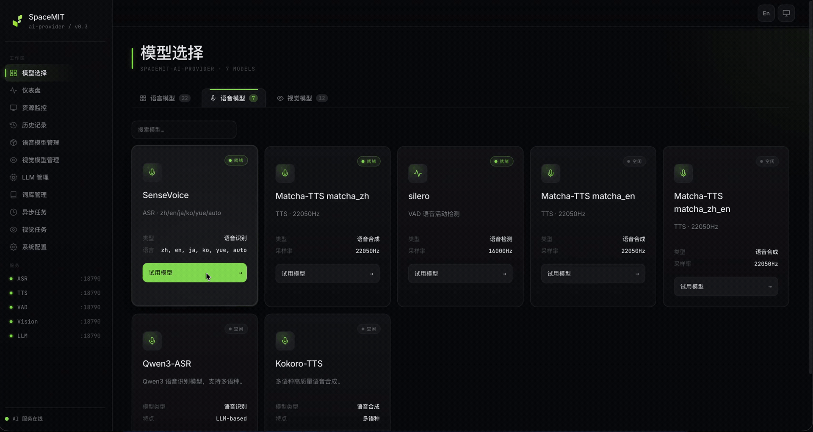

# 4.1.1 ASR

## 1. Overview

The ASR component provides a unified speech-recognition interface for converting 16 kHz audio into text. Located in `components/model_zoo/asr`, it offers a C++ API, Python bindings, and demos for both file-based and streaming recognition. It can serve as the speech-input front end for `omni_agent`. Streaming support is backend-dependent; not all models support streaming recognition.

Currently supported backends:

| Backend | Form | Typical Use |
| --- | --- | --- |
| SenseVoice | Local ONNX model; default backend | Offline Chinese and multilingual recognition; supports both file-based and streaming recognition. |
| Zipformer CTC | Local ONNX streaming model | Lightweight real-time recognition scenarios. |
| Qwen3-ASR 0.6B / 1.7B | `llama-server` service | Offline speech recognition through the chat completions API. |
| Fun-ASR Nano | `llama-server` service | Offline speech recognition through the transcription API. |
| Gemma4 ASR E2B | `llama-server` service | Transcription in the original language or translation of foreign-language speech into English. |

Qwen3-ASR, Fun-ASR Nano, and Gemma4 ASR require the complete audio input before returning a result; they do not support native stateful streaming recognition. Currently, only SenseVoice and Zipformer are integrated with this component's `Start()` / `SendAudioFrame()` / `Flush()` streaming API, and Zipformer is the only natively streaming model.

Typical data path:

```text
WAV / microphone PCM -> sample-rate and channel normalization -> ASR backend -> RecognitionResult text
```

Key directories:

| Path | Description |
| --- | --- |
| `components/model_zoo/asr/include/asr_service.h` | Public C++ API. |
| `components/model_zoo/asr/src/` | ASR engine, configuration, backend adapters, and model download logic. |
| `components/model_zoo/asr/examples/asr_file_demo.cpp` | C++ file-based recognition example. |
| `components/model_zoo/asr/examples/asr_stream_demo.cpp` | C++ microphone streaming recognition example. |
| `components/model_zoo/asr/python/` | `spacemit_asr` Python package and examples. |

### Demo Video



## 2. Environment Setup

### Prerequisites

For SDK source acquisition and base build-environment setup, see [2.3-Building and Compilation](../../02-快速入门/2.3-构建编译.md). After initializing the SDK, return to this page and continue with [Build](#build).

Unless stated otherwise, run the following commands from the `spacemit_robot` SDK root directory.

### Build

The speech components use the `target/k3-com260-omni-agent.json` target configuration. If the system is missing dependencies, install them first:

```bash
sudo apt install libsndfile1-dev libfftw3-dev libcurl4-openssl-dev
```

Load the build environment from the SDK root, then compile ASR:

```bash
source build/envsetup.sh
lunch k3-com260-omni-agent
cd components/model_zoo/asr
mm
```

The streaming examples and recording commands in this document also depend on the audio component and PortAudio. If `audio_demo` is not available in the current environment, build the audio component as well:

```bash
cd ../../multimedia/audio
mm
```

The build installs `asr_file_demo`, `asr_stream_demo`, and `audio_demo` in `output/staging/bin`. After sourcing `build/envsetup.sh`, you can run them directly.

If you need the Python examples, build all Python wheels from the SDK root:

```bash
m -py
```

Alternatively, build only the wheel for the ASR component from its directory:

```bash
cd components/model_zoo/asr
mm -py
```

Note: `m -py` / `mm -py` build wheels using the system Python environment; do not run them inside `~/.comm-env`. `~/.comm-env` is only used later for `pip install` and for running the Python examples.

Before running the Python examples, install the virtual environment dependencies and create and activate `~/.comm-env`:

```bash
sudo apt install python3-venv python-is-python3 python3-pip
python3 -m venv ~/.comm-env
source ~/.comm-env/bin/activate
```

Then install the Python package using one of two options. Option 1: install the released package directly:

```bash
python -m pip install --upgrade 'spacemit-asr>=1.0.4' \
    --index-url https://git.spacemit.com/api/v4/projects/33/packages/pypi/simple
```

Option 2: return to the SDK root and install the wheel you built locally:

```bash
python -m pip install output/wheels/components_model_zoo_asr/spacemit_asr-*.whl \
    --index-url https://git.spacemit.com/api/v4/projects/33/packages/pypi/simple
```

The Python streaming recognition example also depends on the audio component; install `spacemit-audio` as well:

```bash
python -m pip install spacemit-audio \
    --index-url https://git.spacemit.com/api/v4/projects/33/packages/pypi/simple
```

If you choose to install the local audio wheel, first build the wheel in the audio component directory, then install it from the SDK root:

```bash
cd components/multimedia/audio
mm -py
cd ../../..
python -m pip install output/wheels/components_multimedia_audio/spacemit_audio-*.whl \
    --index-url https://git.spacemit.com/api/v4/projects/33/packages/pypi/simple
```

The default SenseVoice model path is `~/.cache/models/asr/sensevoice/`, which contains `model_quant_optimized.onnx`, `tokens.txt`, and `am.mvn`. The program checks for the model on first run and prepares it through the component's download logic if it is missing. Qwen3-ASR, Fun-ASR Nano, and Gemma4 ASR require `llama.cpp-tools-spacemit` to be installed and a `llama-server` with the media backend to be started first; Gemma4 ASR requires version 0.1.7 or later.

## 3. Examples

### 3.1 Record Audio and Recognize a File

First, record a 5-second, 16 kHz stereo WAV file with the audio component. The K3 microphone is normally opened at 16 kHz with two channels; file-based recognition downmixes the audio to mono internally before passing it to the model:

```bash
audio_demo record test.wav --duration 5 --rate 16000 --channels 2 --device -1
```

Expected logs include `Recording 5s to test.wav`, `Opened: 16000Hz, 2 channels`, and `Saved ... to test.wav`.

If you prefer not to record, you can download the test audio used in this document from the public audio asset directory:

```bash
mkdir -p ~/.cache/models/assets/audio
cd ~/.cache/models/assets/audio
AUDIO_BASE=https://archive.spacemit.com/spacemit-ai/model_zoo/assets/audio
for file in \
    001_zh_daily_weather.wav \
    002_en_daily_weather.wav \
    003_zh_en_search.wav \
    004_zh_selling_sausages.wav \
    022_zh_funasr_sample.mp3 \
    023_en_funasr_sample.mp3 \
    024_ja_funasr_sample.mp3 \
    025_ko_funasr_sample.mp3 \
    026_yue_funasr_sample.mp3
do
    wget -nc "$AUDIO_BASE/$file"
done
```

Files `001` through `004` are for general transcription and performance tests, `022` through `024` for Fun-ASR multilingual transcription, and `024` through `026` for Gemma4 ASR foreign-language-to-English translation. More assets can be downloaded on demand from the [ASR test audio directory](https://archive.spacemit.com/spacemit-ai/model_zoo/assets/audio/).

Then run file-based recognition with the default SenseVoice backend. The example below uses test audio downloaded to the local cache directory:

```bash
asr_file_demo ~/.cache/models/assets/audio/001_zh_daily_weather.wav
```

The expected output prints the engine, language, provider, recognized text, and RTF, e.g. `引擎类型: sensevoice` (Engine type: sensevoice), `Provider: spacemit`, and `文本:` (Text:).

### 3.2 Python File-Based Recognition

Make sure `~/.comm-env` is activated and `spacemit-asr` is installed, then run:

```bash
cd components/model_zoo/asr/python/examples
python asr_file_demo.py ~/.cache/models/assets/audio/001_zh_daily_weather.wav
```

The expected output includes `ASR 版本` (ASR version), `Provider: spacemit`, the recognized text, audio duration, processing time, and RTF.

### 3.3 Zipformer File-Based Recognition

The Zipformer backend currently requires temporarily disabling the `Conv` operator on K3 + SpaceMIT EP to work around a compatibility issue on the SpaceMIT EP side. The environment variable can be removed once the bug is fixed.

```bash
export SPACEMIT_EP_DISABLE_OP_TYPE_FILTER="Conv"
asr_file_demo ~/.cache/models/assets/audio/001_zh_daily_weather.wav --engine zipformer
```

### 3.4 C++ Streaming Recognition

```bash
asr_stream_demo -c 2 -t 60 -f 3 -p spacemit
```

This example captures 16 kHz, two-channel audio from the default microphone, downmixes it to mono, and flushes the current buffer every 3 seconds. The final text is delivered through the callback. On startup, the example lists the input devices; logs such as `实时识别结果` (real-time recognition result), `定时 Flush` (scheduled flush), and `[回调] 最终结果` (callback: final result) then appear. If the default device is not the one you want, run `asr_stream_demo -l` first to list the devices, then append `-i <id>` as needed.

### 3.5 Python Streaming Recognition

After installing `spacemit-asr` and `spacemit-audio`, you can run:

```bash
cd components/model_zoo/asr/python/examples
python asr_stream_demo.py -c 2
```

The example uses multiprocessing to capture two-channel audio and downmix it to mono. Logs include `ASR 版本` (ASR version), `Flush 间隔` (Flush interval), `[句子 1] 定时 flush` (Sentence 1: scheduled flush), and the recognition results.

### 3.6 Qwen3-ASR 0.6B / 1.7B Service-Based Recognition

Qwen3-ASR provides an OpenAI-compatible chat completions API through `llama-server`. First install the tools package and prepare the models:

```bash
sudo apt install llama.cpp-tools-spacemit

mkdir -p ~/.cache/models/asr
cd ~/.cache/models/asr

# Download the 0.6B, 1.7B, or both models as needed
wget https://archive.spacemit.com/spacemit-ai/model_zoo/asr/qwen3-asr-0.6B-dynq-q40.tar.gz
tar -xzf qwen3-asr-0.6B-dynq-q40.tar.gz

wget https://archive.spacemit.com/spacemit-ai/model_zoo/asr/qwen3-asr-1.7B-dynq-q40.tar.gz
tar -xzf qwen3-asr-1.7B-dynq-q40.tar.gz
```

The commands below start Qwen3-ASR 1.7B by default. To use 0.6B, replace `MODEL_DIR` and `MODEL_FILE` as indicated by the comments. `-c 4096` controls KV cache memory usage; if a board with 8 GB of RAM still fails to start, use the 0.6B model, configure swap, or switch to a configuration with more memory.

```bash
# Qwen3-ASR 1.7B
MODEL_DIR=~/.cache/models/asr/qwen3-asr-1.7B-dynq-q40
MODEL_FILE=Qwen3-ASR-1.7B-text-q40.gguf

# Qwen3-ASR 0.6B
# MODEL_DIR=~/.cache/models/asr/qwen3-asr-0.6B-dynq-q40
# MODEL_FILE=Qwen3-ASR-0.6B-text-q40.gguf

SPACEMIT_EP_INTRA_THREAD_NUM=4 llama-server \
    -m "$MODEL_DIR/$MODEL_FILE" \
    --media-backend smt \
    --smt-config-dir "$MODEL_DIR" \
    --alias qwen3-asr \
    --host 127.0.0.1 --port 8063 \
    -t 8 -tb 8 -c 4096
```

Check the service health:

```bash
curl http://127.0.0.1:8063/health
```

Call it from another terminal:

```bash
asr_file_demo ~/.cache/models/assets/audio/001_zh_daily_weather.wav \
    --engine qwen3-asr \
    --endpoint http://127.0.0.1:8063/v1/chat/completions
```

### 3.7 Fun-ASR Nano Service-Based Recognition

Fun-ASR Nano uses the OpenAI-compatible transcription API of `llama-server`. First stop any other service occupying port 8063, then download the model:

```bash
mkdir -p ~/.cache/models/asr
cd ~/.cache/models/asr
wget https://archive.spacemit.com/spacemit-ai/model_zoo/asr/fun-asr-nano-2512-qq-q4km.tar.gz
tar -xzf fun-asr-nano-2512-qq-q4km.tar.gz
```

Start the service:

```bash
MODEL_DIR=~/.cache/models/asr/fun-asr-nano-2512-qq-q4km

SPACEMIT_EP_INTRA_THREAD_NUM=4 llama-server \
    -m "$MODEL_DIR/qwen3-0.6b-q4km.gguf" \
    --media-backend smt \
    --smt-config-dir "$MODEL_DIR" \
    --alias funasr \
    --host 127.0.0.1 --port 8063 \
    -t 4 -tb 4 -c 4096 \
    --warmup --jinja
```

Call it from another terminal:

```bash
asr_file_demo ~/.cache/models/assets/audio/001_zh_daily_weather.wav \
    --engine funasr \
    --endpoint http://127.0.0.1:8063/v1/audio/transcriptions \
    --model funasr
```

The Python file example uses the same endpoint and requires `spacemit-asr>=1.0.4`:

```bash
python components/model_zoo/asr/python/examples/asr_file_demo.py \
    ~/.cache/models/assets/audio/001_zh_daily_weather.wav \
    --engine funasr \
    --endpoint http://127.0.0.1:8063/v1/audio/transcriptions \
    --model funasr
```

Fun-ASR Nano currently supports only blocking recognition of a complete file or PCM segment; it does not support true streaming recognition through `Start()` / `SendAudioFrame()` / `Flush()`.

### 3.8 Gemma4 ASR Transcription and English Translation

Gemma4 ASR uses the OpenAI-compatible transcription API of `llama-server` and supports both transcription in the original language and translation of foreign-language speech into English. The client requires `spacemit-asr>=1.0.4`, and the server requires `llama.cpp-tools-spacemit>=0.1.7`.

First install the tools package from the system software source:

```bash
sudo apt install llama.cpp-tools-spacemit
```

If the version in the software source is older than 0.1.7, use the release package instead:

```bash
mkdir -p ~/.cache/releases/llama.cpp/v0.1.7
cd ~/.cache/releases/llama.cpp/v0.1.7
wget https://github.com/spacemit-com/llama.cpp/releases/download/v0.1.7/spacemit-llama.cpp.riscv64.0.1.7.tar.gz
tar -xzf spacemit-llama.cpp.riscv64.0.1.7.tar.gz
RUNTIME=$PWD/spacemit-llama.cpp.riscv64.0.1.7
export PATH="$RUNTIME/bin:$PATH"
export LD_LIBRARY_PATH="$RUNTIME/lib:/usr/lib:$LD_LIBRARY_PATH"
```

Stop any other service occupying port 8063, then download the model:

```bash
mkdir -p ~/.cache/models/asr
cd ~/.cache/models/asr
wget https://archive.spacemit.com/spacemit-ai/model_zoo/asr/gemma4-asr-E2B-q40.tar.gz
tar -xzf gemma4-asr-E2B-q40.tar.gz
```

Start the service:

```bash
MODEL_DIR=~/.cache/models/asr/gemma4-asr-E2B-q40

llama-server \
    -m "$MODEL_DIR/gemma-4-E2B-it-Q4_0-plproj-Q4_0-combined.gguf" \
    --media-backend smt \
    --smt-config-dir "$MODEL_DIR" \
    --host 127.0.0.1 --port 8063 \
    --alias gemma4-asr \
    -t 8 -tb 8 -c 4096 \
    --warmup --jinja --reasoning off \
    --no-cache-prompt
```

`--reasoning off` ensures the output token budget is fully used for the final transcription or translation. `--no-cache-prompt` prevents repeated audio benchmark runs from hitting the prompt cache.

After the service health check passes, run the following in another terminal:

```bash
curl http://127.0.0.1:8063/health

# Transcribe in the original language
asr_file_demo ~/.cache/models/assets/audio/001_zh_daily_weather.wav \
    --engine gemma4-asr --task transcribe

# Translate Japanese speech into English
asr_file_demo ~/.cache/models/assets/audio/024_ja_funasr_sample.mp3 \
    --engine gemma4-asr --task translate
```

The Python example uses the same engine and task:

```bash
python components/model_zoo/asr/python/examples/asr_file_demo.py \
    ~/.cache/models/assets/audio/024_ja_funasr_sample.mp3 \
    --engine gemma4-asr --task translate
```

The `translate` task always outputs English. Gemma4 ASR supports only blocking requests for a complete file or PCM segment; it does not support true streaming recognition through `Start()` / `SendAudioFrame()` / `Flush()`. The first audio request after the service starts also initializes the dynamic ONNX encoder session, so performance evaluations should use subsequent requests.

## 4. Application Development

This section describes how to integrate the ASR component into C++ and Python applications. `components/model_zoo/asr/include/asr_service.h` is the authoritative API reference; this section covers only common public APIs and typical calling patterns. The C++ entry point is `SpacemiT::AsrEngine`, and the Python entry point is `spacemit_asr.Engine`.

### 4.1 API Reference

The core entry point of the ASR component is `SpacemiT::AsrEngine`. Applications use this class to create the engine, configure the backend and model, and perform blocking or streaming recognition.

#### 4.1.1 Common Data Structures

| Type | Description |
| --- | --- |
| `AsrConfig` | Engine configuration. Common fields: `engine` (sensevoice / zipformer / qwen3-asr / funasr / gemma4-asr), `model_dir`, `language` (zh/en/ja/ko/yue/auto), `punctuation`, `sample_rate`, `provider` (cpu / spacemit; the general default is spacemit), `hotwords`, `hotword_boost`, `endpoint`, `model`, `timeout`, `task` (transcribe / translate; default transcribe, and translate is supported only by Gemma4 ASR). You can create a preset configuration with `Preset(name)`. |
| `Sentence` | A single-sentence result. Fields: `text`, `begin_time`, `end_time` (in milliseconds), `confidence` (0–1). |
| `RecognitionResult` | Recognition result. Provides `GetText()`, `GetSentences()`, `IsSentenceEnd()`, `GetRTF()`, `GetAudioDuration()`, `GetProcessingTime()`, `IsEmpty()`, and `GetRequestId()`. In streaming mode, use `IsSentenceEnd()` to distinguish interim results from the final end-of-sentence result. |
| `AsrEngineCallback` | Base class for streaming callbacks. Override `OnOpen()`, `OnEvent(result)`, `OnComplete()`, `OnError(result)`, and `OnClose()`. Callbacks are invoked from threads internal to the ASR engine, so protect your own state with locks. |

#### 4.1.2 Engine Initialization and Presets

| API | Description | Parameters | Return value |
| --- | --- | --- | --- |
| `AsrEngine(engine, model_dir)` | Quick construction from an engine name; an empty model path selects the default cache path. | `engine`: sensevoice / zipformer / qwen3-asr / funasr / gemma4-asr; `model_dir`: optional model directory. | Engine instance. |
| `AsrEngine(AsrConfig)` | Constructs from a full configuration, allowing you to set language, punctuation, provider, hotwords, service endpoint, and so on. | `config`: an `AsrConfig` instance. | Engine instance. |
| `AsrConfig::Preset(name)` | Static factory method returning the `AsrConfig` for the given preset, on which you can override fields. | `name`: sensevoice / zipformer / qwen3-asr / funasr / gemma4-asr. | `AsrConfig`. |
| `AsrConfig::AvailablePresets()` | Static method returning the list of currently available preset names. | None. | `std::vector<std::string>`. |
| `IsInitialized()` | Whether the engine initialized successfully. | None. | `bool`. |
| `GetEngineName()` / `GetConfig()` | Gets the current engine name / a snapshot of the configuration. | None. | `string` / `AsrConfig`. |

#### 4.1.3 Blocking Recognition

| API | Description | Parameters | Return value |
| --- | --- | --- | --- |
| `Call(file_path, phrase_id="")` | Recognizes a WAV/PCM file; decoding and resampling are handled internally. Returns `nullptr` on failure. | `file_path`: audio file path; `phrase_id`: optional request identifier. | `shared_ptr<RecognitionResult>`. |
| `Recognize(vector<int16_t>, sample_rate=16000)` | Recognizes PCM16 audio held in memory, mono; typically used for audio frames already captured upstream. | `audio`: mono PCM16; `sample_rate`: sample rate. | `shared_ptr<RecognitionResult>`. |
| `Recognize(vector<float>, sample_rate=16000)` | Recognizes float32 PCM with amplitudes in the range [-1.0, 1.0]. | Same as above. | `shared_ptr<RecognitionResult>`. |

#### 4.1.4 Streaming Recognition

| API | Description | Parameters | Return value |
| --- | --- | --- | --- |
| `SetCallback(callback)` | Registers the streaming callback object. Must be called before `Start()`. | `callback`: `shared_ptr<AsrEngineCallback>`. | None. |
| `Start(phrase_id="")` | Starts a streaming session and enters the state that accepts audio frames. | `phrase_id`: optional request identifier. | None. |
| `SendAudioFrame(data)` | Feeds one frame of PCM 16 kHz / 16-bit / mono data; can be called multiple times. | `data`: `vector<uint8_t>` whose length is aligned to `int16_t`. | None. |
| `Flush()` | Recognizes the current buffer immediately and emits the result through the callback. The session stays open and you can continue calling `SendAudioFrame()`. Commonly used for VAD-triggered end-of-sentence recognition or timer-based sentence segmentation. | None. | None. |
| `Stop()` | Ends the current streaming session; blocks until all results have been delivered through the callback. | None. | None. |

#### 4.1.5 Runtime Configuration

| API | Description | Parameters | Return value |
| --- | --- | --- | --- |
| `SetLanguage(lang)` / `SetPunctuation(enabled)` | Switches the recognition language and the punctuation toggle at runtime. | `lang`: zh/en/ja/ko/yue/auto; `enabled`: bool. | None. |
| `SetHotwords(words, boost=1.0)` | Updates the hotword list and weights; takes effect immediately. | `words`: list of terms; `boost`: weight. | None. |
| `LoadHotwordFile(path, default_boost=1.0)` | Loads hotwords from a file; each line contains `word` or `word\tboost`. | `path`: hotword file; `default_boost`: default weight. | None. |
| `GetLastRequestId()` / `GetFirstPackageDelay()` / `GetLastPackageDelay()` | Gets the most recent request identifier and the first-package/last-package delays (in milliseconds), for latency debugging. | None. | `string` / `int`. |

### 4.2 C++ Call Examples

The examples below assume the build in Section 2 is complete and that the SenseVoice model is in `~/.cache/models/asr/sensevoice/`. See Section 3.6 for starting the Qwen3-ASR `llama-server`, Section 3.7 for starting Fun-ASR Nano, and Section 3.8 for starting Gemma4 ASR and selecting its task.

After the ASR component is compiled, `asr_service.h` and `libasr_service_cpp.so` are installed into `output/staging`. The CMake pattern below links a downstream component against the ASR library:

```cmake
add_executable(my_app main.cpp)

find_library(ASR_SERVICE_LIB NAMES asr_service_cpp
    PATHS ${CMAKE_INSTALL_PREFIX}/lib NO_DEFAULT_PATH)
find_path(ASR_SERVICE_INCLUDE_DIR NAMES asr_service.h
    PATHS ${CMAKE_INSTALL_PREFIX}/include NO_DEFAULT_PATH)
if(NOT ASR_SERVICE_LIB OR NOT ASR_SERVICE_INCLUDE_DIR)
    message(FATAL_ERROR "asr_service_cpp not found. Build components/model_zoo/asr first.")
endif()

target_include_directories(my_app PRIVATE ${ASR_SERVICE_INCLUDE_DIR})
target_link_libraries(my_app PRIVATE ${ASR_SERVICE_LIB})
```

Declare the package dependency in your component's `package.xml` as `<depend>asr</depend>`. When you build with `m` or `mm`, the build system first compiles and installs the ASR component, then compiles your application component.

#### 4.2.1 Offline File Recognition

Use cases: offline batch recognition of WAV files, regression testing, and processing of prerecorded audio.

Call sequence:

1. Create a preset configuration with `AsrConfig::Preset("sensevoice")` and override `language`, `punctuation`, and `provider` as needed.
2. Construct the `AsrEngine` and check it with `IsInitialized()`.
3. Call `Call(file_path)` to obtain the `RecognitionResult`.
4. Check `IsEmpty()` before reading `GetText()` and `GetRTF()`.

```cpp
#include <iostream>
#include <memory>
#include "asr_service.h"

int main() {
    SpacemiT::AsrConfig config = SpacemiT::AsrConfig::Preset("sensevoice");
    config.language = "zh";
    config.punctuation = true;
    config.provider = "spacemit";

    auto engine = std::make_shared<SpacemiT::AsrEngine>(config);
    if (!engine->IsInitialized()) {
        std::cerr << "ASR 引擎初始化失败" << std::endl;
        return 1;
    }

    auto result = engine->Call("test.wav");
    if (result && !result->IsEmpty()) {
        std::cout << "文本: " << result->GetText() << std::endl;
        std::cout << "音频: " << result->GetAudioDuration() << " ms"
                  << "  处理: " << result->GetProcessingTime() << " ms"
                  << "  RTF: " << result->GetRTF() << std::endl;
    }
    return 0;
}
```

The full version, including command-line argument parsing, multiple warmup rounds, and summary statistics, is in `components/model_zoo/asr/examples/asr_file_demo.cpp`.

#### 4.2.2 PCM Recognition from Memory

Use cases: this is useful when the upstream stage already has PCM data in memory, such as from an audio capture callback, a network stream, or file decoding, and you want to avoid writing it to a WAV file.

Call sequence:

1. Normalize the upstream PCM to 16 kHz mono. Downmix multi-channel audio first; resample anything that is not 16 kHz (see the `Resampler` in the audio component).
2. Choose the `Recognize(vector<int16_t>)` or `Recognize(vector<float>)` overload.
3. Process the returned `RecognitionResult`.

```cpp
#include <vector>
#include <iostream>
#include "asr_service.h"

void RecognizePcm(const std::vector<int16_t>& pcm_16k_mono) {
    SpacemiT::AsrEngine engine(SpacemiT::AsrConfig::Preset("sensevoice"));

    auto result = engine.Recognize(pcm_16k_mono, 16000);
    if (result && !result->IsEmpty()) {
        std::cout << result->GetText() << std::endl;
    }
}
```

The float32 overload is used the same way; amplitudes must be normalized to `[-1.0, 1.0]`:

```cpp
std::vector<float> pcm_float(pcm_16k_mono.size());
for (size_t i = 0; i < pcm_16k_mono.size(); ++i) {
    pcm_float[i] = pcm_16k_mono[i] / 32768.0f;
}
auto result = engine.Recognize(pcm_float, 16000);
```

#### 4.2.3 Streaming Recognition from a Microphone with Callbacks

Use cases: real-time recognition, subtitles generated during recording, and VAD-based end-of-sentence segmentation. This is the same voice-input path used by `omni_agent`.

Call sequence:

1. Implement an `AsrEngineCallback` subclass and override `OnEvent` to handle interim and final results.
2. Build the engine, call `SetCallback()`, then `Start()` to enter the streaming state.
3. Feed the PCM bytes from the microphone capture callback into the engine with `SendAudioFrame()`.
4. Trigger `Flush()` on a timer or on a VAD event to segment the sentence; the corresponding `OnEvent(result)` with `IsSentenceEnd()==true` is the final result.
5. Before exiting, call `Stop()` and wait for all callbacks to complete.

```cpp
#include <chrono>
#include <iostream>
#include <memory>
#include <thread>
#include <vector>

#include "asr_service.h"
#include "audio_base.hpp"

class StreamCallback : public SpacemiT::AsrEngineCallback {
 public:
    void OnEvent(std::shared_ptr<SpacemiT::RecognitionResult> result) override {
        if (!result) return;
        const std::string text = result->GetText();
        if (text.empty()) return;
        if (result->IsSentenceEnd()) {
            std::cout << "[最终] " << text
                      << "  RTF=" << result->GetRTF() << std::endl;
        } else {
            std::cout << "[中间] " << text << std::endl;
        }
    }
    void OnError(std::shared_ptr<SpacemiT::RecognitionResult> result) override {
        std::cerr << "[ASR] 错误: "
                  << (result ? result->GetText() : "unknown") << std::endl;
    }
};

int main() {
    SpacemiT::AsrConfig config = SpacemiT::AsrConfig::Preset("sensevoice");
    config.language = "zh";

    auto engine = std::make_shared<SpacemiT::AsrEngine>(config);
    auto callback = std::make_shared<StreamCallback>();
    engine->SetCallback(callback);
    engine->Start();

    SpacemitAudio::AudioCapture capture(-1);
    capture.SetCallback([&](const uint8_t* data, size_t size) {
        engine->SendAudioFrame(std::vector<uint8_t>(data, data + size));
    });
    capture.Start(16000, 1, 4096);

    auto last_flush = std::chrono::steady_clock::now();
    for (int s = 0; s < 30; ++s) {
        std::this_thread::sleep_for(std::chrono::seconds(1));
        if (std::chrono::steady_clock::now() - last_flush
                >= std::chrono::seconds(3)) {
            engine->Flush();
            last_flush = std::chrono::steady_clock::now();
        }
    }

    engine->Stop();
    capture.Stop();
    return 0;
}
```

If the K3 microphone only supports two-channel capture, downmix to mono before feeding the audio to ASR; the full version with resampling and downmixing is in `components/model_zoo/asr/examples/asr_stream_demo.cpp`.

#### 4.2.4 Hotword Loading

Use cases: recognizing proper nouns, product names, robot commands, and other domain terms; provides decoding bias for terms not fully covered by the general model.

Call sequence:

1. Configure one-time hotwords at construction time with `AsrConfig::hotwords`, or switch them at runtime with `SetHotwords()`.
2. For file-based scenarios use `LoadHotwordFile(path, default_boost)`; each file line is `word` or `word\tboost`.
3. A larger `boost` produces stronger bias; the common range is 1.5–3.0. Values that are too large can introduce misrecognitions.

```cpp
SpacemiT::AsrConfig config = SpacemiT::AsrConfig::Preset("sensevoice");
config.hotwords = {"SpacemiT", "进迭时空", "RISC-V"};
config.hotword_boost = 2.0f;

SpacemiT::AsrEngine engine(config);

// Switch to another group of hotwords at runtime
engine.SetHotwords({"K3", "X100", "A100"}, 3.0f);

// Or load from a file
engine.LoadHotwordFile("hotwords.txt", 2.0f);

auto result = engine.Call("test.wav");
```

### 4.3 Python Examples

The Python package is `spacemit_asr`; see Section 2 for the wheel installation steps. After installing, import it directly:

```python
import spacemit_asr
```

#### 4.3.1 File-Based Recognition

```python
import spacemit_asr

config = spacemit_asr.Config("~/.cache/models/asr/sensevoice")
config.language = spacemit_asr.Language.ZH
config.punctuation_enabled = True
config.provider = "spacemit"

with spacemit_asr.Engine(config) as engine:
    result = engine.recognize_file("test.wav")
    print(result.text)
    print(f"音频 {result.audio_duration_ms} ms, "
          f"处理 {result.processing_time_ms} ms, "
          f"RTF {result.rtf:.3f}")
```

The `with` context manager automatically calls `engine.initialize()` and `engine.shutdown()`. If you do not use `with`, you must call `engine.initialize()` explicitly.

You can also use the module-level convenience function for one-shot recognition:

```python
text = spacemit_asr.recognize_file("test.wav")
```

#### 4.3.2 Microphone Streaming Recognition

`MicrophoneStream` internally wraps audio capture, resampling, and chunked recognition, so the caller only needs to iterate over the results:

```python
import spacemit_asr

with spacemit_asr.MicrophoneStream(
        language=spacemit_asr.Language.ZH,
        chunk_duration=5.0) as stream:
    print("Listening... (Ctrl+C 停止)")
    for result in stream.recognize():
        print(f"[识别] {result.text}")
```

For a lower-level usage aligned with the C++ streaming API (custom callback + manual `send_audio_frame` + `flush`), see the `StreamingCallback` class and the `engine.start(callback=...)` pattern in `components/model_zoo/asr/python/examples/asr_stream_demo.py`.

#### 4.3.3 C++ ↔ Python API Mapping

| C++ (`SpacemiT::`) | Python (`spacemit_asr.`) | Notes |
| --- | --- | --- |
| `AsrConfig` | `Config(model_dir)` | The Python `Config` constructor only takes `model_dir`; set the other fields through attribute setters (`language`, `punctuation_enabled`, `provider`, `sample_rate`) or chained `with_language()` / `with_punctuation()`. |
| `AsrEngine(config)` + `IsInitialized()` | `Engine(config)` + `engine.initialize()` or `with Engine(config) as engine` | Python must call `initialize()` explicitly or use `with`; construction alone does not initialize automatically. |
| `Call(file)` | `Engine.recognize_file(path)` or `spacemit_asr.recognize_file(path)` | The latter is a module-level convenience function. |
| `Recognize(pcm_16k_mono)` | `Engine.recognize(numpy_array)` | Python accepts an `np.ndarray` (float32 / int16 / float64); multi-dimensional arrays are flattened automatically. |
| `SetCallback` / `Start` / `SendAudioFrame` / `Flush` / `Stop` | `engine.start(callback=AsrCallback())` / `engine.send_audio_frame(bytes)` / `engine.flush()` / `engine.stop()` | The streaming APIs map 1:1; the high-level wrapper is `MicrophoneStream`. |
| `AsrEngineCallback` | `AsrCallback` / `PrintCallback` / `CollectCallback` | The latter two are built-in convenience implementations. |
| `SetHotwords(words, boost)` | `engine.update_hotwords(words, boost=1.0)` | Naming differs; the Python signature keeps `boost`, but the current implementation does not pass it through to the backend (`engine.py: self._engine.update_hotwords(hotwords)`). If you need to adjust the weight, use the C++ API or set the `hotword_boost` field in `Config`. |
| None | `spacemit_asr.list_devices()` | Python-side convenience function, equivalent to calling `spacemit_audio.AudioCapture.list_devices()`. |

More Python examples (including full multiprocessing streaming and device enumeration) are in `components/model_zoo/asr/python/examples/`.

## 5. Troubleshooting

When debugging ASR, first fix the input audio, then check the model, backend, and capture device state separately:

- Play back the input WAV with `audio_demo play` to confirm the audio is not silent and that the sample rate and channel count match expectations.
- List input devices with `asr_stream_demo -l` to confirm the microphone device index, then specify it with `-i <id>`.
- For Qwen3-ASR, Fun-ASR Nano, and Gemma4 ASR scenarios, check the `llama-server` status with `curl http://127.0.0.1:8063/health`.
- Base performance evaluation on the second and subsequent results after warmup, so model loading time is not counted in the steady-state inference latency.

## 6. FAQ

| Symptom | Possible Cause | Resolution |
| --- | --- | --- |
| First recognition is very slow | Model loading and warmup are counted in the first run | Evaluate performance using the second and subsequent results. |
| Recognition text is empty or very short | Input audio is too short, silent, or the sample rate does not match | Play back with `audio_demo play` to confirm the WAV contains 16 kHz audible content. |
| Streaming capture reports a device error | The default input device does not match expectations | Run `asr_stream_demo -l` first, then specify the device with `-i <id>`. |
| Zipformer reports SpaceMIT EP/Conv-related errors | The `Conv` operator has a temporary compatibility issue on the current K3 + SpaceMIT EP | Set `SPACEMIT_EP_DISABLE_OP_TYPE_FILTER="Conv"` before running. |
| Qwen3-ASR call fails | `llama-server` is not running or the endpoint is incorrect | Confirm the service status with `curl http://127.0.0.1:8063/health`. |
| Qwen3-ASR fails to start or is killed | 8 GB boards may run out of memory | Check system memory; if it must run on an 8 GB board, configure swap before starting `llama-server`. |
| Fun-ASR call fails | `llama-server` is not running, the model alias does not match, or the endpoint is wrong | Confirm the service was started with `--alias funasr`, and check that the endpoint ends with `/v1/audio/transcriptions`. |
| Gemma4 ASR returns empty text or abnormal latency | `llama-server` version is below 0.1.7, or reasoning was not disabled at startup | Use `llama.cpp-tools-spacemit>=0.1.7` and add `--reasoning off`. |

## Appendix: K3 Measured Data

The data below was measured on the K3 platform. It is a snapshot in time and is being continuously optimized.

### SenseVoice (INT8, SpaceMIT EP, 2 threads)

| Test file | Audio duration | Processing time | RTF |
| --- | --- | --- | --- |
| 004_zh_selling_sausages.wav | 14158 ms | 5090 ms | 0.360 |
| 001_zh_daily_weather.wav | 1619 ms | 212 ms | 0.131 |
| 002_en_daily_weather.wav | 1802 ms | 232 ms | 0.129 |
| 003_zh_en_search.wav | 2324 ms | 299 ms | 0.129 |
| **Total** | **19903 ms** | **5833 ms** | **0.293** |

### Qwen3-ASR (Q4_0, llama-server)

`001_zh_daily_weather.wav` and `004_zh_selling_sausages.wav` were recognized continuously for 3 rounds. The total audio duration was 47.331 seconds.

| Model | LLM threads | AudioEncoder threads | Total processing time | RTF |
| --- | --- | --- | --- | --- |
| Qwen3-ASR 0.6B | 4 | 4 | 10.257 s | 0.217 |
| Qwen3-ASR 0.6B | 8 | 4 | 7.977 s | 0.169 |
| Qwen3-ASR 1.7B | 4 | 4 | 19.883 s | 0.420 |
| Qwen3-ASR 1.7B | 8 | 4 | 15.572 s | 0.329 |

### Fun-ASR Nano (Q4_K_M, llama-server)

Test environment: `llama.cpp-tools-spacemit 0.1.6`, `spacemit-onnxruntime 2.0.5`, 4 LLM threads, and 4 AudioEncoder threads. The service was started with `-t 4 -tb 4 -c 4096 --warmup --jinja` without CPU pinning.

| Test file | Language | Audio duration | Round 1 processing time / RTF | Round 2 processing time / RTF |
| --- | --- | --- | --- | --- |
| 004_zh_selling_sausages.wav | Chinese | 14.158 s | 3.804 s / 0.269 | 3.793 s / 0.268 |
| Official en.mp3 | English | 7.176 s | 1.555 s / 0.217 | 1.561 s / 0.217 |
| Official ja.mp3 | Japanese | 7.224 s | 1.706 s / 0.236 | 1.709 s / 0.236 |
| **Total per round** | - | **28.558 s** | **7.065 s / 0.247** | **7.063 s / 0.247** |

The RTF above includes file reading, audio conversion, HTTP transfer, and model inference; it is not the standalone kernel time of the model. Qwen3-ASR and Fun-ASR used different test sets, so recognition quality must not be compared by RTF alone.

### Gemma4 ASR (Q4_0, llama-server 0.1.7)

The service was started with `-t 8 -tb 8 -c 4096 --warmup --jinja --reasoning off` and `--no-cache-prompt`. The data below was measured end-to-end on the K3 with a clean build of `asr_file_demo`.

| Task | Test file | Audio duration | Processing time | RTF | Result |
| --- | --- | --- | --- | --- | --- |
| Chinese transcription | 001_zh_daily_weather.wav (steady state) | 1619 ms | 1316-1367 ms | 0.812-0.844 | 今天天气怎么样? |
| Chinese transcription | 004_zh_selling_sausages.wav | 14158 ms | 9758 ms | 0.689 | Completed |
| Japanese to English | 024_ja_funasr_sample.mp3 | 7224 ms | 4425-4497 ms | 0.613-0.623 | Both rounds identical |
| Korean to English | 025_ko_funasr_sample.mp3 | 4644 ms | 2520-2538 ms | 0.543-0.547 | Both rounds identical |
| Cantonese to English | 026_yue_funasr_sample.mp3 | 5184 ms | 2854-2869 ms | 0.551-0.553 | Both rounds identical |

RTF includes SDK file reading, audio conversion, HTTP multipart transfer, and `llama-server` inference time. The first audio request after the service starts also initializes the dynamic ONNX encoder session; the first Japanese request in this run took 12567 ms (RTF 1.740) and is not included in the steady-state data above.

The Japanese, Korean, and Cantonese samples were tested for 2 consecutive rounds on the same warmed-up service, with a total audio duration of 34.104 seconds and a total processing time of 19.703 seconds, giving an end-to-end RTF of 0.578. This result validates the interface, output stability, and performance; it does not replace a translation quality evaluation with reference translations.

### Zipformer CTC (CPU, 4 threads)

| Test file | Audio duration | Processing time | RTF |
| --- | --- | --- | --- |
| ref.wav (14s Chinese) | 14158 ms | 6622 ms | 0.468 |

**Test method**: Built on the K3 board using `target/k3-com260-omni-agent.json`, ran `asr_file_demo`, and took the processing time and RTF printed in the log. Qwen3-ASR requires starting `llama-server` as in Section 3.6, Fun-ASR Nano as in Section 3.7, and Gemma4 ASR as in Section 3.8, selecting transcription or translation with `--task`.
