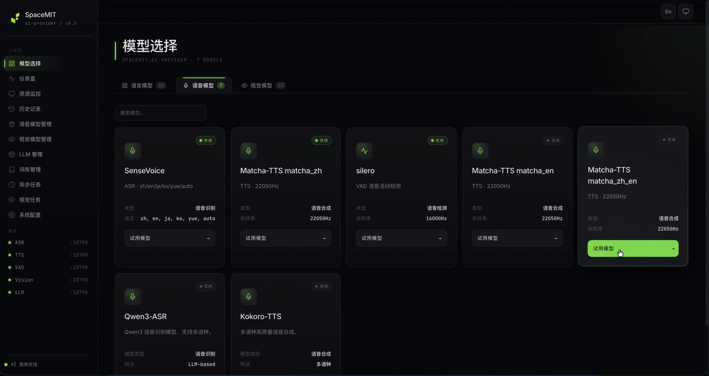

# 4.1.2 TTS

## 1. Overview

The TTS component provides a unified local text-to-speech interface that converts text into WAV or PCM audio. Located in `components/model_zoo/tts`, it provides a C++ API, Python bindings, file and streaming synthesis demos, and can serve as the voice-response output for `omni_agent`.

Supported backends:

| Backend | Language | Sample rate | Description |
| --- | --- | --- | --- |
| `matcha:zh` | Chinese | 22050 Hz | Matcha-TTS Chinese model. |
| `matcha:en` | English | 22050 Hz | Matcha-TTS English model. Requires `espeak-ng` for English phoneme processing. |
| `matcha:zh-en` | Chinese and English | 16000 Hz | Matcha-TTS bilingual model for robot conversations. |
| `kokoro` / `kokoro:<voice>` | Chinese and English | 24000 Hz | Kokoro multi-voice model. |

Typical data flow:

```text
Input text -> tokenization and phoneme processing -> TTS backend -> WAV/PCM -> AudioPlayer playback
```

Key directories:

| Path | Description |
| --- | --- |
| `components/model_zoo/tts/include/tts_service.h` | Public C++ API. |
| `components/model_zoo/tts/src/backends/matcha/` | Matcha-TTS backend. |
| `components/model_zoo/tts/src/backends/kokoro/` | Kokoro backend and voice management. |
| `components/model_zoo/tts/examples/tts_file_demo.cpp` | C++ file-synthesis example. |
| `components/model_zoo/tts/examples/tts_stream_demo.cpp` | C++ streaming synthesis and playback example. |
| `components/model_zoo/tts/python/` | The `spacemit_tts` Python package and examples. |

### Demo Video



## 2. Environment Setup

### Prerequisites

For SDK source acquisition and base build-environment setup, see [2.3-Building and Compilation](../../02-快速入门/2.3-构建编译.md). After initializing the SDK, return to this page and continue with [Build](#build).

Unless stated otherwise, run the following commands from the `spacemit_robot` SDK root directory.

### Build

The speech components use the `target/k3-com260-omni-agent.json` target configuration. Install the following dependencies if needed:

```bash
sudo apt install libsndfile1-dev libfftw3-dev espeak-ng
```

Load the SDK environment and build TTS:

```bash
source build/envsetup.sh
lunch k3-com260-omni-agent
cd components/model_zoo/tts
mm
```

Streaming playback and the playback commands in this document also require the audio component and PortAudio. If `audio_demo` is unavailable in the current environment, build the audio component:

```bash
cd ../../multimedia/audio
mm
```

The build installs `tts_file_demo`, `tts_stream_demo`, and `audio_demo` in `output/staging/bin`. To use the Python examples, run the following command from the SDK root:

```bash
m -py
```

Note: `m -py` and `mm -py` build wheels and must be run in the system Python environment. Use `~/.comm-env` only for the subsequent `pip install` steps and for running Python examples.

Before running Python examples, install the virtual-environment dependencies, then create and activate `~/.comm-env`:

```bash
sudo apt install python3-venv python-is-python3 python3-pip
python3 -m venv ~/.comm-env
source ~/.comm-env/bin/activate
```

Install the Python package using one of the following methods. To install the released package directly:

```bash
python -m pip install spacemit-tts \
    --index-url https://git.spacemit.com/api/v4/projects/33/packages/pypi/simple
```

Alternatively, return to the SDK root and install the locally built wheel:

```bash
python -m pip install output/wheels/components_model_zoo_tts/spacemit_tts-*.whl \
    --index-url https://git.spacemit.com/api/v4/projects/33/packages/pypi/simple
```

After installation, you can import `spacemit_tts`.

Models are stored under `~/.cache/models/tts/` by default. On first run, the component checks for the model required by the selected backend. Matcha Chinese also uses the `cppjieba` dictionary, while `matcha:zh-en` and Kokoro use the `cpp-pinyin` dictionary. Related third-party resources are typically cached under `~/.cache/thirdparty/`.

## 3. Examples

### 3.1 File Synthesis

```bash
tts_file_demo -p "今天学Python" -l matcha:zh-en
```

The demo reports the engine name, sample rate, audio duration, processing time, and RTF, then saves the result as `output.wav`. Use the audio component to play the file:

```bash
audio_demo play ./output.wav -c 2 -d 1
```

Common backend examples:

```bash
tts_file_demo -p "你好世界" -l matcha:zh
tts_file_demo -p "Hello" -l matcha:en
tts_file_demo -p "今天学Python" -l matcha:zh-en
tts_file_demo -p "你好" -l kokoro
tts_file_demo -p "你好" -l kokoro:yunxi
```

### 3.2 Custom Pronunciation Lexicon

`tts_file_demo` supports `--lexicon` for correcting Chinese polyphonic characters or specifying pronunciations for English keywords. Chinese phonemes use Pinyin with tone numbers. For English keywords with `matcha:zh-en`, set `locale=en` to have `espeak-ng` generate IPA.

```bash
tts_file_demo -p "你好,我是 SpaceMIT 的语音合成模型,很高兴为你服务" \
    -l matcha:zh-en \
    --lexicon "为你:wei4 ni3:zh,SpaceMIT:space meet:en"
```

### 3.3 C++ Streaming Synthesis

```bash
tts_stream_demo -p "你好" -e matcha:zh-en
```

This example splits input text into sentences, simulates LLM output, and synthesizes and plays audio concurrently. Its logs include `开始流式合成` (Starting streaming synthesis), `[合成] 第 1 句完成` (Synthesis: sentence 1 complete), `[播放] 重采样` (Playback: resampling), and `播放完成` (Playback complete).

### 3.4 Python Multi-Engine Demo

```bash
cd components/model_zoo/tts/python/examples
python tts_file_demo.py
```

The example creates Matcha Chinese, English, bilingual, and Kokoro engines in sequence and produces multiple WAV files. To run the streaming Python example:

```bash
python tts_stream_demo.py -p "你好"
```

## 4. Application Development

This section describes how to integrate the TTS component into C++ and Python applications. `components/model_zoo/tts/include/tts_service.h` is the authoritative API reference; this section covers only common public APIs and typical calling patterns. The C++ entry point is `SpacemiT::TtsEngine`, and the Python entry point is `spacemit_tts.Engine`.

### 4.1 API Reference

The main TTS entry point is `SpacemiT::TtsEngine`. Use this class to create a synthesis engine, select a backend, and start blocking, streaming, or duplex-stream synthesis requests.

#### 4.1.1 Common Data Structures

| Type | Description |
| --- | --- |
| `TtsConfig` | Engine configuration. Common fields include `backend`, `model_dir`, `voice` (Kokoro voice name), `speaker_id` (for multi-speaker models), `sample_rate`, `speech_rate`, `pitch`, `volume` ([0, 100]), `lexicon`, and `num_threads`. Use `Preset(name)` to create a preset configuration. Chainable methods include `withSpeed`, `withSpeaker`, and `withVolume`. |
| `BackendType` | Backend enumeration. `MATCHA_ZH` / `MATCHA_EN` (22050 Hz), `MATCHA_ZH_EN` (16000 Hz, bilingual), `KOKORO` (24000 Hz, multi-voice), and reserved values `COSYVOICE` / `VITS` / `PIPER` / `CUSTOM`. **Backends use different default sample rates. Resample audio before playback when necessary.** |
| `AudioFormat` | Output audio format: `PCM` or `WAV`. `MP3` and `OGG` are reserved. |
| `PronunciationEntry` | Custom-pronunciation entry. Fields are `word` (the word to correct), `phoneme` (Pinyin or phonemes), and `locale` (defaults to `zh`; optional `en` is valid only for matcha:zh-en). |
| `TtsEngineResult` | Synthesis result. Provides `GetAudioData()` (bytes), `GetAudioFloat()`, `GetAudioInt16()`, `GetSampleRate()`, `GetDurationMs()`, `GetProcessingTimeMs()`, `GetRTF()`, `IsSuccess()`, `GetMessage()`, `IsEmpty()`, `IsSentenceEnd()`, and `SaveToFile(path)`. |
| `TtsResultCallback` | Streaming callback base class. Override `OnOpen()`, `OnEvent(result)`, `OnComplete()`, `OnError(message)`, and `OnClose()`. The TTS engine invokes callbacks from an internal thread; synchronize access to your own state. |
| `TtsEngine::DuplexStream` | Duplex stream handle. Use `SendText(text)` to submit text fragments continuously, `Complete()` to indicate that the text stream has ended, and `IsActive()` to query its status. Typically used to connect streaming LLM output to TTS. |

#### 4.1.2 Engine Initialization and Presets

| API | Description | Parameters | Return value |
| --- | --- | --- | --- |
| `TtsEngine(backend, model_dir)` | Constructs an engine from a backend enumeration. Uses the default cache path when no model path is specified. | `backend`: `BackendType`; `model_dir`: optional model directory. | Engine instance. |
| `TtsEngine(TtsConfig)` | Constructs an engine with a complete configuration, including speech rate, voice, sample rate, and pronunciation lexicon. | `config`: `TtsConfig` instance. | Engine instance. |
| `TtsConfig::Preset(name)` | Static factory that returns a `TtsConfig` for the specified preset. You can override its fields afterward. | `name`: matcha_zh, matcha_en, matcha_zh_en, kokoro, and others. | `TtsConfig`. |
| `TtsConfig::AvailablePresets()` | Static method that returns the names of currently available presets. | None. | `std::vector<std::string>`. |
| `IsInitialized()` / `GetEngineName()` / `GetBackendType()` / `GetSampleRate()` / `GetNumSpeakers()` / `GetConfig()` | Query engine state and configuration. | None. | Varies by method. |

#### 4.1.3 Blocking Synthesis

| API | Description | Parameters | Return value |
| --- | --- | --- | --- |
| `Call(text, config=TtsConfig())` | Synthesizes the complete text in one operation and returns a result object containing all audio. | `text`: text to synthesize; `config`: optional configuration override. | `shared_ptr<TtsEngineResult>`; returns `nullptr` on failure, or `IsSuccess()==false`. |
| `CallToFile(text, file_path)` | Synthesizes text and writes a WAV file directly, without manually calling `SaveToFile()`. | `text`: text to synthesize; `file_path`: output WAV path. | `bool`. |

#### 4.1.4 Streaming Synthesis

| API | Description | Parameters | Return value |
| --- | --- | --- | --- |
| `StreamingCall(text, callback, config=TtsConfig())` | Accepts complete text and synthesizes it sentence by sentence. Each sentence is returned as a chunk through the `OnEvent` callback. Use `IsSentenceEnd()` to distinguish intermediate chunks from final chunks. | `text`: complete text; `callback`: `shared_ptr<TtsResultCallback>`; `config`: optional configuration override. | No direct return value; output is delivered through the callback. |
| `StartDuplexStream(callback, config=TtsConfig())` | Starts a duplex streaming session and returns a `DuplexStream` handle. Suitable for upstream sources that continuously produce text, such as streaming LLM output. | `callback`: `shared_ptr<TtsResultCallback>`; `config`: optional configuration override. | `shared_ptr<DuplexStream>`. |
| `DuplexStream::SendText(text)` | Submits a text fragment to the stream. The engine segments and synthesizes it internally. Can be called multiple times. | `text`: text fragment. | None. |
| `DuplexStream::Complete()` | Marks the end of the text stream. The engine invokes `OnComplete` after synthesizing the remaining text. | None. | None. |

#### 4.1.5 Runtime Configuration

| API | Description | Parameters | Return value |
| --- | --- | --- | --- |
| `SetSpeed(speed)` / `SetSpeaker(speaker_id)` / `SetVolume(volume)` | Changes the speech rate, speaker, or volume at runtime. Changes take effect with the next `Call()`. | `speed`: >1 speeds up, <1 slows down; `speaker_id`: multi-speaker model index; `volume`: [0, 100]. | None. |
| `UpdateLexicon(entries)` | Updates the custom pronunciation lexicon. Takes effect immediately and applies to subsequent synthesis. | `entries`: `vector<PronunciationEntry>`. | None. |
| `GetLastRequestId()` | Returns the identifier of the most recent synthesis request for log correlation. | None. | `string`. |

### 4.2 C++ Examples

The following examples assume that you completed the build steps in Section 2. Models are stored in backend-specific subdirectories of `~/.cache/models/tts/`, including `matcha-tts` and `kokoro`.

After building the TTS component, `tts_service.h` and `libtts_service_cpp.so` are installed in `output/staging`. Use the following CMake configuration to link the TTS library from a downstream component:

```cmake
add_executable(my_app main.cpp)

find_library(TTS_SERVICE_LIB NAMES tts_service_cpp
    PATHS ${CMAKE_INSTALL_PREFIX}/lib NO_DEFAULT_PATH)
find_path(TTS_SERVICE_INCLUDE_DIR NAMES tts_service.h
    PATHS ${CMAKE_INSTALL_PREFIX}/include NO_DEFAULT_PATH)
if(NOT TTS_SERVICE_LIB OR NOT TTS_SERVICE_INCLUDE_DIR)
    message(FATAL_ERROR "tts_service_cpp not found. Build components/model_zoo/tts first.")
endif()

target_include_directories(my_app PRIVATE ${TTS_SERVICE_INCLUDE_DIR})
target_link_libraries(my_app PRIVATE ${TTS_SERVICE_LIB})
```

Declare `<depend>tts</depend>` in the current component's `package.xml`.

#### 4.2.1 One-Shot Synthesis to a WAV File

Use this approach for batch offline synthesis, generating fixed prompts, or scripted tests.

Steps:

1. Create a preset configuration with `TtsConfig::Preset("matcha_zh")`, then override `speech_rate`, `volume`, or `sample_rate` as needed.
2. Construct `TtsEngine` and check `IsInitialized()`.
3. Call `CallToFile(text, path)` to write the file directly, or call `Call(text)` and then `SaveToFile()` on the result.

```cpp
#include <iostream>
#include "tts_service.h"

int main() {
    SpacemiT::TtsConfig config = SpacemiT::TtsConfig::Preset("matcha_zh");
    config.speech_rate = 1.0f;

    SpacemiT::TtsEngine engine(config);
    if (!engine.IsInitialized()) {
        std::cerr << "TTS 引擎初始化失败" << std::endl;
        return 1;
    }

    if (!engine.CallToFile("你好，欢迎使用语音合成。", "hello.wav")) {
        std::cerr << "合成失败" << std::endl;
        return 1;
    }
    std::cout << "已生成 hello.wav，采样率 "
              << engine.GetSampleRate() << " Hz" << std::endl;
    return 0;
}
```

For a complete example with command-line argument parsing and interactive mode, see `components/model_zoo/tts/examples/tts_file_demo.cpp`.

#### 4.2.2 In-Memory PCM Synthesis and Direct Playback

Use this approach to play synthesized audio directly through `SpacemitAudio::AudioPlayer` without writing a file, or to pass it to an application audio pipeline, such as a queue or network sender.

Steps:

1. Construct an engine and call `Call(text)` to obtain a `TtsEngineResult`.
2. Use `GetAudioInt16()` to obtain PCM16 samples and `GetSampleRate()` to obtain the sample rate.
3. Start `AudioPlayer` with that sample rate and write the samples as bytes.

```cpp
#include <vector>
#include "tts_service.h"
#include "audio_base.hpp"

void SpeakOnce(const std::string& text) {
    SpacemiT::TtsEngine engine(SpacemiT::TtsConfig::Preset("matcha_zh"));
    auto result = engine.Call(text);
    if (!result || !result->IsSuccess()) return;

    std::vector<int16_t> pcm = result->GetAudioInt16();
    int sample_rate = result->GetSampleRate();

    SpacemitAudio::AudioPlayer player(-1);
    player.Start(sample_rate, 1);
    const auto* bytes = reinterpret_cast<const uint8_t*>(pcm.data());
    player.Write(bytes, pcm.size() * sizeof(int16_t));
    player.Stop();
    player.Close();
}
```

If the playback device supports only 48 kHz, which is the K3 default, use `Resampler` to convert 22050, 16000, or 24000 Hz to 48000 Hz first. For details, see `6.3.3-audio` Section 4.2.5.

#### 4.2.3 Streaming Synthesis and Playback

Use this approach for long text or low-latency responses that require synthesis and playback to run concurrently, rather than waiting for synthesis to complete. Barge-in also relies on the streaming API.

Steps:

1. Implement a `TtsResultCallback` subclass. Override `OnEvent` to push chunks into a playback queue, and use `OnComplete` to notify the main thread that synthesis has finished.
2. Construct an engine and call `StreamingCall(text, callback)`. This starts synthesis in the background.
3. On the main thread, dequeue PCM samples and write them to `AudioPlayer` to play audio as it is synthesized.

```cpp
#include <atomic>
#include <iostream>
#include <memory>
#include <mutex>
#include <queue>

#include "tts_service.h"
#include "audio_base.hpp"

class PlaybackCallback : public SpacemiT::TtsResultCallback {
 public:
    void OnEvent(std::shared_ptr<SpacemiT::TtsEngineResult> result) override {
        if (!result || !result->IsSuccess()) return;
        std::lock_guard<std::mutex> lk(mu_);
        chunks_.push(result->GetAudioInt16());
        sample_rate_ = result->GetSampleRate();
    }
    void OnComplete() override { done_ = true; }
    void OnError(const std::string& msg) override {
        std::cerr << "[TTS] " << msg << std::endl;
        done_ = true;
    }

    std::mutex mu_;
    std::queue<std::vector<int16_t>> chunks_;
    std::atomic<bool> done_{false};
    int sample_rate_ = 0;
};

int main() {
    SpacemiT::TtsEngine engine(SpacemiT::TtsConfig::Preset("matcha_zh"));
    auto cb = std::make_shared<PlaybackCallback>();

    engine.StreamingCall("你好世界。今天天气很好。", cb);

    SpacemitAudio::AudioPlayer player(-1);
    bool started = false;
    while (!cb->done_ || !cb->chunks_.empty()) {
        std::vector<int16_t> pcm;
        {
            std::lock_guard<std::mutex> lk(cb->mu_);
            if (!cb->chunks_.empty()) { pcm = std::move(cb->chunks_.front()); cb->chunks_.pop(); }
        }
        if (pcm.empty()) continue;
        if (!started) { player.Start(cb->sample_rate_, 1); started = true; }
        player.Write(reinterpret_cast<const uint8_t*>(pcm.data()),
                     pcm.size() * sizeof(int16_t));
    }
    player.Stop();
    player.Close();
    return 0;
}
```

For a complete example with progress reporting and adaptive sample-rate handling, see `components/model_zoo/tts/examples/tts_stream_demo.cpp`.

#### 4.2.4 Duplex Streaming: Synthesize as Text Arrives

Use this approach when an upstream component continuously produces text, such as an LLM streaming response, and synthesis must begin as soon as text arrives to minimize end-to-end latency.

Steps:

1. Implement `TtsResultCallback` to process chunks; see Section 4.2.3.
2. Call `StartDuplexStream(callback)` to obtain a `DuplexStream`.
3. Call `stream->SendText(piece)` for each text fragment received from upstream. When the upstream source ends, call `stream->Complete()` and wait for `OnComplete`.

```cpp
auto engine = std::make_shared<SpacemiT::TtsEngine>(
    SpacemiT::TtsConfig::Preset("matcha_zh_en"));
auto cb = std::make_shared<PlaybackCallback>();

auto stream = engine->StartDuplexStream(cb);
stream->SendText("你好");
stream->SendText("世界，");
stream->SendText("现在开始流式合成。");
stream->Complete();   // Indicates that the text stream has ended.
// The main thread continues to play data from cb->chunks_, as in Section 4.2.3.
```

#### 4.2.5 Custom Pronunciation Lexicon

Use this approach to correct Chinese polyphonic characters, such as pronouncing "为你" as `wei4 ni3` rather than `wei2 ni3`, define product-name pronunciations, or specify the English pronunciation of English words in mixed-language text with `matcha:zh-en`.

Steps:

1. Prepare a `vector<PronunciationEntry>`. Each entry contains `word`, `phoneme`, and `locale`, which defaults to `zh`.
2. Call `engine.UpdateLexicon(entries)` during construction or at runtime.
3. Subsequent `Call()` and `StreamingCall()` requests use the updated lexicon.

```cpp
SpacemiT::TtsEngine engine(SpacemiT::TtsConfig::Preset("matcha_zh_en"));

std::vector<SpacemiT::PronunciationEntry> entries = {
    {"为你", "wei4 ni3", "zh"},
    {"SpaceMIT", "space meet", "en"},
};
engine.UpdateLexicon(entries);

engine.CallToFile("你好，我是 SpaceMIT 的语音合成模型，很高兴为你服务。",
                  "lexicon_demo.wav");
```

With `locale="zh"`, `phoneme` is Pinyin with tone numbers, separated by spaces. `locale="en"` is valid only for `matcha:zh-en`; specify an English word or phrase, which `espeak-ng` converts to IPA.

### 4.3 Python Examples

The Python package is named `spacemit_tts`. For installation, see the wheel-installation steps in Section 2. Import it as follows:

```python
import spacemit_tts
```

#### 4.3.1 File Synthesis

```python
import spacemit_tts

config = spacemit_tts.Config.preset("matcha_zh")
config.speech_rate = 1.0
config.volume = 80

with spacemit_tts.Engine(config) as engine:
    result = engine.synthesize("你好，欢迎使用语音合成。")
    print(f"采样率 {result.sample_rate} Hz, "
          f"时长 {result.duration_ms} ms, RTF {result.rtf:.3f}")
    result.save("hello.wav")
```

You can also write a file with the module-level convenience function:

```python
import spacemit_tts
spacemit_tts.synthesize_to_file("你好世界", "output.wav")
```

#### 4.3.2 Streaming Synthesis

Implement a custom callback by inheriting from `TtsCallback`, then start streaming synthesis with `synthesize_streaming(text, callback)`:

```python
import numpy as np
import spacemit_tts

class CollectCallback(spacemit_tts.TtsCallback):
    def __init__(self):
        super().__init__()
        self.chunks = []
        self.sample_rate = 0

    def on_event(self, result):
        if result.is_success and not bool(result) is False:
            self.chunks.append(np.array(result.get_audio_int16(),
                                         dtype=np.int16))
            self.sample_rate = result.get_sample_rate()

    def on_error(self, message: str):
        print(f"[TTS] {message}")

cb = CollectCallback()
engine = spacemit_tts.Engine(spacemit_tts.Config.preset("matcha_zh"))
engine.synthesize_streaming("你好世界。今天天气很好。", cb)

audio = np.concatenate(cb.chunks) if cb.chunks else np.empty(0, dtype=np.int16)
print(f"共 {audio.size} 采样点，{cb.sample_rate} Hz")
```

You can also use the package's built-in callbacks (`PrintCallback`, `SaveCallback`, and `CollectCallback`) instead of implementing the abstract base class (ABC) yourself. For a complete streaming demo, see `components/model_zoo/tts/python/examples/tts_stream_demo.py`.

#### 4.3.3 C++ and Python API Mapping

| C++ (`SpacemiT::`) | Python (`spacemit_tts.`) | Notes |
| --- | --- | --- |
| `TtsConfig` + `Preset(name)` | `Config(backend, model_dir)` or `Config.preset(name)` | Set Python fields with property setters (`speech_rate`, `volume`, `speaker_id`, `sample_rate`, and `pitch`) or the chainable `with_speed`, `with_speaker`, and `with_volume` methods. |
| `TtsEngine(config)` + `IsInitialized()` | `Engine(config)` or `with Engine(config) as engine` | Python initialization occurs during construction; no explicit `initialize()` call is required. Use `engine.is_initialized` to query status. |
| `Call(text)` | `Engine.synthesize(text) → Result` or the module-level `synthesize(text)` convenience function | |
| `CallToFile(text, path)` | `Engine.synthesize_to_file(text, path) → bool` or `synthesize_to_file(text, path)` | |
| `StreamingCall(text, callback)` | `Engine.synthesize_streaming(text, callback)` | `callback` must be an instance of a `TtsCallback` subclass. |
| `StartDuplexStream(callback)` | **Not exposed** by the current Python package | Use the C++ API for duplex streaming. |
| `TtsResultCallback` | `TtsCallback` (ABC) / `PrintCallback` / `SaveCallback` / `CollectCallback` | The latter three are built-in convenience implementations. |
| `SetSpeed/SetSpeaker/SetVolume/UpdateLexicon` | `engine.set_speed(speed)` / `set_speaker(id)` / `set_volume(vol)` / `update_lexicon(entries)` | `entries` accepts a list of dicts (`{"word": ..., "phoneme": ..., "locale": ...}`) or `PronunciationEntry` instances. |
| `TtsEngineResult::GetAudioFloat/Int16/Data` and other getters | `result.audio_float` / `audio_int16` / `audio_bytes` / `sample_rate` / `duration_ms` / `rtf` properties | Python uses properties instead of methods. `result.save(path)` is equivalent to `SaveToFile`. |

For more Python examples, including Kokoro multi-voice and bilingual switching, see `components/model_zoo/tts/python/examples/`.

## 5. Troubleshooting

When troubleshooting TTS, verify the backend, text-processing, and playback paths first:

- For file synthesis, first use `tts_file_demo` and confirm that `audio_demo play` plays the output WAV file correctly.
- For English or bilingual text, verify that `espeak-ng`, the lexicon, and dictionary resources are available.
- If playback is abnormal, check the model output sample rate and the playback-device sample rate, then resample explicitly if necessary.
- Evaluate performance using synthesis RTF after model warmup. Record Kokoro's initial initialization time separately.

## 6. FAQ

| Symptom | Possible Cause | Resolution |
| --- | --- | --- |
| First synthesis is noticeably slow | Model loading and warmup overhead | Evaluate performance using synthesis RTF after warmup. |
| English pronunciation is incorrect | `espeak-ng` is missing or keywords are not configured | Install `espeak-ng`. If necessary, specify pronunciations with `--lexicon`. |
| Playback speed or pitch is incorrect | The playback and model sample rates do not match | Enable resampling when using `audio_demo play` or `AudioPlayer`. |
| Kokoro initialization is slow | Model and voice loading have significant overhead | Pre-initialize the engine during application startup. Do not recreate it for every conversation turn. |

## Appendix: K3 Benchmark Results

The following measurements were collected on a K3 platform build using quantized models (`tts_file_demo --provider auto`). Each test ran three times; the table shows the result associated with the median RTF. Engine initialization and warmup are excluded from processing time.

Default provider routing: `matcha:zh` and `matcha:en` use SpaceMIT EP for the acoustic model and the CPU for the vocoder. `matcha:zh-en` uses the CPU for both the acoustic model and the vocoder. Kokoro currently uses the CPU implementation.

| Backend | `-l` argument | Test text | Audio duration | Processing time | RTF |
| --- | --- | --- | --- | --- | --- |
| MATCHA_ZH | `matcha:zh` | "这是一个语音合成测试" | 2565ms | 575ms | 0.22 |
| MATCHA_EN | `matcha:en` | "This is a longer English speech synthesis benchmark sentence for measuring real time factor on the K3 platform." | 6873ms | 1608ms | 0.23 |
| MATCHA_ZH_EN | `matcha:zh-en` | "今天学Python" | 1920ms | 542ms | 0.28 |
| KOKORO | `kokoro` | "你好" | 2075ms | 6582ms | 3.17 |

**Test command:** `tts_file_demo -p "<text>" -l <engine> --provider auto`
