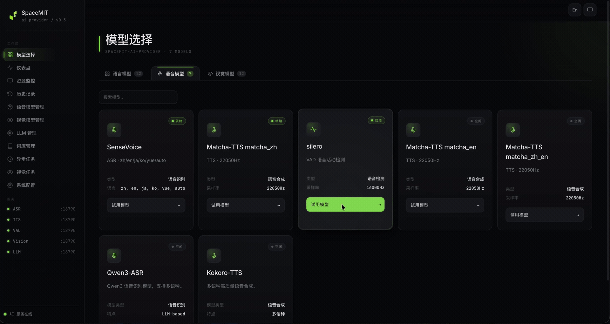

# 4.1.3 VAD

## 1. Overview

The VAD component detects voice activity in audio frames and reports speech-start, speech-active, and speech-end states. It is located in `components/model_zoo/vad`. The default backend is Silero VAD, which runs local ONNX inference. The component provides a C++ API, Python bindings, and file-based and single-frame examples.

In an end-to-end speech pipeline, VAD typically precedes ASR:

```text
Microphone PCM -> VAD detects speech segments -> triggers ASR flush/recognition -> LLM/TTS
```

In `omni_agent`, VAD also detects barge-in events in which the user interrupts TTS playback.

Key directories:

| Path | Description |
| --- | --- |
| `components/model_zoo/vad/include/vad_service.h` | Public C++ API. |
| `components/model_zoo/vad/src/backends/silero/` | Silero VAD backend. |
| `components/model_zoo/vad/examples/simple_demo.cpp` | Basic C++ example; builds to `vad_simple_demo`. |
| `components/model_zoo/vad/python/examples/vad_file_demo.py` | Python file-based example. |
| `components/model_zoo/vad/python/spacemit_vad/` | Python package. |

### Demo Video



## 2. Environment Setup

### Prerequisites

For SDK source acquisition and base build-environment setup, see [2.3-Building and Compilation](../../02-快速入门/2.3-构建编译.md). After initializing the SDK, return to this page and continue with [Build](#build).

Unless stated otherwise, run the following commands from the `spacemit_robot` SDK root directory.

### Build

The speech components use the `target/k3-com260-omni-agent.json` target configuration. Install the following dependencies if needed:

```bash
sudo apt install libcurl4-openssl-dev pybind11-dev
```

Load the SDK environment and build VAD:

```bash
source build/envsetup.sh
lunch k3-com260-omni-agent
cd components/model_zoo/vad
mm
```

The build installs `vad_simple_demo` in `output/staging/bin`. To use the Python examples, run the following command from the SDK root:

```bash
m -py
```

Note: `m -py` and `mm -py` build wheels and must be run in the system Python environment. Use `~/.comm-env` only for the subsequent `pip install` steps and for running Python examples.

Before running Python examples, install the virtual-environment dependencies, then create and activate `~/.comm-env`:

```bash
sudo apt install python3-venv python-is-python3 python3-pip
python3 -m venv ~/.comm-env
source ~/.comm-env/bin/activate
```

Install the Python package using one of the following methods. To install the released package directly:

```bash
python -m pip install spacemit-vad \
    --index-url https://git.spacemit.com/api/v4/projects/33/packages/pypi/simple
```

Alternatively, return to the SDK root and install the locally built wheel:

```bash
python -m pip install output/wheels/components_model_zoo_vad/spacemit_vad-*.whl \
    --index-url https://git.spacemit.com/api/v4/projects/33/packages/pypi/simple
```

After installation, you can import `spacemit_vad`.

The default Silero model path is `~/.cache/models/vad/silero/silero_vad.onnx`. On first run, the component checks for or downloads the model as needed.

Default Silero audio configuration:

| Parameter | Default | Description |
| --- | --- | --- |
| `sample_rate` | 16000 | Input sample rate. |
| `window_size` | 512 | Approximately 32 ms at 16 kHz. |
| `trigger_threshold` | 0.5 | Speech-start threshold. |
| `stop_threshold` | 0.35 | Speech-end threshold. |
| `smoothing_window` | 10 | Smoothing window size. |

## 3. Examples

### 3.1 Basic C++ Example

```bash
vad_simple_demo
```

Use this example to verify VAD engine initialization and single-frame detection. The repository contains `examples/simple_demo.cpp`; this document lists only `vad_simple_demo` as the fixed build artifact.

### 3.2 Python File-Based Example

After installing `spacemit-vad`, run:

```bash
cd components/model_zoo/vad
python python/examples/vad_file_demo.py
```

If running the example directly reports `No module named 'spacemit_vad'`, verify that `~/.comm-env` is active and that `spacemit-vad` or the local wheel is installed.

### 3.3 End-to-End Validation

VAD logs its conversational state in `omni_agent`. After starting a voice conversation, look for the following messages:

```text
[2/5] 初始化 VAD... OK (Silero VAD)
[VAD] 开始说话 (prob=0.86)...
[VAD] 停止说话，触发识别
[Barge-in] 用户打断 (连续5帧, prob=0.856)，停止播放
```

These logs, captured on K3, confirm end-to-end interaction between VAD, ASR, TTS, and barge-in handling.

## 4. Application Development

This section describes how to integrate the VAD component into C++ and Python applications. `components/model_zoo/vad/include/vad_service.h` is the authoritative API reference; this section covers only common public APIs and typical calling patterns. The C++ entry point is `SpacemiT::VadEngine`, and the Python entry point is `spacemit_vad.VadEngine`.

### 4.1 API Reference

The main VAD entry point is `SpacemiT::VadEngine`. Use this class to create a detection engine, select a backend, and start single-frame or streaming detection. **VAD does not provide `Flush()`**. Its streaming API is `Start/SendAudioFrame/Stop`; use `Reset()` to clear internal state.

#### 4.1.1 Common Data Structures

| Type | Description |
| --- | --- |
| `VadState` | State-machine enumeration: `SILENCE`, `SPEECH_START` (the first detected speech edge), `SPEECH` (ongoing speech), and `SPEECH_END` (the end of a speech segment). In streaming callbacks, use `IsSpeechStart()` and `IsSpeechEnd()` directly. |
| `VadBackendType` | Backend enumeration: `SILERO` (the default ONNX model), `ENERGY` (energy threshold), `WEBRTC`, `FSMN`, and reserved `CUSTOM`. |
| `VadConfig` | Engine configuration. Common fields include `backend`, `model_dir`, `sample_rate=16000`, `window_size=512` (approximately 32 ms at 16 kHz), `trigger_threshold=0.5` (speech-start threshold), `stop_threshold=0.35` (speech-end threshold), `min_speech_duration_ms=250`, `min_silence_duration_ms=100`, `smoothing_window=10`, and `use_smoothing=true`. Use `Preset(name)` to create a preset. Chainable methods include `withTriggerThreshold`, `withStopThreshold`, `withMinSpeechDuration`, `withMinSilenceDuration`, `withWindowSize`, `withSampleRate`, and `withSmoothing`. |
| `VadResult` | Detection result. Provides `GetProbability()`, `GetSmoothedProbability()`, `IsSpeech()`, `GetState()`, `IsSpeechStart()`, `IsSpeechEnd()`, `GetTimestampMs()`, `GetSpeechStartMs()`, `GetSpeechEndMs()`, `GetSpeechDurationMs()`, `GetProcessingTimeMs()`, `IsSuccess()`, and `GetMessage()`. |
| `VadEngineCallback` | Streaming callback base class. Override `OnOpen()`, `OnEvent(result)`, `OnSpeechStart(timestamp_ms)`, `OnSpeechEnd(timestamp_ms, duration_ms)`, `OnComplete()`, `OnError(message)`, and `OnClose()`. The VAD engine invokes callbacks from an internal thread; synchronize access to your own state. |

#### 4.1.2 Engine Initialization and Presets

| API | Description | Parameters | Return value |
| --- | --- | --- | --- |
| `VadEngine(backend, model_dir)` | Constructs an engine from a backend enumeration. Uses the default cache when no model path is specified. | `backend`: `VadBackendType`; `model_dir`: optional model directory. | Engine instance. |
| `VadEngine(VadConfig)` | Constructs an engine with a complete configuration, including thresholds, window settings, and smoothing parameters. | `config`: `VadConfig` instance. | Engine instance. |
| `VadConfig::Preset(name)` | Static factory that returns a `VadConfig` for the specified preset. | `name`: silero, energy, webrtc, and others. | `VadConfig`. |
| `VadConfig::AvailablePresets()` | Static method that returns the names of currently available presets. | None. | `std::vector<std::string>`. |
| `IsInitialized()` / `IsStreaming()` / `GetEngineName()` / `GetBackendType()` / `GetCurrentState()` / `GetLastProbability()` / `IsInSpeech()` / `GetConfig()` | Query engine state and configuration. | None. | Varies by method. |

#### 4.1.3 Single-Frame Detection

| API | Description | Parameters | Return value |
| --- | --- | --- | --- |
| `Detect(vector<float>, sample_rate=16000)` | Detects a single frame of mono floating-point PCM audio with a range of [-1.0, 1.0]. The recommended frame length is `window_size` (512 by default). | `audio`: one floating-point PCM frame; `sample_rate`: sample rate. | `shared_ptr<VadResult>`; returns `nullptr` on failure. |
| `Detect(float* data, size_t num_samples, sample_rate=16000)` | Pointer-based version that avoids copying data; otherwise has the same behavior. | `data`: floating-point buffer; `num_samples`: sample count. | Same as above. |

#### 4.1.4 Streaming Detection

| API | Description | Parameters | Return value |
| --- | --- | --- | --- |
| `SetCallback(callback)` | Registers a streaming callback object. Must be called before `Start()`. | `callback`: `shared_ptr<VadEngineCallback>`. | None. |
| `Start()` | Starts a streaming session and begins accepting audio frames. | None. | `bool`. |
| `SendAudioFrame(vector<float>)` | Submits a frame of mono floating-point PCM audio. The recommended length is an integer multiple of `window_size`. | `data`: floating-point PCM. | None. |
| `SendAudioFrame(float* data, size_t num_samples)` | Pointer-based version. | Same as above. | None. |
| `Stop()` | Ends the current streaming session and invokes `OnComplete`. | None. | None. |
| `Reset()` | Clears the internal state machine and probability history **without ending the session**. Use it when switching contexts or manually resetting between speech segments. | None. | None. |

#### 4.1.5 Runtime Thresholds

| API | Description | Parameters | Return value |
| --- | --- | --- | --- |
| `SetTriggerThreshold(threshold)` | Raises or lowers the speech-start threshold at runtime. A higher threshold reduces missed detections but increases false detections. | `threshold`: [0, 1]. | None. |
| `SetStopThreshold(threshold)` | Adjusts the speech-end threshold at runtime. It is typically about 0.1 lower than the trigger threshold to provide hysteresis. | `threshold`: [0, 1]. | None. |

### 4.2 C++ Examples

The following examples assume that you completed the build steps in Section 2. The Silero model is located at `~/.cache/models/vad/silero/silero_vad.onnx`.

After building the VAD component, `vad_service.h`, `libvad.a`, and `libsilero_vad.a` are installed in `output/staging`. All libraries are static. `vad` links to `silero_vad` as a PUBLIC dependency, but explicitly linking both libraries is more reliable for downstream components. Use the following CMake configuration:

```cmake
add_executable(my_app main.cpp)

find_library(VAD_LIB NAMES vad
    PATHS ${CMAKE_INSTALL_PREFIX}/lib NO_DEFAULT_PATH)
find_library(SILERO_VAD_LIB NAMES silero_vad
    PATHS ${CMAKE_INSTALL_PREFIX}/lib NO_DEFAULT_PATH)
find_path(VAD_SERVICE_INCLUDE_DIR NAMES vad_service.h
    PATHS ${CMAKE_INSTALL_PREFIX}/include NO_DEFAULT_PATH)
if(NOT VAD_LIB OR NOT SILERO_VAD_LIB OR NOT VAD_SERVICE_INCLUDE_DIR)
    message(FATAL_ERROR "vad/silero_vad not found. Build components/model_zoo/vad first.")
endif()

target_include_directories(my_app PRIVATE ${VAD_SERVICE_INCLUDE_DIR})
target_link_libraries(my_app PRIVATE ${VAD_LIB} ${SILERO_VAD_LIB})
```

Declare `<depend>vad</depend>` in the current component's `package.xml`.

#### 4.2.1 Offline Buffered-Frame Detection

Use this approach to segment speech and silence in audio that is already in memory, such as for offline scripts or regression tests.

Steps:

1. Create a preset with `VadConfig::Preset("silero")`, then override thresholds with the chainable methods as needed.
2. Construct `VadEngine` and check `IsInitialized()`.
3. Split audio into `window_size` frames (512 by default), then call `Detect()` for each frame to obtain probabilities and states.

```cpp
#include <iostream>
#include <vector>
#include <memory>
#include "vad_service.h"

void DetectBuffer(const std::vector<float>& audio_16k_mono) {
    auto config = SpacemiT::VadConfig::Preset("silero")
        .withTriggerThreshold(0.5f)
        .withStopThreshold(0.35f);

    auto engine = std::make_shared<SpacemiT::VadEngine>(config);
    if (!engine->IsInitialized()) {
        std::cerr << "VAD 引擎初始化失败" << std::endl;
        return;
    }

    constexpr size_t kWindow = 512;
    for (size_t i = 0; i + kWindow <= audio_16k_mono.size(); i += kWindow) {
        std::vector<float> frame(audio_16k_mono.begin() + i,
                                  audio_16k_mono.begin() + i + kWindow);
        auto result = engine->Detect(frame, 16000);
        if (!result || !result->IsSuccess()) continue;

        std::cout << "t=" << (i * 1000 / 16000) << "ms"
                  << "  prob=" << result->GetProbability()
                  << "  state=" << static_cast<int>(result->GetState());
        if (result->IsSpeechStart()) std::cout << " [START]";
        if (result->IsSpeechEnd())   std::cout << " [END]";
        std::cout << std::endl;
    }
}
```

For a complete example with synthetic sine-wave and silence tests and performance statistics, see `components/model_zoo/vad/examples/simple_demo.cpp`.

#### 4.2.2 Streaming Microphone VAD and State Callbacks

Use this approach to detect microphone input in real time. Connect it to the audio component capture callback to receive `OnSpeechStart` and `OnSpeechEnd` events.

Steps:

1. Implement a `VadEngineCallback` subclass. Override `OnSpeechStart` and `OnSpeechEnd` to handle speech edges, and override `OnEvent` to process per-frame probabilities.
2. Construct the engine, then call `SetCallback()` followed by `Start()`.
3. In the `AudioCapture` callback, convert PCM bytes to floating-point samples in the range [-1, 1], then call `SendAudioFrame`.
4. Call `Stop()` before exiting.

```cpp
#include <atomic>
#include <chrono>
#include <iostream>
#include <memory>
#include <thread>
#include <vector>

#include "vad_service.h"
#include "audio_base.hpp"

class VadCb : public SpacemiT::VadEngineCallback {
 public:
    void OnSpeechStart(int64_t ts_ms) override {
        std::cout << "[VAD] 说话开始 @" << ts_ms << "ms" << std::endl;
    }
    void OnSpeechEnd(int64_t ts_ms, int duration_ms) override {
        std::cout << "[VAD] 说话结束 @" << ts_ms
                  << "ms (持续 " << duration_ms << "ms)" << std::endl;
    }
    void OnError(const std::string& msg) override {
        std::cerr << "[VAD] 错误: " << msg << std::endl;
    }
};

int main() {
    auto config = SpacemiT::VadConfig::Preset("silero");
    auto engine = std::make_shared<SpacemiT::VadEngine>(config);
    auto cb = std::make_shared<VadCb>();
    engine->SetCallback(cb);
    engine->Start();

    SpacemitAudio::AudioCapture capture(-1);
    capture.SetCallback([&](const uint8_t* data, size_t size) {
        const auto* pcm = reinterpret_cast<const int16_t*>(data);
        size_t n = size / sizeof(int16_t);
        std::vector<float> frame(n);
        for (size_t i = 0; i < n; ++i) frame[i] = pcm[i] / 32768.0f;
        engine->SendAudioFrame(frame);
    });
    capture.Start(16000, 1, 1024);  // 1024 bytes = 512 int16 samples

    std::this_thread::sleep_for(std::chrono::seconds(30));

    engine->Stop();
    capture.Stop();
    return 0;
}
```

#### 4.2.3 Endpoint Detection with ASR

Use this approach for a typical voice-assistant pipeline: when VAD detects `SPEECH_END`, send the buffered audio to `ASR.Recognize`. This is the core pattern used by `omni_agent` `voice_chat`.

Steps:

1. Begin accumulating PCM in `OnSpeechStart`, then submit the complete buffered segment to ASR in `OnSpeechEnd`.
2. While accumulating audio, you can also use `min_speech_duration_ms` to filter short false-speech segments.

```cpp
class EndpointCb : public SpacemiT::VadEngineCallback {
 public:
    EndpointCb(SpacemiT::AsrEngine* asr) : asr_(asr) {}

    void OnSpeechStart(int64_t) override {
        std::lock_guard<std::mutex> lk(mu_);
        buffer_.clear();
        in_speech_ = true;
    }
    void OnSpeechEnd(int64_t, int duration_ms) override {
        std::vector<int16_t> chunk;
        {
            std::lock_guard<std::mutex> lk(mu_);
            chunk = std::move(buffer_);
            in_speech_ = false;
        }
        if (chunk.empty()) return;
        auto result = asr_->Recognize(chunk, 16000);
        if (result && !result->IsEmpty())
            std::cout << "[ASR] " << result->GetText() << std::endl;
    }
    void Append(const int16_t* data, size_t n) {
        std::lock_guard<std::mutex> lk(mu_);
        if (!in_speech_) return;
        buffer_.insert(buffer_.end(), data, data + n);
    }

 private:
    SpacemiT::AsrEngine* asr_;
    std::mutex mu_;
    std::vector<int16_t> buffer_;
    bool in_speech_ = false;
};
```

In the `AudioCapture` callback, send int16 data to both VAD, after converting it to floating point, and `EndpointCb::Append`, retaining the original int16 samples. For a complete pipeline example, see `application/native/omni_agent/src/voice_pipeline.cpp`.

### 4.3 Python Examples

The Python package is named `spacemit_vad`. For installation, see the wheel-installation steps in Section 2. Import it as follows:

```python
import spacemit_vad
```

#### 4.3.1 Single-Frame Detection

```python
import numpy as np
import spacemit_vad

config = spacemit_vad.VadConfig.preset("silero") \
    .with_trigger_threshold(0.5) \
    .with_stop_threshold(0.35)

engine = spacemit_vad.VadEngine(config)
assert engine.is_initialized

frame = np.zeros(512, dtype=np.float32)  # Replace with real PCM.
result = engine.detect(frame, 16000)

print(f"prob={result.probability:.3f}, "
      f"is_speech={result.is_speech}, "
      f"state={result.state}, "
      f"start={result.is_speech_start}, end={result.is_speech_end}")
```

Or use the module-level convenience function:

```python
import spacemit_vad
result = spacemit_vad.detect(audio_frame)  # Defaults to Silero at 16 kHz.
```

#### 4.3.2 Engine Object and Streaming Callbacks

In Python, `VadCallback` does not require subclassing an ABC. Register callback functions through its setter methods:

```python
import numpy as np
import spacemit_vad

callback = spacemit_vad.VadCallback()
callback.on_speech_start(lambda ts: print(f"[VAD] 说话开始 @{ts}ms"))
callback.on_speech_end(lambda ts, dur: print(f"[VAD] 说话结束 @{ts}ms ({dur}ms)"))
callback.on_event(lambda r: None)   # Per-frame event; optional.
callback.on_error(lambda msg: print(f"[VAD] 错误: {msg}"))

engine = spacemit_vad.VadEngine(spacemit_vad.VadConfig.preset("silero"))
engine.set_callback(callback)
engine.start()

# Submit 16 kHz mono float32 PCM in 512-sample frames. PCM16 bytes are also supported.
for chunk in iter_audio_frames():     # Implement this function.
    engine.send_audio_frame(chunk)    # Accepts NumPy float32 arrays or bytes.

engine.stop()
```

#### 4.3.3 C++ and Python API Mapping

| C++ (`SpacemiT::`) | Python (`spacemit_vad.`) | Notes |
| --- | --- | --- |
| `VadConfig` + `Preset(name)` | `VadConfig.preset(name)` | The chainable method names use lowercase snake case, such as `with_trigger_threshold`; fields are directly readable, such as `config.trigger_threshold`. |
| `VadEngine(config)` + `IsInitialized()` | `VadEngine(config)` + `engine.is_initialized` property | Python initializes the engine during construction. |
| `Detect(vector<float>, sample_rate)` | `engine.detect(numpy_float32, sample_rate)` or module-level `spacemit_vad.detect(audio)` | Python additionally accepts int16 NumPy arrays. |
| `SetCallback / Start / SendAudioFrame / Stop / Reset` | `engine.set_callback(cb) / start() / send_audio_frame(audio_or_bytes) / stop() / reset()` | The streaming APIs map one-to-one. |
| `VadEngineCallback` (subclass and override virtual methods) | `VadCallback` (instance with setter registration): `cb.on_event(fn)` / `on_speech_start(fn)` / `on_speech_end(fn)` / `on_error(fn)` / `on_open(fn)` / `on_complete(fn)` / `on_close(fn)` | The usage differs: Python registers callback functions and does not require an ABC subclass. |
| `SetTriggerThreshold / SetStopThreshold` | `engine.set_trigger_threshold(t)` / `set_stop_threshold(t)` | |
| `VadResult::GetProbability/GetState/...` | `result.probability` / `state` / `is_speech` / `is_speech_start` / `is_speech_end` / `timestamp_ms` / `speech_duration_ms` / `processing_time_ms` properties | Python uses properties instead of getter methods. |

The Python `examples/` directory currently contains only `vad_file_demo.py`; **a standalone streaming demo is not provided**. For streaming usage, see Section 4.3.2, or adapt the multiprocess capture structure in `components/model_zoo/asr/python/examples/asr_stream_demo.py`.

## 5. Troubleshooting

When troubleshooting VAD, verify the input audio first, then inspect state-machine logs:

- Record the same microphone input with `audio_demo record`, then play it back to rule out silence or severe clipping.
- Use `vad_simple_demo` to validate single-frame detection independently. For live voice conversations, use the VAD state in `voice_chat` logs as the source of truth.
- For threshold-related issues, adjust `trigger_threshold`, `stop_threshold`, and the smoothing window before changing application logic.
- If echo causes false triggers, record playback volume, microphone distance, and whether hardware or software AEC is enabled.

## 6. FAQ

| Symptom | Possible Cause | Resolution |
| --- | --- | --- |
| VAD always detects silence | No device input, mismatched sample rate, or an excessively high threshold | Record and play back audio with `audio_demo record`, then lower `trigger_threshold` to verify detection. |
| Background noise triggers speech detection | Threshold is too low or ambient noise is high | Raise `trigger_threshold`, increase the smoothing window, or add noise reduction upstream. |
| Speech end is detected too late | `stop_threshold` or state smoothing causes a long tail | Raise `stop_threshold` appropriately or shorten application-level silence waiting. |
| False barge-in triggers | TTS playback leaks into the microphone | Use hardware AEC provided by the audio device or the WebRTC AEC mode in `voice_chat_aec`. |

## Appendix: Agent Interaction Results

K3 end-to-end voice-conversation testing shows that VAD performs the following actions in `voice_chat`:

| Action | Representative log | Purpose |
| --- | --- | --- |
| Initialization | `[2/5] 初始化 VAD... OK (Silero VAD)` (Initializing VAD... OK) | Confirms that the model and engine are available. |
| Speech start | `[VAD] 开始说话 (prob=0.86)...` (Speech started) | Starts buffering user speech. |
| Speech end | `[VAD] 停止说话，触发识别` (Speech stopped; triggering recognition) | Triggers voiceprint verification and ASR. |
| User interruption | `[Barge-in] 用户打断 ... 停止播放` (User interruption; stopping playback) | Interrupts the current LLM/TTS response and begins a new input turn. |

**Test procedure:** Build VAD and `omni_agent` on a K3 board, then run `voice_chat`. Confirm live conversation states from the VAD initialization, speech-start, speech-end, and barge-in log events.
