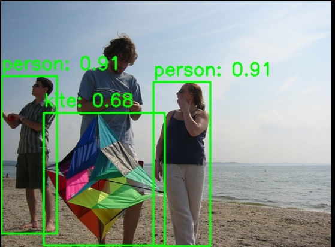

# Vision · Object Detection

## 1. Overview

- **Key Features**: General-purpose object detection based on the YOLO family of models. Supports real-time detection of the 80 COCO object classes and outputs each object's bounding box, confidence score, and class label.
- Specifications and features:
  - Supported models: YOLOv5 (n/s), YOLOv8 (n/s/m), YOLOv11 (n/s/m), YOLO12 (n/s)
  - Input size: `[1, 3, 640, 640]`
  - Quantization: int8
  - Inference backend: ONNX Runtime + SpaceMITExecutionProvider
  - Interfaces: C++ (`vision_service.h`), Python (`spacemit_vision` wheel: `VisionServiceNative`)
- Related directory structure:

```
examples/yolov5/   # YOLOv5 example
├── config/yolov5.yaml    # Configuration file
├── cpp/yolov5.cpp        # C++ example
├── python/yolov5.py      # Python example
└── scripts/        # Model download scripts
examples/yolov8/          # YOLOv8 example (same structure as above)
examples/yolov11/    # YOLOv11 example (same structure as above)
examples/yolo12/          # YOLO12 example (same structure as above)
src/deploy/yolov5/        # YOLOv5 deployment implementation
src/deploy/yolov8/        # YOLOv8 deployment implementation
src/deploy/yolov11/   # YOLOv11 deployment implementation
```

## 2. Environment Setup

### Prerequisites

For instructions on obtaining the SDK source code and configuring the basic build environment, see [2.3-Building and Compilation](../../02-快速入门/2.3-构建编译.md). After initializing the SDK, return to this document and continue with the [Build](#build) section.

Unless noted otherwise, run the following commands from the `spacemit_robot` SDK root directory.

### Build

If any dependencies are missing, install them first:

```bash
sudo apt install python3-spacemit-ort opencv-spacemit libeigen3-dev spacemit-onnxruntime libyaml-cpp-dev
```

After loading the build environment from the SDK root, build the vision component:

```bash
source build/envsetup.sh
cd components/model_zoo/vision
mm
```

The SDK's integrated build installs the `yolov8`, `yolov5`, `yolov11`, and `yolo12` example binaries to `output/staging/bin`. After loading `build/envsetup.sh`, you can run them directly.


Before running the Python examples, install the `spacemit_vision` wheel:

```bash
cd components/model_zoo/vision
python3 -m pip install -U pybind11 build setuptools wheel
cmake -S . -B build && cmake --build build -j
python3 -m pip install --force-reinstall src/python/dist/*.whl
python3 -c "from spacemit_vision import VisionServiceNative; print('ok')"
```

Model weights are stored by default under `~/.cache/models/vision/yolov8/`, `~/.cache/models/vision/yolov5/`, `~/.cache/models/vision/yolov11/`, and `~/.cache/models/vision/yolo12/`. You must run the download script manually first; if the weights are missing, the program fails immediately with a "Model file not found" error.

## 3. Example Usage (From Scratch)

This section walks you through reproducing the workflow **step by step**: commands are copy-pasteable, paths are either absolute or clearly scoped to a working directory, and each step lists the **expected result**.

### 3.1 YOLOv8 Object Detection (Python)

**Prerequisites**: See Section 2. Dependencies must be installed and the code must be cloned.

**Step 1**: Download the model

```bash
cd components/model_zoo/vision
bash examples/yolov8/scripts/download_models.sh
```

Expected result: The model file is downloaded to `~/.cache/models/vision/yolov8/yolov8n_no_dfl.q.onnx`.

**Step 2**: Download test assets

```bash
bash scripts/download_assets.sh
```

Expected result: Test images are downloaded to the `~/.cache/assets/image/` directory.

**Step 3**: Run inference

```bash
python3 examples/yolov8/python/yolov8.py --config examples/yolov8/config/yolov8.yaml
```

**Step 4** (optional): Real-time detection with a camera

First, confirm the camera device number (`--camera-id` is the `N` in `/dev/videoN`; default is `0`):

```bash
v4l2-ctl --list-devices
ls /dev/video*
```

If `--camera-id 0` fails to open, use the output to select the actual capture node (for example, `/dev/video20` corresponds to `--camera-id 20`). If needed, run `v4l2-ctl -d /dev/videoN --all` to inspect node details.

```bash
python3 examples/yolov8/python/yolov8.py --config examples/yolov8/config/yolov8.yaml --use-camera --camera-id 0
```

### 3.2 YOLOv8 Object Detection (C++)

**Prerequisites**: See Section 2. The C++ build must be complete.

**Step 1**: Download the model (same as Section 3.1, Step 1)

**Step 2**: Run inference

```bash
cd components/model_zoo/vision
yolov8 examples/yolov8/config/yolov8.yaml
```

**Step 3** (optional): Real-time detection with a camera

For how to find the device number, see Section 3.1, Step 4.

```bash
yolov8 examples/yolov8/config/yolov8.yaml --use-camera --camera-id 0
```

### 3.3 YOLOv5 Object Detection

**Step 1**: Download the model

```bash
bash examples/yolov5/scripts/download_models.sh
```

**Step 2**: Run inference

```bash
# Python
python3 examples/yolov5/python/yolov5.py --config examples/yolov5/config/yolov5.yaml

# C++
yolov5 examples/yolov5/config/yolov5.yaml
```

### 3.4 YOLOv11 Object Detection

**Step 1**: Download the model

```bash
bash examples/yolov11/scripts/download_models.sh
```

**Step 2**: Run inference

```bash
# Python
python3 examples/yolov11/python/yolov11.py --config examples/yolov11/config/yolov11.yaml

# C++
yolov11 examples/yolov11/config/yolov11.yaml
```

### 3.5 YOLO12 Object Detection

**Step 1**: Download the model

```bash
bash examples/yolo12/scripts/download_models.sh
```

Expected result: The model file is downloaded to `~/.cache/models/vision/yolo12/yolo12n.q.onnx`.

**Step 2**: Run inference

```bash
# Python
python3 examples/yolo12/python/yolo12.py --config examples/yolo12/config/yolo12.yaml

# C++
yolo12 examples/yolo12/config/yolo12.yaml
```

### 3.6 Sample Output

**Sample terminal output** (using YOLOv8n as an example):

```
Detected 3 objects:
  Class 0, Score: 0.9169, Box: [0.5929,113.6988,84.9922,352.1162]
  Class 0, Score: 0.9169, Box: [230.9947,122.2212,316.2409,371.1132]
  Class 33, Score: 0.6868, Box: [64.5499,169.1887,247.2958,370.5807]
Result image saved to: result.jpg
```

**Visualization**:



The image shows the detected bounding boxes, class labels, and confidence scores.

## 4. Application Development

This chapter is for application developers and explains how to integrate the object detection component into your own C++ or Python applications. The complete interface definitions are in `include/vision_service.h` and `src/python/spacemit_vision/vision_service_native.py`; this section covers the commonly used public APIs and typical usage patterns.

### 4.1 Interface Overview

The core entry points of the object detection component are `VisionService` (C++) and `VisionServiceNative` (Python, `spacemit_vision` wheel). Applications use these interfaces to load YOLO models and issue object detection requests for images or video streams.

#### 4.1.1 Common Data Structures

| Type | Description |
| --- | --- |
| vision::Detection | Object detection result struct. Contains the bounding box `bbox` (x1, y1, x2, y2), confidence `score`, and class ID `label`. |
| vision::Result | Unified result variant (`std::variant`); for object detection it holds a `vision::Detection`. Use `vision::get_bbox/get_label/get_score` to read common fields, or `std::get_if<vision::Detection>` to get the concrete type. |
| VisionServiceResponse | Inference response. `results` is a `vision::ResultList` (i.e., `std::vector<vision::Result>`), and also includes `ok` and `error_message`. |
| VisionServiceRequest | Inference request. Image models populate `image`; you can temporarily override parameters such as `conf_threshold` and `iou_threshold` in `params`. |

#### 4.1.2 Service Initialization

**C++ API**

| API | Description | Parameters | Return Value |
| --- | --- | --- | --- |
| VisionService::Create | Creates a detection service instance from a YAML config file | config_path: path to the YAML config file | Smart pointer to a VisionService |
| VisionService::LastCreateError | Gets the error message from the most recent failed creation attempt | None | Error description string |

**Python API**

| API | Description | Parameters | Return Value |
| --- | --- | --- | --- |
| VisionServiceNative.create | Creates a service instance from a YAML config file | config_path: path to the YAML file; model_path_override: optional override for the model path | A VisionServiceNative instance |
| VisionServiceNative.last_create_error | Gets the error message from the most recent failed creation attempt | None | Error description string |

#### 4.1.3 Object Detection

**C++ API**

| API | Description | Parameters | Return Value |
| --- | --- | --- | --- |
| Infer | Runs object detection on an image file | image_path: path to the image file; response: output response; params: optional inference parameters | VisionServiceStatus (VISION_SERVICE_OK indicates success) |
| Infer | Runs object detection on a cv::Mat image | image: an OpenCV Mat object; response: output response; params: optional inference parameters | VisionServiceStatus |
| Draw | Draws detection results on an image (stateless; the response must be passed in explicitly) | image: input image; response: inference response; out_image: output image | VisionServiceStatus |
| LastError | Gets the error message from the most recent inference call | None | Error description string |

**Python API**

| API | Description | Parameters | Return Value |
| --- | --- | --- | --- |
| infer_image | Runs inference on an image | image_or_path: a BGR numpy array or an image path; conf/iou: optional thresholds (<=0 uses the YAML default) | (VisionServiceStatus, list of results) |
| draw | Draws the most recent inference result | image: a BGR numpy array | (VisionServiceStatus, image with results drawn) |
| supports_draw | Whether the current model supports drawing on the C++ side | None | bool |
| last_error | Gets the error message from the most recent inference call | None | Error description string |

#### 4.1.4 Performance Monitoring

**C++ API**

| API | Description | Parameters | Return Value |
| --- | --- | --- | --- |
| SetTimingOptions | Enables/disables performance timing | options: VisionServiceTimingOptions (enabled, print_to_stdout) | void |
| GetLastTiming | Gets per-stage timing from the most recent inference call | None | A VisionServiceTiming struct (preprocess_ms, model_infer_ms, postprocess_ms, infer_ms, etc.) |

### 4.2 Typical Usage

#### 4.2.1 C++ Single-Image Detection

```cpp
#include "vision_service.h"
#include <opencv2/opencv.hpp>
#include <iostream>

int main() {
    // 1. Create the service
    auto service = VisionService::Create("examples/yolov8/config/yolov8.yaml");
    if (!service) {
        std::cerr << "Failed to create service: "
                  << VisionService::LastCreateError() << std::endl;
        return -1;
    }

    // 2. Enable performance timing (optional)
    VisionServiceTimingOptions timing_options;
    timing_options.enabled = true;
    service->SetTimingOptions(timing_options);

    // 3. Run inference
    VisionServiceResponse response;
    if (service->Infer("test.jpg", &response) != VISION_SERVICE_OK) {
       std::cerr << "Inference failed: " << service->LastError() << std::endl;
        return -1;
    }

    // 4. Process results (the result is a vision::Result variant; use accessors to read common fields)
    std::cout << "Detected " << response.results.size() << " objects:" << std::endl;
    for (const auto& result : response.results) {
        const vision::BoundingBox box = vision::get_bbox(result);
        std::cout << "  Class " << vision::get_label(result)
                  << ", Score: " << vision::get_score(result)
                  << ", Box: [" << box.x1 << "," << box.y1 << ","
                  << box.x2 << "," << box.y2 << "]" << std::endl;
    }

    // 5. Draw the results (Draw is stateless; the response must be passed in explicitly)
    cv::Mat image = cv::imread("test.jpg");
    cv::Mat output;
    service->Draw(image, response, &output);
    cv::imwrite("result.jpg", output);

    // 6. Check performance metrics (optional)
    auto timing = service->GetLastTiming();
    std::cout << "Preprocess: " << timing.preprocess_ms << " ms" << std::endl;
    std::cout << "Inference: " << timing.model_infer_ms << " ms" << std::endl;
    std::cout << "Postprocess: " << timing.postprocess_ms << " ms" << std::endl;

    return 0;
}
```

#### 4.2.2 C++ Video Stream Detection

```cpp
#include "vision_service.h"
#include <opencv2/opencv.hpp>

int main() {
    auto service = VisionService::Create("examples/yolov8/config/yolov8.yaml");
    cv::VideoCapture cap(0);  // Open the camera
    cv::Mat frame, output;

    while (cap.read(frame)) {
        VisionServiceResponse response;
        if (service->Infer(frame, &response) != VISION_SERVICE_OK) break;
        service->Draw(frame, response, &output);

        cv::imshow("Detection", output);
        if (cv::waitKey(1) == 'q') break;
    }

    return 0;
}
```

#### 4.2.3 Python Single-Image Detection

```python
import cv2
from spacemit_vision import VisionServiceNative, VisionServiceStatus

# 1. Create the service
svc = VisionServiceNative.create("examples/yolov8/config/yolov8.yaml")

# 2. Run inference
image = cv2.imread("test.jpg")
status, results = svc.infer_image(image)
if status != VisionServiceStatus.OK:
    raise RuntimeError(svc.last_error())

# 3. Process the results (each item includes label, score, x1/y1/x2/y2)
print(f"Detected {len(results)} objects:")
for r in results:
    print(f"  Class {r.label}, Score: {r.score:.4f}, "
          f"Box: [{r.x1:.1f},{r.y1:.1f},{r.x2:.1f},{r.y2:.1f}]")

# 4. Draw the results
if svc.supports_draw():
    st, output = svc.draw(image)
    if st == VisionServiceStatus.OK:
        cv2.imwrite("result.jpg", output)
```

#### 4.2.4 Python Video Stream Detection

```python
import cv2
from spacemit_vision import VisionServiceNative, VisionServiceStatus

svc = VisionServiceNative.create("examples/yolov8/config/yolov8.yaml")
cap = cv2.VideoCapture(0)

while True:
    ret, frame = cap.read()
    if not ret:
        break

    status, results = svc.infer_image(frame)
    if status != VisionServiceStatus.OK:
        break

    output = frame
    if svc.supports_draw():
        st, output = svc.draw(frame)
        if st != VisionServiceStatus.OK:
            output = frame

    cv2.imshow("Detection", output)
    if cv2.waitKey(1) & 0xFF == ord('q'):
        break

cap.release()
cv2.destroyAllWindows()
```

### 4.3 Configuration

The YAML config file is the core of model loading and inference parameters. The full set of configuration options is described below:

```yaml
# Path to the model file (supports relative paths and ~ expansion)
model_path: ~/.cache/models/vision/yolov8/yolov8n_no_dfl.q.onnx

# Path to the test image (used by the example programs)
test_image: ~/.cache/assets/image/006_test.jpg

# Path to the class label file (80 COCO classes)
label_file_path: assets/labels/coco.txt

# Model input size [height, width]
image_size: [640, 640]

# Deployment class name (C++ model factory registration name; Python uses it indirectly via the YAML path)
class: deploy.yolov8.YOLOv8Detector

# Inference parameters
default_params:
  # Confidence threshold (0.0-1.0); detections below this value are filtered out
  conf_threshold: 0.25
  
  # IOU threshold (0.0-1.0), used for NMS (non-maximum suppression)
  iou_threshold: 0.45
  
  # Number of inference threads (example default is 8; on the K3 platform, the recommended max intra-op thread count is 8; lower it as needed)
  num_threads: 8
  
  # Inference backend (prefer SpaceMITExecutionProvider)
  providers:
    - SpaceMITExecutionProvider
    - CPUExecutionProvider  # Fallback backend
```

**Parameter tuning recommendations**:

- **conf_threshold**: Increasing it reduces false positives; decreasing it increases recall. The default of 0.25 works for most scenarios.
- **iou_threshold**: Increasing it keeps more overlapping boxes; decreasing it reduces redundant detections. The default of 0.45 balances the two.
- **num_threads**: The example YAML defaults to 8. On the K3 platform, the recommended max intra-op thread count is **8**. If you experience CPU contention or unstable latency, try lowering it to 4; don't exceed 8.
- **providers**: Prefer SpaceMITExecutionProvider for the best performance, with CPUExecutionProvider as a fallback.

### 4.4 Performance Monitoring

Enabling performance timing lets you analyze per-stage inference latency for performance tuning and bottleneck analysis.

**C++ example**:

```cpp
VisionServiceTimingOptions timing_options;
timing_options.enabled = true;
service->SetTimingOptions(timing_options);

VisionServiceResponse response;
service->Infer("test.jpg", &response);

auto timing = service->GetLastTiming();
std::cout << "Preprocess: " << timing.preprocess_ms << " ms" << std::endl;
std::cout << "Inference: " << timing.model_infer_ms << " ms" << std::endl;
std::cout << "Postprocess: " << timing.postprocess_ms << " ms" << std::endl;
std::cout << "Total: " << timing.infer_ms << " ms" << std::endl;
```

**Performance tuning tips**:

- High preprocessing time: Check whether the image size is too large; consider lowering the input resolution.
- High inference time: Confirm you're using SpaceMITExecutionProvider, and check the thread count setting.
- High postprocessing time: Check whether there are too many detected boxes; consider raising conf_threshold.

**Reference demo paths**:
- `examples/yolov8/`, `examples/yolov5/`, `examples/yolov11/`, `examples/yolo12/`
- Application examples: `applications/fire_detection/` (fire detection), `applications/intrusion_detection/` (intrusion detection)

## 5. Debugging Guide

- Enable timing: Use `SetTimingOptions` to view per-stage latency for preprocessing, inference, and postprocessing.
- Check model loading: `VisionService::LastCreateError()` returns details about a failed creation attempt.
- Check inference errors: `service->LastError()` returns the error message from the most recent inference call.
- Empty detection results: Adjust `conf_threshold` and observe how the detection count changes; confirm the input image actually contains target objects.

## 6. FAQ

| Symptom | Possible Cause | Resolution |
| --- | --- | --- |
| `Model file not found` | The model hasn't been downloaded, or the path is wrong | Run `bash examples/yolov8/scripts/download_models.sh` to download the model |
| Empty detection results | `conf_threshold` is too high, or the input image has no target objects | Lower `conf_threshold` (e.g., 0.1), and use a test image that contains target objects |
| `SpaceMITExecutionProvider not found` | spacemit-ort isn't installed | `sudo apt-get install python3-spacemit-ort` |
| `No module named 'spacemit_vision'` | The wheel isn't installed | Build per §2, then `pip install src/python/dist/*.whl` |
| Slow inference | Incorrect thread count, or using the CPU provider | Confirm `providers` in the YAML is set to `SpaceMITExecutionProvider`; `num_threads` defaults to 8 (recommended max is 8) and can be lowered as needed |

## Appendix: Performance and Test Data

The data below is from the Vision component [`README.md`](../../../../README.md) appendix, **excluding pre/post-processing** (pure ONNX model inference, not including image preprocessing or postprocessing). These are preliminary measured results on the K3 platform and are continuously being optimized; see the README for the full table.

### K3 Platform

| Model | Input Size | Data Type | FPS (4 cores) | FPS (8 cores) |
| --- | --- | --- | --- | --- |
| yolov5n | [1,3,640,640] | int8 | 69.1 | 104.4 |
| yolov5s | [1,3,640,640] | int8 | 41.3 | 62.8 |
| yolov8n | [1,3,640,640] | int8 | 60.8 | 97.0 |
| yolov8s | [1,3,640,640] | int8 | 36.3 | 57.1 |
| yolov8m | [1,3,640,640] | int8 | 19.5 | 30.6 |
| yolo11n | [1,3,640,640] | int8 | 45.1 | 70.8 |
| yolo11s | [1,3,640,640] | int8 | 29.4 | 45.3 |
| yolo11m | [1,3,640,640] | int8 | 14.5 | 22.7 |

**Reproduction method**: Use the `onnxruntime_perf_test` tool (using YOLOv8n with 4 threads as an example):

```bash
onnxruntime_perf_test ~/.cache/models/vision/yolov8/yolov8n_no_dfl.q.onnx -e spacemit -r 20 -x 1 -S 1 -s -I -c 1 -i "SPACEMIT_EP_INTRA_THREAD_NUM|4"
```

For more details, see the **onnxruntime_perf_test** section of the SpacemiT community documentation [AI Compute Stack · ONNX Runtime](https://www.spacemit.com/community/document/info?lang=en&nodepath=ai/compute_stack/ai_compute_stack/onnxruntime.md).