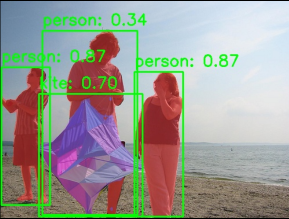

# Vision · Instance Segmentation

## 1. Overview

- **Key Features**: YOLOv8-Seg instance segmentation. In addition to detecting object bounding boxes, it outputs a pixel-level mask for each instance and distinguishes different individuals of the same class.
- Specifications and features:
    - Supported models: YOLOv8n-seg, YOLOv8s-seg, YOLOv8m-seg
    - Input size: `[1, 3, 640, 640]`
    - Quantization: int8
    - Outputs: Bounding boxes + confidence scores + class labels + instance masks
    - Inference backend: ONNX Runtime + SpaceMITExecutionProvider
    - Interfaces: C++ (`vision_service.h`), Python (`spacemit_vision` wheel: `VisionServiceNative`)
- Related directory structure:

```
examples/yolov8_seg/
├── config/yolov8_seg.yaml   # Configuration file
├── cpp/yolov8_seg.cpp       # C++ example
├── python/yolov8_seg.py     # Python example
└── scripts/                 # Model download scripts
src/deploy/yolov8_seg/       # Deployment implementation (C++ / Python)
```

## 2. Environment Setup

### Prerequisites

For instructions on obtaining the SDK source code and configuring the basic build environment, see [2.3-Building and Compilation](../../02-快速入门/2.3-构建编译.md). After initializing the SDK, return to this document and continue with the [Build](#build) section.

Unless noted otherwise, run the following commands from the `spacemit_robot` SDK root directory.

### Build

If any dependencies are missing, install them first:

```bash
sudo apt install python3-spacemit-ort opencv-spacemit libeigen3-dev spacemit-onnxruntime libyaml-cpp-dev
```

After loading the build environment from the SDK root, build the vision component:

```bash
source build/envsetup.sh
cd components/model_zoo/vision
mm
```

The SDK integrated build installs the `yolov8_seg` example binary to `output/staging/bin`. After loading `build/envsetup.sh`, you can run it directly.

Before running the Python examples, install the `spacemit_vision` wheel:

```bash
cd components/model_zoo/vision
python3 -m pip install -U pybind11 build setuptools wheel
cmake -S . -B build && cmake --build build -j
python3 -m pip install --force-reinstall src/python/dist/*.whl
python3 -c "from spacemit_vision import VisionServiceNative; print('ok')"
```

Model weights are stored by default under `~/.cache/models/vision/yolov8_seg/`. You must run the download script manually first; if the weights are missing, the program fails immediately with a "Model file not found" error.

## 3. Example Usage (From Scratch)

### 3.1 YOLOv8-Seg Instance Segmentation (Python)

**Prerequisites**: See Section 2.

**Step 1**: Download the model

```bash
cd components/model_zoo/vision
bash examples/yolov8_seg/scripts/download_models.sh
```

Expected result: The model file is downloaded to `~/.cache/models/vision/yolov8_seg/yolov8n-seg.q.onnx`.

**Step 2**: Download test assets

```bash
bash scripts/download_assets.sh
```

**Step 3**: Run inference

```bash
python3 examples/yolov8_seg/python/yolov8_seg.py --config examples/yolov8_seg/config/yolov8_seg.yaml
```

**Step 4** (optional): Real-time segmentation with a camera

First, confirm the camera device number (`--camera-id` is the `N` in `/dev/videoN`; default is `0`):

```bash
v4l2-ctl --list-devices
ls /dev/video*
```

If `--camera-id 0` fails to open, use the output to select the actual capture node (for example, `/dev/video20` corresponds to `--camera-id 20`). If needed, run `v4l2-ctl -d /dev/videoN --all` to inspect node details.

```bash
python3 examples/yolov8_seg/python/yolov8_seg.py --config examples/yolov8_seg/config/yolov8_seg.yaml --use-camera --camera-id 0
```

### 3.2 YOLOv8-Seg Instance Segmentation (C++)

**Prerequisites**: See Section 2. The C++ build must be complete.

**Step 1**: Download the model (same as Section 3.1, Step 1)

**Step 2**: Run inference

```bash
yolov8_seg examples/yolov8_seg/config/yolov8_seg.yaml
```

**Step 3** (optional): Real-time segmentation with a camera

For how to find the device number, see Section 3.1, Step 4.

```bash
yolov8_seg examples/yolov8_seg/config/yolov8_seg.yaml --use-camera --camera-id 0
```

### 3.3 Sample Output

**Sample terminal output**:

```
Detected 4 objects with segmentation masks
Result image saved to: yolov8_seg_result.jpg
```

**Visualization**:



The image shows the detected bounding boxes and colored instance masks. Different instances are distinguished using different colors.

## 4. Application Development

This chapter is for application developers and explains how to integrate the instance segmentation component into your own C++ or Python applications. The complete interface definitions are in `include/vision_service.h` and `src/python/spacemit_vision/vision_service_native.py`; this section covers the commonly used public APIs and typical usage patterns.

### 4.1 Interface Overview

The core entry points of the instance segmentation component are `VisionService` (C++) and `VisionServiceNative` (Python, `spacemit_vision` wheel). Applications use these interfaces to load YOLOv8-Seg models and issue instance segmentation requests for images or video streams.

#### 4.1.1 Common Data Structures

| Type | Description |
| --- | --- |
| vision::Segmentation | Segmentation result in `namespace vision`. Fields include the bounding box `bbox` (`vision::BoundingBox`, containing x1/y1/x2/y2), confidence `score`, class ID `label`, and instance mask `mask` (`std::shared_ptr<cv::Mat>`, which may be empty). |
| vision::Result | Unified result variant (`std::variant<Detection, Classification, Pose, Segmentation, ...>`). For segmentation tasks, it holds `vision::Segmentation`. Use the accessors `vision::get_label`, `vision::get_score`, and `vision::get_bbox` to read common fields. |
| VisionServiceResponse | Inference response. `results` is a `vision::ResultList` (i.e., `std::vector<vision::Result>`), and also includes `ok` and `error_message`. |

#### 4.1.2 Service Initialization

**C++ API**

| API | Description | Parameters | Return Value |
| --- | --- | --- | --- |
| VisionService::Create | Creates a segmentation service instance from a YAML config file | config_path: path to the YAML config file | Smart pointer to a VisionService |
| VisionService::LastCreateError | Gets the error message from the most recent failed creation attempt | None | Error description string |

**Python API**

| API | Description | Parameters | Return Value |
| --- | --- | --- | --- |
| VisionServiceNative.create | Creates a segmentation service instance from a YAML config file | config_path: path to the YAML file; model_path_override: optional override for the model path | A VisionServiceNative instance |
| VisionServiceNative.last_create_error | Gets the error message from the most recent failed creation attempt | None | Error description string |

#### 4.1.3 Instance Segmentation

**C++ API**

| API | Description | Parameters | Return Value |
| --- | --- | --- | --- |
| Infer | Runs instance segmentation on an image file | image_path: path to the image file; response: output response | VisionServiceStatus (`VISION_SERVICE_OK` indicates success) |
| Infer | Runs instance segmentation on a cv::Mat image | image: an OpenCV Mat object; response: output response | VisionServiceStatus (`VISION_SERVICE_OK` indicates success) |
| Draw | Draws segmentation results on an image (bounding boxes, labels, and masks; stateless, the response must be passed explicitly) | image: input image; response: inference response; out_image: output image | VisionServiceStatus |
| LastError | Gets the error message from the most recent inference call | None | Error description string |

**Python API**

| API | Description | Parameters | Return Value |
| --- | --- | --- | --- |
| infer_image | Runs instance segmentation on an image | image_or_path: a BGR numpy array or an image path; conf/iou: optional thresholds | (VisionServiceStatus, list of results; each item includes label, score, x1~y2, and mask) |
| draw | Draws the most recent inference result, including masks | image: a BGR numpy array | (VisionServiceStatus, image with results drawn) |
| supports_draw | Whether the current model supports drawing on the C++ side | None | bool |
| last_error | Gets the error message from the most recent inference call | None | Error description string |

#### 4.1.4 Performance Monitoring

**C++ API**

| API | Description | Parameters | Return Value |
| --- | --- | --- | --- |
| SetTimingOptions | Enables/disables performance timing | options: `VisionServiceTimingOptions` (set `enabled` and other fields) | void |
| GetLastTiming | Gets per-stage timing from the most recent inference call | None | A `VisionServiceTiming` struct (preprocess_ms, model_infer_ms, postprocess_ms, infer_ms, etc.) |

### 4.2 Typical Usage

#### 4.2.1 C++ Single-Image Segmentation

```cpp
#include "vision_service.h"
#include <opencv2/opencv.hpp>
#include <iostream>
#include <variant>

int main() {
    // 1. Create the service
    auto service = VisionService::Create("examples/yolov8_seg/config/yolov8_seg.yaml");
    if (!service) {
        std::cerr << "Failed to create service: " 
                  << VisionService::LastCreateError() << std::endl;
        return -1;
    }

    // 2. Enable performance timing (optional)
    VisionServiceTimingOptions timing_options;
    timing_options.enabled = true;
    service->SetTimingOptions(timing_options);

    // 3. Run inference
    VisionServiceResponse response;
    VisionServiceStatus ret = service->Infer("test.jpg", &response);
    if (ret != VISION_SERVICE_OK) {
        std::cerr << "Inference failed: " << service->LastError() << std::endl;
        return -1;
    }

    // 4. Process results
    std::cout << "Detected " << response.results.size() << " objects with masks:" << std::endl;
    for (const auto& result : response.results) {
        vision::BoundingBox box = vision::get_bbox(result);
        std::cout << "  Class " << vision::get_label(result)
                  << ", Score: " << vision::get_score(result)
                  << ", Box: [" << box.x1 << "," << box.y1 << ","
                  << box.x2 << "," << box.y2 << "]";

        // Access the instance mask (the concrete segmentation type is vision::Segmentation)
        if (const vision::Segmentation* seg = std::get_if<vision::Segmentation>(&result)) {
            if (seg->mask && !seg->mask->empty()) {
                std::cout << ", Mask size: " << seg->mask->size() << std::endl;
            } else {
                std::cout << ", No mask" << std::endl;
            }
        } else {
            std::cout << std::endl;
        }
    }

    // 5. Draw the results, including masks (the response must be passed explicitly)
    cv::Mat image = cv::imread("test.jpg");
    cv::Mat output;
    service->Draw(image, response, &output);
    cv::imwrite("result.jpg", output);

    // 6. Check performance metrics (optional)
    VisionServiceTiming timing = service->GetLastTiming();
    std::cout << "Preprocess: " << timing.preprocess_ms << " ms" << std::endl;
    std::cout << "Inference: " << timing.model_infer_ms << " ms" << std::endl;
    std::cout << "Postprocess: " << timing.postprocess_ms << " ms" << std::endl;

    return 0;
}
```

#### 4.2.2 C++ Video Stream Segmentation

```cpp
#include "vision_service.h"
#include <opencv2/opencv.hpp>

int main() {
    auto service = VisionService::Create("examples/yolov8_seg/config/yolov8_seg.yaml");
    cv::VideoCapture cap(0);  // Open the camera
    cv::Mat frame, output;

    while (cap.read(frame)) {
        VisionServiceResponse response;
        VisionServiceStatus ret = service->Infer(frame, &response);
        if (ret != VISION_SERVICE_OK) break;
        service->Draw(frame, response, &output);

        cv::imshow("Segmentation", output);
        if (cv::waitKey(1) == 'q') break;
    }

    return 0;
}
```

#### 4.2.3 Python Single-Image Segmentation

```python
import cv2
from spacemit_vision import VisionServiceNative, VisionServiceStatus

svc = VisionServiceNative.create("examples/yolov8_seg/config/yolov8_seg.yaml")
image = cv2.imread("test.jpg")

status, results = svc.infer_image(image)
if status != VisionServiceStatus.OK:
    raise RuntimeError(svc.last_error())

print(f"Detected {len(results)} objects with masks:")
for r in results:
    print(f"  Class {r.label}, Score: {r.score:.4f}, "
          f"Box: [{r.x1:.1f},{r.y1:.1f},{r.x2:.1f},{r.y2:.1f}]")
    if r.mask is not None and getattr(r.mask, 'size', 0):
        print(f"    Mask shape: {r.mask.shape}")

if svc.supports_draw():
    st, output = svc.draw(image)
    if st == VisionServiceStatus.OK:
        cv2.imwrite("result.jpg", output)
```

#### 4.2.4 Python Video Stream Segmentation

```python
import cv2
from spacemit_vision import VisionServiceNative, VisionServiceStatus

svc = VisionServiceNative.create("examples/yolov8_seg/config/yolov8_seg.yaml")
cap = cv2.VideoCapture(0)

while True:
    ret, frame = cap.read()
    if not ret:
        break
    status, _ = svc.infer_image(frame)
    if status != VisionServiceStatus.OK:
        break
    output = frame
    if svc.supports_draw():
        st, output = svc.draw(frame)
    cv2.imshow("Segmentation", output)
    if cv2.waitKey(1) & 0xFF == ord('q'):
        break

cap.release()
cv2.destroyAllWindows()
```

### 4.3 Configuration

The YAML configuration file defines the model-loading and inference parameters. The complete configuration is shown below:

```yaml
# Model file path (must be a segmentation model with the -seg suffix)
model_path: ~/.cache/models/vision/yolov8_seg/yolov8n-seg.q.onnx

# Test image path (used by the example program)
test_image: ~/.cache/assets/image/006_test.jpg

# Class label file path (80 COCO classes)
label_file_path: assets/labels/coco.txt

# Model input size [height, width]
image_size: [640, 640]

# Deployment class name (the C++ model-factory registration name; Python uses it indirectly through the YAML path)
class: deploy.yolov8_seg.YOLOv8SegDetector

# Inference parameters
default_params:
    # Confidence threshold (0.0-1.0); detections below this value are filtered out
  conf_threshold: 0.25
  
    # IOU threshold (0.0-1.0), used for NMS non-maximum suppression
  iou_threshold: 0.45
  
    # Number of inference threads (8 by default; 8 is the recommended intra-op maximum on K3 and can be reduced as needed)
  num_threads: 8
  
    # Inference backend (SpaceMITExecutionProvider is preferred)
  providers:
    - SpaceMITExecutionProvider
    - CPUExecutionProvider  # Fallback backend
```

**Parameter tuning recommendations**:

- **conf_threshold**: Increasing this value reduces false positives; lowering it can improve recall. The default value of 0.25 works well for most scenarios.
- **iou_threshold**: Increasing this value retains more overlapping boxes; lowering it reduces redundant detections. The default value of 0.45 provides a balance.
- **num_threads**: The example YAML defaults to 8; the **recommended maximum** for K3 intra-op threads is 8. If CPU contention or latency is unstable, try reducing it to 4. Values above 8 are not recommended.
- **providers**: Prefer SpaceMITExecutionProvider for best performance, with CPUExecutionProvider as the fallback.
- **image_size**: Keep `[640, 640]` for the best segmentation accuracy. Lower resolutions produce coarser mask boundaries.

### 4.4 Performance Monitoring

Enable performance timing to analyze the duration of each inference stage for performance optimization and bottleneck identification.

**C++ Example**:

```cpp
VisionServiceTimingOptions timing_options;
timing_options.enabled = true;
service->SetTimingOptions(timing_options);

VisionServiceResponse response;
service->Infer("test.jpg", &response);

VisionServiceTiming timing = service->GetLastTiming();
std::cout << "Preprocess: " << timing.preprocess_ms << " ms" << std::endl;
std::cout << "Inference: " << timing.model_infer_ms << " ms" << std::endl;
std::cout << "Postprocess: " << timing.postprocess_ms << " ms" << std::endl;
std::cout << "Total: " << timing.infer_ms << " ms" << std::endl;
```

**Performance optimization recommendations**:

- High preprocessing time: Check whether the image is too large and consider reducing the input resolution, but note that this affects mask quality.
- High inference time: Confirm that SpaceMITExecutionProvider is in use and check the thread-count setting. Instance segmentation is 20-30% slower than object detection.
- High postprocessing time: Mask generation and NMS are the main costs. Increasing conf_threshold appropriately can reduce the number of objects processed.

**Reference demo path**: `examples/yolov8_seg/`

## 5. Debugging Guide

- Enable timing: Use `SetTimingOptions` to view the duration of the preprocessing, inference, and postprocessing stages.
- Empty masks: Confirm that the model file has the `-seg` suffix; standard detection models do not output masks.
- Check model loading: Use `VisionService::LastCreateError()` to obtain error details.

## 6. FAQ

| Symptom | Possible Cause | Resolution |
| --- | --- | --- |
| `Model file not found` | Model not downloaded | Run `bash examples/yolov8_seg/scripts/download_models.sh` |
| `No module named 'spacemit_vision'` | Wheel not installed | Follow Section 2 to build and run `pip install src/python/dist/*.whl` |
| Empty mask results | A non-segmentation model is being used | Confirm that `model_path` points to `yolov8n-seg.q.onnx` |
| Coarse segmentation boundaries | Input resolution is insufficient | Confirm that `image_size` is `[640, 640]` |

## Appendix: Performance and Test Data

The following data is taken from the Vision component [`README.md`](../../../../README.md), Appendix "**Excluding preprocessing and postprocessing**" (pure ONNX model inference without image preprocessing or postprocessing). These are interim measurements on the K3 platform; see the README for the complete table.

### K3 Platform

| Model | Input Size | Data Type | Frame Rate (4 Cores) | Frame Rate (8 Cores) |
| --- | --- | --- | --- | --- |
| yolov8n-seg | [1,3,640,640] | int8 | 46.7 | 72.5 |
| yolov8s-seg | [1,3,640,640] | int8 | 28.2 | 43.9 |
| yolov8m-seg | [1,3,640,640] | int8 | 15.7 | 24.7 |

**Reproduction method**: Use the `onnxruntime_perf_test` tool with 4 threads:

```bash
onnxruntime_perf_test ~/.cache/models/vision/yolov8_seg/yolov8n-seg.q.onnx -e spacemit -r 20 -x 1 -S 1 -s -I -c 1 -i "SPACEMIT_EP_INTRA_THREAD_NUM|4"
```