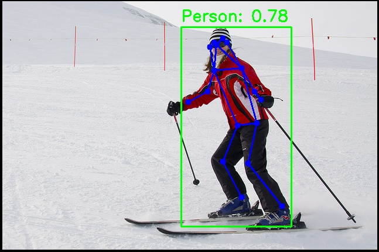

# Vision · Human Pose Estimation

## 1. Overview

- **Key Features**: Human keypoint detection based on YOLOv8-Pose. Outputs each person's bounding box and 17 COCO-format keypoints (nose, eyes, ears, shoulders, elbows, wrists, hips, knees, and ankles) for pose analysis, behavior recognition preprocessing, and similar applications.
- Specifications and features:
    - Supported models: YOLOv8n-pose, YOLOv8s-pose, YOLOv8m-pose
    - Input size: `[1, 3, 640, 640]`
    - Quantization: int8
    - Output: Bounding box + confidence score + 17 keypoints (x, y, visibility)
    - Inference backend: ONNX Runtime + SpaceMITExecutionProvider
    - Interfaces: C++ (`vision_service.h`), Python (`spacemit_vision` wheel: `VisionServiceNative`)
- Related directory structure:

```
examples/yolov8_pose/
├── config/yolov8_pose.yaml   # Configuration file
├── cpp/yolov8_pose.cpp       # C++ example
├── python/yolov8_pose.py     # Python example
└── scripts/                  # Model download scripts
src/deploy/yolov8_pose/       # Deployment implementation (C++ / Python)
```

## 2. Environment Setup

### Prerequisites

For instructions on obtaining the SDK source code and configuring the basic build environment, see [2.3-Building and Compilation](../../02-快速入门/2.3-构建编译.md). After initializing the SDK, return to this document and continue with the [Build](#build) section.

Unless noted otherwise, run the following commands from the `spacemit_robot` SDK root directory.

### Build

If any dependencies are missing, install them first:

```bash
sudo apt install python3-spacemit-ort opencv-spacemit libeigen3-dev spacemit-onnxruntime libyaml-cpp-dev
```

After loading the build environment from the SDK root, build the vision component:

```bash
source build/envsetup.sh
cd components/model_zoo/vision
mm
```

The SDK's integrated build installs the `yolov8_pose` and other example programs to `output/staging/bin`. After loading `build/envsetup.sh`, you can run them directly.

Before running the Python examples, install the `spacemit_vision` wheel:

```bash
cd components/model_zoo/vision
python3 -m pip install -U pybind11 build setuptools wheel
cmake -S . -B build && cmake --build build -j
python3 -m pip install --force-reinstall src/python/dist/*.whl
python3 -c "from spacemit_vision import VisionServiceNative; print('ok')"
```

Model weights are stored by default under `~/.cache/models/vision/yolov8_pose/`. You must run the download script manually first; if the weights are missing, the program fails immediately with a "Model file not found" error.

## 3. Example Usage (From Scratch)

### 3.1 YOLOv8-Pose Estimation (Python)

**Prerequisites**: See Section 2.

**Step 1**: Download the model

```bash
cd components/model_zoo/vision
bash examples/yolov8_pose/scripts/download_models.sh
```

Expected result: The model file is downloaded to `~/.cache/models/vision/yolov8_pose/yolov8n-pose.q.onnx`.

**Step 2**: Download test assets

```bash
bash scripts/download_assets.sh
```

**Step 3**: Run inference

```bash
python3 examples/yolov8_pose/python/yolov8_pose.py --config examples/yolov8_pose/config/yolov8_pose.yaml
```

**Step 4** (optional): Real-time pose estimation with a camera

First, confirm the camera device number (`--camera-id` is the `N` in `/dev/videoN`; default is `0`):

```bash
v4l2-ctl --list-devices
ls /dev/video*
```

If `--camera-id 0` fails to open, use the output to select the actual capture node (for example, `/dev/video20` corresponds to `--camera-id 20`). If needed, run `v4l2-ctl -d /dev/videoN --all` to inspect node details.

```bash
python3 examples/yolov8_pose/python/yolov8_pose.py --config examples/yolov8_pose/config/yolov8_pose.yaml --use-camera --camera-id 0
```

### 3.2 YOLOv8-Pose Estimation (C++)

**Prerequisites**: See Section 2. The C++ build must be complete.

**Step 1**: Download the model (same as Section 3.1, Step 1)

**Step 2**: Run inference

```bash
yolov8_pose examples/yolov8_pose/config/yolov8_pose.yaml
```

**Step 3** (optional): Real-time pose estimation with a camera

For how to find the device number, see Section 3.1, Step 4.

```bash
yolov8_pose examples/yolov8_pose/config/yolov8_pose.yaml --use-camera --camera-id 0
```

### 3.3 Sample Output

**Sample terminal output**:

```
Detected 3 persons with keypoints
Result image saved to: yolov8_pose_result.jpg
```

**Visualization**:



The image shows the detected human bounding boxes, 17 COCO keypoints, and connecting skeleton lines.

## 4. Application Development

This chapter is for application developers and explains how to integrate the human pose estimation component into your own C++ or Python applications. The complete interface definitions are in `include/vision_service.h` and `src/python/spacemit_vision/vision_service_native.py`; this section covers the commonly used public APIs and typical usage patterns.

### 4.1 Interface Overview

The core entry points of the human pose estimation component are `VisionService` (C++) and `VisionServiceNative` (Python, `spacemit_vision` wheel). Applications use these interfaces to load YOLOv8-Pose models and issue pose estimation requests for images or video streams.

#### 4.1.1 Common Data Structures

| Type | Description |
| --- | --- |
| VisionServiceResponse | Unified inference response. The `results` field is a `vision::ResultList` (a variant list of `std::vector<vision::Result>`), and also includes `ok` and `error_message`. |
| vision::Pose | Concrete type for pose estimation results (in `namespace vision`), containing the bounding box (`bbox`), confidence (`score`), class (`label`), and 17 COCO keypoints (`std::vector<vision::KeyPoint> keypoints`). |
| vision::BoundingBox | Bounding box structure containing the coordinates x1, y1, x2, and y2. |
| vision::KeyPoint | Keypoint structure containing the coordinates (x, y) and visibility (`visibility`, 0.0-1.0). |
| VisionServiceInferParams | Inference parameters including conf_threshold, iou_threshold, kp_threshold, top_k, and max_det (fields <= 0 use the configuration defaults). |

#### 4.1.2 Service Initialization

**C++ API**

| API | Description | Parameters | Return Value |
| --- | --- | --- | --- |
| VisionService::Create | Create a pose estimation service instance from a YAML configuration file | config_path: YAML configuration file path | VisionService smart pointer |
| VisionService::LastCreateError | Get the error message from the most recent failed creation attempt | None | Error description string |

**Python API**

| API | Description | Parameters | Return Value |
| --- | --- | --- | --- |
| VisionServiceNative.create | Create a pose estimation service from a YAML configuration file | config_path: YAML path; model_path_override: optional model path override | VisionServiceNative instance |
| VisionServiceNative.last_create_error | Get the error message from the most recent failed creation attempt | None | Error description string |

#### 4.1.3 Pose Estimation

**C++ API**

| API | Description | Parameters | Return Value |
| --- | --- | --- | --- |
| Infer | Perform pose estimation on a single image | image_path: image file path; response: output response pointer | VisionServiceStatus (`VISION_SERVICE_OK` indicates success) |
| Infer | Perform pose estimation on a cv::Mat image | image: OpenCV Mat object; response: output response pointer | VisionServiceStatus (`VISION_SERVICE_OK` indicates success) |
| Draw | Draw pose results (bounding boxes, keypoints, and skeleton) on an image; stateless | image: input image; response: inference response; out_image: output image pointer | VisionServiceStatus |
| LastError | Get the error message from the most recent inference | None | Error description string |

**Python API**

| API | Description | Parameters | Return Value |
| --- | --- | --- | --- |
| infer_image | Perform pose estimation on an image | image_or_path: BGR NumPy array or image path; conf/iou: optional thresholds | (VisionServiceStatus, results list; each item contains score, x1~y2, and keypoints) |
| draw | Draw the results from the most recent inference, including the skeleton | image: BGR NumPy array | (VisionServiceStatus, rendered image) |
| supports_draw | Whether the current model supports drawing on the C++ side | None | bool |
| last_error | Get the error from the most recent inference | None | Error description string |

#### 4.1.4 Performance Monitoring

**C++ API**

| API | Description | Parameters | Return Value |
| --- | --- | --- | --- |
| SetTimingOptions | Enable/disable performance timing | options: VisionServiceTimingOptions (`enabled`, `print_to_stdout`) | void |
| GetLastTiming | Get the time spent in each stage of the most recent inference | None | VisionServiceTiming structure (`preprocess_ms`, `model_infer_ms`, `postprocess_ms`, `infer_ms`, etc.) |

### 4.2 Typical Usage

#### 4.2.1 C++ Single-Image Pose Estimation

```cpp
#include "vision_service.h"
#include <opencv2/opencv.hpp>
#include <iostream>

int main() {
    // 1. Create the service
    auto service = VisionService::Create("examples/yolov8_pose/config/yolov8_pose.yaml");
    if (!service) {
        std::cerr << "Failed to create service: " 
                  << VisionService::LastCreateError() << std::endl;
        return -1;
    }

    // 2. Enable performance timing (optional)
    VisionServiceTimingOptions timing_options;
    timing_options.enabled = true;
    service->SetTimingOptions(timing_options);

    // 3. Run inference
    VisionServiceResponse response;
    VisionServiceStatus ret = service->Infer("test.jpg", &response);
    if (ret != VISION_SERVICE_OK) {
        std::cerr << "Inference failed: " << service->LastError() << std::endl;
        return -1;
    }

    // 4. Process results
    std::cout << "Detected " << response.results.size() << " persons with keypoints:" << std::endl;
    for (const auto& result : response.results) {
        vision::BoundingBox box = vision::get_bbox(result);
        std::cout << "  Person - Score: " << vision::get_score(result)
                  << ", Box: [" << box.x1 << "," << box.y1 << ","
                  << box.x2 << "," << box.y2 << "]" << std::endl;

        // Get the concrete pose type and iterate over the 17 keypoints
        const vision::Pose* pose = std::get_if<vision::Pose>(&result);
        if (pose) {
            std::cout << "  Keypoints:" << std::endl;
            for (size_t i = 0; i < pose->keypoints.size(); ++i) {
                const vision::KeyPoint& kp = pose->keypoints[i];
                std::cout << "    [" << i << "] (" << kp.x << "," << kp.y
                          << ") visibility: " << kp.visibility << std::endl;
            }
        }
    }

    // 5. Draw the results, including the skeleton
    cv::Mat image = cv::imread("test.jpg");
    cv::Mat output;
    service->Draw(image, response, &output);
    cv::imwrite("result.jpg", output);

    // 6. Check performance metrics (optional)
    VisionServiceTiming timing = service->GetLastTiming();
    std::cout << "Preprocess: " << timing.preprocess_ms << " ms" << std::endl;
    std::cout << "Model infer: " << timing.model_infer_ms << " ms" << std::endl;
    std::cout << "Postprocess: " << timing.postprocess_ms << " ms" << std::endl;
    std::cout << "Total: " << timing.infer_ms << " ms" << std::endl;

    return 0;
}
```

#### 4.2.2 C++ Video Stream Pose Estimation

```cpp
#include "vision_service.h"
#include <opencv2/opencv.hpp>

int main() {
    auto service = VisionService::Create("examples/yolov8_pose/config/yolov8_pose.yaml");
    cv::VideoCapture cap(0);  // Open the camera
    cv::Mat frame, output;

    while (cap.read(frame)) {
        VisionServiceResponse response;
        VisionServiceStatus ret = service->Infer(frame, &response);
        if (ret != VISION_SERVICE_OK) break;
        service->Draw(frame, response, &output);

        cv::imshow("Pose Estimation", output);
        if (cv::waitKey(1) == 'q') break;
    }

    return 0;
}
```

#### 4.2.3 Python Single-Image Pose Estimation

```python
import cv2
from spacemit_vision import VisionServiceNative, VisionServiceStatus

svc = VisionServiceNative.create("examples/yolov8_pose/config/yolov8_pose.yaml")
image = cv2.imread("test.jpg")

status, results = svc.infer_image(image)
if status != VisionServiceStatus.OK:
    raise RuntimeError(svc.last_error())

print(f"Detected {len(results)} persons:")
for r in results:
    print(f"  Score: {r.score:.4f}, Box: [{r.x1:.0f},{r.y1:.0f},{r.x2:.0f},{r.y2:.0f}]")
    for i, kp in enumerate(r.keypoints):
        print(f"    [{i}] ({kp.x:.1f},{kp.y:.1f}) visibility: {kp.visibility:.2f}")

if svc.supports_draw():
    st, output = svc.draw(image)
    if st == VisionServiceStatus.OK:
        cv2.imwrite("result.jpg", output)
```

#### 4.2.4 Python Video Stream Pose Estimation

```python
import cv2
from spacemit_vision import VisionServiceNative, VisionServiceStatus

svc = VisionServiceNative.create("examples/yolov8_pose/config/yolov8_pose.yaml")
cap = cv2.VideoCapture(0)

while True:
    ret, frame = cap.read()
    if not ret:
        break
    status, _ = svc.infer_image(frame)
    if status != VisionServiceStatus.OK:
        break
    output = frame
    if svc.supports_draw():
        st, output = svc.draw(frame)
    cv2.imshow("Pose Estimation", output)
    if cv2.waitKey(1) & 0xFF == ord('q'):
        break

cap.release()
cv2.destroyAllWindows()
```

### 4.3 Configuration

The YAML config file is the core of model loading and inference parameters. The full set of configuration options is described below:

```yaml
# Path to the model file (must be a pose estimation model with the -pose suffix)
model_path: ~/.cache/models/vision/yolov8_pose/yolov8n-pose.q.onnx

# Path to the test image (used by the example programs)
test_image: ~/.cache/assets/image/006_test.jpg

# Path to the class label file (80 COCO classes; pose estimation primarily uses the person class)
label_file_path: assets/labels/coco.txt

# Model input size [height, width]
image_size: [640, 640]

# Deployment class name (C++ model factory registration name; Python uses it indirectly through the YAML path)
class: deploy.yolov8_pose.YOLOv8PoseDetector

# Inference parameters
default_params:
    # Confidence threshold (0.0-1.0); detections below this value are filtered out
  conf_threshold: 0.25
  
    # IOU threshold (0.0-1.0), used for NMS (non-maximum suppression)
  iou_threshold: 0.45
  
    # Number of inference threads (example default is 8; the recommended maximum intra-op count on K3 is 8; lower it as needed)
  num_threads: 8
  
    # Inference backend (prefer SpaceMITExecutionProvider)
  providers:
    - SpaceMITExecutionProvider
    - CPUExecutionProvider  # Fallback backend
```

**Parameter tuning recommendations**:

- **conf_threshold**: A higher value can reduce false positives, while a lower value can increase recall. The default value of 0.25 is suitable for most scenarios.
- **iou_threshold**: A higher value can retain more overlapping boxes, while a lower value can reduce redundant detections. The default value of 0.45 provides a balance.
- **num_threads**: The example YAML defaults to 8, and the **recommended maximum** intra-op thread count on K3 is 8. If CPU contention or latency instability occurs, try reducing it to 4; values above 8 are not recommended.
- **providers**: Prefer SpaceMITExecutionProvider for best performance, with CPUExecutionProvider as the fallback.

**COCO 17 Keypoint Indices**:

| Index | Keypoint | Index | Keypoint |
| --- | --- | --- | --- |
| 0 | Nose | 9 | Left wrist |
| 1 | Left eye | 10 | Right wrist |
| 2 | Right eye | 11 | Left hip |
| 3 | Left ear | 12 | Right hip |
| 4 | Right ear | 13 | Left knee |
| 5 | Left shoulder | 14 | Right knee |
| 6 | Right shoulder | 15 | Left ankle |
| 7 | Left elbow | 16 | Right ankle |
| 8 | Right elbow | | |

### 4.4 Performance Monitoring

Enabling performance timing lets you analyze per-stage inference latency for performance tuning and bottleneck analysis.

**C++ example**:

```cpp
VisionServiceTimingOptions timing_options;
timing_options.enabled = true;
service->SetTimingOptions(timing_options);

VisionServiceResponse response;
service->Infer("test.jpg", &response);

VisionServiceTiming timing = service->GetLastTiming();
std::cout << "Preprocess: " << timing.preprocess_ms << " ms" << std::endl;
std::cout << "Model infer: " << timing.model_infer_ms << " ms" << std::endl;
std::cout << "Postprocess: " << timing.postprocess_ms << " ms" << std::endl;
std::cout << "Total: " << timing.infer_ms << " ms" << std::endl;
```

**Performance tuning tips**:

- High preprocessing latency: Check whether the image dimensions are too large and consider reducing the input resolution.
- High inference latency: Confirm that SpaceMITExecutionProvider is being used and check the thread count. Pose estimation is slightly slower than object detection.
- High postprocessing latency: Keypoint decoding and NMS are the main costs. Moderately increasing conf_threshold can reduce the number of objects to process.

**Reference demo paths**:
- `examples/yolov8_pose/`
- Downstream application: `applications/fall_detection/` (fall detection using joint pose and STGCN inference)

## 5. Debugging Guide

- Enable timing: Use `SetTimingOptions` to view the time spent in each stage.
- Low keypoint visibility: Check whether the person is occluded in the input image and adjust `conf_threshold`.
- Abnormal skeleton rendering: Confirm that the model file uses the `-pose` suffix.

## 6. FAQ

| Symptom | Possible Cause | Resolution |
| --- | --- | --- |
| `Model file not found` | Model not downloaded | Run `bash examples/yolov8_pose/scripts/download_models.sh` |
| `No module named 'spacemit_vision'` | Wheel not installed | Follow Section 2 to build and run `pip install src/python/dist/*.whl` |
| Keypoints are empty | A non-pose model is being used | Confirm that `model_path` points to `yolov8n-pose.q.onnx` |
| Some keypoints are missing | The person is occluded | This is normal; the `visibility` field indicates visibility |

## Appendix: Performance and Test Data

The data below is from the Vision component [`README.md`](../../../../README.md) appendix, **excluding pre/post-processing** (pure ONNX model inference, without image preprocessing or postprocessing). These are interim measured results on the K3 platform; see the README for the full table.

### K3 Platform

| Model | Input Size | Data Type | Frame Rate (4 Cores) | Frame Rate (8 Cores) |
| --- | --- | --- | --- | --- |
| yolov8n-pose | [1,3,640,640] | int8 | 61.1 | 88.9 |
| yolov8s-pose | [1,3,640,640] | int8 | 35.4 | 52.9 |
| yolov8m-pose | [1,3,640,640] | int8 | 19.3 | 29.3 |

**Reproduction method**: Use the `onnxruntime_perf_test` tool (4 threads):

```bash
onnxruntime_perf_test ~/.cache/models/vision/yolov8_pose/yolov8n-pose.q.onnx -e spacemit -r 20 -x 1 -S 1 -s -I -c 1 -i "SPACEMIT_EP_INTRA_THREAD_NUM|4"
```