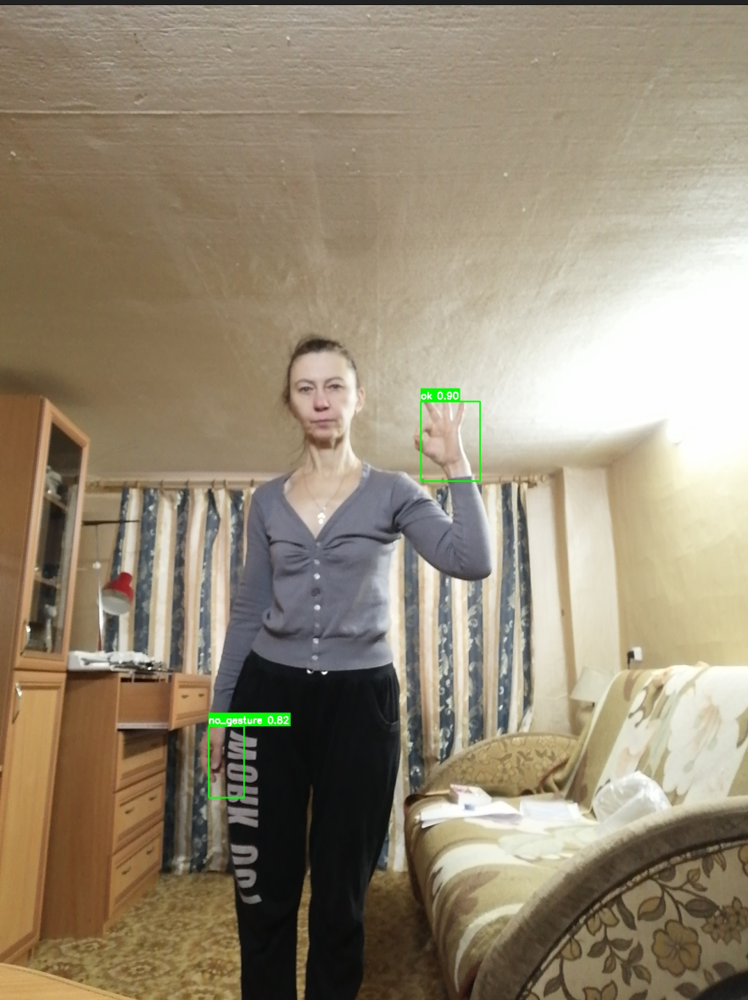

# Vision · Gesture Recognition

## 1. Overview

- **Key Features**: Gesture detection and classification based on YOLOv5. Identifies gesture classes in images, such as fists, open palms, and thumbs up, and outputs the bounding box, confidence score, and gesture class for each detected region.
- Specifications and features:
    - Supported model: YOLOv5 Gesture
    - Input size: `[1, 3, 640, 640]`
    - Quantization: int8
    - Output: Gesture bounding box + confidence score + gesture class
    - Inference backend: ONNX Runtime + SpaceMITExecutionProvider
    - Interfaces: C++ (`vision_service.h`), Python (`spacemit_vision` wheel: `VisionServiceNative`)
- Related directory structure:

```
examples/yolov5_gesture/
├── config/yolov5_gesture.yaml   # Configuration file
├── cpp/yolov5_gesture.cpp       # C++ example
├── python/yolov5_gesture.py     # Python example
└── scripts/                     # Model download scripts
src/deploy/yolov5_gesture/       # Deployment implementation (C++ / Python)
assets/labels/gesture.txt        # Gesture class labels
```

## 2. Environment Setup

### Prerequisites

For instructions on obtaining the SDK source code and configuring the basic build environment, see [2.3-Building and Compilation](../../02-快速入门/2.3-构建编译.md). After initializing the SDK, return to this document and continue with the [Build](#build) section.

Unless noted otherwise, run the following commands from the `spacemit_robot` SDK root directory.

### Build

If any dependencies are missing, install them first:

```bash
sudo apt install python3-spacemit-ort opencv-spacemit libeigen3-dev spacemit-onnxruntime libyaml-cpp-dev
```

After loading the build environment from the SDK root, build the vision component:

```bash
source build/envsetup.sh
cd components/model_zoo/vision
mm
```

The SDK's integrated build installs the `yolov5_gesture` example binary to `output/staging/bin`. After loading `build/envsetup.sh`, you can run it directly.

Before running the Python example, install the `spacemit_vision` wheel:

```bash
cd components/model_zoo/vision
python3 -m pip install -U pybind11 build setuptools wheel
cmake -S . -B build && cmake --build build -j
python3 -m pip install --force-reinstall src/python/dist/*.whl
python3 -c "from spacemit_vision import VisionServiceNative; print('ok')"
```

Model weights are stored by default under `~/.cache/models/vision/yolov5/`. You must run the download script manually first; if the weights are missing, the program fails immediately with a "Model file not found" error.

## 3. Example Usage (From Scratch)

### 3.1 Gesture Recognition (Python)

**Prerequisites**: See Section 2.

**Step 1**: Download the model

```bash
cd components/model_zoo/vision
bash examples/yolov5_gesture/scripts/download_models.sh
```

Expected result: The model file is downloaded to `~/.cache/models/vision/yolov5/yolov5_gesture.q.onnx`.

**Step 2**: Download test assets

```bash
bash scripts/download_assets.sh
```

**Step 3**: Run inference

```bash
python3 examples/yolov5_gesture/python/yolov5_gesture.py --config examples/yolov5_gesture/config/yolov5_gesture.yaml
```

### 3.2 Gesture Recognition (C++)

**Prerequisites**: See Section 2. The C++ build must be complete.

**Step 1**: Download the model (same as Section 3.1, Step 1)

**Step 2**: Run inference

```bash
yolov5_gesture examples/yolov5_gesture/config/yolov5_gesture.yaml
```

### 3.3 Sample Output

**Sample terminal output**:

```
Detected 2 gesture(s):
  ok (class 0) score=0.900 box=[809.209,762.571,923.803,915.754]
  no_gesture (class 5) score=0.815 box=[401.791,1386.415,469.781,1524.662]
Result saved to: result_gesture.jpg
```

**Visualization**:



The image shows the detected gesture bounding boxes, class labels, and confidence scores.

## 4. Application Development

This chapter is for application developers and explains how to integrate the gesture recognition component into your own C++ or Python applications. The complete interface definitions are in `include/vision_service.h` and `src/python/spacemit_vision/vision_service_native.py`; this section covers the commonly used public APIs and typical usage patterns.

### 4.1 Interface Overview

The core entry points of the gesture recognition component are `VisionService` (C++) and `VisionServiceNative` (Python, `spacemit_vision` wheel). Applications use these interfaces to load the YOLOv5 Gesture model and issue gesture detection requests for images or video streams.

#### 4.1.1 Common Data Structures

| Type | Description |
| --- | --- |
| vision::Detection | Gesture recognition result (in `namespace vision`). Contains the gesture region bounding box `bbox` (x1, y1, x2, y2), confidence `score`, and gesture class ID `label`. Use `vision::get_bbox(result)`, `vision::get_label(result)`, and `vision::get_score(result)` to read the common fields. |
| VisionServiceResponse | Inference response. The `results` field is a variant list, `vision::ResultList` (its elements are `vision::Detection` for gesture recognition), and also includes `ok` and `error_message`. |

#### 4.1.2 Service Initialization

**C++ API**

| API | Description | Parameters | Return Value |
| --- | --- | --- | --- |
| VisionService::Create | Creates a gesture recognition service instance from a YAML config file | config_path: path to the YAML config file | Smart pointer to a VisionService |
| VisionService::LastCreateError | Gets the error message from the most recent failed creation attempt | None | Error description string |

**Python API**

| API | Description | Parameters | Return Value |
| --- | --- | --- | --- |
| VisionServiceNative.create | Creates a gesture recognition service from a YAML config file | config_path: path to the YAML file; model_path_override: optional override for the model path | A VisionServiceNative instance |
| VisionServiceNative.last_create_error | Gets the error message from the most recent failed creation attempt | None | Error description string |

#### 4.1.3 Gesture Recognition

**C++ API**

| API | Description | Parameters | Return Value |
| --- | --- | --- | --- |
| Infer | Runs gesture recognition on an image file | image_path: path to the image file; response: output response (VisionServiceResponse*) | VisionServiceStatus (VISION_SERVICE_OK indicates success) |
| Infer | Runs gesture recognition on a cv::Mat image | image: an OpenCV Mat object; response: output response (VisionServiceResponse*) | VisionServiceStatus (VISION_SERVICE_OK indicates success) |
| Draw | Draws recognition results on an image (bounding box, gesture label, and confidence score) | image: input image; response: recognition response; out_image: output image | VisionServiceStatus |
| LastError | Gets the error message from the most recent inference call | None | Error description string |

**Python API**

| API | Description | Parameters | Return Value |
| --- | --- | --- | --- |
| infer_image | Runs gesture recognition on an image | image_or_path: a BGR numpy array or an image path; conf/iou: optional thresholds | (VisionServiceStatus, list of results) |
| draw | Draws the most recent inference result | image: a BGR numpy array | (VisionServiceStatus, image with results drawn) |
| supports_draw | Whether the current model supports drawing on the C++ side | None | bool |
| last_error | Gets the error message from the most recent inference call | None | Error description string |

#### 4.1.4 Performance Monitoring

**C++ API**

| API | Description | Parameters | Return Value |
| --- | --- | --- | --- |
| SetTimingOptions | Enables/disables performance timing | options: VisionServiceTimingOptions (enabled controls whether timing is enabled) | void |
| GetLastTiming | Gets per-stage timing from the most recent inference call | None | A VisionServiceTiming struct (preprocess_ms, model_infer_ms, postprocess_ms, infer_ms, etc.) |

### 4.2 Typical Usage

#### 4.2.1 C++ Single-Image Gesture Recognition

```cpp
#include "vision_service.h"
#include <opencv2/opencv.hpp>
#include <iostream>

int main() {
    // 1. Create the service
    auto service = VisionService::Create("examples/yolov5_gesture/config/yolov5_gesture.yaml");
    if (!service) {
        std::cerr << "Failed to create service: " 
                  << VisionService::LastCreateError() << std::endl;
        return -1;
    }

    // 2. Enable performance timing (optional)
    VisionServiceTimingOptions timing_opts;
    timing_opts.enabled = true;
    service->SetTimingOptions(timing_opts);

    // 3. Run inference
    VisionServiceResponse response;
    VisionServiceStatus ret = service->Infer("test.jpg", &response);
    if (ret != VISION_SERVICE_OK) {
        std::cerr << "Inference failed: " << service->LastError() << std::endl;
        return -1;
    }

    // 4. Process results
    std::cout << "Detected " << response.results.size() << " gesture(s):" << std::endl;
    for (const auto& r : response.results) {
        const vision::BoundingBox box = vision::get_bbox(r);
        std::cout << "  Gesture class " << vision::get_label(r)
                  << ", Score: " << vision::get_score(r)
                  << ", Box: [" << box.x1 << "," << box.y1 << ","
                  << box.x2 << "," << box.y2 << "]" << std::endl;
    }

    // 5. Draw the results
    cv::Mat image = cv::imread("test.jpg");
    cv::Mat output;
    service->Draw(image, response, &output);
    cv::imwrite("result.jpg", output);

    // 6. Check performance metrics (optional)
    auto timing = service->GetLastTiming();
    std::cout << "Preprocess: " << timing.preprocess_ms << " ms" << std::endl;
    std::cout << "Inference: " << timing.model_infer_ms << " ms" << std::endl;
    std::cout << "Postprocess: " << timing.postprocess_ms << " ms" << std::endl;

    return 0;
}
```

#### 4.2.2 C++ Video Stream Gesture Recognition

```cpp
#include "vision_service.h"
#include <opencv2/opencv.hpp>

int main() {
    auto service = VisionService::Create("examples/yolov5_gesture/config/yolov5_gesture.yaml");
    cv::VideoCapture cap(0);  // Open the camera
    cv::Mat frame, output;

    while (cap.read(frame)) {
        VisionServiceResponse response;
        service->Infer(frame, &response);
        service->Draw(frame, response, &output);
        
        cv::imshow("Gesture Recognition", output);
        if (cv::waitKey(1) == 'q') break;
    }

    return 0;
}
```

#### 4.2.3 Python Single-Image Gesture Recognition

```python
import cv2
from spacemit_vision import VisionServiceNative, VisionServiceStatus

svc = VisionServiceNative.create("examples/yolov5_gesture/config/yolov5_gesture.yaml")
image = cv2.imread("test.jpg")

status, results = svc.infer_image(image)
if status != VisionServiceStatus.OK:
    raise RuntimeError(svc.last_error())

for r in results:
    print(f"Class {r.label}, Score: {r.score:.4f}")

if svc.supports_draw():
    st, output = svc.draw(image)
    if st == VisionServiceStatus.OK:
        cv2.imwrite("result.jpg", output)
```

#### 4.2.4 Python Video Stream Gesture Recognition

```python
import cv2
from spacemit_vision import VisionServiceNative, VisionServiceStatus

svc = VisionServiceNative.create("examples/yolov5_gesture/config/yolov5_gesture.yaml")
cap = cv2.VideoCapture(0)

while True:
    ret, frame = cap.read()
    if not ret:
        break
    status, _ = svc.infer_image(frame)
    if status != VisionServiceStatus.OK:
        break
    output = frame
    if svc.supports_draw():
        st, output = svc.draw(frame)
    cv2.imshow("Gesture", output)
    if cv2.waitKey(1) & 0xFF == ord('q'):
        break

cap.release()
cv2.destroyAllWindows()
```

### 4.3 Configuration

The YAML configuration file contains the model-loading and inference parameters. The complete configuration is shown below:

```yaml
# Model file path (YOLOv5 Gesture model)
model_path: ~/.cache/models/vision/yolov5/yolov5_gesture.q.onnx

# Test image path (used by the example program)
test_image: ~/.cache/assets/image/007_gesture.jpg

# Class label file path (gesture classes)
label_file_path: assets/labels/gesture.txt

# Model input size [height, width]
image_size: [640, 640]

# Deployment class name (C++ model factory registration name; Python uses it indirectly through the YAML path)
class: deploy.yolov5_gesture.YOLOv5GestureDetector

# Inference parameters
default_params:
    # Confidence threshold (0.0-1.0); gesture recognition uses a relatively high threshold
  conf_threshold: 0.8
  
    # IOU threshold (0.0-1.0), used for NMS non-maximum suppression
  iou_threshold: 0.5
  
    # Number of inference threads (8 by default in the example; 8 is the recommended intra-op maximum on K3 and can be reduced as needed)
  num_threads: 8
  
    # Inference backend (SpaceMITExecutionProvider is preferred)
  providers:
    - SpaceMITExecutionProvider
    - CPUExecutionProvider  # Fallback backend
```

**Parameter tuning recommendations**:

- **conf_threshold**: Gesture recognition uses a relatively high default threshold of 0.8 to reduce false positives. If gestures are not detected, lower it to 0.5-0.6 as appropriate.
- **iou_threshold**: The default value of 0.5 is suitable for most scenarios.
- **num_threads**: The example YAML defaults to 8, and the **recommended maximum** number of intra-op threads on K3 is 8. If CPU contention or unstable latency occurs, try reducing the value to 4. Values above 8 are not recommended.
- **providers**: Prefer SpaceMITExecutionProvider for optimal performance.

### 4.4 Performance Monitoring

Enable performance timing to analyze the duration of each inference stage for performance optimization and bottleneck identification.

**C++ Example**:

```cpp
VisionServiceTimingOptions timing_opts;
timing_opts.enabled = true;
service->SetTimingOptions(timing_opts);

VisionServiceResponse response;
service->Infer("test.jpg", &response);

auto timing = service->GetLastTiming();
std::cout << "Preprocess: " << timing.preprocess_ms << " ms" << std::endl;
std::cout << "Inference: " << timing.model_infer_ms << " ms" << std::endl;
std::cout << "Postprocess: " << timing.postprocess_ms << " ms" << std::endl;
std::cout << "Total: " << (timing.preprocess_ms + timing.model_infer_ms + timing.postprocess_ms) << " ms" << std::endl;
```

**Performance optimization recommendations**:

- High preprocessing time: Check whether the image is too large and consider reducing the input resolution.
- High inference time: Confirm that SpaceMITExecutionProvider is in use and check the thread count.
- High postprocessing time: Increasing conf_threshold appropriately can reduce the number of objects to process.

**Reference demo path**: `examples/yolov5_gesture/`

## 5. Debugging Guide

- Enable timing: Use `SetTimingOptions` to view the duration of each stage.
- Gestures are not detected: The default `conf_threshold` is 0.8, which is relatively high; lower it as appropriate.
- Confirm that the label file `assets/labels/gesture.txt` exists and contains the correct content.

## 6. Frequently Asked Questions

| Symptom | Possible Cause | Resolution |
| --- | --- | --- |
| `Model file not found` | The model has not been downloaded | Run `bash examples/yolov5_gesture/scripts/download_models.sh` |
| `No module named 'spacemit_vision'` | The wheel is not installed | Follow Section 2 to build it and run `pip install src/python/dist/*.whl` |
| No detection results | `conf_threshold` is too high | Lower `conf_threshold` (for example, to 0.5) |
| Incorrect gesture class | The label file does not match | Confirm that `label_file_path` points to `assets/labels/gesture.txt` |

## Appendix: Performance and Test Data

The gesture model `yolov5_gesture.q.onnx` is not listed separately in the README. The K3 data for YOLOv5 detection models with the same architecture is provided in the [`README.md`](../../../../README.md) appendix under **Without Preprocessing and Postprocessing**. The data represents pure ONNX inference without preprocessing or postprocessing:

| Model | Input Size | Data Type | Frame Rate (4 Cores) | Frame Rate (8 Cores) |
| --- | --- | --- | --- | --- |
| yolov5n | [1,3,640,640] | int8 | 69.1 | 104.4 |
| yolov5s | [1,3,640,640] | int8 | 41.3 | 62.8 |

**Reproduction method** (gesture-specific model):

```bash
onnxruntime_perf_test ~/.cache/models/vision/yolov5/yolov5_gesture.q.onnx -e spacemit -r 20 -x 1 -S 1 -s -I -c 1 -i "SPACEMIT_EP_INTRA_THREAD_NUM|4"
```