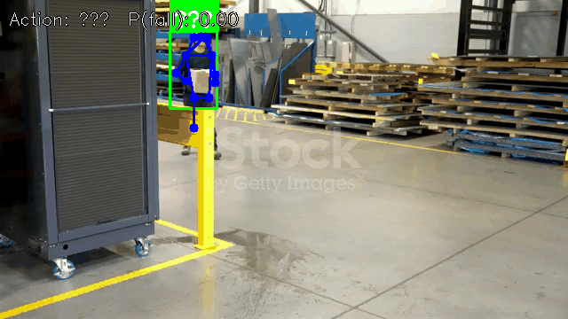

# Vision · Action Recognition

## 1. Overview

- **Key Features**: Skeleton-based action recognition using STGCN (Spatial-Temporal Graph Convolutional Network). It takes a sequence of human keypoints from 30 consecutive frames and outputs action-class probabilities. It supports seven action classes, including fall detection (Fall Down). It is typically used with YOLOv8-Pose: detect human keypoints first, then pass the keypoint sequence to STGCN for action classification.
- Specifications and features:
    - Supported model: STGCN (TSSTG)
    - Input: 30-frame skeleton sequence (17 COCO keypoints × 30 frames)
    - Data type: fp32
    - Output: Probabilities for 7 action classes
    - Inference backend: ONNX Runtime + CPUExecutionProvider
    - Interfaces: C++ (`vision_service.h`), Python (`spacemit_vision` wheel: `VisionServiceNative`)
- Related directory structure:

```
src/deploy/stgcn/
├── cpp/stgcn_action_recognizer.h      # C++ header
├── cpp/stgcn_action_recognizer.cpp    # C++ implementation
└── python/stgcn_action_recognizer.py  # Python implementation
applications/fall_detection/
├── config/fall_detection.yaml         # Fall-detection application configuration
├── config/stgcn.yaml                  # STGCN model configuration
├── cpp/example_fall_detection.cpp     # C++ fall-detection example
├── python/example_fall_detection.py   # Python fall-detection example
└── scripts/download_models.sh         # Model download script
```

## 2. Environment Setup

### Prerequisites

For instructions on obtaining the SDK source code and configuring the basic build environment, see [2.3-Building and Compilation](../../02-快速入门/2.3-构建编译.md). After initializing the SDK, return to this document and continue with the [Build](#build) section.

Unless noted otherwise, run the following commands from the `spacemit_robot` SDK root directory.

### Build

If any dependencies are missing, install them first:

```bash
sudo apt install python3-spacemit-ort opencv-spacemit libeigen3-dev spacemit-onnxruntime libyaml-cpp-dev
```

After loading the build environment from the SDK root, build the vision component:

```bash
source build/envsetup.sh
cd components/model_zoo/vision
mm
```

The SDK integrated build installs the `example_fall_detection` fall-detection application and other example programs to `output/staging/bin`. After loading `build/envsetup.sh`, you can run them directly.

Before running the Python examples, install the `spacemit_vision` wheel:

```bash
cd components/model_zoo/vision
python3 -m pip install -U pybind11 build setuptools wheel
cmake -S . -B build && cmake --build build -j
python3 -m pip install --force-reinstall src/python/dist/*.whl
python3 -c "from spacemit_vision import VisionServiceNative; print('ok')"
```

Model weights are stored by default under `~/.cache/models/vision/stgcn/` and `~/.cache/models/vision/yolov8_pose/`. You must run the download scripts manually first; if the weights are missing, the program fails immediately with a "Model file not found" error.

## 3. Example Usage (From Scratch)

STGCN action recognition is typically demonstrated through the fall-detection application (`applications/fall_detection/`), which combines YOLOv8-Pose estimation with STGCN action classification.

### 3.1 Fall-Detection Application (Python)

**Prerequisites**: See Section 2.

**Step 1**: Download the models

```bash
cd components/model_zoo/vision
bash applications/fall_detection/scripts/download_models.sh
bash examples/yolov8_pose/scripts/download_models.sh
```

Expected result: The STGCN model is downloaded to `~/.cache/models/vision/stgcn/stgcn.fp32.onnx`, and the YOLOv8-Pose model is downloaded to `~/.cache/models/vision/yolov8_pose/yolov8n-pose.q.onnx`.

**Step 2**: Download test assets

```bash
bash scripts/download_assets.sh
```

Expected result: The test video is downloaded to `~/.cache/assets/video/002_fall.mp4`.

**Step 3**: Run fall detection

```bash
python3 applications/fall_detection/python/example_fall_detection.py
```

### 3.2 Fall-Detection Application (C++)

**Prerequisites**: See Section 2. The C++ build must be complete.

**Step 1**: Download the models (same as Section 3.1, Step 1)

**Step 2**: Run fall detection

```bash
example_fall_detection applications/fall_detection/config/fall_detection.yaml
```

### 3.3 Sample Output

**Sample terminal output**:

```
Using test_video from "/home/user/spacemit_robot/components/model_zoo/vision/applications/fall_detection/config/fall_detection.yaml": /home/user/.cache/assets/video/002_fall.mp4
Start processing... press 'q' to quit.
Action/fall by STGCN (30-frame sequence), draw highest-score person only.
SpaceMIT EP initialized successfully!
```

**Visualization**:



The image shows the human pose skeleton and the recognized action class in the video frames.

## 4. Application Development

This chapter is for application developers and explains how to integrate the action recognition component into your own C++ or Python applications. The complete interface definitions are in `include/vision_service.h` and `src/python/spacemit_vision/vision_service_native.py`; this section covers the commonly used public APIs and typical usage patterns.

### 4.1 Interface Overview

The action-recognition component is based on the STGCN (Spatial-Temporal Graph Convolutional Network) model and requires a sequence of human keypoints from 30 consecutive frames for action classification. Applications typically use a pose-estimation model to extract keypoints first and then pass them to STGCN for action recognition.

#### 4.1.1 Common Data Structures

| Type | Description |
| --- | --- |
| vision::Action | Action-recognition result in `namespace vision`, containing the action class ID (`label`), confidence score (`score`), and probabilities for all classes (`class_scores`). |
| vision::Pose | Pose-estimation result in `namespace vision`, containing the bounding box (`bbox`), confidence score (`score`), and keypoints (`keypoints`). |
| VisionServiceRequest | Unified inference input. Set `image` for image models; for sequence models such as STGCN, set `sequence_pts`, `sequence_count`, `sequence_width`, and `sequence_height`. |
| VisionServiceResponse | Unified inference output. `results` is a list of `vision::Result` variants, such as `vision::Pose` or `vision::Action`. |

#### 4.1.2 Service Initialization

**C++ API**

| API | Description | Parameters | Return Value |
| --- | --- | --- | --- |
| VisionService::Create | Creates an STGCN service instance from a YAML config file | config_path: path to the YAML config file | Smart pointer to a VisionService |
| GetClassNames | Gets all action class names (loaded from the model's label_file_path) | None | Vector of class names |

The fall-class index (`fall_down_index`) is no longer provided by the service API. It is an application policy read from the `fall_down_index` field in the fall-detection application configuration (`fall_detection.yaml`).

**Python API**

| API | Description | Parameters | Return Value |
| --- | --- | --- | --- |
| VisionServiceNative.create | Creates an STGCN service from a YAML file | config_path: path to the YAML file | A VisionServiceNative instance |
| get_class_names | Gets the list of action class names | None | List of strings |
| get_fall_down_class_index | Reads fall_down_index from the YAML file, if configured | None | int (-1 if not configured) |

#### 4.1.3 Action Recognition

**C++ API**

| API | Description | Parameters | Return Value |
| --- | --- | --- | --- |
| Infer (image) | Runs inference on a single image, such as for pose estimation | image: cv::Mat; response: output VisionServiceResponse | VisionServiceStatus (`VISION_SERVICE_OK` indicates success) |
| Infer (sequence) | Classifies an action from a 30-frame keypoint sequence | request: VisionServiceRequest (set sequence_pts/count/width/height); response: output VisionServiceResponse | VisionServiceStatus |
| Draw | Draws inference results on an image (stateless; the response must be passed explicitly) | image: input image; response: inference result; out_image: output image | VisionServiceStatus |

**Python API**

| API | Description | Parameters | Return Value |
| --- | --- | --- | --- |
| infer_sequence | Classifies an action from a keypoint sequence | pts: (t, 13, 3) float32 ndarray in pixel coordinates; image_width/height: original image dimensions | (VisionServiceStatus, class_scores list) |
| infer_image | Runs inference on a single image, such as for pose estimation | image: BGR numpy array | (VisionServiceStatus, results list) |
| last_error | Gets the most recent inference error | None | Error description string |

#### 4.1.4 Performance Monitoring

**C++ API**

| API | Description | Parameters | Return Value |
| --- | --- | --- | --- |
| SetTimingOptions | Enables/disables performance timing | options: VisionServiceTimingOptions (`enabled` field) | void |
| GetLastTiming | Gets per-stage timing from the most recent inference call | None | A VisionServiceTiming struct (including sequence_ms, model_infer_ms, infer_ms, and other fields) |

### 4.2 Typical Usage

#### 4.2.1 C++ Fall-Detection Application

```cpp
#include "vision_service.h"
#include <opencv2/opencv.hpp>
#include <yaml-cpp/yaml.h>
#include <deque>
#include <variant>

int main() {
    // 1. Load the application configuration (fall_down_index is an application policy, not a model attribute)
    YAML::Node app_cfg = YAML::LoadFile("applications/fall_detection/config/fall_detection.yaml");
    const int fall_down_index = app_cfg["fall_down_index"].as<int>();  // 6

    // 2. Create the pose-estimation and STGCN services
    auto pose_service  = VisionService::Create("examples/yolov8_pose/config/yolov8_pose.yaml");
    auto stgcn_service = VisionService::Create("applications/fall_detection/config/stgcn.yaml");

    // 3. Get the action class names (a model attribute loaded from label_file_path)
    const auto class_names = stgcn_service->GetClassNames();

    // 4. Keypoint sequence buffer (30 frames × 13 points × 3 channels)
    std::deque<std::vector<float>> keypoint_buffer;

    cv::VideoCapture cap("video.mp4");
    cv::Mat frame;
    while (cap.read(frame)) {
        // 5. Pose inference
        VisionServiceResponse pose_response;
        if (pose_service->Infer(frame, &pose_response) != VISION_SERVICE_OK) continue;

        if (!pose_response.results.empty()) {
            // 6. Select the person with the highest score
            int best_idx = 0;
            for (size_t i = 1; i < pose_response.results.size(); ++i) {
                if (vision::get_score(pose_response.results[i]) >
                    vision::get_score(pose_response.results[best_idx]))
                    best_idx = i;
            }
            const vision::Pose* cr = std::get_if<vision::Pose>(&pose_response.results[best_idx]);
            if (cr && cr->keypoints.size() >= 17) {
                // Map COCO-17 -> TSSTG-13 and build a single-frame float array (13×3)
                static constexpr int MAP13[] = {0,5,6,7,8,9,10,11,12,1,2,3,4};
                std::vector<float> frame_pts(13 * 3);
                for (int i = 0; i < 13; ++i) {
                    const auto& kp = cr->keypoints[MAP13[i]];
                    frame_pts[i*3+0] = kp.x;
                    frame_pts[i*3+1] = kp.y;
                    frame_pts[i*3+2] = kp.visibility;
                }
                keypoint_buffer.push_back(frame_pts);
                if (keypoint_buffer.size() > 30) keypoint_buffer.pop_front();
            }
        }

        // 7. Run STGCN sequence inference after accumulating 30 frames
        if (keypoint_buffer.size() == 30) {
            // Flatten into a contiguous float array
            std::vector<float> pts;
            pts.reserve(30 * 13 * 3);
            for (const auto& f : keypoint_buffer)
                pts.insert(pts.end(), f.begin(), f.end());

            VisionServiceRequest seq_req;
            seq_req.sequence_pts    = pts.data();
            seq_req.sequence_count  = static_cast<int>(pts.size());
            seq_req.sequence_width  = frame.cols;
            seq_req.sequence_height = frame.rows;

            VisionServiceResponse seq_resp;
            if (stgcn_service->Infer(seq_req, &seq_resp) == VISION_SERVICE_OK
                    && !seq_resp.results.empty()) {
                const vision::Action* act =
                    std::get_if<vision::Action>(&seq_resp.results[0]);
                if (act && static_cast<int>(act->class_scores.size()) > fall_down_index) {
                    int pred = static_cast<int>(
                        std::max_element(act->class_scores.begin(),
                                         act->class_scores.end())
                        - act->class_scores.begin());
                    float fall_prob = act->class_scores[fall_down_index];
                    std::string action = (pred < static_cast<int>(class_names.size()))
                                         ? class_names[pred] : std::to_string(pred);
                    if (pred == fall_down_index)
                        std::cout << "Fall detected! action=" << action
                                  << " score=" << fall_prob << "\n";
                }
            }
        }

        cv::imshow("Fall Detection", frame);
        if (cv::waitKey(1) == 'q') break;
    }
    return 0;
}
```

#### 4.2.2 Python Fall-Detection Application

```python
import yaml
import cv2
import numpy as np
from collections import deque
from pathlib import Path
from spacemit_vision import VisionServiceNative, VisionServiceStatus

COCO17_TO_TSSTG13 = [0, 5, 6, 7, 8, 9, 10, 11, 12, 1, 2, 3, 4]
STGCN_LEN = 30

with open("applications/fall_detection/config/fall_detection.yaml") as f:
    app_cfg = yaml.safe_load(f)
fall_down_index = int(app_cfg["fall_down_index"])
config_dir = Path("applications/fall_detection/config")

pose_svc = VisionServiceNative.create(str(config_dir / app_cfg["pose_model"]))
stgcn_svc = VisionServiceNative.create(str(config_dir / app_cfg["stgcn_model"]))
class_names = stgcn_svc.get_class_names()
keypoint_buffer = deque(maxlen=STGCN_LEN)

cap = cv2.VideoCapture("video.mp4")
while True:
    ret, frame = cap.read()
    if not ret:
        break
    h, w = frame.shape[:2]

    status, results = pose_svc.infer_image(frame)
    if status == VisionServiceStatus.OK and results:
        best = max(results, key=lambda r: r.score)
        if len(best.keypoints) >= 17:
            kps = [(kp.x, kp.y, kp.visibility) for kp in best.keypoints]
            keypoint_buffer.append(kps)

    if len(keypoint_buffer) == STGCN_LEN:
        arr = np.array(keypoint_buffer, dtype=np.float32)
        pts = arr[:, COCO17_TO_TSSTG13, :].copy()
        if pts[:, :, :2].max() <= 1.0 + 1e-5:
            pts[:, :, 0] *= w
            pts[:, :, 1] *= h
        st, scores = stgcn_svc.infer_sequence(pts, w, h)
        if st == VisionServiceStatus.OK:
            pred = int(np.argmax(scores))
            if pred == fall_down_index:
                print(f"Fall detected! {class_names[pred]} P={scores[pred]:.4f}")

    cv2.imshow("Fall Detection", frame)
    if cv2.waitKey(1) & 0xFF == ord('q'):
        break

cap.release()
cv2.destroyAllWindows()
```

### 4.3 Configuration

#### 4.3.1 STGCN Model Configuration

```yaml
# STGCN model file path (fp32 format)
model_path: ~/.cache/models/vision/stgcn/stgcn.fp32.onnx

# Deployment class name (C++ model-factory registration name; Python uses it indirectly through the YAML path)
class: deploy.stgcn.StgcnActionRecognizer

# Inference parameters
default_params:
    # Number of inference threads (STGCN uses CPU fp32; the example defaults to 4)
  num_threads: 4
  
    # Whether to load the model lazily
  lazy_load: false
  
    # Inference backend (STGCN uses the CPU because it is an fp32 model)
  providers:
    - CPUExecutionProvider
```

#### 4.3.2 Fall-Detection Application Configuration

```yaml
# Pose-estimation model configuration (relative to this configuration file's directory)
pose_model: pose.yaml

# STGCN model configuration (relative to this configuration file's directory)
stgcn_model: stgcn.yaml

# Test video path
test_video: ~/.cache/assets/video/002_fall.mp4

# Keypoint visibility threshold
kp_threshold: 0.3

# Wait-frame count (the number of frames to accumulate before starting STGCN inference)
stgcn_wait_frames: 10

# Prediction smoothing window (used to reduce false positives)
stgcn_smooth_window: 5

# Camera device number (effective with --use-camera; the N in /dev/videoN)
camera_id: 0

# Application policy: which STGCN output class is treated as a "fall" event
# This is a business decision for this application, not a model attribute
fall_down_index: 6
```

**Supported action classes** (from `assets/labels/stgcn.txt`, 7 classes total):

- 0: Standing
- 1: Walking
- 2: Sitting
- 3: Lying Down
- 4: Stand up
- 5: Sit down
- 6: **Fall Down**

**Parameter tuning recommendations**:

- **fall_down_index**: Application policy field specifying which STGCN output class represents a fall event (default: 6, corresponding to the "Fall Down" row in `assets/labels/stgcn.txt`). It is defined in the fall-detection application configuration, not as a model attribute.
- **stgcn_wait_frames**: Controls the delay before inference starts; increasing it can reduce initial false positives.
- **stgcn_smooth_window**: Smoothing-window size; increasing it can reduce false positives but adds latency.
- **kp_threshold**: Keypoint visibility threshold; setting it too low introduces noisy keypoints.
- **providers**: STGCN uses CPUExecutionProvider because the model is in fp32 format.
- **num_threads (STGCN)**: The STGCN example YAML defaults to 4 (CPU inference). Upstream pose estimation (YOLOv8-Pose) uses SpaceMIT EP, defaults to 8, and has a recommended maximum intra-op thread count of 8.

### 4.4 Performance Monitoring

Enabling performance timing lets you analyze the duration of each inference stage for performance tuning and bottleneck identification.

**C++ example**:

```cpp
VisionServiceTimingOptions timing_opts;
timing_opts.enabled = true;
stgcn_service->SetTimingOptions(timing_opts);

stgcn_service->Infer(seq_req, &seq_resp);

auto timing = stgcn_service->GetLastTiming();
std::cout << "Sequence inference: " << timing.sequence_ms << " ms" << std::endl;
std::cout << "Model infer: "        << timing.model_infer_ms << " ms" << std::endl;
std::cout << "Total infer: "        << timing.infer_ms        << " ms" << std::endl;
```

**Performance tuning tips**:

- STGCN inference latency is relatively low (less than 50 ms per inference), so overall pipeline performance is mainly affected by upstream pose detection.
- Pose detection is the bottleneck: optimize the pose-estimation model by using yolov8n-pose instead of yolov8m-pose.
- Reduce the inference frequency: STGCN does not need to run on every frame; run it once every few frames instead.

**Reference demo path**: `applications/fall_detection/`

## 5. Debugging Guide

- STGCN uses `CPUExecutionProvider` (not SpaceMIT) because the model is in fp32 format.
- Enable timing: construct `VisionServiceTimingOptions o; o.enabled=true; service->SetTimingOptions(o);`, then call `GetLastTiming()` after inference to view the `sequence_ms`, `model_infer_ms`, and `infer_ms` fields.
- Configure `fall_down_index` in the fall-detection application configuration (`fall_detection.yaml`), not in the STGCN model configuration.
- False fall detections: adjust `stgcn_smooth_window` (increasing it can reduce false positives) and `kp_threshold`.
- Troubleshoot STGCN only after confirming that pose detection is working correctly.

## 6. FAQ

| Symptom | Possible Cause | Resolution |
| --- | --- | --- |
| `Model file not found` | STGCN or Pose model not downloaded | Run the download script for each model |
| `No module named 'spacemit_vision'` | Wheel not installed | Build as described in Section 2 and run `pip install src/python/dist/*.whl` |
| Inaccurate action classification | Poor keypoint detection quality | Confirm that YOLOv8-Pose detection works correctly and adjust `kp_threshold` |
| High fall-detection latency | 30 frames must be accumulated | Expected behavior; STGCN requires a 30-frame sequence as input |
| Frequent false fall detections | Smoothing window is too small | Increase `stgcn_smooth_window` (for example, to 7 or 9) |
| qt.qpa.xcb: could not connect to display | No display is connected | Connect a display |

## Appendix: Performance and Test Data

The STGCN model is not listed separately in the README performance table (fp32, CPU inference). The upstream pose-estimation performance for the fall-detection pipeline is provided in the [`README.md`](../../../../README.md) appendix "**excluding preprocessing and postprocessing**":

| Model | Input Size | Data Type | Frame Rate (4 Cores) | Frame Rate (8 Cores) |
| --- | --- | --- | --- | --- |
| yolov8n-pose | [1,3,640,640] | int8 | 61.1 | 88.9 |
| yolov8s-pose | [1,3,640,640] | int8 | 35.4 | 52.9 |
| yolov8m-pose | [1,3,640,640] | int8 | 19.3 | 29.3 |

For end-to-end pipeline data including preprocessing and postprocessing, see the README appendix "including preprocessing and postprocessing".

**Reproduction method** (STGCN model, CPU):

```bash
onnxruntime_perf_test ~/.cache/models/vision/stgcn/stgcn.fp32.onnx -r 20 -x 1 -S 1 -s -I -c 1
```