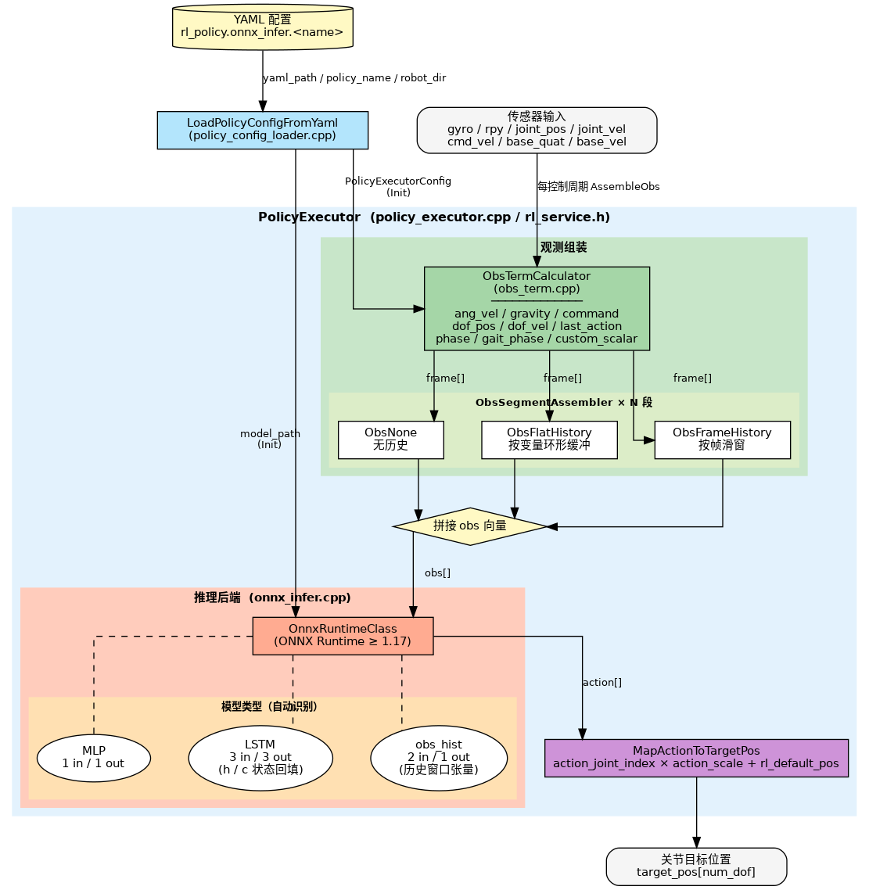

# Reinforcement Learning

> **Document type**: Algorithm and model capabilities
> **Description**: An ONNX Runtime-based RL policy inference executor that supports MLP, LSTM, and models with historical observation inputs, and provides segmented observation assembly. This document covers the module overview, environment setup, example usage, API calls, debugging, and frequently asked questions.

## 1. Overview

- **Key Features**: An ONNX Runtime-based robot RL policy inference executor. It loads policy models from YAML configuration files, assembles observation vectors (`obs`) according to the configuration, runs inference, and maps policy outputs to target joint positions. The module is completely decoupled from robot models, and all parameters are YAML-driven.
- **Core features**:
  - Supports three model structures: MLP, LSTM, and obs_hist (detected automatically; no manual specification required)
  - Segmented observation assembly: each obs segment independently configures terms and history modes (no history / flat_history / frame_history)
  - Multiple policy switching: a single configuration file can define multiple policies, which can be switched by name at runtime
  - Inference backend: currently ONNX Runtime, with the interface decoupled from the backend
- **Software architecture**:

  

- **Related directories**:

  ```
  components/model_zoo/rl/
  ├── include/
  │   └── rl_service.h                      # Only public header: PolicyExecutor, LoadedPolicyConfig, and others
  ├── src/
  │   ├── policy_executor.cpp               # Orchestration layer: Init/AssembleObs/Infer/MapAction implementation (interfaces declared in rl_service.h)
  │   ├── policy_config_loader.cpp          # YAML parsing: loads policy configuration into PolicyExecutorConfig (interfaces declared in rl_service.h)
  │   ├── obs_assembler.h                   # Abstract base class for segmented observation assemblers (pure virtual interface, header only)
  │   ├── obs_term.h / obs_term.cpp         # Observation-term calculator: numerical calculations for each term (gyro/dof_pos/phase, etc.)
  │   ├── obs_none.h / obs_none.cpp         # No-history mode assembler (empty mode)
  │   ├── obs_flat_history.h / .cpp         # Variable-grouped circular history-buffer assembler (mode: flat_history)
  │   ├── obs_frame_history.h / .cpp        # Frame-based sliding-window history-buffer assembler (mode: frame_history)
  │   └── backends/
  │       ├── onnx_infer.h                  # ONNX Runtime inference wrapper: model loading, dimension inference, and Run
  │       └── onnx_infer.cpp
  ├── cmake/
  │   └── FindONNXRuntime.cmake             # ONNX Runtime discovery script
  ├── example/
  │   ├── test_policy_executor.cpp          # Functional test: validates configuration loading, inference path, and dimension correctness
  │   ├── test_onnx_infer.cpp               # Functional test: validates ONNX Runtime backend installation and model inference
  │   ├── benchmark_onnx_infer.cpp          # Performance benchmark: isolates ORT inference latency (excluding observation assembly)
  │   └── benchmark_policy_executor.cpp     # Performance benchmark: end-to-end segmented timing for AssembleObs→Infer→MapAction
  └── scripts/
      ├── run_benchmark_onnx.sh             # Wraps benchmark_onnx_infer and locates SDK_ROOT automatically
      ├── run_benchmark_policy.sh           # Wraps benchmark_policy_executor and locates SDK_ROOT automatically
      └── pt2onnx.py                        # PyTorch→ONNX conversion script; detects MLP/LSTM/GRU automatically and externalizes state
  ```

## 2. Environment Setup

### Prerequisites

- **Runtime environment**: C++17, CMake ≥ 3.16
- **ONNX Runtime**:
  - x86_64 development machine: when `model_zoo/rl` is built with `mm` for the first time, CMake automatically downloads `onnxruntime-linux-x64-1.21.0.tgz` to `~/.cache/thirdparty/onnxruntime/onnxruntime-linux-x64-1.21.0/`. A version preinstalled in `/usr/local` or a path specified through `ONNXRUNTIME_DIR` takes priority.
  - K3 board (rv64): install the SpacemiT-customized onnxruntime

    ```bash
    # Install the customized spacemit-onnxruntime (with A100-core EP acceleration):
    apt install -y spacemit-onnxruntime python3-onnx
    
    # If the non-accelerated onnxruntime is also installed, it conflicts at runtime and must be removed:
    sudo apt remove libonnxruntime-dev libonnxruntime1.23 python3-onnxruntime
    ```

- **Other dependencies**: Eigen3 and yaml-cpp (both can be installed with apt)

    ```bash
    sudo apt install -y libeigen3-dev libyaml-cpp-dev
    ```

- **Environment variable**:

    ```bash
    source ~/spacemit_robot/build/envsetup.sh
    ```

### Build

- **Get the source code**:

  The RL component is located at `components/model_zoo/rl`. Running the examples and benchmarks also requires the repository for the corresponding robot model, which contains policy download scripts and YAML configurations. Choose one of the following retrieval methods as needed:

  1. **Retrieve a specific robot model** (using g1 as an example):

  ```bash
  repo init -u https://github.com/spacemit-robotics/manifest.git -b main -m default.xml \
    --repo-url=https://gitee.com/spacemit-robotics/git-repo \
    -g core,model_zoo_rl,humanoid_unitree_g1
  repo sync -j4
  repo start robot-dev --all
  ```

  After retrieval, run the download script for the robot model to obtain the ONNX policy model:

  ```bash
  SDK_ROOT=$(pwd) application/native/humanoid_unitree_g1/scripts/download_models_g1.sh
  ```

  2. **Retrieve all robot models at once** (obtain download scripts for all models and run the policy download for each model as needed):

  ```bash
  repo init -u https://github.com/spacemit-robotics/manifest.git -b main -m default.xml \
    --repo-url=https://gitee.com/spacemit-robotics/git-repo \
    -g core,model_zoo_rl,humanoid
  repo sync -j4
  repo start robot-dev --all
  ```

  After retrieval, run the RL policy download scripts for the required robot models (using g1 and tiangong as examples):

  ```bash
  SDK_ROOT=$(pwd) application/native/humanoid_unitree_g1/scripts/download_models_g1.sh
  SDK_ROOT=$(pwd) application/native/humanoid_tiangong/scripts/download_models_tiangong.sh
  ```

  > Robot-model group names: `humanoid_unitree_g1`, `humanoid_unitree_h1_2`, `humanoid_unitree_r1`, `humanoid_unitree_go1`, `humanoid_qinglong`, and `humanoid_tiangong`.

- **Build**:

    ```bash
    source ~/spacemit_robot/build/envsetup.sh
    cd components/model_zoo/rl
    mm
    ```

- **Build artifacts**:
  - `output/staging/lib/librl.so` — Inference library
  - `output/staging/bin/test_policy_executor` — Full interface functional test
  - `output/staging/bin/test_onnx_infer` — ONNX backend functional test
  - `output/staging/bin/benchmark_onnx_infer` — Pure-inference performance benchmark
  - `output/staging/bin/benchmark_policy_executor` — Full-path performance benchmark
  - `output/staging/bin/run_benchmark_onnx.sh` — Pure-inference benchmark launcher
  - `output/staging/bin/run_benchmark_policy.sh` — Full-path benchmark launcher

## 3. Example Usage (From Scratch)

### 3.1 End-to-End Policy Inference Test

Validates the complete flow of configuration loading, obs assembly, inference, and action mapping.

**Prerequisites**:

1. The RL component has been built with `mm`, and `output/staging/bin/test_policy_executor` has been generated.

2. Confirm that the repository source for the target robot model is available. The corresponding model YAML is provided in the source tree, for example `application/native/humanoid_unitree_g1/config/g1.yaml`.

3. Obtain the policy model (`.onnx`) by running the following download script from the repository root. This example uses g1; replace `g1` for other robot models:

```bash
SDK_ROOT=$(pwd) application/native/humanoid_unitree_g1/scripts/download_models_g1.sh
```

This command downloads the g1 RL policy model to subdirectories under `application/native/humanoid_unitree_g1/policy/`.

**Step 1**: Enter the spacemit_robot root directory

```bash
cd ~/spacemit_robot
```

**Step 2**: Run the test (using the g1 motion policy as an example)

```bash
./output/staging/bin/test_policy_executor \
  application/native/humanoid_unitree_g1/config/g1.yaml \
  motion \
  application/native/humanoid_unitree_g1
```

Parameters: `<yaml path> <policy_name> <robot_dir>`. `robot_dir` is used to resolve relative model paths in the YAML file.

**Expected output**:

```
[test] 加载配置: application/native/humanoid_unitree_g1/config/g1.yaml, policy: motion, robot_dir: application/native/humanoid_unitree_g1
[test] 初始化 PolicyExecutor
[ONNX Runtime] ...（模型加载日志）
[PolicyExecutor] LSTM 模型: obs_dim=47, action_dim=12, h_dim=64, c_dim=64
[PolicyExecutor] 段式观测: 1 段, 计算维度=47, 模型输入维度=47
  段[0] mode=(none), frame_dim=47, output_dim=47, terms=[ang_vel,gravity,command,dof_pos,dof_vel,last_action,phase]

========================================
  测试 1: 模型属性查询接口
========================================
  观测维度: 47
  动作维度: 12
  是否为 LSTM 模型: 是
  是否使用 obs_hist 输入: 否

========================================
  测试 2: 观测组装、推理、动作映射
========================================
  执行 5 帧推理循环...
    Frame 0: obs_dim=47 action_dim=12 target_pos_dim=29
    Frame 1: obs_dim=47 action_dim=12 target_pos_dim=29
    Frame 2: obs_dim=47 action_dim=12 target_pos_dim=29
    Frame 3: obs_dim=47 action_dim=12 target_pos_dim=29
    Frame 4: obs_dim=47 action_dim=12 target_pos_dim=29

========================================
  测试 3: 单帧详细推理流程
========================================
  观测向量维度: 47 (期望: 47)
  ✓ 观测维度正确
  动作输出维度: 12 (期望: 12)
  ✓ 动作维度正确
  关节目标位置数量: 29 (期望: 29)
  ✓ 关节维度正确

========================================
✓ 所有测试成功！
========================================
```

### 3.2 Standalone ONNX Backend Test

Feeds random tensors directly to the inference engine to validate ONNX Runtime inference capability. Supports both single-model testing and batch scanning.

**Prerequisites**: The policy model must be downloaded. See the download steps in [Section 3.1 prerequisites](#31-end-to-end-policy-inference-test).

**Single-model test**:

```bash
./output/staging/bin/test_onnx_infer \
  application/native/humanoid_unitree_g1/policy/motion/motion.onnx --random
```

**Expected output** (key information excerpt):

```
========== ONNX 模型信息 ==========
输入数量: 3
  [0] obs: [1, 47] (total: 47)
  [1] h_in: [1, 1, 64] (total: 64)
  [2] c_in: [1, 1, 64] (total: 64)
输出数量: 3
  [0] action: [1, 12] (total: 12)
  [1] h_out: [1, 1, 64] (total: 64)
  [2] c_out: [1, 1, 64] (total: 64)
===================================

[test] 执行推理 (50 次迭代)...
[test] 推理完成. 平均耗时: 0.023 ms, Min: 0.018 ms, Max: 0.198 ms

[test] 测试成功
```

**Batch scan** (scans all `.onnx` files under a specified directory and forks child processes to prevent a crash from affecting the main process):

```bash
./output/staging/bin/test_onnx_infer --scan application/native/humanoid_unitree_g1
```

**Expected output** (key information excerpt):

```
=========================================================================================
  ONNX 推理批量测试报告
=========================================================================================

------------------------------------------------------------------------------------------
  [ PASS ]  .../policy/motion/motion.onnx
  │
  ├─ 输入(3): obs[1,47]  h_in[1,1,64]  c_in[1,1,64]
  ├─ 输出(3): action[1,12]  h_out[1,1,64]  c_out[1,1,64]
  └─ 推理耗时 (Avg/Min/Max): 0.02 / 0.02 / 0.19 ms (50 次迭代)

------------------------------------------------------------------------------------------
  [ PASS ]  .../policy/tracking/tracking.onnx
  │
  ├─ 输入(2): obs[1,160]  time_step[1,1]
  ├─ 输出(7): actions[1,29]  joint_pos[1,29]  joint_vel[1,29]  ...
  └─ 推理耗时 (Avg/Min/Max): 0.05 / 0.03 / 0.63 ms (50 次迭代)

=========================================================================================
  共 4 个模型    通过: 4    失败: 0
=========================================================================================
```

### 3.3 Performance Benchmarking

Evaluates real-time RL inference on the K3 board using two benchmarks: pure inference and the full path.

**Prerequisites**: The policy model must be downloaded. See the download steps in [Section 3.1 prerequisites](#31-end-to-end-policy-inference-test).

**Pure-inference benchmark** (isolates ONNX Runtime performance, excluding obs assembly and action-mapping overhead):

```bash
run_benchmark_onnx.sh g1 motion
```

**Full-path benchmark** (segmented timing of AssembleObs → Infer → MapActionToTargetPos):

```bash
run_benchmark_policy.sh g1 motion
```

The scripts can be called from any directory and determine the SDK root automatically. For details, see [Appendix: Performance Benchmarking](#appendix-performance-benchmarking).

## 4. Application Development

This chapter introduces the core interfaces and integration methods for the RL module.

**Complete example code**: [components/model_zoo/rl/example/test_policy_executor.cpp](../../../components/model_zoo/rl/example/test_policy_executor.cpp)

**Detailed API documentation**: [components/model_zoo/rl/README.md](../../../components/model_zoo/rl/README.md)

### Public Interface

Header: `include/rl_service.h`; library: `librl.so`

### Call Flow

```cpp
#include "rl_service.h"
using namespace rl_policy;

// 1. Load the policy configuration from YAML
LoadedPolicyConfig cfg = LoadPolicyConfigFromYaml(yaml_path, policy_name, robot_dir);

// 2. Initialize the executor (inference-related configuration only)
PolicyExecutor policy;
policy.Init(cfg.exec_cfg);

// 3. Each control cycle: assemble observations → infer → map actions
Eigen::VectorXf obs;
policy.AssembleObs(gyro, rpy, cmd_vx, cmd_vy, cmd_wz,
                   joint_pos, joint_vel, base_quat, base_vel, dt, obs);

std::vector<double> action;
policy.Infer(obs, action);

std::vector<double> target_pos(num_dof, 0.0);
policy.MapActionToTargetPos(action, target_pos);

// 4. The upper layer adds the policy training gains to the control command (PolicyExecutor does not use kp/kd)
ctrl_cmd.kp = cfg.kp;
ctrl_cmd.kd = cfg.kd;
```

> `cfg.exec_cfg` is used by `PolicyExecutor.Init` and contains all configuration required for inference, including the model path, observation segments, and scales.
> `cfg.kp / cfg.kd` are not passed to `PolicyExecutor`. The caller, such as `behavior_manager` or `control_sim2sim_runtime`, fills them into `ControlCmd` when assembling each frame and sends them with the control command to the driver layer. When switching policies, the caller also switches and sends the corresponding kp/kd values. This binds each policy to the PD gains used during its training and avoids dynamic mismatches caused by sharing one set of PD gains across different policies.

### Key Interface Descriptions

| API | Description |
| --- | --- |
| `LoadPolicyConfigFromYaml(yaml, name, robot_dir)` | Parses the `rl_policy.onnx_infer.policies.<name>` node in YAML and returns `LoadedPolicyConfig`, including the inference `exec_cfg`, the policy's training-time PD gains `kp / kd`, and initial command values such as `command_init` |
| `Init(cfg)` | Loads the ONNX model and initializes the observation assembler and LSTM state |
| `ObsDim()` / `ActionDim()` | Queries the observation and action vector dimensions |
| `HasLstm()` / `HasObsHist()` | Queries the model structure, including whether it has LSTM or obs_hist inputs |
| `PrintModelInfo()` | Prints model information, including input/output dimensions and LSTM/obs_hist state |
| `AssembleObs(...)` | Assembles the observation vector according to the segment configuration and maintains the history buffer internally |
| `Infer(obs, action)` | Runs inference and automatically dispatches MLP, LSTM, or obs_hist models |
| `MapActionToTargetPos(action, target_pos)` | Maps policy outputs to full-body joint positions according to `action_joint_index` |
| `SetCustomScalar(name, val)` / `GetCustomScalar(name)` | Sets/gets custom scalars, such as the `"z"` phase or `"stand_flag"` flag. Call it before AssembleObs; initial values are configured through YAML `custom_scalar_defaults` |

### YAML Configuration Structure (Key Fields)

```yaml
rl_policy:
  onnx_infer:
    policies:
      motion:                              # policy_name
        model_path: "policy/motion/policy.onnx"   # Relative to robot_dir
        action_scale: [0.25]
        rl_default_pos: [...]              # Size = num_dof; initial joint positions used when training this policy
        action_joint_index: [0,1,...,11]   # Index mapping from policy actions to joints
        kp: [...]                          # PD proportional gains used when training this policy (size = num_dof)
        kd: [...]                          # PD derivative gains used when training this policy

        # Observation segment configuration
        obs_segments:
          - terms: [ang_vel, gravity, command, dof_pos, dof_vel, last_action, phase]
            mode: ""                       # No history
          - terms: [dof_pos, dof_vel]
            mode: "flat_history"           # Variable-grouped history
            length: 10                     # Number of historical frames
            order: "oldest_first"          # History ordering direction

        # Custom scalar default values
        custom_scalar_defaults:
          z: 0.0
          stand_flag: 0.0

        # Dimension validation
        strict_obs_dim_check: true

        # Command configuration (can be overridden at the policy level)
        command:
          scale: [2.0, 2.0, 0.25]          # [vx, vy, wz] scale factors
          init: [0.0, 0.0, 0.0]            # Initial velocity command

        # Inference decimation
        infer_decimation: 4                # Run inference once every 4 control cycles

      dance:
        # All fields from motion ...
        prerequisite:                      # Optional: prerequisite policy chain
          policy: stand                    # Run stand before switching to dance
          duration: 2.0                    # Duration (seconds); the upper layer, such as behavior_manager, automatically switches to dance when it expires
```

> `kp / kd` are the actual PD gains used during policy training. After parsing by `LoadPolicyConfigFromYaml`, they are returned together with `LoadedPolicyConfig.kp / kd` for the upper layer (`behavior_manager` or `sim2sim_runtime`) to fill into `ControlCmd.kp / kd` on each frame and send to the driver layer. `prerequisite` is a policy-chain scheduling hint for the upper layer, such as the FSM; PolicyExecutor inference itself does not read this field.

## 5. Debugging Guide

- **Inspect model structure**: Use `test_onnx_infer <model.onnx>` to view model input/output dimensions and types.
- **Validate the inference path**: Use `test_policy_executor` to validate the complete flow of configuration loading, obs assembly, inference, and action mapping.
- **Analyze performance**: Use `run_benchmark_policy.sh` to view the latency of each stage and identify performance bottlenecks.
- **Debug observation dimensions**:
  - Run `test_policy_executor` to view the actual assembled obs dimension.
  - Compare it with the expected dimension returned by `ObsDim()`.
  - Check that the YAML `obs_segments` configuration matches the training configuration.

## 6. FAQ

| Symptom | Possible Cause | Resolution |
| --- | --- | --- |
| `[PolicyConfigLoader] Policy 'xxx' configuration does not exist` | The policy name is not present under `rl_policy.onnx_infer.policies` in YAML | Check the YAML configuration, confirm the policy name spelling, and view the `policy_names` list |
| `[PolicyConfigLoader] ONNX model file does not exist` | The `model_path` is incorrect or the file is missing | Check whether `robot_dir/policy/<policy_name>/<model>.onnx` exists and confirm the `model_path` configuration |
| `[PolicyExecutor] Observation dimension mismatch` | With `strict_dim_check: true`, the obs dimension configured in YAML does not match the model input | Run `test_policy_executor` to view the actual dimension, compare it with the training obs configuration, and adjust `obs_segments[].terms` |
| `[PolicyExecutor] Observation dimension error: actual=X, expected=Y` | The obs dimension passed to `Infer()` does not match `ObsDim()` | Check the output of `AssembleObs()` and ensure the obs vector was not modified unexpectedly |
| `[PolicyExecutor] Unknown segment mode: xxx` | YAML `segment_mode` contains an unsupported value | Only `""` (no history), `"flat_history"`, and `"frame_history"` are supported; check the spelling |
| `[PolicyExecutor] Unsupported model type` | The ONNX model input/output counts do not match the MLP/LSTM/obs_hist conventions | Check the model export: MLP (1in/1out), LSTM (3in/3out), obs_hist (2in/1out); use `test_onnx_infer` to inspect the model structure |
| Robot jitter or abnormal actions | Normalization parameters differ from training, or `action_scale` is too large | Compare `ang_vel_scale` / `dof_pos_scale` / `dof_vel_scale` with the training configuration and test with a lower `action_scale` |

## Appendix: Performance Benchmarking

### Tool Overview

| Script | Test Content | Use Case |
| --- | --- | --- |
| `run_benchmark_onnx.sh` | Pure ONNX inference latency | Compare inference-engine performance across hardware and model structures |
| `run_benchmark_policy.sh` | Segmented latency for AssembleObs + Infer + MapActionToTargetPos | Evaluate end-to-end performance in real robot-control scenarios and identify bottlenecks |

**Parameter Descriptions**:

| Parameter | Description | Default |
| --- | --- | --- |
| `robot` | Robot model name | `g1` |
| `policy` | Policy name | `motion` |
| `--warmup N` | Warm-up rounds to eliminate first-load overhead | `100` |
| `--rounds N` | Number of rounds for final statistics | `1000` |
| `--hz N` | Target control frequency, used to calculate the deadline and timeout rate | `50` |
| `--verbose` | Print per-frame latency to troubleshoot spikes | Disabled |

**Output Metrics**:

| Metric | Meaning |
| --- | --- |
| Avg | Average latency |
| Std | Standard deviation, reflecting latency dispersion |
| P50 | Median; 50% of inferences are faster |
| P95 | 95% of inferences are faster; represents a typical worst case |
| P99 | 99% of inferences are faster; represents extreme tail latency |
| Max | Worst single-case latency |
| Miss | Number and percentage of frames exceeding the deadline (`1000 / hz ms`) |

> RL control is a hard real-time closed loop, so P99 is more important than the average: control-loop jitter can be amplified by PD control into joint vibration, and P99 determines the upper limit of system stability.

### Test Commands

```bash
# Default parameters (g1 + motion, 100 warmup + 1000 rounds, 50 Hz deadline)
run_benchmark_onnx.sh
run_benchmark_policy.sh

# Custom parameters
run_benchmark_policy.sh g1 motion --rounds 2000          # Increase test rounds for better statistical accuracy
run_benchmark_policy.sh g1 motion --warmup 200           # Increase warm-up rounds to eliminate cold-start effects
run_benchmark_policy.sh tiangong walk                    # Test another robot model/policy
```

### Typical Data

**Pure-inference benchmark (`run_benchmark_onnx.sh g1 motion`):**

| Platform | Policy | Avg (ms) | Std (ms) | P50 (ms) | P95 (ms) | P99 (ms) | Max (ms) | Miss (50Hz) |
| --- | --- | --- | --- | --- | --- | --- | --- | --- |
| K3 COM260 KIT | g1 / motion | 0.178 | 0.003 | 0.177 | 0.179 | 0.190 | 0.224 | 0 / 1000 (0.00%) |

**Full-path benchmark (`run_benchmark_policy.sh g1 motion`):**

| Platform | Stage | Avg (ms) | P50 (ms) | P95 (ms) | P99 (ms) | Max (ms) |
| --- | --- | --- | --- | --- | --- | --- |
| K3 COM260 KIT | Obs Assembly | 0.016 | 0.016 | 0.016 | 0.016 | 0.058 |
| K3 COM260 KIT | Inference | 0.196 | 0.195 | 0.203 | 0.208 | 0.268 |
| K3 COM260 KIT | Action Mapping | 0.004 | 0.004 | 0.004 | 0.004 | 0.011 |
| K3 COM260 KIT | **End-to-End** | **0.215** | **0.214** | **0.223** | **0.228** | **0.329** |
| | **Miss (50Hz)** | **0 / 1000 (0.00%)** | | | | |

> **Performance analysis**: On the K3 COM260 KIT board, inference latency for the g1 motion policy (an LSTM model) is approximately 0.2 ms, end-to-end latency is approximately 0.22 ms, and inference accounts for 91% of the end-to-end time. This meets the 50 Hz real-time control requirement (20 ms deadline).
