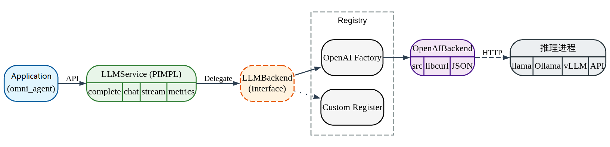
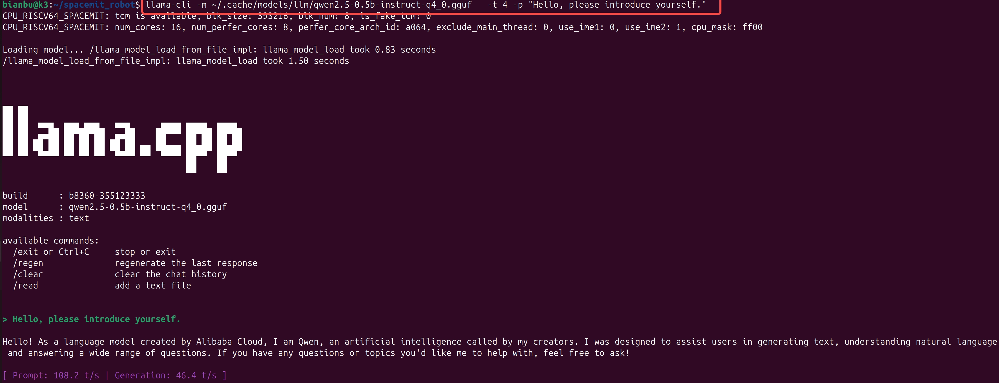
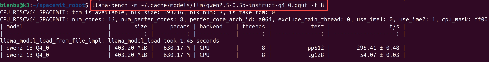
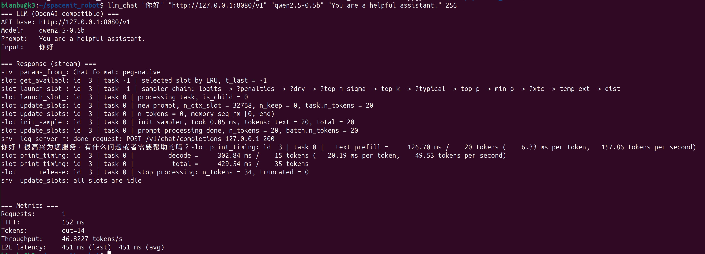

# LLM

## 1. Overview

The LLM module provides a unified C++ interface for calling LLMs, so that you can build upper-layer applications in C++ and integrate conversation, inference, and tool-calling capabilities into robot applications. It supports single-turn and multi-turn interaction, streaming output, and Tool Calling.

The following diagram shows the software layers of `spacemit_robot/components/model_zoo/llm`; the call direction is from left to right.




Code directory structure:

  ```text
  components/model_zoo/llm/
  ├── include/llm_service.h   # Public C++ API (PIMPL)
  ├── src/      # Backend implementations and factory
  ├── example/cpp/     # Examples, including llm_chat
  ├── scripts/bench_llm.sh    # Benchmark script (starts llama-server and runs llm_chat)
  └── README.md # Component README (usage and model-download instructions)
  ```

## 2. Environment Setup

### 2.1 Get the Source Code

For instructions on obtaining the SDK source code and configuring the basic build environment, see [2.3-Building and Compilation](../02-快速入门/2.3-构建编译.md). After initializing the SDK, return to this document and continue with Section 2.2.

Unless noted otherwise, run the following commands from the `spacemit_robot` SDK root directory.

### 2.2 One-Step Build

```bash
source build/envsetup.sh

cd components/model_zoo/llm/

mm
```

The first build checks the system dependencies and prompts you to install any missing packages. After the build completes, the `llm_chat` example application is generated and installed to `output/staging/bin`.


### 2.3 Download Model (GGUF)

GGUF is currently the main supported model format. Keep all models in the default directory so that the examples and applications can share them:

```bash
mkdir -p ~/.cache/models/llm
cd ~/.cache/models/llm
```

- **SpacemiT mirror (recommended)**: [LLM (GGUF) model directory — archive.spacemit.com](https://archive.spacemit.com/spacemit-ai/model_zoo/llm/)

Example (download a small model for quick verification; you can download and test additional models as needed):

```bash
wget https://archive.spacemit.com/spacemit-ai/model_zoo/llm/qwen2.5-0.5b-instruct-q4_0.gguf
```

- **Hugging Face (optional)**: Search for GGUF on the model page and download the `.gguf` file to `~/.cache/models/llm`.

## 3. Example Usage

### 3.1 Verify Model and Run Basic Conversation

This section demonstrates LLM functionality using the `llama-cli` and `llama-bench` applications provided by llama.cpp. Both commands come from the `llama.cpp-tools-spacemit` package. If you see `command not found`, first complete the dependency check described in Section 2.2, or install the package directly.

**Step 1**: Run a conversation to verify the setup:

```bash
llama-cli -m ~/.cache/models/llm/qwen2.5-0.5b-instruct-q4_0.gguf \
  -t 4 -p "Hello, please introduce yourself."
```




**Step 2 (optional)**: Run a quick benchmark:

```bash
llama-bench -m ~/.cache/models/llm/qwen2.5-0.5b-instruct-q4_0.gguf -t 8
```



### 3.2 Use Application `llm_chat`

Before proceeding, complete the build in Section 2.2 to generate the `llm_chat` executable and download a model as described in Section 2.3.

**Step 1**: Start an OpenAI-compatible local service (using port 8080 as an example):

```bash
llama-server -m ~/.cache/models/llm/qwen2.5-0.5b-instruct-q4_0.gguf -t 4 --port 8080 &
```

After the service starts, verify that it is available with the following command:

```bash
curl -s http://127.0.0.1:8080/v1/models
```

**Step 2**: Run the `llm_chat` example:

```bash
llm_chat "Hello" "http://127.0.0.1:8080/v1" "qwen2.5-0.5b" "You are a helpful assistant." 256
```




## 4. Application Development

This chapter is intended for application developers and explains how to integrate the LLM component into your own C++ application. The authoritative interface definition is `components/model_zoo/llm/include/llm_service.h`; this section covers only the commonly used public interfaces and typical calling patterns.

### 4.1 API Reference

The main entry point of the LLM component is `spacemit_llm::LLMService`. Applications use this class to connect to an OpenAI-compatible LLM service and issue single-turn generation, multi-turn conversation, streaming-output, and Tool Calling requests.

#### 4.1.1 Common Data Structures

| Type | Description |
| --- | --- |
| ChatMessage | A multi-turn conversation message supporting four roles: System, User, Assistant, and Tool. |
| ChatResult | Result of a multi-turn streaming call. Contains `content`, `tool_calls_json`, `cancelled`, and `error`; use `HasToolCalls()` to determine whether tool calls are included. |
| Metrics | Performance metrics, including request count, processing status, end-to-end latency, TTFT, output token count, and tokens/s. |

#### 4.1.2 Service Initialization

| API | Description | Parameters | Return Value |
| --- | --- | --- | --- |
| LLMService | Creates an OpenAI-compatible HTTP backend client for connecting to a local `llama-server`, a remote vLLM service, or another service compatible with the OpenAI API. | `model`: model name; `api_base`: service URL; `api_key`: authentication key, which can be empty for a local service; `prompt`: default system prompt; `max_tokens`: maximum number of output tokens. | `LLMService` instance |
| LLMService | Reserved custom-backend initialization interface for advanced scenarios with a registered custom backend. Ordinary applications should prefer the OpenAI-compatible HTTP constructor. | `config_dir`: backend configuration directory; `prompt`: default system prompt; `max_tokens`: maximum number of output tokens. | `LLMService` instance |

#### 4.1.3 Text Generation and Conversation

| API | Description | Parameters | Return Value |
| --- | --- | --- | --- |
| `complete` | Synchronous single-turn generation. The call blocks until the model returns the complete result. | `user_text`: user input; `prompt`: optional system prompt; the default prompt is used when empty. | `std::string`; returns the complete response text on success or an `Error: ...` message on failure |
| `complete_async` | Asynchronous single-turn generation for simple question-and-answer scenarios where blocking the current thread is undesirable. | `user_text`: user input; `callback`: completion callback receiving `result` and `error`; `prompt`: optional system prompt. | No direct return value; the result is delivered through the callback |
| `complete_stream` | Single-turn streaming generation, for interactions that display or speak the output while it is being generated and that support interruption. | `user_text`: user input; `callback`: streaming callback that receives `chunk`, `is_finished`, and `error`; `prompt`: optional system prompt. Return `false` from the callback to cancel generation. | No direct return value; output is returned in chunks through the callback |
| `chat` | Synchronous multi-turn conversation for scenarios that retain conversation context. | `messages`: list of `ChatMessage` objects containing messages with roles such as system, user, assistant, and tool. | `std::string`; returns the complete response text on success or an `Error: ...` message on failure |
| `chat_stream` | Streaming multi-turn conversation with Tool Calling for agents, tool integration, and robot-control scenarios. | `messages`: conversation context; `callback`: streaming callback; `tools_json`: tool definitions in OpenAI tools format, which can be empty. | `ChatResult`, containing response text, tool calls, cancellation status, and error information |

#### 4.1.4 Runtime Configuration and State

| API | Description | Parameters | Return Value |
| --- | --- | --- | --- |
| `update_prompt` | Updates the default system prompt at runtime and can also update the maximum number of output tokens. | `new_prompt`: new default prompt; `max_tokens`: optional, updated only when greater than 0; otherwise, the current value is retained. | None |
| `update_model` | Switches the model name at runtime. | `new_model`: new model name. | None |
| `update_api_settings` | Switches the API service URL or authentication key at runtime. Available only in OpenAI API mode. | `api_base`: new service URL; `api_key`: new authentication key. | None |
| `get_metrics` | Retrieves performance metrics for the most recent request to help troubleshoot latency, TTFT, and throughput. | None. | `Metrics` |
| `get_backend_type` | Retrieves the current backend type. | None. | `BackendType` |

### 4.2 Usage Examples

The following examples assume that `llama-server` is already running; see Section 3.2 for the startup procedure. Except in Section 4.2.1, the examples also assume that a `spacemit_llm::LLMService llm` instance has already been created.

To link the LLM component from your own C++ component inside the SDK, refer to `components/model_zoo/llm/example/cpp/CMakeLists.txt`. Building the LLM component installs `llm_service.h` and `libllm_service_cpp.so` into the SDK's `output/staging`, and the SDK build system passes that installation prefix when it builds downstream components.

The downstream component's `CMakeLists.txt` can locate and link the LLM library as follows:

```cmake
add_executable(llm_app main.cpp)

find_library(LLM_SERVICE_LIB NAMES llm_service_cpp
    PATHS ${CMAKE_INSTALL_PREFIX}/lib NO_DEFAULT_PATH)
find_path(LLM_SERVICE_INCLUDE_DIR NAMES llm_service.h
    PATHS ${CMAKE_INSTALL_PREFIX}/include NO_DEFAULT_PATH)
if(NOT LLM_SERVICE_LIB OR NOT LLM_SERVICE_INCLUDE_DIR)
    message(FATAL_ERROR "llm_service_cpp not found. Build components/model_zoo/llm first.")
endif()

target_include_directories(llm_app PRIVATE ${LLM_SERVICE_INCLUDE_DIR})
target_link_libraries(llm_app PRIVATE ${LLM_SERVICE_LIB})
```

For package dependencies, declare `<depend>llm</depend>` in the current component's `package.xml`. The build system then builds and installs the LLM component before the current application component whenever you build with `m` or `mm`.

#### 4.2.1 Single-Turn Synchronous Question Answering

Use cases: simple command parsing, one-time text generation, and tasks that do not require real-time output.

Steps:

1. Create an `LLMService` instance and specify the model name, API URL, API key, default prompt, and maximum number of output tokens.
2. Call `complete()` to obtain the complete response.
3. Process the returned text according to the application's requirements.

```cpp
#include <iostream>
#include "llm_service.h"

int main() {
    spacemit_llm::LLMService llm(
        "qwen2.5-0.5b",
        "http://127.0.0.1:8080/v1",
        "",
        "You are a helpful assistant.",
        256);

    std::string reply = llm.complete("Hello, please introduce K3 in one sentence.");
    std::cout << reply << std::endl;
    return 0;
}
```

#### 4.2.2 Streaming Output and Cancellation

Use cases: displaying text progressively in a chat window, speaking text with TTS as it is generated, and allowing the user to interrupt generation.

Steps:

1. Create an `LLMService` instance.
2. Call `complete_stream()`.
3. Process each `chunk` in the callback.
4. Return `false` from the callback to cancel generation when needed.

On the OpenAI HTTP backend, `complete_stream()` starts a background thread. Before the application exits or reads performance metrics, it must wait until the callback receives `is_finished=true`. For a complete waiting pattern, see `components/model_zoo/llm/example/cpp/llm_chat.cpp`.

```cpp
bool stop_requested = false;

llm.complete_stream(
    "Write a welcome message for a robot assistant.",
    [&](const std::string& chunk, bool is_finished, const std::string& error) {
        if (!error.empty()) {
            std::cerr << "LLM error: " << error << std::endl;
            return false;
        }

        if (!chunk.empty()) {
            std::cout << chunk << std::flush;
        }

        if (stop_requested) {
            return false;
        }

        return !is_finished;
    });
```

#### 4.2.3 Multi-Turn Conversation

Use cases: continuous question answering with retained context, robot task confirmation, and multi-turn planning.

Steps:

1. Use `ChatMessage::System()` to define the role or behavioral constraints.
2. Append a `ChatMessage::User()` message after each user input.
3. Call `chat()` or `chat_stream()`.
4. Append the model response as a `ChatMessage::Assistant()` message.
5. Limit the history length to prevent unbounded context growth.

```cpp
using spacemit_llm::ChatMessage;

std::vector<ChatMessage> messages;
messages.push_back(ChatMessage::System("You are a robot assistant."));
messages.push_back(ChatMessage::User("What can you do?"));

std::string answer = llm.chat(messages);
messages.push_back(ChatMessage::Assistant(answer));

messages.push_back(ChatMessage::User("Please say that again more briefly."));
std::string short_answer = llm.chat(messages);
```

#### 4.2.4 Tool Calling

Use cases: agents, robot control, querying external state, and calling application tools.

Steps:

1. Prepare the conversation context in `messages`.
2. Prepare `tools_json` in the OpenAI tools format.
3. Call `chat_stream(messages, callback, tools_json)`.
4. If `ChatResult::HasToolCalls()` returns `true`, parse `tool_calls_json`.
5. Execute the corresponding tool in the application layer.
6. Append the tool result to the context with `ChatMessage::Tool()`.
7. Call `chat()` or `chat_stream()` again so that the model can generate a final response based on the tool result.

`tools_json` must be a valid JSON array in the OpenAI tools format. If the format is invalid, the backend ignores the tool definitions.

```cpp
using spacemit_llm::ChatMessage;

std::vector<ChatMessage> messages = {
    ChatMessage::System("You are a robot assistant."),
    ChatMessage::User("Check the robot's current battery level.")
};

std::string tools_json = R"([
  {
    "type": "function",
    "function": {
      "name": "get_battery_status",
      "description": "Get current robot battery status",
      "parameters": {
        "type": "object",
        "properties": {}
      }
    }
  }
])";

auto result = llm.chat_stream(
    messages,
    [](const std::string& chunk, bool is_done, const std::string& error) {
        if (!error.empty()) {
            std::cerr << error << std::endl;
            return false;
        }
        if (!chunk.empty()) {
            std::cout << chunk << std::flush;
        }
        return !is_done;
    },
    tools_json);

if (result.HasToolCalls()) {
    // The application layer parses result.tool_calls_json, obtains the actual tool_call_id, and executes the corresponding tool.
    std::string tool_call_id = "<id parsed from result.tool_calls_json>";
    std::string tool_result = R"({"battery": 86, "status": "normal"})";

    messages.push_back(ChatMessage::Assistant(result.content, result.tool_calls_json));
    messages.push_back(ChatMessage::Tool(tool_result, tool_call_id));

    std::string final_answer = llm.chat(messages);
    std::cout << final_answer << std::endl;
}
```

The LLM component is responsible only for passing the tool definitions to the model and returning the tool-call requests that the model generates. Validating tool parameters, enforcing permissions, operating physical devices, and feeding results back into the conversation are the responsibility of the application layer.

#### 4.2.5 Reading Performance Metrics

Use cases: measuring model response speed, identifying time-to-first-token latency, and comparing different models or thread-count configurations.

Steps:

1. Complete a call to `complete()`, `complete_stream()`, `chat()`, or `chat_stream()`. When using `complete_stream()`, wait until the callback receives `is_finished=true`.
2. Call `get_metrics()`.
3. Record end-to-end latency, TTFT, and throughput.

```cpp
auto metrics = llm.get_metrics();

std::cout << "requests: " << metrics.total_requests << std::endl;
std::cout << "latency(ms): " << metrics.last_latency_ms << std::endl;
std::cout << "ttft(ms): " << metrics.last_ttft_ms << std::endl;
std::cout << "tokens/s: " << metrics.last_tokens_per_second << std::endl;
```


## 5. Debugging Guide

1. Check whether `llama-server` is ready.

   ```bash
   curl -s http://127.0.0.1:<port>/v1/models
   ```

2. Common `llama-server` startup parameters


   - Specify the number of threads: `-t <threads>`. On the K3 platform, do not use more than 8 threads.
   - Specify the port: `--port <port>`.
   - Specify the model path: `-m <path/to/model.gguf>`.


## 6. FAQ

| Symptom | Possible Cause | Resolution |
| --- | --- | --- |
| `llama-server` / `llama-cli` / `llama-bench`: `command not found` | `llama.cpp-tools-spacemit` is not installed or is not included in `PATH` | Run `sudo apt-get install llama.cpp-tools-spacemit`. |
| `llm_chat` cannot connect | `api_base` is incorrect or the service is not running | Confirm `http://127.0.0.1:<port>/v1`. |
| Output is slow or stutters | Too few threads, an oversized model, or insufficient device resources | Increase `-t`, use a smaller model, and check the cooling and power-management settings. |
| Tool Calling does not work | Parameters are not supplied in the OpenAI tools format, or the backend does not support it | Check the `tools_json` format or switch to a backend that supports function calling. |

## Appendix: Performance and Test Data

See [Bianbu Developer Center · AILab](https://developer.bianbu.xyz/ailab) for details.
