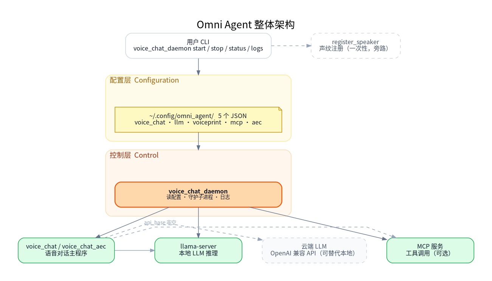
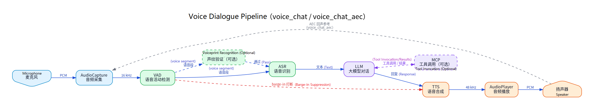

# Agent

## 1. Overview

`omni_agent` is the end-to-end voice conversation application in the SDK, located at `application/native/omni_agent`. It combines audio capture, VAD, ASR, LLM, TTS, voiceprint verification, and MCP tool calling into a complete voice assistant. For user side, `voice_chat_daemon` is the only entry point you need: it initializes the configuration, selects audio devices, manages the local or cloud LLM service, handles voiceprint registration and verification, launches MCP tool services, and takes care of logging and process management.

### 1.1 Overall Architecture



The diagram is organized into four layers. Users enter through the top-level CLI. The daemon then reads five JSON configuration files from the configuration layer and starts the service layer, which contains `llama-server`, the `voice_chat` or `voice_chat_aec` main program, and any optional MCP tool services. Cloud LLM access and voiceprint registration branch off as side paths.

### 1.2 Voice Conversation Pipeline



The diagram shows how voice data flows inside the `voice_chat` or `voice_chat_aec` process. Audio is captured from the microphone, and VAD detects where speech starts and stops. The captured speech optionally passes through voiceprint verification, then goes to ASR for text recognition. The recognized text is passed to the LLM, which generates a response and calls MCP tools when necessary. Finally, TTS synthesizes the response and plays it through the speaker.

VAD keeps running during TTS playback: if it detects sustained speech, it triggers barge-in and interrupts playback. In `voice_chat_aec` mode, the speaker output is also fed back to the capture side as an echo reference so that WebRTC AEC3 can remove the echo.

### 1.3 Main Component Dependencies

| Component | Path | Purpose |
| --- | --- | --- |
| audio | `components/multimedia/audio` | Audio capture, playback, and resampling. |
| VAD | `components/model_zoo/vad` | Silero VAD for detecting speech start, stop, and barge-in. |
| ASR | `components/model_zoo/asr` | Speech-recognition backends such as SenseVoice. |
| TTS | `components/model_zoo/tts` | Speech synthesis with Matcha-TTS or Kokoro. |
| voiceprint | `components/model_zoo/voiceprint` | Optional speaker verification. |
| MCP | `components/agent_tools/mcp` | Optional tool-calling client. |

## 2. Build

The Agent uses the `target/k3-com260-omni-agent.json` target configuration. To build the full target:

```bash
source build/envsetup.sh
lunch k3-com260-omni-agent
m
```

When modifying only the Agent code, you can build just `omni_agent`:

```bash
source build/envsetup.sh
lunch k3-com260-omni-agent
cd application/native/omni_agent
mm
```

To enable the software AEC internal mode, set `USE_AEC` when building:

```bash
cd application/native/omni_agent
mm -DUSE_AEC=ON
```

Common CMake options:

| Option | Default | Description |
| --- | --- | --- |
| `USE_MCP` | `ON` | Enable MCP tool-calling support. |
| `USE_AEC` | `OFF` | Build the software AEC internal mode; disabled by default. |
| `USE_VP` | `ON` | Enable voiceprint verification support. |

After the build completes, the user entry point `voice_chat_daemon` is installed to `output/staging/bin`. Once you have sourced `build/envsetup.sh`, you can run it directly.

## 3. Quick Start

`voice_chat_daemon` initializes any missing configuration files, manages the local LLM service, starts the voice conversation process, and writes logs to `~/.cache/omni_agent/logs/`. It does not download LLM models for you, so before the first startup you must either prepare a local model or point `llm.json` at a cloud OpenAI-compatible API.

When using the default local LLM:

```bash
mkdir -p ~/.cache/models/llm
wget -O ~/.cache/models/llm/qwen2.5-0.5b-instruct-q4_0.gguf \
    https://archive.spacemit.com/spacemit-ai/model_zoo/llm/qwen2.5-0.5b-instruct-q4_0.gguf
```

When using a cloud LLM, first generate the configuration, then edit `llm.json`:

```bash
voice_chat_daemon config-init
vi ~/.config/omni_agent/llm.json
```

Then start the daemon:

```bash
voice_chat_daemon start
voice_chat_daemon status
voice_chat_daemon logs
voice_chat_daemon stop
```

The first time you run `start` or `--register-speaker`, the daemon writes any missing default JSON files into the user configuration directory; files that already exist are never overwritten. This directory is `~/.config/omni_agent/` by default, or `$XDG_CONFIG_HOME/omni_agent/` when `XDG_CONFIG_HOME` is set. To initialize or restore the default configuration manually:

```bash
voice_chat_daemon config-init
voice_chat_daemon config-init --force
```

`config-init --force` first backs up the existing directory to `<config_dir>.backup-<timestamp>`, then overwrites it with the default JSON files.

Configuration files generated by an earlier version are not updated automatically, so any newly added default fields will be missing from them. To pick up the new default model, the default MCP trio, the startup greeting, or the TTS audio-save fields, run `voice_chat_daemon config-init --force` and then adjust the regenerated files as needed; your original configuration remains available in the backup directory.

To view the merged effective configuration:

```bash
voice_chat_daemon config-show
```

`voice_chat_daemon start` automatically:

- Loads the five JSON files from the user configuration directory.
- Enumerates the available PortAudio input and output devices and matches them against the configuration.
- In local LLM mode, checks whether the model file exists. If it does, the local LLM service starts; if not, the daemon reports an error and prints `model_path` and `model_url`.
- In cloud LLM mode, uses `api_base`, `api_key`, and `model_name` from `llm.json`.
- Enables voiceprint verification, MCP tools, and AEC internal mode as specified by the configuration.
- Detaches into the background using a double fork and writes logs to `~/.cache/omni_agent/logs/voice_chat-<timestamp>.log`.
- Cleans up and exits automatically if any critical subprocess exits.

## 4. Commands

```text
voice_chat_daemon start [--aec] [--mcp]
voice_chat_daemon restart [--aec] [--mcp]
voice_chat_daemon stop
voice_chat_daemon status
voice_chat_daemon logs
voice_chat_daemon config-init [--force]
voice_chat_daemon config-show
voice_chat_daemon --register-speaker NAME [--force]
```

| Command | Behavior |
| --- | --- |
| `start [--aec] [--mcp]` | Starts the daemon. `--aec` switches to software AEC internal mode for this run only; `--mcp` enables MCP for this run only. |
| `restart [--aec] [--mcp]` | Stops the daemon and starts it again. Takes the same options as `start`. |
| `stop` | Stops the daemon along with the subprocesses it manages. |
| `status` | Shows the daemon, LLM, and voice-process PIDs, plus the current log path. |
| `logs` | Runs `tail -f` on the current log. |
| `config-init` | Writes any missing default configuration files, leaving existing files untouched. |
| `config-init --force` | Backs up the existing configuration directory, then replaces it with the five default JSON files. |
| `config-show` | Prints the merged configuration as plain JSON and reports the load status of each configuration file. |
| `--register-speaker NAME [--force]` | Enters the three-recording voiceprint registration flow. |

## 5. Configuration Files

The default configuration directory is `~/.config/omni_agent/`, or `$XDG_CONFIG_HOME/omni_agent/` when `XDG_CONFIG_HOME` is set. The configuration is split across five JSON files. If a file is missing, a field is absent, or a field is set to `null`, the built-in default is used. A syntax error in one JSON file causes only that file to fall back to its defaults; the remaining files still take effect.

| File | Purpose |
| --- | --- |
| `voice_chat.json` | Main configuration: internal runtime mode, audio devices, TTS, VAD, startup greeting, debug audio/TTS recording, log and PID paths. |
| `llm.json` | LLM configuration: local LLM service or cloud OpenAI-compatible API, model name, key, context, threads, generation length, and system prompt. |
| `voiceprint.json` | Voiceprint verification configuration: enable/disable, database, threads, threshold, top, specified speaker. |
| `mcp.json` | MCP tool configuration: enable/disable, backend, timeout, registry, servers. |
| `aec.json` | Software AEC internal mode configuration: AEC/NS/AGC, delay compensation, and buffer. |

### 5.1 voice_chat.json

Default template:

```json
{
    "mode": "voice_chat",
    "audio": {
        "input_device_hints":  ["SPV Composite", "USB Audio"],
        "output_device_hints": ["SPV Composite", "USB Audio"],
        "input_device_id":  null,
        "output_device_id": null,
        "capture_rate":     null,
        "playback_rate":    null,
        "capture_channels": 1,
        "playback_channels": 1
    },
    "tts": "matcha:zh-en",
    "vad": {
        "threshold":        0.8,
        "silence_duration": 0.5
    },
    "debug": {
        "save_audio":          false,
        "save_audio_file":     "voice_debug.wav",
        "save_tts_audio":      false,
        "save_tts_audio_file": "tts_debug.wav"
    },
    "startup_greeting": "Hello, how may I help you?",
    "log_dir":  "~/.cache/omni_agent/logs",
    "pid_file": "~/.cache/omni_agent/voice_chat_daemon.pid"
}
```

Field descriptions:

| Field | Default | Description |
| --- | --- | --- |
| `mode` | `voice_chat` | Internal runtime mode. Use `voice_chat` for the standard mode and `voice_chat_aec` for the software AEC internal mode. `start --aec` overrides this setting for a single run. |
| `audio.input_device_hints` | `["SPV Composite", "USB Audio"]` | A list of substrings matched against input device names; the first device that matches, in list order, is used. If the list is non-empty but nothing matches, the daemon reports an error and lists the devices it can currently see. |
| `audio.output_device_hints` | Same as above | A list of substrings matched against output device names. |
| `audio.input_device_id` | `null` | Set this to a PortAudio input device index to select that device directly and skip hint matching. |
| `audio.output_device_id` | `null` | Set this to a PortAudio output device index to select that device directly and skip hint matching. |
| `audio.capture_rate` | `null` | Capture sample rate in standard mode; `null` means the default of 16000 Hz. Software AEC internal mode always runs at 48000 Hz, so any other value is ignored and the AEC default applies. |
| `audio.playback_rate` | `null` | Playback sample rate in standard mode; `null` means the default of 48000 Hz. If your USB device supports only 16 kHz, set this to `16000` explicitly. |
| `audio.capture_channels` | `1` | Number of capture channels. |
| `audio.playback_channels` | `1` | Number of playback channels. |
| `tts` | `matcha:zh-en` | TTS backend. MCP tool responses often contain English words, numbers, and paths, so a bilingual backend is recommended. |
| `vad.threshold` | `0.8` | VAD trigger threshold, from 0 to 1. The higher the value, the harder it is to trigger. |
| `vad.silence_duration` | `0.5` | How long silence must last, in seconds, before speech is considered finished. |
| `debug.save_audio` | `false` | Whether to save debug audio recordings. |
| `debug.save_audio_file` | `voice_debug.wav` | Debug audio recording save path. |
| `debug.save_tts_audio` | `false` | Whether to save TTS output audio. Useful for diagnosing white noise, truncated playback, or an abnormal timbre. |
| `debug.save_tts_audio_file` | `tts_debug.wav` | TTS output audio save path. |
| `startup_greeting` | `Hello, how may I help you?` | Greeting played once the subprocess has initialized TTS and audio output. Set it to an empty string to disable the greeting. |
| `log_dir` | `~/.cache/omni_agent/logs` | Daemon log directory. |
| `pid_file` | `~/.cache/omni_agent/voice_chat_daemon.pid` | Daemon PID file path. |

### 5.2 llm.json

Default template:

```json
{
    "auto_start_server": true,
    "api_base":          null,
    "api_key":           null,
    "server_binary":     "llama-server",
    "server_host":       "127.0.0.1",
    "server_port":       9191,
    "model_path":        "~/.cache/models/llm/qwen2.5-0.5b-instruct-q4_0.gguf",
    "model_url":         "https://archive.spacemit.com/spacemit-ai/model_zoo/llm/qwen2.5-0.5b-instruct-q4_0.gguf",
    "model_name":        "qwen2.5-0.5b",
    "ctx_size":          4096,
    "threads":           4,
    "reasoning_budget":  0,
    "extra_args":        [],
    "max_tokens":        150,
    "system_prompt":     "You are a helpful assistant."
}
```

Field descriptions:

| Field | Default | Description |
| --- | --- | --- |
| `auto_start_server` | `true` | Whether to start the local LLM service automatically. Setting `api_base` to a non-null value makes the daemon skip local startup regardless of this field. |
| `api_base` | `null` | Base URL of an OpenAI-compatible cloud or external API. Use the value given in your provider's documentation; DeepSeek, for example, uses `https://api.deepseek.com`. |
| `api_key` | `null` | Cloud API key. The daemon passes it to the subprocess through the `OPENAI_API_KEY` environment variable rather than on the command line, and `config-show` masks it. |
| `server_binary` | `llama-server` | Binary name or absolute path of the local LLM service. |
| `server_host` | `127.0.0.1` | Local LLM service listening address. |
| `server_port` | `9191` | Local LLM service listening port. |
| `model_path` | `~/.cache/models/llm/qwen2.5-0.5b-instruct-q4_0.gguf` | Local GGUF model path. |
| `model_url` | SpacemiT archive URL | Where the local model can be downloaded from. The daemon only prints this URL; it never downloads the model for you. |
| `model_name` | `qwen2.5-0.5b` | Model name passed to the LLM API. In cloud mode, change this to a model name that your provider supports. |
| `ctx_size` | `4096` | Context length for the local LLM service. |
| `threads` | `4` | Number of inference threads for the local LLM service. |
| `reasoning_budget` | `0` | In local mode, this value is passed straight to `llama-server`. In cloud OpenAI-compatible mode, `0` hides `reasoning_content` and `thinking` streaming output and strips `<think>...</think>` tags from ordinary text, which keeps reasoning content out of TTS. Use `-1` to leave the provider's behavior unchanged. |
| `extra_args` | `[]` | Additional raw arguments appended to the local LLM service command line. |
| `max_tokens` | `150` | Maximum number of tokens to generate per turn. |
| `system_prompt` | `You are a helpful assistant.` | Default system prompt. MCP can override this in `mcp.json`. |

Cloud LLM example:

```json
{
    "api_base": "https://api.deepseek.com",
    "api_key": "sk-...",
    "model_name": "deepseek-v4-flash"
}
```

As long as `api_base` is set, the daemon skips the local LLM service entirely.

In local LLM mode, prepare the model file at `model_path` first. For the default path:

```bash
mkdir -p ~/.cache/models/llm
wget -O ~/.cache/models/llm/qwen2.5-0.5b-instruct-q4_0.gguf \
    https://archive.spacemit.com/spacemit-ai/model_zoo/llm/qwen2.5-0.5b-instruct-q4_0.gguf
```

### 5.3 voiceprint.json

Default template:

```json
{
    "enabled":   false,
    "database":  "~/.cache/omni_agent/speakers.db",
    "threads":   1,
    "threshold": 0.6,
    "top":       3,
    "verify":    ""
}
```

Field descriptions:

| Field | Default | Description |
| --- | --- | --- |
| `enabled` | `false` | Whether to enable voiceprint verification. |
| `database` | `~/.cache/omni_agent/speakers.db` | Voiceprint database path. Registration and runtime must run as the same Linux user in order to share the default database. |
| `threads` | `1` | Number of voiceprint inference threads. |
| `threshold` | `0.6` | Voiceprint similarity threshold. Higher values are stricter. |
| `top` | `3` | Number of top matching results to check. |
| `verify` | `""` | An empty string accepts any registered speaker. Set it to a name to accept only that speaker. |

Register a speaker:

```bash
voice_chat_daemon --register-speaker alice
voice_chat_daemon --register-speaker alice --force
```

### 5.4 mcp.json

Default template:

```json
{
    "enabled":  false,
    "backend":  "llama",
    "system_prompt": null,
    "timeout":  120,
    "registry_url":           null,
    "registry_poll_interval": 5,
    "servers": [
        {
            "name": "Calculator",
            "type": "http",
            "url":  "http://127.0.0.1:8001/mcp"
        },
        {
            "name": "TimeService",
            "type": "http",
            "url":  "http://127.0.0.1:8002/mcp"
        },
        {
            "name": "SystemMonitor",
            "type": "http",
            "url":  "http://127.0.0.1:8003/mcp"
        }
    ]
}
```

Field descriptions:

| Field | Default | Description |
| --- | --- | --- |
| `enabled` | `false` | Whether to enable MCP. You can also enable it for a single run with `start --mcp`. |
| `backend` | `llama` | MCP LLM backend, passed through to the MCP configuration. |
| `system_prompt` | `null` | When set, this overrides `llm.json.system_prompt`. |
| `timeout` | `120` | MCP request timeout in seconds. |
| `registry_url` | `null` | MCP registry URL. |
| `registry_poll_interval` | `5` | Registry polling interval in seconds. |
| `servers` | Three local HTTP example services | Static MCP service list. Supports three connection types: `stdio`, `socket`, and `http`. |

`servers` example:

```json
{
    "enabled": true,
    "servers": [
        {
            "name": "Calculator",
            "type": "stdio",
            "command": "python3",
            "args": ["examples/services/calculator/stdio_server.py"]
        },
        {
            "name": "SystemMonitor",
            "type": "socket",
            "path": "/tmp/mcp_system_monitor.sock"
        },
        {
            "name": "TimeService",
            "type": "http",
            "url": "http://127.0.0.1:8002/mcp"
        }
    ]
}
```

Notes:

- `stdio` services are started by the MCP client using `command + args`. Relative script paths are expanded to absolute paths when the daemon writes the resolved configuration.
- `socket` services require an external service to have already created the corresponding Unix socket.
- `http` services require the HTTP MCP service to already be reachable.
- The three default local HTTP example services are pre-filled in `servers`. You can delete them or append your own services alongside them.
- When `start --mcp` detects the default example services, it starts the corresponding backend services from the fixed directory `~/.local/share/omni_agent/mcp/services`.
- The first time the default MCP example services start, the daemon copies them from the SDK's `components/agent_tools/mcp/examples` into that fixed directory. This initial sync only works if the directory can be found in the current SDK tree. If you have only the binaries, or the source lives somewhere else, point `OMNI_AGENT_MCP_EXAMPLES_DIR` at `components/agent_tools/mcp/examples`.
- The default example services use local ports `8001`, `8002`, and `8003`, plus registry port `9000`.
- The MCP Python environment is fixed at `~/.mcp-env`. The daemon only checks that dependencies are present; it never installs Python packages at startup.
- `start --mcp` enables MCP for that run only and does not write anything back to `~/.config/omni_agent/mcp.json`.
- Once you delete the default Calculator, TimeService, and SystemMonitor entries, the daemon stops starting the built-in trio. From then on, the available tools come solely from your own `servers` entries or from `registry_url`.
- The resolved configuration is written to `~/.cache/omni_agent/mcp_resolved.json`, so you can inspect exactly what was passed to the MCP client.

MCP Python environment preparation example:

```bash
python3 -m venv ~/.mcp-env
~/.mcp-env/bin/python -m pip install flask mcp starlette uvicorn psutil \
    --prefer-binary \
    --retries 0 \
    --timeout 2 \
    --index-url https://git.spacemit.com/api/v4/projects/33/packages/pypi/simple \
    --extra-index-url https://mirrors.aliyun.com/pypi/simple/
```

Enable MCP with the default trio:

```bash
voice_chat_daemon start --mcp
cat ~/.cache/omni_agent/mcp_resolved.json
```

When connecting to an mlink HTTP MCP service, copy the `servers` content from `components/agent_tools/mcp/examples/configs/mlink_http.json` into `~/.config/omni_agent/mcp.json`:

```json
{
    "enabled": true,
    "backend": "llama",
    "system_prompt": null,
    "timeout": 120,
    "registry_url": null,
    "registry_poll_interval": 5,
    "servers": [
        {
            "name": "mlink-gateway",
            "type": "http",
            "url": "http://127.0.0.1:18765/mcp"
        }
    ]
}
```

When connecting to your own registry, set only `registry_url`:

```json
{
    "enabled": true,
    "backend": "llama",
    "system_prompt": null,
    "timeout": 120,
    "registry_url": "http://192.168.1.10:9000/mcp/services",
    "registry_poll_interval": 5,
    "servers": []
}
```

### 5.5 aec.json

Default template:

```json
{
    "no_aec":        false,
    "no_ns":         false,
    "agc":           false,
    "aec_delay_ms":  50,
    "buffer_frames": 0
}
```

Field descriptions:

| Field | Default | Description |
| --- | --- | --- |
| `no_aec` | `false` | When true, disables echo cancellation. |
| `no_ns` | `false` | When true, disables noise suppression. |
| `agc` | `false` | When true, enables automatic gain control. It is off by default because it tends to over-amplify low-energy input. |
| `aec_delay_ms` | `50` | AEC delay compensation; 20-100 ms is the usual range. |
| `buffer_frames` | `0` | AEC buffer frames; `0` keeps the underlying default. |

Temporarily enable software AEC internal mode:

```bash
voice_chat_daemon start --aec
```

To enable it permanently, change `mode` in `voice_chat.json` to `voice_chat_aec`. Software AEC internal mode runs at 48 kHz, so do not set `audio.capture_rate` to 16000 when driving AEC.

## 6. Common Operations

### 6.1 Modify Configuration and Restart

```bash
vi ~/.config/omni_agent/llm.json
voice_chat_daemon restart
```

### 6.2 View the Effective Configuration

```bash
voice_chat_daemon config-show
```

`api_key` is masked as `********` and is never shown in plain text.

### 6.3 Restore the Default Configuration

```bash
voice_chat_daemon config-init --force
```

After execution, a backup directory is generated:

```text
<config_dir>.backup-<timestamp>
```

### 6.4 Enable Voiceprint Verification

```bash
voice_chat_daemon --register-speaker alice
vi ~/.config/omni_agent/voiceprint.json
voice_chat_daemon restart
```

Set `enabled` to `true` in `voiceprint.json`. To accept a single speaker only, set `verify` to that speaker's registered name.

### 6.5 Enable Cloud LLM

Edit `~/.config/omni_agent/llm.json`:

```json
{
    "api_base": "https://api.deepseek.com",
    "api_key": "sk-...",
    "model_name": "deepseek-v4-flash"
}
```

Then restart:

```bash
voice_chat_daemon restart
```

## 7. Debugging and Troubleshooting

For debugging, check the daemon logs first:

```bash
voice_chat_daemon status
voice_chat_daemon logs
```

Common issues:

| Symptom | Possible Cause | Resolution |
| --- | --- | --- |
| `start` reports `llama-server` not found | In local LLM mode, the LLM service tool is missing | Install the corresponding package, or switch to a cloud LLM by setting `api_base` and `api_key` in `llm.json`. |
| `start` reports port 9191 is occupied | The local LLM service port is already in use | Stop whatever is using the port, or change `llm.json.server_port`. |
| `start` reports that the local LLM model does not exist | No model file has been placed at `model_path` yet | Download or copy the model to `model_path` yourself. `model_url` is only a reference address; the daemon never downloads the model. |
| No microphone input or speaker output | The device hints do not match, or the device index is wrong | Adjust `audio.input_device_hints` or `output_device_hints` in `voice_chat.json`, or set the device id directly. |
| USB audio device reports `Invalid sample rate` | The device does not support the default playback sample rate | In standard mode, set `audio.playback_rate` explicitly to a rate the device supports, such as `16000`. |
| Cloud LLM returns HTTP 400 | `model_name` or `api_base` does not match what the provider expects | Set `api_base` and `model_name` from the provider's documentation. For DeepSeek, use `https://api.deepseek.com` and `deepseek-v4-flash`. |
| Ordinary cloud conversation works, but `start --mcp` returns HTTP 400 | The cloud model does not support OpenAI tool calling, or the provider handles the tools parameter differently | Verify tool calling first with the provider's own `/chat/completions` and tools examples, and switch to a model that supports tool calling if needed. |
| Cloud LLM reads out its thinking content | `reasoning_budget` is set to `-1` or is not reaching the subprocess | Keep `llm.json.reasoning_budget` at `0`, which makes the daemon hide `reasoning_content` and `thinking` and strip `<think>...</think>` tags from ordinary text. |
| MCP tools are unavailable | The services are not running, the fixed service directory was never initialized, or the resolved configuration is not what you expect | Run `voice_chat_daemon start --mcp` first to initialize automatically, then inspect `~/.local/share/omni_agent/mcp/services`, `mcp.json`, `~/.cache/omni_agent/mcp_resolved.json`, and the daemon logs. |
| MCP cannot find the example service directory on first start | The environment has only the installed binaries, so the daemon cannot locate the SDK's `components/agent_tools/mcp/examples` | Run the first start from inside the SDK checkout, or set `OMNI_AGENT_MCP_EXAMPLES_DIR=/path/to/components/agent_tools/mcp/examples`. |
| The default MCP trio fails to start, or its ports are unreachable | Ports `8001`, `8002`, `8003`, or `9000` are already in use | Stop whatever is using those ports, or remove the default trio and point `mcp.json.servers` at your own service addresses. |
| Voiceprint verification often fails | The threshold is too high, or the registered samples are poor quality | Lower `voiceprint.json.threshold`, or re-register using clear, stable voice samples. |
| Barge-in triggers by mistake during playback | The microphone is picking up echo from the speaker | Lower the volume, reposition the microphone, or enable software AEC internal mode if the problem persists. |

## 8. Runtime Paths

| Path | Description |
| --- | --- |
| `~/.config/omni_agent/` | Default user-editable configuration directory. Becomes `$XDG_CONFIG_HOME/omni_agent/` when `XDG_CONFIG_HOME` is set. |
| `~/.cache/omni_agent/logs/` | Daemon and subprocess logs. |
| `~/.cache/omni_agent/voice_chat_daemon.pid` | Daemon PID file. |
| `~/.cache/omni_agent/speakers.db` | Default voiceprint database. |
| `~/.cache/omni_agent/mcp_resolved.json` | MCP resolved configuration generated by the daemon. |
| `~/.local/share/omni_agent/mcp/services` | Default MCP example service fixed directory. |
| `~/.mcp-env` | MCP Python virtual environment. |
