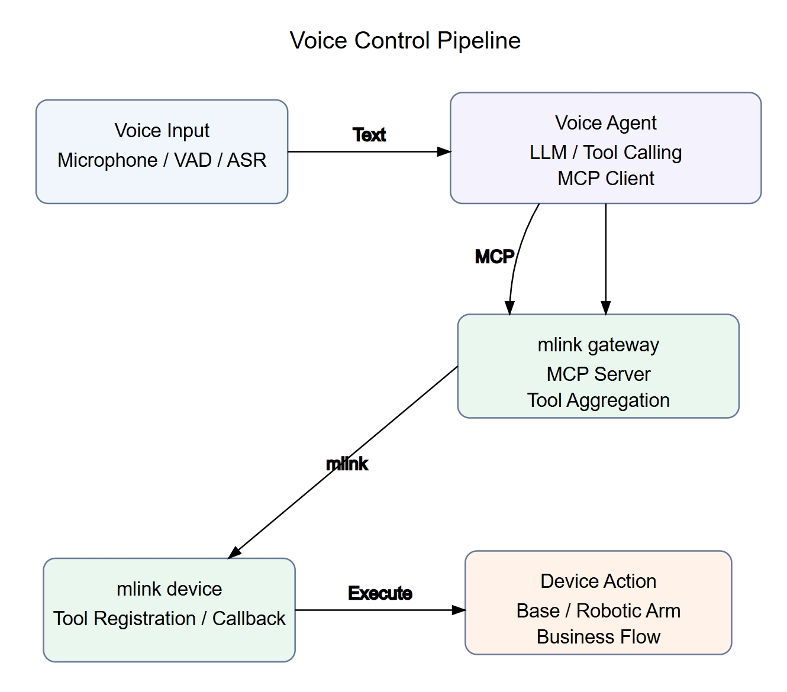

# Voice Control

## 1. Overview

The voice control module wraps robot device capabilities as MCP tools and connects them to a voice agent. When a user speaks a natural-language command into the microphone, the agent runs ASR, LLM understanding, and Tool Calling, then uses the mlink gateway to invoke tools registered by the device-side mlink device, ultimately triggering chassis, arm, or application-level actions.

The diagram below shows the software layers of the voice control module.



Code directory for this chapter:

```text
components/agent_tools/
├── mlink_gateway/                  # Python gateway — aggregates device tools and exposes an MCP Server
│   ├── cli.py                      # mlink gateway start/run/status/tools/test/call
│   ├── main.py                     # Gateway entry point
│   ├── config/gateway.yaml         # Device-side TCP/Unix listener and tool-snapshot config
│   ├── gateway/                    # Device and tool registration, call routing
│   ├── mcp/                        # MCP Server and built-in diagnostic tools
│   ├── protocol/                   # mlink JSON-RPC session
│   └── transport/                  # TCP/Unix device connection listener
└── mlink_device/                   # C-language device-side SDK
    ├── include/mlink.h             # Public C API
    ├── core/
    │   ├── mcp/                    # Device-side MCP protocol, tools, parameters, and return values
    │   ├── transport/              # Transport abstraction and Unix/TCP hardware I/O
    │   └── posix/                  # Linux/POSIX system adaptation layer
    ├── example/mlink_device_test.c # Minimal device example — registers move_forward/move_backward/turn_left/turn_right/dance/stop_motion
    └── CMakeLists.txt              # Builds libmlink_device.so and mlink_device_test
```

The module has three layers:

| Module | Where it runs | Primary responsibility |
| --- | --- | --- |
| `mlink_device` | Inside the robot device process | Register tools, declare parameters, receive `tools/call`, execute real actions, and return results. |
| `mlink_gateway` | On the K3 itself or on a host PC | Listen for device connections, run `initialize` / `tools/list`, and aggregate device tools into an MCP Server. |
| Agent / `voice_chat` / Hermes | Voice interaction application | Connect to the MCP Server and let the LLM automatically select and call tools based on natural language. |

`mlink_device` is the device-side runtime library and does not depend on a voice agent. It abstracts device actions as MCP tools and internally handles `initialize`, `tools/list`, `tools/call`, and related protocol steps. Application code only needs to register tools and callbacks via `include/mlink.h` — it never deals with JSON-RPC assembly, connection I/O, or thread scheduling directly.

`mlink_device` targets Linux and RTOS-class systems. The current repository provides a Linux/POSIX adaptation: system-level capabilities (threads, queues, mutexes, events, time, background scheduling) live in `core/posix/` and `include/utils/`; transport capabilities live in `core/transport/` and `include/transport/`, with low-level read/write and callbacks abstracted through `hwio_ops`. When porting to an RTOS, you typically keep the MCP protocol layer and the public API intact and replace only the system adaptation layer and the underlying transport implementation.

The gateway exposes an HTTP MCP service to upstream consumers by default:

```text
http://127.0.0.1:18765/mcp
```

The device side supports two connection modes by default:

| Transport | Default target | Use case |
| --- | --- | --- |
| Unix Socket | `/tmp/mlink.sock` | Device process and gateway run on the same machine. |
| TCP | `127.0.0.1:8080` | Device process connects to the gateway over TCP; suitable for cross-process or cross-device deployments. |

The gateway includes three built-in diagnostic tools: `gateway.ping`, `gateway.status`, and `gateway.list_devices`. Once a device connects, its tools are exposed in the form `<device_id>.<tool_name>` — for example, `robot.move_forward`, `robot.dance`, `robot.stop_motion`, or `linksee.start_host`.

## 2. Environment Setup

### 2.1 Get the Source Code

For instructions on obtaining the SDK source code and configuring the basic build environment, see [2.3-Building and Compilation](../02-快速入门/2.3-构建编译.md). After completing SDK initialization, return to this document and continue with Section 2.2.

Unless noted otherwise, run all commands from the `spacemit_robot` SDK root directory.

### 2.2 Build

`mlink_device` is the device-side C SDK. After building, it installs public headers, a shared library, and a test binary.

```bash
source build/envsetup.sh
lunch k3-com260-omni-agent
m
```

After the build completes, `libmlink_device.so`, `include/mlink.h`, and the `mlink_device_test` executable are generated under `output/envs/mlink-device`.

### 2.3 Set Up the mlink Gateway Environment

`mlink_gateway` is a Python package that depends on `mcp[cli]`, `loguru`, and `PyYAML`. For first-time use, go back to the SDK root directory, create a virtual environment, and install the editable package:

```bash
m_env_build components/agent_tools/mlink_gateway/
source output/envs/mlink-gateway/bin/activate
pip install -e components/agent_tools/mlink_gateway --prefer-binary
```

After installation you should be able to run:

```bash
mlink gateway --help
```

Common commands:

| Command | Description |
| --- | --- |
| `mlink gateway start` | Start the HTTP MCP service in the background; listens on `127.0.0.1:18765/mcp` by default. |
| `mlink gateway run` | Run the gateway in the foreground — useful for watching debug logs. |
| `mlink gateway status` | Show PID, HTTP endpoint, log path, Unix socket, and tool-snapshot path. |
| `mlink gateway tools` | Fetch the current tool list, descriptions, and parameter schemas from the HTTP MCP endpoint. |
| `mlink gateway tools <tool_name>` | Query details for a single tool, e.g. `mlink gateway tools robot.move_forward`. |
| `mlink gateway tools --json` | Output machine-readable tool metadata, suitable for scripts or automated testing. |
| `mlink gateway test` | Check that the MCP endpoint is reachable and that the robot's action tools are registered. |
| `mlink gateway call` | Call a specific tool directly via the HTTP MCP endpoint — useful for minimal end-to-end verification. |
| `mlink gateway stop` | Stop the background gateway. |
| `mlink gateway restart` | Restart the background gateway and clean up any leftover runtime state. |

### 2.4 Prepare an LLM and Voice Agent

For full voice control you need ASR, an LLM, and TTS for the voice agent. For LLM service setup, see [4.4-LLM](4.4-LLM.md); for the agent's end-to-end voice pipeline, see [4.5-Agent](4.5-Agent.md).

The minimal integration test in this chapter only validates the `mlink_device` → `mlink_gateway` → MCP chain and does not require a microphone, TTS, or real robot hardware.

## 3. Example Usage

### 3.1 Minimal mlink Integration

This section validates the `mlink_device` → `mlink_gateway` → MCP chain without a voice agent. It uses `mlink_device_test` to simulate a robot device. The test binary registers six no-parameter action tools:

| Tool | Parameters | Behavior |
| --- | --- | --- |
| `robot.move_forward` | None | Simulates a brief forward movement. |
| `robot.move_backward` | None | Simulates a brief backward movement. |
| `robot.turn_left` | None | Simulates a brief left turn. |
| `robot.turn_right` | None | Simulates a brief right turn. |
| `robot.dance` | None | Simulates a long action (~120 seconds). |
| `robot.stop_motion` | None | Immediately stops the current action; can interrupt long actions such as dancing. |

Start the gateway and the device example:

```bash
source output/envs/mlink-gateway/bin/activate
mlink gateway restart
mlink_device_test restart
mlink_device_test status
```

`mlink_device_test restart` moves the device example to the background and writes logs to `/tmp/mlink-device-test.log`. The device example uses a Unix Socket connection to `/tmp/mlink.sock` by default, with device name `robot`. Continue with the minimal verification:

```bash
mlink gateway tools robot.move_forward
mlink gateway call robot.move_forward
mlink gateway call robot.move_backward
mlink gateway call robot.turn_left
mlink gateway call robot.turn_right
mlink gateway call robot.dance
mlink gateway call robot.stop_motion
```

After the commands run, check `cat /tmp/mlink-device-test.log` to confirm the device side received the correct instructions.

The expected behavior for each capability:

| Capability | Expected result |
| --- | --- |
| Tool registration | `mlink gateway tools robot.move_forward` shows the tool description with an empty-object `inputSchema`. |
| Command dispatch | Calling `robot.move_forward`, `robot.turn_left`, `robot.dance`, etc. are routed by the gateway to the corresponding device-side callbacks. |
| Execution feedback | The `call` command prints the result; `/tmp/mlink-device-test.log` records execution logs for `motion`, `turn_left`, `dance`, and `stop_motion`. |
| Instant interrupt | `robot.dance` is a ~120-second long action; calling `robot.stop_motion` immediately after triggers the device-side stop logic. |

If you are not continuing with Section 3.2, stop the background processes when done:

```bash
mlink_device_test stop
mlink gateway stop
```

`mlink gateway` is a general-purpose HTTP MCP gateway and is not tied to any fixed tool set. When a real device's tools change, use `mlink gateway tools` to query the current tool names, descriptions, and `inputSchema`, then use `mlink gateway call <tool_name> <arguments_json>` to verify calls.

### 3.2 Connecting omni_agent

`omni_agent` is the voice-interaction agent in the AI robot SDK and supports MCP. `mlink_gateway` exposes a standard HTTP MCP endpoint to the upstream agent. `omni_agent` can connect to a local LLM or to a cloud-hosted OpenAI-compatible LLM. This section assumes the gateway and `mlink_device_test` from Section 3.1 are already running.

For first-time use, build the `omni_agent` target completely first, then copy the MCP connection config into the `omni_agent` config directory:

```bash
cp components/agent_tools/mcp/examples/configs/mlink_http.json \
     ~/.config/omni_agent/mcp.json
```

Before starting the service, confirm that the correct audio input and output devices are selected. List the system's audio devices with:

```bash
voice_chat -l
```

#### 3.2.1 Using a Local LLM

Once the audio input and output devices are configured, start `voice_chat_daemon`:

```bash
# Starting voice_chat_daemon — the voice service takes a moment to initialize, please wait
voice_chat_daemon start --mcp
```

Once the service is up and you hear the voice prompt, you can start a conversation. Say the following commands to validate the pipeline: "机器人前进" (robot, move forward), "机器人后退" (robot, move backward), "机器人向左转" (robot, turn left), "机器人向右转" (robot, turn right), "机器人跳个舞" (robot, dance), "机器人停止动作" (robot, stop). Watch the action logs with:

```bash
tail -f /tmp/mlink-device-test.log
```

#### 3.2.2 Using a Cloud LLM

To use a cloud LLM, first configure the model service URL, model name, and API key in `~/.config/omni_agent/llm.json`:

```json
{
    "api_base": "https://api.deepseek.com",
    "api_key": "sk-...",
    "model_name": "deepseek-v4-flash"
}
```

Once the service is running, say the same validation commands as above: "机器人前进" (robot, move forward), "机器人后退" (robot, move backward), "机器人向左转" (robot, turn left), "机器人向右转" (robot, turn right), "机器人跳个舞" (robot, dance), "机器人停止动作" (robot, stop).  Watch the action logs with:

```bash
tail -f /tmp/mlink-device-test.log
```

### 3.3 Connecting Hermes

Hermes can act as the upstream agent and connect directly to the `mlink gateway` HTTP MCP endpoint, calling device tools with natural language. This section assumes the gateway and `mlink_device_test` from Section 3.1 are already running.

First, configure the model service URL, model name, and credentials with `hermes model`:

```bash
hermes model
```

Then add the mlink gateway to `~/.hermes/config.yaml`:

```yaml
mcp_servers:
    mlink-gateway:
        transport: http
        url: http://127.0.0.1:18765/mcp
        enabled: true
```

Start Hermes:

```bash
hermes
```

Type the same validation commands in the Hermes CLI:

```text
机器人前进
机器人后退
机器人向左转
机器人向右转
机器人跳个舞
机器人停止动作
```

Expected behavior:

| Capability | Expected result |
| --- | --- |
| Tool registration | After connecting to `mlink-gateway`, Hermes can see `robot.move_forward`, `robot.move_backward`, `robot.turn_left`, `robot.turn_right`, `robot.dance`, and `robot.stop_motion`. |
| Command dispatch | "向前走一下" triggers `robot.move_forward`; "跳个舞" triggers `robot.dance`. |
| Execution feedback | Hermes includes the tool's return value in its reply. |
| Instant interrupt | "停止移动" or "停止跳舞" should trigger `robot.stop_motion`, stopping the long action on the device side. |

Real robot applications connect in the same way — simply replace `mlink_device_test` with the corresponding device process. The repository currently includes two reference applications:

| Application | Device process | Default device name | Exposed tools |
| --- | --- | --- | --- |
| Linksee | `linksee_device unix linksee` | `linksee` | `linksee.start_host`, `linksee.start_inference`, `linksee.stop_host`, `linksee.stop_inference` |
| LeRobot | `lerobot_device unix lerobot` | `lerobot` | `lerobot.pick_cube` |

For example, once `linksee_device unix linksee` is connected, you can type "启动 Linksee host" or "停止 Linksee 推理" in Hermes; once `lerobot_device unix lerobot` is connected, you can type "抓木块". Hermes routes the request to the corresponding MCP tool.

## 4. Application Development

This section is for device application developers who want to expose robot actions as tools callable by a voice agent. Device applications only need to depend on the public header `components/agent_tools/mlink_device/include/mlink.h`.

### 4.1 Integration Model

`mlink_device` handles the boundary of "device capability registration and call execution." The device application describes what it can do; the SDK converts those capabilities into MCP tools and manages protocol I/O, tool-list export, parameter parsing, return-value serialization, and transport read/write.

The integration flow for a device tool is:

1. `mlink_server_init(type, server_name)` — create a device server and connect to the gateway.
2. `mlink_property_list_create()` — create a parameter list; use `mlink_property_list_add_*()` to describe tool inputs.
3. `mlink_tool_create()` — create a tool, binding its name, description, parameter schema, and callback.
4. `mlink_server_add_tool()` — register the tool with the device server.
5. `mlink_server_run()` — keep the device process running and wait for `tools/call` from the gateway.

The gateway exposes tools as `<server_name>.<tool_name>`. For example, if the device name is `robot` and the tool name is `move_forward`, the MCP tool name visible to the agent is `robot.move_forward`.

| Concept | Device-side code | Gateway / agent sees |
| --- | --- | --- |
| Device name | `mlink_server_init(..., "robot")` | `device_id = robot` |
| Tool name | `mlink_tool_create("move_forward", ...)` | `robot.move_forward` |
| Parameters | No-parameter tool uses an empty property list | `inputSchema.properties` is an empty object |
| Return value | `mlink_return_string("ok")` | MCP `tools/call` result |

### 4.2 Core API Reference

#### 4.2.1 Server Lifecycle

| API | Description | Parameters | Return value |
| --- | --- | --- | --- |
| `mlink_server_init` | Create a device-side server and connect to the gateway. | `type`: transport type; `server_name`: device name, becomes the `device_id` in the gateway. | `mlink_server_t *` on success, `NULL` on failure. |
| `mlink_server_run` | Block the calling thread and keep the device process running. | `server`: server handle. | None. |
| `mlink_server_destroy` | Release the server, transport, and background scheduler resources. | `server`: server handle. | None. |
| `mlink_notify_message` | Send a log or status notification upstream. | `server`: server handle; `level`: log level; `logger`: log source; `text`: notification content. | None. |

Available transport types:

| Type | Status | Notes |
| --- | --- | --- |
| `TRANSPORT_TYPE_UNIX` | Implemented | Connects to `/tmp/mlink.sock` on the local machine. Use when the device process and gateway run on the same host. |
| `TRANSPORT_TYPE_TCP` | Implemented | Connects to `127.0.0.1:8080`. Suitable for cross-process or cross-device deployments. |
| `TRANSPORT_TYPE_MQTT / HTTP / WS / UART / SPI` | Reserved | Can be supported by implementing a new transport / `hwio_ops`. |

#### 4.2.2 Parameter Schema

| API | Description | Parameters | Return value |
| --- | --- | --- | --- |
| `mlink_property_list_create` | Create a tool parameter list. | None. | `mlink_property_list_t *` on success, `NULL` on failure. |
| `mlink_property_list_add_bool` | Add a boolean parameter. | `list`: parameter list handle; `name`: parameter name; `has_default`: whether a default is provided; `default_value`: default value. | `true` on success, `false` on failure. |
| `mlink_property_list_add_int` | Add an integer parameter, with optional `minimum` / `maximum` constraints. | `list`: parameter list handle; `name`: parameter name; `has_default`: whether a default is provided; `default_value`: default value; `has_min`: whether a minimum is set; `min_value`: minimum value; `has_max`: whether a maximum is set; `max_value`: maximum value. | `true` on success, `false` on failure. |
| `mlink_property_list_add_string` | Add a string parameter. | `list`; `name`; `default_value`: `NULL` for required, non-null for optional with a default. | `true` on success, `false` on failure. |
| `mlink_property_list_destroy` | Release a parameter list. | `list`: parameter list handle. | None. |

The parameter schema is exposed to the gateway via the device-side `tools/list`. The LLM relies on the tool description and `inputSchema` to select tools and generate arguments.

#### 4.2.3 Tool Registration and Callbacks

| API | Description | Parameters | Return value |
| --- | --- | --- | --- |
| `mlink_tool_create` | Create a tool and bind its description, parameter schema, and callback. | `name`: tool name local to the device (e.g., `move_forward`, `stop_motion`, `pick_cube`); `description`: tool description; `properties`: parameter list; `callback`: tool callback; `user_ctx`: user context; `user_only`: whether the tool is user-visible only. | `mlink_tool_t *` on success, `NULL` on failure. |
| `mlink_server_add_tool` | Register a tool with the device server. | `server`: server handle; `tool`: tool handle. | `true` on success, `false` on failure. |
| `mlink_tool_destroy` | Release a tool that was not successfully registered. | `tool`: tool handle. | None. |
| `mlink_tool_callback_t` | Tool callback type. Invoked when the gateway issues `tools/call`. | `properties`: call-time parameter snapshot; `user_ctx`: user context. | `struct mlink_return_value`. |

Callback signature:

```c
typedef struct mlink_return_value (*mlink_tool_callback_t)(
    const mlink_property_list_t *properties,
    void *user_ctx);
```

`properties` is a snapshot of the arguments for this particular call. If a parameter is missing, has the wrong type, or is out of range for an integer, the SDK returns an error before entering the callback.

Tool names and descriptions directly affect LLM tool-selection quality. For high-frequency voice actions, prefer short, stable, self-contained tool names such as `move_forward`, `turn_left`, `dance`, and `stop_motion`. Descriptions should clearly state the action's scope, typical voice prompts, and any safety constraints. Long-running actions should have a stop semantic — prefer a dedicated stop tool such as `stop_motion`. Callbacks must still perform their own permission, state, and safety checks; mlink only handles protocol forwarding and does not replace emergency stop, speed limiting, or other robot safety controls.

#### 4.2.4 Parameter Reading and Return Values

| API | Description | Parameters | Return value |
| --- | --- | --- | --- |
| `mlink_property_list_get_bool` | Read a boolean parameter. | `list`: parameter list handle; `name`: parameter name; `out_value`: output pointer. | `true` on success, `false` on failure. |
| `mlink_property_list_get_int` | Read an integer parameter. | `list`: parameter list handle; `name`: parameter name; `out_value`: output pointer. | `true` on success, `false` on failure. |
| `mlink_property_list_get_string` | Read a string parameter. | `list`; `name`. | String pointer on success, `NULL` on failure. |
| `mlink_return_bool` | Create a boolean return value. | `value`: return value. | `struct mlink_return_value`. |
| `mlink_return_int` | Create an integer return value. | `value`: return value. | `struct mlink_return_value`. |
| `mlink_return_string` | Create a string return value. | `value`: return value. | `struct mlink_return_value`. |
| `mlink_return_json` | Create a JSON return value. | `json`: cJSON object. | `struct mlink_return_value`. |
| `mlink_return_image` | Create an image return value. | `image`: image content object. | `struct mlink_return_value`. |
| `mlink_return_value_free` | Release resources for a manually held return value. | `value`: return value pointer. | None. |

In a tool callback, simply `return mlink_return_*()` directly. The SDK releases any dynamic resources in the return value after serializing the `tools/call` result. Only call `mlink_return_value_free()` if the application holds a `mlink_return_value` for an extended period outside of the callback.

### 4.3 Minimal Device Tool Example

The example below registers two no-parameter tools, `move_forward` and `stop_motion`. In a real application, replace the `printf` calls with actual chassis, arm, or application logic.

```c
#include <stdbool.h>
#include <stdio.h>
#include <mlink.h>

static struct mlink_return_value move_forward_cb(
    const mlink_property_list_t *props,
    void *user_ctx) {
    (void)props;
    (void)user_ctx;

    printf("move forward\n");
    return mlink_return_string("move forward started");
}

static struct mlink_return_value stop_motion_cb(
    const mlink_property_list_t *props,
    void *user_ctx) {
    (void)props;
    (void)user_ctx;

    printf("stop motion\n");
    return mlink_return_string("motion stopped");
}

static bool register_tool(
    mlink_server_t *server,
    const char *name,
    const char *description,
    mlink_tool_callback_t callback) {
    mlink_property_list_t *props = mlink_property_list_create();
    if (!props) {
        return false;
    }

    mlink_tool_t *tool = mlink_tool_create(
        name,
        description,
        props,
        callback,
        NULL,
        false);
    mlink_property_list_destroy(props);

    if (!tool || !mlink_server_add_tool(server, tool)) {
        if (tool) {
            mlink_tool_destroy(tool);
        }
        return false;
    }

    return true;
}

int main(void) {
    mlink_server_t *server = mlink_server_init(TRANSPORT_TYPE_UNIX, "robot");
    if (!server) {
        return 1;
    }

    if (!register_tool(
            server,
            "move_forward",
            "Make the robot move forward briefly. Use for Chinese voice commands: "
            "\"机器人前进\", \"前进\", \"向前\".",
            move_forward_cb) ||
        !register_tool(
            server,
            "stop_motion",
            "Stop the robot's current action immediately. Use for Chinese voice commands: "
            "\"机器人停止动作\", \"停止\", \"停下\", \"停止跳舞\".",
            stop_motion_cb)) {
        mlink_server_destroy(server);
        return 1;
    }

    mlink_server_run(server);
    mlink_server_destroy(server);
    return 0;
}
```

Once the device process starts, the gateway automatically:

1. Runs `initialize` — reads `serverInfo.name` from the device side, using it as the `device_id`.
2. Runs `tools/list` — reads the registered tools and their parameter schemas.
3. Registers MCP tools dynamically — exposes `move_forward` and `stop_motion` as `robot.move_forward` and `robot.stop_motion`.
4. Forwards `tools/call` — when the agent calls `robot.move_forward` or `robot.stop_motion`, routes it to the corresponding device-side callback.

### 4.4 CMake Integration

Downstream C/C++ components can refer to `application/ros2/linksee/linksee_app/CMakeLists.txt` or `application/native/lerobot_app/CMakeLists.txt` as examples.

Minimal CMake snippet:

```cmake
add_executable(robot_device main.c)

find_library(MLINK_DEVICE_LIB NAMES mlink_device
    PATHS ${CMAKE_INSTALL_PREFIX}/lib NO_DEFAULT_PATH)
find_path(MLINK_DEVICE_INCLUDE_DIR NAMES mlink.h
    PATHS ${CMAKE_INSTALL_PREFIX}/include NO_DEFAULT_PATH)

if(NOT MLINK_DEVICE_LIB OR NOT MLINK_DEVICE_INCLUDE_DIR)
    message(FATAL_ERROR "mlink_device not found. Build components/agent_tools/mlink_device first.")
endif()

target_include_directories(robot_device PRIVATE ${MLINK_DEVICE_INCLUDE_DIR})
target_link_libraries(robot_device PRIVATE ${MLINK_DEVICE_LIB})
```

Declare the dependency in the component's `package.xml`:

```xml
<depend>mlink_device</depend>
```

This ensures the build system compiles and installs `mlink_device` before the application component when using `m` or `mm`.

### 4.5 Porting Interface

`mlink_device` separates system capabilities and transport capabilities into distinct layers, making it straightforward to reuse the same tool-registration API across different runtime environments.

| Layer | Location | Description |
| --- | --- | --- |
| Public application API | `include/mlink.h` | Device applications depend only on this layer. Covers server lifecycle, tool registration, parameter reading, and return-value creation. |
| MCP protocol layer | `core/mcp/` | Implements `initialize`, `tools/list`, and `tools/call`; generates tool `inputSchema`; dispatches tool callbacks. |
| Transport abstraction layer | `include/transport/`, `core/transport/` | Manages different transport implementations via `transport_register()` / `transport_create()`. |
| Hardware I/O adaptation layer | `include/transport/hwio.h`, `core/transport/hwio/` | Encapsulates `init`, `deinit`, `write`, and callback via `hwio_ops`. Unix Socket and TCP are currently implemented. |
| System adaptation layer | `include/utils/`, `core/posix/` | Wraps threads, queues, mutexes, events, time, background scheduling, linked lists, and logging. |

The current Linux build uses `core/posix/` for system interfaces and provides `TRANSPORT_TYPE_UNIX` and `TRANSPORT_TYPE_TCP`. When porting to an RTOS, keep `include/mlink.h` and `core/mcp/` unchanged and replace or add the following:

| Adaptation target | Linux/POSIX (current) | RTOS porting notes |
| --- | --- | --- |
| Thread and scheduling | `core/posix/task.c`, `background_sched.c`, `schedule.c` | Replace with RTOS task/thread, work queue, or message loop. |
| Synchronization and queues | `core/posix/mutex.c`, `queue.c`, `event_group.c` | Replace with RTOS mutex, queue, and event flags. |
| Time interface | `core/posix/sys_time.c` | Replace with RTOS tick or monotonic time. |
| Low-level transport | `core/transport/hwio/unix.c`, `tcp.c` | Implement TCP, UART, SPI, MQTT, or other links as needed. |
| Log output | `include/utils/log.h` | Replace with on-board logging, serial logging, or platform tracing. |

Device application code typically does not need to care whether it runs on Linux or an RTOS. Once the platform provides the system and transport adaptations, the same tool-registration code can be reused as-is.

## 5. Debugging

**(1) Check whether the gateway is running.**

```bash
mlink gateway status
```

Look for:

```text
Status: running
HTTP listener: ready
UNIX socket: /tmp/mlink.sock
```

**(2) Check whether device tools are registered.**

```bash
mlink gateway tools
```

If you see only `gateway.ping`, `gateway.status`, and `gateway.list_devices`, the gateway is up but the device has not connected or tool synchronization failed.

**(3) Inspect the gateway log.**

```bash
tail -f /tmp/mlink-gateway/gateway.log
```

When a device connects successfully, the log should contain entries like:

```text
Device robot initialize -> ...
Registered tool robot.move_forward from device robot
Registered tool robot.move_backward from device robot
Registered tool robot.turn_left from device robot
Registered tool robot.turn_right from device robot
Registered tool robot.dance from device robot
Registered tool robot.stop_motion from device robot
```

**(4) Inspect the tool snapshot.**

```bash
cat /tmp/mlink.tools.json
```

This file is generated by the gateway's `tools_snapshot` feature and lets you confirm the current dynamic and built-in tools.

**(5) Run the gateway in the foreground.**

```bash
mlink gateway stop
mlink gateway run
```

Foreground mode prints logs directly to the terminal, which makes it easier to observe device connections, disconnections, and `tools/call` forwarding.

**(6) Check the socket or port.**

```bash
ls -l /tmp/mlink.sock
ss -ltnp | grep 18765
ss -ltnp | grep 8080
```

Port 18765 is the upstream MCP HTTP service port; port 8080 is the default port the gateway listens on for device TCP connections.

## 6. Troubleshooting

| Symptom | Possible Cause | Resolution |
| --- | --- | --- |
| `mlink: command not found` | The `mlink-gateway` virtual environment is not activated, or `pip install -e` was not run. | Run `source output/envs/mlink-gateway/bin/activate` and reinstall the gateway package. |
| `mlink gateway tools` shows only `gateway.*` tools | The device process has not started, the connection failed, or tool synchronization failed. | Start `mlink_device_test` or the real device process, then check `/tmp/mlink-gateway/gateway.log`. |
| Device reports `UNIX connect to /tmp/mlink.sock failed` on startup | The gateway is not running, or the socket is in an abnormal state from a previous run. | Run `mlink gateway restart`, then restart the device process. |
| HTTP MCP endpoint is unreachable | The gateway is not running, the port is in use, or the virtual environment is inconsistent. | Run `mlink gateway status`; if needed, specify a different port with `--mcp-port`. |
| Agent can converse but never calls a tool | MCP config not loaded, LLM does not support Tool Calling, or the system prompt does not mention available tools. | Verify the `mlink_http.json` path, check model capabilities, and run `mlink gateway tools` to confirm tools are registered. |
| Tool call goes to the wrong device | Multiple devices registered with the same `server_name`; the later-connecting device overwrites the earlier one. | Assign a unique name to each device, e.g., `robot1`, `linksee`, `lerobot`. |
| Long-running action cannot be stopped | The tool callback blocks the thread or no stop semantic is defined. | Run long actions in a background thread and provide a `stop` parameter or a dedicated stop tool. |
