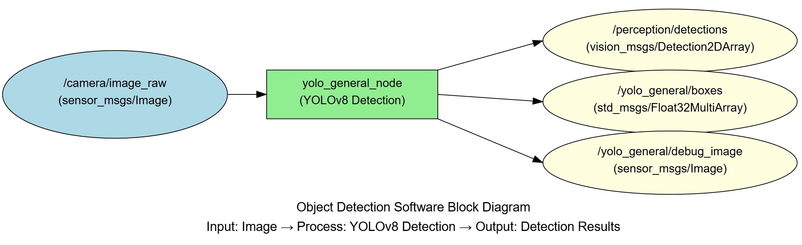
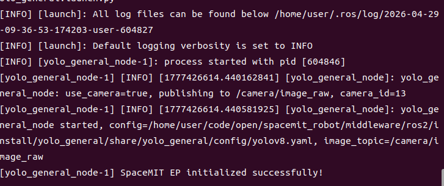
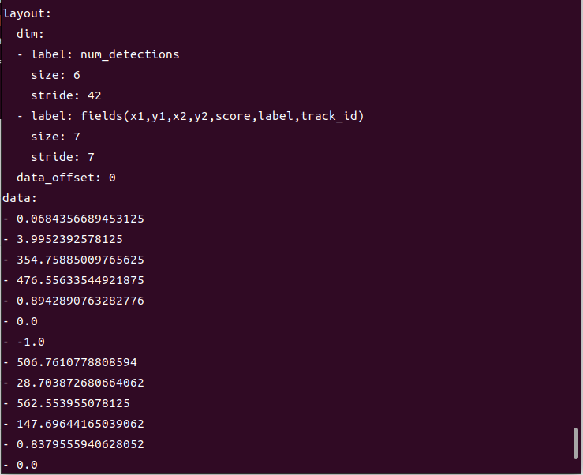

# Perception · Object Detection

## 1. Overview

This module provides general-purpose object detection based on YOLOv8, capable of detecting 80 common object classes in real time (people, vehicles, animals, everyday items, etc.).

### Features

- **Algorithm**: YOLOv8n (lightweight variant optimized for embedded devices)
- **Input Resolution**: 640×640
- **Supported Classes**: COCO 80 classes (person, bicycle, car, cat, dog, chair, cup, etc.)
- **Inference Backend**: SpaceMIT EP (ONNX Runtime)
- **Output Formats**: vision_msgs/Detection2DArray, Float32MultiArray

### Software Architecture



### Directory Structure

```
yolo_general/
├── src/
│   └── yolo_general_node.cpp      # Main node implementation
├── config/
│   └── yolov8.yaml                # Model configuration
├── launch/
│   └── yolo_general.launch.py     # Launch file
└── package.xml
```

## 2. Environment Setup

### Prerequisites

**Runtime Environment**
- Operating System: Ubuntu 20.04 or 22.04
- ROS Version: ROS 2 Humble

**Dependencies**
- `output/staging`: Vision inference library (`libvision.so` and `vision_service.h`)
- YOLOv8 model file: `~/.cache/models/vision/yolov8/yolov8n.q.onnx`
- COCO label file: `assets/labels/coco.txt`
- ROS 2 packages: rclcpp, sensor_msgs, std_msgs, perception_common, vision_msgs

**Hardware Requirements**
- USB camera or network camera
- Camera device typically appears as `/dev/video0` (check with `ls /dev/video*`)

**Environment Initialization**
- Refer to the ROS 2 environment setup in [02-Quick Start](../../02-快速入门/index.md)

### Build

**Obtain Source Code**
- Follow [02-Quick Start · 2.3 Building and Compilation](../../02-快速入门/2.3-构建编译.md) to obtain the complete source code

**Build Steps**
```bash
cd spacemit_robot
source build/envsetup.sh
cd components/model_zoo/vision
mm
bash scripts/download_all_models.sh
bash scripts/download_assets.sh
cd ../../../
colcon build --packages-select yolo_general
source install/setup.bash
```

**Build Artifacts**
- Executable: `install/lib/yolo_general/yolo_general_node`

## 3. Quick Start

This section provides complete instructions to get object detection running quickly.

### 3.1 Real-Time Detection with Camera

This is the most common use case: real-time object detection directly from a camera.

**Preparation**
1. Ensure the camera is connected to the device
2. Verify the model file is downloaded to `~/.cache/models/vision/yolov8/yolov8n.q.onnx`
3. Check the camera device number (typically 0 or 1):
   ```bash
   ls /dev/video*
   ```

**Important**: If your camera is not `/dev/video0`, modify the `camera_id` parameter in `config/yolo_general.yaml`.

**Step 1: Launch the Detection Node**
```bash
source install/setup.bash
ros2 launch yolo_general yolo_general.launch.py
```

**Terminal Output:**



**Step 2: View Detection Results**

Open a new terminal and view the detection boxes:
```bash
# Terminal 2: View detection boxes
ros2 topic echo /yolo_general/boxes
```

**Terminal Output:**



## 4. Application Development

### API Reference

**Subscribed Topics**
- `/camera/image_raw` (sensor_msgs/Image) - Input image

**Published Topics**
- `/perception/detections` (vision_msgs/Detection2DArray) - Standard detection message with class, confidence, and bounding box
- `/yolo_general/boxes` (std_msgs/Float32MultiArray) - Simplified format: 7 values per object (x1, y1, x2, y2, score, label, track_id)
- `/yolo_general/debug_image` (sensor_msgs/Image) - Visualization image with detection boxes

### Usage

**Parameter Configuration**
- `use_camera`: When true, connects directly to camera; when false, subscribes to external image topic
- `score_threshold`: Confidence threshold, default 0.25 (range 0-1; higher values produce stricter detections)
- `camera_id`: Camera device number, default 0

**Command-Line Parameter Example**
```bash
# Use camera 1 with confidence threshold 0.5
ros2 launch yolo_general yolo_general.launch.py camera_id:=1 score_threshold:=0.5
```

### Notes

1. **Adjusting Confidence Threshold**: If you see too many false positives, increase `score_threshold`; if too many objects are missed, decrease it
2. **Camera Mode**: When `use_camera:=true`, the node automatically publishes raw images to `/camera/image_raw`
3. **Subscription Mode**: When `use_camera:=false`, another node must publish images to `/camera/image_raw`

### References

- Configuration file: `install/share/yolo_general/config/yolov8.yaml`
- Launch file: `install/share/yolo_general/launch/yolo_general.launch.py`

## 5. Debugging

### Log Debugging

**View Node Logs**
```bash
# Logs are automatically output to the terminal after launching the node
ros2 launch yolo_general yolo_general.launch.py
```

**Tip**: To adjust the log level, modify the logging configuration in the launch file

### Common Debugging Commands

**Check Topic Status**
```bash
# List all related topics
ros2 topic list | grep yolo_general

# Check topic publish rate
ros2 topic hz /yolo_general/boxes

# View node information
ros2 node info /yolo_general_node
```

**Check Input Image**
```bash
# Verify image topic has data
ros2 topic hz /camera/image_raw

# View image topic details
ros2 topic info /camera/image_raw
```

**Adjust Parameters Dynamically**
```bash
# List all parameters
ros2 param list /yolo_general_node

# Modify confidence threshold dynamically
ros2 param set /yolo_general_node score_threshold 0.4
```

### Performance Analysis

**Check CPU Usage**
```bash
top -p $(pgrep -f yolo_general_node)
```

**Check Inference Latency**
- Look for inference time output in the node logs

## 6. Troubleshooting

| Symptom | Possible Cause | Solution |
| --- | --- | --- |
| Node fails to start, model file not found | Incorrect model path or missing file | 1. Check if `~/.cache/models/vision/yolov8/yolov8n.q.onnx` exists<br>2. Modify model_path in `config/yolov8.yaml` |
| No detection output | No image data on input topic or confidence threshold too high | 1. Check image topic: `ros2 topic hz /camera/image_raw`<br>2. Lower score_threshold (e.g., to 0.15) |
| Inaccurate bounding box positions | Large difference between input resolution and model training resolution | 1. Adjust camera resolution<br>2. Modify image_size parameter in config |
| Slow inference, low frame rate | Insufficient hardware performance or improper thread configuration | 1. Check CPU usage<br>2. Adjust num_threads parameter in config<br>3. Consider using a lighter model |
| Missing vision_msgs | ROS 2 dependency package not installed | Install dependency: `sudo apt install ros-humble-vision-msgs` |
| Too many false positives | Confidence threshold too low | Increase score_threshold (e.g., to 0.4 or 0.5) |
| Missing objects | Confidence threshold too high or objects too small | 1. Lower score_threshold parameter<br>2. Increase input image resolution |

## Appendix

### COCO 80 Class List

Common classes include:
- People: person
- Vehicles: bicycle, car, motorcycle, bus, truck
- Animals: cat, dog, bird, horse, cow
- Furniture: chair, couch, bed, dining table
- Electronics: tv, laptop, mouse, keyboard, cell phone
- Everyday items: bottle, cup, fork, knife, spoon, bowl

For the complete class list, refer to the `assets/labels/coco.txt` file.
