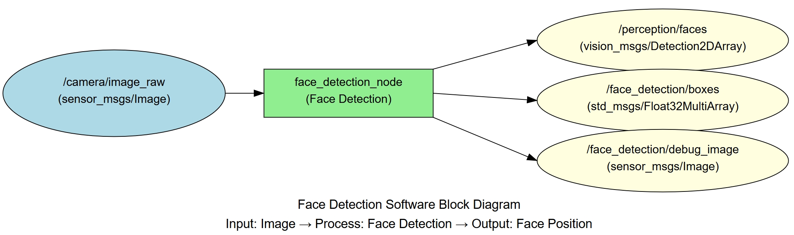
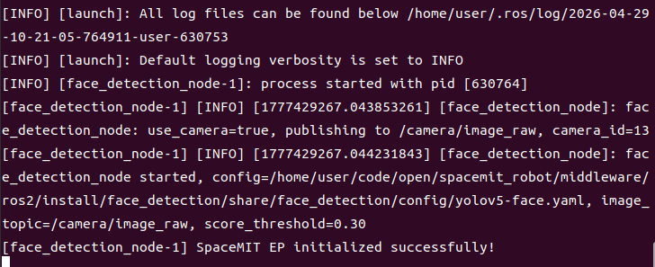
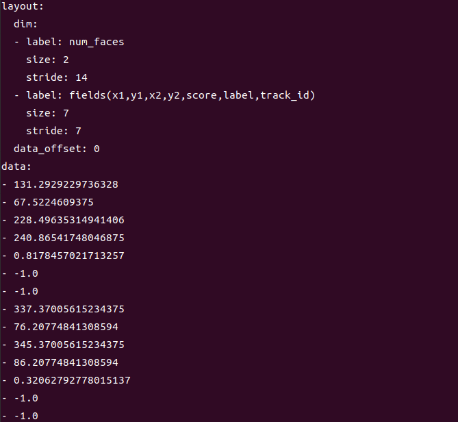

# Perception · Face Detection

## 1. Overview

This module provides deep learning-based face detection capable of detecting face positions in images in real time, with support for multiple simultaneous faces.

### Features

- **Algorithm**: Dedicated face detection model (based on YOLO or RetinaFace architecture)
- **Input Resolution**: Configurable, default 640×640
- **Detection Capability**: Supports multi-angle and multi-scale face detection
- **Inference Backend**: SpaceMIT EP (ONNX Runtime)
- **Output Formats**: vision_msgs/Detection2DArray, Float32MultiArray

### Software Architecture



### Directory Structure

```
face_detection/
├── src/
│   └── face_detection_node.cpp    # Main node implementation
├── config/
│   └── face_detection.yaml        # Node configuration
├── launch/
│   └── face_detection.launch.py   # Launch file
└── package.xml
```

## 2. Environment Setup

### Prerequisites

**Runtime Environment**
- Operating System: Ubuntu 20.04 or 22.04
- ROS Version: ROS 2 Humble

**Dependencies**
- `output/staging`: Vision inference library (`libvision.so` and `vision_service.h`)
- Face detection model file: Path must be specified in config yaml
- ROS 2 packages: rclcpp, sensor_msgs, std_msgs, perception_common, vision_msgs

**Hardware Requirements**
- USB camera or network camera

**Environment Initialization**
- Refer to the ROS 2 environment setup in [02-Quick Start](../../02-快速入门/index.md)

### Build

**Obtain Source Code**
- Follow [02-Quick Start · 2.3 Building and Compilation](../../02-快速入门/2.3-构建编译.md) to obtain the complete source code

**Build Steps**
```bash
cd spacemit_robot
source build/envsetup.sh
cd components/model_zoo/vision
mm
bash scripts/download_all_models.sh
bash scripts/download_assets.sh
cd ../../../
colcon build --packages-select face_detection
source install/setup.bash
```

**Build Artifacts**
- Executable: `install/lib/face_detection/face_detection_node`

## 3. Quick Start

This section provides complete instructions to get face detection running quickly.

### 3.1 Real-Time Face Detection with Camera

**Preparation**
1. Ensure the camera is connected to the device
2. Verify the model file path is configured in config
3. Check the camera device number: `ls /dev/video*`

**Important**: If your camera is not `/dev/video0`, modify the `camera_id` parameter in `config/face_detection.yaml`.

**Step 1: Launch the Face Detection Node**
```bash
source install/setup.bash
ros2 launch face_detection face_detection.launch.py
```

**Terminal Output:**



**Step 2: View Detection Results**

Open a new terminal and view the detection boxes:
```bash
# Terminal 2: View detection boxes
ros2 topic echo /face_detection/boxes
```

**Terminal Output:**



## 4. Application Development

### API Reference

**Subscribed Topics**
- `/camera/image_raw` (sensor_msgs/Image) - Input image

**Published Topics**
- `/perception/faces` (vision_msgs/Detection2DArray) - Standard detection message
- `/face_detection/boxes` (std_msgs/Float32MultiArray) - 7 values per face: x1, y1, x2, y2, score, label, track_id
- `/face_detection/debug_image` (sensor_msgs/Image) - Visualization image

### Usage

**Parameter Configuration**
- `use_camera`: When true, connects directly to camera; when false, subscribes to external image topic
- `score_threshold`: Confidence threshold for adjusting detection sensitivity
- `camera_id`: Camera device number

**Command-Line Parameter Example**
```bash
# Use camera 1 with confidence threshold 0.6
ros2 launch face_detection face_detection.launch.py camera_id:=1 score_threshold:=0.6
```

### Notes

1. **All detection results have class_id "face"**
2. **Supports multiple simultaneous faces**, each with an independent bounding box
3. **Lighting conditions affect detection performance**; use in good lighting for best results

### References

- Configuration file: `install/share/face_detection/config/`
- Launch file: `install/share/face_detection/launch/face_detection.launch.py`

## 5. Debugging

### Log Debugging

**View Node Logs**
```bash
# Logs are automatically output to the terminal after launching the node
ros2 launch face_detection face_detection.launch.py
```

**Tip**: To adjust the log level, modify the logging configuration in the launch file

### Common Debugging Commands

**Check Topic Status**
```bash
# List all related topics
ros2 topic list | grep face_detection

# Check topic publish rate
ros2 topic hz /face_detection/boxes

# View node information
ros2 node info /face_detection_node
```

**Check Input Image**
```bash
# Verify image topic has data
ros2 topic hz /camera/image_raw

# View image topic details
ros2 topic info /camera/image_raw
```

### Performance Analysis

**Check CPU Usage**
```bash
top -p $(pgrep -f face_detection_node)
```

**Check Inference Latency**
- Look for inference time output in the node logs

## 6. Troubleshooting

| Symptom | Possible Cause | Solution |
| --- | --- | --- |
| Node fails to start, model file not found | Incorrect model path configuration | Check if model_path in config yaml is correct |
| No detection output | No faces in input image or confidence threshold too high | 1. Verify input image contains clear faces<br>2. Lower score_threshold parameter |
| Missed or false detections | Model accuracy issues or poor image quality | 1. Increase image resolution<br>2. Improve lighting conditions<br>3. Adjust confidence threshold |
| Small faces not detected | Insufficient input resolution | Increase input image resolution or use multi-scale detection |
| Profile faces not detected | Face angle too large | 1. Adjust camera angle<br>2. Use a model that supports wider angles |
| Missing vision_msgs | ROS 2 dependency package not installed | Install dependency: `sudo apt install ros-humble-vision-msgs` |

## Appendix

### Application Scenarios

- **Face Recognition Preprocessing**: Provides face region localization for face recognition systems
- **People Counting**: Counts the number of people in a scene
- **Face Tracking**: Implements face tracking combined with tracking algorithms
- **Security Monitoring**: Real-time monitoring of faces in a scene
- **Human-Computer Interaction**: Detects user face position for interaction control
