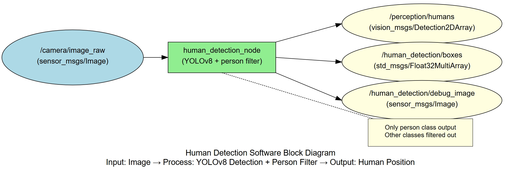
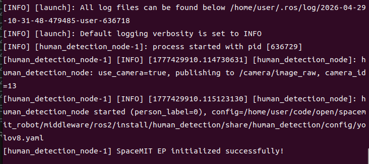
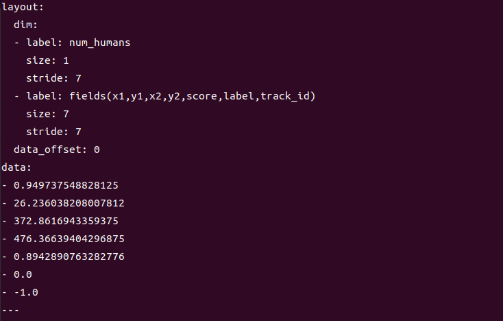

# Perception · Person Detection

## 1. Overview

This module provides YOLOv8-based person detection, specifically detecting "person" objects in images while filtering out other classes. It is suitable for scenarios such as people counting and person tracking.

### Features

- **Algorithm**: YOLOv8n + COCO dataset (person class only, label=0)
- **Input Resolution**: 640×640
- **Detection Class**: person only
- **Inference Backend**: SpaceMIT EP (ONNX Runtime)
- **Output Formats**: vision_msgs/Detection2DArray, Float32MultiArray

### Software Architecture



### Directory Structure

```
human_detection/
├── src/
│   └── human_detection_node.cpp   # Main node implementation
├── config/
│   ├── human_detection.yaml       # Node configuration
│   └── yolov8.yaml                # Model configuration
├── launch/
│   └── human_detection.launch.py  # Launch file
└── package.xml
```

## 2. Environment Setup

### Prerequisites

**Runtime Environment**
- Operating System: Ubuntu 20.04 or 22.04
- ROS Version: ROS 2 Humble

**Dependencies**
- `output/staging`: Vision inference library (`libvision.so` and `vision_service.h`)
- YOLOv8 model file: `~/.cache/models/vision/yolov8/yolov8n.q.onnx`
- COCO label file: `assets/labels/coco.txt`
- ROS 2 packages: rclcpp, sensor_msgs, std_msgs, perception_common, vision_msgs

**Hardware Requirements**
- USB camera or network camera
- Camera device typically appears as `/dev/video0`

**Environment Initialization**
- Refer to the ROS 2 environment setup in [02-Quick Start](../../02-快速入门/index.md)

### Build

**Obtain Source Code**
- Follow [02-Quick Start · 2.3 Building and Compilation](../../02-快速入门/2.3-构建编译.md) to obtain the complete source code

**Build Steps**
```bash
cd spacemit_robot
source build/envsetup.sh
cd components/model_zoo/vision
mm
bash scripts/download_all_models.sh
bash scripts/download_assets.sh
cd ../../../
colcon build --packages-select human_detection
source install/setup.bash
```

**Build Artifacts**
- Executable: `install/lib/human_detection/human_detection_node`

## 3. Quick Start

This section provides complete instructions to get person detection running quickly.

### 3.1 Real-Time Person Detection with Camera

**Preparation**
1. Ensure the camera is connected to the device
2. Verify the model file is downloaded to `~/.cache/models/vision/yolov8/yolov8n.q.onnx`
3. Check the camera device number: `ls /dev/video*`

**Important**: If your camera is not `/dev/video0`, modify the `camera_id` parameter in `config/human_detection.yaml`.

**Step 1: Launch the Person Detection Node**
```bash
source install/setup.bash
ros2 launch human_detection human_detection.launch.py
```

**Terminal Output:**



**Step 2: View Detection Results**

Open a new terminal and view the detection boxes:
```bash
# Terminal 2: View detection boxes
ros2 topic echo /human_detection/boxes
```

**Terminal Output:**



## 4. Application Development

### API Reference

**Subscribed Topics**
- `/camera/image_raw` (sensor_msgs/Image) - Input image

**Published Topics**
- `/perception/humans` (vision_msgs/Detection2DArray) - Standard detection message with class_id fixed to "person"
- `/human_detection/boxes` (std_msgs/Float32MultiArray) - 7 values per person: x1, y1, x2, y2, score, label, track_id
- `/human_detection/debug_image` (sensor_msgs/Image) - Visualization image

### Usage

**Parameter Configuration**
- `person_label_id`: Class ID for person in COCO, default 0
- `use_camera`: When true, connects directly to camera and publishes images; when false, subscribes to external image topic
- `score_threshold`: Confidence threshold, default 0.25

**Command-Line Parameter Example**
```bash
# Use camera 1 with confidence threshold 0.3
ros2 launch human_detection human_detection.launch.py camera_id:=1 score_threshold:=0.3
```

### Notes

1. **Output topic `/perception/humans` contains only person class**; other classes are filtered out
2. **debug_image may show other class boxes**: This is normal behavior. The debug_image displays raw model output, but `/perception/humans` is already filtered
3. **Suitable scenarios**: People counting, person tracking, and human detection scenarios where only people are of interest

### References

- Configuration file: `install/share/human_detection/config/human_detection.yaml`
- Model configuration: `install/share/human_detection/config/yolov8.yaml`
- Launch file: `install/share/human_detection/launch/human_detection.launch.py`

## 5. Debugging

### Log Debugging

**View Node Logs**
```bash
# Logs are automatically output to the terminal after launching the node
ros2 launch human_detection human_detection.launch.py
```

**Tip**: To adjust the log level, modify the logging configuration in the launch file

### Common Debugging Commands

**Check Topic Status**
```bash
# List all related topics
ros2 topic list | grep human_detection

# Check topic publish rate
ros2 topic hz /human_detection/boxes

# View node parameters
ros2 param list /human_detection_node
```

**Adjust Parameters Dynamically**
```bash
# Modify confidence threshold dynamically
ros2 param set /human_detection_node score_threshold 0.3
```

**Check Input Image**
```bash
# Verify image topic has data
ros2 topic hz /camera/image_raw

# View image topic details
ros2 topic echo /camera/image_raw --once
```

### Performance Analysis

**Check CPU Usage**
```bash
top -p $(pgrep -f human_detection_node)
```

**Check Inference Latency**
- Look for inference time output in the node logs

## 6. Troubleshooting

| Symptom | Possible Cause | Solution |
| --- | --- | --- |
| Node fails to start, model file not found | Incorrect model path or missing file | Check if `~/.cache/models/vision/yolov8/yolov8n.q.onnx` exists |
| No detection output | No image data on input topic or no people in scene | 1. Check if `/camera/image_raw` has data<br>2. Verify people are present in the scene<br>3. Lower score_threshold |
| Other objects detected | Incorrect person_label_id configuration | Verify person_label_id is set to 0 in config (COCO standard) |
| Missing some people | Confidence threshold too high or people partially occluded | 1. Lower score_threshold<br>2. Improve camera angle and lighting |
| debug_image shows other class boxes | This is normal behavior | debug_image displays raw model output, but `/perception/humans` is already filtered |
| Missing vision_msgs | ROS 2 dependency package not installed | Install dependency: `sudo apt install ros-humble-vision-msgs` |

## Appendix

### Application Scenarios

- **People Counting**: Count the number of people in a specific area
- **Person Tracking**: Implement person trajectory tracking combined with tracking algorithms
- **Security Monitoring**: Detect people in monitored areas
- **Human-Computer Interaction**: Detect user position for interaction control
- **Smart Retail**: Count customer traffic in stores
