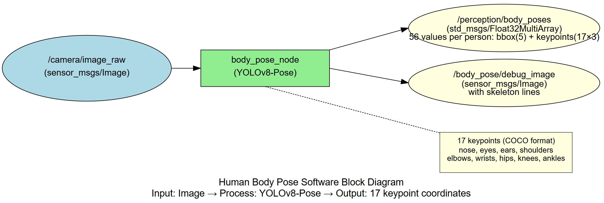
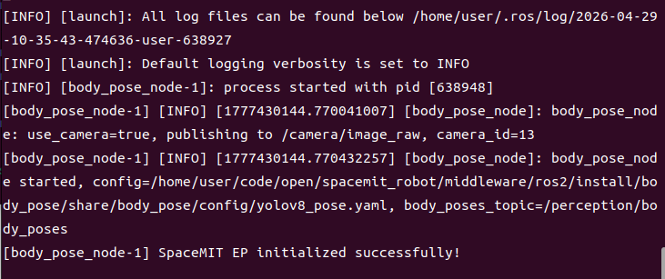
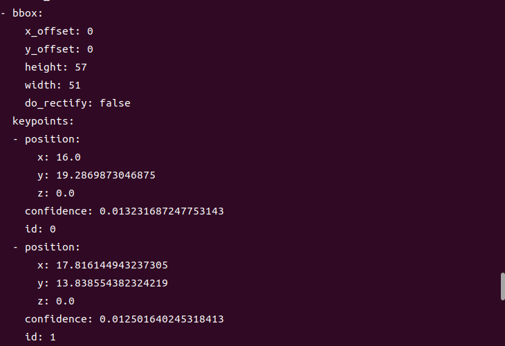

# Perception · Body Pose Estimation

## 1. Overview

This module provides YOLOv8-Pose-based body pose estimation, detecting people in images and outputting 17 keypoints (COCO format) including head, torso, and limb landmarks. It is suitable for action recognition, pose analysis, fitness coaching, and similar applications.

### Features

- **Algorithm**: YOLOv8-Pose (YOLOv8n-pose lightweight variant)
- **Input Resolution**: 640×640
- **Keypoint Count**: 17 (COCO standard)
- **Keypoint Types**: nose, eyes, ears, shoulders, elbows, wrists, hips, knees, ankles
- **Inference Backend**: SpaceMIT EP (ONNX Runtime)
- **Output Format**: Float32MultiArray (56 values per person: bbox + 17×3 keypoint coordinates and visibility)

### Software Architecture



### Directory Structure

```
body_pose/
├── src/
│   └── body_pose_node.cpp         # Main node implementation
├── config/
│   ├── body_pose.yaml             # Node configuration
│   └── yolov8_pose.yaml           # Model configuration
├── launch/
│   └── body_pose.launch.py        # Launch file
└── package.xml
```

## 2. Environment Setup

### Prerequisites

**Runtime Environment**
- Operating System: Ubuntu 20.04 or 22.04
- ROS Version: ROS 2 Humble

**Dependencies**
- `output/staging`: Vision inference library (`libvision.so` and `vision_service.h`)
- YOLOv8-Pose model file: `~/.cache/models/vision/yolov8_pose/yolov8n-pose.q.onnx`
- ROS 2 packages: rclcpp, sensor_msgs, std_msgs, perception_common

**Hardware Requirements**
- USB camera or network camera

**Environment Initialization**
- Refer to the ROS 2 environment setup in [02-Quick Start](../../02-快速入门/index.md)

### Build

**Obtain Source Code**
- Follow [02-Quick Start · 2.3 Building and Compilation](../../02-快速入门/2.3-构建编译.md) to obtain the complete source code

**Build Steps**
```bash
cd spacemit_robot
source build/envsetup.sh
cd components/model_zoo/vision
mm
bash scripts/download_all_models.sh
bash scripts/download_assets.sh
cd ../../../
colcon build --packages-select body_pose
source install/setup.bash
```

**Build Artifacts**
- Executable: `install/lib/body_pose/body_pose_node`

## 3. Quick Start

This section provides complete instructions to get body pose estimation running quickly.

### 3.1 Real-Time Pose Estimation with Camera

**Preparation**
1. Ensure the camera is connected to the device
2. Verify the model file is downloaded to `~/.cache/models/vision/yolov8_pose/yolov8n-pose.q.onnx`
3. Check the camera device number: `ls /dev/video*`

**Important**: If your camera is not `/dev/video0`, modify the `camera_id` parameter in `config/body_pose.yaml`.

**Step 1: Launch the Body Pose Node**
```bash
source install/setup.bash
ros2 launch body_pose body_pose.launch.py
```

**Terminal Output:**



**Step 2: View Pose Data**

Open a new terminal and view the keypoint data:
```bash
# Terminal 2: View keypoint data
ros2 topic echo /perception/body_poses
```

**Terminal Output:**



## 4. Application Development

### API Reference

**Subscribed Topics**
- `/camera/image_raw` (sensor_msgs/Image) - Input image

**Published Topics**
- `/perception/body_poses` (std_msgs/Float32MultiArray) - 56 values per person: bbox(5) + keypoints(17×3)
- `/body_pose/debug_image` (sensor_msgs/Image) - Visualization image with skeleton overlay

### Keypoint Description

**COCO 17 Keypoint Order** (0-indexed):
- 0: nose
- 1: left_eye
- 2: right_eye
- 3: left_ear
- 4: right_ear
- 5: left_shoulder
- 6: right_shoulder
- 7: left_elbow
- 8: right_elbow
- 9: left_wrist
- 10: right_wrist
- 11: left_hip
- 12: right_hip
- 13: left_knee
- 14: right_knee
- 15: left_ankle
- 16: right_ankle

**[Image placeholder: Body keypoint location diagram]**

**Visibility Values**:
- 0: not visible
- 1: occluded
- 2: visible

### Usage

**Parameter Configuration**
- `use_camera`: When true, connects directly to camera; when false, subscribes to external image topic
- `score_threshold`: Confidence threshold, default 0.25

**Command-Line Parameter Example**
```bash
# Use camera 1 with confidence threshold 0.3
ros2 launch body_pose body_pose.launch.py camera_id:=1 score_threshold:=0.3
```

### Notes

1. **Keypoint Coordinates**: x, y are pixel coordinates with origin at the top-left corner
2. **Visibility Check**: Use the visibility value to determine if a keypoint is usable
3. **Partial Occlusion**: When a person is partially occluded, occluded keypoints will have visibility marked as 0 or 1

### References

- Configuration file: `install/share/body_pose/config/body_pose.yaml`
- Model configuration: `install/share/body_pose/config/yolov8_pose.yaml`
- Launch file: `install/share/body_pose/launch/body_pose.launch.py`

## 5. Debugging

### Log Debugging

**View Node Logs**
```bash
# Logs are automatically output to the terminal after launching the node
ros2 launch body_pose body_pose.launch.py
```

**Tip**: To adjust the log level, modify the logging configuration in the launch file

### Common Debugging Commands

**Check Topic Status**
```bash
# List all related topics
ros2 topic list | grep body_pose

# Check topic publish rate
ros2 topic hz /perception/body_poses

# View node parameters
ros2 param list /body_pose_node
```

### Performance Analysis

**Check CPU Usage**
```bash
top -p $(pgrep -f body_pose_node)
```

**Check Inference Latency**
- Look for inference time output in the node logs

## 6. Troubleshooting

| Symptom | Possible Cause | Solution |
| --- | --- | --- |
| Node fails to start, model file not found | Incorrect model path configuration | Check if `~/.cache/models/vision/yolov8_pose/yolov8n-pose.q.onnx` exists |
| No pose output | No people in input image or confidence threshold too high | 1. Verify people with full bodies are in the scene<br>2. Lower score_threshold |
| Inaccurate keypoint positions | Person occluded or complex pose | 1. Improve camera angle<br>2. Increase image resolution<br>3. Use a larger model |
| Node crashes with exit -11 | Inference library or camera driver issue | See "Crash Troubleshooting" section, use gdb for diagnosis |
| Severe keypoint jitter | Unstable detection | 1. Increase confidence threshold<br>2. Add temporal smoothing algorithm |
| Small bodies missing keypoints | Insufficient input resolution | Increase input image resolution |

## Appendix

### Application Scenarios

- **Action Recognition**: Provides skeleton sequence data as input for action recognition
- **Pose Analysis**: Analyzes body posture for fitness coaching and rehabilitation training
- **Gesture Recognition**: Combines hand keypoints for gesture recognition
- **Fall Detection**: Determines falls based on keypoint positions
- **Human-Computer Interaction**: Pose-based interaction control
- **Sports Analysis**: Motion analysis in athletic activities
