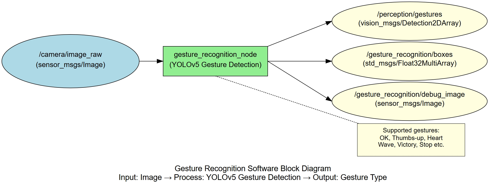
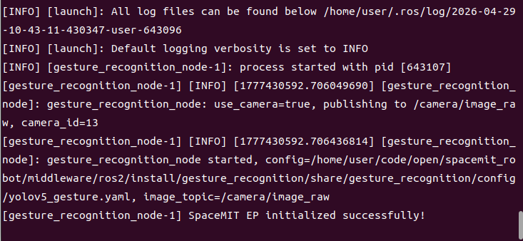
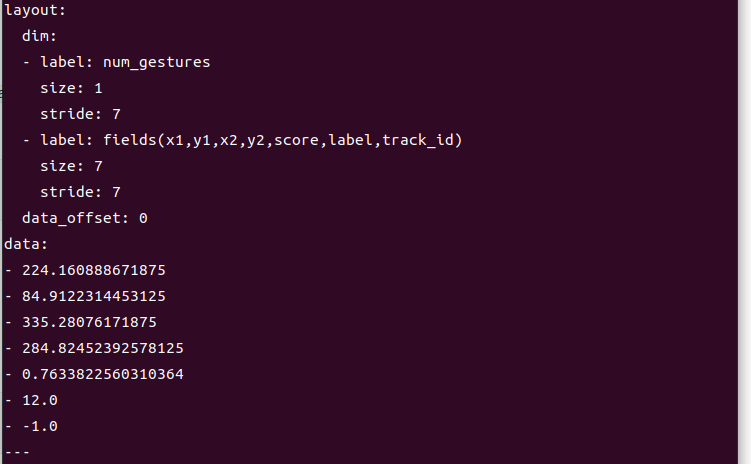

# Perception · Gesture Recognition

## 1. Overview

This module provides YOLOv5-based gesture recognition, detecting hands in images and classifying gesture types. It is suitable for human-computer interaction, gesture control, sign language recognition, and similar applications.

### Features

- **Algorithm**: YOLOv5 gesture detection model
- **Input Resolution**: Configurable, default 640×640
- **Supported Gesture Types**: Depends on trained model (e.g., OK, thumbs up, heart, wave, etc.)
- **Inference Backend**: SpaceMIT EP (ONNX Runtime)
- **Output Formats**: vision_msgs/Detection2DArray, Float32MultiArray

### Software Architecture



### Directory Structure

```
gesture_recognition/
├── src/
│   └── gesture_recognition_node.cpp   # Main node implementation
├── config/
│   └── yolov5_gesture.yaml            # Model configuration
├── launch/
│   └── gesture_recognition.launch.py  # Launch file
└── package.xml
```

## 2. Environment Setup

### Prerequisites

**Runtime Environment**
- Operating System: Ubuntu 20.04 or 22.04
- ROS Version: ROS 2 Humble

**Dependencies**
- `output/staging`: Vision inference library (`libvision.so` and `vision_service.h`)
- YOLOv5 gesture model file: `~/.cache/models/vision/yolov5/yolov5_gesture.q.onnx`
- ROS 2 packages: rclcpp, sensor_msgs, std_msgs, perception_common, vision_msgs

**Hardware Requirements**
- USB camera or network camera

**Environment Initialization**
- Refer to the ROS 2 environment setup in [02-Quick Start](../../02-快速入门/index.md)

### Build

**Obtain Source Code**
- Follow [02-Quick Start · 2.3 Building and Compilation](../../02-快速入门/2.3-构建编译.md) to obtain the complete source code

**Build Steps**
```bash
cd spacemit_robot
source build/envsetup.sh
cd components/model_zoo/vision
mm
bash scripts/download_all_models.sh
bash scripts/download_assets.sh
cd ../../../
colcon build --packages-select gesture_recognition
source install/setup.bash
```

**Build Artifacts**
- Executable: `install/lib/gesture_recognition/gesture_recognition_node`

## 3. Quick Start

This section provides complete instructions to get gesture recognition running quickly.

### 3.1 Real-Time Gesture Recognition with Camera

**Preparation**
1. Ensure the camera is connected to the device
2. Verify the model file is downloaded to `~/.cache/models/vision/yolov5/yolov5_gesture.q.onnx`
3. Check the camera device number: `ls /dev/video*`

**Important**: If your camera is not `/dev/video0`, modify the `camera_id` parameter in `config/gesture_recognition.yaml`.

**Step 1: Launch the Gesture Recognition Node**
```bash
source install/setup.bash
ros2 launch gesture_recognition gesture_recognition.launch.py
```

**Terminal Output:**



**Step 2: View Recognition Results**

Open a new terminal and view the gesture detection boxes:
```bash
# Terminal 2: View gesture detection boxes
ros2 topic echo /gesture_recognition/boxes
```

**Terminal Output:**



## 4. Application Development

### API Reference

**Subscribed Topics**
- `/camera/image_raw` (sensor_msgs/Image) - Input image

**Published Topics**
- `/perception/gestures` (vision_msgs/Detection2DArray) - Standard detection message
- `/gesture_recognition/boxes` (std_msgs/Float32MultiArray) - 7 values per gesture: x1, y1, x2, y2, score, label, track_id
- `/gesture_recognition/debug_image` (sensor_msgs/Image) - Visualization image with boxes and labels

### Usage

**Parameter Configuration**
- `use_camera`: When true, connects directly to camera and publishes images; when false, subscribes to external image topic
- `score_threshold`: Confidence threshold for adjusting recognition sensitivity
- `class`: Gesture class configuration, must match the model

**Command-Line Parameter Example**
```bash
# Use camera 1 with confidence threshold 0.4
ros2 launch gesture_recognition gesture_recognition.launch.py camera_id:=1 score_threshold:=0.4
```

### Notes

1. **Gesture types depend on the trained model**: Ensure the `class` configuration in yaml matches the model
2. **Lighting conditions affect recognition performance**: Use in good lighting for best results
3. **Gestures should be clearly visible**: Gestures should not be occluded and must be within camera view
4. **Maintain appropriate distance**: Gestures should not be too far from or too close to the camera

### References

- Configuration file: `install/share/gesture_recognition/config/yolov5_gesture.yaml`
- Launch file: `install/share/gesture_recognition/launch/gesture_recognition.launch.py`

## 5. Debugging

### Log Debugging

**View Node Logs**
```bash
# Logs are automatically output to the terminal after launching the node
ros2 launch gesture_recognition gesture_recognition.launch.py
```

**Tip**: To adjust the log level, modify the logging configuration in the launch file

### Common Debugging Commands

**Check Topic Status**
```bash
# List all related topics
ros2 topic list | grep gesture_recognition

# Check topic publish rate
ros2 topic hz /gesture_recognition/boxes

# View node parameters
ros2 param list /gesture_recognition_node
```

**Adjust Parameters Dynamically**
```bash
# Modify confidence threshold dynamically
ros2 param set /gesture_recognition_node score_threshold 0.4
```

**Check Input Image**
```bash
# Verify image topic has data
ros2 topic hz /camera/image_raw
```

### Performance Analysis

**Check CPU Usage**
```bash
top -p $(pgrep -f gesture_recognition_node)
```

**Check Inference Latency**
- Look for inference time output in the node logs

## 6. Troubleshooting

| Symptom | Possible Cause | Solution |
| --- | --- | --- |
| Node fails to start, model file not found | Incorrect model path configuration | Check if `~/.cache/models/vision/yolov5/yolov5_gesture.q.onnx` exists |
| No recognition output | No gestures in input image or confidence threshold too high | 1. Verify clear gestures are present in the scene<br>2. Lower score_threshold |
| Incorrect gesture recognition | Insufficient training data or non-standard gesture | 1. Use standard gestures<br>2. Improve lighting conditions<br>3. Retrain the model |
| High recognition latency | Image resolution too high or insufficient hardware performance | 1. Reduce input resolution<br>2. Adjust num_threads parameter |
| False detections of other objects as gestures | Confidence threshold too low | Increase score_threshold parameter |
| Missing vision_msgs | ROS 2 dependency package not installed | Install dependency: `sudo apt install ros-humble-vision-msgs` |

## Appendix

### Common Gesture Types

Depending on the trained model, supported gesture types may include:
- **OK Gesture**: Thumb and index finger forming a circle
- **Thumbs Up**: Thumb raised upward
- **Heart Gesture**: Hands or hand forming a heart shape
- **Wave**: Palm moving left and right
- **Victory Gesture**: Index and middle fingers forming a V shape
- **Stop Gesture**: Palm extended forward

### Application Scenarios

- **Human-Computer Interaction**: Control robots or devices using gestures
- **Sign Language Recognition**: Recognize sign language for communication
- **Smart Home**: Gesture control of home appliances
- **Game Control**: Use gestures for game operations
- **Presentation Control**: Gesture control for advancing presentation slides
