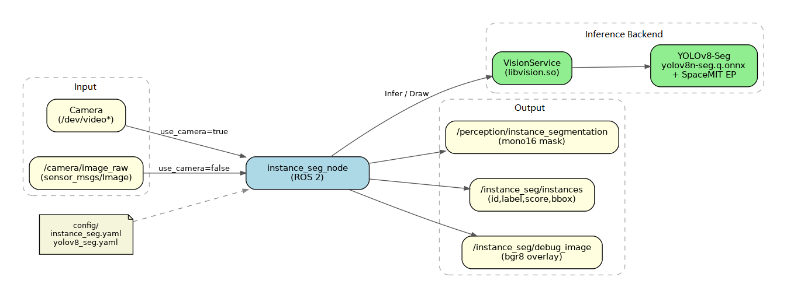
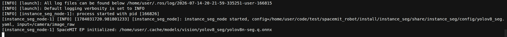

# Perception · Instance Segmentation

## 1. Overview

This module provides YOLOv8-Seg-based instance segmentation, outputting segmentation masks and bounding boxes for each object instance in images. It is suitable for object cutout, precise contour perception, scene interaction, and similar applications.

### Features

- **Algorithm**: YOLOv8n-Seg (quantized ONNX, optimized for on-device inference)
- **Input Resolution**: 640×640
- **Supported Classes**: COCO 80 classes
- **Inference Backend**: SpaceMIT EP (ONNX Runtime)
- **Output Formats**:
  - `sensor_msgs/Image` (`mono16` instance mask)
  - `std_msgs/Float32MultiArray` (instance metadata)
  - `sensor_msgs/Image` (`bgr8` debug overlay)

### Software Architecture



### Directory Structure

```
instance_seg/
├── src/
│   ├── instance_seg_node.cpp   # Main node implementation
│   ├── image_utils.cpp         # Image message conversion
│   └── instance_utils.cpp      # Instance metadata encoding
├── config/
│   ├── instance_seg.yaml       # Node parameters
│   └── yolov8_seg.yaml         # Model configuration
├── launch/
│   └── instance_seg.launch.py  # Launch file
├── include/instance_seg/
├── tests/
└── package.xml
```

## 2. Environment Setup

### Prerequisites

**Runtime Environment**
- Operating System: Ubuntu 20.04 or 22.04
- ROS Version: ROS 2 Humble

**Dependencies**
- `output/staging`: Vision inference library (`libvision.so` and `vision_service.h`)
- YOLOv8-Seg model: `~/.cache/models/vision/yolov8_seg/yolov8n-seg.q.onnx`
- COCO label file: `assets/labels/coco.txt` (resolved relative to model project root)
- ROS 2 packages: rclcpp, sensor_msgs, std_msgs, ament_index_cpp

**Hardware Requirements**
- USB camera or external image topic input
- Device nodes can be checked with `ls /dev/video*`

**Environment Initialization**
- Refer to the ROS 2 environment setup in [02-Quick Start](../../02-快速入门/index.md)

### Build

**Obtain Source Code**
- Follow [02-Quick Start · 2.3 Building and Compilation](../../02-快速入门/2.3-构建编译.md) to obtain the complete source code

**Build Steps**
```bash
cd spacemit_robot
source build/envsetup.sh
cd components/model_zoo/vision
mm
bash scripts/download_all_models.sh
bash scripts/download_assets.sh
cd ../../../
# Recommended: Install package to output/staging using SDK method
cd middleware/ros2/perception/instance_seg && mm --with-deps
# Or:
# colcon build --packages-select instance_seg
# source install/setup.bash
```

**Build Artifacts**
- Executable: `install/lib/instance_seg/instance_seg_node`
  (If using SDK staging: `output/staging/lib/instance_seg/instance_seg_node`)

## 3. Quick Start

This section provides complete instructions to get instance segmentation running quickly.

### 3.1 Real-Time Segmentation with Camera

**Preparation**
1. Ensure the camera is connected
2. Verify the model is downloaded to `~/.cache/models/vision/yolov8_seg/yolov8n-seg.q.onnx`
3. Check the camera device number:
   ```bash
   ls /dev/video*
   ```

**Important**: The default configuration in `config/instance_seg.yaml` sets `camera_id` to `1`. If your camera is a different device, modify this parameter.

**Step 1: Launch the Instance Segmentation Node**
```bash
source install/setup.bash   # or source output/staging/setup.bash
ros2 launch instance_seg instance_seg.launch.py
```

**Terminal Output:**



**Step 2: View Instance Metadata**

Open a new terminal:
```bash
ros2 topic echo /instance_seg/instances
```

Each message contains 7 fields per instance: `id, label, score, x1, y1, x2, y2`.

**Terminal Output:**


**Step 3: View Masks and Debug Image**
```bash
# Instance mask (mono16; 0 for background, 1..N for instance IDs in current frame)
ros2 topic echo /perception/instance_segmentation --once --qos-reliability best_effort

# Debug overlay (if no rqt, use other tools to subscribe to this topic)
ros2 topic hz /instance_seg/debug_image
```

### 3.2 Subscribe to External Image Topic

If not using the onboard camera, disable camera mode and subscribe to an external `sensor_msgs/Image`:

```bash
ros2 run instance_seg instance_seg_node --ros-args \
  -p use_camera:=false \
  -p image_topic:=/camera/image_raw
```

Then have another node publish images to `/camera/image_raw`.

## 4. Application Development

### API Reference

**Subscribed Topics**
- `/camera/image_raw` (`sensor_msgs/Image`): Subscribed when `use_camera:=false`; when `use_camera:=true`, the node opens the camera and publishes to this topic

**Published Topics**
- `/perception/instance_segmentation` (`sensor_msgs/Image`, `mono16`): Pixel 0 is background, 1..N are instance IDs
- `/instance_seg/instances` (`std_msgs/Float32MultiArray`): Continuous fields `[id,label,score,x1,y1,x2,y7]`
- `/instance_seg/debug_image` (`sensor_msgs/Image`, `bgr8`): `VisionService::Draw` visualization result

### Usage

**Parameter Configuration (`config/instance_seg.yaml`)**

| Parameter | Default | Description |
| --- | --- | --- |
| `config_path` | Empty (auto-resolves to `yolov8_seg.yaml`) | Model yaml path |
| `lazy_load` | `true` | Whether to lazy-load the model |
| `score_threshold` | `0.25` | Instance confidence threshold, range `[0, 1]` |
| `image_topic` | `/camera/image_raw` | Image topic |
| `mask_topic` | `/perception/instance_segmentation` | Mask output topic |
| `instances_topic` | `/instance_seg/instances` | Metadata output topic |
| `debug_image_topic` | `/instance_seg/debug_image` | Debug image topic |
| `use_camera` | `true` | Whether to connect directly to camera |
| `camera_id` | `1` | Camera device number |
| `camera_fps` | `30.0` | Camera capture frame rate, must be `> 0` |

**Command-Line Parameter Example**
```bash
ros2 launch instance_seg instance_seg.launch.py \
  use_camera:=false \
  image_topic:=/camera/image_raw \
  score_threshold:=0.35
```

### Notes

1. **Instance masks correspond one-to-one with metadata**: Mask IDs match the `id` field in `instances` (starting from 1)
2. **Overlapping regions**: When the same pixel is covered by multiple instances, the later valid instance takes precedence
3. **Invalid masks are skipped**: Empty, non-single-channel, or size-mismatched masks are discarded with throttled warnings
4. **mask/debug topic QoS**: Uses `SensorDataQoS` (best_effort); match reliability when subscribing

### References

- Node configuration: `install/share/instance_seg/config/instance_seg.yaml`
- Model configuration: `install/share/instance_seg/config/yolov8_seg.yaml`
- Launch file: `install/share/instance_seg/launch/instance_seg.launch.py`
- Package README: `middleware/ros2/perception/instance_seg/README.md`

## 5. Debugging

### Log Debugging

```bash
ros2 launch instance_seg instance_seg.launch.py
# Should see output similar to:
# instance_seg_node started, config=..., input=...
# SpaceMIT EP initialized: .../yolov8n-seg.q.onnx
```

### Common Debugging Commands

```bash
# Verify node and topics
ros2 node list | grep instance_seg
ros2 topic list | grep -E 'instance_seg|instance_segmentation'

# Check output rate
ros2 topic hz /instance_seg/instances
ros2 topic hz /perception/instance_segmentation

# View parameters
ros2 param list /instance_seg_node
```

### Performance Analysis

```bash
top -p $(pgrep -f instance_seg_node)
```

## 6. Troubleshooting

| Symptom | Possible Cause | Solution |
| --- | --- | --- |
| Node fails to start, model not found | Incorrect `model_path` in `yolov8_seg.yaml` or model not downloaded | Check `~/.cache/models/vision/yolov8_seg/yolov8n-seg.q.onnx`, re-run model download script if necessary |
| Topic exists but no output for long time | 1. No input image<br>2. Confidence too high, filtered out<br>3. Inference failed | 1. Verify camera/`image_topic` has data<br>2. Lower `score_threshold`<br>3. Check node throttled warnings |
| Cannot echo mask/debug | QoS mismatch | Add `--qos-reliability best_effort` |
| `camera_fps` / `score_threshold` causes immediate exit | Parameter out of bounds | `score_threshold` must be in `[0,1]`, `camera_fps` must be finite and `> 0` |
| External topic has no input | Still in camera mode | Set `use_camera:=false` and specify correct `image_topic` |

## Appendix

### Application Scenarios

- **Object Cutout**: Extract object regions using instance masks
- **Precise Obstacle Avoidance**: Use contour information for close-range interaction
- **Detection Enhancement**: Supplement bounding boxes with pixel-level instance contours

### Difference from Semantic Segmentation

| Comparison | Instance Segmentation (this module) | Semantic Segmentation (5.1.7) |
| --- | --- | --- |
| Model | YOLOv8-Seg | PP-LiteSeg |
| Output Meaning | One instance ID per object | One semantic class per pixel |
| Mask Format | `mono16` | `mono8` |
| Metadata | Instance boxes + score + label | Pixel count per class |
