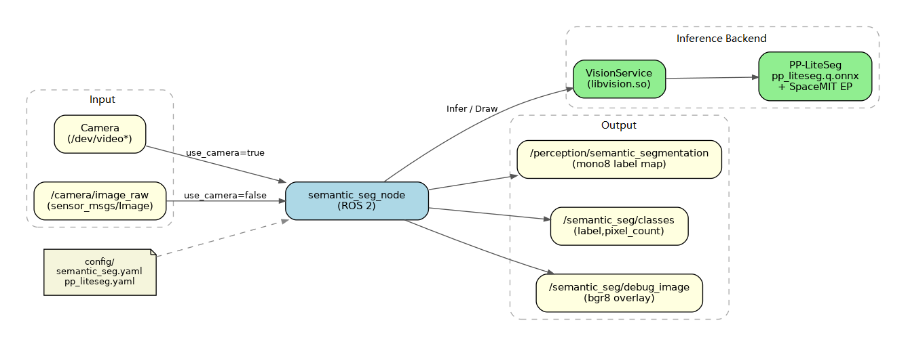
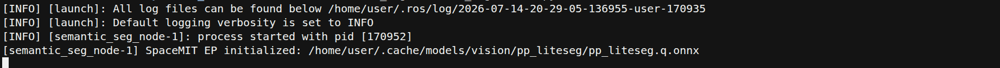
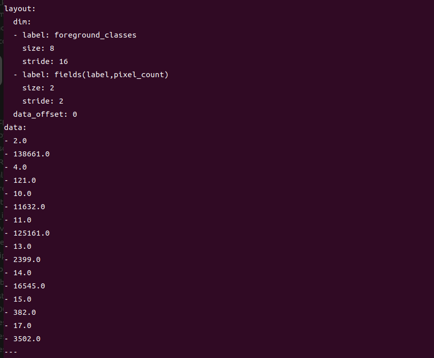

# Perception · Semantic Segmentation

## 1. Overview

This module provides PP-LiteSeg-based semantic segmentation, assigning semantic classes to each pixel in images. It is suitable for scene understanding, drivable area analysis, environmental semantic modeling, and similar applications.

### Features

- **Algorithm**: PP-LiteSeg (Cityscapes, 19 classes)
- **Inference Backend**: SpaceMIT EP (ONNX Runtime)
- **Output Formats**:
  - `sensor_msgs/Image` (`mono8` class label map)
  - `std_msgs/Float32MultiArray` (foreground class pixel statistics)
  - `sensor_msgs/Image` (`bgr8` debug overlay)
- **Not Supported**: Instance-level IDs, object tracking

### Software Architecture



### Directory Structure

```
semantic_seg/
├── src/
│   ├── semantic_seg_node.cpp    # Main node implementation
│   ├── image_utils.cpp          # Image message conversion
│   └── segmentation_utils.cpp   # Mask composition and pixel statistics
├── config/
│   ├── semantic_seg.yaml        # Node parameters
│   └── pp_liteseg.yaml          # Model configuration
├── launch/
│   └── semantic_seg.launch.py   # Launch file
├── include/semantic_seg/
├── tests/
└── package.xml
```

## 2. Environment Setup

### Prerequisites

**Runtime Environment**
- Operating System: Ubuntu 20.04 or 22.04
- ROS Version: ROS 2 Humble

**Dependencies**
- `output/staging`: Vision inference library (`libvision.so` and `vision_service.h`)
- PP-LiteSeg model: `~/.cache/models/vision/pp_liteseg/pp_liteseg.q.onnx`
- ROS 2 packages: rclcpp, sensor_msgs, std_msgs, ament_index_cpp

**Hardware Requirements**
- USB camera or external image topic input
- Device nodes can be checked with `ls /dev/video*`

**Environment Initialization**
- Refer to the ROS 2 environment setup in [02-Quick Start](../../02-快速入门/index.md)

### Build

**Obtain Source Code**
- Follow [02-Quick Start · 2.3 Building and Compilation](../../02-快速入门/2.3-构建编译.md) to obtain the complete source code

**Build Steps**
```bash
cd spacemit_robot
source build/envsetup.sh
cd components/model_zoo/vision
mm
bash scripts/download_all_models.sh
bash scripts/download_assets.sh
cd ../../../
# Recommended: Install package to output/staging using SDK method
cd middleware/ros2/perception/semantic_seg && mm --with-deps
# Or:
# colcon build --packages-select semantic_seg
# source install/setup.bash
```

**Build Artifacts**
- Executable: `install/lib/semantic_seg/semantic_seg_node`
  (If using SDK staging: `output/staging/lib/semantic_seg/semantic_seg_node`)

## 3. Quick Start

This section provides complete instructions to get semantic segmentation running quickly.

### 3.1 Real-Time Segmentation with Camera

**Preparation**
1. Ensure the camera is connected
2. Verify the model is downloaded to `~/.cache/models/vision/pp_liteseg/pp_liteseg.q.onnx`
3. Check the camera device number:
   ```bash
   ls /dev/video*
   ```

**Important**: The default configuration in `config/semantic_seg.yaml` sets `camera_id` to `1`. If your camera is a different device, modify this parameter.

**Step 1: Launch the Semantic Segmentation Node**
```bash
source install/setup.bash   # or source output/staging/setup.bash
ros2 launch semantic_seg semantic_seg.launch.py
```

**Terminal Output:**



**Step 2: View Class Pixel Statistics**

Open a new terminal:
```bash
ros2 topic echo /semantic_seg/classes
```

Each message contains repeated pairs of `[label, pixel_count]`, including only foreground classes (label ≠ 0).

**Terminal Output:**



**Step 3: View Mask and Debug Image**
```bash
# Semantic label map (mono8; pixel value is class ID, 0 is background)
ros2 topic echo /perception/semantic_segmentation --once --qos-reliability best_effort

# Debug overlay rate
ros2 topic hz /semantic_seg/debug_image
```

### 3.2 Subscribe to External Image Topic

```bash
ros2 run semantic_seg semantic_seg_node --ros-args \
  -p use_camera:=false \
  -p image_topic:=/camera/image_raw
```

Then have another node publish images to `/camera/image_raw`.

## 4. Application Development

### API Reference

**Subscribed Topics**
- `/camera/image_raw` (`sensor_msgs/Image`): Subscribed when `use_camera:=false`; when `use_camera:=true`, the node opens the camera and publishes to this topic

**Published Topics**
- `/perception/semantic_segmentation` (`sensor_msgs/Image`, `mono8`): Pixel value is class ID, 0 is background
- `/semantic_seg/classes` (`std_msgs/Float32MultiArray`): Paired fields `[label, pixel_count]`
- `/semantic_seg/debug_image` (`sensor_msgs/Image`, `bgr8`): `VisionService::Draw` visualization result

### Semantic Classes (Cityscapes 19-Class Reference)

The default model is based on Cityscapes-style classes (specifics depend on model training), commonly including:
- Road, sidewalk, building, wall, fence, pole
- Traffic light, traffic sign, vegetation, terrain, sky
- Person, rider, car, truck, bus, train, motorcycle, bicycle

### Usage

**Parameter Configuration (`config/semantic_seg.yaml`)**

| Parameter | Default | Description |
| --- | --- | --- |
| `config_path` | Empty (auto-resolves to `pp_liteseg.yaml`) | Model yaml path |
| `lazy_load` | `true` | Whether to lazy-load the model |
| `image_topic` | `/camera/image_raw` | Image topic |
| `mask_topic` | `/perception/semantic_segmentation` | Label map output topic |
| `classes_topic` | `/semantic_seg/classes` | Class pixel statistics topic |
| `debug_image_topic` | `/semantic_seg/debug_image` | Debug image topic |
| `use_camera` | `true` | Whether to connect directly to camera |
| `camera_id` | `1` | Camera device number |
| `camera_fps` | `30.0` | Camera capture frame rate, must be `> 0` |

**Command-Line Parameter Example**
```bash
ros2 launch semantic_seg semantic_seg.launch.py \
  use_camera:=false \
  image_topic:=/camera/image_raw
```

### Notes

1. **Label range**: Valid foreground labels are `1..255`; invalid masks are skipped
2. **Overlap handling**: When multiple valid masks overlap, later ones overwrite earlier ones
3. **mask/debug topic QoS**: Uses `SensorDataQoS` (best_effort); match reliability when subscribing
4. **Computational load**: Segmentation is heavier than detection; monitor on-device frame rate and thread count configuration (see `pp_liteseg.yaml`)

### References

- Node configuration: `install/share/semantic_seg/config/semantic_seg.yaml`
- Model configuration: `install/share/semantic_seg/config/pp_liteseg.yaml`
- Launch file: `install/share/semantic_seg/launch/semantic_seg.launch.py`
- Package README: `middleware/ros2/perception/semantic_seg/README.md`

## 5. Debugging

### Log Debugging

```bash
ros2 launch semantic_seg semantic_seg.launch.py
# Should see output similar to:
# SpaceMIT EP initialized: .../pp_liteseg.q.onnx
```

### Common Debugging Commands

```bash
# Verify node and topics
ros2 node list | grep semantic_seg
ros2 topic list | grep -E 'semantic_seg|semantic_segmentation'

# Check output rate
ros2 topic hz /semantic_seg/classes
ros2 topic hz /perception/semantic_segmentation

# View parameters
ros2 param list /semantic_seg_node
```

### Performance Optimization Tips

- Ensure using quantized model `pp_liteseg.q.onnx`
- Configure `default_params.num_threads` appropriately
- Avoid running too many inference nodes simultaneously on the same device

## 6. Troubleshooting

| Symptom | Possible Cause | Solution |
| --- | --- | --- |
| Node fails to start, model not found | Incorrect `model_path` in `pp_liteseg.yaml` or model not downloaded | Check `~/.cache/models/vision/pp_liteseg/pp_liteseg.q.onnx`, re-run model download script if necessary |
| Topic exists but all results are background | Abnormal input image or inference failure | Check input topic and node logs for `infer failed` warnings |
| Cannot echo mask/debug | QoS mismatch | Add `--qos-reliability best_effort` |
| `camera_fps` causes immediate exit | Invalid parameter | `camera_fps` must be finite and `> 0` |
| External topic has no input | Still in camera mode | Set `use_camera:=false` and specify correct `image_topic` |
| Poor segmentation results | Large domain gap from Cityscapes | Replace with scene-adapted model or augment training data |

## Appendix

### Application Scenarios

- **Scene Understanding**: Distinguish areas like sky, buildings, vegetation, roads
- **Navigation Assistance**: Identify drivable/walkable area semantics
- **Environmental Modeling**: Provide semantic priors for planning and localization

### Difference from Instance Segmentation

| Comparison | Semantic Segmentation (this module) | Instance Segmentation (5.1.6) |
| --- | --- | --- |
| Model | PP-LiteSeg | YOLOv8-Seg |
| Output Meaning | One semantic class per pixel | One instance ID per object |
| Mask Format | `mono8` | `mono16` |
| Metadata | Pixel count per class | Instance boxes + score + label |