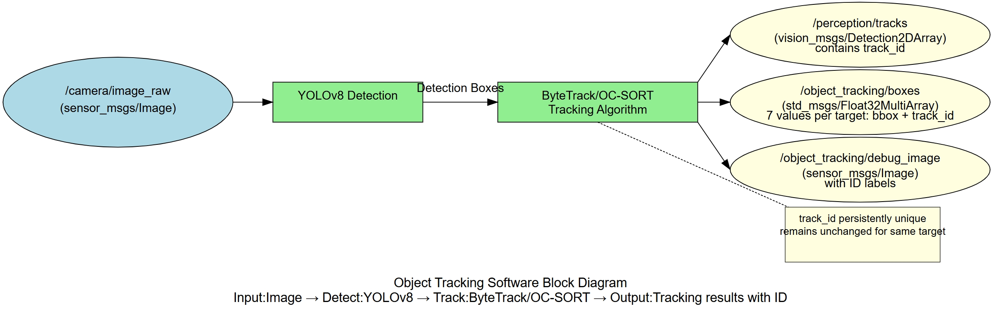
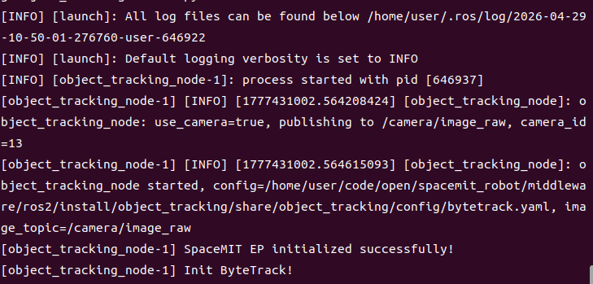
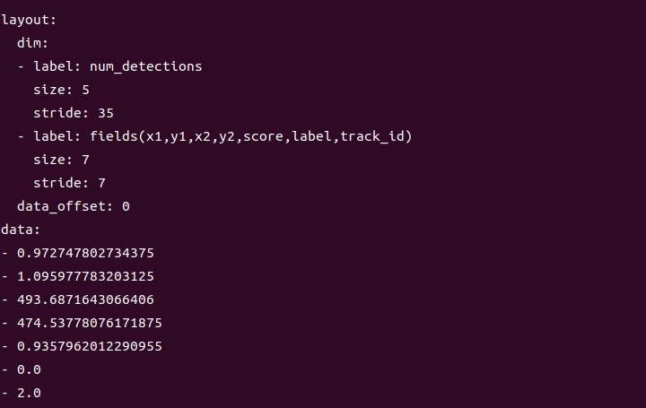

# Perception · Object Tracking

## 1. Overview

This module provides object tracking based on YOLOv8 detection + ByteTrack/OC-SORT tracking algorithms, capable of continuously tracking objects in video sequences and assigning unique IDs to each target. It is suitable for people counting, trajectory analysis, behavior monitoring, and similar applications.

### Features

- **Detection Algorithm**: YOLOv8n
- **Tracking Algorithm**: ByteTrack (default) or OC-SORT (configurable)
- **Input Resolution**: 640×640
- **Supported Classes**: COCO 80 classes
- **Inference Backend**: SpaceMIT EP (ONNX Runtime)
- **Output Formats**: vision_msgs/Detection2DArray (with track_id), Float32MultiArray

### Software Architecture



### Directory Structure

```
object_tracking/
├── src/
│   └── object_tracking_node.cpp       # Main node implementation
├── config/
│   ├── object_tracking.yaml           # Node configuration
│   ├── bytetrack.yaml                 # ByteTrack configuration
│   └── ocsort.yaml                    # OC-SORT configuration
├── launch/
│   └── object_tracking.launch.py      # Launch file
├── scripts/
│   ├── publish_video.py               # Video publishing tool
│   └── simple_image_viewer.py         # Image viewing tool
└── package.xml
```

## 2. Environment Setup

### Prerequisites

**Runtime Environment**
- Operating System: Ubuntu 20.04 or 22.04
- ROS Version: ROS 2 Humble

**Dependencies**
- `output/staging`: Detection/tracking runtime libraries
- YOLOv8 model file: `~/.cache/models/vision/yolov8/yolov8n.q.onnx`
- ROS 2 packages: rclcpp, sensor_msgs, std_msgs, perception_common, vision_msgs
- Python dependencies (for test tools): `pip install opencv-python-headless`

**Hardware Requirements**
- USB camera or network camera

**Environment Initialization**
- Refer to the ROS 2 environment setup in [02-Quick Start](../../02-快速入门/index.md)

### Build

**Obtain Source Code**
- Follow [02-Quick Start · 2.3 Building and Compilation](../../02-快速入门/2.3-构建编译.md) to obtain the complete source code

**Build Steps**
```bash
cd spacemit_robot
source build/envsetup.sh
cd components/model_zoo/vision
mm
bash scripts/download_all_models.sh
bash scripts/download_assets.sh
cd ../../../
colcon build --packages-select object_tracking
source install/setup.bash
```

**Build Artifacts**
- Executable: `install/lib/object_tracking/object_tracking_node`

## 3. Quick Start

This section provides complete instructions to get object tracking running quickly.

### 3.1 Real-Time Tracking with Camera

**Preparation**
1. Ensure the camera is connected to the device
2. Verify the model file is downloaded
3. Check the camera device number: `ls /dev/video*`

**Important**: If your camera is not `/dev/video0`, modify the `camera_id` parameter in `config/object_tracking.yaml`.

**Step 1: Launch the Object Tracking Node**
```bash
source install/setup.bash
ros2 launch object_tracking object_tracking.launch.py
```

**Terminal Output:**



**Step 2: View Tracking Results**

Open a new terminal and view the tracking box data (note the track_id field):
```bash
# Terminal 2: View tracking box data
ros2 topic echo /object_tracking/boxes
```

**Terminal Output:**



### 3.2 Switch to OC-SORT Tracker

ByteTrack and OC-SORT each have advantages; choose based on your scenario.

**Step 1: Modify Configuration File**

Edit `config/object_tracking.yaml` and set:
```yaml
tracker_type: "ocsort"
```

**Step 2: Rebuild**

**Important**: After switching tracking algorithms, you must rebuild the object_tracking package for changes to take effect.

```bash
cd middleware/ros2
colcon build --packages-select object_tracking
source install/setup.bash
```

**Step 3: Launch Tracking Node**
```bash
ros2 launch object_tracking object_tracking.launch.py
```

## 4. Application Development

### API Reference

**Subscribed Topics**
- `/camera/image_raw` (sensor_msgs/Image) - Input image

**Published Topics**
- `/perception/tracks` (vision_msgs/Detection2DArray) - Standard detection message with track_id
- `/object_tracking/boxes` (std_msgs/Float32MultiArray) - 7 values per object: x1, y1, x2, y2, score, label, **track_id**
- `/object_tracking/debug_image` (sensor_msgs/Image) - Visualization image with tracking boxes

### Tracking Algorithm Comparison

| Feature | ByteTrack | OC-SORT |
| --- | --- | --- |
| Speed | Fast | Medium |
| Occlusion Handling | Fair | Good |
| Fast Motion | Good | Fair |
| ID Switches | Few | Very few |
| Re-identification | Not supported | Supported |
| Best For | Fast motion, few occlusions | Heavy occlusions, re-ID needed |

### Usage

**Parameter Configuration**
- `tracker_type`: `"bytetrack"` or `"ocsort"`, selects tracking algorithm
- `config_path`: Leave empty to auto-load corresponding config based on `tracker_type`
- `score_threshold`: Detection confidence threshold
- `use_camera`: When true, connects directly to camera; when false, subscribes to external image topic

**Command-Line Parameter Example**
```bash
# Use OC-SORT with confidence threshold 0.3
ros2 launch object_tracking object_tracking.launch.py tracker_type:=ocsort score_threshold:=0.3
```

### Notes

1. **track_id is a persistent unique identifier**: The same object maintains the same ID across video sequences
2. **Tracking quality depends on detection quality**: Adjust score_threshold to balance recall and precision
3. **ByteTrack is suitable for fast motion scenarios**, OC-SORT for scenarios with heavy occlusions
4. **Video testing better demonstrates tracking performance**: Recommended to test with video files

### References

- Configuration files: `install/share/object_tracking/config/`
- Launch file: `install/share/object_tracking/launch/object_tracking.launch.py`
- Test tools: `install/lib/object_tracking/publish_video`, `install/lib/object_tracking/simple_image_viewer`

## 5. Debugging

### Log Debugging

**View Node Logs**
```bash
# Logs are automatically output to the terminal after launching the node
ros2 launch object_tracking object_tracking.launch.py
```

**Tip**: To adjust the log level, modify the logging configuration in the launch file

### Common Debugging Commands

**Check Topic Status**
```bash
# List all related topics
ros2 topic list | grep object_tracking

# Check topic publish rate
ros2 topic hz /object_tracking/boxes

# View node parameters
ros2 param list /object_tracking_node
```

**Adjust Parameters Dynamically**
```bash
# Modify confidence threshold dynamically
ros2 param set /object_tracking_node score_threshold 0.3
```

### Tracking Performance Evaluation

**Evaluation Metrics**:
- **MOTA** (Multiple Object Tracking Accuracy): Overall tracking accuracy
- **IDF1**: ID preservation accuracy
- **ID Switches**: Number of ID switches (fewer is better)

**Evaluation Methods**:
- Observe whether track_id is stable (same object ID should not change frequently)
- Check ID switch count
- Count lost tracks

### Performance Analysis

**Check CPU Usage**
```bash
top -p $(pgrep -f object_tracking_node)
```

**Check Inference Latency**
- Look for inference time output in the node logs

## 6. Troubleshooting

| Symptom | Possible Cause | Solution |
| --- | --- | --- |
| Node fails to start, model file not found | Incorrect model path configuration | Check if `~/.cache/models/vision/yolov8/yolov8n.q.onnx` exists |
| track_id changes frequently | Unstable detection or improper tracker parameters | 1. Increase detection confidence threshold<br>2. Adjust tracker parameters (e.g., track_thresh)<br>3. Try switching tracking algorithm |
| Object ID changes after reappearing | Tracker failed to re-identify | 1. Use OC-SORT (supports re-identification)<br>2. Adjust track_buffer parameter |
| Multiple objects have same ID | Tracker confusion | 1. Improve detection accuracy<br>2. Adjust match_thresh parameter |
| No tracking output | No objects in input image or detection failed | 1. Check if `/camera/image_raw` has data<br>2. Lower score_threshold |
| High tracking latency | Image resolution too high or insufficient hardware performance | 1. Reduce input resolution<br>2. Adjust num_threads parameter |

## Appendix

### Application Scenarios

- **People Counting**: Count foot traffic in specific areas, analyze people flow
- **Trajectory Analysis**: Record object movement trajectories, analyze behavior patterns
- **Security Monitoring**: Track suspicious objects, record activity traces
- **Traffic Monitoring**: Track vehicles, count traffic flow
- **Sports Analysis**: Track athletes, analyze game data
- **Retail Analysis**: Track customers, analyze shopping behavior
