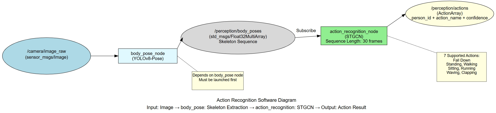
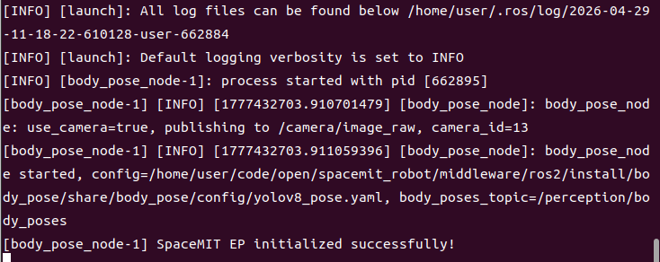
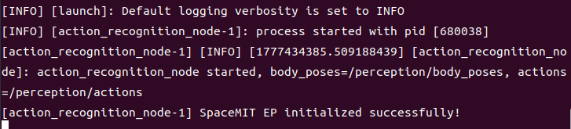
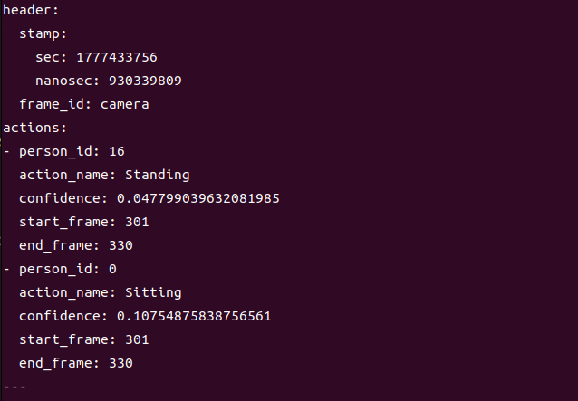

# Perception · Action Recognition

## 1. Overview

This module provides STGCN (Spatial Temporal Graph Convolutional Networks) based action recognition, subscribing to body skeleton sequence data to recognize 7 action classes (including fall detection). It is suitable for fall alerts, behavior analysis, safety monitoring, and similar applications.

### Features

- **Algorithm**: STGCN (Spatial Temporal Graph Convolutional Networks)
- **Input**: Body skeleton sequences (17 keypoints, COCO format)
- **Sequence Length**: 30 frames (configurable)
- **Supported Action Classes**: 7 classes (including Fall Down)
- **Inference Backend**: SpaceMIT EP (ONNX Runtime)
- **Output Format**: Custom ActionArray message

### Software Architecture



### Directory Structure

```
action_recognition/
├── src/
│   └── action_recognition_node.cpp    # Main node implementation
├── config/
│   ├── action_recognition.yaml        # Node configuration
│   └── stgcn.yaml                     # STGCN model configuration
├── launch/
│   └── action_recognition.launch.py   # Launch file
├── msg/
│   ├── Action.msg                     # Single action message
│   └── ActionArray.msg                # Action array message
└── package.xml
```

## 2. Environment Setup

### Prerequisites

**Runtime Environment**
- Operating System: Ubuntu 20.04 or 22.04
- ROS Version: ROS 2 Humble

**Dependencies**
- **body_pose node**: Must be running first to provide `/perception/body_poses` topic
- `output/staging`: Vision inference library (`libvision.so` and `vision_service.h`)
- STGCN model file: Configure model_path in `config/stgcn.yaml`
- ROS 2 packages: rclcpp, sensor_msgs, std_msgs, perception_common

**Hardware Requirements**
- Depends on body_pose node's camera configuration

**Environment Initialization**
- Refer to the ROS 2 environment setup in [02-Quick Start](../../02-快速入门/index.md)

### Build

**Obtain Source Code**
- Follow [02-Quick Start · 2.3 Building and Compilation](../../02-快速入门/2.3-构建编译.md) to obtain the complete source code

**Build Steps**
```bash
cd spacemit_robot
source build/envsetup.sh
cd components/model_zoo/vision
mm
bash scripts/download_all_models.sh
bash scripts/download_assets.sh
cd ../../../
colcon build --packages-select action_recognition
source install/setup.bash
```

**Build Artifacts**
- Executable: `install/lib/action_recognition/action_recognition_node`

## 3. Quick Start

This section provides complete instructions to get action recognition running quickly.

### 3.1 Complete Action Recognition Pipeline

Action recognition requires running the body_pose node first to obtain skeleton data.

**Preparation**
1. Ensure the camera is connected
2. Verify body_pose and action_recognition model files are ready

**Important**: This module receives camera input from `body_pose`; if using camera mode, first change `camera_id` in `body_pose`'s `config/body_pose.yaml` to your actual camera number.

**Step 1: Launch the Body Pose Node**
```bash
# Terminal 1
source install/setup.bash
ros2 launch body_pose body_pose.launch.py
```

**Terminal Output:**



**Step 2: Launch the Action Recognition Node**

Open a new terminal:
```bash
# Terminal 2
source install/setup.bash
ros2 launch action_recognition action_recognition.launch.py
```

**Terminal Output:**



**Step 3: View Action Recognition Results**

Open a new terminal:
```bash
# Terminal 3: View action recognition results
ros2 topic echo /perception/actions
```

**Important Notes**:
- Action recognition requires accumulating **30 frames of skeleton data** before starting inference
- You will see `actions: []` (empty array) for the first 1-2 seconds after startup, which is normal
- Wait approximately 1-2 seconds until 30 frames are accumulated and the inference interval is reached before output appears
- Inference interval defaults to once every 10 frames; adjust the `infer_interval` parameter in the config file if needed

**Terminal Output:**



## 4. Application Development

### API Reference

**Subscribed Topics**
- `/perception/body_poses` (std_msgs/Float32MultiArray) - Skeleton data from body_pose node

**Published Topics**
- `/perception/actions` (action_recognition/msg/ActionArray) - Action recognition results

**ActionArray Message Structure**:
```
std_msgs/Header header
Action[] actions
```

**Action Message Structure**:
```
int32 person_id          # Person ID
string action_name       # Action name (e.g., "Fall Down")
float32 confidence       # Confidence score
int32 start_frame        # Action start frame
int32 end_frame          # Action end frame
```

### Usage

**Parameter Configuration**
- `sequence_length`: Sequence length, default 30 frames
- `inference_interval`: Inference interval, default every 15 frames
- `model_path`: STGCN model path

**Command-Line Parameter Example**
```bash
# Adjust sequence length to 20 frames
ros2 launch action_recognition action_recognition.launch.py sequence_length:=20
```

### Notes

1. **Must launch body_pose node first**, otherwise no skeleton input
2. **Recognition latency = sequence length / frame rate** (e.g., 30 frames / 30fps = 1 second)
3. **Action classes depend on STGCN model training data**
4. **Sequence length affects recognition accuracy and latency**: Longer sequences provide higher accuracy but greater latency

### Supported Action Classes

The STGCN model supports the following 7 action classes:
- **Standing**: Standing still
- **Walking**: Walking
- **Sitting**: Sitting
- **Lying Down**: Lying down
- **Stand up**: Standing up
- **Sit down**: Sitting down
- **Fall Down**: Falling (key detection target)

### References

- Configuration file: `install/share/action_recognition/config/action_recognition.yaml`
- Model configuration: `install/share/action_recognition/config/stgcn.yaml`
- Launch file: `install/share/action_recognition/launch/action_recognition.launch.py`
- Message definitions: `install/share/action_recognition/msg/`

## 5. Debugging

### Log Debugging

**View Node Logs**
```bash
# Logs are automatically output to the terminal after launching the node
ros2 launch action_recognition action_recognition.launch.py
```

**Tip**: To adjust the log level, modify the logging configuration in the launch file

### Common Debugging Commands

**Check Topic Status**
```bash
# List all related topics
ros2 topic list | grep action

# Check topic publish rate
ros2 topic hz /perception/actions

# View node parameters
ros2 param list /action_recognition_node
```

**Check Dependent Nodes**
```bash
# Verify body_pose node is running
ros2 node list | grep body_pose

# Verify skeleton data is being published
ros2 topic hz /perception/body_poses
```

### Log Interpretation

**Normal Logs**:
- `body_poses: N poses, frame=..., buffers=...` - Received skeleton data, shows current buffered frame count
- `STGCN: person_id=... action=...` - Printed when inference succeeds

**Anomalies**:
- Never see `body_poses` log: Not receiving skeleton data, check body_pose node
- See `body_poses` but no `STGCN`: Sequence not filled or inference failed

### Performance Analysis

**Check CPU Usage**
```bash
top -p $(pgrep -f action_recognition_node)
```

**Check Inference Latency**
- Look for inference time output in the node logs

## 6. Troubleshooting

| Symptom | Possible Cause | Solution |
| --- | --- | --- |
| Node fails to start, model file not found | Incorrect STGCN model path configuration | Check model_path in `config/stgcn.yaml` |
| No action recognition output (always shows `actions: []`) | 1. No body_poses data<br>2. Sequence not filled to 30 frames<br>3. Inference interval not reached | 1. Verify body_pose node is running<br>2. Verify people are in the scene<br>3. Wait at least 30 frames (~1 second)<br>4. Verify frame count reaches inference interval multiple (default every 10 frames) |
| No body_poses output in logs | Not receiving skeleton data | 1. Check if body_pose is running<br>2. Verify topic name is `/perception/body_poses` |
| Incorrect action recognition | Insufficient training data or non-standard actions | 1. Use standard actions<br>2. Ensure full body visibility<br>3. Retrain the model |
| High recognition latency | Sequence length too long | Reduce sequence_length parameter (may impact accuracy) |
| Inaccurate fall detection | Inaccurate pose estimation or model precision issues | 1. Improve lighting and camera angle<br>2. Increase body_pose confidence threshold<br>3. Use a larger STGCN model |
