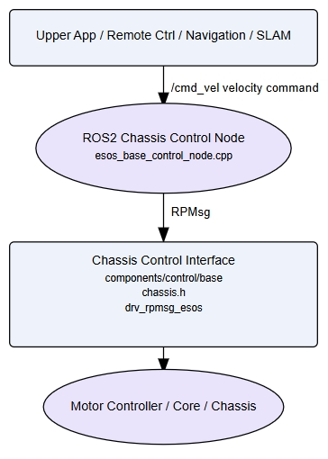
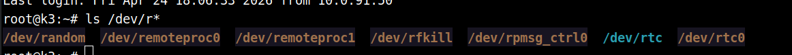
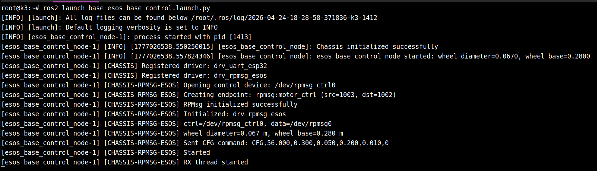
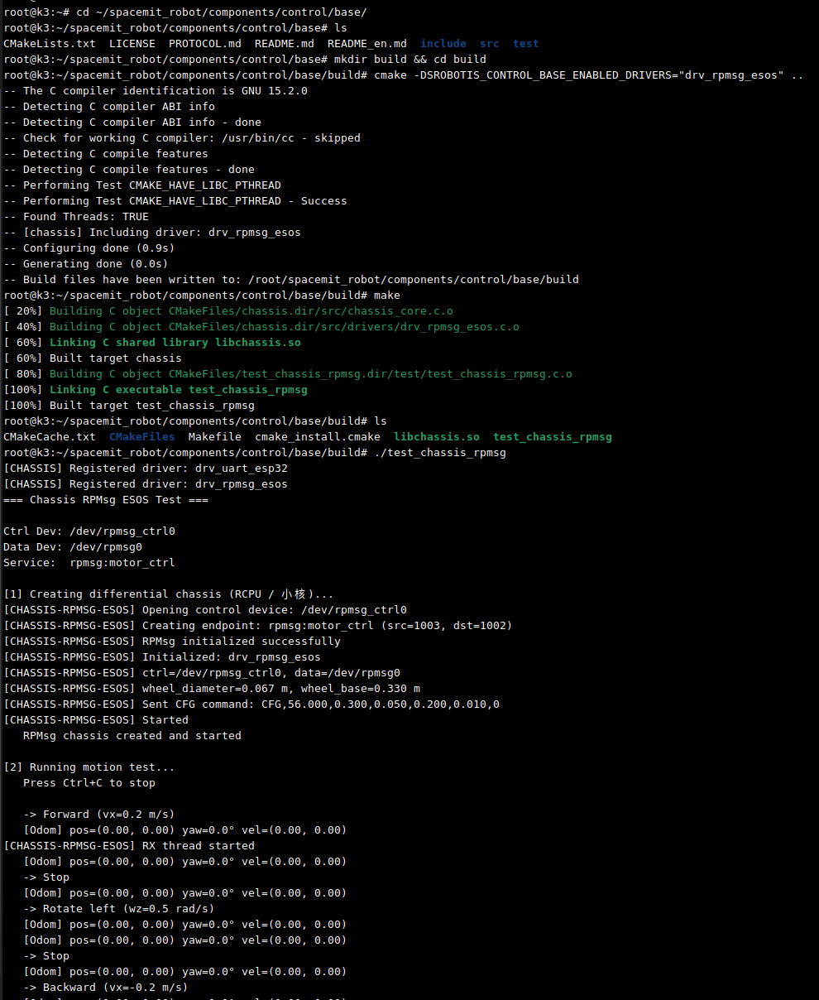

# Motion Control · Chassis Control

## 1. Overview

- **Key Features**
  
  The chassis control module sits between the low-level hardware layer and the ROS 2 integration layer, responsible for converting high-level velocity commands into executable motor control commands and returning odometry data.
  
  The current project provides two integration paths:
  1. `components/control/base`: Native C chassis control library with unified abstractions for multiple chassis types and communication drivers
  2. `middleware/ros2/control/base` and `application/ros2/linksee`: ROS 2 nodes and application examples completing the `/cmd_vel` to `/odom` closed loop

- **Specifications and Features**
  
  - Supported Chassis Types:
    - Two-wheel differential drive `CHASSIS_TYPE_DIFF_2WD`
    - Four-wheel differential drive `CHASSIS_TYPE_DIFF_4WD`
    - Four-wheel mecanum `CHASSIS_TYPE_MECANUM_4WD`
    - Three-wheel omni-directional `CHASSIS_TYPE_OMNI_3WD`
    - Four-wheel omni-directional `CHASSIS_TYPE_OMNI_4WD`
  - Current project implementation focuses on **two-wheel differential drive chassis**
  - Supported Drivers:
    - `drv_rpmsg_esos`: RPMsg secondary core communication driver
  - ROS 2 Interface:
    - Subscribes: `/cmd_vel` (`geometry_msgs/msg/Twist`)
    - Publishes: `/odom` (`nav_msgs/msg/Odometry`)
    - Optional TF publish: `odom -> base_footprint`
  - Default Parameters:
    - Control send frequency `send_hz=20.0`
    - Odometry publish frequency `odom_hz=50.0`
    - Command timeout protection `cmd_vel_timeout=0.4s`
    - Default wheel diameter `wheel_diameter=0.067m`
    - Default wheel base `wheel_base=0.183m` or `0.28m` (slight variations between implementations; use launch parameters during deployment)

- **Software Architecture**



- **Directory Structure**

| Path | Responsibility |
| --- | --- |
| `components/control/base/` | Chassis control base library providing unified C API, chassis driver abstraction, and protocol implementation |
| `components/control/base/include/chassis.h` | Chassis types, velocity/pose structs, configuration structs, core API |
| `components/control/base/src/drivers/drv_rpmsg_esos.c` | RPMsg chassis driver |
| `middleware/ros2/control/base/` | ROS 2 chassis control node wrapper |
| `middleware/ros2/control/base/src/esos_base_control_node.cpp` | RPMsg implementation ROS 2 node |
| `middleware/ros2/control/base/launch/esos_base_control.launch.py` | RPMsg implementation launch file |
| `application/ros2/linksee/launch/base_control_esos.launch.py` | ESOS/RPMsg chassis control launch example |

## 2. Environment Setup

For SDK source code acquisition and basic build environment setup, refer to [Linksee Reference Solution](../../03-参考方案/3.2-轮式机器人Linksee.md). After completing SDK initialization, return to this document to continue.

### Hardware Connections

Secondary core and motor driver connection


Secondary core serial connection


Normal secondary core serial output:


### Prerequisites

- **Runtime Environment**

  - K3 Bianbu26
  - ROS 2 environment; the repository documentation is organized as a ROS 2 workspace, with examples targeting ROS 2

- **Dependencies and External Resources**
  - Basic dependency installation:

     ```
     sudo apt update
     sudo apt install ros-dev-tools ros-humble-ros-base python3-numpy ros-humble-teleop-twist-keyboard \
     libpcap-dev libuvc-dev python3-serial
     ```

  - Confirm secondary core firmware has been updated:

     ```
     sudo apt update && sudo apt install -y --allow-downgrades wget
     wget https://archive.spacemit.com/ros2/prebuilt/esos_kernel/update_esos.sh
     bash update_esos.sh
     ```

- **Environment Variables and Initialization**

  - SDK build environment:
    - `source build/envsetup.sh`
  - ROS 2 runtime environment:
    - After full build, execute `source ~/spacemit_robot/output/staging/setup.bash`

- **Hardware and Connections**

  - Supported hardware interface methods:

  - Secondary core chassis device node: `/dev/rpmsg_ctrl0`

  - Requires proper connections for chassis controller, motors, encoders, and power supply
  - Wheel diameter, wheel base, and motor directions must match actual mechanical parameters

### Build

- **Obtain Source Code**
  - Top-level directory is `~/spacemit_robot`

- **Build This Module**

   **1) Standalone base C library build**

   Working directory: `components/control/base`

   ```bash
   cd ~/spacemit_robot/components/control/base
   mkdir build && cd build
   cmake -DSROBOTIS_CONTROL_BASE_ENABLED_DRIVERS="drv_rpmsg_esos" ..
   make
   ```

  **2) Unified SDK build (recommended)**

   Working directory: repository root
 
   ```bash
   source build/envsetup.sh
   lunch # Select linksee solution
   m
   ```

- **Build Artifacts**
   - SDK unified build output directory: `~/spacemit_robot/output/staging`
   - Native test program example:
     - `components/control/base/test/test_chassis_uart.c` corresponding test binary

- **Common Differences**
   - `components/control/base` is the low-level common library
   - `application/ros2/linksee` provides ESOS / RPMsg chassis control integration example

---

## 3. ROS 2 Usage Example

### Quick Start

**Prerequisites**: See Section 2; ROS 2 environment is ready, RPMsg device node exists, and ESOS secondary core firmware is working normally.

**Step 1**: Verify RPMsg device

```bash
ls /dev/rpmsg*
```

**Expected Result**:

- Should see `/dev/rpmsg_ctrl0` device node



**Step 2**: Launch ESOS chassis control node

```bash
ros2 launch base esos_base_control.launch.py
```

To explicitly specify parameters:

```bash
ros2 launch base esos_base_control.launch.py \
  wheel_diameter:=0.067 \
  wheel_base:=0.183 \
  publish_tf:=true
```

**Expected Result**:
- Node starts successfully
- Logs show chassis initialization success information
- No `Failed to create chassis device` error



**Step 3**: Launch keyboard control node

```bash
source /opt/ros/humble/setup.bash
ros2 run teleop_twist_keyboard teleop_twist_keyboard
```

**Expected Result**:

- Using i, j, comma, l keys controls chassis motor movement

**Step 4**: View odometry output

```bash
ros2 topic echo /odom
```

**Expected Result**:
- Receives odometry messages
- Position and pose update with movement

### Available Parameter Descriptions

- The following parameters correspond to launch parameters in `middleware/ros2/control/base/launch/esos_base_control.launch.py` and can be overridden with `parameter_name:=parameter_value` when executing `ros2 launch base esos_base_control.launch.py`.

| Parameter | Default | Description |
| --- | --- | --- |
| `send_hz` | `20.0` | Chassis control command send frequency in Hz. Higher values provide more timely velocity commands but increase control load. |
| `odom_hz` | `50.0` | Odometry publish frequency in Hz, controlling `/odom` publish period. |
| `cmd_vel_timeout` | `0.4` | `/cmd_vel` timeout in seconds. If no new velocity command received beyond this time, node automatically sets chassis velocity to zero. |
| `publish_tf` | `true` | Whether to publish `odom -> base_footprint` TF transform. Disable if another node already publishes the same TF to avoid conflicts. |
| `odom_topic` | `odom` | Odometry topic name, defaults to publishing to `/odom`. |
| `odom_frame` | `odom` | Odometry frame name. |
| `base_frame` | `base_footprint` | Robot chassis frame name. |
| `wheel_diameter` | `0.067` | Wheel diameter in meters. Must match actual wheel size, otherwise affects velocity conversion and odometry accuracy. |
| `wheel_base` | `0.28` | Distance between left and right wheel centers in meters. Must match actual chassis wheel base, otherwise affects steering and pose estimation. |
| `motor1_factor` | `1.0` | Motor 1 correction factor to compensate for wheel speed error or installation differences on one side. |
| `motor2_factor` | `1.0` | Motor 2 correction factor to compensate for wheel speed error or installation differences on the other side. |
| `reduction_ratio` | `56.0` | Motor reduction ratio, should match actual motor/gearbox parameters. |
| `ff_factor` | `0.3` | Feedforward control coefficient, improves motor speed response. |
| `pid_kp` | `0.05` | PID proportional coefficient. |
| `pid_ki` | `0.2` | PID integral coefficient. |
| `pid_kd` | `0.01` | PID derivative coefficient. |
| `cfg_send_on_startup` | `true` | Whether to immediately send configuration parameters to chassis on node startup. Recommended to keep enabled. |
| `feedback_enable` | `false` | Whether to enable chassis feedback. The secondary core firmware supports status reporting and can be enabled if needed. |
| `rpmsg_ctrl_dev` | `/dev/rpmsg_ctrl0` | RPMsg control device node path. |
| `rpmsg_data_dev` | `/dev/rpmsg0` | RPMsg data device node path. |
| `rpmsg_service_name` | `rpmsg:motor_ctrl` | RPMsg service name, must match service name registered on secondary core. |
| `rpmsg_local_addr` | `1003` | RPMsg local address, must match communication configuration. |
| `rpmsg_remote_addr` | `1002` | RPMsg remote address, typically the secondary core service address. |

**Example**:

```bash
ros2 launch base esos_base_control.launch.py \
  wheel_diameter:=0.067 \
  wheel_base:=0.28 \
  publish_tf:=true \
  feedback_enable:=false
```


---

## 4. Low-Level Interface Control Example

### Direct Build Example

```
cd ~/spacemit_robot/components/control/base/
mkdir build && cd build
cmake -DSROBOTIS_CONTROL_BASE_ENABLED_DRIVERS="drv_rpmsg_esos" ..
make
```

### Run Example

```
./test_chassis_rpmsg
```

Terminal output:



## 5. Application Development

- **API Interface**
  - Native C API header file: `components/control/base/include/chassis.h`
  - ROS 2 interface form:
    - Input topic: `/cmd_vel`
    - Output topic: `/odom`
    - TF: `odom -> base_footprint`
  - Core C API:
    - `chassis_alloc()`
    - `chassis_set_velocity()`
    - `chassis_get_odom()`
    - `chassis_brake()`
    - `chassis_relax()`
    - `chassis_free()`
- **Usage and Notes**
  - C layer usage:
    1. Prepare `chassis_uart_config` or `chassis_rpmsg_config`
    2. Call `chassis_alloc()` to create device
    3. Periodically call `chassis_set_velocity()`
    4. Call `chassis_get_odom()` to get velocity and pose
    5. Call `chassis_brake()` and `chassis_free()` before exit
  - Notes:
    - `wheel_diameter` and `wheel_base` must match the physical hardware
    - The ROS 2 node has `cmd_vel_timeout` protection that automatically zeros velocity after prolonged periods without control commands
    - If other modules publish the same TF, disable `publish_tf` to avoid conflicts
    - `motor1_factor` / `motor2_factor` are used for left/right wheel correction; calibration is needed when the robot drifts
- **Reference Demos or Example Paths**
  - RPMsg launch: `middleware/ros2/control/base/launch/esos_base_control.launch.py`
  - ROS 2 C++ node: `middleware/ros2/control/base/src/esos_base_control_node.cpp`

---

## 6. Debugging Guide

- Common Debugging Methods
  - Check control input:
    - `ros2 topic echo /cmd_vel`
  - Check odometry output:
    - `ros2 topic echo /odom`
  - Check TF:
    - `ros2 run tf2_ros tf2_echo odom base_footprint`
  - Check RPMsg device:
    - `ls -l /dev/rpmsg*`

- Recommended Troubleshooting Sequence
  1. Verify the device node exists
  2. Verify the base library is built correctly
  3. Verify the ROS 2 node starts normally
  4. Check if `/cmd_vel` and `/odom` topics are connected


---

## 7. Troubleshooting

| Symptom | Possible Cause | Solution |
| --- | --- | --- |
| Node starts successfully but chassis doesn't move | No `/cmd_vel` input; timeout protection zeroed velocity; driver mismatch | Check `/cmd_vel` with `ros2 topic echo /cmd_vel`; increase `cmd_vel_timeout` if needed; verify RPMsg communication |
| `/odom` has no data | Chassis driver not returning feedback; device not connected | Check RPMsg device and driver status |
| `/odom` drifts or shows abnormal values | Inaccurate wheel diameter/base configuration; wheel correction not calibrated; ground slippage | Recalibrate `wheel_diameter`, `wheel_base`, `motor1_factor`, and `motor2_factor` |
| Robot drifts while moving forward | Left/right wheel speeds inconsistent; motor direction or wiring error | Adjust motor correction coefficients; check wiring and motor direction configuration |
| Steering direction reversed | Left/right wheel mapping or rotation direction inconsistent | Test forward and in-place rotation separately at low speed; correct motor direction or protocol configuration |
| TF conflict | Multiple modules simultaneously publishing `odom -> base_footprint` | Disable `publish_tf` in one of the modules to use a single TF source |
| ESOS node initialization fails | `components/control/base` not built or installed; RPMsg device missing | Build the base library first; verify `/dev/rpmsg*` exists and secondary core firmware is running normally |

