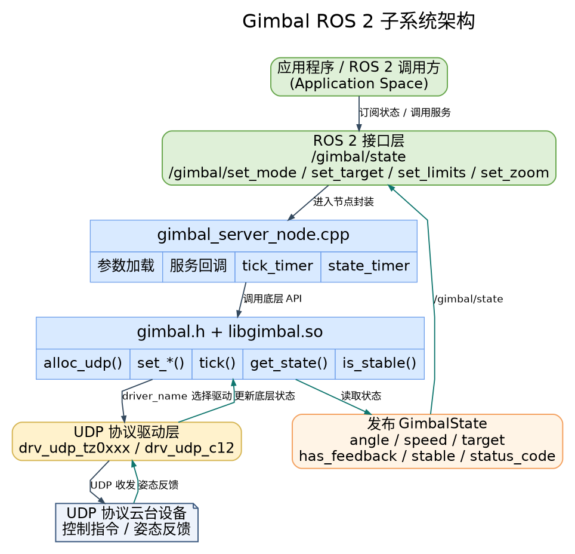

# Motion Control · Gimbal Control

## 1. Overview

- **Key Features**: `control_gimbal_node` is a ROS 2 gimbal control node that converts high-level pose control, zoom control, and limit configuration requests into low-level gimbal driver calls and periodically publishes gimbal state. The current implementation is located in `middleware/ros2/control/gimbal/`, with the underlying layer depending on the unified C API provided by `components/control/gimbal/`. By default, it communicates with gimbal devices via the `drv_udp_tz0xxx` UDP driver.

- **Specifications and Features**: External interfaces include the ROS 2 topic `/gimbal/state` and services `/gimbal/set_mode`, `/gimbal/set_target`, `/gimbal/set_limits`, `/gimbal/set_zoom`; the node name is fixed as `gimbal_server_node`; ROS 2 message and service definitions are provided directly by the `control_gimbal_node` package; supports eight modes: `MODE_OFF`, `MODE_ANGLE_ABS`, `MODE_ANGLE_REL`, `MODE_SPEED`, `MODE_FOLLOW`, `MODE_FPV`, `MODE_LOCK`, `MODE_CALIBRATE`; default driver is `drv_udp_tz0xxx`, with `drv_udp_c12` also supported; default network parameters are local `0.0.0.0:4900` and device `192.168.44.160:4900`; default runtime parameters include `tick_hz=50.0`, `state_publish_hz=20.0`, `resend_period_s=0.02`, `stable_threshold_deg=1.5`. During build, the system-installed `libgimbal.so` is prioritized; if not installed, it falls back to compiling the `components/control/gimbal` source code from the repository.

- **Software Architecture**:

  

- **Directory Structure**:

  | Path | Responsibility |
  | --- | --- |
  | `middleware/ros2/control/gimbal/src/gimbal_server_node.cpp` | Main ROS 2 gimbal node implementation, handles parameter loading, service callbacks, state publishing, and low-level driver tick |
  | `middleware/ros2/control/gimbal/CMakeLists.txt` | `control_gimbal_node` package build file, generates ROS 2 messages/services and produces executable `gimbal_server_node` |
  | `middleware/ros2/control/gimbal/package.xml` | ROS 2 package metadata and dependency declarations |
  | `middleware/ros2/control/gimbal/msg/GimbalEuler.msg` | Gimbal Euler angle message definition |
  | `middleware/ros2/control/gimbal/msg/GimbalState.msg` | Gimbal state message definition |
  | `middleware/ros2/control/gimbal/srv/SetGimbalMode.srv` | Gimbal mode switching service definition |
  | `middleware/ros2/control/gimbal/srv/SetGimbalTarget.srv` | Gimbal target pose or angular velocity setting service definition |
  | `middleware/ros2/control/gimbal/srv/SetGimbalLimits.srv` | Gimbal soft limits and maximum angular velocity service definition |
  | `middleware/ros2/control/gimbal/srv/SetGimbalZoom.srv` | Gimbal zoom service definition |
  | `components/control/gimbal/include/gimbal.h` | Low-level gimbal unified C API header file |
  | `components/control/gimbal/src/drivers/drv_udp_tz0xxx.c` | Default TZ0xxx UDP gimbal driver implementation |
  | `components/control/gimbal/src/drivers/drv_udp_c12.c` | C12 UDP gimbal driver implementation |
  | `components/control/gimbal/test/test_gimbal_udp.c` | Low-level UDP integration test program |

## 2. Environment Setup

### Prerequisites

- **Runtime Environment**: The recommended board is `k3-com260` with matching system image; ROS 2 Humble must be installed on the board, with `source /opt/ros/humble/setup.bash` executing normally.
- **Hardware and Connections**: The default example uses Tianjin `TZ0xxx` gimbal with device address `192.168.44.160:4900`; C12 gimbal example uses device address `192.168.144.108:5000`. Ensure the device is powered on and connected to the development board or a switch on the same network segment via Ethernet cable.
- **Tools and Permissions**: You need network access; tools such as `ping`, `ss`, and `tcpdump` are recommended for troubleshooting. For packet capture, use `sudo tcpdump -ni any udp port 4900` or `sudo tcpdump -ni any udp port 5000`.

### Build

- **Obtain Source Code**: See [02-Quick Start · 2.3 Building and Compilation](../../02-快速入门/2.3-构建编译.md#2-obtaining-the-source-code) for using the `repo` tool to clone the complete SDK. Execute the following build commands in the SDK root directory; using `build.sh package` to install into `output/staging` is recommended.

  ```bash
  source build/envsetup.sh
  ./build/build.sh package components/control/gimbal
  ./build/build.sh package middleware/ros2/control/gimbal
  ```

  Expected artifacts include: `output/staging/lib/control_gimbal_node/gimbal_server_node`, `output/staging/share/control_gimbal_node/package.sh`, `output/staging/share/control_gimbal_node/cmake/control_gimbal_nodeConfig.cmake`. If the current target is not the default staging path, refer to the actual `output/<target>/staging`.

- **Common Differences**: `control_gimbal_node` does not provide a launch file and is started directly via `ros2 run`; current message and service types belong to the `control_gimbal_node` package, with interface definitions installed directly by this package; if `libgimbal.so` and `gimbal.h` are already installed on the system, the node will prioritize linking the system library; if the low-level library is not installed, `CMakeLists.txt` will automatically fall back to compiling the `components/control/gimbal` source code from the repository, including both `drv_udp_tz0xxx` and `drv_udp_c12` drivers. If `source build/envsetup.sh` has been executed, you can also enter the `components/control/gimbal` and `middleware/ros2/control/gimbal` directories separately and run `mm` for single-package builds; the installation prefix of `mm` may be affected by the current target solution, `PREFIX`, or `STAGING_PREFIX` in different environments, so refer to build logs and the actual `output/<target>/staging` directory for artifact paths.

## 3. Example Usage (Getting Started From Scratch)

This section walks you through reproducing the workflow **step by step**:

### 3.1 Example 1: Launch Default TZ0xxx Gimbal Node and Observe State

**Prerequisites**: Target board and gimbal device are network-reachable; device IP, port, and local network segment are configured correctly; current user can execute ROS 2 commands and access UDP ports.

**Step 1**: Confirm the gimbal device is online.

```bash
ping -c 3 192.168.44.160
```

**Expected Result**: You should receive ICMP responses from the gimbal device; if unable to connect, first check gimbal power, Ethernet cable, switch, and local IP configuration.

**Step 2**: Load the runtime environment and start the gimbal control node.

```bash
source /opt/ros/humble/setup.bash
source output/staging/setup.bash

ros2 run control_gimbal_node gimbal_server_node \
  --ros-args \
  -p bind_ip:=0.0.0.0 \
  -p bind_port:=4900 \
  -p device_ip:=192.168.44.160 \
  -p device_port:=4900
```

**Expected Result**: Terminal prints a successful node startup log, similar to `gimbal_server_node ready: driver=drv_udp_tz0xxx local=0.0.0.0:4900 remote=192.168.44.160:4900`; if startup fails, terminal typically outputs `gimbal_alloc_udp failed`, `gimbal_set_limits failed`, or parameter error messages.

**Step 3**: In another terminal, view topics, services, and state output.

```bash
source /opt/ros/humble/setup.bash
source output/staging/setup.bash

ros2 topic list | grep gimbal
ros2 service list | grep gimbal
ros2 topic echo /gimbal/state
```

**Expected Result**:
- See interfaces such as `/gimbal/state`, `/gimbal/set_mode`, `/gimbal/set_target`, `/gimbal/set_limits`, `/gimbal/set_zoom`.
- `/gimbal/state` continuously outputs status messages.
- If the device is providing feedback normally, `has_feedback` should be `true` and `status_code` should be `0`.

### 3.2 Example 2: Control Gimbal via ROS 2 Services

**Prerequisites**: `gimbal_server_node` is running normally.

**Step 1**: Switch to absolute angle mode.

```bash
source /opt/ros/humble/setup.bash
source output/staging/setup.bash

ros2 service call /gimbal/set_mode control_gimbal_node/srv/SetGimbalMode "{mode: 1}"
```

**Expected Result**: Service returns `success: true`, `status_code: 0`, gimbal enters absolute angle control mode.

**Step 2**: Send absolute angle target.

```bash
ros2 service call /gimbal/set_target control_gimbal_node/srv/SetGimbalTarget \
  "{target: {pitch: 10.0, yaw: 0.0, roll: 0.0}}"
```

**Expected Result**: Gimbal moves toward target pose; `has_target` in `/gimbal/state` becomes `true`, `/gimbal/state.target` updates to the most recent target value.

**Step 3**: Set soft limits and maximum angular velocity.

```bash
ros2 service call /gimbal/set_limits control_gimbal_node/srv/SetGimbalLimits "{
  min_angle: {pitch: -30.0, yaw: -90.0, roll: -10.0},
  max_angle: {pitch: 30.0, yaw: 90.0, roll: 10.0},
  max_speed: {pitch: 20.0, yaw: 20.0, roll: 20.0}
}"
```

**Expected Result**: Service returns `success: true`, node caches the new limit configuration internally and continues to send it to the low-level library.

**Step 4**: Control zoom on the visible-light camera.

```bash
ros2 service call /gimbal/set_zoom control_gimbal_node/srv/SetGimbalZoom \
  "{direction: 1, speed_level: 2}"
```

**Expected Result**: If the device supports it, the lens begins to zoom in. To stop zooming, execute:

```bash
ros2 service call /gimbal/set_zoom control_gimbal_node/srv/SetGimbalZoom \
  "{direction: 0, speed_level: 0}"
```

**Step 5**: Switch to velocity mode and send angular velocity command.

```bash
ros2 service call /gimbal/set_mode control_gimbal_node/srv/SetGimbalMode "{mode: 3}"

ros2 service call /gimbal/set_target control_gimbal_node/srv/SetGimbalTarget \
  "{target: {pitch: 0.0, yaw: 12.0, roll: 0.0}}"
```

**Expected Result**: Gimbal moves at the set angular velocity; `/gimbal/state.mode` becomes `3`, `/gimbal/state.speed` changes with feedback.

To stop velocity control, explicitly send a zero velocity target:

```bash
ros2 service call /gimbal/set_target control_gimbal_node/srv/SetGimbalTarget \
  "{target: {pitch: 0.0, yaw: 0.0, roll: 0.0}}"
```

### 3.3 Example 3: Launch C12 Gimbal Node

**Prerequisites**: C12 gimbal is powered on, device and target board are on the same network. C12 example defaults to device address `192.168.144.108:5000`, local binding to port `5000` is recommended.

**Step 1**: Configure the host network interface and confirm the device is online. Replace the interface name with your actual connection.

```bash
ifconfig eth0 192.168.144.100 netmask 255.255.255.0 up
route add -net 192.168.144.0 netmask 255.255.255.0 dev eth0
ping -c 3 192.168.144.108
```

**Step 2**: Start the C12 driver node.

```bash
source /opt/ros/humble/setup.bash
source output/staging/setup.bash

ros2 run control_gimbal_node gimbal_server_node \
  --ros-args \
  -p driver_name:=drv_udp_c12 \
  -p bind_ip:=0.0.0.0 \
  -p bind_port:=5000 \
  -p device_ip:=192.168.144.108 \
  -p device_port:=5000
```

**Expected Result**: Terminal ready log includes `driver=drv_udp_c12 local=0.0.0.0:5000 remote=192.168.144.108:5000`.

**Step 3**: In one terminal, continuously view state.

```bash
ros2 topic echo /gimbal/state
```

**Step 4**: In another terminal, send small angle control commands.

```bash
source /opt/ros/humble/setup.bash
source output/staging/setup.bash

ros2 service call /gimbal/set_mode control_gimbal_node/srv/SetGimbalMode "{mode: 1}"
ros2 service call /gimbal/set_target control_gimbal_node/srv/SetGimbalTarget \
  "{target: {pitch: -10.0, yaw: 10.0, roll: 0.0}}"
```

**Expected Result**: `/gimbal/state` continuously publishes; after receiving feedback, `has_feedback: true`, `status_code: 0`; service call returns `success: true`; physical gimbal yaw/pitch movements match command direction.

**C12 Current Capabilities**:
- The C12 driver primarily sends yaw/pitch commands; the roll axis is currently used mainly for feedback parsing.
- `/gimbal/set_zoom` on C12 maps to DZM digital zoom step command; `ZOOM_STOP` does not send continuous stop frames.
- `speed_level` currently has no effect on C12 digital zoom.

## 4. Application Development

- **External API or Interface**: High-level applications primarily interact with the node through the ROS 2 topic `/gimbal/state` and services `/gimbal/set_mode`, `/gimbal/set_target`, `/gimbal/set_limits`, `/gimbal/set_zoom`. Message type is `control_gimbal_node/msg/GimbalState`; service types are `control_gimbal_node/srv/SetGimbalMode`, `control_gimbal_node/srv/SetGimbalTarget`, `control_gimbal_node/srv/SetGimbalLimits`, and `control_gimbal_node/srv/SetGimbalZoom`. All service responses have a consistent structure, including `success`, `status_code`, and `message`.

- **Usage and Notes** (threading, permissions, resource cleanup, etc.):
  - Common node startup parameters include `driver_name`, `bind_ip`, `bind_port`, `device_ip`, `device_port`, `resend_period_s`, `tick_hz`, `state_publish_hz`, `stable_threshold_deg`, `frame_id`, `use_limits`, `min_angle_deg`, `max_angle_deg`, `max_speed_deg_s`. `driver_name` defaults to `drv_udp_tz0xxx`, with options `drv_udp_tz0xxx` or `drv_udp_c12`; `min_angle_deg`, `max_angle_deg`, `max_speed_deg_s` support arrays of length `1` or `3`; if the length is neither `1` nor `3`, the node will report a parameter length error at startup.
  - Default parameters: `bind_ip=0.0.0.0`, `bind_port=4900`, `device_ip=192.168.44.160`, `device_port=4900`, `resend_period_s=0.02`, `tick_hz=50.0`, `state_publish_hz=20.0`, `stable_threshold_deg=1.5`, `frame_id=base_link`, `use_limits=false`, `min_angle_deg=[-120,-179,-180]`, `max_angle_deg=[90,179,180]`, `max_speed_deg_s=[50,50,50]`.
  - Main fields in `control_gimbal_node/msg/GimbalState` include `header`, `mode`, `has_feedback`, `has_target`, `stable`, `status_code`, `angle`, `speed`, and `target`. Default units are in degrees; in `MODE_SPEED`, `target` and `speed` represent angular velocity in degrees per second.
  - `/gimbal/set_mode` supports `0=MODE_OFF`, `1=MODE_ANGLE_ABS`, `2=MODE_ANGLE_REL`, `3=MODE_SPEED`, `4=MODE_FOLLOW`, `5=MODE_FPV`, `6=MODE_LOCK`, `7=MODE_CALIBRATE`; `/gimbal/set_zoom` supports `0=ZOOM_STOP`, `1=ZOOM_IN`, `2=ZOOM_OUT`.
  - The node internally relies on a timer to periodically call `gimbal_tick()`; if reusing only the low-level library without this node, the application must call it periodically. In `MODE_SPEED`, the node sends angular velocity continuously and will not stop automatically; to stop, send a zero velocity target again or switch to another mode. In `MODE_ANGLE_REL`, the node caches the "target value after relative displacement" upon successful service call; if current feedback cannot be read at that time, the cached `target` falls back to the request value itself. Limits are enforced by the low-level `gimbal` component; the ROS 2 node maintains a local copy of the limit configuration for subsequent state and target caching.

- **Reference Demos or Example Paths**: `middleware/ros2/control/gimbal/src/gimbal_server_node.cpp`, `components/control/gimbal/test/test_gimbal_udp.c`, `components/control/gimbal/include/gimbal.h`.

## 5. Debugging Guide

- First confirm network and node status:

  ```bash
  ros2 node list | grep gimbal
  ros2 topic hz /gimbal/state
  ros2 topic echo /gimbal/state
  ros2 service list | grep gimbal
  ss -anu | grep 4900
  ping 192.168.44.160
  ```

- When debugging C12, the port and device address are typically changed to `5000` and `192.168.144.108`:

  ```bash
  ss -anu | grep 5000
  ping 192.168.144.108
  ```

- If you need to confirm whether UDP packets are being sent or received, capture packets:

  ```bash
  sudo tcpdump -ni any udp port 4900
  sudo tcpdump -ni any udp port 5000
  ```

- Verify the driver using the low-level component test program first, then verify the ROS 2 wrapper. Example:

  ```bash
  cd components/control/gimbal
  mkdir -p build
  cd build
  cmake ..
  make -j

  ./test_gimbal_udp --driver drv_udp_tz0xxx --ip 192.168.44.160 --port 4900 --bind-port 4900
  ./test_gimbal_udp --driver drv_udp_c12 --ip 192.168.144.108 --port 5000 --bind-port 5000
  ```

- Common `status_code` meanings: `0=GIMBAL_OK`, `-1=GIMBAL_ERR_ALLOC`, `-2=GIMBAL_ERR_CONNECT`, `-3=GIMBAL_ERR_TIMEOUT`, `-4=GIMBAL_ERR_CONFIG`, `-5=GIMBAL_ERR_PARAM`, `-6=GIMBAL_ERR_NOSYS`.
- When coordinating with hardware or driver engineers, provide: node startup command and all ROS parameters, `gimbal_server_node ready` startup log, continuous `/gimbal/state` output, `ros2 service call` return results, local IP and gimbal device IP, `ping`/`ss`/`tcpdump` output, gimbal model and firmware version.

## 6. Troubleshooting

### 6.1 Cannot Find `control_gimbal_node`

**Error Example**:

```text
Could not find a package configuration file provided by "control_gimbal_node"
```

**Solution**: Confirm that `middleware/ros2/control/gimbal` has been built, and execute before running:

```bash
source /opt/ros/humble/setup.bash
source output/staging/setup.bash
```

### 6.2 Missing `package.sh`

**Error Example**:

```text
Failed to find the following files:
.../share/control_gimbal_node/package.sh
```

**Solution**: Do not run `colcon build` alone in the `middleware/ros2/control/gimbal` directory; use `./build/build.sh package middleware/ros2/control/gimbal` from the SDK root directory to ensure the installation prefix is unified to `output/staging`.

### 6.3 Driver Not Found

**Error Example**:

```text
[GIMBAL] Driver not found: drv_udp_tz0xxx
[GIMBAL] No driver found: drv_udp_c12
```

**Solution**: Rebuild `control_gimbal_node`; if `libgimbal.so` is already installed on the system, check whether the library actually includes the driver name being used. The current source code fallback build includes both `drv_udp_tz0xxx` and `drv_udp_c12`.

### 6.4 Node Started but No Feedback

**Possible Causes**: `device_ip` or `device_port` misconfigured; local binding IP/port incorrect; gimbal device not powered or network unreachable; low-level protocol mismatch. First confirm network connectivity, then capture packets to verify UDP packet round-trip.

```bash
ping 192.168.44.160
sudo tcpdump -ni any udp port 4900
```

For C12 devices, use:

```bash
ping 192.168.144.108
sudo tcpdump -ni any udp port 5000
```

### 6.5 C12 Control Command Returns Success but State Has No Feedback

**Possible Causes**: C12 device address is not `192.168.144.108:5000`; local machine not configured to the `192.168.144.0/24` network segment; ROS node or low-level test program not binding to local port `5000`; device has not enabled active pose output; UDP 5000 blocked by firewall.

First troubleshoot with the low-level example:

```bash
./test_gimbal_udp --driver drv_udp_c12 --ip 192.168.144.108 --port 5000 --bind-port 5000
```

If the low-level example continuously outputs `waiting feedback...`, troubleshoot network and device configuration first; if the low-level example has `[RX-STATE]` but `has_feedback` is still `false` in ROS 2, check whether the ROS node startup parameters are still using the default `drv_udp_tz0xxx` or port `4900`.

### 6.6 C12 Zoom or Roll Axis Control Behavior Unexpected

The C12 driver currently maps the zoom interface to DZM digital zoom step commands, not continuous optical zoom control. `ZOOM_IN` and `ZOOM_OUT` each send one digital zoom step command; `ZOOM_STOP` directly returns success without sending frames.

The C12 driver currently supports yaw/pitch control commands; the roll axis is mainly used for feedback parsing. To verify movement, use small-angle pitch/yaw commands first, for example:

```bash
ros2 service call /gimbal/set_mode control_gimbal_node/srv/SetGimbalMode "{mode: 1}"
ros2 service call /gimbal/set_target control_gimbal_node/srv/SetGimbalTarget \
  "{target: {pitch: -10.0, yaw: 10.0, roll: 0.0}}"
```
