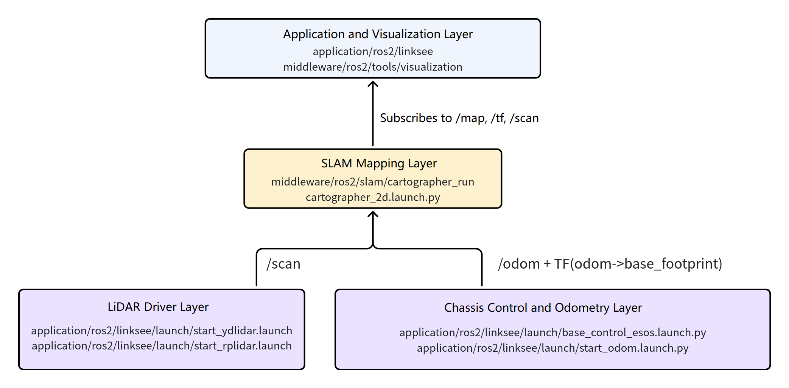
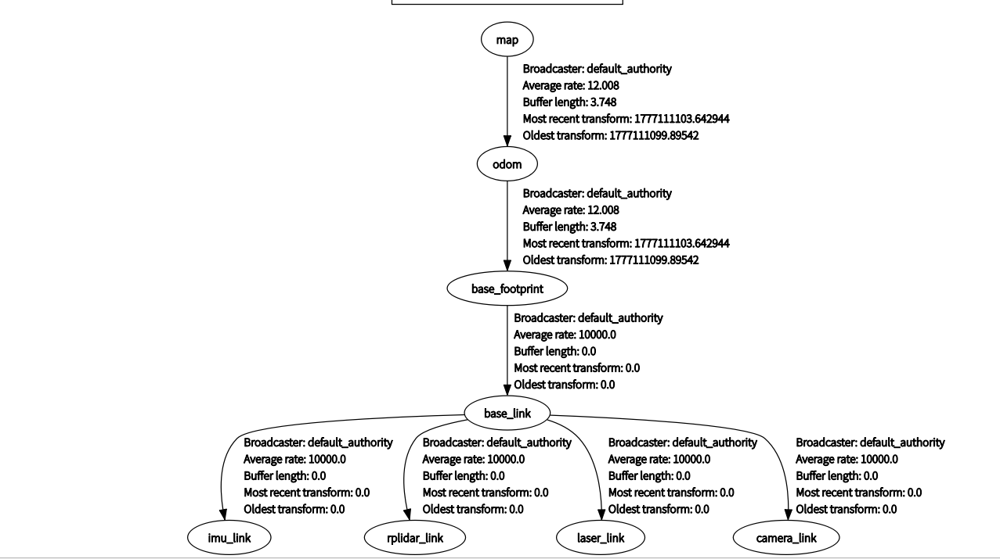
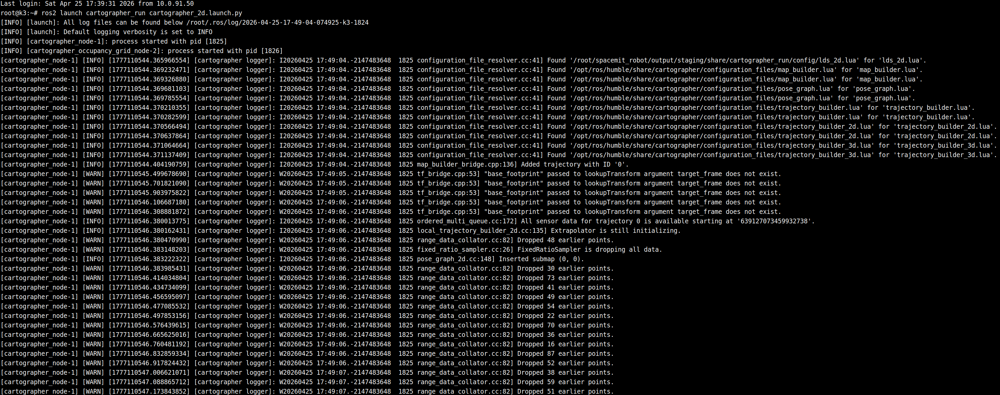
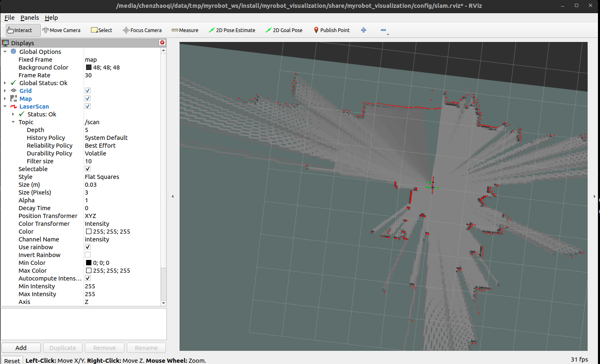
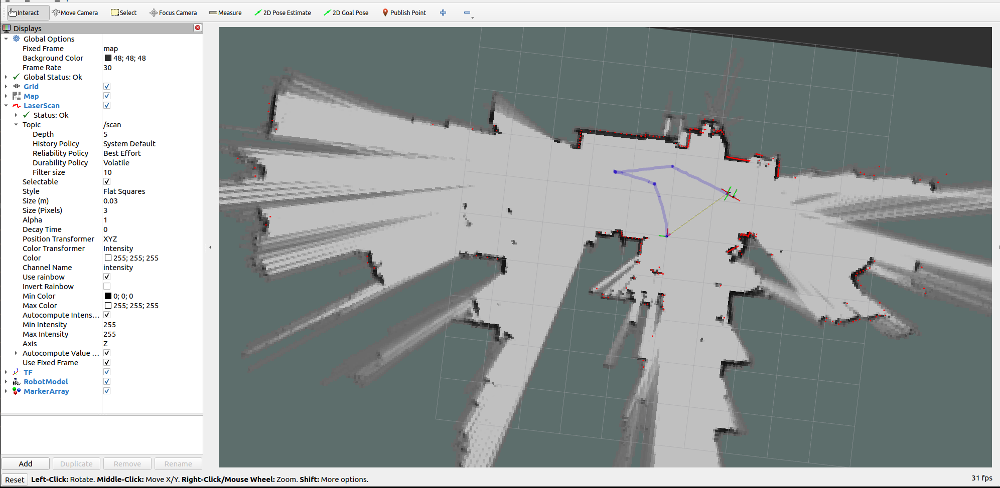
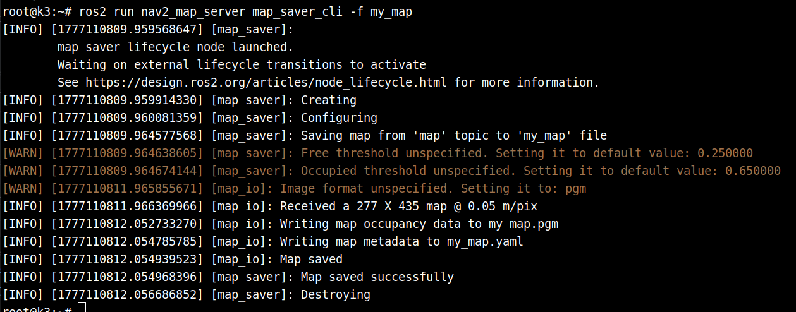

# Localization and Navigation · Cartographer

## 1. Overview

- **Key Features**: The `cartographer` module is a wrapper around Google Cartographer and the ROS 2 `cartographer_ros` component, providing **2D laser SLAM mapping and localization** for the `linksee` mobile robot solution. In this project it lives at `middleware/ros2/slam/cartographer_run` and is responsible for consuming the lidar `/scan` topic, the odometry `/odom` topic, and the related TF transforms to generate a `/map` occupancy grid and submap information in real time, serving as the foundation for full-system mapping and subsequent navigation.

- **Specifications and Features**:
	- Algorithm type: 2D laser SLAM
	- Launch method: ROS 2 Launch
	- Input topics: `/scan`, `/odom`
	- Output topics: `/map`, `/submap_list`
	- Default map resolution: `0.05 m/cell`
	- Default map publish period: `1.0 s`
	- Default configuration file: `config/lds_2d.lua`
	- Supports parameterized simulation time switching: `use_sim_time`

- **Software Architecture**:



- **Directory Structure**:

| Path | Responsibility |
| --- | --- |
| `middleware/ros2/slam/cartographer_run/launch/cartographer_2d.launch.py` | Cartographer 2D mapping launch entry point |
| `middleware/ros2/slam/cartographer_run/config/lds_2d.lua` | Cartographer 2D mapping parameter configuration |
| `middleware/ros2/slam/cartographer_run/README_en.md` | Module documentation, parameters, and topic reference |
| `application/ros2/linksee/launch/base_control_esos.launch.py` | `linksee` chassis control and odometry publishing |
| `application/ros2/linksee/launch/start_ydlidar.launch.py` | `linksee` solution lidar launch entry point |
| `middleware/ros2/tools/visualization/launch/display_slam.launch.py` | RViz SLAM visualization launch entry point |

## 2. Environment Setup

### 2.1 Prerequisites

For SDK source code acquisition and basic build environment setup, refer to [Linksee Reference Solution](../../03-参考方案/3.2-轮式机器人Linksee.md). After completing SDK initialization, return to this document to continue.

- **Runtime Environment**:
	- K3 CoM260 + Bianbu26 LXQT
	- ROS version: ROS 2 Humble
- **Dependencies and External Resources**:
	- `cartographer_ros` and related ROS 2 dependencies must be installed on the system

- **Environment Variables and Initialization**:

   ```bash
   source ~/spacemit_robot/output/staging/setup.bash
   ```

- **Hardware and Connections**:
	- Board: `k3-com260` paired with the `linksee` robot solution
	- Sensor: a 2D lidar connected and publishing `/scan` reliably
	- Chassis: publishing `/odom`, either directly or via the `linksee` chassis control pipeline
	- Recommended power-on order: chassis, motor driver, lidar, main control board — confirm power is normal for each
	- During debugging, keep the chassis off the ground or leave enough clear space to avoid unintended motion during mapping

- **Tools and Permissions**:
	- Serial port device access is required if the chassis or lidar is connected via serial
	- Common device nodes include `/dev/ttyACM0` and `/dev/ttyUSB0`
	- If necessary, add the user to the `dialout` group and log back in for it to take effect
	- Write permissions to the current directory are required when saving maps

### 2.2 Building

- **Build This Module**:

  ```bash
  cd ~/spacemit_robot/
  source build/envsetup.sh
  lunch # Select k3-com260-linksee
  m
  ```

- **Build Artifacts**:
	- SDK build artifacts are typically installed under `/path/to/spacemit_robot/output/staging/`
	- Standalone ROS 2 build artifacts are located under `install/cartographer_run/`
	- This module is a Launch/configuration wrapper package; its primary artifacts are the launch files, configuration files, and Python installation results

- **Common Differences**:
	- `cartographer_run` only wraps the launch logic; actual execution depends on `cartographer_ros` being installed on the system
	- When running on the full `linksee` system, this module is typically not validated in isolation but debugged together with the chassis, lidar, and RViz
	- For algorithm-only validation, at minimum `/scan`, `/odom`, and the TF chain must be complete

## 3. Example Usage

This section provides the recommended step-by-step path for this project. When using a `linksee` physical robot, follow the order: chassis → lidar → mapping → visualize/save map.

**Prerequisites**: The full system environment is set up, the robot chassis and 2D lidar are correctly wired, and power is confirmed normal.

**Step 1: Load the Runtime Environment**

On the board terminal, run:

```bash
source ~/spacemit_robot/output/staging/setup.bash
```

**Expected Result**: Terminal returns with no errors; `ros2 pkg list | grep cartographer_run` finds the package.

**Step 2: Start Chassis Control**

```bash
ros2 launch linksee base_control_esos.launch.py
```

**Expected Result**: The chassis control node starts normally with no serial port open failure or similar errors in the terminal.

Terminal output:


> **Note**: Chassis odometry is affected by wheel slip and similar factors, so the chassis-provided odometry is disabled by default.

**Step 3: Start the Lidar**

If the `linksee` robot uses a YDLIDAR, run in a new terminal:

```bash
ros2 launch linksee start_ydlidar.launch.py
```

**Expected Result**: The lidar driver startup log is visible, the `/scan` topic is publishing continuously, and laser data is refreshing normally.

Terminal output:


**Step 4: Start Cartographer Mapping**

Open another terminal and run:

```bash
ros2 launch cartographer_run cartographer_2d.launch.py
```

**Expected Result**: `cartographer_node` and `cartographer_occupancy_grid_node` start successfully; no missing dependency errors in the terminal; map building logs appear progressively and `/map` and `/submap_list` begin publishing.

**Expected TF Tree**:



**Terminal Output**:



**Step 5: Start RViz Visualization on the PC**

On the PC host, run:

```bash
source ~/visual_ws/install/setup.bash
ros2 launch visualization display_slam.launch.py
```

**Expected Result**: RViz opens showing the robot coordinate frame, laser point cloud/scan lines, and a live occupancy grid map. As the robot moves, the map progressively expands.



**Step 6: Start Keyboard Control**

```
ros2 run teleop_twist_keyboard teleop_twist_keyboard
```

Drive the robot around and the map expands accordingly.



**Step 7: Save the Map**

In a new terminal, run:

```bash
source /opt/ros/humble/setup.bash
ros2 run nav2_map_server map_saver_cli -f my_map
```

**Expected Result**: `my_map.yaml` and `my_map.pgm` are generated in the current directory and the terminal shows a success message.

Terminal output:



Map saving may occasionally fail; simply re-run the command.

## 4. Application Development

- **External API or Interface**:
  `cartographer_run` exposes its capabilities primarily through ROS 2 Launch and topics, not a C/C++ header API. The core interfaces are:
	- Launch entry: `ros2 launch cartographer_run cartographer_2d.launch.py`
	- Key launch parameters: `use_sim_time`, `resolution`, `publish_period_sec`, `configuration_directory`, `configuration_basename`
	- Subscribed topics: `/scan`, `/odom`
	- Published topics: `/map`, `/submap_list`
	- Required TF: `odom -> base_footprint`

- **Usage Notes**:
	- This module does not handle lidar driving or chassis odometry collection directly; ensure those data pipelines are working before launching
	- Mapping quality depends heavily on odometry accuracy, lidar mounting pose, and correct TF
	- The default configuration file is `lds_2d.lua`; if you change the lidar model, mounting height, or chassis parameters, update the configuration accordingly
	- Chassis parameters such as `publish_tf` and `odom_topic` must match other nodes in the system to avoid duplicate TF publishing or coordinate frame conflicts
	- To save a map during a running session, use `nav2_map_server`

- **Reference Demos or Example Paths**:
	- `middleware/ros2/slam/cartographer_run/launch/cartographer_2d.launch.py`
	- `middleware/ros2/slam/cartographer_run/config/lds_2d.lua`
	- `linksee` mapping example in `3.2-Mobile Robot linksee.md`
	- `middleware/ros2/tools/visualization/launch/display_slam.launch.py`

## 5. Debugging Guide

- **Basic Pipeline Troubleshooting Order**: Verify `/scan`, `/odom`, and TF first, then check `/map`. Follow this sequence:
	1. `ros2 topic list` — check whether the topics exist
	2. `ros2 topic echo /scan`, `ros2 topic echo /odom` — check whether data is refreshing continuously
	3. Inspect the TF tree in RViz, paying particular attention to `odom -> base_footprint`
	4. Start `cartographer_run` and check whether `/map` is being published

- **Monitor Startup Logs**:
	- If `cartographer_node` fails to start, first check whether `cartographer_ros` is installed
	- If a configuration file error is reported, confirm `configuration_directory` and `configuration_basename` point to valid paths
	- If the map continuously drifts, start by investigating odometry quality and the `lds_2d.lua` parameters

- **Visual Debugging**:
	- Use `ros2 launch visualization display_slam.launch.py` to observe the map, laser scan, and TF
	- If the map is not updating but lidar data is present, the issue is usually in the TF or odometry pipeline
	- If the map has local tears or unstable loop closures, the cause is usually wheel slip, inaccurate wheel parameters, or a loose lidar mount

- **When Coordinating With Hardware or Driver Engineers**, collect the following:
	- Lidar model, serial port, baud rate, and mounting orientation
	- Chassis wheel diameter, wheel base, reduction ratio, and motor direction configuration
	- Screen recordings or logs of `/scan`, `/odom`, and TF
	- `cartographer_2d.launch.py` launch parameters
	- Whether `lds_2d.lua` has been customized

## 6. Troubleshooting

| Symptom | Possible Cause | Solution |
| --- | --- | --- |
| `ros2 launch cartographer_run cartographer_2d.launch.py` fails with `cartographer_ros` not found | `cartographer_ros` packages not installed | Install `ros-humble-cartographer*` then reload the environment |
| Mapping node starts successfully but `/map` has no output | `/scan`, `/odom`, or TF is incomplete | First check whether `/scan` and `/odom` are publishing normally, and confirm `odom -> base_footprint` TF is connected |
| Map shows obvious drift or distortion | Inaccurate wheel parameters, lidar mounting offset, or configuration mismatch | Recalibrate chassis parameters, verify lidar mounting pose, and adjust `config/lds_2d.lua` as needed |
| Laser scan is visible in RViz but map does not update | Mapping node not working correctly, or input coordinate frames inconsistent | Check `cartographer_node` logs and confirm input topic names and TF frames are consistent |
| Map save fails | Correct ROS 2 environment not loaded, or no write permission in the current directory | Run `source /opt/ros/humble/setup.bash` first, switch to a writable directory, then re-run `map_saver_cli` |
| Severe map edge jitter during physical robot motion | Wheel slip, excessive speed, uneven ground, or lidar mount vibration | Reduce operating speed, check chassis mechanical stability, and optimize mounting and vibration dampening if needed |
