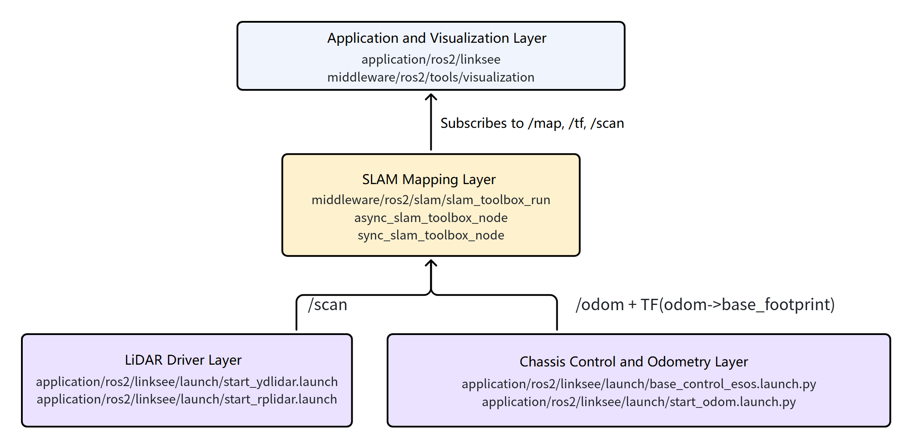
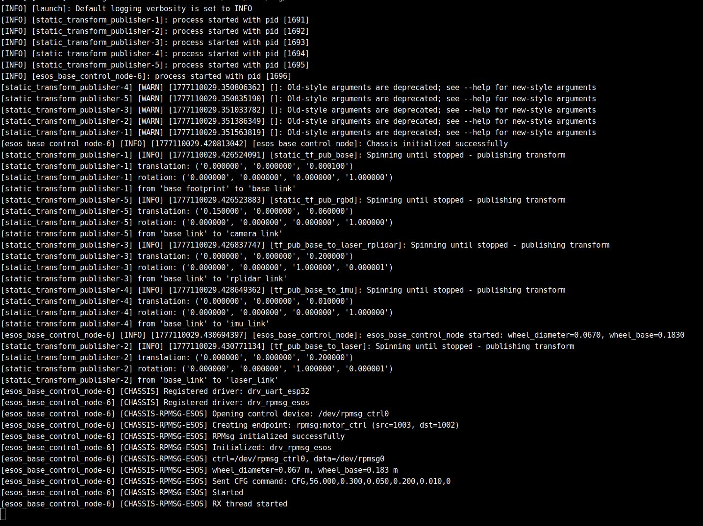
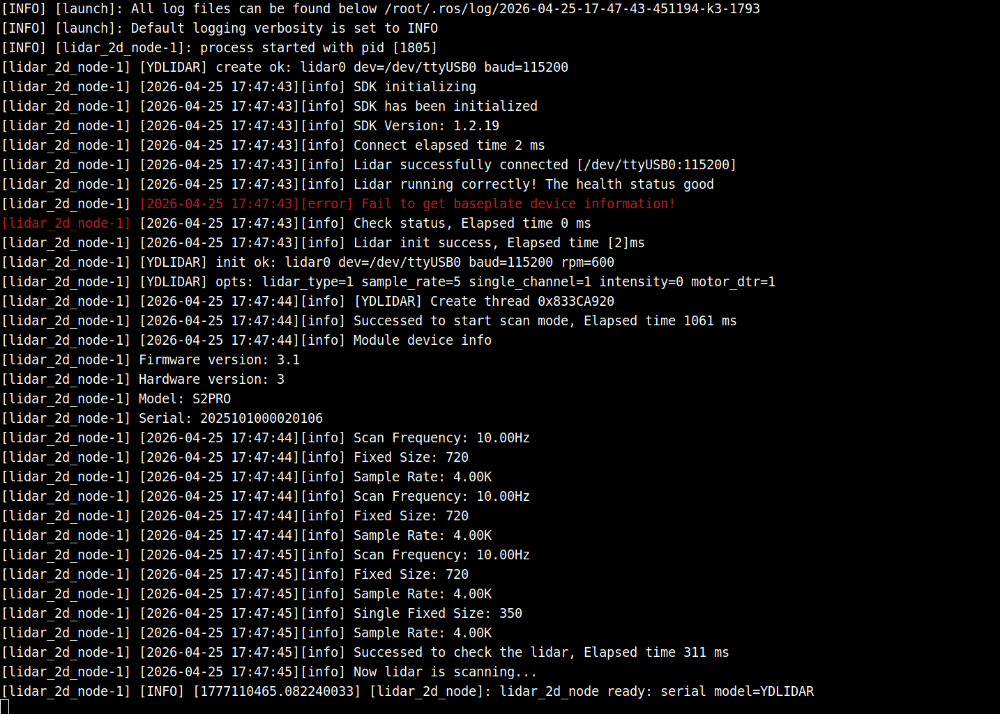
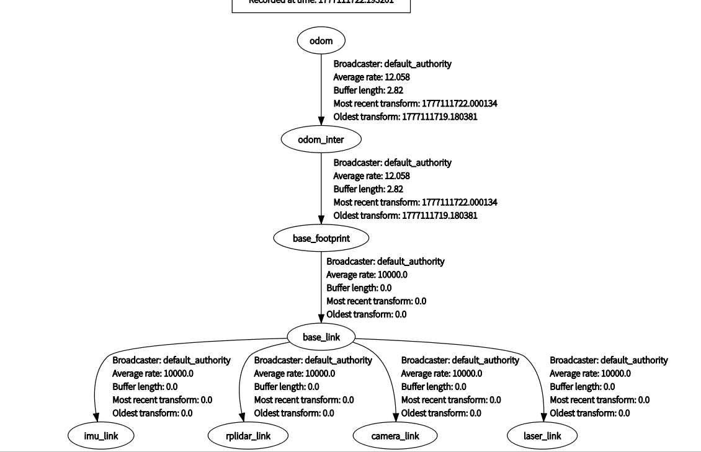
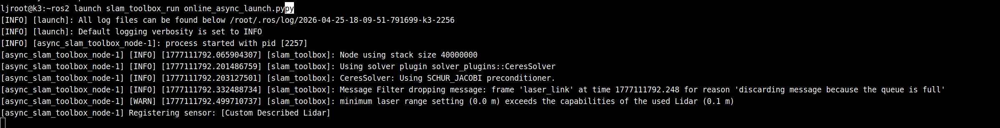
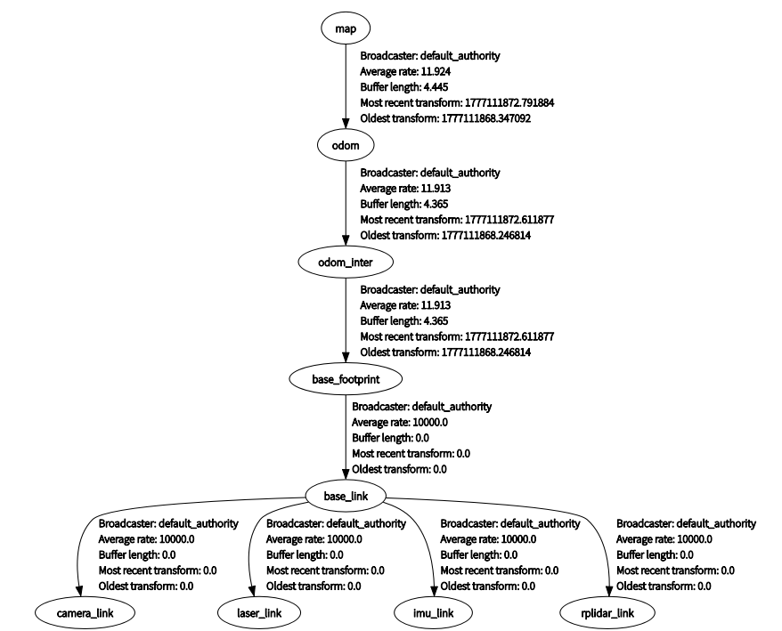
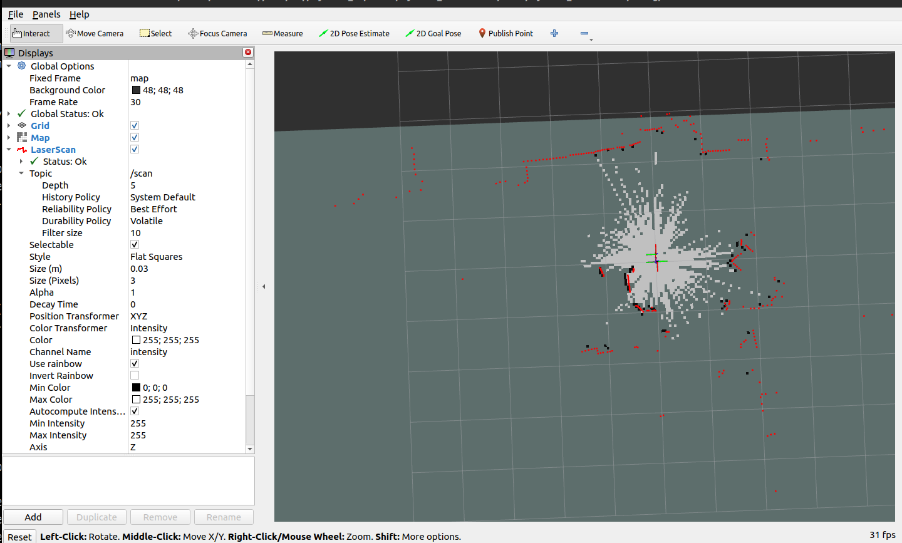
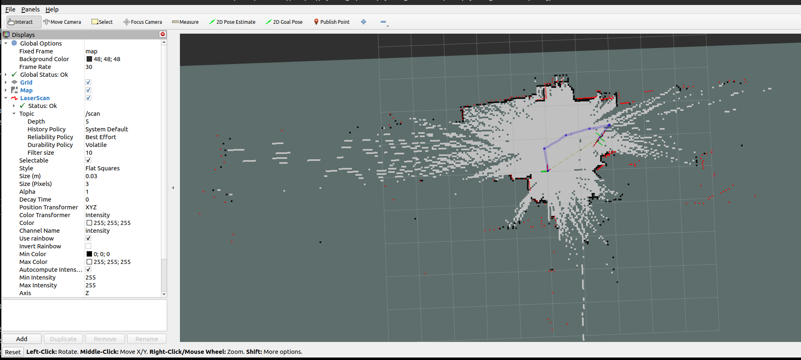

# Localization and Navigation · slam_toolbox

## 1. Overview

- **Key Features**: The `slam_toolbox` module is a wrapper around the ROS 2 `slam_toolbox` component, providing **2D laser real-time mapping** for this project. In this project it lives at `middleware/ros2/slam/slam_toolbox_run` and can quickly start online mapping on top of an existing lidar and odometry/TF pipeline, serving as an alternative or complement to the `cartographer` solution.
- **Specifications and Features**:
	- Algorithm type: 2D laser SLAM
	- Operating modes: asynchronous online mapping, synchronous online mapping
	- Recommended mode: asynchronous mode `online_async_launch.py`
	- Input topic: `/scan`
	- Required TF: `odom -> base_footprint`
	- Output topics: `/map`, `/map_metadata`
	- Configuration files: `mapper_params_online_async.yaml`, `mapper_params_online_sync.yaml`
- **Software Architecture**: The position of `slam_toolbox` within the `linksee` solution in this project is shown below:



- **Directory Structure**:

  | Path | Responsibility |
  | --- | --- |
  | `middleware/ros2/slam/slam_toolbox_run/launch/online_async_launch.py` | Asynchronous online mapping launch entry point |
  | `middleware/ros2/slam/slam_toolbox_run/launch/online_sync.launch.py` | Synchronous online mapping launch entry point |
  | `middleware/ros2/slam/slam_toolbox_run/config/mapper_params_online_async.yaml` | Asynchronous mode parameter configuration |
  | `middleware/ros2/slam/slam_toolbox_run/config/mapper_params_online_sync.yaml` | Synchronous mode parameter configuration |
  | `middleware/ros2/slam/slam_toolbox_run/README.md` | Module documentation |
  | `middleware/ros2/tools/visualization/launch/display_slam.launch.py` | Mapping visualization entry point |

## 2. Environment Setup

### 2.1 Prerequisites

- **Obtain Source Code**

  For SDK source code acquisition and basic build environment setup, refer to [Linksee Reference Solution](../../03-参考方案/3.2-轮式机器人Linksee.md). After completing SDK initialization, return to this document to continue.

- **Runtime Environment**:
	- Recommended system: K3 CoM260 + Bianbu26 LXQT
	- ROS version: ROS 2 Humble

- **Environment Variables and Initialization**:

  ```bash
  source ~/spacemit_robot/output/staging/setup.bash
  ```

- **Hardware and Connections**:
	- Sensor: 2D lidar
	- During debugging, first confirm the lidar is securely mounted with an unobstructed field of view

- **Tools and Permissions**:
	- If the lidar connects via serial, `/dev/ttyUSB*` or `/dev/ttyACM*` access permissions are required
	- Using RViz alongside is recommended for mapping debugging
	- Write permissions to the current directory are required when saving map files

### 2.2 Building

- **Build This Module**:

  ```bash
  cd ~/spacemit_robot
  source build/envsetup.sh
  lunch # Select k3-com260-linksee
  m
  ```

- **Build Artifacts**:
	- SDK build artifacts are located under `output/staging/` by default
	- Standalone workspace build artifacts are located under `install/slam_toolbox_run/`
	- This module primarily provides Launch files and YAML configuration
- **Common Differences**:
	- `slam_toolbox_run` is only a launch wrapper; `slam_toolbox` must also be installed on the system
	- Asynchronous mode offers better performance and suits most physical robot scenarios
	- Synchronous mode suits scenarios with stricter time-consistency requirements, but may have slightly lower real-time performance

## 3. Example Usage

**All terminals require:**

```
source ~/spacemit_robot/output/staging/setup.bash
```

**Expected Result**: No errors, and the `slam_toolbox_run` package is recognized.

**Step 1: Start the Chassis and Basic Coordinate Pipeline**

Start the `linksee` chassis control node first:

```bash
ros2 launch linksee base_control_esos.launch.py
```

Terminal output:



**Step 2: Start the Lidar**

```bash
ros2 launch linksee start_ydlidar.launch.py
```

**Expected Result**: `/scan` publishes continuously and the lidar logs show no anomalies.

Terminal output:



**Step 3: Start Odometry**

```bash
ros2 launch linksee start_odom.launch.py
```

Terminal output:


Expected TF tree:



**Step 4: Start Asynchronous Mapping**

```bash
ros2 launch slam_toolbox_run online_async_launch.py
```

**Expected Result**: `async_slam_toolbox_node` starts normally and begins publishing `/map` and `/map_metadata`.

Terminal output:



Expected TF tree:



**Step 5: Visualization on the PC**

```bash
source ~/visual_ws/install/setup.bash
ros2 launch visualization display_slam.launch.py
```

**Expected Result**: RViz shows the laser scan and the 2D map being built in real time.



**Step 6: Start Keyboard Control**

```
ros2 run teleop_twist_keyboard teleop_twist_keyboard
```

Drive the robot around and the map expands accordingly.



## 4. Application Development

- **External API or Interface**:
	- Launch entries: `ros2 launch slam_toolbox_run online_async_launch.py`, `ros2 launch slam_toolbox_run online_sync.launch.py`
	- Main input: `/scan`
	- Main outputs: `/map`, `/map_metadata`
	- Required TF: `odom -> base_footprint`
	- Configuration entries: `config/mapper_params_online_async.yaml`, `config/mapper_params_online_sync.yaml`
- **Usage Notes**:
	- Ensure the lidar and TF are working before starting `slam_toolbox`
	- When debugging alongside other mapping modules, run only one mapping solution at a time to avoid `/map`, TF, or resource contention
	- Do not run asynchronous and synchronous modes simultaneously
	- Concentrate parameter tuning in `config/*.yaml` and avoid frequently changing the base coordinate frames at runtime
- **Reference Demos or Example Paths**:
	- `middleware/ros2/slam/slam_toolbox_run/launch/online_async_launch.py`
	- `middleware/ros2/slam/slam_toolbox_run/launch/online_sync.launch.py`
	- `middleware/ros2/slam/slam_toolbox_run/config/mapper_params_online_async.yaml`
	- `middleware/ros2/tools/visualization/launch/display_slam.launch.py`

## 5. Debugging Guide

- **Check the Input Pipeline First**:
	- Confirm `/scan` is refreshing normally
	- Confirm `odom -> base_footprint` TF is available
	- If the map is not generated, do not rush to change parameters; investigate input completeness first
- **Mode Selection Advice**:
	- For physical robots, run asynchronous mode first
	- If time-synchronization issues arise, then evaluate synchronous mode
	- When the two modes behave noticeably differently, this can help isolate whether the problem is data frequency or parameters
- **Visual Debugging Advice**:
	- Use RViz to observe `LaserScan`, `TF`, and `Map` at the same time
	- If the laser scan is visible but no map appears, the cause is usually TF or a node not working correctly
	- If the map is noticeably distorted, it is usually related to chassis motion estimation error, lidar mounting offset, or ground slip
- **When Coordinating With Firmware Engineers**, collect the following:
	- Lidar model, mounting angle, and serial parameters
	- Chassis odometry source and TF publisher
	- Whether asynchronous or synchronous mode is currently in use
	- The corresponding YAML parameter file and its modification history

## 6. Troubleshooting

| Symptom | Possible Cause | Solution |
| --- | --- | --- |
| `slam_toolbox_run` fails to start with `slam_toolbox` not found | `slam_toolbox` package not installed on the system | Install the corresponding ROS 2 package then reload the environment |
| Map cannot be generated | `/scan` not publishing normally or TF incomplete | Check the lidar driver, the `/scan` topic, and the `odom -> base_footprint` TF |
| Map updates lag | Insufficient device compute power, high synchronous-mode overhead, or unstable lidar frequency | Switch to asynchronous mode first, reduce system load, and check the sensor frequency |
| Map shape distorted | Large odometry error, chassis slip, or unstable lidar mounting | Recalibrate chassis parameters and check the mechanical installation and ground conditions |
| No map displayed in RViz | `/map` not published or RViz configured incorrectly | Check the `slam_toolbox` logs first, then confirm the RViz Fixed Frame and display item configuration |
