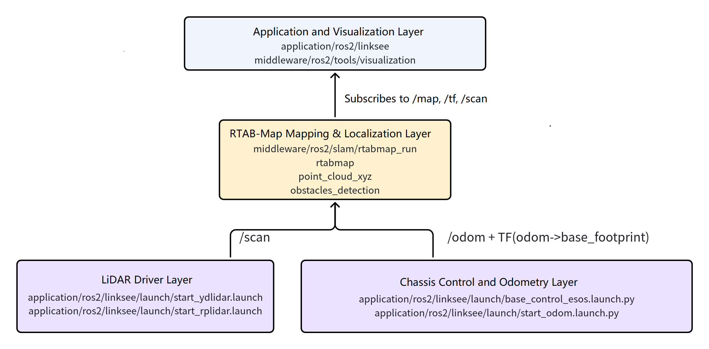
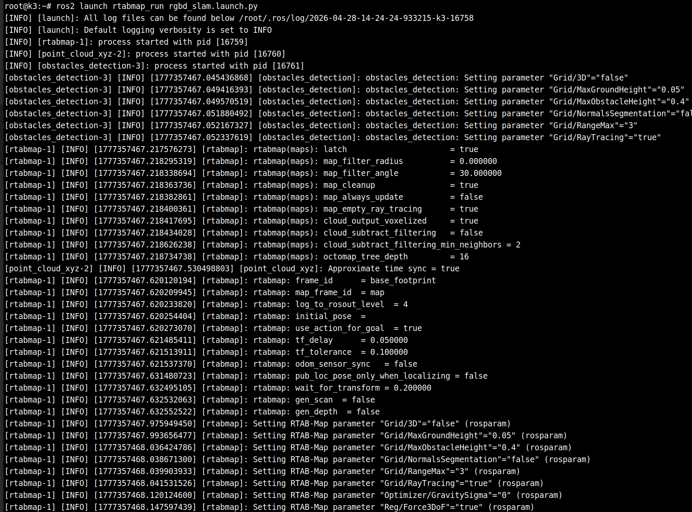

# Localization and Navigation · rtabmap

## 1. Overview

- **Key Features**: The `rtabmap` module is a wrapper around the ROS 2 `rtabmap_ros` component, providing **RGB-D mapping and localization** for this project, plus an additional launch entry point for mapping from 3D lidar point clouds. In this project it lives at `middleware/ros2/slam/rtabmap_run` and is suited to mobile robots equipped with a depth camera for indoor mapping, loop closure detection, and integration with downstream navigation.
- **Specifications and Features**:
	- Algorithm type: RGB-D SLAM, localization mode, 3D point cloud mapping
	- RGB-D inputs: color image, depth image, camera intrinsics
	- Default 2D occupancy grid output: `/map`
	- Additional outputs: `/camera/cloud`, `/camera/obstacles`, `/camera/ground`
	- Runtime parameters: `use_sim_time`, `localization`
	- Navigation integration: can be used with `middleware/ros2/planning/nav2/launch/nav2_rtabmap_rgbd.launch.py`
- **Software Architecture**: The position of `rtabmap` within the overall solution in this project is shown below:



- **Directory Structure**:

  | Path | Responsibility |
  | --- | --- |
  | `middleware/ros2/slam/rtabmap_run/launch/rgbd_slam.launch.py` | RGB-D mapping/localization launch entry point |
  | `middleware/ros2/slam/rtabmap_run/launch/3d_lidar_slam.launch.py` | 3D lidar point cloud mapping entry point |
  | `middleware/ros2/slam/rtabmap_run/README.md` | Module documentation |
  | `middleware/ros2/planning/nav2/launch/nav2_rtabmap_rgbd.launch.py` | RTAB-Map-based navigation launch entry point |
  | `middleware/ros2/tools/visualization/launch/display_rgbd.launch.py` | RGB-D/navigation visualization entry point |

## 2. Environment Setup

### 2.1 Prerequisites

- Obtain Source Code

  For SDK source code acquisition and basic build environment setup, refer to [Linksee Reference Solution](../../03-参考方案/3.2-轮式机器人Linksee.md). After completing SDK initialization, return to this document to continue.

- **Runtime Environment**:

	- K3 CoM260 + Bianbu26 LXQT
	- ROS version: ROS 2 Humble

- **Dependencies and External Resources**:
	- `rtabmap_ros` and related packages must be installed on the system

	  ```
	    sudo apt install 'ros-humble-rtabmap*' ros-humble-aruco-markers-msgs
	  ```

	- RGB-D mode requires a depth camera publishing the following topics:
	  - `/camera/color/image_raw`
	  - `/camera/color/camera_info`
	  - `/camera/depth/image_rect_raw`
	  - `/camera/depth/camera_info`

- **Environment Variables and Initialization**:

  ```bash
  source ~/spacemit_robot/output/staging/setup.bash
  ```

- **Hardware and Connections**:
	- A RealSense D415/D435 series camera is recommended
	- When used with the `linksee` solution, the chassis-side `/odom` and TF pipeline must also be working
	- The RGB-D camera must be mounted securely so that the color and depth images stay correctly aligned
	- When using a 3D LiDAR, confirm that the point cloud coordinate frame matches the robot body frame

### 2.2 Building

- **Full SDK Build:**

  ```bash
  cd ~/spacemit_robot
  source build/envsetup.sh
  lunch # Select k3-com260-linksee
  m
  ```

- **Build Artifacts**:
	- SDK artifacts are located under `~/spacemit_robot/output/staging/`
	- This module primarily provides Launch wrappers
- **Common Differences**:
	- RGB-D mode is better suited to indoor short-range mapping and navigation integration
	- 3D LiDAR mode is better suited to point cloud mapping validation, but the current default launch content is fairly minimal
	- Navigation integration typically requires additionally starting `nav2_rtabmap_rgbd.launch.py`

## 3. Example Usage

**Prerequisites**: The RGB-D camera driver, odometry, and TF are ready.

All terminals require: `source ~/spacemit_robot/output/staging/setup.bash`

**Step 1: Start the Chassis and Odometry Pipeline**

When validating on a `linksee` physical robot, start chassis control and odometry first:

```bash
ros2 launch linksee base_control_esos.launch.py
```

Terminal output:


Start the lidar and odometry:

```
ros2 launch linksee start_ydlidar.launch.py
ros2 launch linksee start_odom.launch.py
```

Terminal output:


**Expected Result**: `/odom` and the base TF are working normally.

**Step 2: Start the Depth Camera**

```
ros2 launch realsense2_camera rs_launch.py camera_namespace:=/
```

Terminal output:


**Step 3: Start RGB-D Mapping**

```bash
ros2 launch rtabmap_run rgbd_slam.launch.py
```

**Expected Result**: Nodes such as `rtabmap`, `point_cloud_xyz`, and `obstacles_detection` start normally and begin publishing `/map`, `/camera/cloud`, `/camera/obstacles`, and `/camera/ground`.

Terminal output:



**Step 4: Visualization on the PC**

```bash
source ~/visual_ws/install/setup.bash
ros2 launch visualization display_rgbd.launch.py
```

**Expected Result**: RViz shows RGB-D visualization output, the point cloud, and map updates.


**Step 5: Start Keyboard Control**

```
ros2 run teleop_twist_keyboard teleop_twist_keyboard
```

Drive the robot with the keyboard to expand the mapped area.

**Expected Result**


## 4. Application Development

- **External API or Interface**:
	- Launch entries: `ros2 launch rtabmap_run rgbd_slam.launch.py`, `ros2 launch rtabmap_run 3d_lidar_slam.launch.py`
	- Navigation entry: `ros2 launch nav2 nav2_rtabmap_rgbd.launch.py`
	- RGB-D input topics: `/camera/color/image_raw`, `/camera/color/camera_info`, `/camera/depth/image_rect_raw`, `/camera/depth/camera_info`
	- 3D point cloud input topic: `/points`
	- Output topics: `/map`, `/camera/cloud`, `/camera/obstacles`, `/camera/ground`
	- Runtime parameters: `use_sim_time`, `localization`
- **Usage Notes**:
	- RGB-D mode is sensitive to camera intrinsics and time synchronization; confirm the image pipeline is stable first
	- Localization mode depends on an existing database; relocalization will not work if the database does not exist
	- When integrating with navigation, clarify the map/localization data source to avoid multiple SLAM or localization modules publishing conflicting information simultaneously
	- The 3D LiDAR launch entry currently enables only the core `rtabmap` node by default; extend the launch further if a more complete pipeline is needed
- **Reference Demos or Example Paths**:
	- `middleware/ros2/slam/rtabmap_run/launch/rgbd_slam.launch.py`
	- `middleware/ros2/slam/rtabmap_run/launch/3d_lidar_slam.launch.py`
	- `middleware/ros2/planning/nav2/launch/nav2_rtabmap_rgbd.launch.py`
	- `middleware/ros2/tools/visualization/launch/display_rgbd.launch.py`

## 5. Debugging Guide

- **Check Sensor Inputs First**:
	- The RGB image, depth image, and camera parameters must all be complete at the same time
	- If the depth image has no data, the point cloud pipeline usually will not work either
	- In 3D LiDAR mode, pay particular attention to the `/points` point cloud coordinate frame and frequency
- **Odometry and TF Troubleshooting**:
	- `rtabmap` is sensitive to `odom -> base_footprint` accuracy
	- When mapping drifts, investigate the chassis odometry and the camera mounting extrinsics first
- **Localization Mode Troubleshooting**:
	- Confirm whether `~/.ros/rtabmap.db` exists
	- If the database is corrupted or empty, rebuild the map
	- If it starts but cannot localize reliably, check whether the current environment differs too greatly from the scene recorded in the mapping database
- **Visualization Advice**:
	- Use `display_rgbd.launch.py` or `display_navigation.launch.py` to inspect the point cloud, map, and navigation state
	- If images appear but no map does, the `rtabmap` main node is usually not working or the inputs are incomplete
	- If a map appears but obstacle/ground segmentation is abnormal, focus on depth image quality and camera mounting height
- **Information to Collect for Joint Debugging**:
	- Camera model, resolution, frame rate, and topic names
	- Whether the depth image is aligned and whether the camera extrinsics are fixed
	- Whether the current mode is mapping, localization, or 3D LiDAR
	- Database files, launch parameters, and navigation parameter file paths

## 6. Troubleshooting

| Symptom | Possible Cause | Solution |
| --- | --- | --- |
| `rgbd_slam.launch.py` fails to start | `rtabmap_ros` not installed on the system, or camera topics incomplete | Install the RTAB-Map dependencies and check the RGB, Depth, and CameraInfo topics |
| Severe mapping drift | Large odometry error, inaccurate camera extrinsics, or insufficient scene texture | Check `/odom`, TF, and camera mounting pose; recalibrate if necessary |
| No point cloud output | Depth image not published, topic name mismatch, or abnormal depth data | Check `/camera/depth/image_rect_raw` and the related remap configuration |
| Localization mode fails to start | Missing `~/.ros/rtabmap.db` or database unavailable | Confirm the database exists and is readable; rebuild the map if necessary |
| Localization unstable after navigation starts | RTAB-Map output does not match navigation parameters, or multiple modules publish localization information simultaneously | Check the `nav2_rtabmap_rgbd.launch.py` parameters and avoid enabling other localization/SLAM modules at the same time |
| 3D LiDAR mode performs poorly | Insufficient point cloud quality, incorrect coordinate frame, or the default launch pipeline is too minimal | Confirm `/points` data quality first, then add ICP/visualization nodes as needed |
