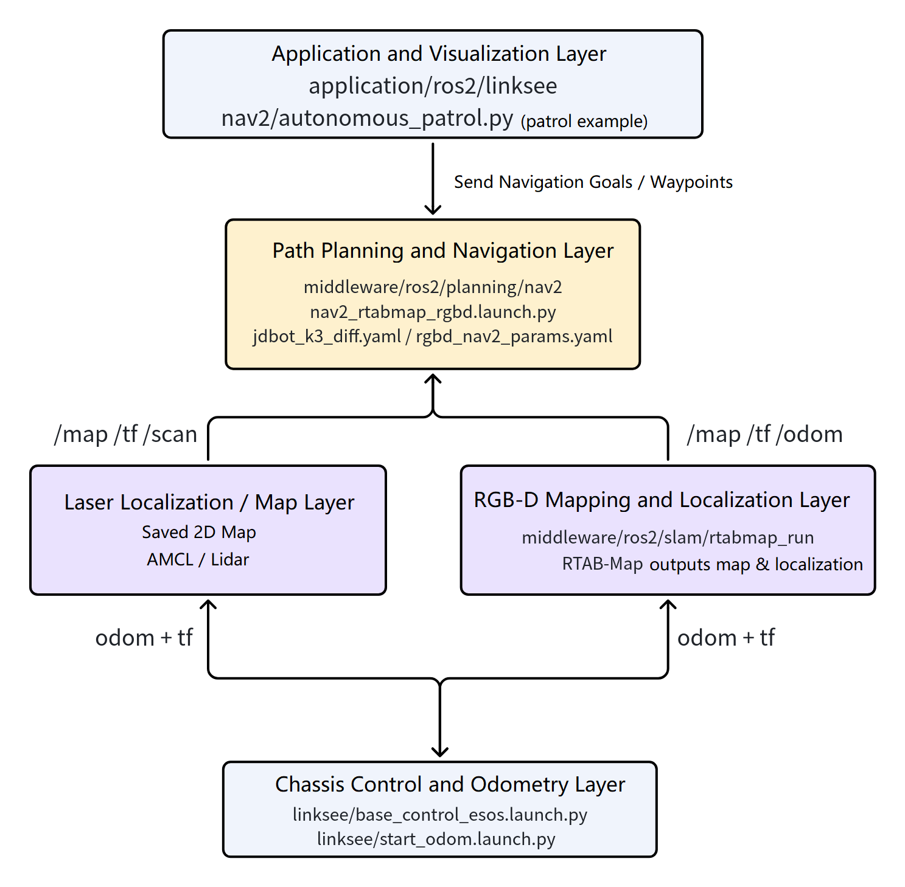
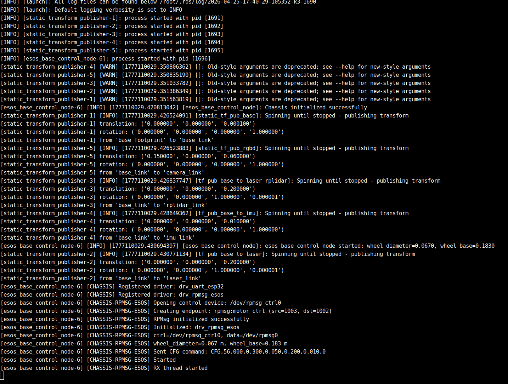
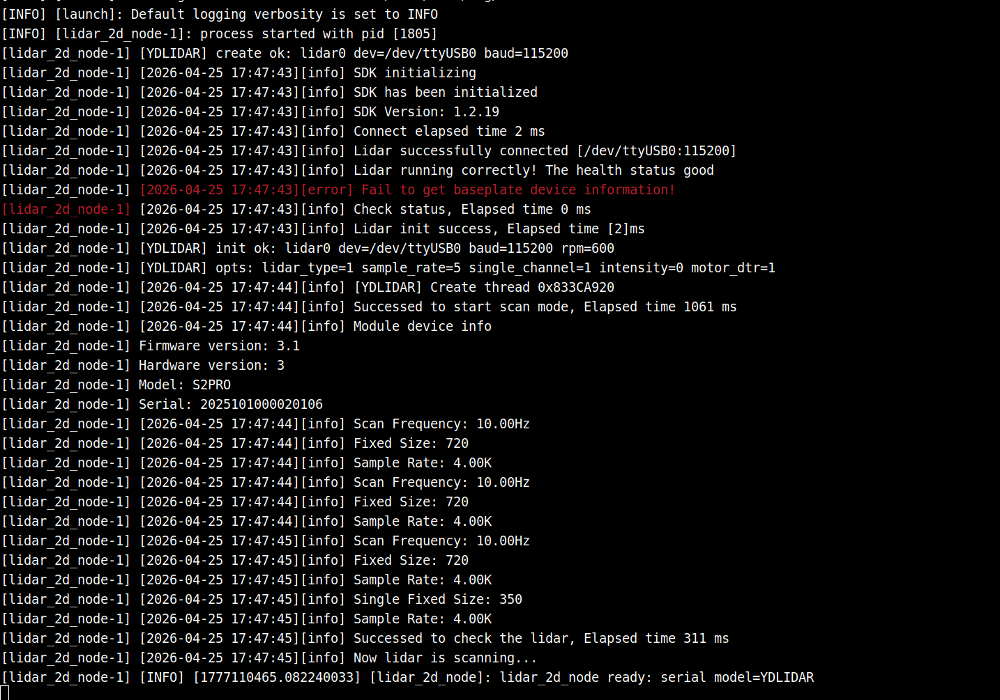
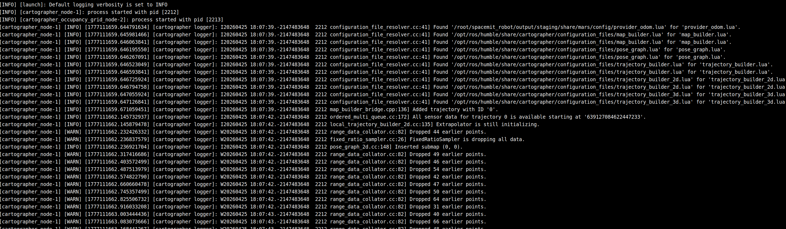
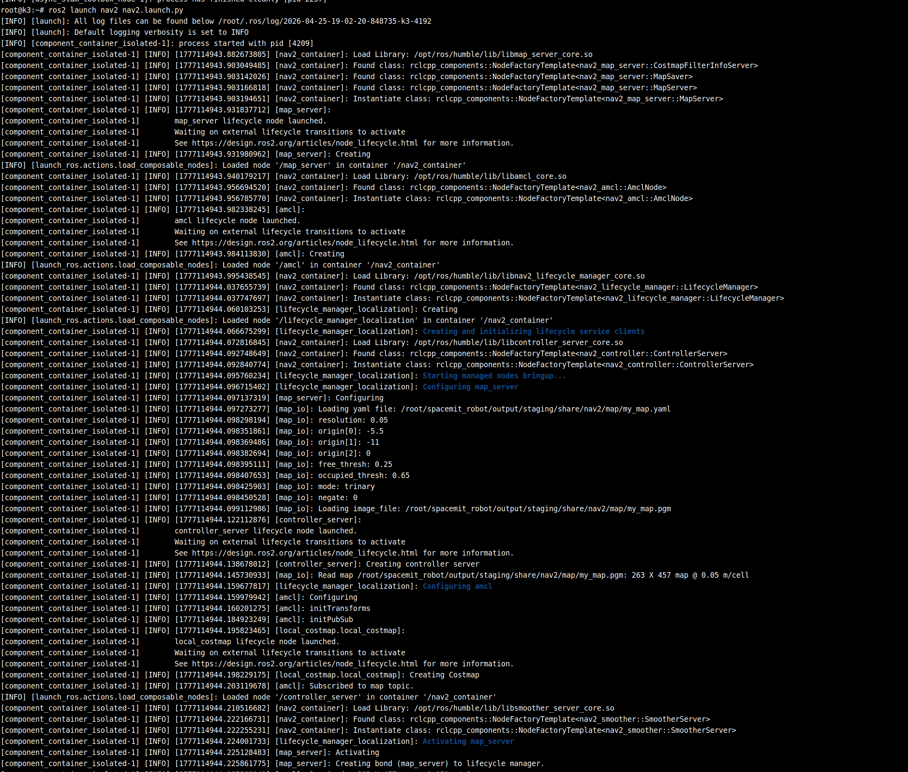
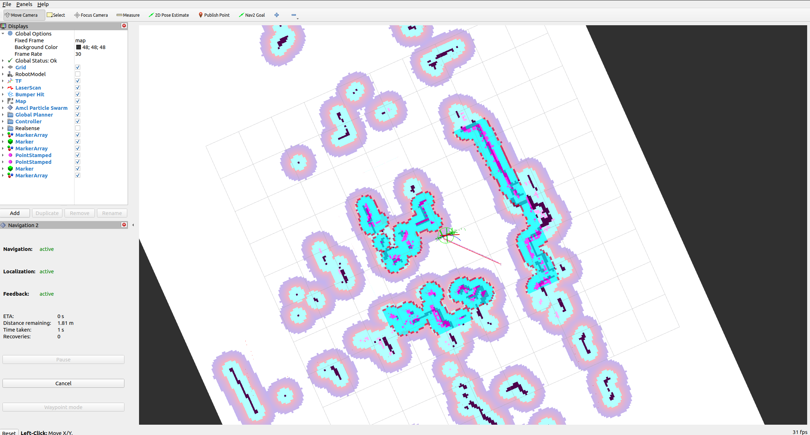

# Path Planning · nav2

## 1. Overview

- **Key Features**: The `nav2` module lives at `middleware/ros2/planning/nav2` and is the launch wrapper layer for autonomous mobile robot navigation in this project. Built on the ROS 2 Nav2 navigation stack, it provides two navigation entry points for differential-drive robots such as `linksee`: conventional navigation based on a 2D lidar map, and RGB-D navigation combined with `rtabmap`. The module does not perform mapping itself; its job is to organize the map, the navigation parameters, and the Nav2 bringup launch flow.
- **Specifications and Features**:
  - Based on ROS 2 Humble and the Nav2 navigation stack
  - Supports 2D lidar localization and navigation, with `nav2.launch.py` as the default entry point
  - Supports RTAB-Map-based RGB-D navigation, with `nav2_rtabmap_rgbd.launch.py` as the default entry point
  - Default parameter files: `config/jdbot_k3_diff.yaml` and `config/rgbd_nav2_params.yaml`
  - Default map file: `map/my_map.yaml`
  - 2D navigation supports overriding via parameters such as `map`, `params`, and `use_sim_time`
  - Ships with DWB local planner and cost map parameter configurations targeting differential-drive chassis scenarios
- **Software Architecture**: Within the current project, `nav2` sits in the overall navigation pipeline as follows:



- **Directory Structure**:

  | Path | Responsibility |
  | --- | --- |
  | `middleware/ros2/planning/nav2/launch/nav2.launch.py` | 2D laser map navigation launch entry point |
  | `middleware/ros2/planning/nav2/launch/nav2_rtabmap_rgbd.launch.py` | RTAB-Map-based RGB-D navigation launch entry point |
  | `middleware/ros2/planning/nav2/config/jdbot_k3_diff.yaml` | Differential-drive chassis 2D navigation parameters |
  | `middleware/ros2/planning/nav2/config/rgbd_nav2_params.yaml` | RGB-D navigation parameters |
  | `middleware/ros2/planning/nav2/map/` | Default map file directory |
  | `middleware/ros2/planning/nav2/nav2/autonomous_patrol.py` | Topic-based patrol example node |
  | `middleware/ros2/planning/nav2/README.md` | Module documentation (Chinese) |

## 2. Environment Setup

### 2.1 Prerequisites

- **Confirm the Code Is Downloaded**

  For SDK source code acquisition and basic build environment setup, refer to [Linksee Reference Solution](../../03-参考方案/3.2-轮式机器人Linksee.md). After completing SDK initialization, return to this document to continue.

- **Runtime Environment**:
  - K3 CoM260 + Bianbu26 LXQT
  - ROS version: ROS 2 Humble

- **Dependencies and External Resources**:

  - 2D laser navigation requires a prepared map file at `middleware/ros2/planning/nav2/map/my_map.yaml`

- **Environment Variables and Initialization**:

  ```bash
  source ~/spacemit_robot/output/staging/setup.bash
  ```

### 2.2 Building

- **Build This Module**:

  Full SDK build:

  ```bash
  cd ~/spacemit_robot
  source build/envsetup.sh
  lunch # Select k3-com260-linksee
  m
  ```

- **Build Artifacts**:
  - SDK build artifacts are located under `output/staging/`
  - Standalone workspace install artifacts are located under `install/nav2/`
  - This module mainly provides launch files, parameter files, and a Python example node
- **Common Differences**:
  - `nav2.launch.py` is used for 2D laser map navigation
  - `nav2_rtabmap_rgbd.launch.py` is used for RGB-D navigation
  - 2D navigation depends on an existing map file, whereas RGB-D navigation typically depends on `rtabmap_run` to provide localization results

## 3. Example Usage

### 3.1 2D Laser Map Navigation

- **All terminals require:**

  ```bash
  source ~/spacemit_robot/output/staging/setup.bash
  ```

  **Expected Result**: No errors, and the `linksee` and `nav2` packages are recognized.

**Step 1: Start Chassis Control**

```bash
ros2 launch linksee base_control_esos.launch.py
```

**Expected Result**: The chassis driver node starts and the terminal continuously prints chassis-related logs.

Terminal output:



**Step 2: Start the Lidar**

```bash
ros2 launch linksee start_ydlidar.launch.py
```

**Expected Result**: `/scan` starts publishing continuously.

Terminal output:



**Step 3: Start Odometry**

```bash
ros2 launch linksee start_odom.launch.py
```

**Expected Result**: `/odom` and the base TF start publishing, making the robot's motion state available to the navigation stack.

Terminal output:



**Step 4: Start Navigation**

```bash
ros2 launch nav2 nav2.launch.py
```

**Expected Result**: All Nav2 nodes start normally and the navigation stack bringup logs are visible in the terminal; if the map file exists, the default `map/my_map.yaml` is loaded.

Terminal output:



**Step 5: Start Visualization on the PC**

```bash
source ~/visual_ws/install/setup.bash
ros2 launch visualization display_navigation.launch.py
```

**Expected Result**: RViz shows the map, robot pose, laser data, and navigation-related displays.



### 3.2 RGB-D Navigation with RTAB-Map

**Prerequisites**: The default RGB-D camera, `rtabmap_run`, chassis odometry, and the TF pipeline are ready.

**Step 1: Load the Runtime Environment**

```bash
source ~/spacemit_robot/output/staging/setup.bash
```

**Expected Result**: No errors, and the `rtabmap_run` and `nav2` packages are recognized.

**Step 2: Start Chassis Control and Odometry**

```bash
ros2 launch linksee base_control_esos.launch.py
```

```bash
ros2 launch linksee start_ydlidar.launch.py
ros2 launch linksee start_odom.launch.py
```

**Expected Result**: `/odom` and the TF pipeline are working.

**Step 3: Start the RTAB-Map Localization or Mapping Pipeline**

```bash
ros2 launch rtabmap_run rgbd_slam.launch.py localization:=true
```

**Expected Result**: `rtabmap` enters localization mode and starts publishing the map and localization results.

**Step 4: Start RGB-D Navigation**

```bash
ros2 launch nav2 nav2_rtabmap_rgbd.launch.py
```

**Expected Result**: Nav2 starts with `rgbd_nav2_params.yaml` and can navigate using the map and localization provided by RTAB-Map.

**Step 5: Visualization on the PC**

```bash
source ~/visual_ws/install/setup.bash
ros2 launch visualization display_navigation.launch.py
```

**Expected Result**: RViz shows the robot pose, map, cost map, and navigation status.

## 4. Application Development

- **External API or Interface**:
  - Launch entries: `ros2 launch nav2 nav2.launch.py`, `ros2 launch nav2 nav2_rtabmap_rgbd.launch.py`
  - Configurable parameters: `map`, `params`, `use_sim_time`
  - Relevant inputs: `/map`, `/odom`, TF, and lidar- or RGB-D-related topics
  - Example node entry point: `autonomous_patrol = nav2.autonomous_patrol:main`
- **Usage Notes**:
  - In 2D navigation mode, make sure the map file path is correct, otherwise localization and planning will not work after bringup
  - Always verify that `/odom` and the TF pipeline are working before running navigation
  - In RGB-D navigation mode, avoid running multiple modules that publish a map or localization results at the same time
  - To extend capabilities such as patrol or waypoint navigation, add new Python nodes based on `nav2_simple_commander`
- **Reference Demos or Example Paths**:
  - `middleware/ros2/planning/nav2/launch/nav2.launch.py`
  - `middleware/ros2/planning/nav2/launch/nav2_rtabmap_rgbd.launch.py`
  - `middleware/ros2/planning/nav2/nav2/autonomous_patrol.py`
  - `middleware/ros2/planning/nav2/README.md`

## 5. Debugging Guide

- Start by checking whether `/odom`, `/tf`, and `/map` are complete; Nav2 depends heavily on the underlying localization and coordinate frame pipeline.
- If 2D navigation misbehaves, first confirm that the map file exists and that the `map:=...` parameter path is correct.
- If RGB-D navigation misbehaves, first confirm that `rtabmap_run` is already publishing localization and map output correctly, then check whether `nav2_rtabmap_rgbd.launch.py` started correctly.
- Use RViz to check whether the global path, local cost map, robot footprint, and sensor data are consistent with each other.
- When coordinating with hardware or chassis, collect the following information: chassis model, `/odom` frequency, TF tree, lidar/depth camera topic names, map file path, and the parameter file currently in use.

## 6. Troubleshooting

| Symptom | Possible Cause | Solution |
| --- | --- | --- |
| `ros2 launch nav2 nav2.launch.py` starts but localization fails | Missing map file or incorrect path | Check whether the default `map/my_map.yaml` exists, or specify the correct path via `map:=/absolute/path/to/map.yaml` |
| Navigation nodes start but the robot does not move | Issue in the chassis control pipeline or `/cmd_vel` not being published | Check whether `linksee` chassis control is working and confirm the chassis responds to velocity commands |
| TF-related errors when starting navigation | Incomplete coordinate chain such as `/odom`, `base_footprint`, and `map` | Start the odometry node first, then inspect the TF tree with RViz or TF tools |
| RGB-D navigation is unstable after startup | Unstable RTAB-Map localization output, or a mismatch with the navigation parameters | Verify `rtabmap_run` on its own first, then check `rgbd_nav2_params.yaml` and the input topics |
| The patrol example does not run | Incorrect Python entry point name, or topic control mismatch | Check whether the `autonomous_patrol` entry point in `setup.py` is installed, and confirm the control topic names are correct |
