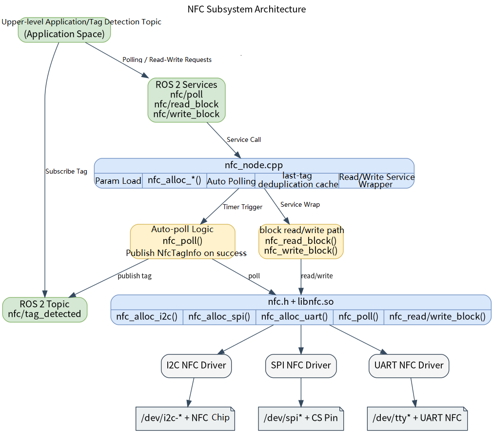

# Basic Sensors · NFC

## 1. Overview

- **Key Features**: The NFC module sits in the basic-sensor layer of the robot development stack. It wraps the `components/peripherals/nfc` card-reader component downward and exposes a ROS 2 node `nfc_node`, a tag detection topic, and block read/write services upward. The module detects NFC tags, publishes UID and tag-type information, and provides upper-level applications with a request-response interface for block-level reads and writes.
- **Specifications and Features** (interface type, rate, resolution, algorithm version, etc.): Exposes both a ROS 2 topic and services. The default topic is `/nfc/tag_detected` with message type `peripherals_nfc_node/msg/NfcTagInfo`; the default services are `/nfc/poll`, `/nfc/read_block`, and `/nfc/write_block` with types `peripherals_nfc_node/srv/NfcPoll`, `peripherals_nfc_node/srv/NfcReadBlock`, and `peripherals_nfc_node/srv/NfcWriteBlock` respectively. The node name is fixed as `nfc_node`. Default background auto-poll period is `100 ms` and single-poll timeout is `50 ms`. Supports selecting `i2c` / `spi` / `uart` transport via parameters. **Important note**: the interface layer supports all three transport parameters, but the only driver actually registered in the current repository is the I2C `SI512` driver, so the default working path is `i2c + SI512 + /dev/i2c-5 + 0x28`.
- **Software Block Diagram**:



- **Directory Structure**:

| Path | Responsibility |
| --- | --- |
| `middleware/ros2/peripherals/nfc/src/nfc_node.cpp` | ROS 2 NFC node implementation — loads parameters, creates the underlying device, auto-polls, publishes the tag topic, and handles read/write services |
| `middleware/ros2/peripherals/nfc/params/nfc_node.yaml` | Default node parameter file — transport, device path, topic names, service names, and polling parameters |
| `middleware/ros2/peripherals/nfc/CMakeLists.txt` | `peripherals_nfc_node` package build file — finds `nfc.h`, `libnfc.so` and produces `nfc_node` |
| `middleware/ros2/peripherals/nfc/package.xml` | ROS 2 package metadata and dependency declarations |
| `middleware/ros2/peripherals/nfc/msg/NfcTagInfo.msg` | NFC tag info message definition |
| `middleware/ros2/peripherals/nfc/srv/NfcPoll.srv` | Active tag poll service definition |
| `middleware/ros2/peripherals/nfc/srv/NfcReadBlock.srv` | Block read service definition |
| `middleware/ros2/peripherals/nfc/srv/NfcWriteBlock.srv` | Block write service definition |
| `components/peripherals/nfc/include/nfc.h` | Underlying NFC component C API, tag structs, and factory function declarations |
| `components/peripherals/nfc/src/nfc_core.c` | Underlying device object, driver registration, and `nfc_alloc_i2c/spi/uart()` dispatch implementation |
| `components/peripherals/nfc/src/drivers/drv_i2c_SI512/drv_i2c_SI512.c` | SI512 I2C driver implementation |
| `components/peripherals/nfc/test/test_nfc_i2c.c` | Underlying I2C self-test program — useful for ruling out device, address, and card interaction issues first |

## 2. Environment Setup

### Prerequisites

- **Runtime Environment**: Recommended board-side environment is the `k1-deb1` system image, with an I2C controller and the corresponding device nodes exposed. ROS 2 Humble is recommended. The build side requires CMake, a C++17 compiler, `ament_cmake`, `rclcpp`, and the SDK unified build script.
- **Dependencies and External Resources**: I2C mode depends on the kernel-exported `/dev/i2c-*` device nodes and has no additional third-party library dependencies. The current repository does not include SPI/UART driver source files in the `nfc` component, so the only working path using the code in this directory is I2C + SI512.
- **Hardware and Connections**: A SI512 NFC module is required, connected to the target board via I2C. Verify that power, SCL, and SDA are correctly connected, the module's I2C address matches the program parameter, and the test card is a Type A card supported by the driver's current example path.

### Build

- **Getting the Code**: See Section [2.3 Building and Compilation](../../02-快速入门/2.3-构建编译.md) for cloning the full SDK with the `repo` tool. All build and test commands below are run from inside the SDK.
- **Module Compilation**: Build in dependency order — compile the underlying NFC component first, then the ROS 2 node package that includes `NfcTagInfo.msg` and the three `srv` definitions.

  ```bash
  source build/envsetup.sh
  cd components/peripherals/nfc/
  mm -DSROBOTIS_PERIPHERALS_NFC_ENABLED_DRIVERS=drv_i2c_SI512
  cd -
  ./build/build.sh package middleware/ros2/peripherals/nfc
  ```

  Expected artifacts: `output/staging/lib/peripherals_nfc_node/nfc_node`, `output/staging/share/peripherals_nfc_node/params/nfc_node.yaml`, `output/staging/lib/libnfc.so`, and the ROS 2 interface install files for `peripherals_nfc_node/msg/NfcTagInfo` and the three `peripherals_nfc_node/srv/*` types. If the current target is not `riscv64`, use the actual `output/<target>/staging` or `output/staging` path accordingly.

- **Common Differences**: The `CMakeLists.txt` of `peripherals_nfc_node` searches for `nfc.h` and `libnfc.so`; if `components/peripherals/nfc` has not been built first, the error `nfc.h or libnfc not found` will appear. Additionally, the underlying `components/peripherals/nfc` only compiles the driver specified by `SROBOTIS_PERIPHERALS_NFC_ENABLED_DRIVERS`; the only driver directory actually provided in the current repository is `drv_i2c_SI512`. If the target configuration does not include that driver in `libnfc.so`, the node will compile successfully but fail on startup with `nfc_alloc_* failed`.

## 3. Example Usage (From Scratch)

This section provides a step-by-step path for readers to reproduce the examples from scratch:

### 3.1 Example 1: Start the ROS 2 NFC Node and Observe the Tag Detection Topic

**Prerequisites**: Build is complete; a SI512-compatible I2C NFC module is connected to the target board; the `transport`, `driver`, `device`, and `i2c_addr` in the current parameter file match the actual hardware; the current user has access permission to the device node.

**Step 1**: Navigate to the SDK source directory and load the runtime environment.

```bash
source output/staging/setup.bash
```

Expected result: `ros2 pkg executables peripherals_nfc_node` lists `peripherals_nfc_node nfc_node`.

**Step 2**: Confirm or edit the parameter file. The default installed parameter file path is:

```bash
output/staging/share/peripherals_nfc_node/params/nfc_node.yaml
```

The default contents are equivalent to:

```yaml
nfc_node:
  ros__parameters:
    transport: "i2c"
    driver: "SI512"
    name: "nfc0"
    device: "/dev/i2c-5"
    i2c_addr: 40
    cs_pin: 0
    baud: 115200
    frame_id: "nfc"

    tag_topic: "nfc/tag_detected"
    poll_service: "nfc/poll"
    read_service: "nfc/read_block"
    write_service: "nfc/write_block"

    auto_poll_enabled: true
    poll_period_ms: 100
    poll_timeout_ms: 50
    publish_duplicates: false
```

Expected result: If the actual module is not I2C, not on `/dev/i2c-5`, or uses an address other than `0x28` (decimal `40`), edit the parameters first. In the current repository, changing `transport` to `spi` or `uart` typically also requires adding the corresponding underlying driver; otherwise the node will fail to start.

**Step 3**: Start the NFC node.

```bash
ros2 run peripherals_nfc_node nfc_node \
  --ros-args \
  --params-file output/staging/share/peripherals_nfc_node/params/nfc_node.yaml
```

Expected result: The terminal prints a log similar to the following, indicating the node has started and the underlying device has been initialized.

```text
nfc_node ready: transport=i2c driver=SI512 name=nfc0 device=/dev/i2c-5 tag_topic=nfc/tag_detected auto_poll=true period_ms=100 timeout_ms=50
```

**Step 4**: Open another terminal, load the same ROS 2 environment, and subscribe to the tag detection topic.

```bash
source output/staging/setup.bash
ros2 topic echo /nfc/tag_detected
```

Expected result: After placing an NFC card near the reader, the terminal shows `peripherals_nfc_node/msg/NfcTagInfo` output such as:

```yaml
header:
  stamp:
    sec: 0
    nanosec: 0
  frame_id: nfc
uid:
- 4
- 162
- 17
- 59
uid_len: 4
tag_type: 1
rssi_dbm: -42
ats: []
ats_len: 0
---
```

**Step 5**: Verify duplicate tag publish behavior.

Expected result: With the default `publish_duplicates=false`, keeping the same card continuously on the reader typically publishes only once on first detection; removing and re-presenting the card triggers another publish. Note that the "is duplicate" check compares not just the UID but also `tag_type`, `rssi_dbm`, and `ATS` — if RSSI fluctuates while the card is held in place, the same card may trigger a repeat publish.

### 3.2 Example 2: Call the poll/read/write Services

**Prerequisites**: `nfc_node` is confirmed to start normally. For write block testing, use a writeable test card and confirm the card and driver actually support block read/write on the target block.

**Step 1**: Confirm the services are registered.

```bash
source output/staging/setup.bash
ros2 service list | grep '^/nfc/'
```

Expected result: `/nfc/poll`, `/nfc/read_block`, and `/nfc/write_block` all appear.

**Step 2**: Actively poll once for a tag.

```bash
ros2 service call /nfc/poll peripherals_nfc_node/srv/NfcPoll "{timeout_ms: 200}"
```

Expected result:
- If a tag is detected: returns `success: true`, `message: "tag detected"`, and `tag_info` populated with the UID and type.
- If no tag is detected within the timeout: returns `success: false`, `message: "no tag"`.
- If the underlying access fails: `message` contains `poll failed: rc=...`.

Note: when the service poll succeeds, the node also simultaneously publishes the same tag to `/nfc/tag_detected`.

**Step 3**: Read a specific data block, for example block 4.

```bash
ros2 service call /nfc/read_block peripherals_nfc_node/srv/NfcReadBlock "{block_addr: 4}"
```

Expected result: On success, returns `success: true`, `message: "ok"`, and the read bytes in the `data` field. If the card does not support the block, the block address is invalid, or the underlying call fails, returns `success: false` with the corresponding error message.

**Step 4**: Write to a specific data block. The current implementation requires `data` to be **exactly 16 bytes**.

```bash
ros2 service call /nfc/write_block peripherals_nfc_node/srv/NfcWriteBlock \
  "{block_addr: 4, data: [1, 2, 3, 4, 5, 6, 7, 8, 9, 10, 11, 12, 13, 14, 15, 16]}"
```

Expected result:
- On success: returns `success: true`, `message: "ok"`.
- If `data` is not exactly 16 bytes: the node returns `success: false`, `message: "write failed: data must contain exactly 16 bytes"` before entering the underlying layer.
- If the target card or driver does not support block writes: returns `success: false` with the underlying error message.

## 4. Application Development

- **API / Interface**: Upper-level applications can subscribe to the ROS 2 topic `/nfc/tag_detected` with message type `peripherals_nfc_node/msg/NfcTagInfo`, or call the services `/nfc/poll`, `/nfc/read_block`, and `/nfc/write_block` with types `peripherals_nfc_node/srv/NfcPoll`, `peripherals_nfc_node/srv/NfcReadBlock`, and `peripherals_nfc_node/srv/NfcWriteBlock` respectively. The topic is suited for broadcasting the asynchronous "tag detected" event; the services are suited for request-response semantics like "poll once now", "read a block", or "write a block".
- **Message and Service Fields**:
  - `NfcTagInfo` contains `header`, `uid`, `uid_len`, `tag_type`, `rssi_dbm`, `ats`, and `ats_len`. The node truncates UID to at most 16 bytes and ATS to at most 32 bytes.
  - `NfcPoll` request: `uint32 timeout_ms`; response: `bool success`, `string message`, `NfcTagInfo tag_info`.
  - `NfcReadBlock` request: `uint8 block_addr`; response: `bool success`, `string message`, `uint8[] data`.
  - `NfcWriteBlock` request: `uint8 block_addr`, `uint8[] data`; response: `bool success`, `string message`. The node currently requires `data.size() == 16` before entering the underlying layer.
- **Usage and Notes** (threading, permissions, resource cleanup, etc.):
  - The node does not use `nfc_set_callback()` to push tag events; it actively calls `nfc_poll()` on a timer and publishes the detection result.
  - Auto-polling, the `poll` service, `read_block` service, and `write_block` service all share a single underlying device handle. The node serializes these accesses with `std::mutex`, so polling and read/write cannot enter the driver concurrently.
  - The `transport` parameter accepts only `i2c`, `spi`, or `uart` as valid values; however the only driver actually registered in the current repository is the I2C `SI512`. Interface "supported" does not mean currently "implemented" in the source.
  - `driver` and `name` are combined to form the underlying instance name — e.g. the default combination is `SI512:nfc0`. If `driver` is not found, `nfc_alloc_*()` fails and the node exits with `nfc_alloc_* failed`.
  - Parameter constraints: `poll_period_ms` must be greater than `0`; `poll_timeout_ms` must be greater than or equal to `0`; `i2c_addr` must be in `[0, 127]`; `cs_pin` must be greater than or equal to `0`; `baud` must be greater than `0`.
  - With the default `publish_duplicates=false`, the topic is published only when the current detection result differs in any way from the previous one. Because `rssi_dbm` is part of the comparison, the same card can trigger a repeat publish if signal strength varies while it is held in place.
  - When the `poll` service succeeds, the node publishes the same tag to the topic in addition to returning `tag_info`. Applications that both subscribe to the topic and call the service should account for this to avoid processing the same tag twice.
- **Reference demos and example paths**: `middleware/ros2/peripherals/nfc/README.md`, `middleware/ros2/peripherals/nfc/params/nfc_node.yaml`, `middleware/ros2/peripherals/nfc/src/nfc_node.cpp`, `components/peripherals/nfc/test/test_nfc_i2c.c`.

## 5. Debugging Guide

- **Rule out bus and card issues with the low-level component first**: run `./build/build.sh package components/peripherals/nfc` from the `robotics_sdk` root directory, then run `sudo output/staging/bin/test_nfc_i2c /dev/i2c-5 0x28 4` on the target board. If even the low-level `test_nfc_i2c` cannot detect a tag, prioritize checking the I2C bus number, address, power supply, antenna connection, and card type and distance.
- **Use `i2cdetect -y 5`**, `i2cget`, and similar tools to confirm the device appears on the expected bus. If the node reports `nfc_init failed` at startup, common causes are an incorrect device path, wrong address, insufficient permissions, or a failed SI512 driver initialization.
- **Observe the node startup log**: a normal startup prints `nfc_node ready`. If a parameter is invalid, the program prints `nfc_node exception: ...` to stderr — common messages include `transport must be one of: i2c, spi, uart`, `poll_period_ms must be > 0`, and `i2c_addr must be in [0, 127]`.
- **Observe the ROS 2 graph and interfaces**: use `ros2 node list` to confirm `/nfc_node` exists, `ros2 topic list | grep nfc` to confirm the topic exists, `ros2 service list | grep '^/nfc/'` to confirm all three services exist, and `ros2 topic echo /nfc/tag_detected` plus `ros2 service call /nfc/poll ...` to verify the full functional path.
- **If the node exits immediately with `nfc_alloc_* failed`**: in addition to checking `device`, `driver`, and `transport`, verify that the underlying library was actually compiled with `drv_i2c_SI512`. The component does not automatically include all drivers in `libnfc.so`.
- **If `read_block` or `write_block` consistently fails while tag detection works**: do not assume the node is broken. The more common cause is that the current card type, target block address, or hardware driver capability does not support the read/write operation. First verify the same block address with the low-level `test_nfc_i2c`.

## 6. FAQ

None at this time.
