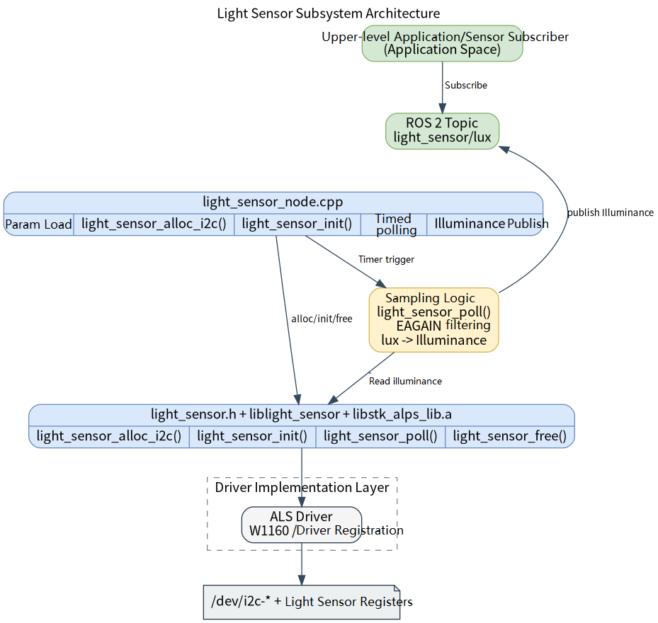

# Basic Sensors · Light Sensor

## 1. Overview

- **Key Features**: The light sensor module sits in the basic-sensor layer of the robot development stack. It wraps the `components/peripherals/light_sensor` I2C ambient light sensor component downward and exposes a ROS 2 node `light_sensor_node` and an illuminance topic upward. The module periodically reads the sensor lux value and publishes it as a standard ROS 2 sensor message for upper-level applications, perception algorithms, or environment-adaptive logic to subscribe to.
- **Specifications and Features** (interface type, rate, resolution, algorithm version, etc.): Reuses the standard message `sensor_msgs/msg/Illuminance` directly. The default topic name is `/light_sensor/lux`; the node name is fixed as `light_sensor_node`; publishing QoS uses `rclcpp::SensorDataQoS()`; the default sampling and publishing frequency is `5 Hz`; the default driver name is `W1160`, the default I2C device node is `/dev/i2c-5`, and the default address is `0x48`. Supports configuring `frame_id`, topic name, variance, and polling frequency via parameters. This module has no custom private `msg/srv` definitions and therefore does not depend on a shared interface package. The underlying layer depends on `light_sensor.h`, the static library `liblight_sensor.a`, the vendor static library `libstk_alps_lib.a`, and the I2C device node `/dev/i2c-*`.
- **Software Block Diagram**:



- **Directory Structure**:

| Path | Responsibility |
| --- | --- |
| `middleware/ros2/peripherals/light_sensor/src/light_sensor_node.cpp` | ROS 2 light sensor node implementation — loads parameters, creates the underlying device, polls periodically, and publishes `Illuminance` |
| `middleware/ros2/peripherals/light_sensor/params/light_sensor_node.yaml` | Default node parameter file — driver name, I2C node, address, topic name, and polling frequency |
| `middleware/ros2/peripherals/light_sensor/CMakeLists.txt` | `peripherals_light_sensor_node` package build file — finds `light_sensor.h`, `liblight_sensor.a`, and `libstk_alps_lib.a` and produces the executable `light_sensor_node` |
| `middleware/ros2/peripherals/light_sensor/package.xml` | ROS 2 package metadata and dependency declarations |
| `components/peripherals/light_sensor/include/light_sensor.h` | Underlying light sensor component C API, declaring initialization, polling, and I2C device allocation interfaces |
| `components/peripherals/light_sensor/src/light_sensor_core.c` | Underlying device object, driver registration, and `light_sensor_alloc_i2c()` dispatch implementation |
| `components/peripherals/light_sensor/src/drivers/drv_i2c_w1160/drv_i2c_w1160.c` | W1160 I2C ambient light sensor driver implementation |
| `components/peripherals/light_sensor/test/test_light_sensor_i2c.c` | Underlying self-test program — useful for ruling out I2C, address, and hardware connection issues first |

## 2. Environment Setup

### Prerequisites

- **Runtime Environment**: Recommended board-side environment is the `k1-deb1` system image, with I2C device node interfaces enabled. ROS 2 Humble is recommended. The build side requires CMake, a C++17 compiler, `ament_cmake`, `rclcpp`, `sensor_msgs`, and the SDK unified build script.
- **Dependencies and External Resources**: This module depends on the Linux I2C character device interface and requires no additional third-party dynamic libraries. The W1160 driver depends on the `src/drivers/drv_i2c_w1160/libstk_alps_lib.a` static library included in the repository, which is automatically linked by `CMakeLists.txt` by default. If the static library is not in the default location, you can specify it at build time with `-DSTK_ALPS_STATIC_LIB=/path/to/libstk_alps_lib.a`.
- **Hardware and Connections**: An ambient light sensor connected via I2C is required; the current implementation focuses on supporting the W1160. Verify that the sensor is correctly powered, SCL/SDA are connected to the corresponding I2C controller on the target board, and confirm the device node path and slave address. The test program defaults to device node `/dev/i2c-5` and I2C address `0x48`.
- **Tools and Permissions**: For troubleshooting, it is recommended to pre-install `apt install i2c-tools` and use `i2cdetect` / `i2cdump` and similar tools for diagnosis.

### Build

- **Getting the Code**: See Section [2.3 Building and Compilation](../../02-快速入门/2.3-构建编译.md) for cloning the full SDK with the `repo` tool. All build and test commands below are run from inside the SDK.
- **Module Compilation**: Build in dependency order — compile the underlying light sensor component first, then the ROS 2 node package.

  ```bash
  source build/envsetup.sh
  
  ./build/build.sh package components/peripherals/light_sensor
  ./build/build.sh package middleware/ros2/peripherals/light_sensor
  ```

  Expected artifacts: `output/staging/lib/peripherals_light_sensor_node/light_sensor_node`, `output/staging/share/peripherals_light_sensor_node/params/light_sensor_node.yaml`, `output/staging/lib/liblight_sensor.a`, and `output/staging/lib/libstk_alps_lib.a`. If the current target is not `riscv64`, use the actual `output/<target>/staging` or `output/staging` path accordingly.

- **Common Differences**: The `CMakeLists.txt` of `peripherals_light_sensor_node` searches for `light_sensor.h` and `liblight_sensor.a`; if `components/peripherals/light_sensor` has not been built first, the error `light_sensor.h or liblight_sensor not found` will appear. Additionally, the node requires `libstk_alps_lib.a` and `liblight_sensor.a` to be in the same `lib/` directory; otherwise it will report `libstk_alps_lib.a not found`. Since the underlying library is a static library and depends on driver registration, the node build uses `--whole-archive` and `-no-pie`; if you modify the build script later, do not remove these two constraints.

## 3. Example Usage (From Scratch)

This section provides a step-by-step path for readers to reproduce the examples from scratch:

### 3.1 Example 1: Start the ROS 2 Light Sensor Node and Observe the Illuminance Topic

**Prerequisites**: Build is complete; the target board is connected to an I2C ambient light sensor; the `device` and `i2c_addr` in the current parameter file match the actual hardware; the current user has access permission to `/dev/i2c-*`.

**Step 1**: Navigate to the SDK source directory and load the runtime environment.

```bash
source output/staging/setup.bash
```

Expected result: `ros2 pkg executables peripherals_light_sensor_node` lists `peripherals_light_sensor_node light_sensor_node`.

**Step 2**: Confirm or edit the parameter file. The default installed parameter file path is:

```bash
output/staging/share/peripherals_light_sensor_node/params/light_sensor_node.yaml
```

The default contents are equivalent to:

```yaml
light_sensor_node:
  ros__parameters:
    driver: "W1160"
    name: "als0"
    device: "/dev/i2c-5"
    i2c_addr: 72

    frame_id: "light_sensor"
    topic_name: "light_sensor/lux"
    poll_hz: 5.0
    variance: 0.0
```

Expected result: If the actual I2C bus is not `/dev/i2c-5`, or the sensor address is not `0x48` (decimal `72`), edit `device` and `i2c_addr` first; otherwise the node will fail to start or continuously have no data.

**Step 3**: Start the light sensor node.

```bash
ros2 run peripherals_light_sensor_node light_sensor_node \
  --ros-args \
  --params-file output/staging/share/peripherals_light_sensor_node/params/light_sensor_node.yaml
```

Expected result: The terminal prints a log similar to the following, indicating the node has started and the underlying device has been initialized.

```text
light_sensor_node ready: driver=W1160 name=als0 device=/dev/i2c-5 addr=0x48 topic=light_sensor/lux poll_hz=5.000
```

**Step 4**: Open another terminal, load the same ROS 2 environment, and subscribe to the illuminance topic. Since the publisher uses `SensorDataQoS`, explicitly specify `best_effort`.

```bash
source output/staging/setup.bash
ros2 topic echo /light_sensor/lux --qos-reliability best_effort
```

Expected result: The terminal shows `sensor_msgs/msg/Illuminance` output such as:

```yaml
header:
  stamp:
    sec: 0
    nanosec: 0
  frame_id: light_sensor
illuminance: 126.0
variance: 0.0
---
```

**Step 5**: Change the ambient light and observe the value change.

Expected result: After blocking the sensor, moving it to a bright environment, or shining a flashlight on it, the `illuminance` field should change noticeably. If no new messages appear for a short time but the node reports no errors, the underlying `light_sensor_poll()` may have temporarily returned `-EAGAIN`; the current node will skip publishing for that cycle.

## 4. Application Development

- **API / Interface**: Upper-level applications primarily subscribe to the ROS 2 topic `/light_sensor/lux` with message type `sensor_msgs/msg/Illuminance`. Message fields include `std_msgs/Header header`, `float64 illuminance`, and `float64 variance`. The current node does not provide services or actions; illuminance values are continuous sensor data suited for streaming distribution via topics.
- **Usage and Notes** (threading, permissions, resource cleanup, etc.):
  - The node actively calls `light_sensor_poll()` on a timer to poll the underlying data, rather than being driven by underlying interrupts or callbacks.
  - The publisher uses `rclcpp::SensorDataQoS()`; on some ROS 2 tools or custom subscribers, if the default `reliable` QoS is used, data may not be visible. Subscribers should explicitly use sensor-data-compatible QoS.
  - `driver` and `name` are combined to form the underlying instance name — e.g. the default combination is `W1160:als0`. If `driver` does not exist, `light_sensor_alloc_i2c()` fails and the node exits with `light_sensor_alloc_i2c failed`.
  - Parameter constraints: `i2c_addr` must be in `[0, 127]`; `poll_hz` must be greater than `0`; `variance` must be greater than or equal to `0`; `device`, `driver`, and `name` must not be empty.
  - The current ROS 2 node only wraps `light_sensor_alloc_i2c()`, so the supported path is for I2C sensors. The current repository includes the generic I2C wrapper driver `I2C` and the W1160 driver `W1160`; the default and validated path is `W1160`.
  - When the underlying `light_sensor_poll()` returns `-EAGAIN`, the node skips publishing for that cycle and prints no warning; only when other error codes are returned does it throttle-print `light_sensor_poll failed` once every `2 s`. Therefore "the node is running but occasionally has no new messages" does not necessarily indicate an error.
  - When the node destructs, it automatically calls `light_sensor_free()` to release underlying resources; applications only need to exit `light_sensor_node` normally and do not need to directly manage the underlying lifecycle.
- **Reference demos and example paths**: `middleware/ros2/peripherals/light_sensor/README.md`, `middleware/ros2/peripherals/light_sensor/params/light_sensor_node.yaml`, `middleware/ros2/peripherals/light_sensor/src/light_sensor_node.cpp`, `components/peripherals/light_sensor/test/test_light_sensor_i2c.c`.

## 5. Debugging Guide

- **Rule out I2C and hardware issues with the low-level component first**: run `./build/build.sh package components/peripherals/light_sensor` from the `robotics_sdk` root directory, then run `sudo output/staging/bin/test_light_sensor_i2c /dev/i2c-5 0x48` on the target board. If even the low-level `test_light_sensor_i2c` cannot stably print lux values, prioritize checking the I2C bus number, device address, power supply, and wiring.
- **Use `i2cdetect -y 5`**, `i2cget`, and similar tools to confirm the device appears on the expected bus. If the node reports `light_sensor_init failed` at startup, common causes are an incorrect device node, wrong address, insufficient I2C permissions, or a failed W1160 driver initialization.
- **Observe the node startup log**: a normal startup prints `light_sensor_node ready`. If a parameter is invalid, the program prints `light_sensor_node exception: ...` to stderr — common messages include `i2c_addr must be in [0, 127]`, `poll_hz must be > 0`, and `variance must be >= 0`.
- **Observe the ROS 2 graph and topics**: use `ros2 node list` to confirm `/light_sensor_node` exists, `ros2 topic list | grep light_sensor` to confirm the topic exists, `ros2 topic echo /light_sensor/lux --qos-reliability best_effort` to view data, and `ros2 topic hz /light_sensor/lux` to roughly observe the actual publishing rate.
- **If the node is running but has no messages and no errors**, consider the possibility that the underlying layer is continuously returning `-EAGAIN`. This typically means the driver currently has no new sample ready; first lower `poll_hz`, then use the underlying test program to observe whether valid data can be obtained.

## 6. FAQ

None at this time.
