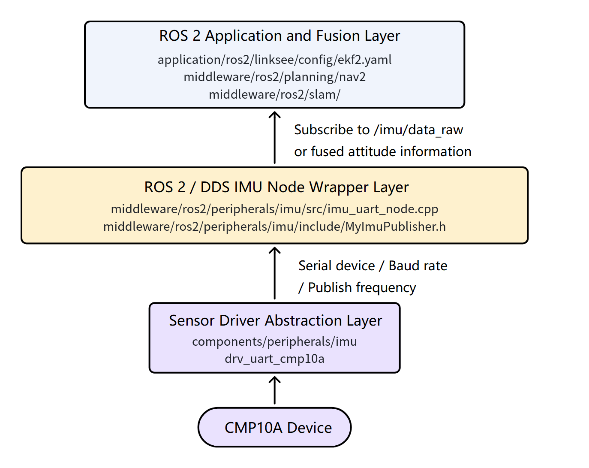
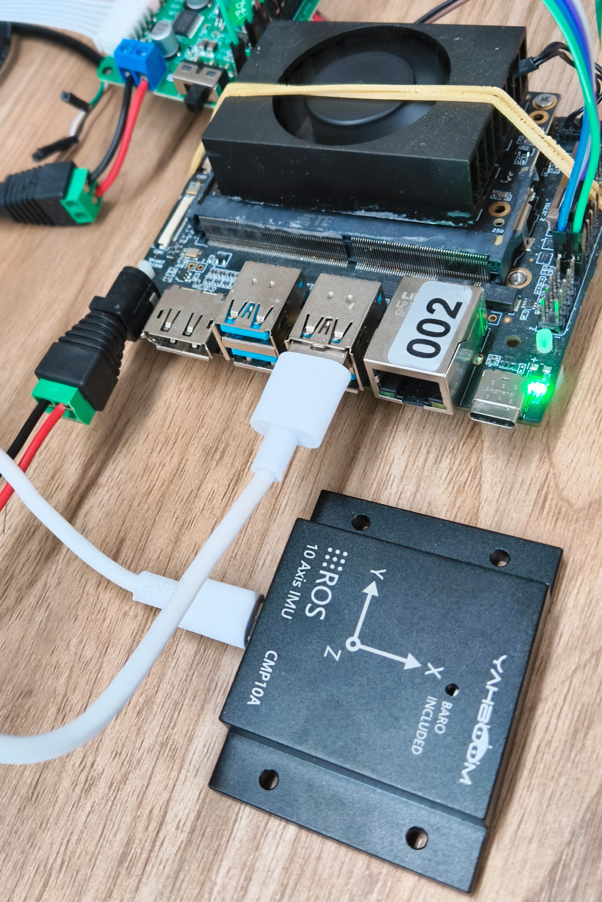
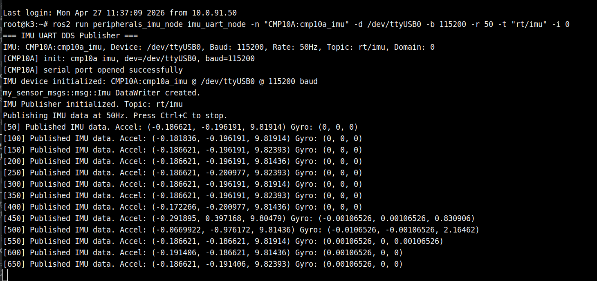
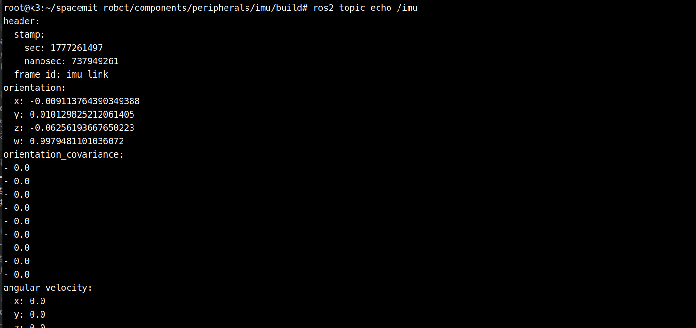

# Basic Sensors · IMU

## 1. Overview

- **Key Features**: This module provides unified IMU integration capability within the project. It reads inertial data such as acceleration, angular velocity, and attitude from the underlying `CMP10A` serial IMU, and publishes it via ROS 2 / DDS for upper-level localization, state estimation, and navigation modules. In the current project, the IMU primarily serves the `linksee` mobile robot solution, working with chassis odometry to provide heading angle and angular velocity inputs to modules like `robot_localization`.
- **Specifications and Features**:
	- Current default driver: `drv_uart_cmp10a`
	- Interface type: UART serial IMU
	- Default baud rate in component-level examples: `115200`
	- ROS 2 node: `peripherals_imu_node/imu_uart_node`
	- Default DDS topic: `rt/imu`
	- ROS-side IMU topic subscribed by `linksee` EKF configuration: `/imu/data_raw`
	- Typical output frequency in component-level test programs: `50Hz` for `CMP10A`; ROS 2 node supports adjustable publish frequency via parameters
- **Software Architecture**: The IMU position in the ROS 2 usage chain within the current project:



- **Directory Structure**:

| Path | Responsibility |
| --- | --- |
| `components/peripherals/imu/` | IMU component abstraction layer, unified management of different IMU drivers |
| `components/peripherals/imu/src/drivers/drv_uart_cmp10a.c` | `CMP10A` serial driver implementation |
| `components/peripherals/imu/test/test_imu_uart.c` | Component-level minimal serial IMU test program |
| `middleware/ros2/peripherals/imu/` | ROS 2 / FastDDS node wrapper for IMU |
| `middleware/ros2/peripherals/imu/src/imu_uart_node.cpp` | Node for reading IMU serial data and publishing DDS messages |
| `application/ros2/linksee/config/ekf2.yaml` | EKF fusion configuration in `linksee` solution, includes IMU fusion parameters |
| `target/k3-com260-linksee.json` | `linksee` target board configuration, enables `components/peripherals/imu` and `drv_uart_cmp10a` by default |

## 2. Environment Setup

### 2.1 Prerequisites

- **Getting the Code**

  For SDK source code acquisition and basic build environment configuration, refer to [Linksee Reference Solution](../../03-参考方案/3.2-轮式机器人Linksee.md). After completing SDK initialization, return to this document to continue.

- **Runtime Environment**:
	- Recommended board environment: `k3-com260` + project-supported system image
	- ROS2 version: ROS 2 Humble
- **Dependencies and External Resources**:
	- ROS 2 Humble base environment installed: `sudo apt install ros-humble-ros-base`
	- IMU low-level library provided by `components/peripherals/imu`; ROS 2 node depends on this library
- **Environment Variables and Initialization**:

   ```bash
   source ~/spacemit_robot/output/staging/setup.bash
   ```

- **Hardware and Connections**:
  
  - Board type: `k3-com260` or compatible board
  - Peripheral: `CMP10A` serial IMU
  - Connection method: Connect via onboard serial port or USB-to-serial adapter, mapped to `/dev/ttyUSB*` or `/dev/ttyS*`
  - Before use, confirm stable power supply, secure wiring, and clarify the relationship between IMU mounting orientation and body coordinate system

- **Tools and Permissions**:
  - Serial device access permissions required
  - Common debugging tools include `ros2 topic list`, `ros2 topic echo`, `rviz2`, `grep`
  - If serial permission is insufficient, add the current user to the `dialout` group or temporarily adjust device permissions

### Build

- **Module Compilation**:

  ```
  cd ~/spacemit_robot/
  source build/envsetup.sh
  lunch # Select linksee solution
  m # Full build
  ```

- **Build Artifacts**:
	- After full repository build, the runtime environment is located in `output/staging/`
	- Component-level test program generates `test_imu_uart`
	- ROS 2 executable is `imu_uart_node`
- **Common Differences**:
	- Component-level README examples typically use baud rate `115200`, while the ROS 2 node source code default parameter is `9600`. For actual hardware operation, use the sensor's actual configuration and explicitly pass `-b 115200`
	- No separate IMU launch file found in current `linksee` project; typically need to manually start the IMU node and then connect to EKF or other upper-level modules

## 3. Example Usage

This section focuses on ROS 2 usage within the current project. Example commands follow the environment setup and runtime habits of the `linksee` solution.

**Prerequisites**: IMU correctly connected to the board, actual serial device node confirmed (e.g., `/dev/ttyUSB0`)

**All terminals need to load the `linksee` runtime environment**

```bash
source ~/spacemit_robot/output/staging/setup.bash
```

**Step 1: Start IMU ROS 2 / DDS Node**

Open a new terminal and run:

```bash
ros2 run peripherals_imu_node imu_uart_node -n "CMP10A:cmp10a_imu" -d /dev/ttyUSB0 -b 115200 -r 50 -t "rt/imu" -i 0
```

**Expected Output**: Terminal prints `IMU device initialized`, `IMU Publisher initialized`, and other logs, outputting publish status at the configured frequency.

Terminal output:



**Step 2: Check IMU Topic or Bridged ROS-Side Topic**

```bash
ros2 topic list | grep imu
```

If a DDS-to-ROS 2 bridge exists in the system, run:

```bash
ros2 topic echo /imu
```

**Expected Output**: You should see `sensor_msgs/msg/Imu` type data, and `imu0: /imu/data_raw` in `application/ros2/linksee/config/ekf2.yaml` can connect to it.

Terminal output:



### Parameter Description

| Option | Variable | Type | Default | Description |
| --- | --- | --- | --- | --- |
| `-n` | imu_name | `const char*` | `"CMP10A:cmp10a_imu"` | IMU device name, passed to low-level imu_alloc_uart() |
| `-d` | dev_path | `const char*` | `"/dev/ttyUSB1"` | Serial device path |
| `-b` | baud | `uint32_t` | `9600` | Serial baud rate |
| `-r` | rate | `uint32_t` | `50` | IMU sampling and publish frequency in Hz. Valid range `1-1000` |
| `-t` | topic_name | [std::string] | `"rt/imu"` | DDS publish topic name for IMU |
| `-i` | domain_id | `int` | `0` | DDS domain ID |
| `-h` | - | - | - | Display help information and exit |

## 4. Application Development

- **API / Interface**:
	- Component-level C API: `imu_alloc_uart`, `imu_init`, `imu_read`, `imu_free`
	- ROS 2 executable entry point: `ros2 run peripherals_imu_node imu_uart_node`
	- Default DDS topic: `rt/imu`
	- ROS topic in `linksee` fusion configuration: `/imu/data_raw`
	- Key configuration file: `application/ros2/linksee/config/ekf2.yaml`
- **Usage and Notes**:
	- Serial device, baud rate, and publish frequency should always be explicitly specified via command line; do not rely entirely on default values
	- `imu_uart_node` automatically releases `imu_dev_` on exit, but pay special attention to read failures and restart recovery when serial device is unplugged unexpectedly
	- If IMU mounting orientation does not align with body coordinate system, correct through low-level `mounting_matrix` or upper-level coordinate transform
	- When used with `robot_localization`, confirm IMU data meets REP-103/REP-105 coordinate conventions, especially heading direction, angular velocity units, and whether gravity acceleration is removed
	- In current project, `provider_odom.lua` contains `TRAJECTORY_BUILDER_2D.use_imu_data = false`, indicating not all SLAM chains enable IMU by default; verify specific upper-level module configuration before integration
- **Reference Demo / Example Path**:
	- `components/peripherals/imu/README.md`
	- `components/peripherals/imu/test/test_imu_uart.c`
	- `middleware/ros2/peripherals/imu/README.md`
	- `middleware/ros2/peripherals/imu/src/imu_uart_node.cpp`
	- `application/ros2/linksee/config/ekf2.yaml`
	- Chassis and odometry startup commands in [3.2-轮式机器人Linksee.md](../../03-参考方案/3.2-轮式机器人Linksee.md)

## 5. Debugging Guide

- **Verify serial port first, then ROS 2**: Run `test_imu_uart` first to confirm hardware link is working, then start `imu_uart_node`. Avoid troubleshooting EKF or navigation issues when the low-level is not yet working.
- **Double-check serial parameters**: Component-level `CMP10A` documentation defaults to `115200`, while ROS 2 node default parameter is `9600`. Forgetting to explicitly pass `-b 115200` commonly results in node starting but with abnormal data or read failures.
- **Prioritize topic and configuration consistency**: `linksee`'s `ekf2.yaml` subscribes to `/imu/data_raw` by default, while IMU ROS 2 node README publishes to `rt/imu` by default. Without bridging or remapping, EKF will not receive IMU data.
- **Common Check Commands**:
	- `ls -l /dev/ttyUSB0`: Confirm device node exists
	- `ros2 topic list | grep imu`: Confirm IMU-related topics appear
	- `ros2 topic echo /imu/data_raw`: Confirm ROS-side has standard IMU messages
	- `grep -n "imu0" ~/spacemit_robot/application/ros2/linksee/config/ekf2.yaml`: Quick verification of EKF input configuration
- **When debugging with hardware/kernel colleagues, collect**:
	- IMU model, wiring method, device node, baud rate
	- Sensor mounting orientation and whether coordinate transform was applied
	- Raw acceleration/angular velocity output at rest
	- ROS 2 node logs, low-level test program logs
	- Current bridging chain or topic remapping method

## 6. Common Issues

| Symptom | Possible Cause | Resolution |
| --- | --- | --- |
| `imu_uart_node` startup shows `Failed to allocate IMU device` | Serial device does not exist, insufficient permissions, or incorrect device path | Check if `/dev/ttyUSB*` or `/dev/ttyS*` exists; <br>confirm user has permission to access serial port; <br>adjust device permissions or add to `dialout` group if necessary |
| Node starts successfully but IMU data is abnormal with significant attitude jumps | Baud rate does not match sensor's actual setting | Do not use default value; <br>explicitly specify `-b 115200` and keep consistent with host or sensor configuration |
| No IMU fusion effect after EKF starts | IMU node output topic does not match `ekf2.yaml` configuration | Verify if bridging, remapping, or conversion exists between `rt/imu` and `/imu/data_raw`; ensure EKF actually subscribes to data |
| Heading continuously drifts at rest | Large gyro zero bias, incorrect mounting orientation, or inconsistent coordinate conventions | First observe raw data with low-level test program; <br>perform zero-bias calibration if necessary; <br>check mounting orientation and coordinate system transform |
| Still unstable after starting navigation or mapping | Skipped low-level verification; IMU, odometry, lidar chains not validated step-by-step | Verify in sequence: IMU raw readings → ROS 2 topic → EKF fusion → mapping/navigation |
